# C语言编程：4.2：递归与C预处理器 🧠

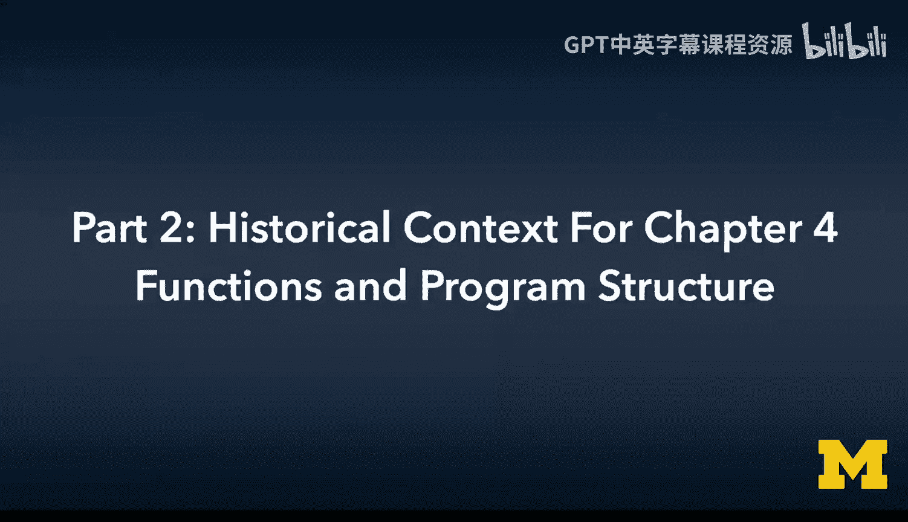

在本节课中，我们将学习两个核心概念：**递归**和**C预处理器**。递归是函数调用自身的一种技术，而C预处理器则是在编译前对源代码进行处理的工具。我们将通过简单的例子来理解它们的工作原理和实际应用。

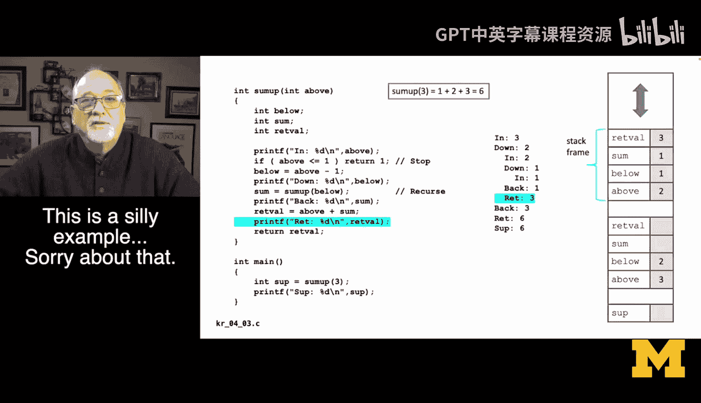

---


## 递归：函数调用自身 🔄

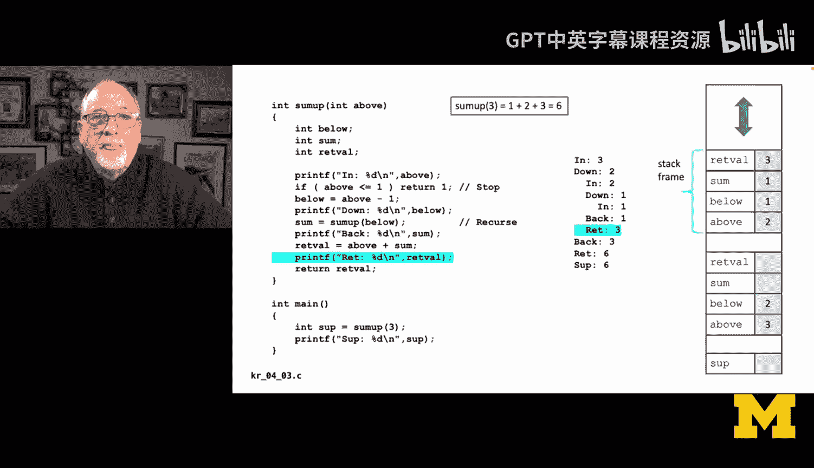

上一节我们介绍了函数的基本概念，本节中我们来看看一种特殊的函数调用方式——递归。

当一个函数调用自身时，这种行为被称为**递归**。递归是一个强大且优雅的概念。在处理树状结构（例如解析XML）时，递归是一种非常优雅的编码方式。

然而，初学者常看到的递归示例往往效率低下，并且可能误导你对递归用途的理解。本节的目标并非展示递归的最佳实践，而是通过一个简单（甚至有些刻意）的例子，来演示**调用栈**如何工作，以及递归如何与调用栈交互。

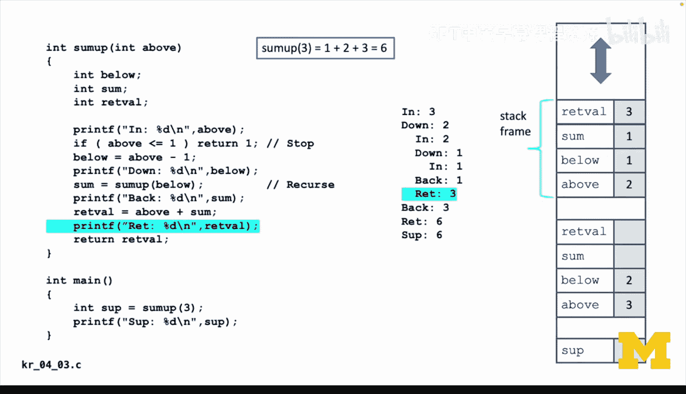

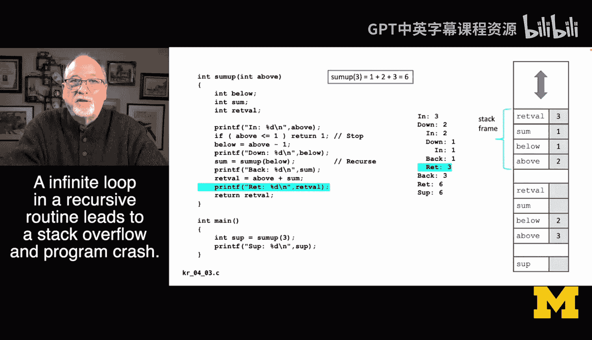

### 一个递归求和示例

以下是一个计算从1加到n的递归函数。例如，输入3，函数将计算1+2+3并返回6。当然，有更高效的方法（甚至代数公式）可以完成这个任务，但我们用此例来演示递归。

```c
int sum_up(int above) {
    int below, sum, retval;
    below = above - 1;
    if (above <= 1) {
        return 1; // 递归的“基线条件”，用于停止递归
    }
    sum = sum_up(below); // 递归调用自身
    retval = above + sum;
    return retval;
}
```

### 递归与调用栈的工作原理

理解递归的关键在于理解**调用栈**。每次函数调用（包括递归调用）都会在内存中创建一个新的**栈帧**。

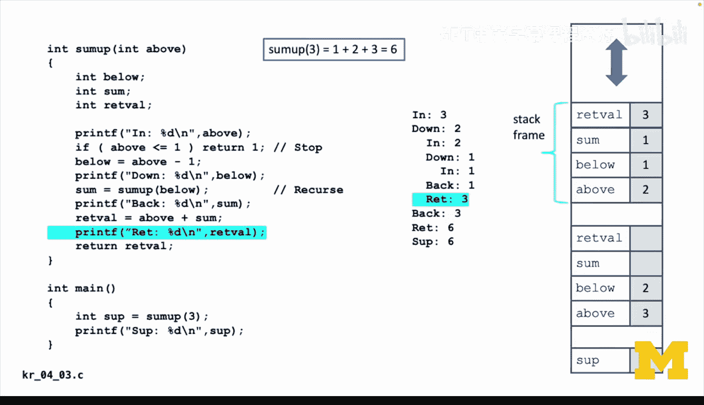

以下是递归调用 `sum_up(3)` 时，栈帧变化的简化过程：

1.  **`main` 调用 `sum_up(3)`**：创建第一个栈帧，其中 `above = 3`。
2.  **`sum_up(3)` 调用 `sum_up(2)`**：因为 `above=3` 不满足停止条件，它计算 `below=2` 并递归调用 `sum_up(2)`。此时，`sum_up(3)` 的栈帧被**暂停**，创建 `sum_up(2)` 的新栈帧。
3.  **`sum_up(2)` 调用 `sum_up(1)`**：同理，创建 `sum_up(1)` 的新栈帧。
4.  **`sum_up(1)` 触发基线条件**：`above=1` 满足 `above <= 1`，函数直接返回 `1`。`sum_up(1)` 的栈帧被销毁，控制权返回给 `sum_up(2)`。
5.  **`sum_up(2)` 恢复执行**：它收到 `sum_up(1)` 的返回值 `sum=1`，计算 `retval = above(2) + sum(1) = 3`，然后返回 `3`。其栈帧被销毁，控制权返回给 `sum_up(3)`。
6.  **`sum_up(3)` 恢复执行**：它收到 `sum_up(2)` 的返回值 `sum=3`，计算 `retval = above(3) + sum(3) = 6`，然后返回 `6` 给 `main` 函数。

**核心要点**：
*   递归的本质是**利用调用栈**。每次调用都创建一个包含参数和局部变量的新栈帧。
*   必须有一个**基线条件**（如 `if (above <= 1)`）来终止递归，否则会导致无限递归和**栈溢出**错误。
*   从思维上，理解栈帧的创建和销毁，比单纯理解递归代码本身更容易把握递归的执行流程。

---

## C预处理器：源代码的“预处理” 🔧

了解了程序运行时的结构后，我们来看看编译前的一个关键步骤——预处理。C预处理器在某种程度上独立于函数和程序结构，但它又是程序结构的重要组成部分。

C语言因其可移植性而强大，但硬件架构、操作系统和库函数会随着时间演变。例如，整型的位数（16位、32位、64位）、文件读取的库函数调用方式都可能不同。

预处理器提供了一种“打补丁”的方式，让你能根据不同的编译环境（如不同的操作系统、架构）生成稍有不同的C源代码，而无需手动修改核心逻辑代码。

### 预处理器的作用

预处理器**不是编译器**，它是一个**源代码到源代码的转换器**。它在编译器开始工作之前运行。

主要指令包括：
*   `#include`：包含头文件。
*   `#define`：定义宏或常量。
*   `#ifdef`, `#ifndef`, `#endif`：条件编译。

### 预处理器示例

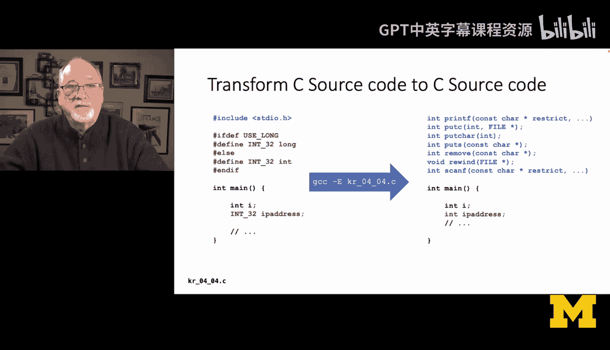

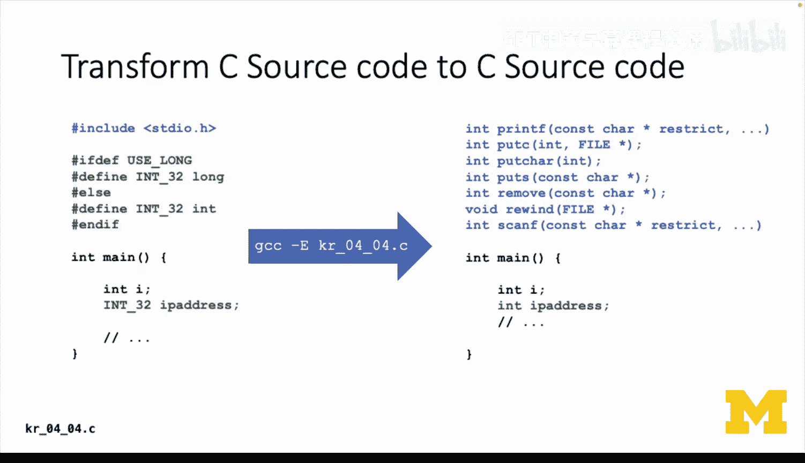

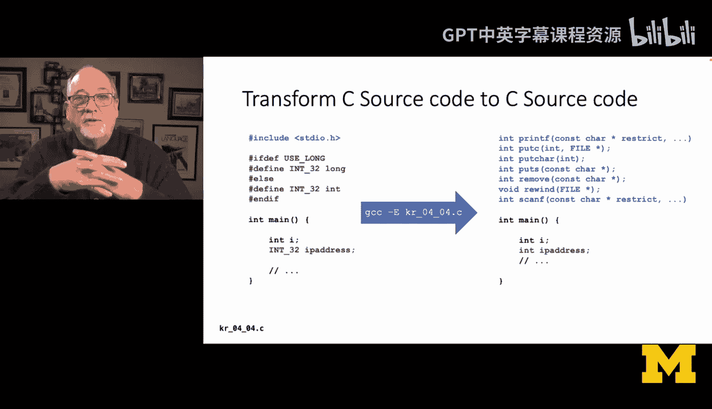

**1. 头文件包含 (`#include`)**
当你写下 `#include <stdio.h>`，预处理器会找到这个文件，并将其内容**原地展开**，替换掉这行指令。你可以使用 `gcc -E` 命令只运行预处理器，查看展开后的代码。

**2. 条件编译与宏替换**
以下代码展示了如何让同一份源代码适应不同环境：

```c
#define USE_LONG // 这行可以注释或取消注释来改变行为

#ifdef USE_LONG
    #define INT_32 long
#else
    #define INT_32 int
#endif

INT_32 ip_address; // 预处理器会根据USE_LONG的定义，将INT_32替换为long或int
```
在这个例子中，`INT_32` 是一个**编译时常量字符串**。预处理器会在编译前，根据 `USE_LONG` 是否被定义，将代码中所有的 `INT_32` 替换成 `long` 或 `int`。这样，开发者就能确保 `ip_address` 变量在不同平台上都是32位整数。

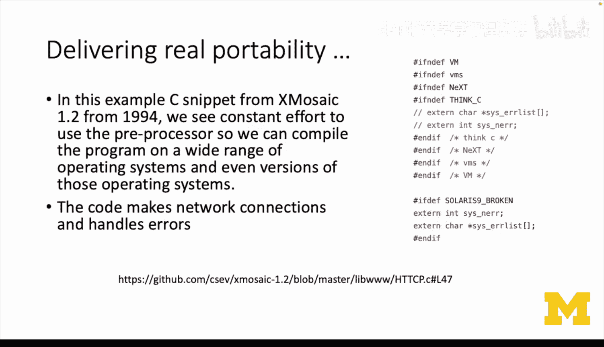

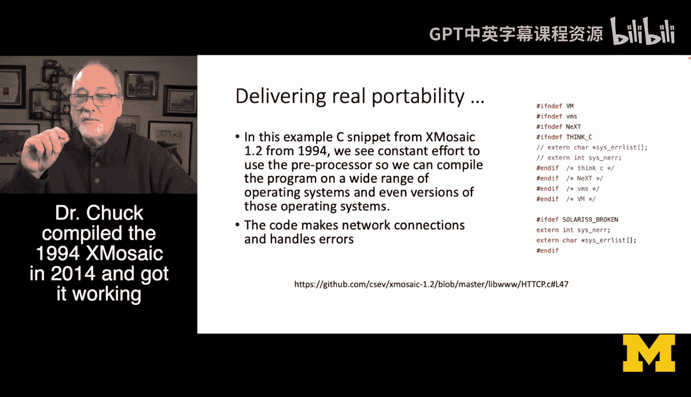

### 预处理器在实际项目中的应用：以早期网页浏览器为例

查看1994年X Mosaic网页浏览器（首个跨平台浏览器）的部分网络连接代码，会发现大量 `#ifdef` 指令。这是因为当时不同操作系统（如SunOS, VMS, NeXT）的网络库实现存在差异。

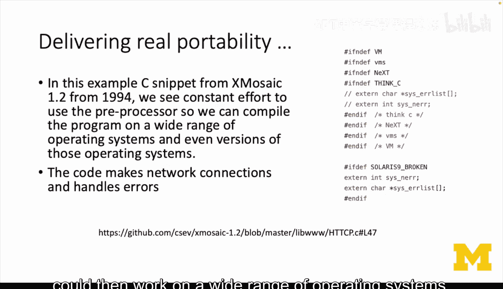

例如，错误信息的获取方式可能不同：有的系统使用函数返回值，有的则写入特定的全局变量（`extern`变量）。通过条件编译，同一份C源代码可以根据目标操作系统的不同，编译出适配的代码段，从而实现真正的跨平台。

```c
#ifdef VMS
    // VMS操作系统特定的错误处理代码
#elif defined(NeXT)
    // NeXTSTEP操作系统特定的错误处理代码
#else
    // 其他Unix系统的标准错误处理代码
#endif
```
这体现了C语言可移植性的另一面：**语言本身是稳定的，但运行环境在变化**。预处理器帮助我们让代码能“穿越时间”，在多年后和不同的系统上依然可以编译运行。虽然如今许多库已标准化，但条件编译在系统编程和跨平台项目中仍然重要。

---

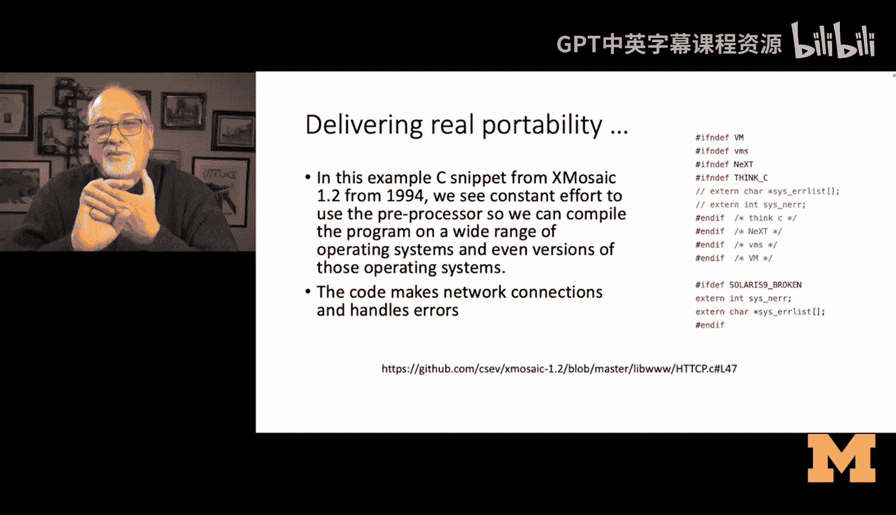

## 总结 📚

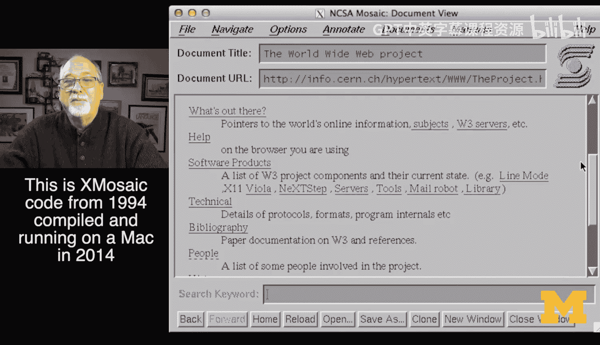

本节课中我们一起学习了：
1.  **递归**：函数调用自身的技术。其核心在于**调用栈**的管理，每次调用产生一个栈帧，并且必须设有**基线条件**以防止无限递归。
2.  **C预处理器**：在编译前处理源代码的工具。它通过 `#include` 展开文件、通过 `#define` 进行宏替换、通过 `#ifdef` 等实现条件编译，极大地增强了C代码在不同平台和不同时期的**可移植性**。

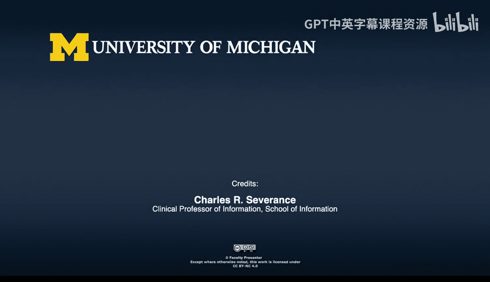

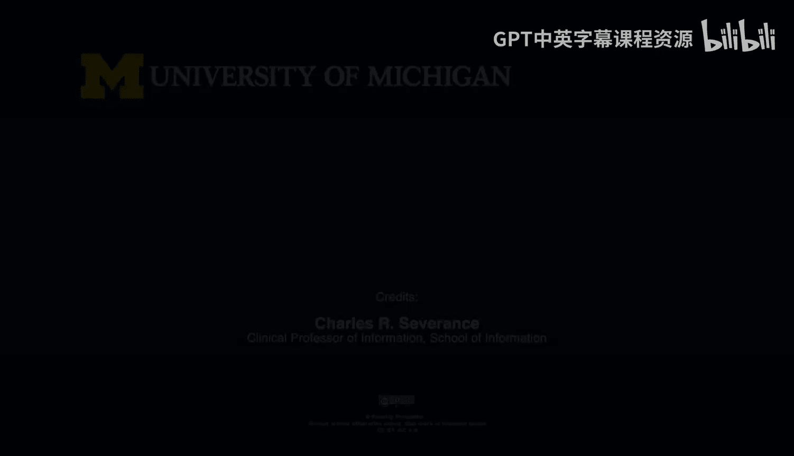

理解递归有助于你编写处理分层或树形数据的优雅代码，而掌握预处理器则能让你更好地管理和维护需要适应多种环境的C语言项目。