# 密歇根大学《给所有人的C语言编程课（了解C、用C编程、数据结构、创建对象）｜C Programming for Everybody》 p16 1_01_03_第1部分-第5章指针与函数的历史背景.zh_en -BV1v2421P7pt_p16-

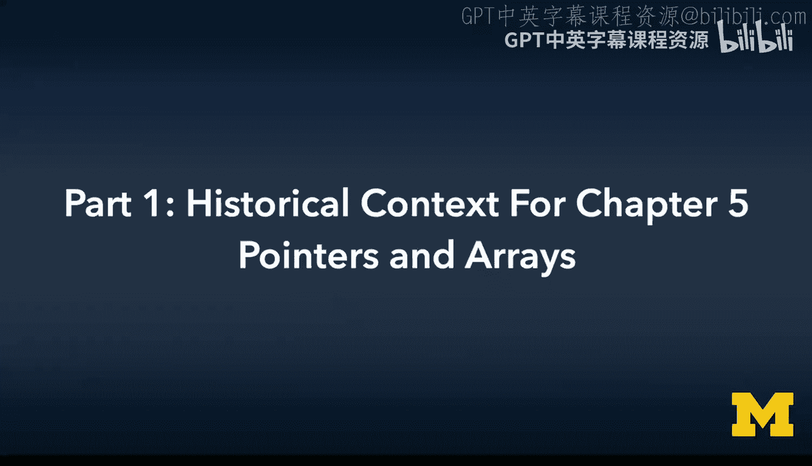

Hello and welcome to our lecture on Carnegan Ritchie Chapter 5， putting some context around it。

 Chapter 5 is functionss and program structure。So the first thing I want to call your attention to is section 5。

1。 I actually think that section 5。1 is the most poignant and beautiful section in the book。

Everything you've learned up till now， everything I've talked about， size of data， et cetera。

 has LED to the point where you can read 5。1 and understand every word of it。

 You should enjoy reading it。I think of it as like a love letter from the creators of C to future computer scientists。

So 5。1 is important， we'll talk a little bit about pointer arithmetic 5。

6 we'll look at sort of the duality between pointers and integers。

 then we'll hit call by reference and call by value that are enabled in C by pointers and then look at the biggest security hole that C has caused over the past。

40 plus years buffer overflow。 Now the the chapter gets a little dense in some of the sections。

 And so I'll just have you skim some of those sections。 This is the essential example。

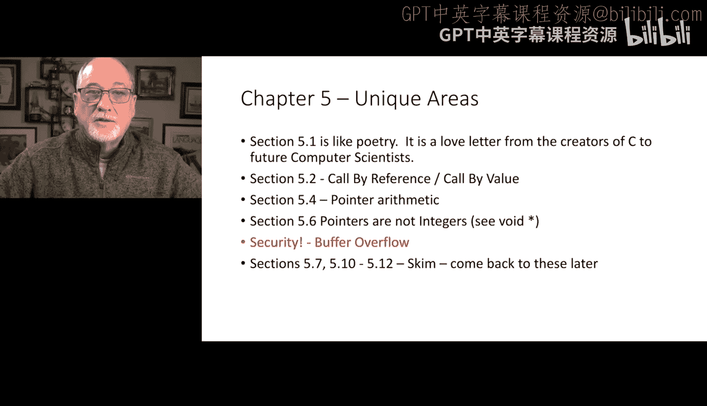

Of。Pointers。We have two variables， int x and y， we have a variable px， which is of type pointer。

It points to an integer， that's what in star means， we store 42 in x。

 and we store the address of X into Px using the Ampersand operator。

 and then we use the address of X， which is in PX， and then we use a lookup operator or a dereference operator。

 star PX， it says go to the memory location point2 by PX and load me an integer and put that into Y。

And so we can see when we print out x is 42 and y is 42 and px is a long hexadeadecimal number that is some memory location inside the asville computer。

 and so Ampersent and asterisk and int star， the star as a sort of a modifier for a type are the important things。

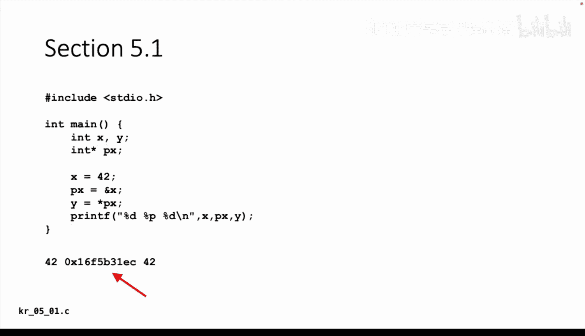

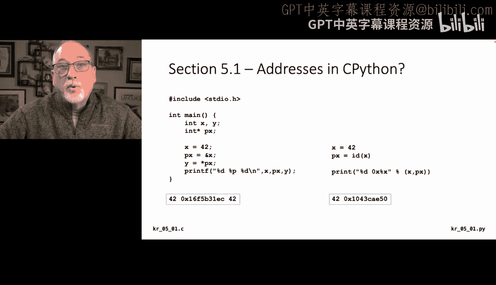

One of the things that you've probably never seen in Python is the I function。

 We've used functions like type and Dur。 And there are ways for us to inquire about variables and constants。

 Id is a way to ask for the I of something。 now in C Python。 and just to be clear。

 there are multiple versions of Python。 C Python is the classic one。

 It's the implementation of Python that happens to be written in C。

 There are other implementations of Python。

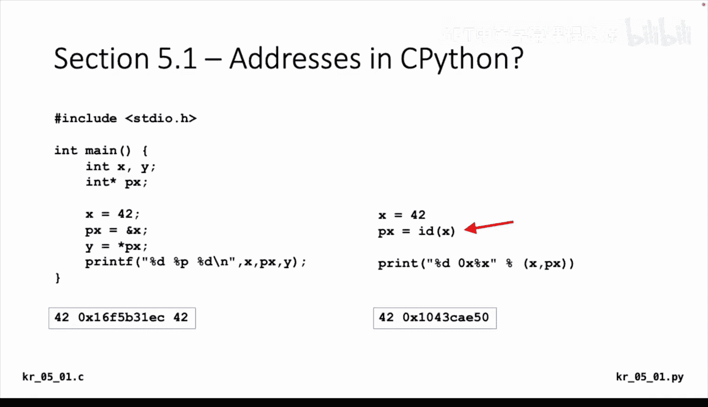

And so what I'm telling you with this ID function is something that will work。

For the moment in C Python， but not necessarily every other one。

If you print it out and you say what is X and what is the ID of X， it's kind of like the address。

 And if you look at the documentation， it says， don't think this is the address right。

 it says the Python I function is not intended to be dereferenceable。

 meaning we're not supposed to look up memory from that。

 The fact that it's based on the memory address a C Python implementation detail that other Python implementations do not follow。

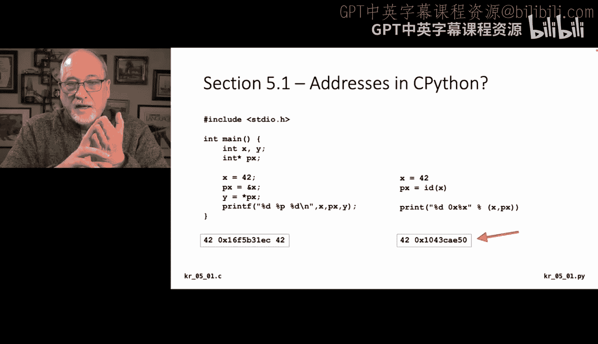

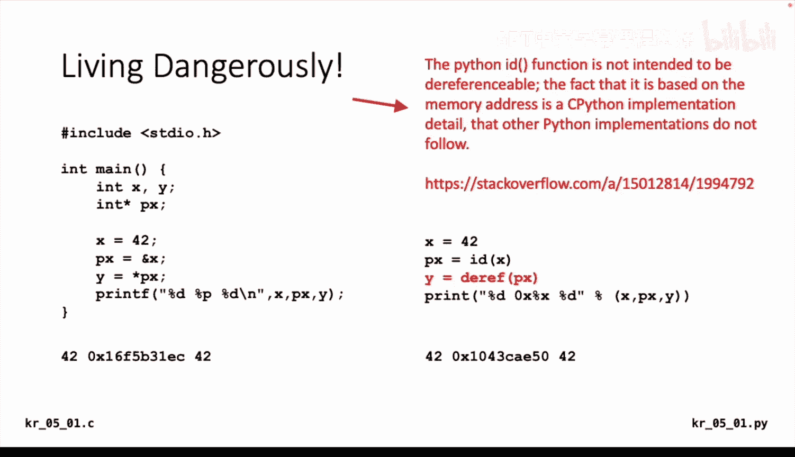

Now， if you download the source code KR0501。 py， I actually have a completely unauthorized implementation of a lookup a dereence。

 and it has to know the type of the thing that it's dereencing y equals D ref of PX。

 and it can then give me back that integer pointed to by the address。

 but this is not guaranteed to work it's not supposed to be how it works。

It just is there is kind things have addresses and in C Python。

 at least for this particular version of Python that I'm using， you can use them。

Pointters gives us the ability to do call by reference。 And so， you know， if you've done Python。

 you see that we have had a slide in an earlier version of my Python class that said，Sorry。

 Python doesn't do call by reference， it only does call by value。

 and that means that within a function， you change the parameters and nothing happens。

 but some languages do have call by reference， which means the parameters that come into a function are somehow handles that allow us to actually change the values in the main programmer or where we've been calling from。

So the language Pascal and C and C++ PhHP and C sharpp have this notion a formal notion of call by reference。

And languages that don't have it are like Python and Java and JavaScript。

Now there is a notion the fact that I said this is for simple types like integers。

Objects are passed in， but then if you call methods and objects you can actually change the data that the object has。

 but it's not like you're changing the object you're changing the object's data。

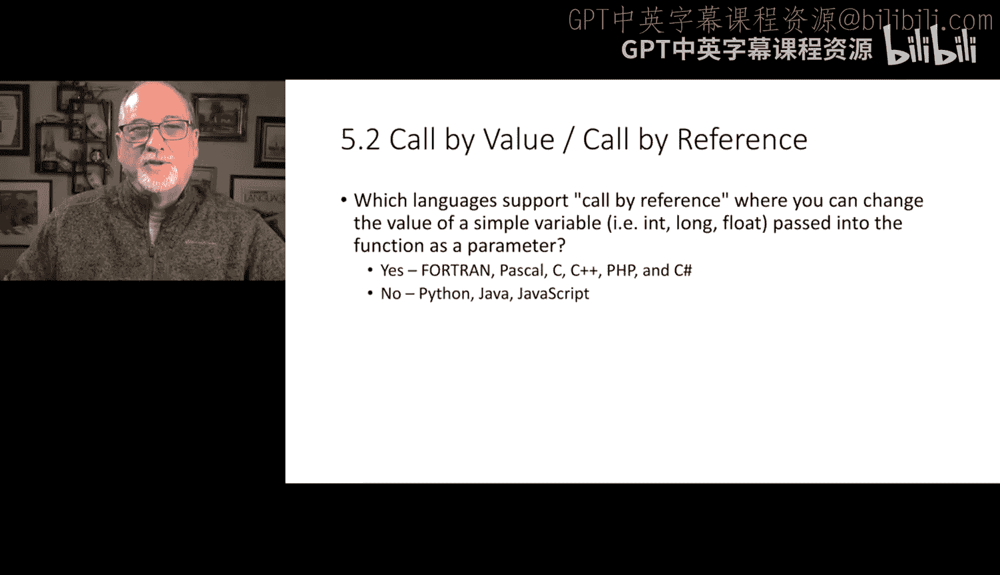

So let's take a look at a bit of code Now the first example is actually Pacal Now Pascal' is a programming language it was written by Nicholas Verth in Switzerland in 1970 and it had a called by reference and it had this notion of R and so you're creating a function name funk takes two parameters one is a call by value which is a and then the other one's called by reference which is a B。

 and we set a and B to two new numbers and then in the main program we set x equals 42 y equals 43 and then we call the function and you'll notice there's no extra like syntax in the function and then we come back and you will see that the y variable is changed and the x variable is not and then the C version of this we have x equals 42 y equals y equals 43 and then when we call funk。

We say we're going to pass in x and then ampersand y， which is the address of y。

 And if you go back to the very first example in section 5。1。

 we're passing in a number which we're actually passing in by value， but the value is the address。

 and then inside the function we take A， and then a pointer to B， Pb。

And we say that A is just an integer， and Pb is an address of an integer by adding the little asterisk there。

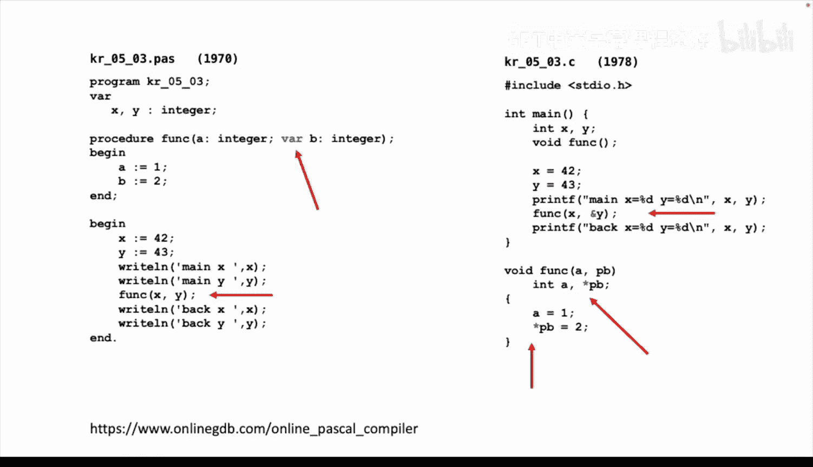

So the address where it's at has been passed by value。But using that value。

 we can dereference it and get to the thing， so we say a equals 1。

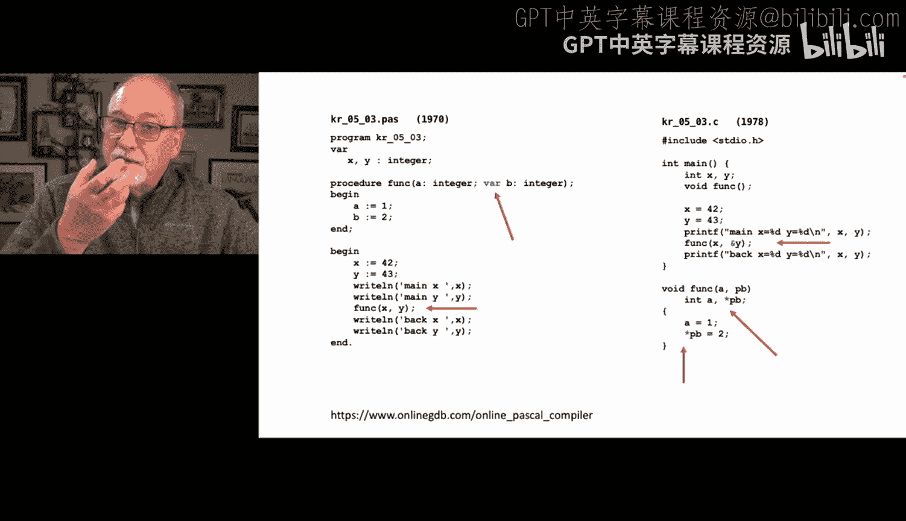

And we say star Pb equals 2， that says store2。As an integer into the location pointed to by PB。

 And then when you come back， the second parameter will have been changed， Y will have been changed。

 and X will not be changed。 If we take a look at a few other languages。

 So here we have the C code again。Python 1989 doesn't have the notion to pass by reference。

 and so one of the things that I think is an excellent compromise that is the case in Python is the notion of returning a tuple。

 not just a single value but a tuple return and so that way we could。

 if we really wanted to get back a value more than one value。

 we could return a tuple and then in the main program。

 we assign the tu so if we really wanted x and y to change。From inside the function。

 we could do so by just explicitly saying function is going to return two values and we're going to change them both and if we look at PhHP。

 which is 1994， we see a very elegant I think whenever you look at PhP you got to realize the dollar sign is just part of the variable name that's just the first character of all variables in PhP。

So what we do inside a function is we say ampersand dollar B。

 which is the second parameter is B dollar B， and we're expecting to change it。

 and you'll note that we don't change the syntax inside the function。

 dollar B equals 2 dollar a equals 1， the syntax doesn't change。

And when we make the call funk dollar X， comma dollar y。

 we don't change that either and yet call by reference works。 So if you look at all these examples。

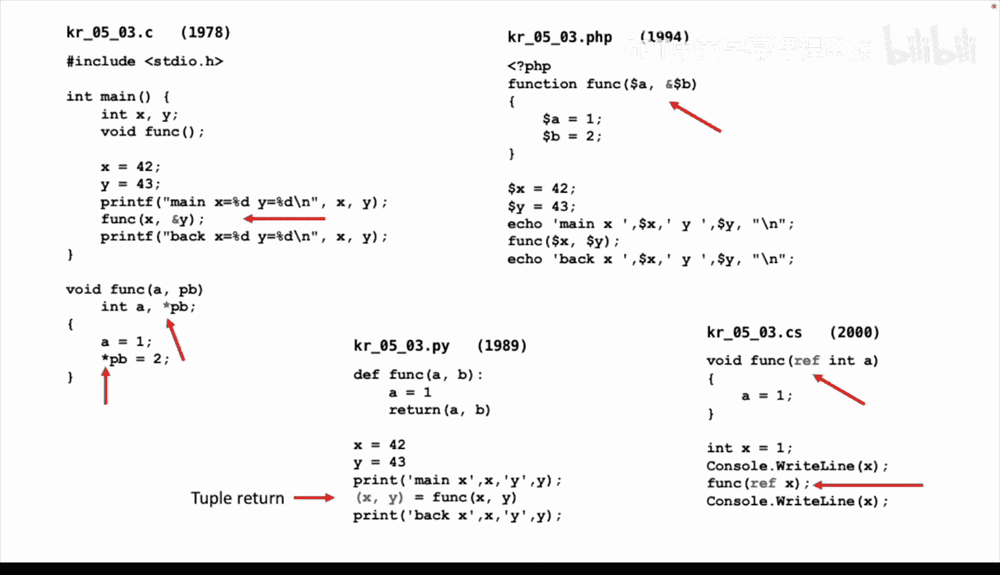

Other than the weird dollar sign convention， I would say that the simplest and most elegant is probably the PhHP implementation。

 because we don't have to do anything inside the function except I'm planning on changing this。

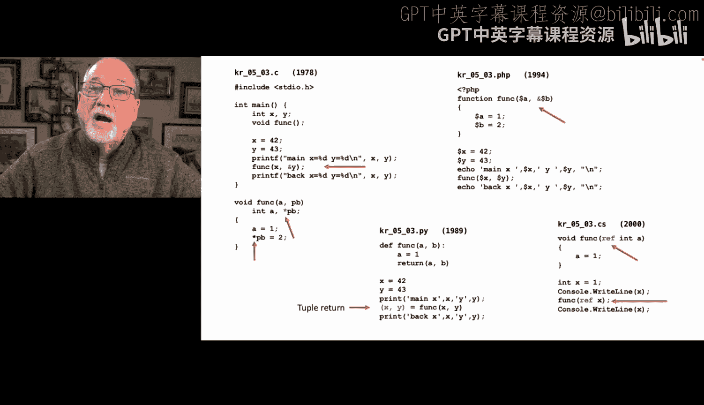

Now， C sharpp， which is much later 2000， has this notion of R。

 which is somewhat a call a throwback to。Pascal， but also， you know， it's the ampersand thing。

 And but the one thing I like about it is inside the call de funk。

 you have to kind of agree the calling code by saying ref X is， in a sense。

 agreeing that it is aware that X is likely to be changed by that function。

 And so that's that's called by reference。 Now， you know， we're in a C class。

 And so ampersand and asterisk are how we do it。 So again， that's just。

 it it's really quite straightforward inside a C code as long as you are very good at understanding what the asterisk and ampersand do in C。

 Another important thing that's。Easily understood with a very simple bit of code is pointer arithmetic。

The key to pointer arithmetic is that a pointer to an integer is different than a pointer to a character。

Now， both these pointers are the same size because they are an address and addresses are all the same size。

But if you add one to a character pointer that actually adds one to the address。

 and if you add one to an integer pointer。Then it adds four。

 and that's because on each integer takes four characters。

 And so when you're doing increments and subtracts， etc cetera， you are when they're pointers。

 it increments based on the type of the thing that's pointed to。 So pointer is not just a pointer。

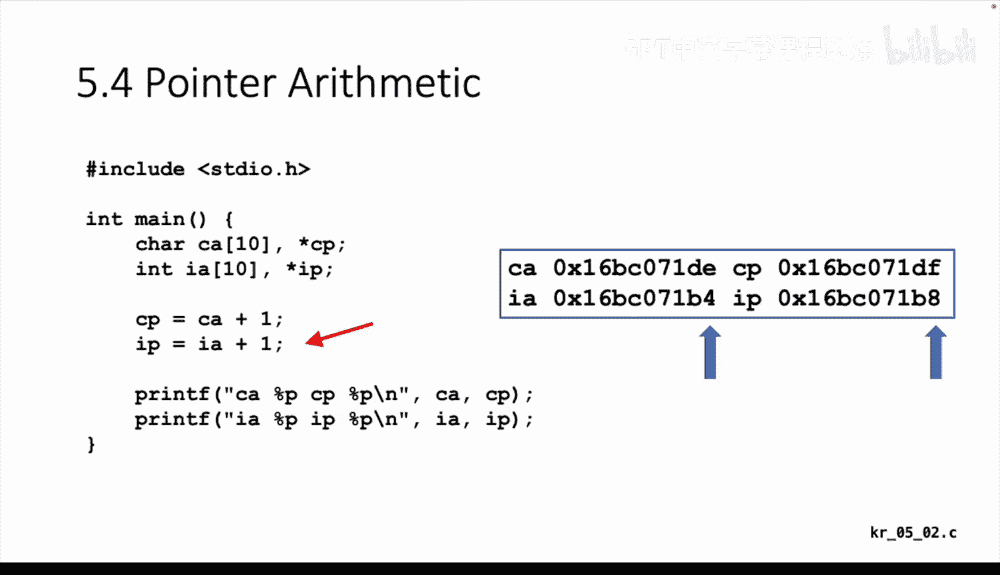

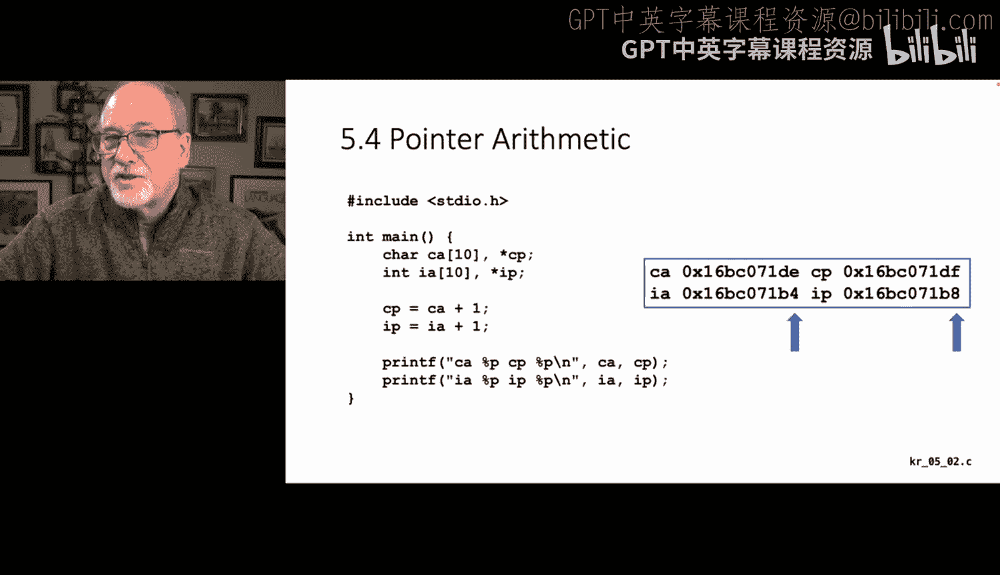

It's a pointer to a thing with a type。 And when you're incrementing and decrementing。

 the type that's being pointed to is more important than the fact that it's a pointer。

 It goes up and goes down， but it doesn't always just go up and down by one。

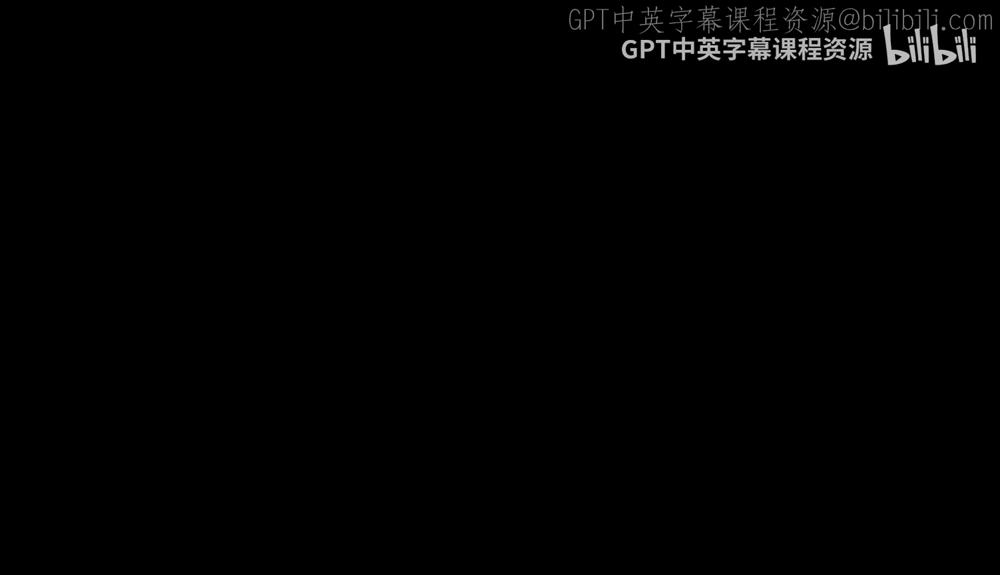

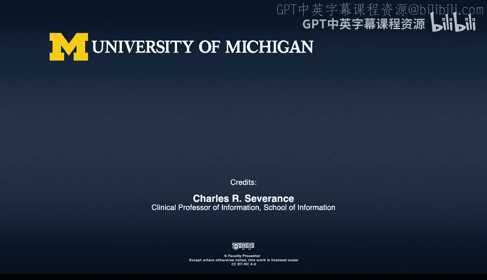