# C语言编程：2.02.01：指针与数组的历史背景与安全考量 🧠

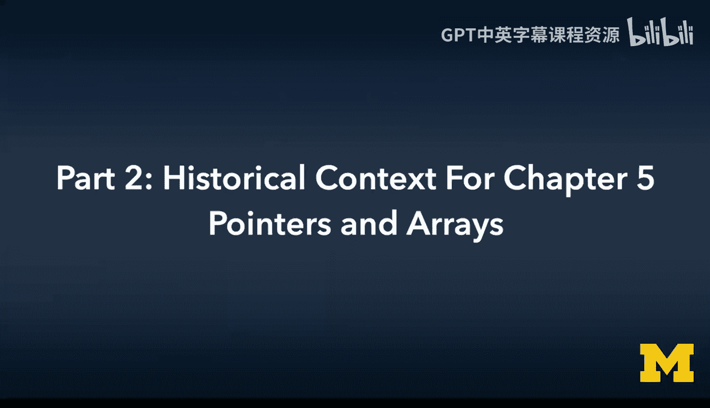

在本节课中，我们将学习指针的历史背景，理解为何早期C语言中指针与整数可以混用，以及这种设计如何引出了现代C语言中的`void*`指针。我们还将探讨一个由指针和数组操作不当引发的经典安全问题：缓冲区溢出。

---

## 指针不是整数 📜

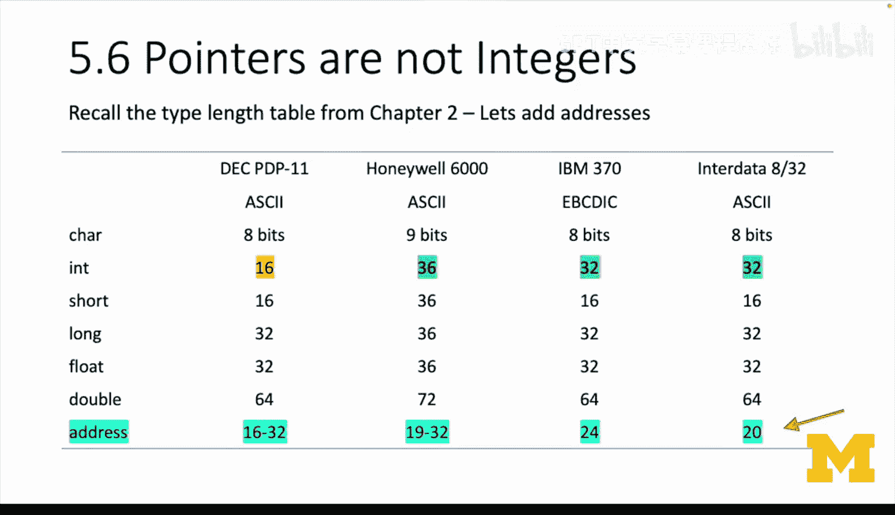

上一节我们介绍了指针的基本概念。本节中，我们来看看指针与整数的历史关系。

指针不是整数。回顾第2章，书中有一个关于不同系统数据类型大小的表格。

以下是早期计算机系统中整数和地址的位数对比：

*   **PDP-11**：整数为16位，地址为16-32位。
*   **Honeywell 6000**：整数为36位，地址为36位。
*   **IBM 370**：整数为32位，地址为24或31位。
*   **Interdata 8/32**：整数为32位，地址为32位。

通过比较整数和地址的位数可以发现，除了PDP-11，其他系统中整数的位数都大于或等于地址的位数。这意味着地址通常可以放入一个整数中，并且有多余的空间。因此，我们几乎可以把地址当作无符号整数来处理。

PDP-11的情况有些特殊，其地址范围在16到32位之间，这是因为不同时期交付的计算机配置不同。并非所有计算机都安装了最大内存，也并非所有应用程序都会使用计算机的全部内存。因此，在大多数情况下，你可以方便地将一个地址存入整数，然后再取出来，而不会截断或破坏该地址。

所以，将指针当作整数来处理，在历史上几乎是可行的。而且，年代越早，这种做法越可能成功。


地址通常是正数，常常从零开始。有时堆地址向下增长，有时栈地址向上增长。但大多数计算机并未安装最大内存。在多用户计算机上，你也不会将所有系统内存分配给每一个应用程序。早期的应用程序非常节省内存，因此很少遇到内存地址无法放入整数的问题。

所以，在70年代早期，应用程序可以编写一个返回地址的函数，将其作为整数返回，然后无需转换就直接复制到指针中。

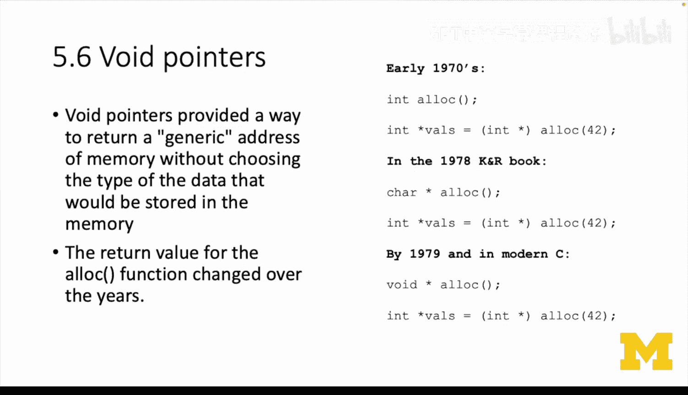

---

## `void*`指针的出现 🎯

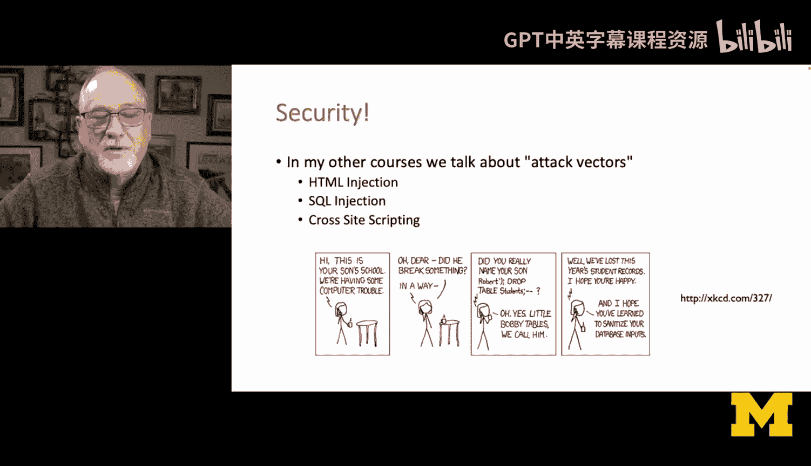

上一节我们了解了早期指针与整数的关系。本节中，我们来看看现代C语言如何通过`void*`指针来解决类型安全问题。

到了80年代早期，`void`指针的概念为我们提供了一种表示通用地址的方式，即指向未知类型数据的指针。因为所有地址都是地址，只是它们指向的数据类型不同。

以`malloc`函数为例，我们将在下一章更深入地使用它。`malloc`函数的作用是分配指定字节数的内存，并返回一个指向这片新内存的指针。

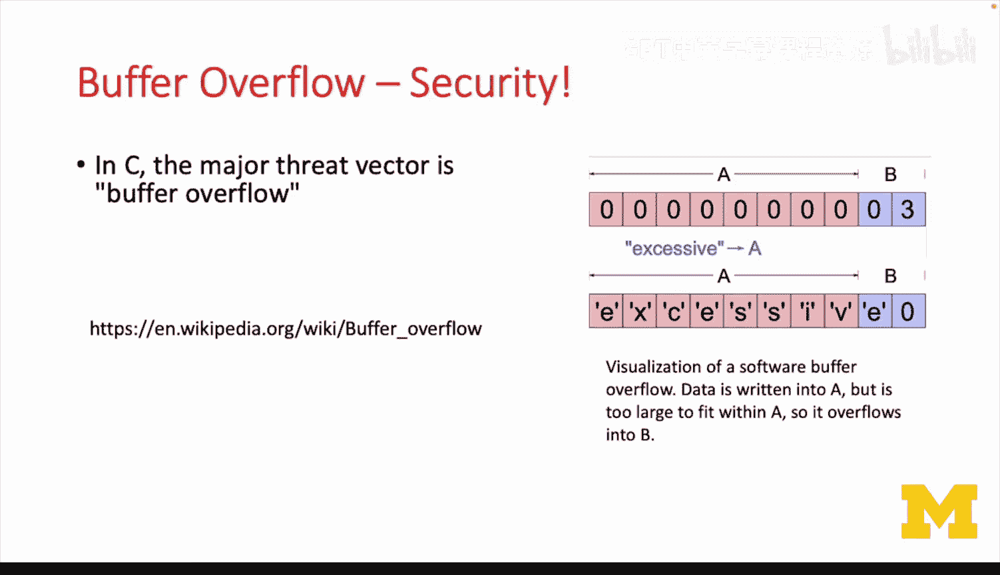

在70年代早期，`malloc`返回一个`int`（整数）。然后我们会将其强制转换（cast）为我们想要的任何类型。例如：
```c
int *p = (int *) malloc(42);
```
`malloc(42)`会给我们一个整数形式的地址，然后我们将其强制转换为`int*`（指向整数的指针）。这是一个无损的转换。

到了1978年的K&R C书中，我们倾向于将其称为`char*`，因为`42`表示我们要分配多少个字符。然后你会将这个指向字符的指针，强制转换为指向整数的指针。所以`malloc(42)`实际上会给我们14个整数（假设`int`占4字节）。

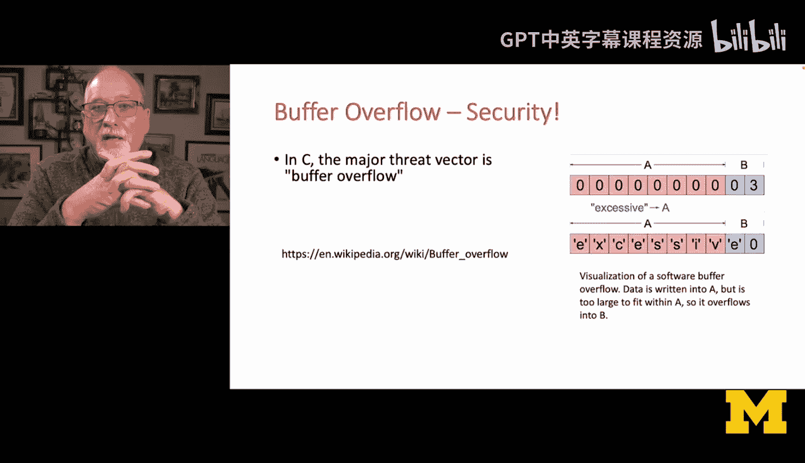

但在现代C语言中，我们有了`void*`指针。它基本上是说：`malloc`将返回一个地址，你必须将其转换为某种具体类型。

所以，`malloc(42)`返回一个`void*`，然后被强制转换为`int*`。这是一个无损的转换，不会让编译器困惑，然后我们将其存储在我们的`int*`变量中。

你将来接触的所有代码都会使用`void*`。这里只是给你一点历史背景，解释为什么在1978年的书中没有提到`void*`。

---

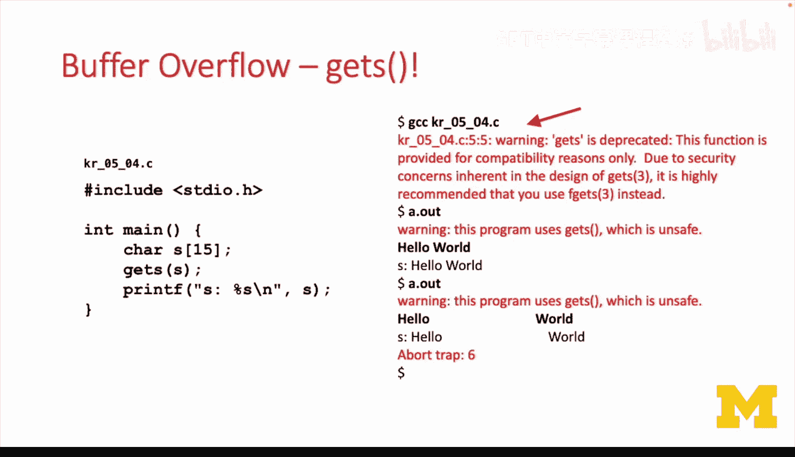

## 缓冲区溢出：一个经典的安全漏洞 ⚠️

上一节我们介绍了`void*`指针。本节中，我们将探讨一个因不当处理内存（尤其是字符串数组）而导致的严重安全问题。

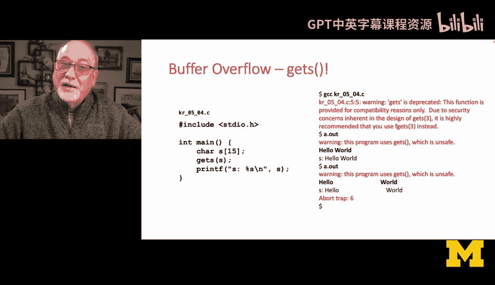

每次在课堂上讲到“是时候学习安全了”，总会听到一些抱怨。但作为软件开发者，我们必须意识到，我们构建的东西可能会被恶意破坏。现在，是时候讨论这个问题了。

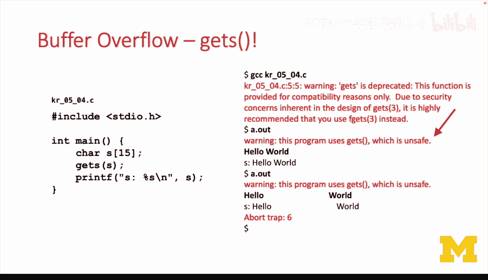

对于C语言，可能整个计算史上（从1950年至今，甚至在C语言出现之前）最严重的安全漏洞就是所谓的**缓冲区溢出**。

这与一个事实有关：C语言中的字符串没有运行时长度概念。它有一个分配的长度，但没有一个记录当前长度的变量。因此，当我们向一个字符串中存入超过其容量的数据时，数据会继续存储在字符串的末尾之外，它不会自动分配更多空间。

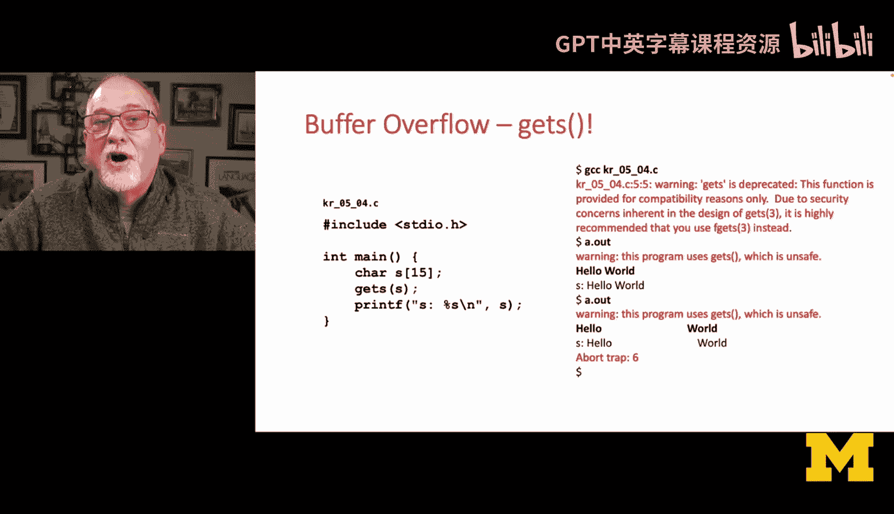

以下是一个来自维基百科的示例，展示了一个8字符的字符串，后面跟着一个2字节的整数。当我们复制一个9字符的字符串（包含9个字符和结尾的`\0`空字符）时，仅仅因为试图写入A字符串，就完全覆盖了B变量。


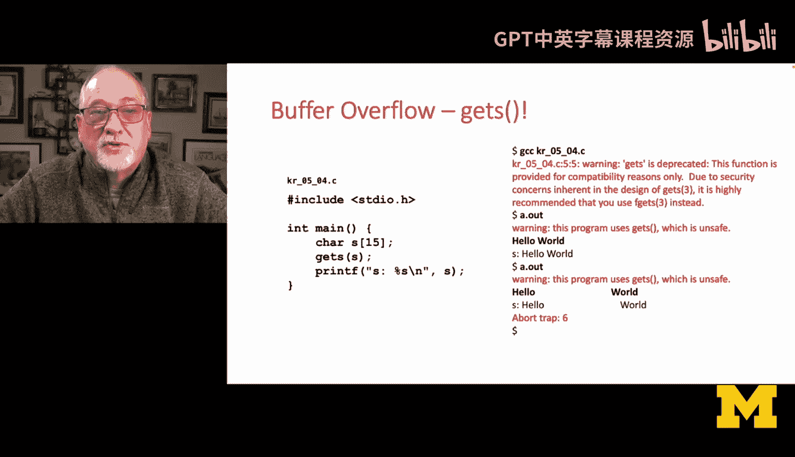

这就是缓冲区溢出。它就像是向这个变量里塞入了太多东西，以至于超出了它被分配的空间，而且这个过程永远不会被检测到。这意味着你可以利用缓冲区溢出来做各种各样的事情：改变变量、开启超级用户权限等等。你需要查看源代码，精心构造一个攻击，但攻击的载体就是：当我们向字符串数组复制数据时，其边界不会被检查。如果你编写了糟糕的代码，或者系统本身有糟糕的代码，它就会去破坏内存。

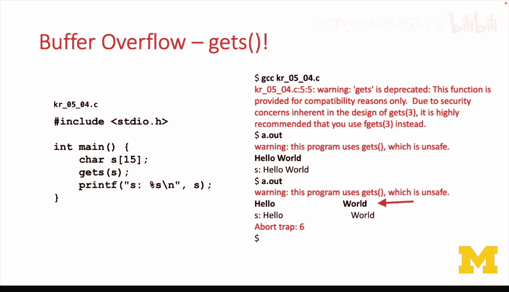

事实证明，这个问题最严重的“肇事者”之一是`gets`函数。它曾是标准C库的一部分很长时间。

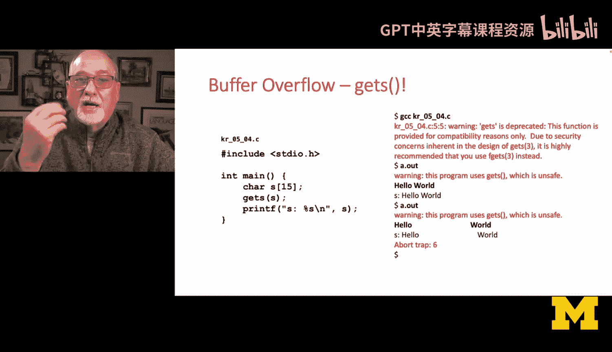

以下是一个使用`gets`的简单示例程序：
```c
#include <stdio.h>
int main() {
    char s[15]; // 一个15元素的字符数组
    gets(s);    // 危险！不检查边界
    printf("%s\n", s);
    return 0;
}
```
当你编译一个包含`gets`的代码时，编译器会发出警告，强烈建议你不要使用`gets`。但为了演示，我们仍然运行它。

程序运行时，C标准库甚至在提示输入之前就打印出一条警告信息：“你真的不应该使用`gets`”。如果你认为这个程序是可信的，那很可能错了。

*   **第一次运行**：输入“hello world”（11个字符，加上`\0`共12个）。这适合`s[15]`，程序正常运行。
*   **第二次运行**：输入“hello”加上一堆空格和“world”，总共超过15个字符。程序打印出完整的输入，但它已经覆盖了`s[15]`之后的各种未知数据。因为`s`是`main`函数中的自动变量，它在栈上，所以溢出会破坏栈上的其他内容。

C运行时会在栈上放置一些东西来标记或捕获这种溢出。因此，当代码执行完毕后，会看到“abort trap 6”错误。这是C运行时在说：我不会让这个程序继续执行了，因为有一个数组被破坏了。它并不是检测到了数组越界，它不知道数组有多长。它只是放入了字符。但它确实在数组后面放了一些东西（如金丝雀值），并在之后检查它。当这个值被覆盖时，运行时就知道出了问题并终止程序。


我们绝不希望你使用`gets`。这就是一个缓冲区溢出的简单例子。未来我们可能会看一些更复杂的例子，尝试利用类似`gets`的函数来操纵程序的行为，而不仅仅是让程序崩溃。

---

## 总结与展望 🎓


本节课中，我们一起学习了指针的历史背景、`void*`指针的由来，以及由指针和数组操作不当引发的经典安全问题——缓冲区溢出。

指针是C语言中最美妙、最强大的部分。它们很复杂，但本质上，指针使得高级语言能够像低级语言一样工作。如果没有指针（我指的不是Python那种隐式的引用，而是我们可以显式查找、解引用的正式指针），我们就无法完成操作系统需要做的事情，那些我们过去需要用汇编语言来写的事情，比如：这里有一个内存缓冲区，我们要复制它；那里有另一个缓冲区；还有一个链接所有不同缓冲区的链表。

理解指针将引导你通向汇编语言、机器语言，并最终理解硬件。因此，你不应该匆忙略过这部分内容。指针真的非常重要。从现在开始，我们要做的一切都将与指针息息相关。


教材的第5.7和5.10节（或5.3、5.12节，取决于版本）内容有些密集。我真正希望的是，你能理解我刚才讲的内容以及对应的章节。第6章会更有趣，因为我们将更多地使用指针，而不仅仅是讨论“什么是指针”。