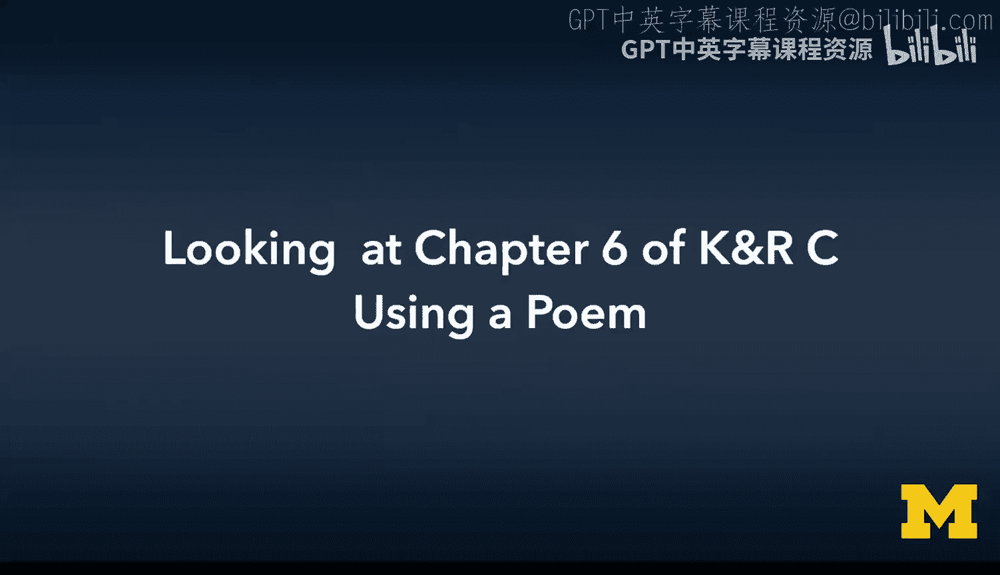
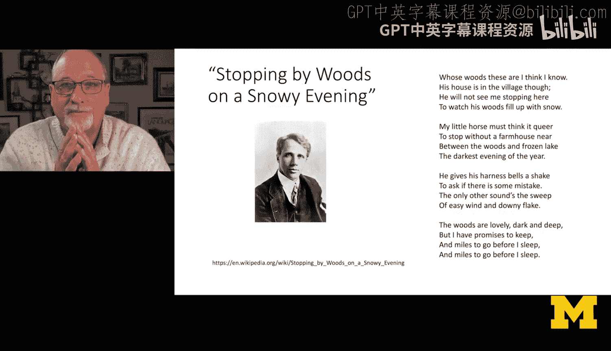
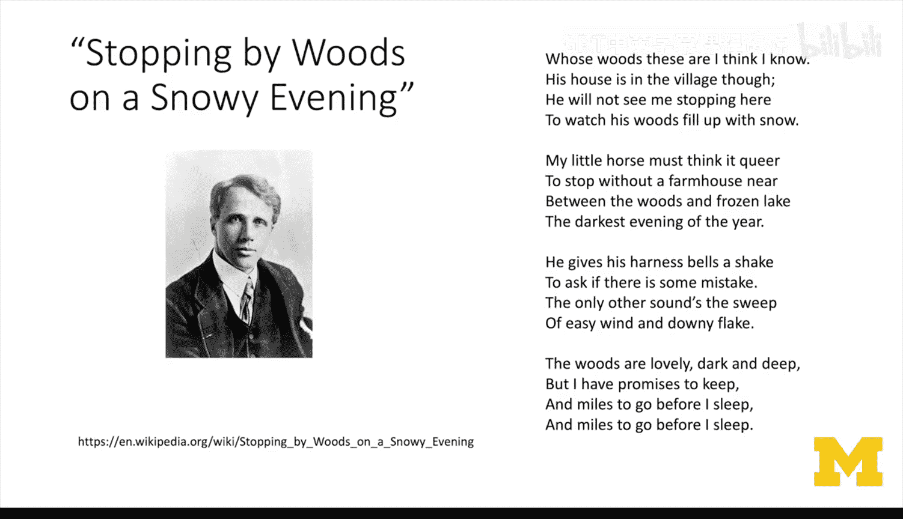
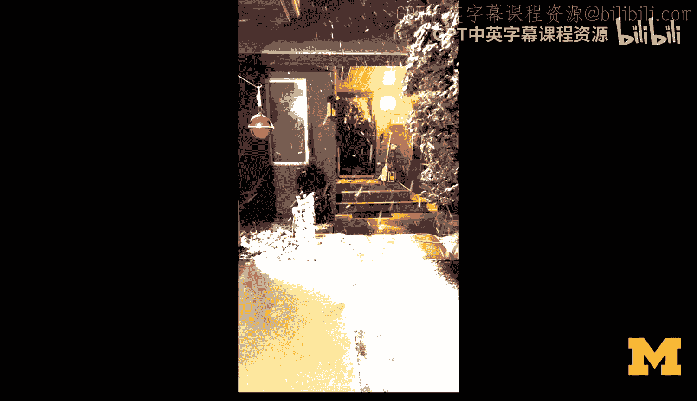
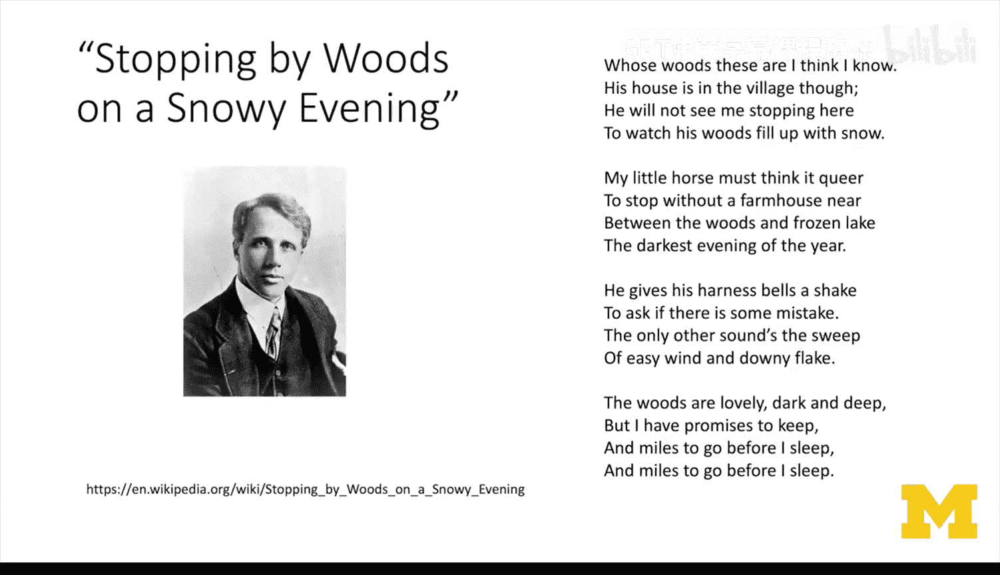
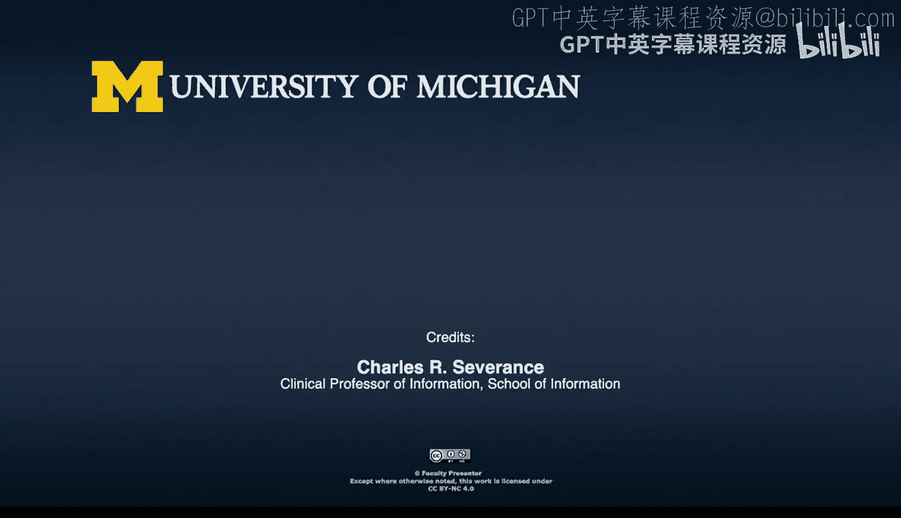

# C语言编程：第6章：通过诗歌解读K&R C第6章 📖

在本节课中，我们将开始学习K&R C语言教材的第6章。本章的核心内容是**结构体**，但它的意义远不止于此。本章是课程的一个关键转折点，我们将从学习C语言的基础语法，过渡到应用这些语法来构建更复杂的**数据结构**。这是一个挑战，但也是通往更广阔计算机科学世界的大门。

## 章节概述与转折点

上一章我们学习了指针等核心概念。本节中，我们来看看第6章的整体结构及其重要性。

第6章的前四节（6.1至6.4）将继续教授C语言本身，重点介绍**结构体**这个概念。结构体是一种将多个不同类型的数据组合在一起，形成一个新类型的优雅方式。它是C语言课程中最后一个基础性的组成部分。

然而，从第6.5节开始，作者将话题转向了**数据结构**。这是结构体概念的应用，也是计算机科学的基础。例如，你将学习如何在C语言中构建类似Python字典的功能。这个转折点常被称为“学习曲线的膝盖部分”——在此之前，学习循环、字符串、数组甚至指针都还算顺利，但应用结构体来构建数据结构的难度会显著提升。

因此，如果你之前学得很快，从这里开始，我建议你放慢速度，专注于理解和掌握。这些概念并不天然容易理解，但一旦掌握，你将打开计算机科学的一扇大门，甚至在本章末尾会接触到**递归**这样的概念。请不要急于求成。

## 一首诗的启示

在深入技术细节之前，我想分享一首对我有特殊意义的诗，它来自罗伯特·弗罗斯特。这首诗提醒我们，学习的旅程漫长而并非易事，但坚持走下去是值得的。

以下是罗伯特·弗罗斯特的《雪夜林边小驻》：

> 我想我认识这片森林的主人，
> 他的家虽在村子，却不见他身影；
> 他不会看到我停留在此地，
> 凝视他的树林积雪层层。

> 我的小马一定觉得奇怪，
> 为何停在远离农舍的野外，
> 在这森林与冰湖之间，
> 一年中最黑暗的夜晚。

> 它摇动一下颈上的铃铛，
> 询问是否出了什么状况。
> 唯一的其他声音是微风，
> 和鹅毛雪片扫过的轻响。

> 树林可爱，幽暗而深邃，
> 但我还有诺言需要遵守，
> 安睡之前还有许多路要走，
> 安睡之前还有许多路要走。

这首诗的精髓在于，你历尽艰辛才学到本书的第6.4节，或许觉得已经足够，可以自我褒奖。但第6.4节之后，依然是“安睡之前还有许多路要走”。好消息是，当你完成这段旅程，便可以放松休息。所以，我希望你保持耐心，稳步前进。接下来的内容复杂度会迅速增加，我不希望任何人掉队。

本节课中我们一起学习了第6章的重要性及其承上启下的地位，并通过一首诗体会了坚持学习的意义。从下一节开始，我们将正式进入结构体这一核心概念的学习。