# 密歇根大学《给所有人的C语言编程课（了解C、用C编程、数据结构、创建对象）｜C Programming for Everybody》 p21 6_04_01_第2部分-K&R C第6章结构体（1978年版）.zh_en -BV1v2421P7pt_p21-

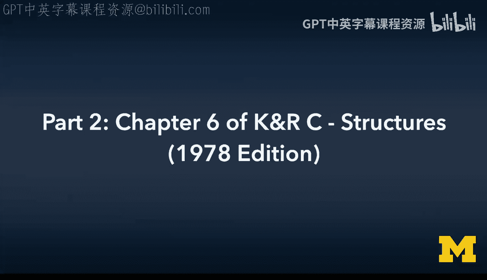

。So in addition to creating linked lists， we're going to do many different things with linked lists。

 We're going to delete things。 We're going to sort things。 We're going to find things。

 We're going to look things up。 We're going to change things。

 So one of the things that will save you a lot of craziness when working with linked list is always draw pictures and arrows is just it' just necessary。

 And frankly， those programming exams。 all they ever tell you is to draw these pictures sometimes draw a picture of a hash map as as a good example。

 So I'm just going to show you some pictures rather than showing you a bunch of code。

 and then I think you can produce the code later。So I want to show you how you delete an item from a singlely linked list。

 So first you got to find it。 You got to do the walking of the linked list， which I just showed you。

 you got to walk through and you got to find the item that you want to delete。

 Now if you walk through and you don't find it， there's nothing to delete。

 So our goal is is to delete the line is I。 And so， but you got to handle three cases。

 There is the easy one， which is where the thing you found is in the middle of list。

Or if the thing that you found is at the start of the list。

 or if the thing you found is the last item in the list。 And again。

 you've got to draw pictures and you may have to draw them separately because we we' going to be adjusting head and tail in addition to the next values。

 Now， it turns out。When you're going to do a delete。

 you want to not only track the current item in the list。

 you want to track the previous item in the list。 So as you're walking down the list， you look。

 your current moves ahead and preve moves right behind it。 So preve trails current by one item。

 you can see。

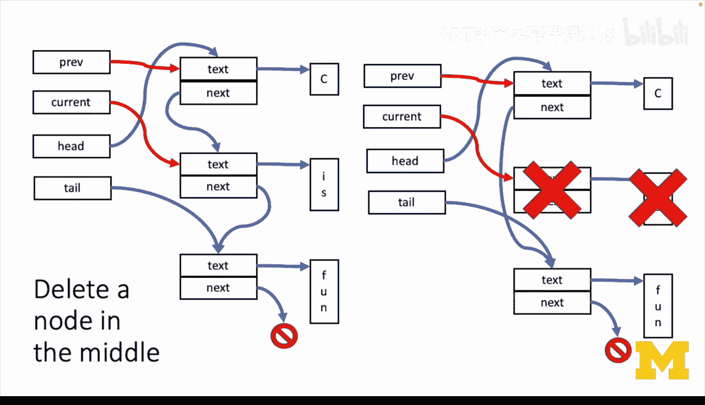

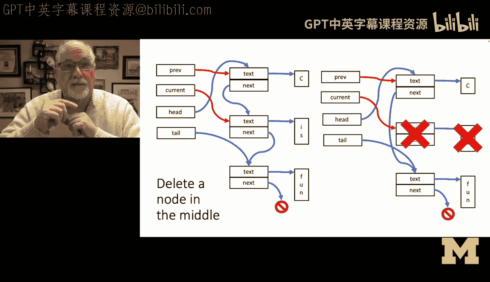

That current， the is line is the one we're going to delete。 And it's pretty simple。

 The only real thing that you've got to change is you take preve next and you point it at cur next。

 right， So you can see on the right hand side that the little link from the C to the fun has just bypassed the is Now you do have to delocate the struct L node and the string。

 But that's pretty much all you need to do。 And so the middle is really easy， you find it。

 you keep track a preve。 have current。 And then you just kind of bypass it by moving next。

 So that's the easy one。 The next thing that you got to do is what if it's the first node。

 And in this case， preve will point at null because we have not really seen more than one。

 Prive only goes non null when we've passed the first one。 So current is pointing it ahead。

 let's say we want to delete the line that says C。 And so we notice that preve is null。

 And so what we do is we actually just moved。

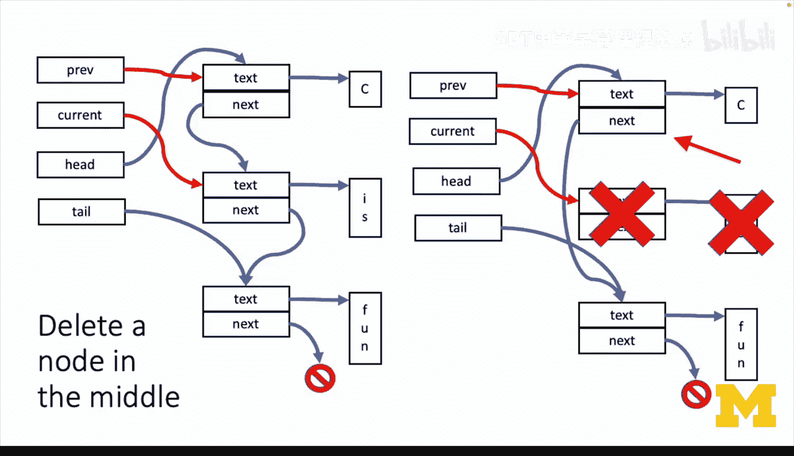

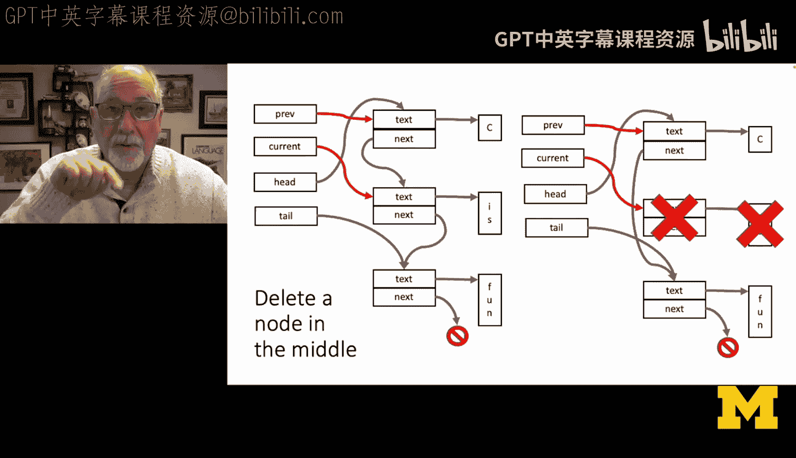

The head to。Cur next， right。 You can see in on the right hand， the head just points。

 Now the head is now bypassed that first line。 And that's all we've got to do。

 except clean up the memory of the first entry both the string and the struct L node。

 So that's pretty easy。 You detect that by noticing that preve is null because you you're catching it in the first time through the loop and preve trails current by one。

 And if you have not seen the second one pre is still null。 So that's a pretty easy one。

 But you got to check it。 you got to check So this one is if preve is null。

 you're sitting at the front。 So you mess with head。

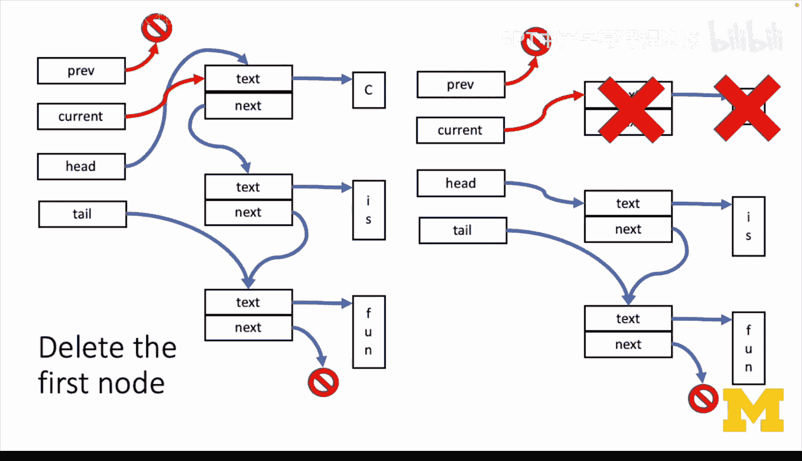

And that's all you've got to do other than get rid of the data and free it up。

The last node is perhaps a little bit trickier。

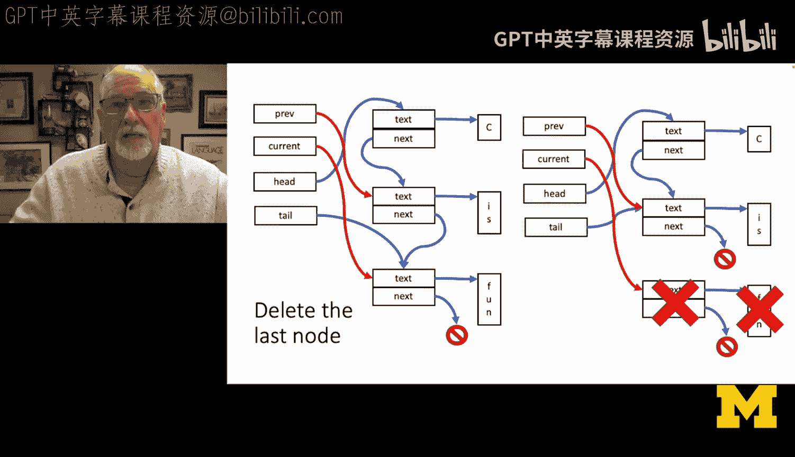

And so if you look and how you know you're on the last node iscur next is null， right。

 because if you're pointing at the very last node in the list， then the next is null。

 So if cur next is null。Then what you're doing is you know you're deleting the last one。

And so you first set preve next to be null because that's the new last one。

 And then you have to update tail to point toprive。

 So tail was pointing at cur at the current and then tail at the end points to proveve。

 And then you got to clean up your data of that formerly last item in the list。

 So now we're going to talk about doubly linked lists。

 And the main purpose to have doubly linked list is to be able to reverse the list。 Python is easy。

 There's a method in the list object called reverse。

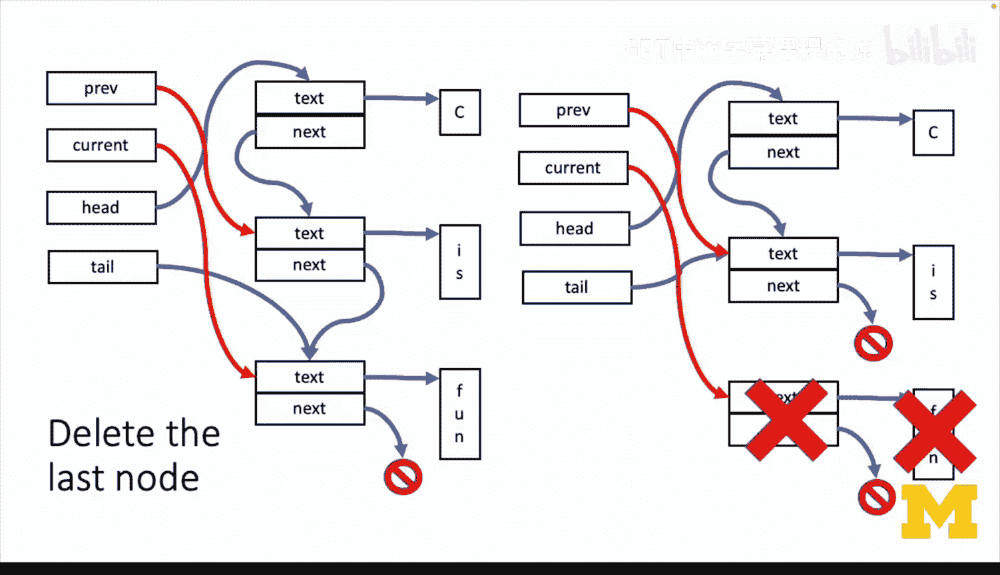

What we're about to see is exactly how reverse works。So you just read the lines in and you say lines。

 reverseverse and then you print them out and they come out in backwards order。Now， somebody。

 probably G of Van Rossam， who wrote this in the first place in 1991。

He is writing a doub link list to make reverse easy。

 so if you remember how we did the deleting where we kept track of preve， well。

 in a doubly link list， we actually just have preve in the L node。

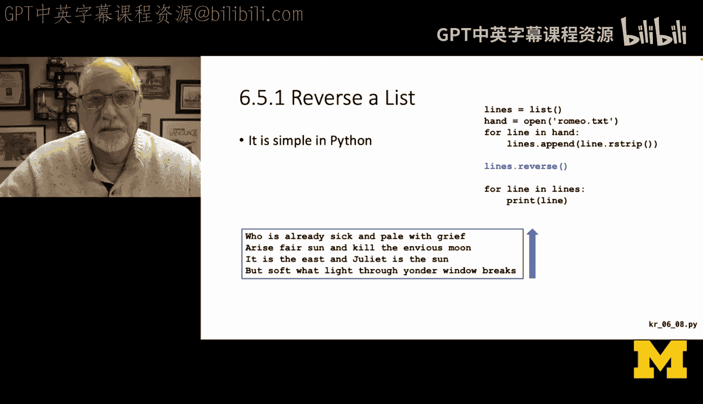

And so in addition to the text we're going to store。

 we're going to have a pre pointer and a next pointer。And at the beginning of the list。

 the pre will be null and at the end of the list。Next， will be know。

It's called a doubly linked list because it has both reverse and forward chains of pointers。

 and we keep it working all the time。 So it turns out that making a doubly linked list in terms of code is not that different。

 We have another thing in the L node。 We now have three things Str L node star pre。

And as we're linking a new thing onto the end of the list。

We basically take new preve the new item we're adding and we copy tail into that because tail points to the last one。

 we're adding a new one to the last one and the previous one is tail and then we do that before we set tail to new so we add a new one and then we set tail to new so it's not that hard so this is an example of the three item list with all of the previous and next properly properly shown and so it just links together once you draw these things in a picture and you get the understanding of what they're talking about they're not too hard and section 6。

5。1 in the book which I added actually walks through this doubly link list in some detail so I won't replicate that here。

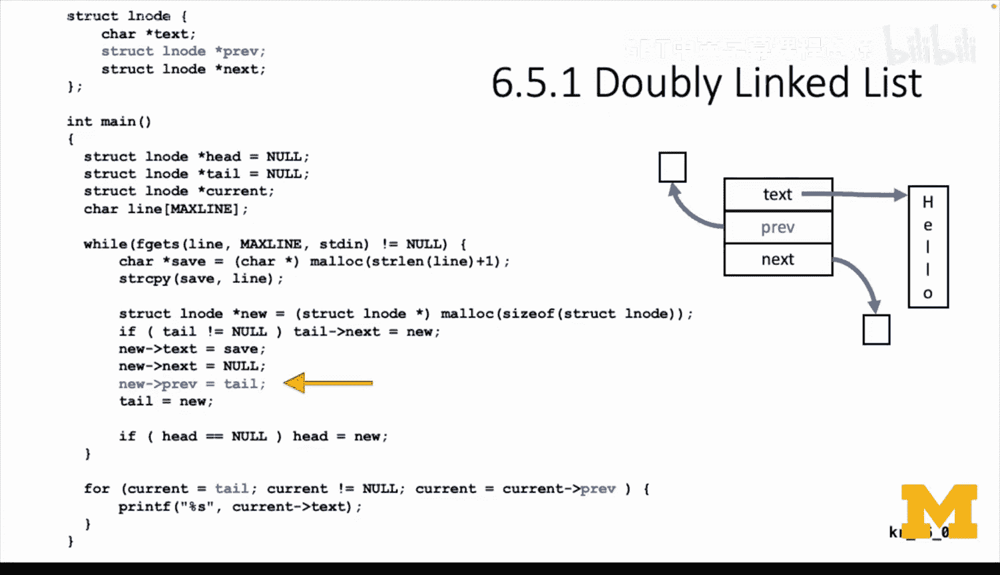

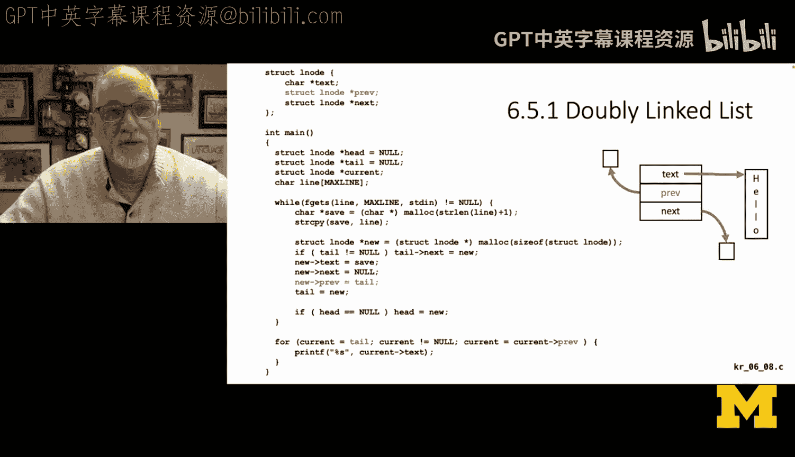

Now， let's just say that you have a doubly linked list and you want to now reverse it。 Well。

 it's pretty simple。 You set current to tail same as long as current stays not not null。

 and then say current equals current pre。 So you're sort of popping back up one at a time。

 So the second time through the loop。 current has followed the pre from the last item。

 and now it's on the second， the last item。 And then it does it again。 And then it goes to the top。

 And then the last time it goes up to the preve of the top one and finds null。 And then。

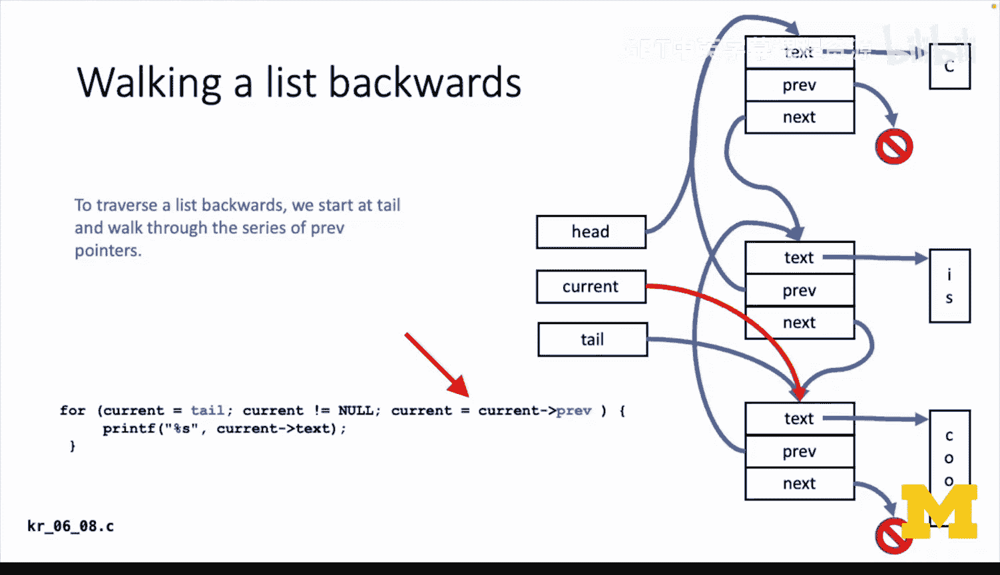

The loop finishes because current has become null and you print it out the three lines cool is C backwards。

 So this is just an example in Kr0609 c and I won't walk through it in this lecture。

 I'll let you take a look at that。 It's quite common to encode all this stuff in some functions rather than just in straight line code it's not all that hard you don't want to pass in the list structure and the line list is passed in by reference and so you have to say ampersand my list on this list add function and inside the function you do you have the list be a pointer to that structure and then you have to use thearrow syntax inside of the function。

 The next thing I want to talk about is unions a unions like a structure but it reallocates the same memory over and over whereas a structure allocates more memory this says I'm going to take this same piece of memory。

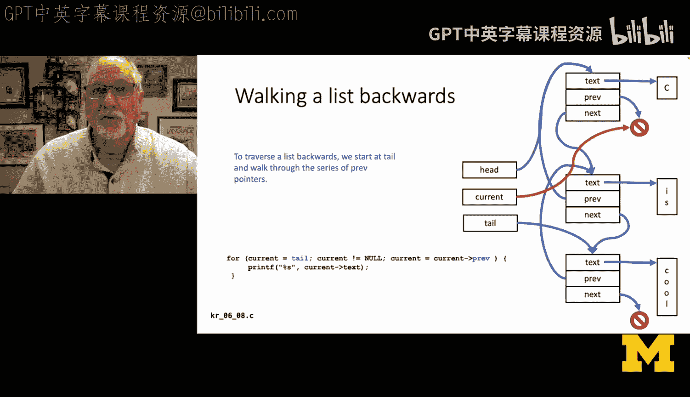

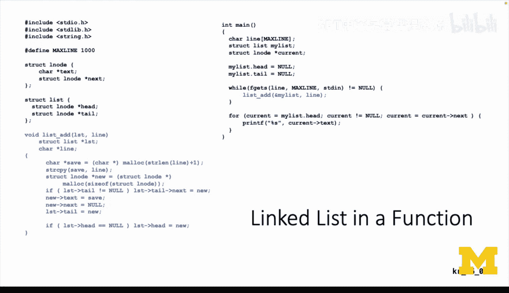

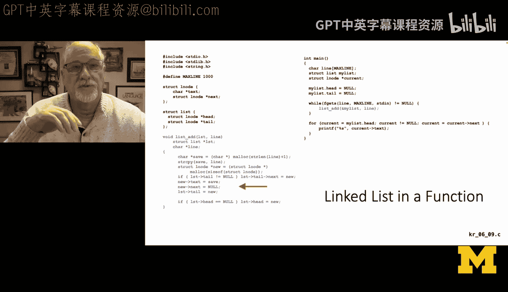

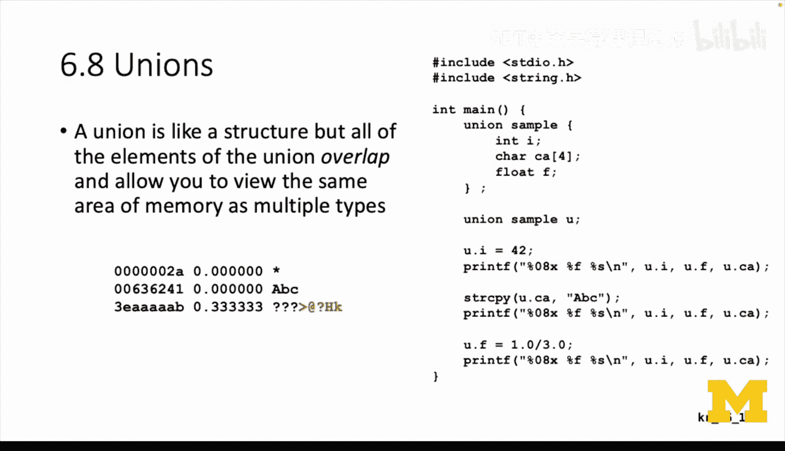

And I'm going to view it different ways， and so it's the same area and you can assign multiple types to it。

This is useful in like network protocols。

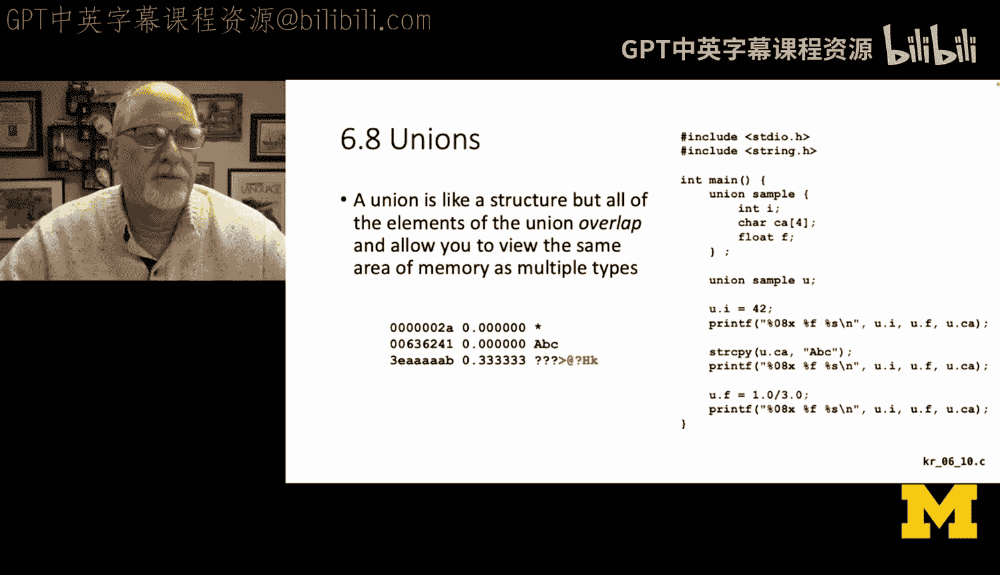

pulling bits out of memory， etc ceter。 And so in my current sample。

 I've got my union sample open curly brace， int I semicolon， cha CA， bracket 4 bracket， semicolon。

 float F， semicolon， closed curly brace， semicolon what I have done here is allocated in a sense。

4 bys。

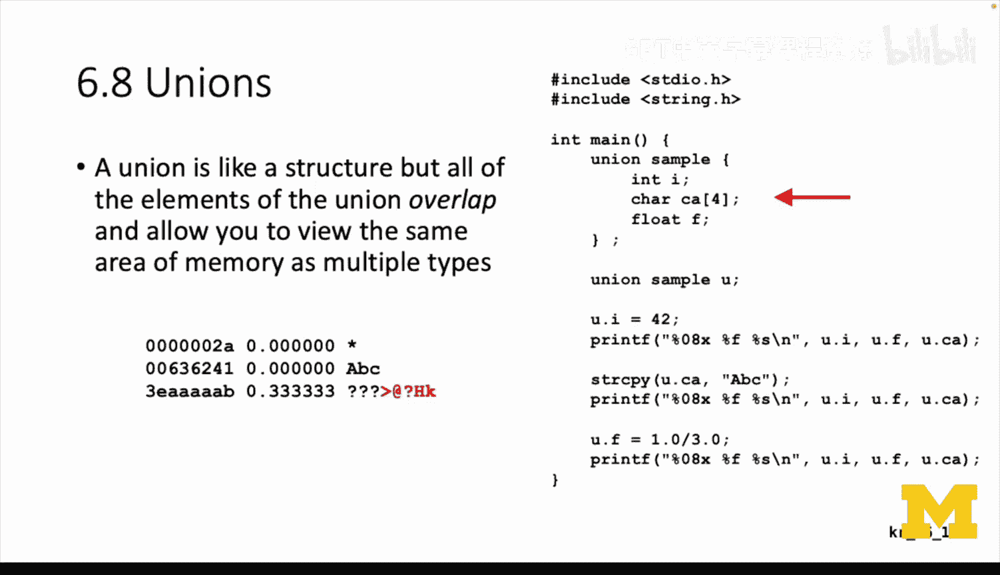

Integers in this case， are 32 bits。C A 4 is 4 Bs， which is 4 times 8 is 32。

 and floats are 32 B floatinging point numbers。 So that's the same amount of memory。

 So instead of being  four times 3 or 12 Bs， this is actually 4 bys that I can。See it。

 I can view it either as an integer or as a character， array of four characters or float。

 and I've carefully lined them up so that they're the same width。

 I allocate union sample U and then I set the integer version of that4 bytes to 42。

 and then I print it out and you can see the hex floating point， that's a complete failure， 0。

000 is like it's not a very good big floating point number， and then as a character string。

 it is an asterisk。

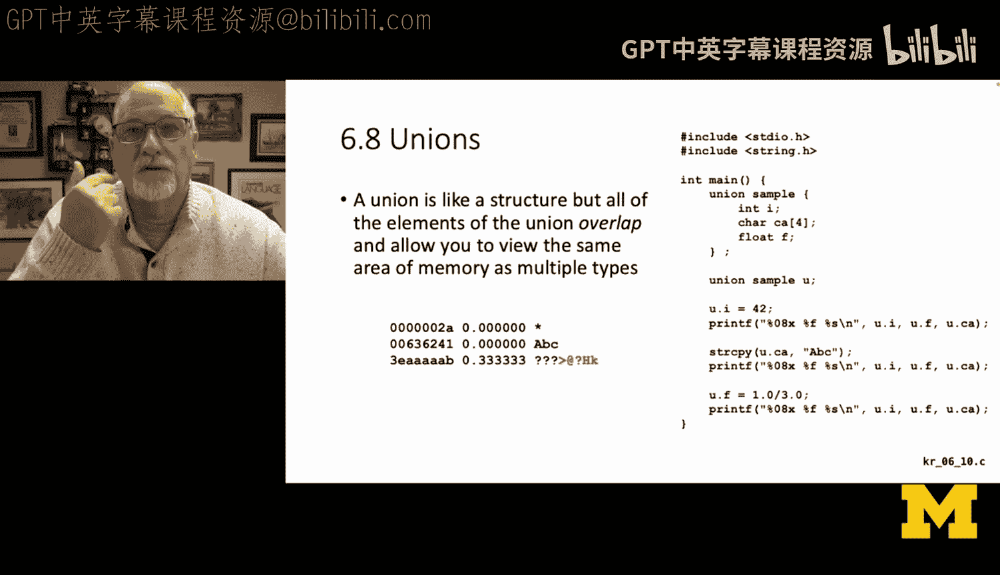

And then。I take view。ca， which is viewing that same area of memory as a character array and I copy。

Quote capital ABC into it， and you'll see that it prints out as a string as ABC。

 The floating point number is still zeros。 It's still kind of a bad floating point number。

 But then I see the hex as 0，0，6，3，6，2，4，1。 Now， this is a little endian computer that are'm running on it。

 So the a is the 41。 The B is the 62， and the C is the 63。 And the 0 is the end of string indicator。

And so that's why I picked very carefully only copying a。

3 character string into a four character array so I could copy that end of end of string indicator。

 Then I take U do F， which is taking that exact same memory and perceiving it as a floating point。

 and I put one third into it。So now when I print that out， it's 0。33。Lovely。

 when I print it out as a string， it is pretty bad and so it turns out that the first。

Three characters are the string， but there's no zero at the end of the string。

 so that greater than is it there， and it just keeps on going。

 it goes into memory and all that stuff that's greater than at sign question mark HK。

 that's just random garbage on the stack somewhere that because the percent S is wandering randomly through memory at this point。

And then if I print that out as hex and if we wanted to。

 we could learn something about the IEEE floating point format。

 but 3EAA AAAB is1 third and that is a base2 repeating one third with an exponent and floating point internal formats are not the subject for this course I have accomplished everything I wanted you to know about C。

🎼And so the next topic is going to be object oriented programming。

 but not just how to use object oriented programming in Python or。Whatever C doesn't have it。

 what I want to do is look at if we were writing Python itself in C， which is what C Python is。

🎼How would we have to build things like a list structure a list object。

 a string object and a dictionary object， how would we build them and we'll take a look at other programming languages that have object orient features like C++ and Java and etc and so really the next bit is going to be about the implementation details for object orient programming。

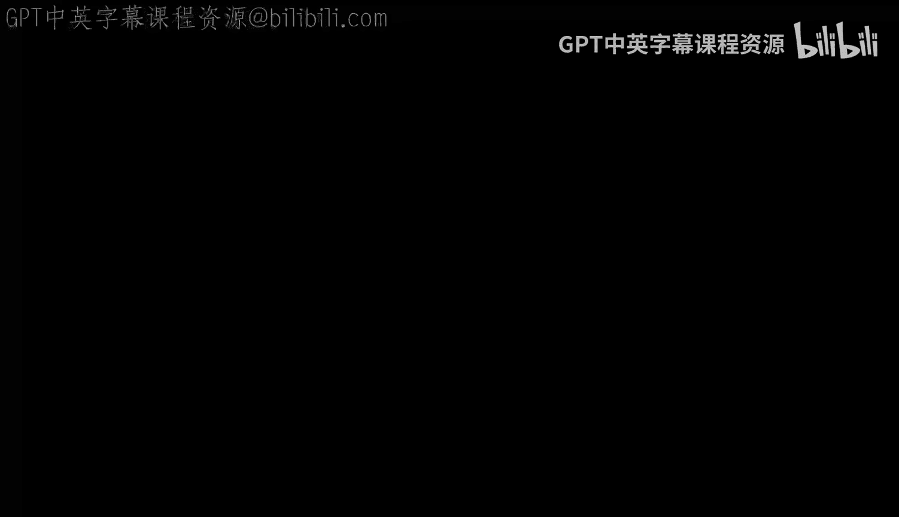

🎼Yeah。

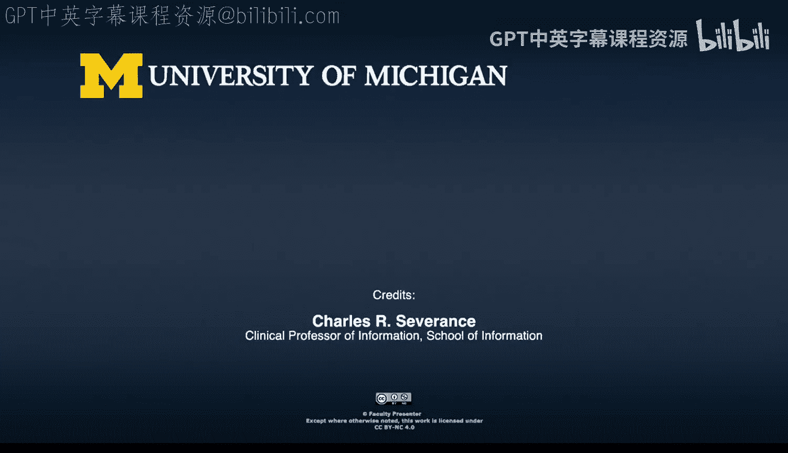

Yeah。