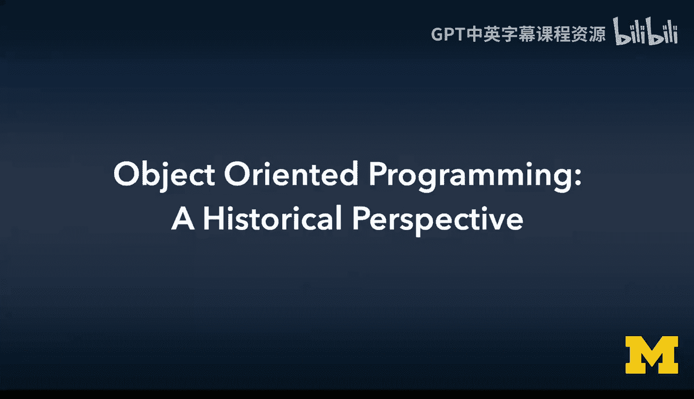
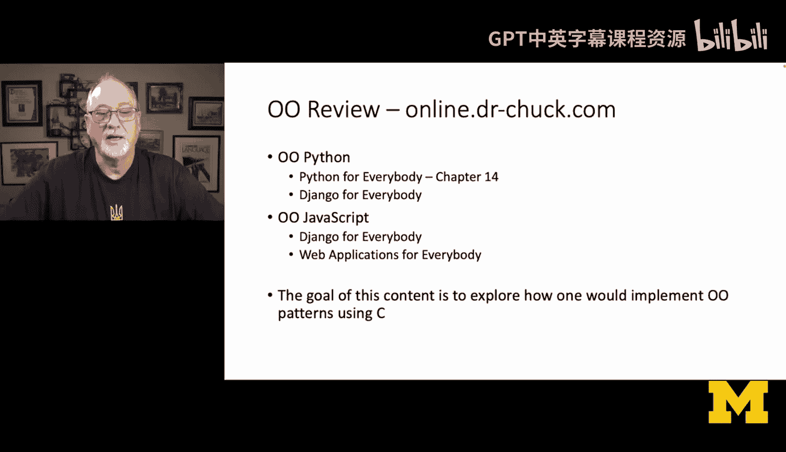
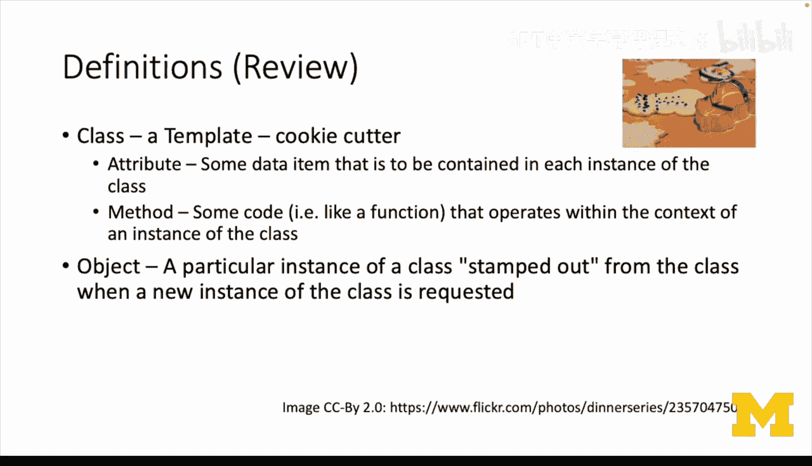
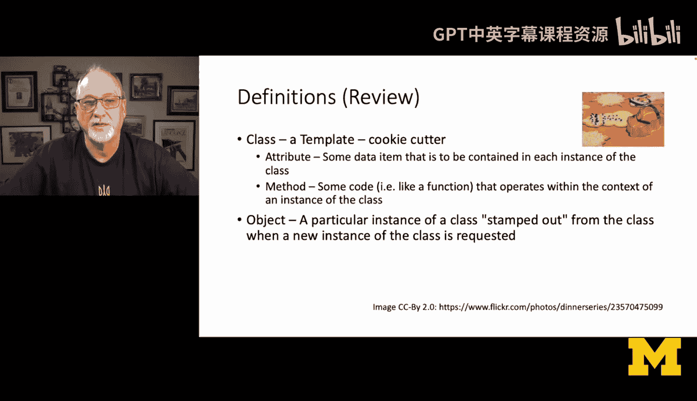
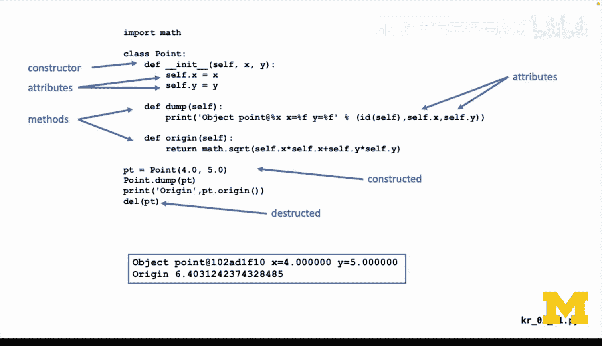
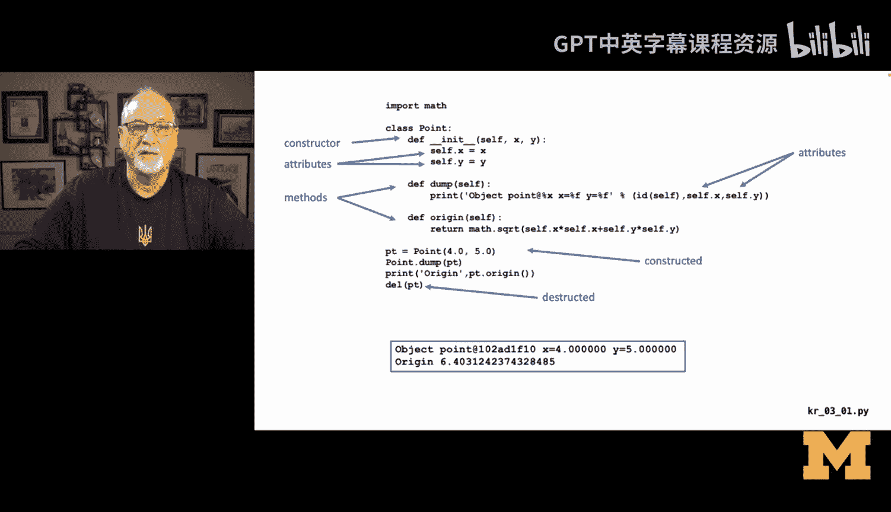
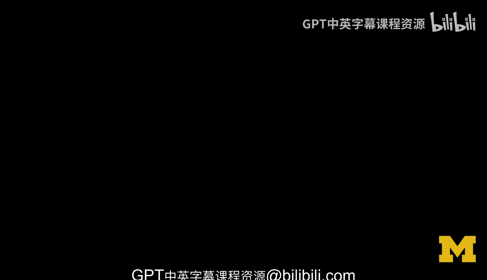
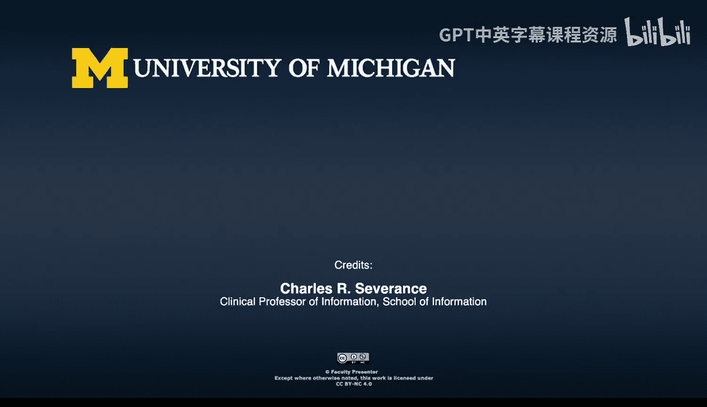
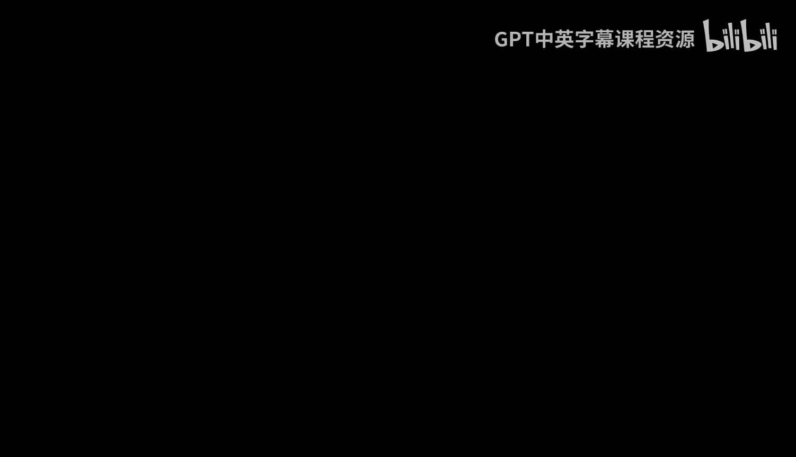

# 面向对象编程：01：面向对象编程的历史视角



在本节课中，我们将从历史视角审视面向对象编程。我们将回顾面向对象的核心概念，探索不同编程语言中面向对象思想的演变，并了解C语言如何成为现代面向对象语言的基础。最后，我们将看到如何在C语言中构建类似Python的类。

## 概述

面向对象编程是一种概念，而不仅仅是语法。通过观察不同语言的语法实现，我们可以更好地理解其底层概念。本节课将简要回顾面向对象术语，并探讨其在不同编程语言中的历史发展路径。

## 面向对象术语回顾





上一节我们概述了课程内容，本节中我们来回顾一下面向对象编程的核心术语。这些术语对于理解后续内容至关重要。

*   **类**：类不是对象，它是创建对象的模板。可以将其比作制作饼干的模具。
*   **属性**：属性是包含在类每个实例中的数据。
*   **方法**：方法是类似于函数的代码，它在类实例的上下文中运行。
*   **对象**：对象是类的一个特定实例，当请求类的新实例时，由类“印刻”出来。一个类可以拥有许多个实例。



以下是Python中一个用户定义类的示例：

```python
class Point:
    def __init__(self, x, y):
        self.x = x
        self.y = y

    def dump(self):
        print(f'Point at {id(self)}: x={self.x}, y={self.y}')

    def origin(self):
        return (self.x**2 + self.y**2)**0.5

    def __del__(self):
        print(f'Deleting point at {id(self)}')
```

在这个例子中：
*   `Point` 是类。
*   `__init__` 是构造函数，`x` 和 `y` 是传入的参数，`self.x` 和 `self.y` 是实例的属性。
*   `dump` 和 `origin` 是方法。方法内部的第一个参数按惯例称为 `self`，它代表实例本身。
*   `__del__` 是析构函数。



创建和使用对象的代码如下：



```python
pt = Point(4, 5)  # 调用构造函数创建实例
pt.dump()         # 调用 dump 方法
print(pt.origin()) # 调用 origin 方法
# 程序结束时，析构函数 __del__ 会自动运行
```

## 编程语言的历史脉络

理解了基本术语后，我们来看看面向对象思想在编程语言历史中的演变。这有助于我们理解为何不同语言的面向对象实现方式各异。

C语言对现代过程式编程语言的语法演变产生了深远影响。然而，面向对象思想的启发和演变却走了一条不同的路径，贯穿了一系列你可能熟悉或不熟悉的语言。

以下是关键语言及其关系的简要时间线：

*   **1955年 Fortran** 与 **1960年 Algol 60**：Algol 60在一定程度上是对Fortran的回应，它更受当时计算机科学家的青睐。
*   **1967年 S**：从Algol 60中吸收了许多面向对象思想。
*   **1970年 Pascal**：一种过程式语言。
*   **1972年 C**：出现后极大地改变了我们对语法的思考方式，并启发了C++、Java、JavaScript、C#和PHP。
*   **早期面向对象语言**：Simula和Smalltalk等语言主要是过程式的，但包含了面向对象概念。Smalltalk尤其被认为是发展了最纯粹的面向对象概念的语言之一。
*   **函数式语言的贡献**：1960年代初的Lisp及其1975年的衍生语言Scheme，也包含了对象概念，为面向对象模式提供了不同的灵感来源。

## 现代语言的面向对象传承

了解了早期历史后，本节我们来看看现代流行语言如何从不同的源头继承和发展了面向对象特性。

现代语言的面向对象特性有着复杂的传承关系：

*   **C++ (1980年代初)**：从Simula（面向对象概念）和C（过程式语法）中汲取灵感，是一种试图在C语法之上叠加面向对象概念的混合语言。
*   **Python (1991年)**：设计时充分意识到了C++的存在，几乎在语言实现之初就内置了面向对象特性。
*   **Java (1995年)**：试图成为“下一个C”，从C和C++中借鉴了大量内容。
*   **JavaScript (1995年)**：虽然受Java影响而诞生，但其面向对象模式更多源自Scheme，采用了更纯粹的、基于原型的面向对象方法，而非基于类的层叠方式，因此在这些语言中显得与众不同。
*   **PHP (1995年/2000年)**：1995年首次发布时并非面向对象语言，直到2000年才添加了对象支持。
*   **C# (2001年)**：灵感来源于C++和Java。

## 总结







本节课中，我们一起学习了面向对象编程的历史视角。我们回顾了类、对象、属性和方法等核心术语。更重要的是，我们看到了面向对象作为一种编程概念，其思想是如何在不同编程语言（如Simula、Smalltalk、Lisp/Scheme）中独立演化，并最终以不同方式（如C++的混合模式、JavaScript的原型模式、Python的早期内置支持）融入到以C语法为根基的现代语言（C++、Java、Python、JavaScript等）中。理解这段历史有助于我们看清语法背后的统一概念，并为后续学习如何在C语言中实现面向对象支持打下基础。