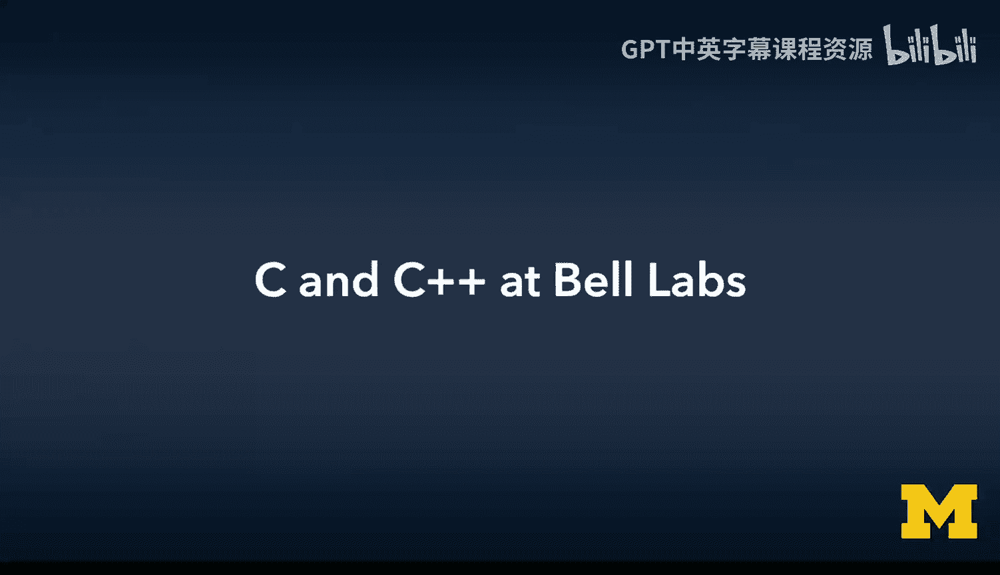
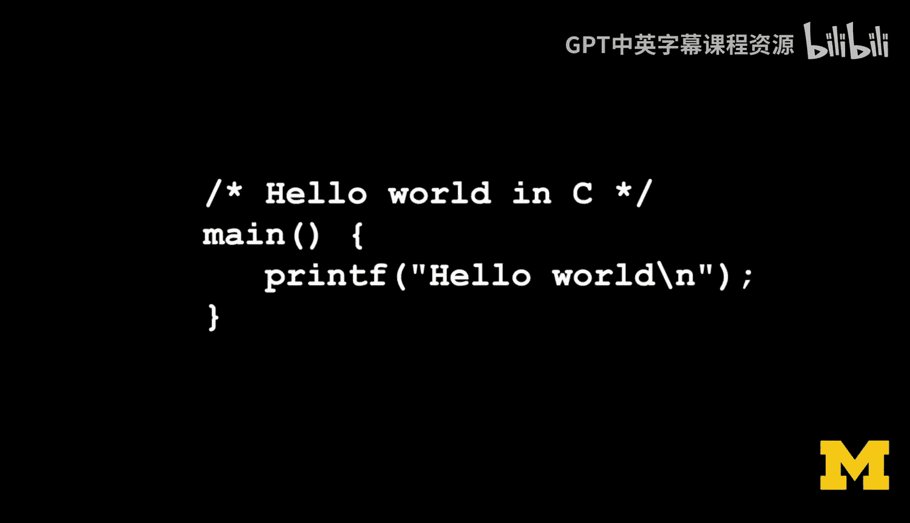
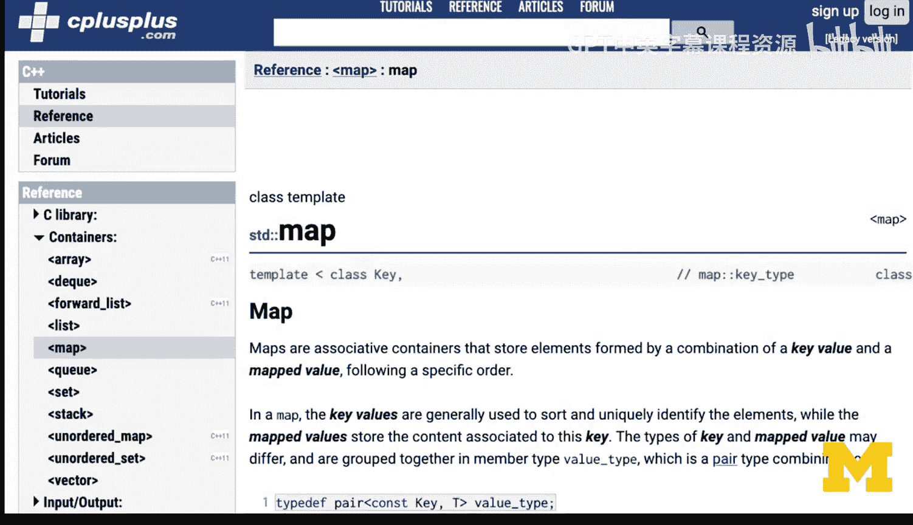
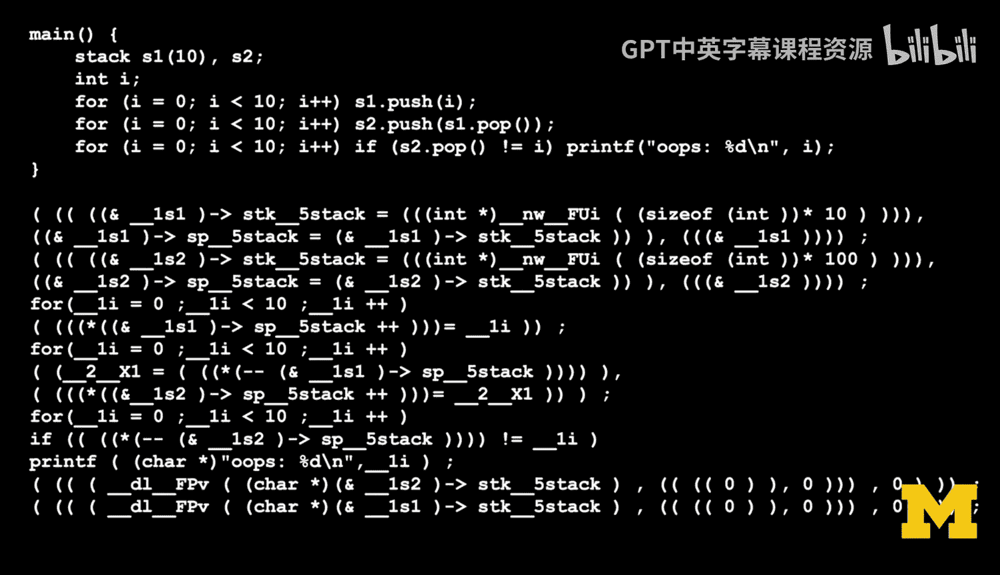
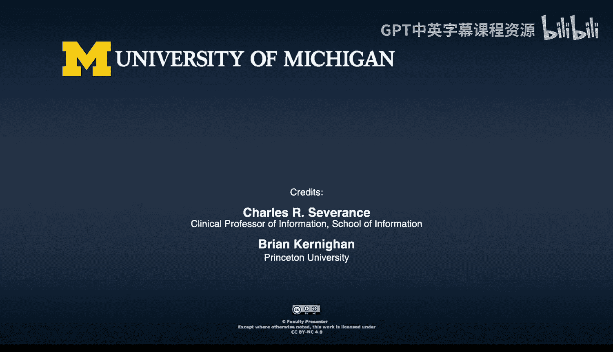

# C语言编程：23：贝尔实验室的C与C++演进 🏛️💻

在本节课中，我们将了解C语言与C++在贝尔实验室的共同演进历程，探讨C++如何从C语言中诞生，以及两者之间的相互影响。

---

## 概述

本节内容基于布莱恩·柯林汉的讲述，回顾了C语言与C++在贝尔实验室的早期发展。我们将看到C++如何作为C语言的扩展被创造出来，以及这种设计决策背后的工程考量。

---

## 协作环境与共同兴趣

上一节我们介绍了编程语言发展的背景，本节中我们来看看孕育C和C++的特定环境。

当时的环境具有高度的协作性。这个大约由30人组成的团队，成员们对许多相同领域的事物都抱有浓厚兴趣。

尽管兴趣的触角伸向不同方向，例如理论计算机科学、数学以及物理科学等领域，但团队中至少有很大一部分人本质上是软件开发者。

---

## C++的诞生：从Simula到C

以下是C++语言诞生的关键背景和设计思路。

加内尔于1979年获得剑桥大学博士学位后加入贝尔实验室。他对模拟仿真领域感兴趣。

他尤其了解Simula语言，这很可能是最早的面向对象语言之一。他想要进行模拟仿真，但C语言是贝尔实验室当时普遍使用的语言。

因此，他所做的是尝试将Simula语言中的一些优秀思想，特别是“类”的概念，移植到C语言之上。

在很长一段时间里，C++的实现方式基本上是将C++代码翻译成C代码，然后就可以在任何地方运行。这是比雅尼·斯特劳斯特鲁普做出的众多务实工程决策之一。

---

## 务实的设计哲学

如果你想推广一门新语言，如果它需要用户携带庞大的基础设施、支持库和其他包袱，那么很难让人们接受它。

反之，如果它只是一个额外的程序，能够完美地融入用户现有的环境，包括语言本身、库以及其他所有部分，那么推广起来就会容易得多。

因此，C++经历了一段进化时期，并且至今仍在进化。

---

## C与C++的早期共生关系

从大约1980、81年代初期开始，这两种语言紧密地联系在一起。因为我们同属于贝尔实验室的一个小组，这个小组的规模恰好能舒适地容纳在这栋建筑的这条走廊里。

比雅尼·斯特劳斯特鲁普无疑对C语言了如指掌，他正在开发这种运行于C语言之上的新语言，这同时也对C编译器提出了考验。

这种做法是有益的，因为他的预处理器生成的代码质量令人惊叹。

我认为C++中的一些思想后来又被反向移植回了C语言。

其中最明显的一个例子就是如何声明函数的参数，仅仅这一点就更好。还有其他一些改进。

因此，有一段时间，你可以说C语言几乎是C++的一个完美子集。我认为后来两者都各自演进，现在这种说法已不如当时准确。

但在很长一段时间里，你可以直接拿一个C程序，用C++编译器编译，它就能运行。

---

## 机器生成代码的挑战

有一个普遍的观察是：人们编写代码的方式与计算机生成代码的方式不同。

因此，机器生成的代码往往会特别考验编译器或目标语言的极限。

在C++生成C代码的例子中，它们会生成嵌套层次极深的构造，其复杂程度让Lisp语言都显得温和。

同时还包括非常复杂的指针计算、函数指针等各种情况。这无疑是一种压力测试。

生成的代码还可能包含一些具有奇怪尺寸的结构，这些是编译器未曾预料或至少未经过充分测试的。

---

## C++的设计权衡与接受度

我认为当时很多人并不认为C++是“正确”的，它在某些方面存在各种瑕疵和缺陷。

其中许多缺陷再次直接源于比雅尼·斯特劳斯特鲁普的工程判断：如果你希望这个东西能够流行起来，那么它与现有文化的兼容性越高，成功的可能性就越大。

如果你创造了一个截然不同的东西，人们很可能会忽略你。

因此，C++中至今仍存在的一些语法问题，你可以看到它们由来已久。

当我尝试向人们教授C++时，我会向他们展示如何将一个C++对象翻译成C代码。本质上，它只是指向结构的指针，编译器负责区分名称，所以你不需要考虑它们。

看到这种翻译过程，你就能理解面向对象编程如何能在几乎零开销的情况下实现，因为它只是结构体指针、有趣的函数名，并且可以传递函数指针。这一切都表现得相当良好。

这种理解帮助我明白了C++和面向对象编程背后的机制。

我认为在现代语言中，以Python为例，那里有大量的“魔法”在发生，我并不完全清楚它是如何运作得如此之好。

我的意思是，我可以大致想象，但像包含lambda表达式的列表推导式这样的机制，到底是如何工作的？

---

## 总结

本节课中我们一起学习了C++在贝尔实验室从C语言中诞生的历史。我们了解到，C++最初被设计为C的扩展，通过预处理器翻译成C代码以实现跨平台，这是一种务实的工程决策。早期C和C++紧密共生，C++的某些思想甚至反过来影响了C的演进。我们还探讨了机器生成代码对编译器的挑战，以及C++在设计上为求兼容和普及所做的权衡。理解C++底层的翻译机制（如对象即结构体指针）有助于深入把握面向对象编程的原理。