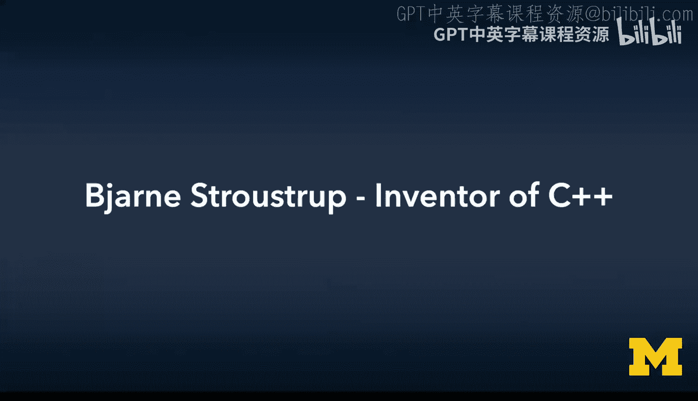
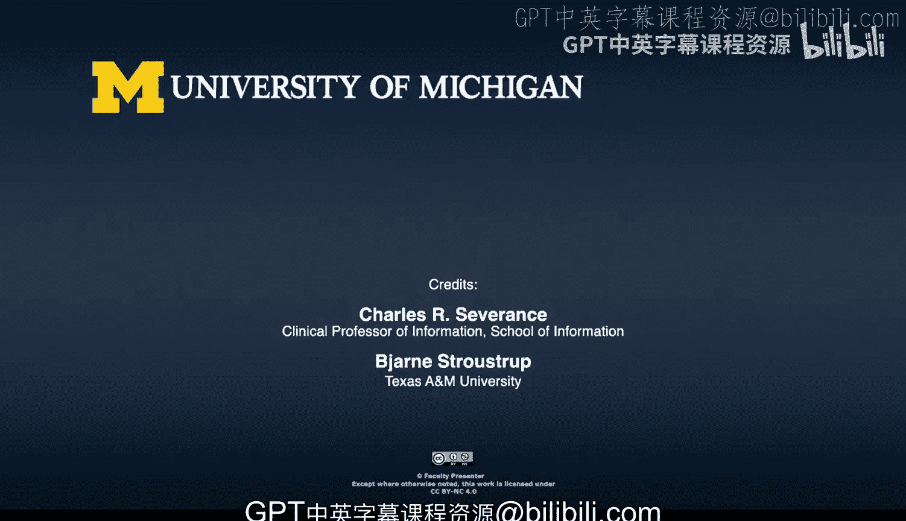
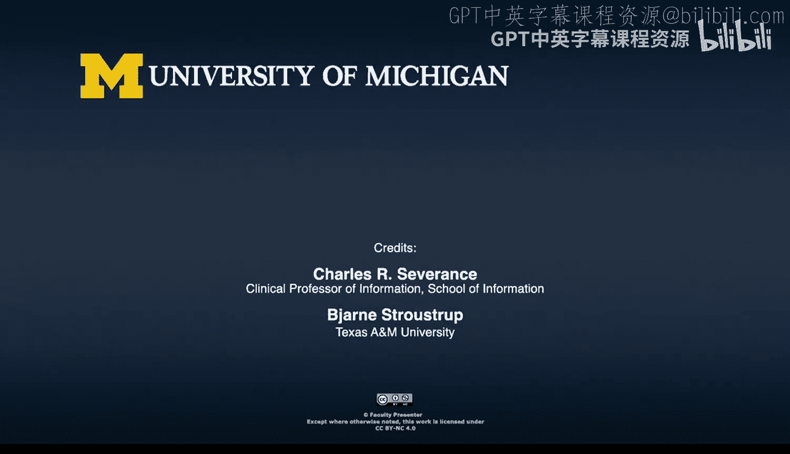

# C++编程思想：03_01_05：C++之父谈C++的设计哲学与核心应用领域

## 概述

在本节中，我们将跟随C++之父Bjarne Stroustrup的视角，探讨C++语言的设计初衷、核心应用领域以及其独特的编程哲学。我们将了解C++为何在特定领域（如基础设施软件）中至关重要，以及它如何通过类型安全、编译时计算等特性来构建高可靠性系统。

---

## C++的核心应用领域

我试图描述C++在哪些方面特别有用。我最初构建它是为了什么？经过近30年的发展，它今天的优势是什么？同时，它的应用边界在哪里？

在我看来，C++有一个核心应用领域，这通常被称为“传统系统编程”，但这个术语并不准确，因为它更多指的是一种编程语言风格和编程范式。

因此，我更进一步思考：哪些应用需要C++提供的服务？我处理过的所有应用程序中，哪些是C++发挥作用且必不可少的？我提出了“基础设施”这个概念。

我大致将其定义为：如果它崩溃了，就会有人受伤或遭受损失。这些是我们系统中必须正常工作的基础性事物，是社会运转的基石。

我试图阐述的问题是：在这些领域中，什么才是最重要的？我总结出了一些关键概念。

以下是构建可靠基础设施软件所需的核心要素：

*   **紧凑的数据结构**：高效利用内存和计算资源。
*   **强类型接口**：用于提高可维护性和最小化错误。
*   **对算法的重视**：相较于随意编写的代码，我们更需要可靠的算法，因为我们需要系统可理解、可分析，并确保其正确性。

我撰写的论文正是源于这种思考：对于必须可靠的、基础设施类的软件，什么才是正确的编程风格？我们需要什么样的语言特性来支持这种风格？

我们可以找到真实的例子。一些现代代数系统的核心、我们电话系统的基础、我汽车里的刹车系统。我们如何让这些系统变得可靠？

---

## 可靠性的挑战与解决方案

我们如何确保太空探测器在前往火星的半路上不会因为逻辑错误而蓝屏死机？我们无法派维修人员去修理。我们如何确保它们进入正确的轨道？

喷气推进实验室（JPL）曾丢失过一个火星探测器，因为两个团队沟通出现了问题。他们以为沟通顺畅，但实际上，一个团队使用英制单位，另一个使用国际单位制（SI，即公制）。结果导致了导航错误，将价值超过一亿美元的设备送入了错误的轨道。这不是一个好主意，这是200名优秀工程师毕生工作的心血付诸东流。

只需稍微改进程序各部分之间的接口，这种错误本可以避免。我对这类问题很感兴趣。

因此，存在一个核心领域，我认为C++提供的设施（尽管并不完美，以及我正在研究的那类特性）是必不可少的。

然后存在一个巨大的灰色区域，在那里你有选择。在我看来，C++可以提供帮助，但并非必不可少。最后，还有一些领域可能不适合应用那种严格的技术。如果我为自己开发一个小型应用，或者有人试图快速推出一个简单的网页应用，他们不需要那种级别的可靠性，也许我谈论的编程方式并不适合他们。

但我认为这里真正重要的是要认识到：不同的技术、不同的语言适用于不同的领域，我们必须认识到这一点。

我们不能为所有人使用一种简单的语言，也不能为所有人使用一种简单的语言使用技巧。我们不能拥有单一的工具链或单一类型的系统。

---

## 教育与思维方式的差异

由此，我们可以更进一步：我们不需要为所有工程师、软件开发人员或任何构建基础设施（例如，自动更新手机软件的机制）的人提供相同类型的培训和教育。

他们必须与开发小游戏的人接受不同的教育、拥有不同的知识、接受不同的训练。因为前者一个小小的失误，就可能毁掉数百万人的一整天甚至一整周。如果911核心服务无法接通，甚至可能有人受伤，糟糕的事情就会发生。

这不仅仅是运行在其上的软件，还包括更新软件，以及安全关键链条中的任何环节。但从事这项工作的人，其思维方式必须与编写一个小型应用（也许是为了快速处理几本书）的人不同。这本身没有错，但事实上，他们必须有不同的思维方式。

如果你将这种非常严格的、工程导向的思维应用到小型商业应用上，你可能会晚上市一年。另一方面，如果你将“唯快不破”的态度应用到我汽车的转向系统上，那可不是个好主意。这些人必须有不同的思维方式。

而让人们以不同方式思考的方法，就是给予他们不同的教育。我们没有一个“标准程序员”，也不应该有。如果我们有，那应该是土木工程师那样的标准。

我认为，这个领域必须在某种意义上自我整顿，否则就会有其他人来替我们整顿。

---

## 改进语法：用户自定义字面量

“你可以定义自己的常量，并在常量后添加后缀”这个特性，是你在某个中间阶段添加的功能，还是简单的运算符重载？

我们观察到，各种基本类型衍生出了大量的小后缀。例如，`u` 表示无符号（unsigned），`l` 表示长整型（long），等等。我记不清其他的了。有人曾想，在C++里你几乎可以做任何事情，但就是不能定义自己的字面量。

然后我单独观察到，有一些技术是有效的，但人们因为记法太丑陋而不愿使用。我展示的Unix例子就是其中之一。在过去的10年里，库一直是可用的，费米实验室就有一个不错的库，但它没有得到应有的广泛使用，因为用户不相信那种记法，他们不喜欢。

因此，我们研究的是，如何从根本上清理人们的源代码？我们如何让代码看起来像理想语言中的样子？如何让代码看起来尽可能像教科书里的样子？

所以，用户自定义字面量（units suffix）只是一种让你的代码看起来像物理教科书里方程的方式。我们知道如何避免那个火星气候轨道器的问题。每个人在高中物理课上都学过：首先，确保你的单位匹配，然后再进行详细计算。那为什么人们不这么做呢？因为这样做太繁琐，或者当他们这样做时记法太丑，或者如果他们使用运行时技术，成本太高。

因此，我和朋友们认为这个问题值得解决，试图找出我们已有的解决方案，并经历了多次演进。我认为最后的润色是由David完成的，现在它已经是标准的一部分了。这是一个目前尚未广泛普及的特性。

---

## 编译时计算与常量表达式

那个例子可能也存在于你的电脑中。除了后缀，还有其他例子让人们可以从类内部创建自己的字面量吗？

当我开始设计C++时，我提供了构造函数，它允许你从参数构造某种类型的对象。这非常有效，人们使用构造函数就像它们是字面量一样，但它们不是。这存在运行时成本。

因此，我们在C++11（C++的第一个主要更新标准）中做的第一件事，就是引入了**常量表达式**作为一个更基础的概念。这是我和我的同事Gabriel Dos Reis合作的工作。

我们有了可以在编译时求值的**常量表达式函数**，以及**常量表达式类型**，这样你就可以在编译时进行类型丰富的编程。这在高性能计算和嵌入式系统领域非常重要。这是我们为解决那个问题所做的。常量表达式求值更通用、更易用，是的，也更美观。

在C++11及更早的版本中，你可以写 `complex(1, 2)` 来创建一个复数。今天，你可以写同样的东西，并让这个复数在编译时创建。因此，假设你想创建一个点（它和复数在结构上类似），你可以写 `point(1, 2)`。现在你仍然需要写 `point` 或 `complex`。

C++的另一条思路是泛化并使初始化更安全。因此，如果你知道所需的类型（例如，你有一个返回复数的函数），你可以简单地写 `{1, 2}`，编译器会说：“哦，`{1, 2}` 应该用来创建一个复数”，然后它就会创建一个复数并返回它。如果这可以在编译时完成，它就会在编译时做。所以这些特性协同工作，你得到了更好的记法、更好的性能。

任何你可以在编译时做的事情，在并发系统中效果更好，因为你无法在一个常量上发生竞态条件——如果它在程序开始前就已经计算好了，你就不会遇到线程问题。

---

## 统一初始化与类型安全

所以 `{1, 2}` 意味着：为我将要放入的这个东西找到一个构造函数。它会查看目标位置，然后判断是否存在一个双参数构造函数、三参数构造函数，或者无论什么。或者如果它只是一个结构体（`struct`），它会将第一个元素放入第一个成员，对结构体也是如此。哦，我有一段时间没写C++了，这真是个很棒的想法。

这就是**统一初始化**。如果可能，它会进行初始化。当然，如果存在任何歧义，它会发现歧义。如果你在一个上下文环境中，比如调用一个函数，目标可能是 `point` 或 `complex`，编译器会告诉你存在歧义。

实际上，错误检查在C++11中得到了改进，它比C++98更能发现错误。我来自这样一个哲学流派：当你生成代码、构建程序时，编译器是你最好的朋友。要让它成为你最好的朋友，你实际上需要有更多的类型。如果所有东西都是整数，类型系统能帮你什么？它不能。如果所有东西都是浮点数，我无法告诉你它是英制单位还是公制单位，你就会遇到错误。

所以你需要类型丰富的接口，为此你需要能够构建廉价、灵活且方便易用的类型。

---

## 演进与简洁表达

因此，我们从 `complex(1, 2)` 或类似的东西开始工作，到 `{1, 2}`（大括号是可选的，或仅在需要时使用），最后，我们现在可以写（如果我们想的话）`1 + 2i`。定义 `i` 为虚部单位，你甚至不用提 `complex` 这个词就能得到复数运算。这都隐藏在 `i` 的定义中。

## 总结

本节课中，我们一起学习了C++之父Bjarne Stroustrup对C++设计哲学的深刻见解。我们了解到C++的核心使命是服务于**基础设施软件**——那些要求极高可靠性和性能的系统。为了实现这一目标，C++强调**强类型接口**、**编译时计算**（如常量表达式）、**用户自定义字面量**和**统一初始化**等特性，旨在编写出更安全、更高效、更易于维护的代码。同时，我们也认识到，不同的应用领域需要不同的编程语言、工具链乃至思维方式，没有一种“万能”的解决方案。C++的持续演进（如C++11引入的新特性）正是为了在保持其核心优势的同时，让编写正确、高效的代码变得更加简单和直观。