# 密歇根大学《给所有人的C语言编程课（了解C、用C编程、数据结构、创建对象）｜C Programming for Everybody》 p26 05_02_01_在C语言中实现类似Python的面向对象模式.zh_en -BV1v2421P7pt_p26-

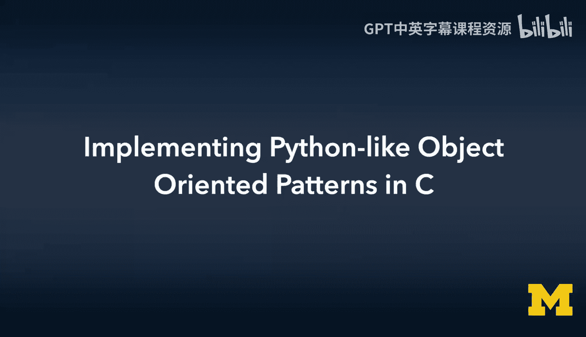

So now what we're going to do is we're going to try to build objects in C C doesn't have upshorient support。

 so in a sense we're going to do it by writing functions and using structures and pointers， etc cea。

 so we're kind of answering the question about how was Python's object oriented layer layered on top of a C structure？

So we can kind of put ourselves in the position of Gito Van Rossom as he was building a Python in 1991 and say how are we going to make this syntax work。

 How are we going to，In C which is underneath all of this。

 how can we make this syntax work and so this is just review， you know we got class point。

 we got a constructor takes two parameters， self is our instance pointer。

We've got D and weve got origin， and then if we look at the main program。

 we create a new point called the constructor， we can see that point dot dump。

 that is the function name dump inside a point， but then we've also got to pass the instance in。

Or the shortcut syntax。 And so the P T dot origin open brand and close brand， that is kind of。

Paying more homage to the way C++ would have called methods。

 and then of course the Dell operator at the end。So。Let's build ourselves some code in C。

 we are building， in effect， a point object in C。So we're going to just start with a structure。

And the structure is going to be point， and there's some instance variables。

 we're going to just allocate a double x and a double Y inside of it。

But then the methods are kind of weird。We are going to take the Dell method， the dump method。

 and the origin method， and we're going to define them as pointers to function。So void open PRnne。

 star， dell， close print， open print， construct point star， self closed print semimic。

 the void is the return type of this function。Star Dell means a function named Dell that code is not here。

 but this points to a function somewhere else， and then the constructstruct point star self。

 that's the first parameter right and so construct point star self is the fact that we're going to have one parameter it's going to be named self and it is a pointer to a structure and we've got something similar to dump the origin is pretty much the same except it's got a return value。

OkayAnd so that now is a structure。 This is C， so the structure is going to allocate 1 double。

2 doubles， which is should be8 bys each and then three pointers。

 which is8 bytes each so we've got eight times5 that's going to be 40 bytes it's not a dynamic structure。

 It is exactly 40 bytes of allocation because C structures are just memory and so it's not like you can sort of throw more stuff in there。

 You got to define it， you got to define what type it is and it's going to allocate space。

 We are going to use a connaming convention for now and we're going to create the dump function。

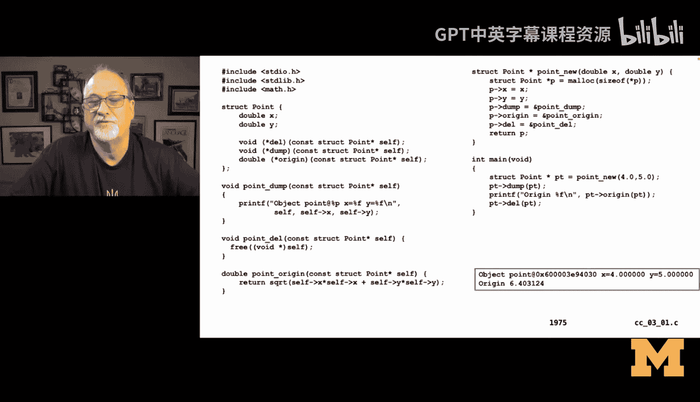

And the dump function is going to take a self parameter。

 and we're going to name it point underscore dump， that's just a naming convention。

And we're going to name the first parameter as it comes into our function self， just like Python。

We're going to print out object point at and then percent P， which is the way we print a pointer out。

 so self is a pointer。X equals percent fy equals percent F。

 and then we're going to print out self and self arrow X and self arrow Y。

 Now remember that kind of looks like PHP because self is a pointer to a structure。

 not a structure itself， so we use thearrow operator to both dereference self and then look up the attribute the attribute variable X。

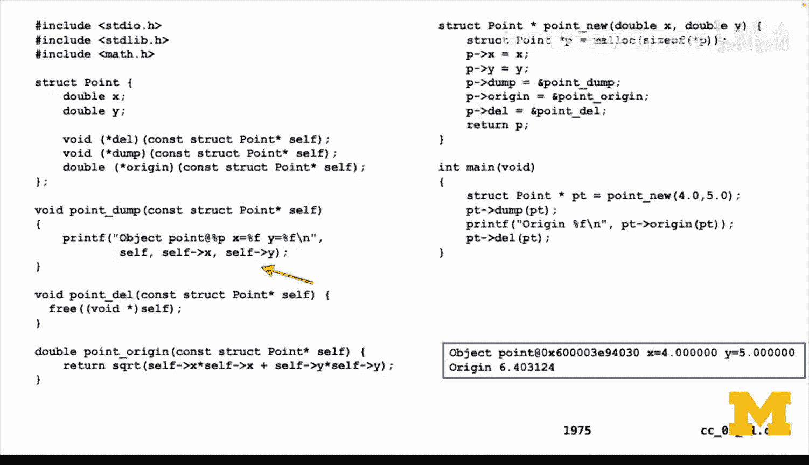

So if you look at the output， you see its object point at big long hex number for the address and x equals 4。

 y equals 5。And then we have the void point Dell， which is very similar， construct point star self。

 so the first parameter to Dell is self， and all of the first parameters are always going to be self when we create these functions that we're going to treat as methods。

And then we're going to free。 that's all that's going to do is call free on the pointer where we originally allocated it。

 Then we're going to create the origin method and again， take a single parameter self。

 and we're going to return。The square root of self x times self x plus self y times self y。

 and that's going to have return value。And then we're going to go and do the constructor。

 And the constructor is going to return a pointer to a point。 And it's called point new。

 We're going to sort of follow the new convention， and it's going to take two parameters。

 an X and a Y。 So the first thing we've got to do is we've got to allocate。The 40 Bs size of star P。

 which is。A double， a double， two doubles and two pointers to functions。

 which I think I've got it right is 40 characters。And then we're going to set we'll get that address of 40 characters back and we're going to set the x value to be x from the constructor。

 the y value to y from the constructor call， and then we're going to set the dump pointer to ampersand point dump Now this is done on purpose where point dump is defined earlier in the file and then P origin is the same thing point ampersand point origin so in each object that we're creating。

 we are going to record the address of three in effect global functions they're named point underscore but these are just regular old functions in the global function namespace right now we don't have namespaces。

 we're in C folks we can't sort of do that fancy stuff so we just use a naming convention to accomplish it。

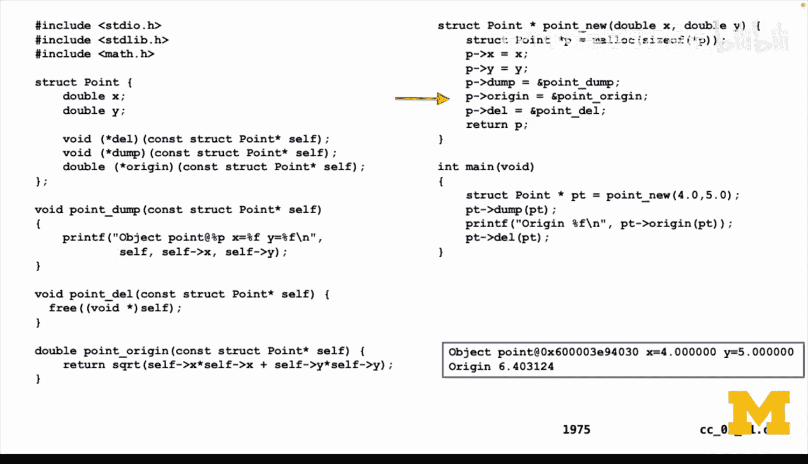

And then when we're done with a constructor， we do return P。

So that whatever is calling us gets their instance back， so P is the instance。

 but we are in the constructor allocating and filling the instance up with data。

 and it's just astruct， it's just 40 bytes of memory with some labels。

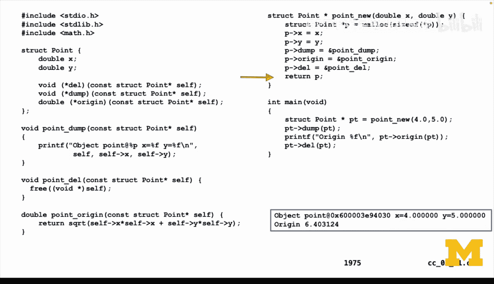

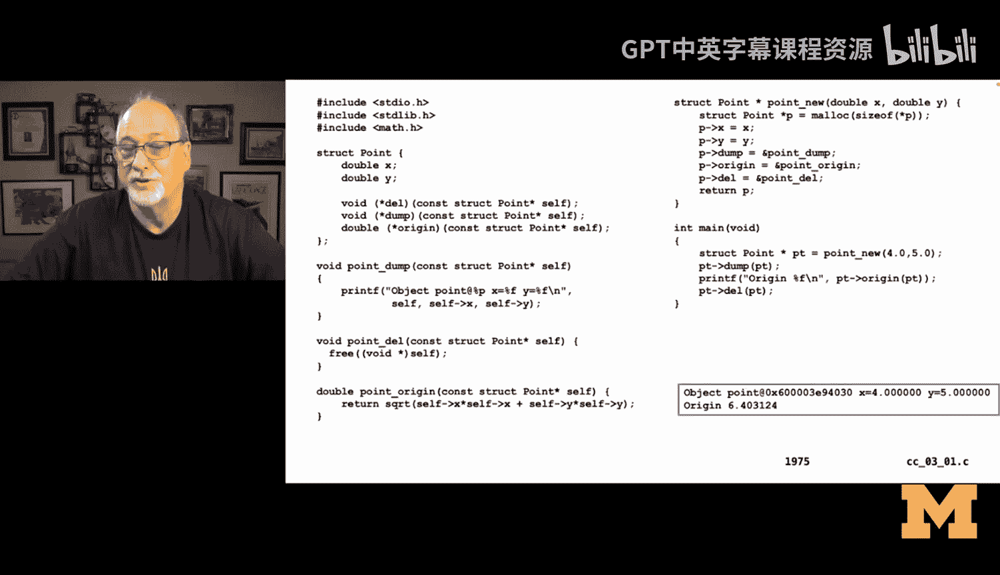

So in the main code， we saystruct point star PT equals point underscore new and then pm 4。0 comma 5。

0， and this looks a lot like00 code， except it's not。

 we're using a pointer to a structure and we're calling a global function called point new。

 we just happen to have named it in a way that looks a lot like object orientation。

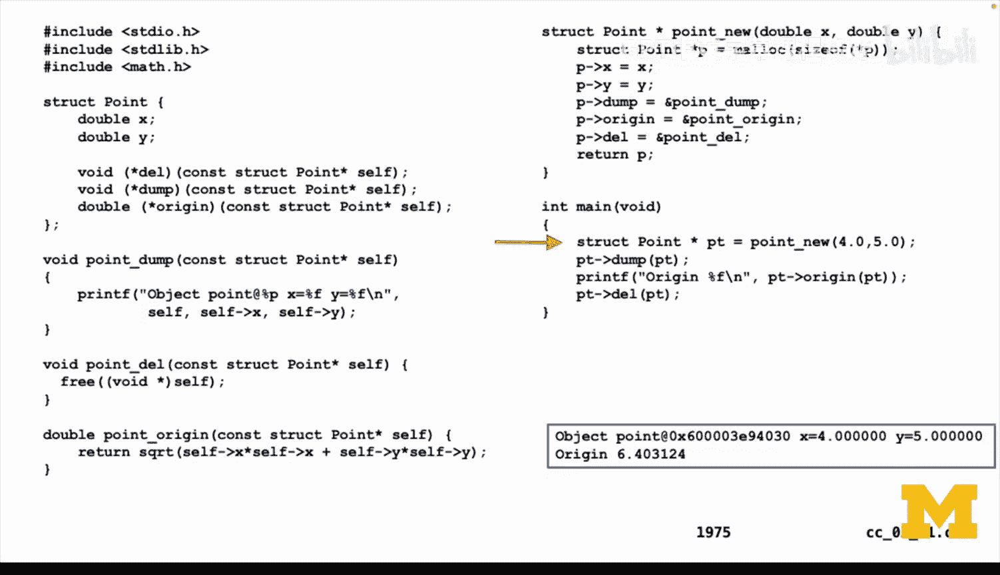

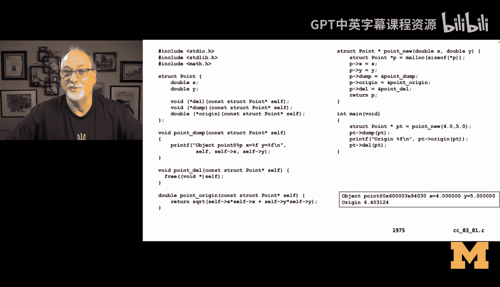

And so now what we can do is we can say PT arrow dump。

 which means go look up the dump variable inside the point object that's pointed to by PT and then call it。

 but we still have to pass in PT as that first parameter because that is self， that is the instance。

 so all these functions， dump， Dell， origin all need to have as their first parameter。

Self。And so PT dump looks up D， but then we still have to put PTN as a parameter。

And that syntax versus going to do the same thing for PT arrow origin， OpenP， PT closeP。

 and then to clean things up， and in this case we need to， well the program is done。

 but you know you need to free up allocated memory so the memory is allocated in the constructor。

 40 bytes is allocated in the constructor， and then those same 40 bytes are delocd by calling free in the constructor。

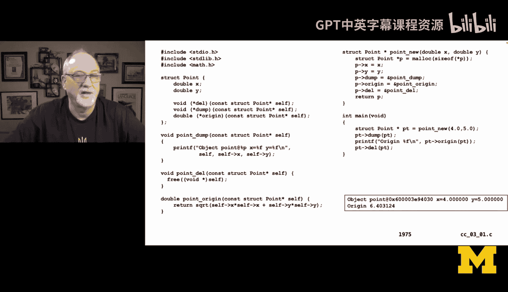

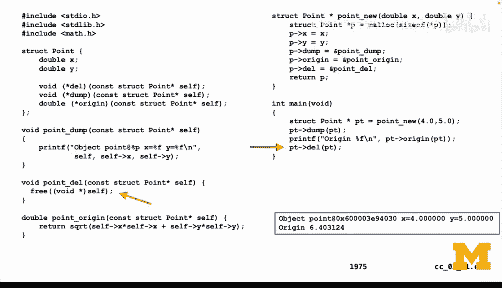

And so for intensive purposes。Other than conceptually， there is no objects involved in this。

 There'sstructs， There's pointers and there's functions。

 The fact that you can get a pointer to a function means that we've kind of imitated it。 And again。

 I look at this as how Gio Van Rossam。Actually， he was like facing this and thought to himself。

 how am I going to figure this out， How am I going to make it look like this is object orientation。

 So this is， this is kind of probably some of the code looked a lot like this in the early days of Python。

And then there was kind of a simple syntactic transformation layer in the Python sort of parsing to call these things with naming conventions。

 so you can do a lot of object orientation with naming conventions and if you recall C++ started as a language preprocessor and so again you could almost look at this as how did C++ get built。

Right， C++。Had some O0 syntax that then transformed the O syntax into C code that looks a lot like this。

 which is， oh， we got some functions， the functions have naming conventions and we create astruct and that struct has data in it but it also has pointers to function in it and we'll call the data the attributes and we'll call the pointers to the functions the methods andvoila。

🎼We have objectorient programming so up next， we're going to actually implement the Python string class or at least a little bit of the Python string class。

🎼So。🎼Yeah。🎼Yeah。

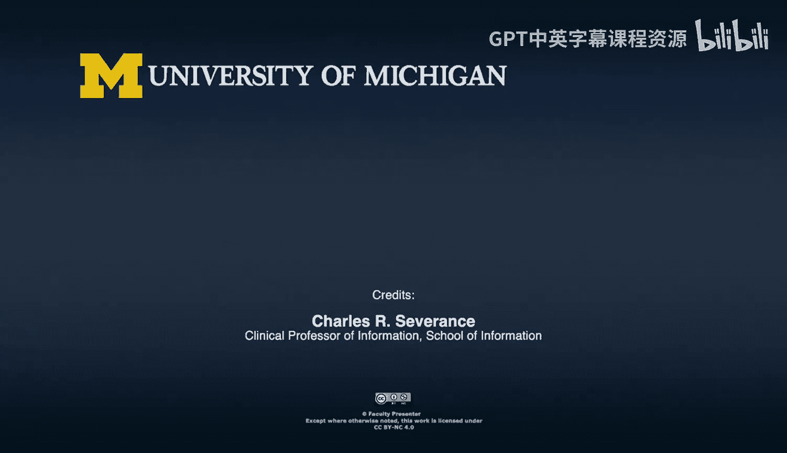