# 密歇根大学《给所有人的C语言编程课（了解C、用C编程、数据结构、创建对象）｜C Programming for Everybody》 p27 06_02_02_在C语言中实现Python字符串(str)类.zh_en -BV1v2421P7pt_p27-

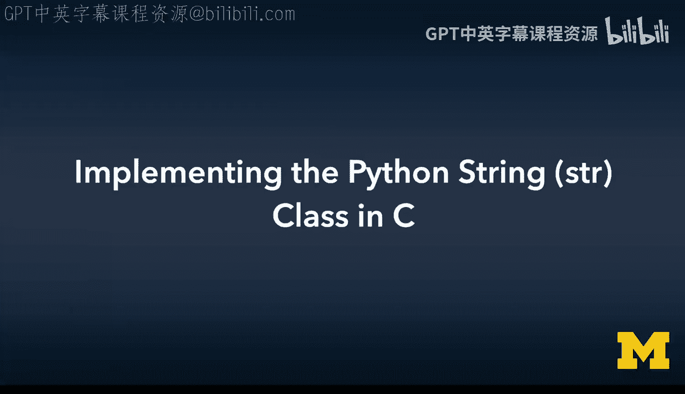

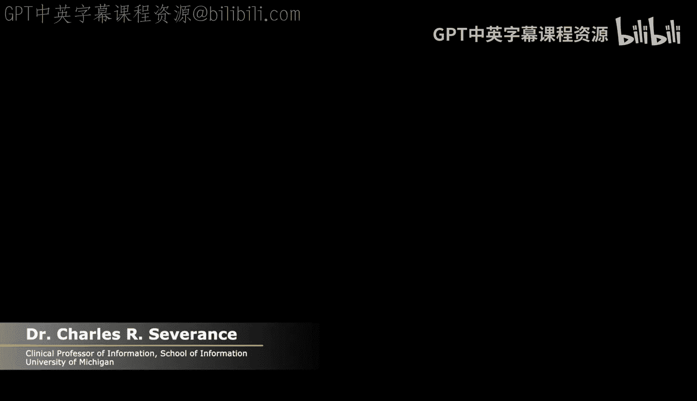

So now we're going to switch from my little point class。

 which is just two doubles to an actual string class。

 so what's interesting about the Python string class。Is that you can extend it。

 and so we've been talking a lot about pointers and arrays， and even when you call Malc。

You can't just keep extending things。 whereas in Python。 thankfully， we can just extend things。

 We create a string。 We can append a H to it。 We can print it， append L O world and print it。

 and then assign it to some other string and then print that and get get its length。

 And we never had to allocatecate or deallocate any memory during this time。

 when you get done looking at the code。 What we're going to have to do to allocate and delocate memory。

 What you should be thinking is， wow， I'm glad I'm programming in Python。

 I am glad that Gio Van Rossom gave me a string class rather than a character array of fixed length。

 an expandable string class。 rather than a character array of fixed length。

 So we are going to create in C using our little convention of naming a string class。😊。

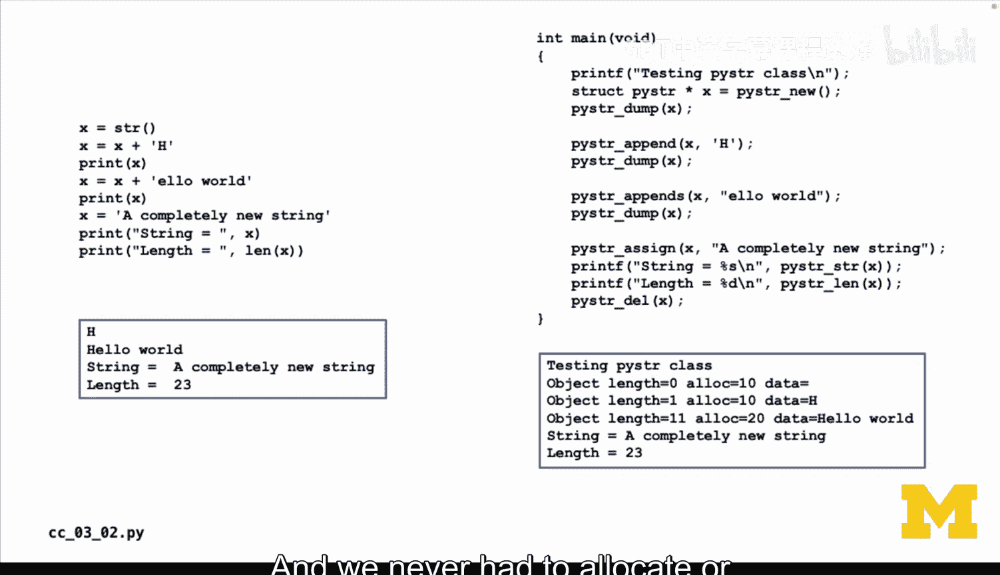

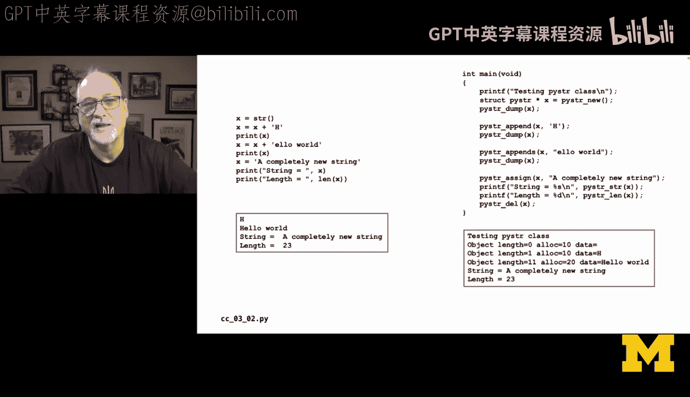

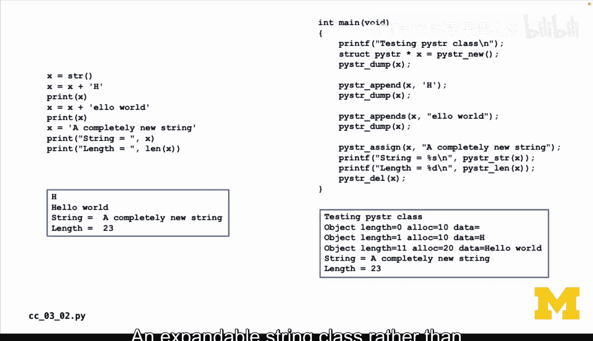

And so。

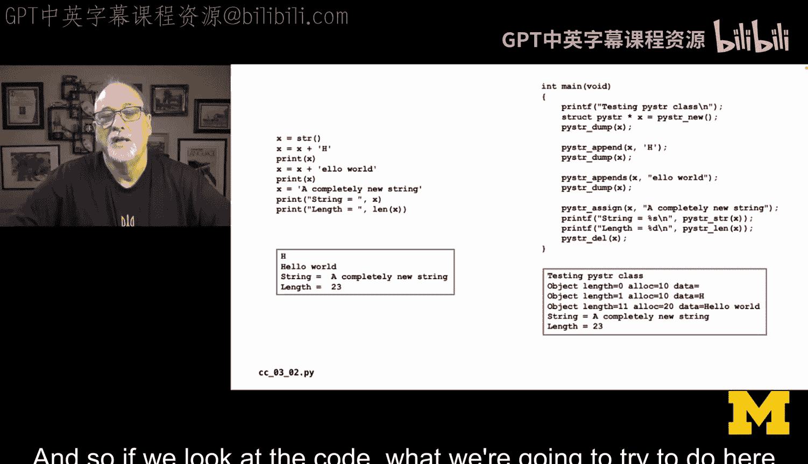

If we look at the code， what we're going to try to do here is we're going to basically emulate the Python syntax but in C。

 so we're going to start by making a structure pier structure， we're going to get a pointer back。

 we're going to name that X， we're going to call the constructor pier new。We're going to dump it。

 we're going to have a little dumper， we're going to append an H to it。We're going to dump it again。

 then we're going to paint a whole string。 Now H in C is a character。

 and L O world is a multi characteracter string。 and so we are appending many characters。

 We're going to dump that。 then we're going to assign it to a completely new string and they're going to print it out like Pi。

 give me the string version of this object。

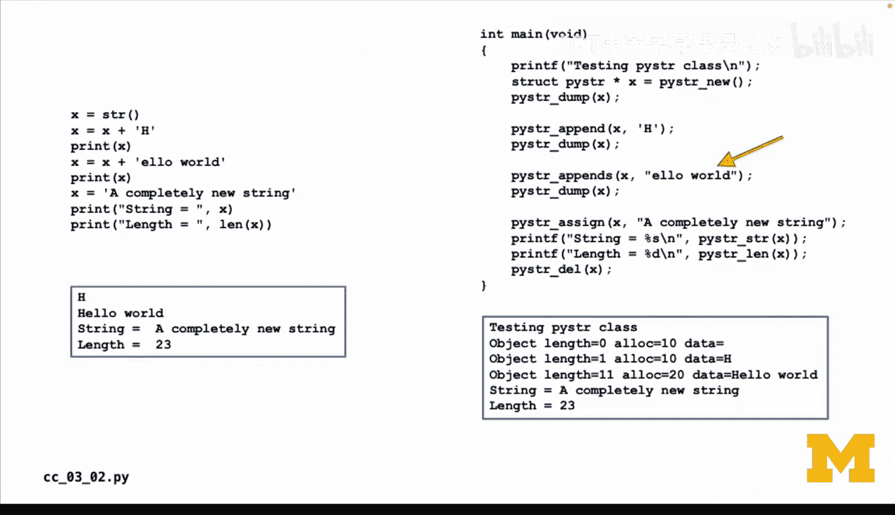

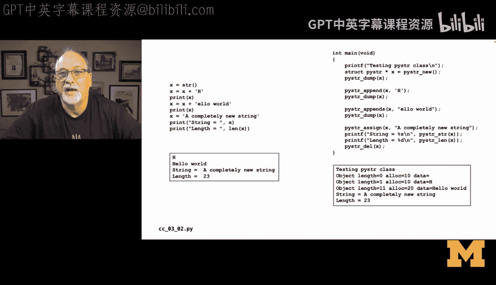

Or the length of it。 And then we're going to delete it， throw it away。

 So you can see all of the Python operations are sort of mimicked。

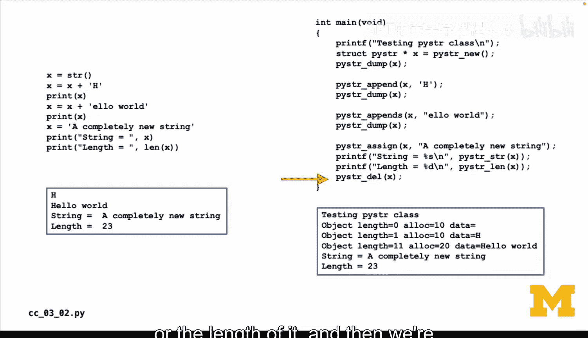

But with naming conventions in C， now the one thing you'll notice here is。In this main code。

 we never allocated any memory and we never ded any ever any memory。 that is within the object。 Now。

 within the object， we have a responsibility to properly allocatecate and delocate。

 But one of the interesting things here is is。

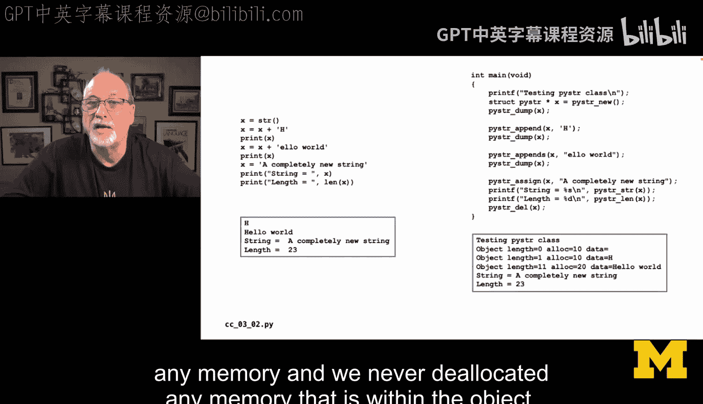

I haven't shown you the code to do any of that and so。You don't know that。

 but that's cool because we can use this as long as we do a new。Play with it and then do aelell。

We can do stuff with it， underneath Per， it does all of that memory management for us。

 and that's one of the beautiful things about an objectored approach。Again。

 the syntax on the one side in C is pretty heavy， but and the syntax on on the other side。

 which is the。The Python is pretty light。But the idea is。

 is that in Python we never had to worry about over making a string too long or too short or having buffer overrun or anything like that。

So as we dive in。We have to realize that part of the job。

Of this pier object is to handle all memory allocation on our behalf， so we as programmers。

 can write much simpler code。Okay， so now we are going to build the pier class。

 we're going to create a structure called pier， and in that we're going to have three things。

 the length of the string。We have how much data we've got allocated in the string。

 and then char data is the actual character array。

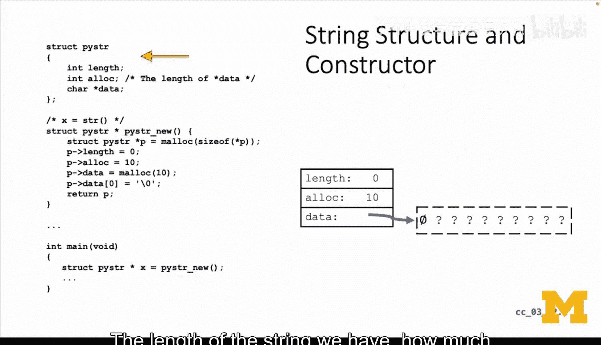

And so we have to have a character array inside of it。We're not。

 we're not going to let the outside code touch this character array directly。

 We're going to completely manage it inside this object。 We got draw a little bubble around us。

 And it's like， you can do stuff。 You can use my object。

 but I'm going to deal with everything for you。 So don't mess around with my internal stuff。

 So what we would think of is all of this instruct Pier is sort of private and see we don't have a good way to force it to be private。

 But in the concept of object orientation。 lengthngth。

 ac and data would be something we'd think of as private。 in our constructor。

 we are being asked to create a new Python string。

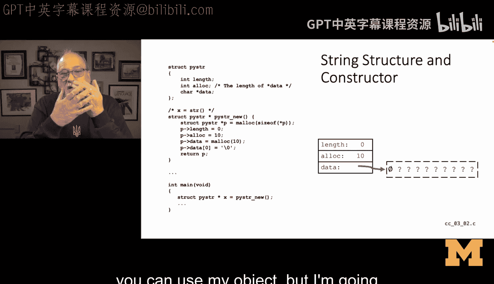

And we're going to return a pointer to that structure when it's done。

 So the first thing we do is we allocate Now， int int is usually 32 bits。

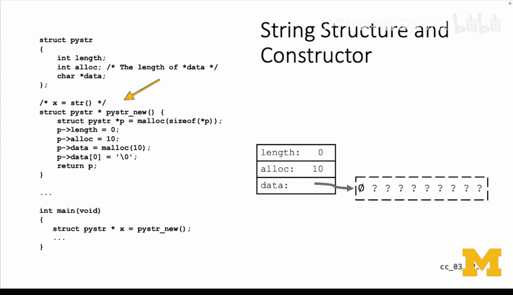

So that's4。Alc， there's for8， there's probably 16 characters in pier。

 When we do Maloc size of P is 16， that's the number 16。 And so it's goes give me 16 characters。 Now。

 the key thing is is that that is not allocating the actual string data。

 It's just allocated 8 bys for a pointer to the string。 star data is a pointer。

 and that first mallck is only giving us the pointer， not the actual data。

 So then we just sort of set it up。 we say our length of the string is0。 There's nothing in it。

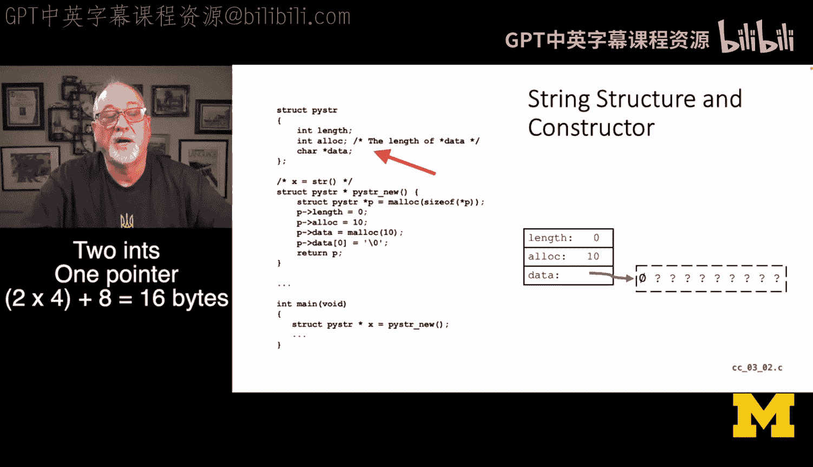

Our allocated length of the underlying data string is 10。

 and then we immediately call Malick to get 10 characters。

 So now data is a 10 character character array。 And Alec tells us how much we've allocated because it's our job inside this thing to keep track of that stuff。

And then just to be good， we throw back size 0 at the zero position in that allocated character。

 We don't know what the rest of them are。 We just know that the first one is 0。

 And then we return the pointer to the structure， not the pointer to the data。

 the pointer to the structure。 And this gets called inside the main asstruct pier star X equals pier new。

 And when we're done， we get back this cool little two pieces of data that have been dynamically allocated。

 And it's all， it's all ready for us to do cool stuff with。 Weve got the struct。

 We've got the constructor。 and then we've got the destructor， which is piistster Dell。

 in that a again passes in self。😊。

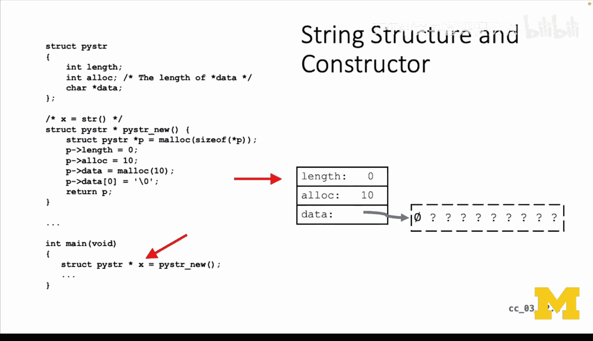

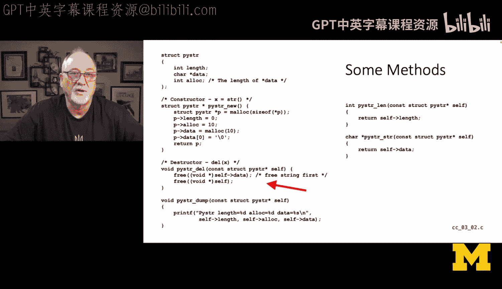

Now， we're calling free。 Now， if you recall， there are two allocated things。 One is the data。

 which is the character array that we've got。 We've got to get rid of that。

 and then weve got to get rid of the object itself。 And so at the end of Dell。

 we have given back all of the data that we've all。

 Now one thing important here is the order of these two statements matters a lot。

 So when we free self。 We're not supposed to access self any more after that point。

 I'm sure there could be some data just laying in there that's not been ruined。

 But you just don't know。 And so that's why we have to free selfarrow data before we free self。

 just because it's just wrong to do that in the other order。 And so we do a Pistster dump。

 And in that we dump out the length。 we've dump out how much we've allocated so far。

 And what the data is in it so far。 And then Piistster L。

 Pistster L returns a integer and it takes self as a parameter。

 The key to this is it returns self length。 And you might ask why it is that we don't。

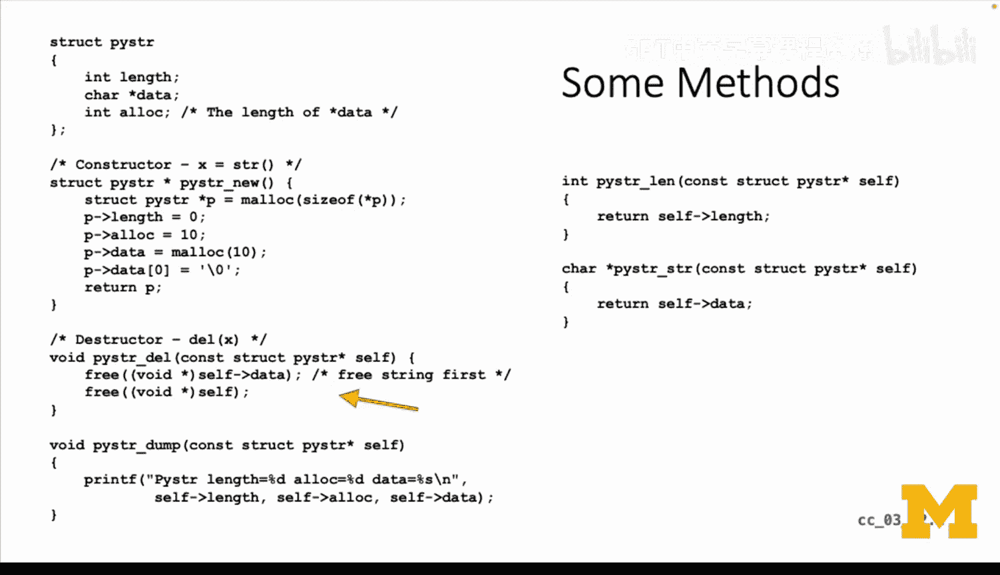

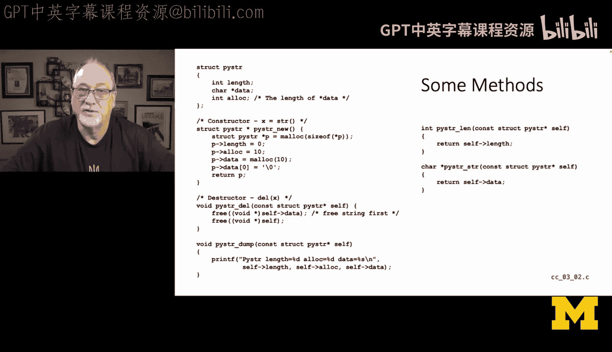

Let our calling code access self length and this again is encapsulation。

 We don't want to reveal the fact that we're keeping track of length in this variable because we don't want the calling code to be messing with it。

 remember that length data and aEC are kind of private。

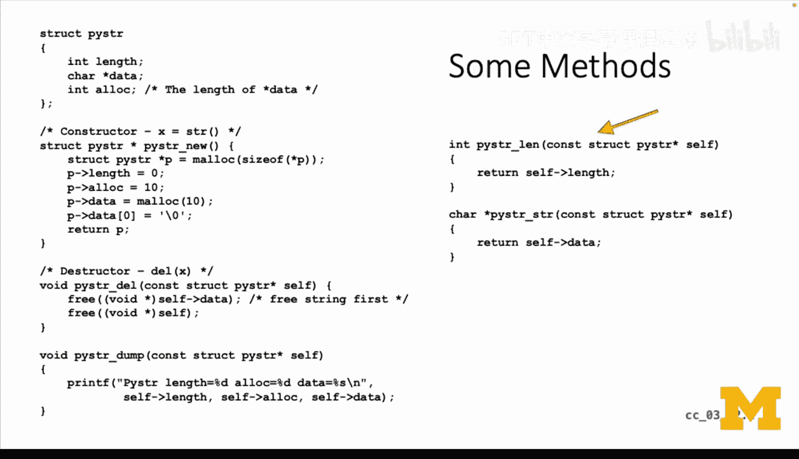

And so instead of saying， just go look at self length， No， I would like you to call my function。

And I will give you the thing you want。 So you just call the land function to pass in the instance。

 and that allows me to change the name of length。It allows me to interpret length differently。

 allows me to do all kinds of things， but at least the object writer。

Is in control of the contract with the outside world。

 So by hiding all the data and giving methods to we call these excessors to access this data is a good idea。

 Now， the underscore stir。 If you think a python。 It's like you can say stir open Pre close print anything。

 inside the parentheses and it converts it to a string。 Well。

 it just so happens that we're going to maintain self dot data as a valid string。

 So when you say take this string object and convert it to a string ready for printing。

 I'm just going to return the pointer to the string， we've been maintaining all along internally。

 We have some other methods that we've got to add。 We've got to add an append to add a single character。

 you can see that it's got two parameters， it's got self and a single character C， H。

 You got append S。

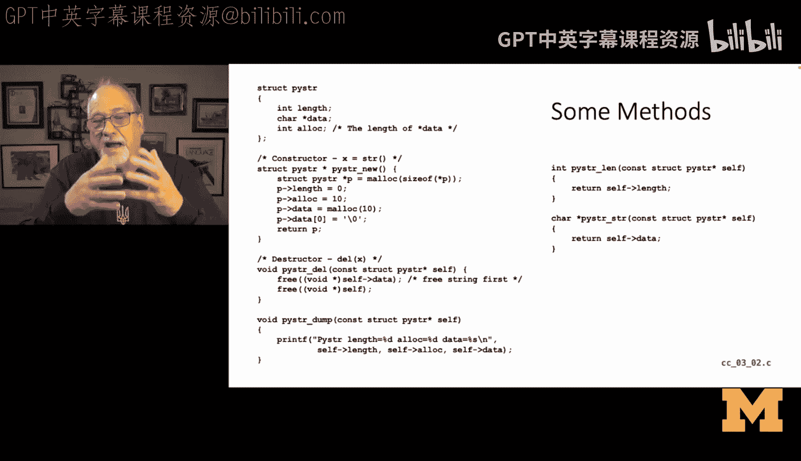

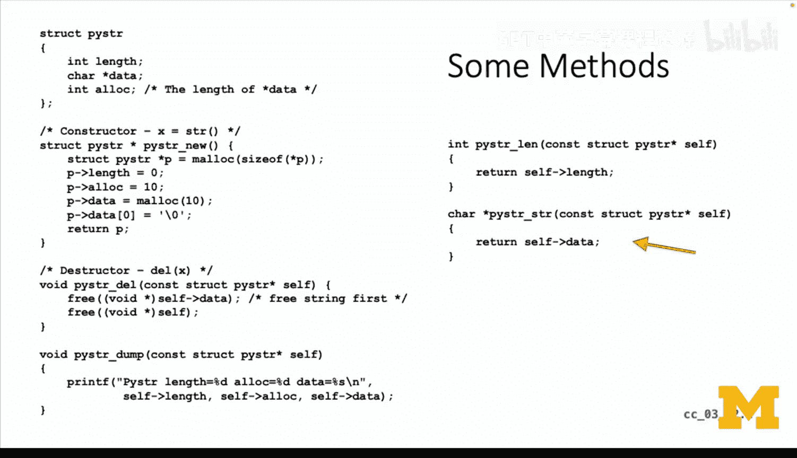

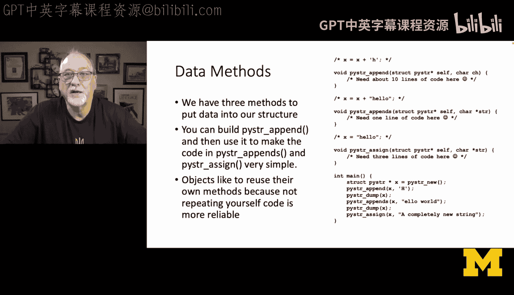

Which is a got two parameters， the self， the instance and a whole character string。

 which is a pointer to a character。 Then we have a sign， which is got two parameters， one is self。

 and one is a point or to a character string。Now I'm not going to give you these lines of code。

 I'm going to give you an assignment to write these lines of code。

 I'm going to show you how they're supposed to work， but I'm not going to give you the code。

So I'm telling you that Per append is about 10 lines of code。

Pistster append S is just one line of code。 It's a four loop。

 Piister a sign is about three lines of code。 So pier append S calls pier append。

 and Pier a sign calls pier append S。 And so we do a lot of reuse here。

 So let's take a look at how these are going to be used in our main program。

 We say struck pier star x equals pier new， which is give me a new string object And then we're going to append a single character H to it。

 and then we're going to append S a multi characteracter string。

 and we're going to dump it each time。 and then we're going to overwrite our object with a completely new string。

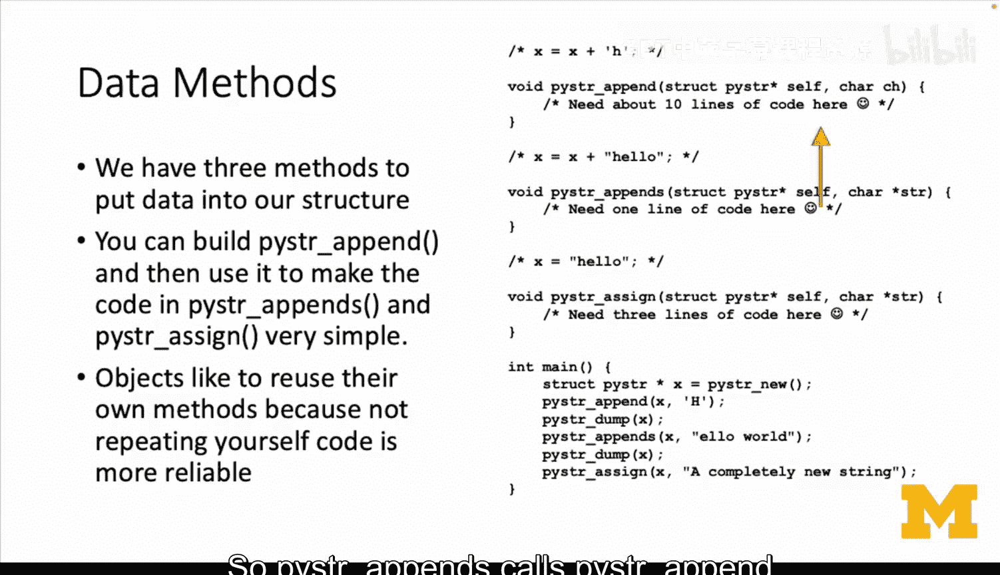

And so the key thing is you have got。To build this， this is what you're going to build。

Okay but I'm talk a little bit about how to do it。 So let's walk through what you might need to do in pi or append Now recall that when we set this thing up。

 we created length， we allocated 10 characters and a 10 character array and had data point to that 10 character array and we remembered that we had 10 characters。

 So the first thing that aend does， is it checks if the length is greater than what we've allocated。

 meaning you know if we're going to put in characters0 like the letter H we could just append it and then update length。

 we still have 10 characters allocated and we've used one of them。

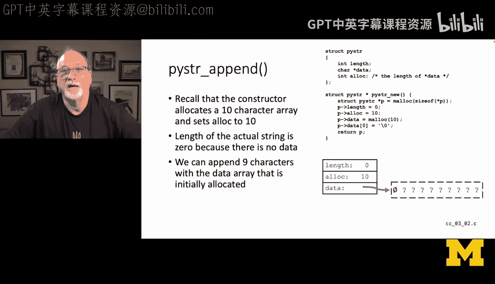

And so we can just start app into data right， and we have to put in zero at the after it so that the data is a valid string all the time。

 And so if you kind of imagine。That we create the new object。

 we have a new object it has a length of zero， and it has 10 character array。

 and it has a string end character in the first character。We're good。 we have 10 allocated。

 and we know we have 10 allocated。 Then if we add an H character， a single character H。

 all we have to do is add H into that array， data sub 0 in that case。

 and then update length to be 1 and then say data sub 1 is backlash 0 so that we terminate it correctly。

 So after that first line。😊。

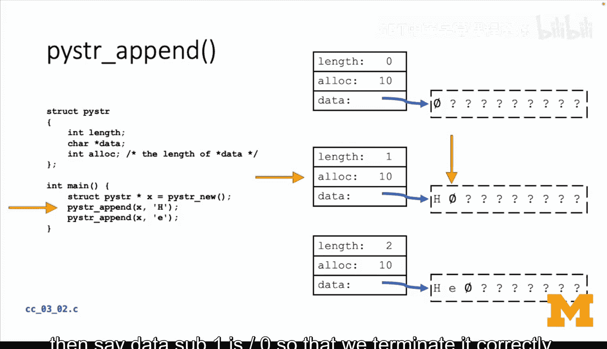

The data is H， it's a valid H string， so we've appended a single character。We've updated the length。

And then we have terminated the string， and then we go to the next line and see where we're just in this case。

 we're going to append the letter E， and we look at the length of it because it tells us where to put it。

 the length is1， so we put it in sub1 and add backslash0。

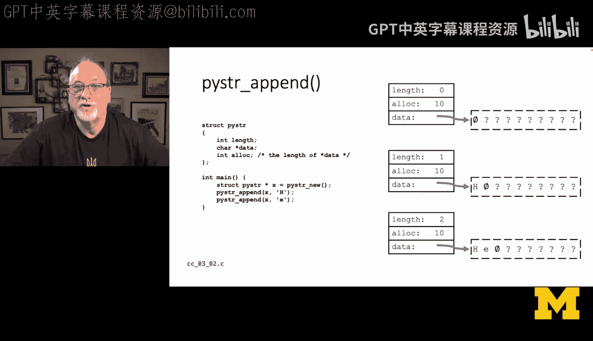

And then we check to make sure。That we have space for it， because we've got 10。

 but we've only used two。 We've really used three because H E end of character string。

 So we really use3， but the length of the string we've got is 3。

 So as long as no one asks us to append more than 10 characters， aend is a pretty simple operation。

 You just add to the character array that we've already got allocated。Okay。😊，But， of course。

 it gets interesting。 You can pen H， E， L， L， O， space W O， R。 And at that point。

 we have 9 characters in。Our length of the string that's in data is 9。

 We've got it properly terminated， so we have used the 10th character to terminate the string。

 so we're really good。

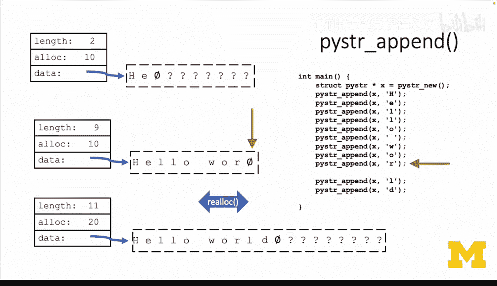

Things are great。But now， the problem is。We have got to append。The L after the R。

 So we have to append the L after the R。So what we have to do is we have to call a function。

 we called Malik in the constructor， and now in a pen we're going to have to call realalc。To say，oo。

 I asked for 10 characters。 but now I want to。Extend that from 10 to 20 characters。

 and Reeic does that。

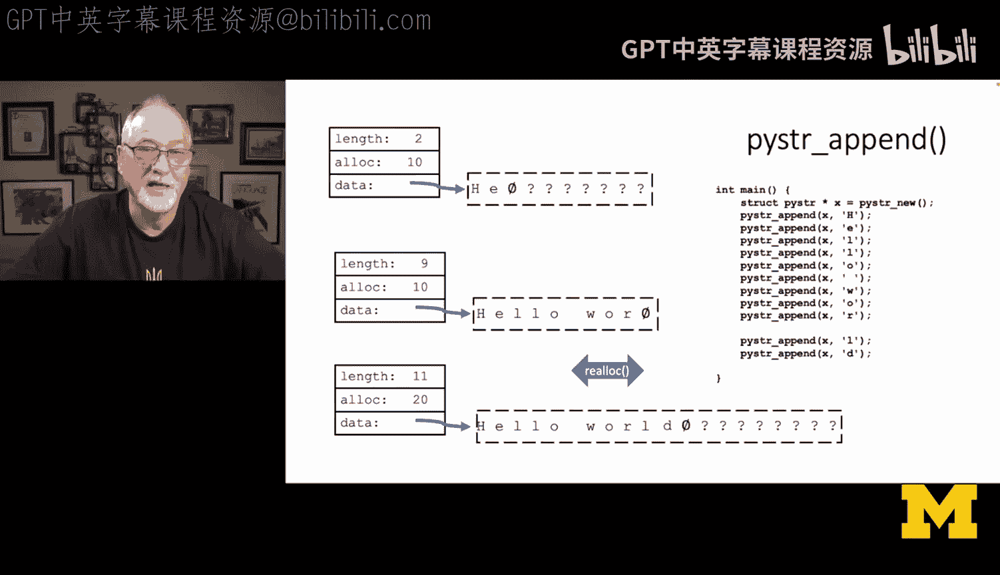

Ralex says here's a pointer。And it knows how many characters it is， please reallocate this pointer。

Take this date in this pointer and give me， make it 20 long instead of 10 long。

 It might have to copy it。 So let's take a look at what Reallic does。

 so we can extend the size of a dynamically allocated area by calling Reallic with the current pointer to the area and the new size。

So in the constructor， you see that we malled 10。And then。We're in the pen and we say。

 if the length is greater than self ac -2， we don't have space for two characters left。

 then we're going to have to realc。

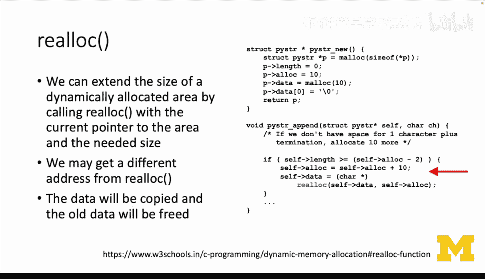

So what we're going to do is we're going to change this from 10 to 20 characters。

 so we're going to take self ac。

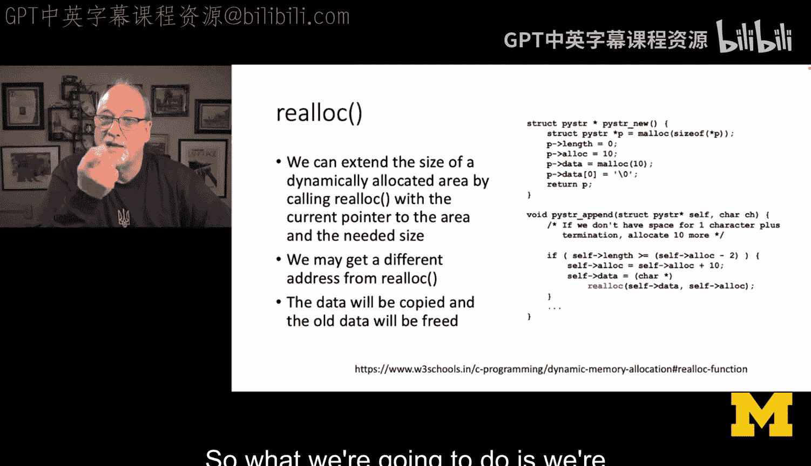

Which is 10 and add 10 to it。 So now self aic is 20， and then we're going to set self data to a。

To relic the old self data。

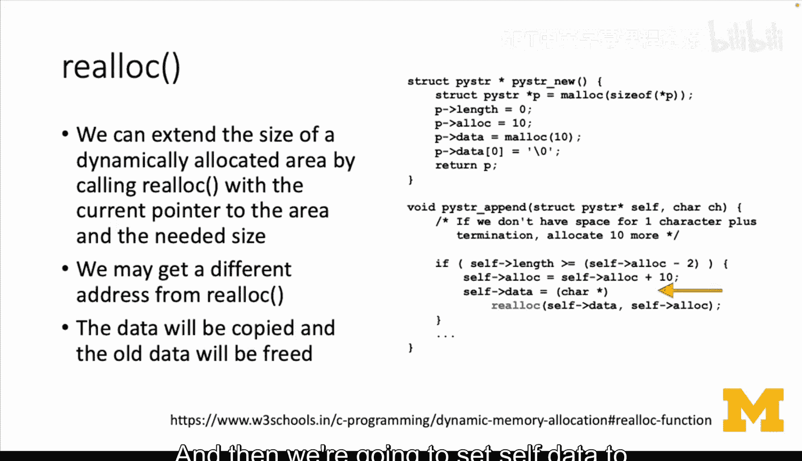

20 characters。 So this， this reallic。Takes a pointer。And a new size and gives us back a new pointer。

 Now， it actually may have to move it in memory。 so you can't assume that self data is the same before and after。

 But you can assume that if it had to move the data to find you a 20 character slot in its free space。

 that it will have copied all the first 10 characters it will be copied。

 And then you'll get a new parameter。 And that's why you see self data on both sides。

 both in the call to Reallic and。

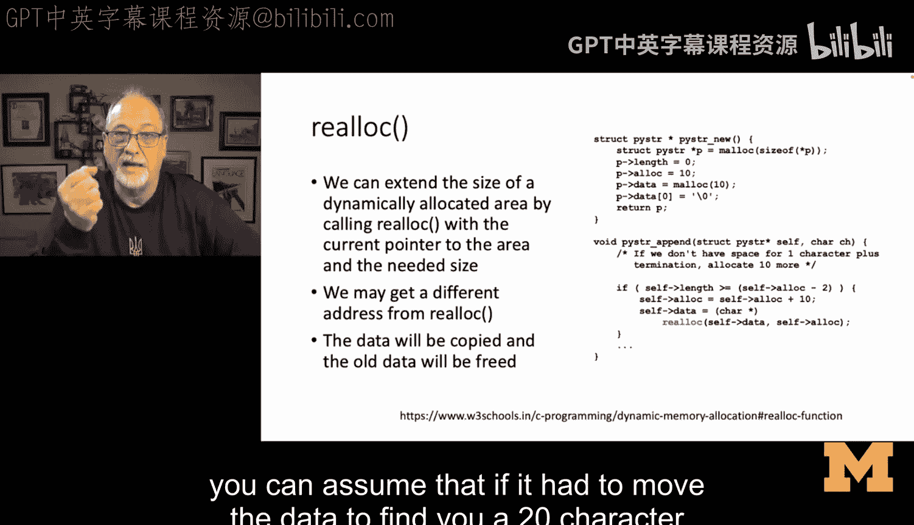

As the assignment statement。 So we go back here and we can see that， oh， yeah。

 now we have 20 and it's got plenty of space for the L and the D and the back slash0。

 So now we're going to show the code that's going to basically test our class。

 We're going to create a new。

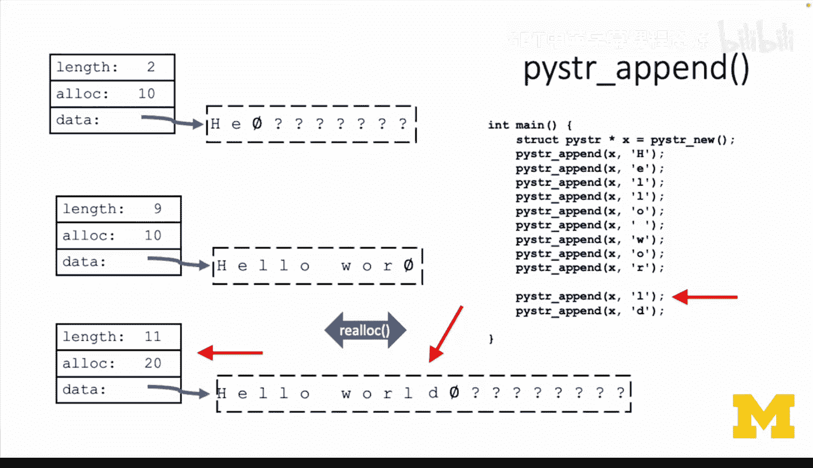

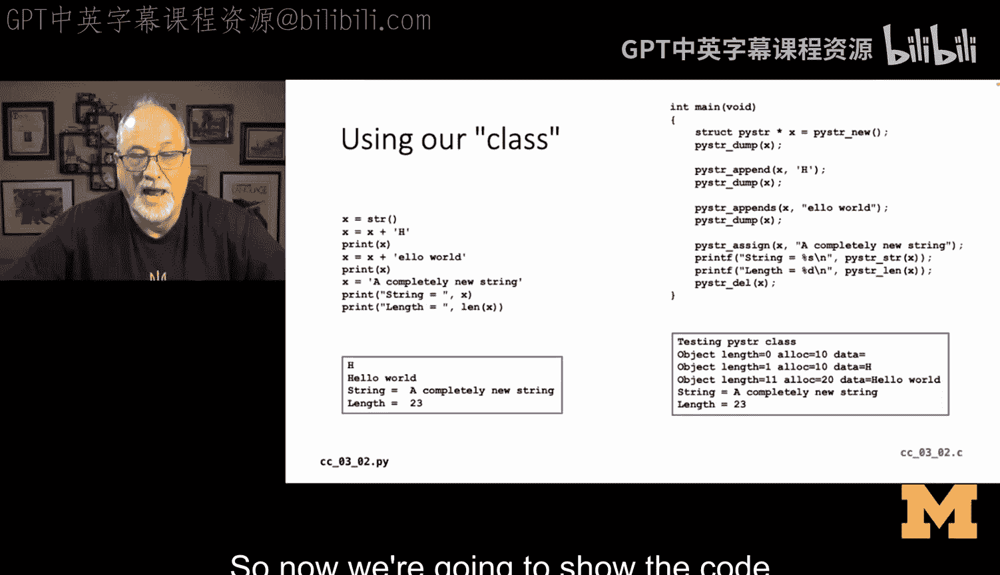

We're going to dump it， we're going to append a single character H。We're going to dump it。

 We're going to append a string。 One way to make this simple is just have append S。

 call append repeatedly for9 characters because appending 9 character string is the same as appending9 characters。

 not appending one character time 9 times。 then assign sign。

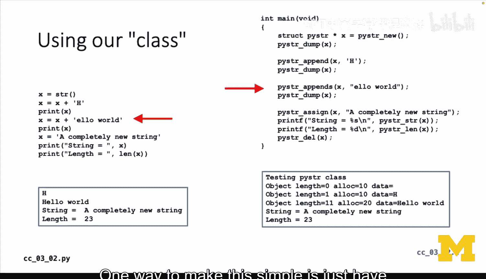

Assigning a completely new string， which means that you got a。

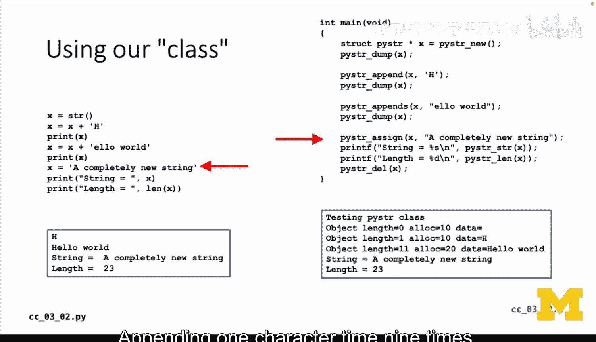

You got to take length back and you got to set some things and then you got to check the size and do a whole bunch of stuff。

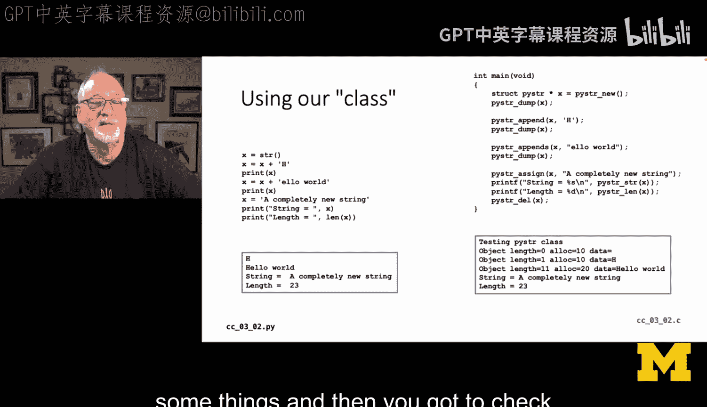

And then we're going to ask the Piister underscore stir to give us back a printable string。

🎼And then we're going to ask the piister underscore length Le to tell us how long this thing is。

 And so you get to write some code， not too much code， probably。

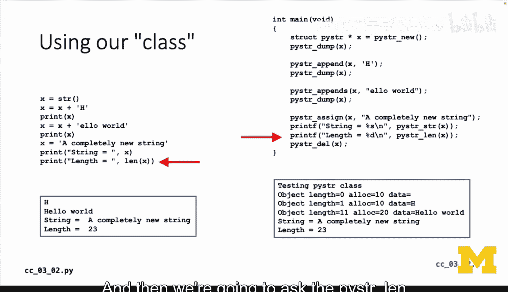

15 lines of code， but it is code that you will need to think deeply about and you're going to need to understand the structures。

 you're going need to understand the pointers， etc， etc cetera， etc ce。🎼Up next。

 we are going to make a list class。

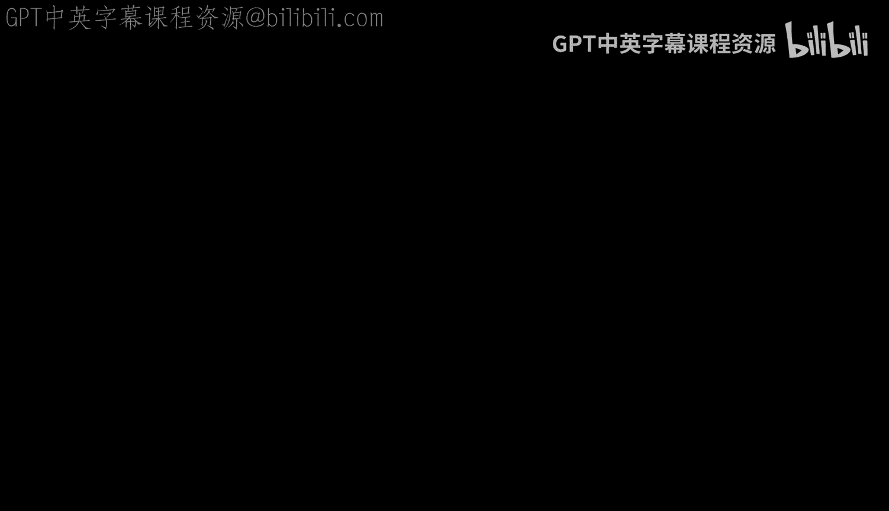

🎼So。🎼Yeah。

🎼Yeah。

