# 密歇根大学《给所有人的C语言编程课（了解C、用C编程、数据结构、创建对象）｜C Programming for Everybody》 p28 07_03_01_在C语言中实现Python列表(list)类.zh_en -BV1v2421P7pt_p28-

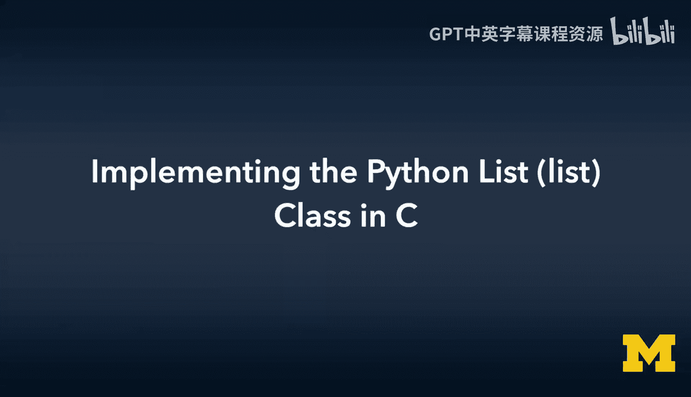

So the next class that we're going to build in C is an emulation of what you would do if you were building the Python list class in C。

 so let's just start by taking a look at sort of a Python and C version of this thing。

In Python， we create a new list then we append a whole string。Then we print it。

 then then we have another string， then we print it。 have another string， we print that。

 We ask how long is the list， We do an index， which is a positional lookup saying where is a string Brian。

 then we say if Bob's in the list where's it or we say we can't find Bob So we have to do an if then else and use in because otherwise we'd have to use a tricatch because if you do an index to with a string that's not there in Python it's going to blow up so we can either do an if then else or we can do a tricatch that's sort of six and one half a dozen in the other But in C we're going to effectively call plist new to create a new list we're going to call pylist append And again。

 remember all the time we're calling these things that are like methods we're always putting the instances the first parameterer in this case。

 LST is the instance So we're going to append hello world we're going print it。

 we're going toend append catchph we're going print it， we're going to append Brian。

 we're going to print it， then we're going to look at the list length of the list。

 then we're going look up Brian and we're going to look up。

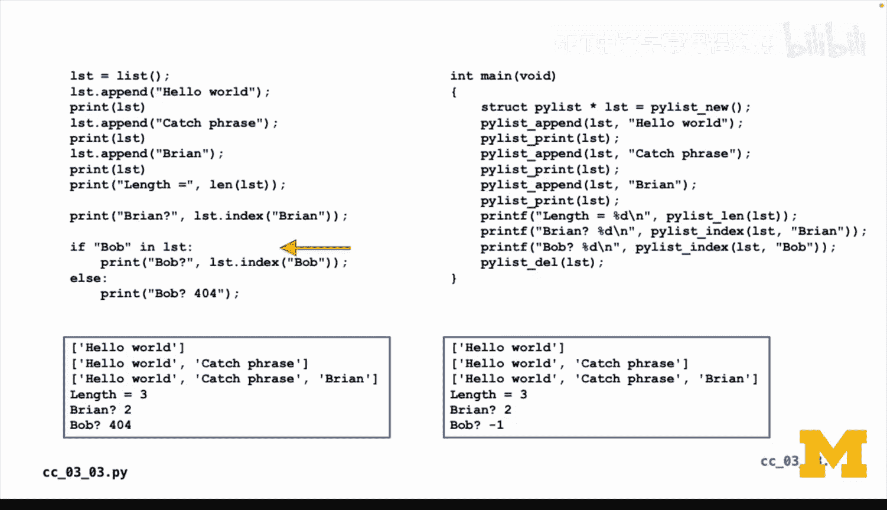

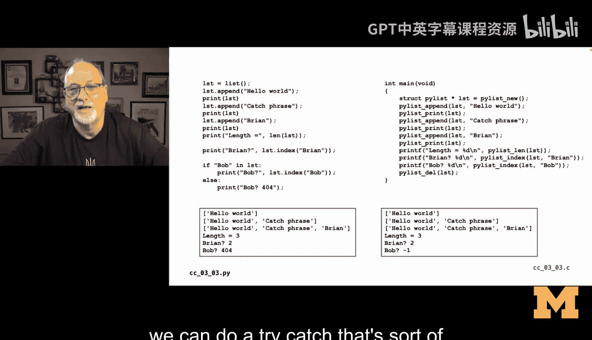

And in this case。

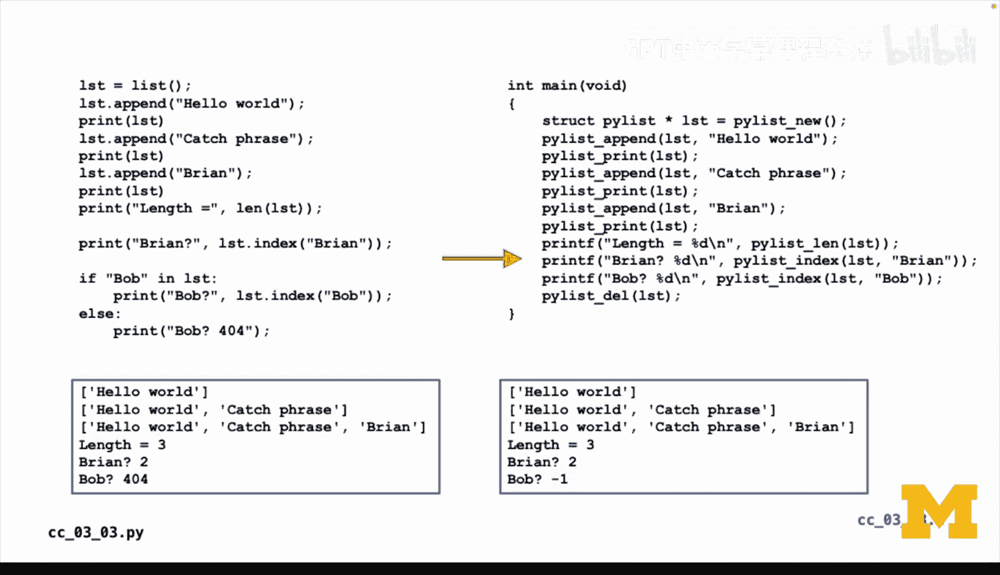

I made it so that the index just gives us back negative one to say I didn't find Bob so that I didn't have to try catchch because it's like a little bit more C like and then we do a pilotlist underscore Dell to clear up。

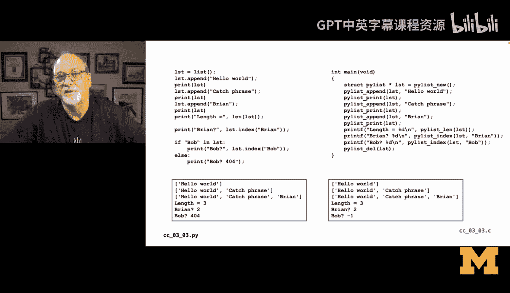

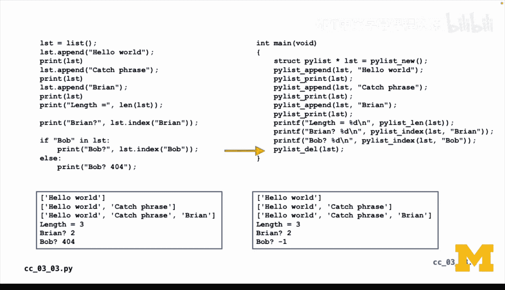

The memory， we are about to switch from being the consumer of the list object to the builder of the list object。

And our job as the builder list object is to dynamically allocate all the data that we need to make this thing work。

 And so we don't get to see the details of that。 All we know is there's these functions that we can call in this structure that we can use。

 And if we call the functions right。Somebody else is going to deal with all of the dynamic memory that makes this work。

 and you've done linked lists in previous assignments。

 so linked list should not be completely foreign to you。

 but now we're taking an object oriented approach to implementing a linked list and hiding the implementation detail within the object which is an important part of object oriented programming。

 So here's like some basic stuff。 and some of this should start looking pretty familiar。

 We got a L node， which is short for list node。 we got a pointer to character string and then we have a pointer to the next one。

 So we call that one next by convention。 Next is not a keyword next is just a really common convention when we're making linked lists。

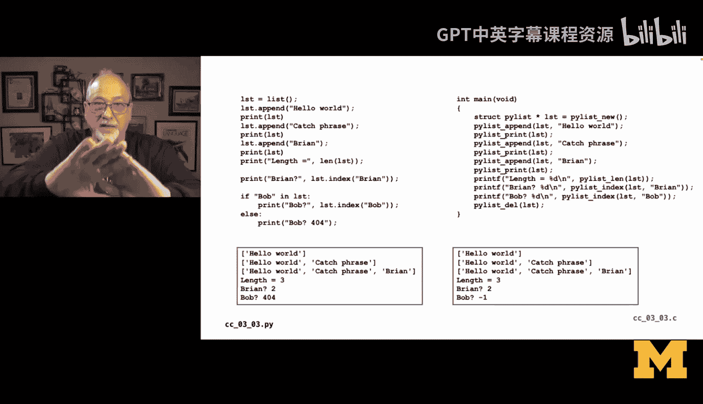

And then we and that's just the nodes， so linked list is a list of nodes。

 but then there's kind of the list itself， and that's what thestruct pilot is。

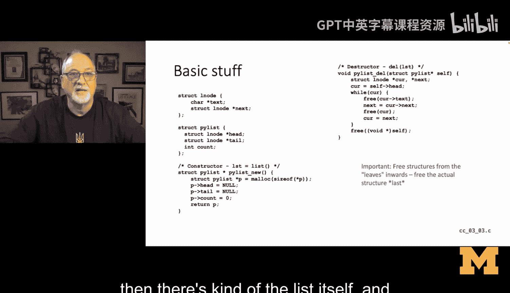

And it's got a pointer to the head and a pointer to the tail and just a counter。

And so if we create the new list， Plist new。We are going to allocate。The pie list object。

 which is a pointer， which is 8，2 pointer 16， and4 should be 20 bytes。

And then we're that's what star P is going to be。 Then we're going to set the head to null and the tail to null to indicate that we have an empty list。

 we're just we're not creating a list with things in it and set the count to0 and we're done。

 So it's pretty straightforward in some ways this list is easier in some ways than the Python string was。

Now， the deor is a little trickier because we actually have to go through the list and we have to free up all of the text areas。

 not not just thestruct L nodes， but we've also got the cha star text that we've got to get rid of。

 So what we'll see here is we're going to in the pilot Dell。

 we're going to carefully start at the head。And then loop through。

And remember that freecur has got to be the last thing we do with Cur once we say freecur for the that's the L nodes。

 we got to do the freecur， we're not supposed to touch cur ever again。

 So you'll see I say freecur text which is the string that's pointed to in the current node。

 then I look up next。

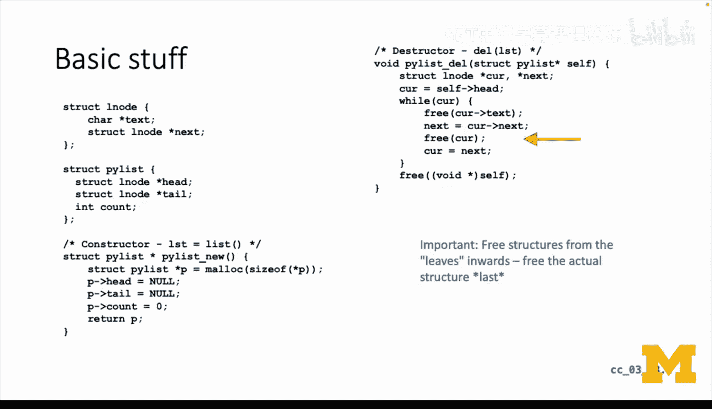

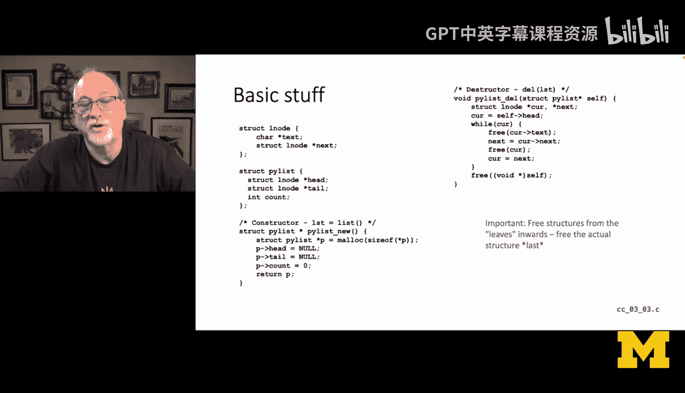

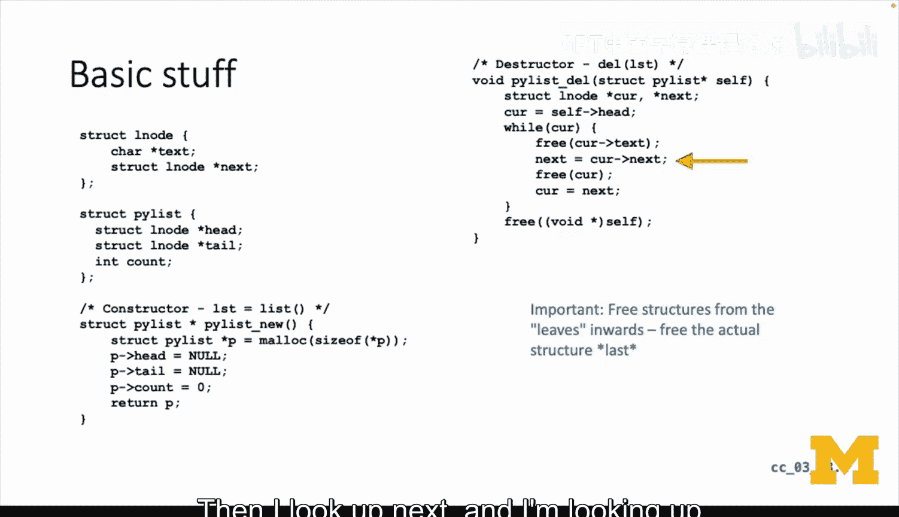

And I I'm looking up next before I call freecur because I'm not supposed to use cur afterwards。

 So Ill say next equals curl next。 give me the next pointer before I wipe out cur。 I wipe out cur。

 and then I say cur equals next。 And so I just， I created that next variable inside that function just to kind of get past the free curve。

 So I didn't have to say cur equals cur next。 after I called freecur。 And then loop goes through。

 and it slowly but surely cleans up all of the L nodes。 might be0。

 there might be no L nodes and head will be null at that point。 And while won't even run。

 but you got a free text。 Then you got a。

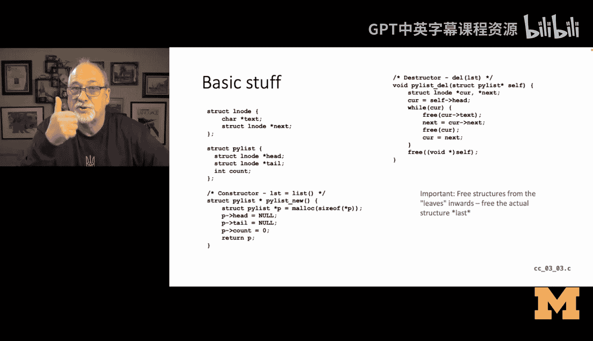

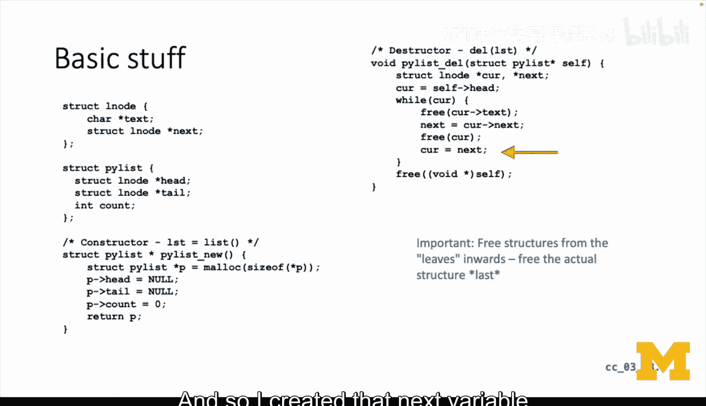

Know where the next pointer is。 Then you free the current one。

 and then you advance to the next pointer and jump up to the while loop and then do the rest。

 And then， and only then afterwards， do you free the self， which is the actual plist object。

 These structures tend to point to structures that tend to point to structures。

 and you got to when you're deing them when you're freeing them。

 You got to free em from the outside of the think of it as a tree。

 You've got the leaves and the branches and then the trunk， and then the roots， you got to。

 you got to free em from the leaves inwards。 And so just be real careful about this。

 That's part of the reason that I give you so much sample code where I do the dell for you because they just don't want it to mess up。

 If we take a look at the step of freeing the dynamic memory。

 You're going to see that it's going we have a head and we have a tail here。

 The first thing it's going to do is it's going to to the L node that is the head。

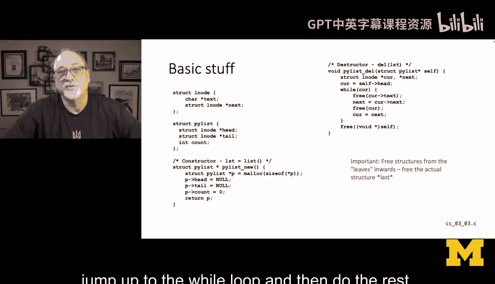

And then it's going the first thing that's actually going to be freed is the text。

 and then it's going to free the L node， then it's going to advance to the next L node， which has is。

 it's going to free the is， then it's going to free the fourth thing which is the second L node and then it's going to advance to the third L node。

 and then it's going to free the fun， which is the fifth thing freed。

 and then it's going to free the last L node and it'll notice that next is null and so we're done when theres a three node list。

 And then the last thing we do is we free the pilotlist itself so that the order in which we free these things is really。

 really important。 And you think of it is the leaves。

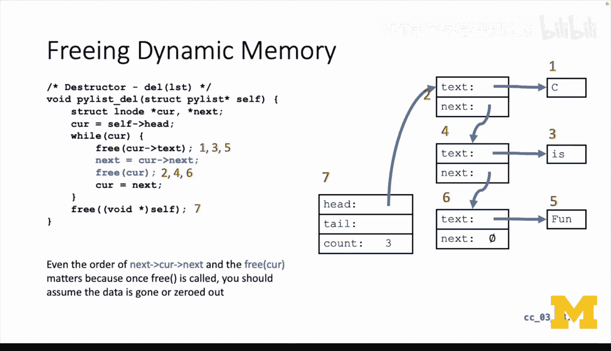

Outwards， right， the C is fun。 Those are three strings that have been allocated。

Those have to be freed first before we free the Lll node that happens to point to them。

So every little bit of order matters。 The one thing I want you to do in this one is I want you to make the list output instead of it being dump。

 I you'll notice I call this one print， not dump。 and I want it to look exactly like Python's list output。

 which means it's got an open square bras。 It's got the strings and double a single quotes。

 comma space in between them， etc cetera and。

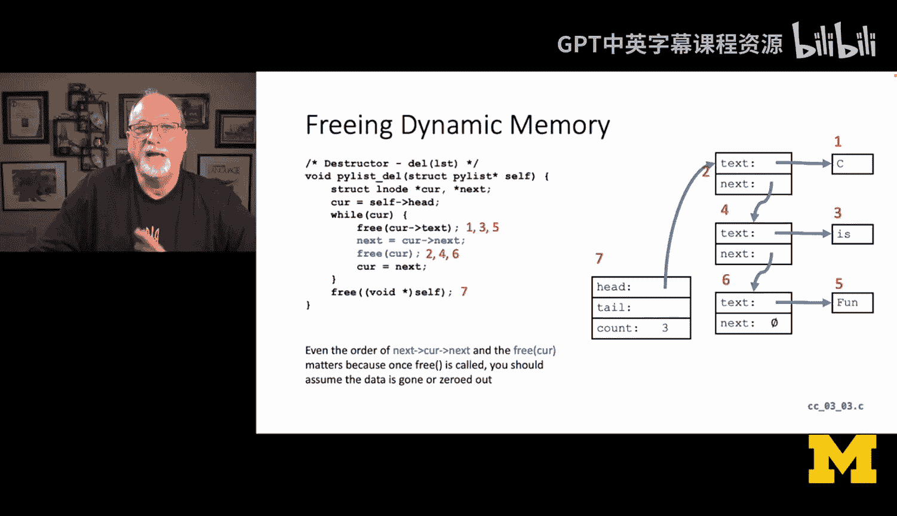

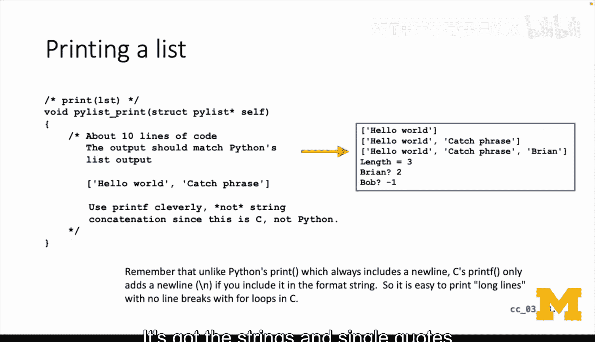

Don't try to use string concatenation to do this， because you're in C。 You're not in Python。

 You don't even know how long these strings are going to be。

 What you need to do is you need to cleverly write a loop that uses print F。

So think of this as you can only use print F， don't use a string because you don't have strings。

Just use printntf。And remember。That printf doesn't add a new line unless you actually put the new line in。

 So it's pretty easy to do printf Open bracket than printf single printf the string。

 printf single quote， printf， comma， et cetera， et cetera。 So you got to。

It's about 10 lines of code and you know enjoy yourself。

 I think you'll do a pretty good job of this and you'll be impressed when you're all done and then you'll think。

 oh， I'm walking down the path of Gito Van Rossom because Gito Van Rossom had to write exactly these lines of code。

Now he actually was probably using a string class， which I just told you not to use because he didn't want to call printf directly。

 so he wanted to make it so he can convert to a string， but whatever。

You're walking the path that Gio Van Rossam walked while he was building the list object。

 That's what I want you to do。 Here's some more methods。 Some are easier。 Some are hard。

 Lyn is really easy。 index is not too bad。 It's a for loop， If you loop through。

 You look for a value。 and then you just return negative one。 If you don't find it。

 You just return the position。 You got to kind add go 0，1，2，3，45，6，7 and return the 7。

 if you find it append is a bit tricky。 But hey， that was chapter 6。 You should know how to do that。

 You've actually by this point in chapter 6。 You would have written one of these things。

 So go consult your own code at that point。 And so here is the ultimate test case of our list class。

 You were just going to mimic that Python code。 We're going to append a hello world string。

 append a catchbra string。 Append a Brian string， print them all the time。

 We're going to print the length。 and we're going to do a index look up for Brian and Bob。

 And then we're going to delete it。 We always delete it because we're not in Python。

 So we're carefully deleting it。

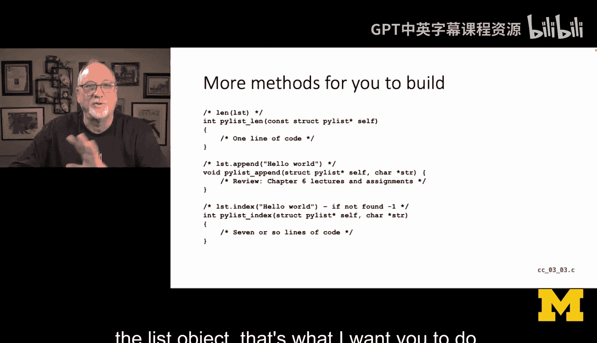

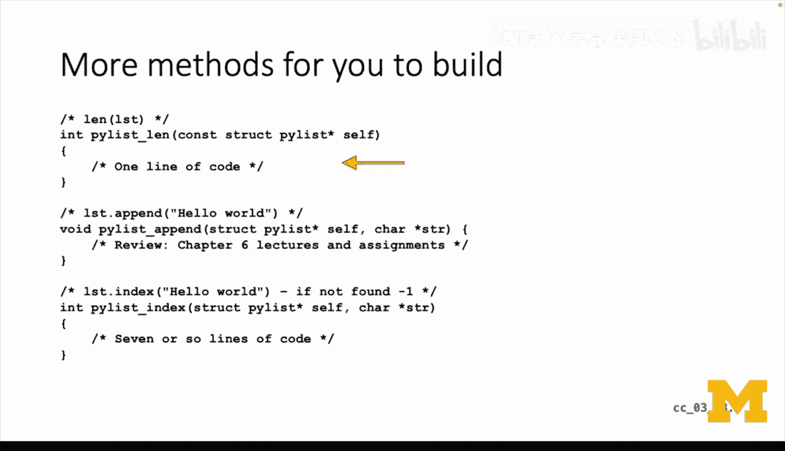

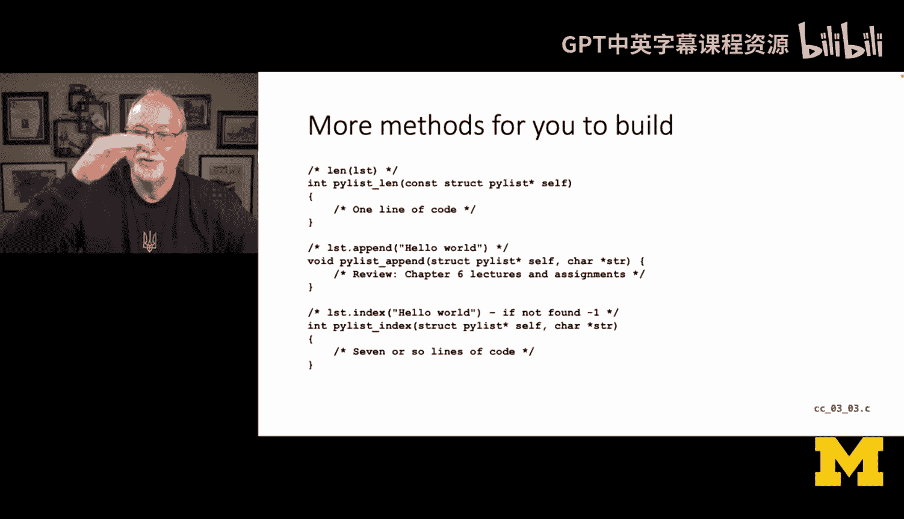

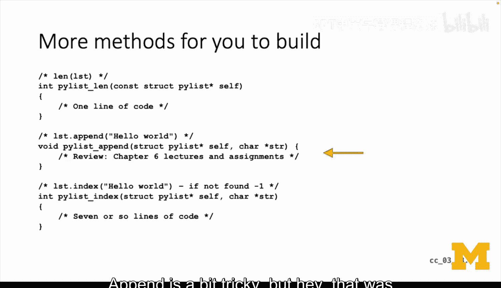

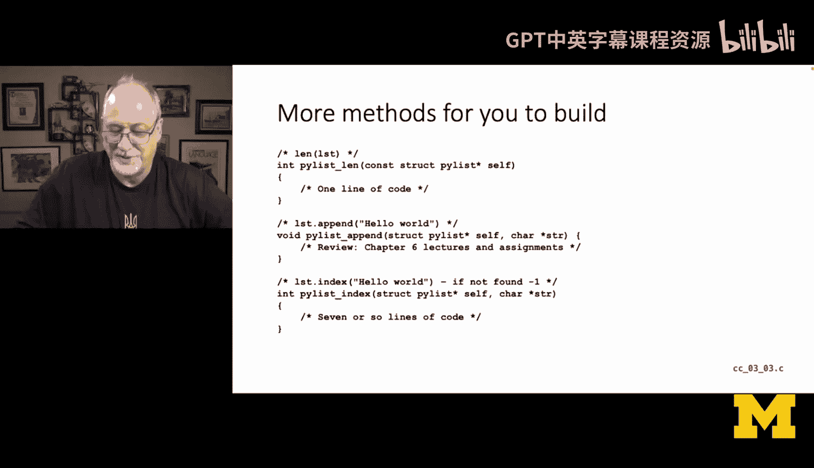

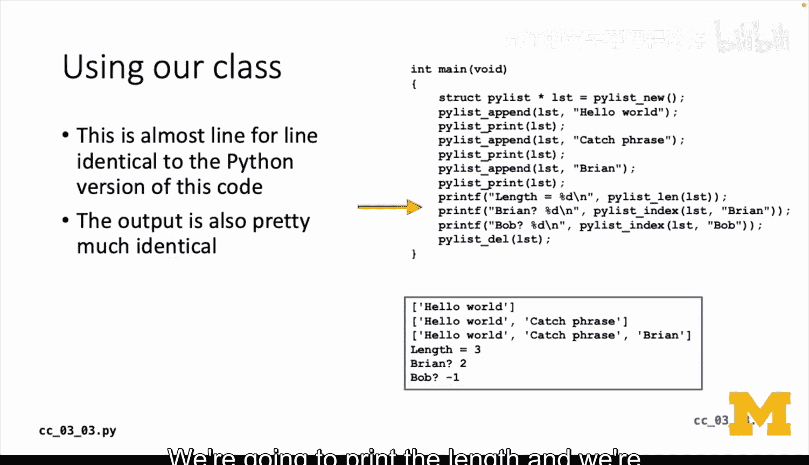

And other than。The negative one for Bob being 404 in the Python， because that was kind of a joke。

 it is identical。We're really starting to build。

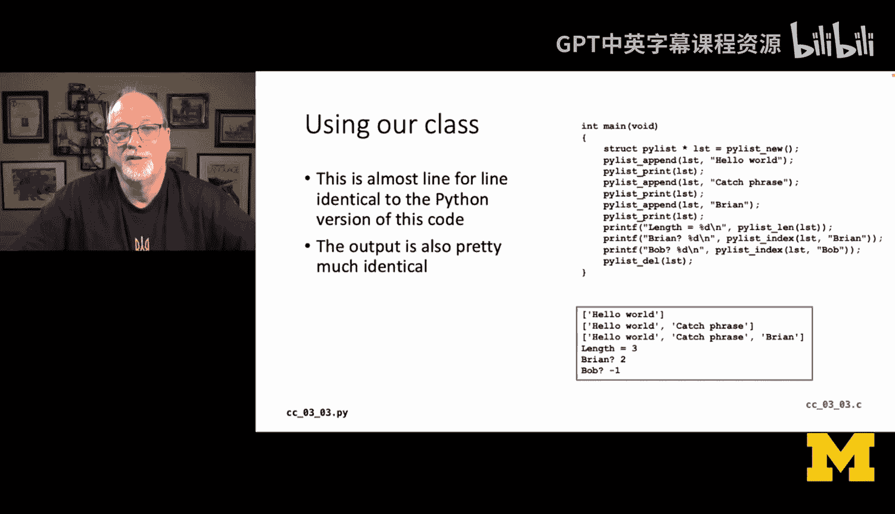

What looks like a Python list So up next？It's pretty much you guessed it。We did a string。

 We did a list。Yep， it's a dictionary， we're going to actually build a dictionary。In our next bit。

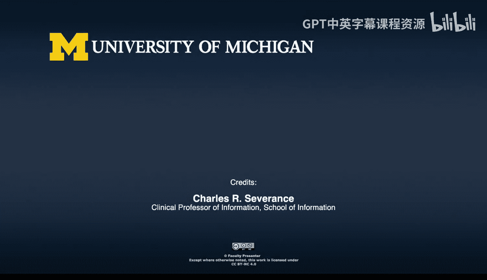

Yeah。🎼Yeah。

