# C语言编程：08_03_02：在C语言中实现Python字典(dict)类 🗂️

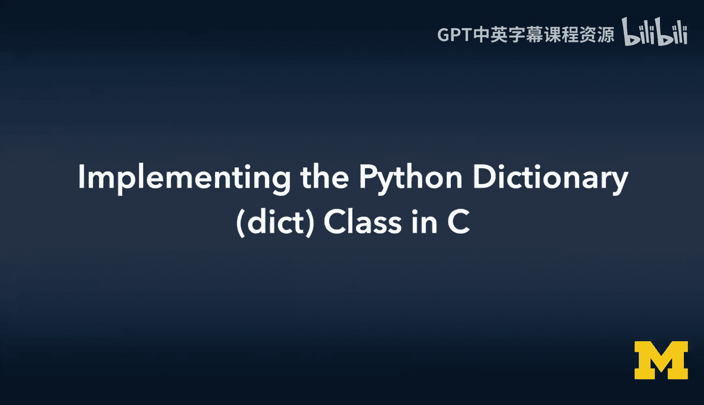

在本节课中，我们将学习如何使用C语言的基础特性——结构体、指针和动态内存管理——来构建一个类似于Python字典(dict)的简单对象。我们将从零开始，实现字典的创建、添加、查找、更新和删除等核心功能。

---

## 概述

Python的字典是一种非常方便的数据结构，它允许我们通过“键”来存储和检索对应的“值”。在C语言中，虽然没有内置的字典类型，但我们可以利用结构体和链表的概念来模拟实现它。本节教程将引导你完成这一过程，你将看到一个高级数据结构是如何在底层用更基础的构件搭建起来的。

上一节我们介绍了链表(list)的实现，本节中我们来看看如何扩展链表的概念，使其能够存储键值对，从而构建一个字典。

---

## 字典的基本设计与结构

我们的C语言字典将基于链表实现。链表中的每个节点不再只存储一个值，而是存储一个键(key)和一个值(value)。字典本身则是一个管理这些节点的结构体。

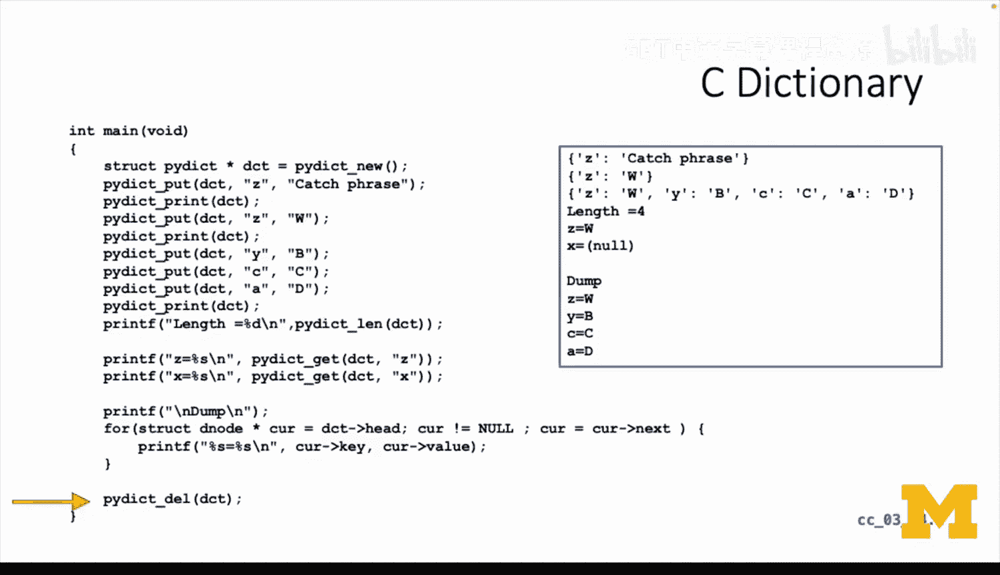

以下是核心的结构体定义：

```c
// 字典节点结构体
typedef struct DNode {
    char *key;           // 指向键字符串的指针
    char *value;         // 指向值字符串的指针
    struct DNode *next;  // 指向下一个节点的指针
} DNode;

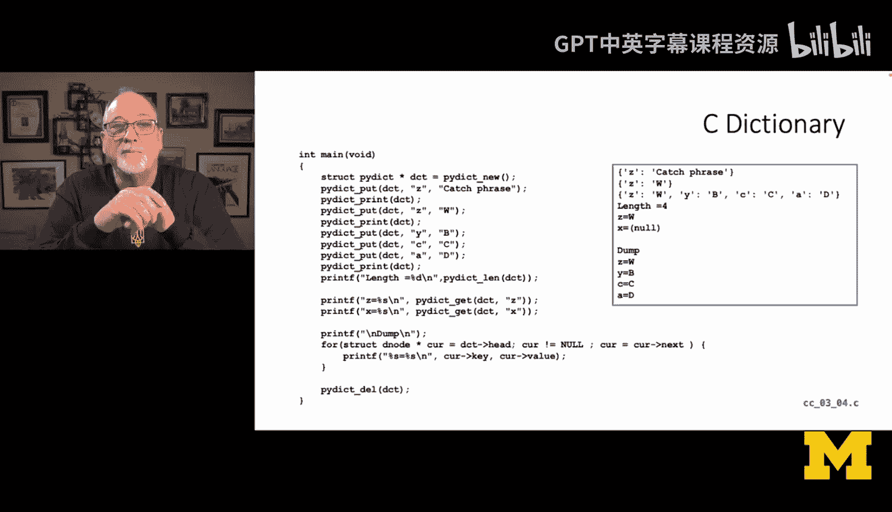

// 字典结构体
typedef struct {
    DNode *head;  // 指向链表头节点的指针
    DNode *tail;  // 指向链表尾节点的指针
    int count;    // 字典中键值对的数量
} Dictionary;
```

可以看到，`Dictionary` 结构体与之前实现的链表(`PList`)非常相似，都包含头指针、尾指针和计数器。主要的区别在于节点(`DNode`)内部，它包含了两个字符串指针：`key` 和 `value`。

---

## 核心方法的实现

我们将为字典实现一系列方法，包括创建、销毁、添加/更新、查找、获取长度和打印等。

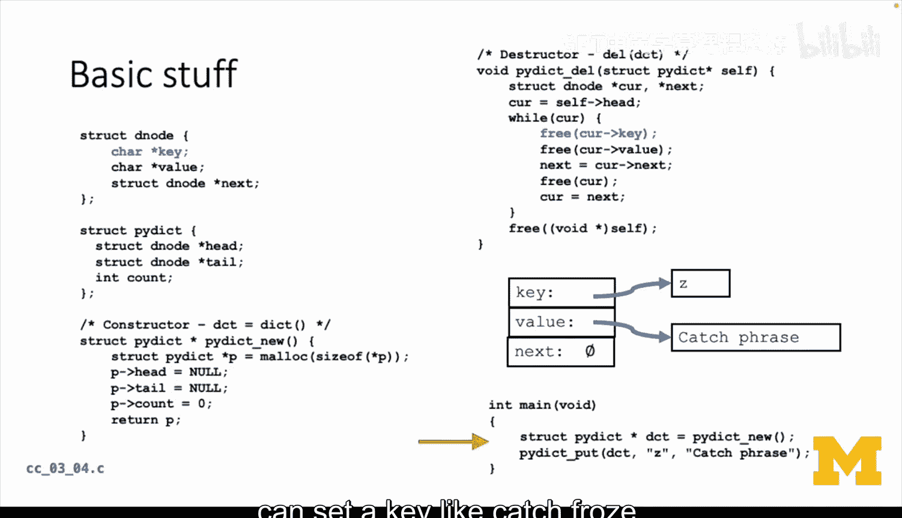

### 1. 创建与销毁字典

创建字典(`new`)和销毁字典(`delete`)的逻辑与链表几乎一致。

*   **`Dictionary* Dict_new()`**: 分配内存给一个`Dictionary`结构体，初始化其`head`和`tail`为`NULL`，`count`为0。
*   **`void Dict_delete(Dictionary* self)`**: 遍历整个链表，释放每个节点中`key`和`value`指针所指向的内存，然后释放节点本身，最后释放字典结构体。

以下是销毁方法的伪代码逻辑：
```c
void Dict_delete(Dictionary* self) {
    DNode* current = self->head;
    while (current != NULL) {
        DNode* next = current->next; // 预先保存下一个节点
        free(current->key);          // 释放键字符串
        free(current->value);        // 释放值字符串
        free(current);               // 释放节点本身
        current = next;              // 移动到下一个节点
    }
    free(self); // 释放字典结构体
}
```

### 2. 查找节点

实现一个内部的`find`方法至关重要，它将被`put`（添加/更新）和`get`（获取）方法复用。

*   **`DNode* Dict_find(Dictionary* self, const char* key)`**: 遍历链表，比较每个节点的`key`与传入的`key`是否相同（使用`strcmp`函数）。如果找到，则返回指向该节点的指针；如果遍历完仍未找到，则返回`NULL`。

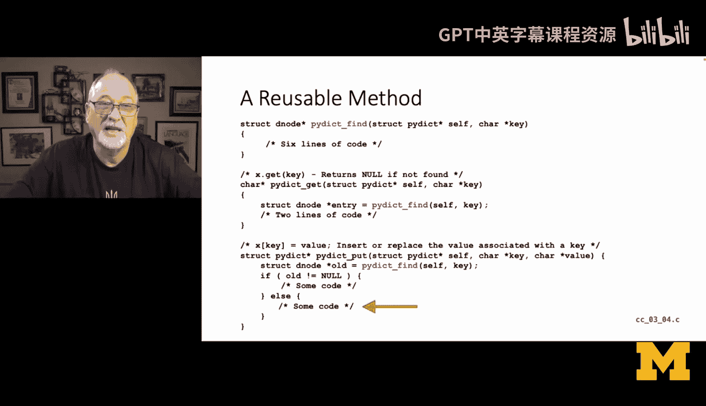

### 3. 添加或更新键值对 (`put`)

`put`方法用于向字典中添加新的键值对，或者更新已存在键对应的值。

以下是`put`方法的核心步骤：
1.  调用`Dict_find`查找键是否已存在。
2.  如果找到(`old != NULL`)，说明是更新操作：
    *   释放旧`value`指向的内存。
    *   为新值字符串分配内存(`malloc`)并复制内容。
    *   将节点的`value`指针指向这块新内存。
3.  如果没找到(`old == NULL`)，说明是添加操作：
    *   创建一个新的`DNode`节点。
    *   为`key`和`value`字符串分别分配内存并复制内容。
    *   将新节点添加到链表末尾（操作与链表追加节点相同）。
    *   更新字典的`count`。

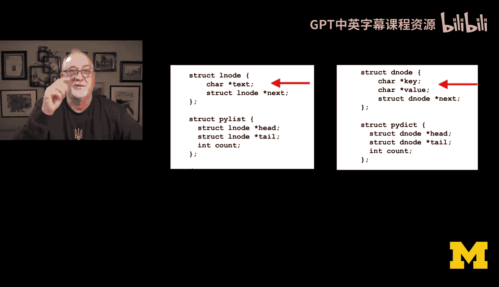

### 4. 获取值 (`get`)

`get`方法根据给定的键查找并返回对应的值。

*   **`char* Dict_get(Dictionary* self, const char* key)`**: 调用`Dict_find`方法查找节点。如果找到节点，则返回其`value`；如果未找到，可以返回一个默认值（如`NULL`或特定的错误码）。

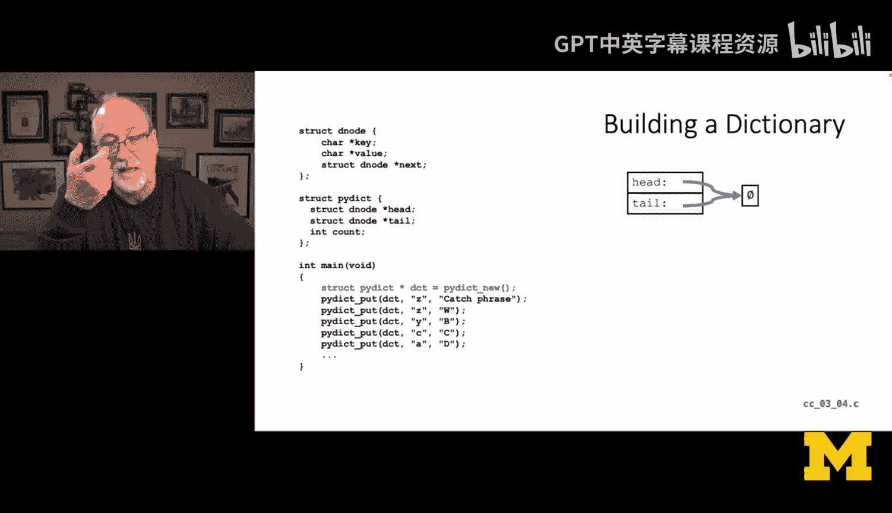

### 5. 其他工具方法

*   **`int Dict_len(Dictionary* self)`**: 直接返回字典结构体中的`count`成员。
*   **`void Dict_print(Dictionary* self)`**: 遍历链表，按照`{‘key’: ‘value’}`的格式打印出所有键值对，以匹配Python字典的输出样式。

---

## 内存管理详解

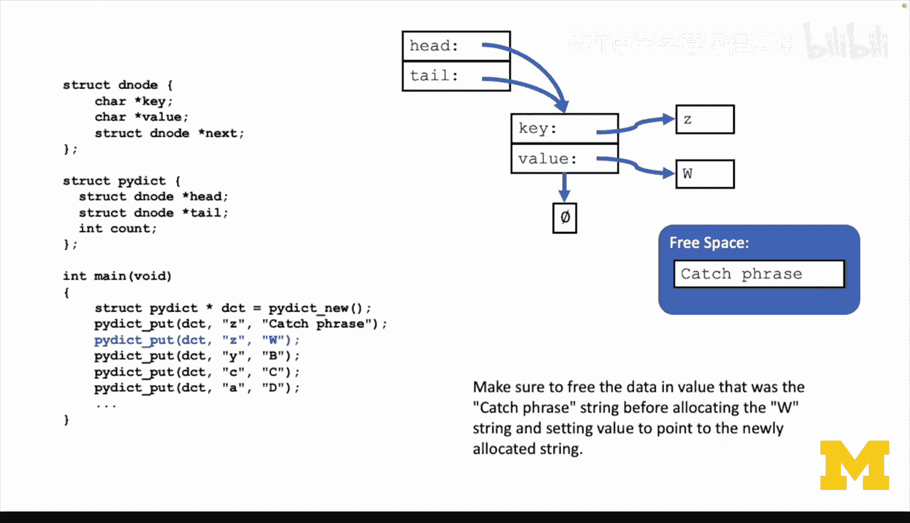

由于`key`和`value`都是指向字符串的指针，我们必须仔细管理它们的内存生命周期。这是与简单链表最大的不同之处。

**关键规则是：**
1.  **分配时复制**：在`put`方法中，当接收到一个字符串（如`”Z”`或`”catch phrase”`）时，我们不能直接保存传入的指针，因为它的生命周期可能很短（例如，是一个临时变量）。我们必须使用`malloc`分配一块新的内存，并使用`strcpy`将字符串内容复制进去，然后保存这个新内存的地址。
2.  **更新时先释放**：当更新一个已存在键的值时，在将`value`指针指向新的内存块**之前**，必须先用`free`释放它原来指向的旧内存块，否则会造成内存泄漏。
3.  **销毁时全部释放**：在`Dict_delete`中，除了释放节点本身，还必须依次释放每个节点中`key`和`value`指针所指向的内存。

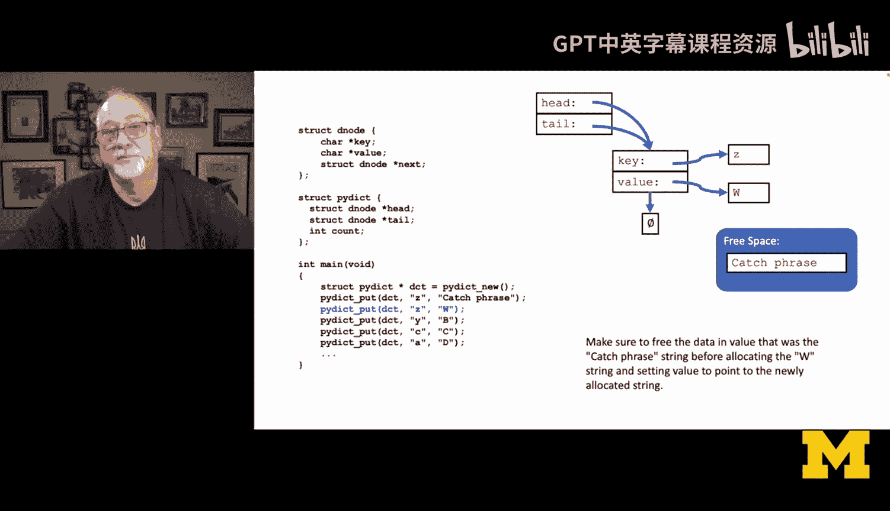

让我们通过一个例子可视化这个过程：

1.  **执行 `Dict_put(dict, “Z”, “catch phrase”)`:**
    *   系统为`DNode`、字符串`”Z”`、字符串`”catch phrase”`分别分配三块内存。
    *   `DNode`的`key`和`value`指针分别指向后两块内存。
    *   字典的`head`和`tail`指向这个新节点。

2.  **接着执行 `Dict_put(dict, “Z”, “W”)`:**
    *   `Dict_find`找到了键为`”Z”`的节点。
    *   系统**释放**`”catch phrase”`所占用的内存。
    *   系统为字符串`”W”`**分配**新内存并复制内容。
    *   将该节点的`value`指针改为指向存储`”W”`的新内存。

---

## 从链表到字典的演进

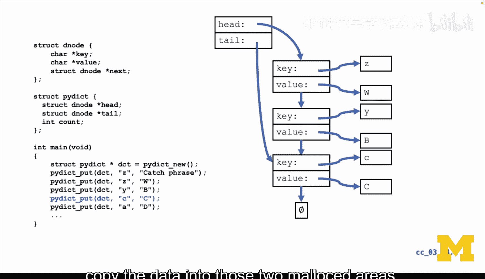

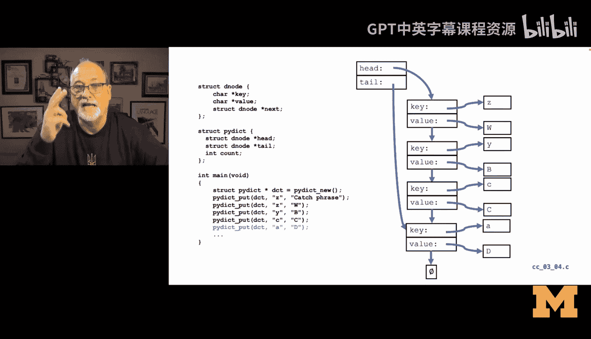

本质上，我们实现的字典就是一个**每个节点携带两个数据的链表**。我们没有使用更高级的数据结构（如哈希表或二叉搜索树）来优化查找速度，因此在键值对数量很大时，`find`操作的效率会较低（时间复杂度为O(n)）。

然而，这个实现完美地演示了**对象封装**的思想：
*   **隐藏复杂性**：用户（调用者）只需要知道`Dict_new`, `Dict_put`, `Dict_get`等接口，完全不用关心内部是基于链表实现的，也无需处理繁琐的`malloc`和`free`。
*   **构建抽象**：我们利用C语言的基础功能，构建了一个更高级、更易用的数据抽象。这正是Python等高级语言在底层所做的事情的简化版。

可以想象，Python的创始人Guido van Rossum在早期构建Python时，很可能也编写过类似的简单版字符串、列表和字典类，然后再用更高效的算法和内存管理策略去优化它们。

---

## 总结

本节课中我们一起学习了如何在C语言中实现一个简单的Python风格字典(dict)。我们主要完成了以下工作：

1.  **设计结构**：定义了`Dictionary`和`DNode`结构体，作为字典的骨架。
2.  **实现核心操作**：逐步实现了字典的创建(`new`)、销毁(`delete`)、添加/更新(`put`)、查找(`get`)等方法。
3.  **深入内存管理**：重点理解了为何以及如何为键和值动态分配和释放内存，这是C语言实现此类数据结构的核心。
4.  **理解抽象意义**：认识到这个练习不仅是在实现一个功能，更是在学习如何将底层细节（指针、内存）封装起来，向上提供简洁、安全的接口，这是面向对象编程和构建高级语言的基础。


通过这个从链表到字典的构建过程，你应该对“如何使用基础工具构建复杂工具”有了更深刻的理解。虽然我们的实现效率不高，但它清晰地揭示了数据结构的本质和软件抽象的威力。