# C语言编程：09_04_01：在C语言中实现封装和接口 🧱

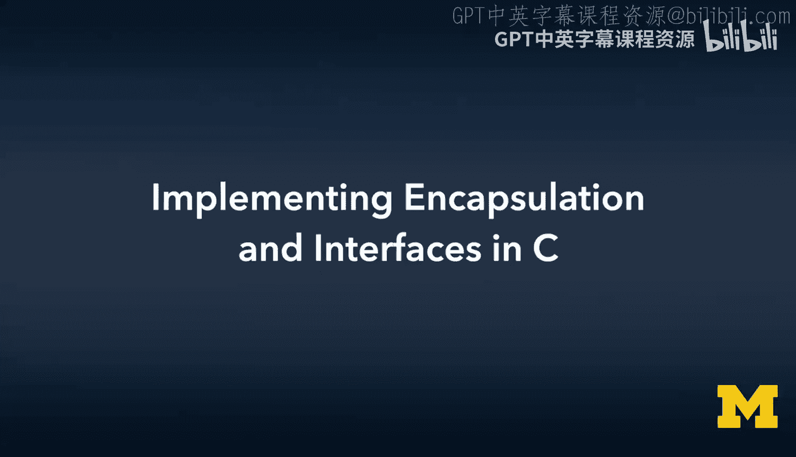

在本节课中，我们将学习面向对象编程的核心原则之一：封装。我们将探讨如何将数据和方法捆绑在一起，并定义清晰的接口，从而在C语言中隐藏实现细节，构建更健壮、更易维护的代码。

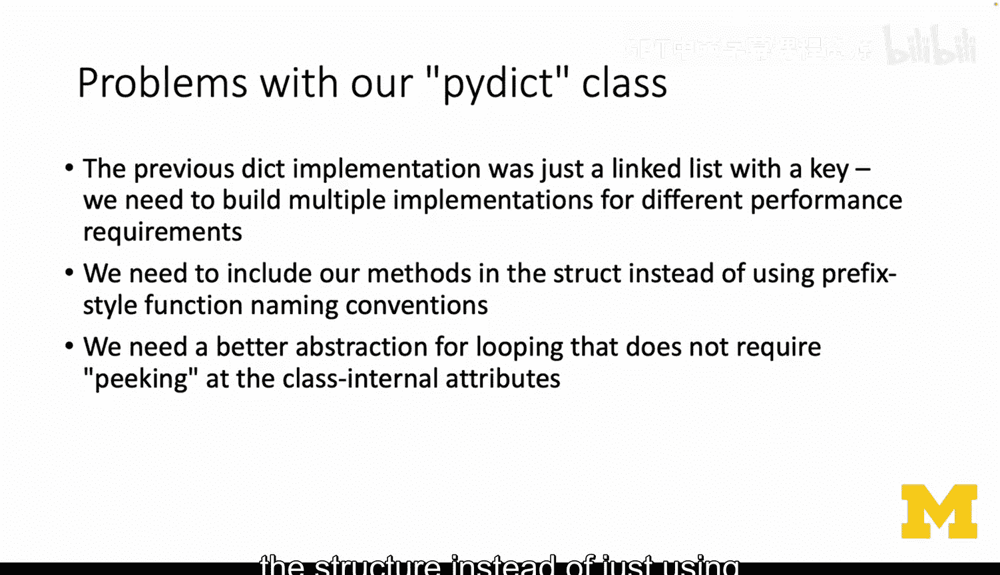

---

## 从命名约定到结构内方法

上一节我们使用带前缀和下划线的函数名（如 `Pidict_put`）来模拟对象方法。本节中，我们来看看如何将这些方法直接放入结构体内部，以实现更好的封装。

我们将创建一个名为 `Pidict` 的结构体，它不再仅仅包含数据（如链表的头尾指针），还将包含指向各个操作函数的指针。

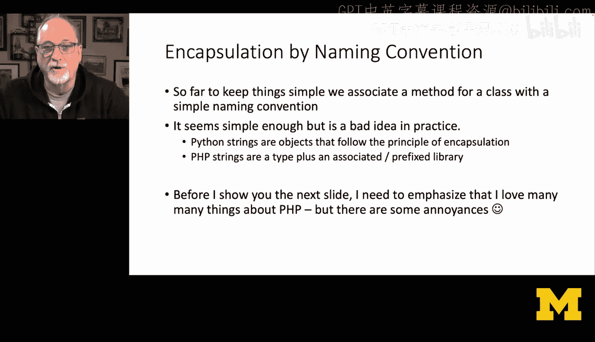

以下是实现封装后的结构体定义示例：
```c
typedef struct Pidict {
    struct Node *head;
    struct Node *tail;
    void (*put)(struct Pidict *self, char *key, char *value);
    int (*len)(struct Pidict *self);
    char* (*get)(struct Pidict *self, char *key);
    void (*del)(struct Pidict *self, char *key);
} Pidict;
```
通过这种方式，所有与 `Pidict` 对象相关的操作都成为了结构体的一部分。

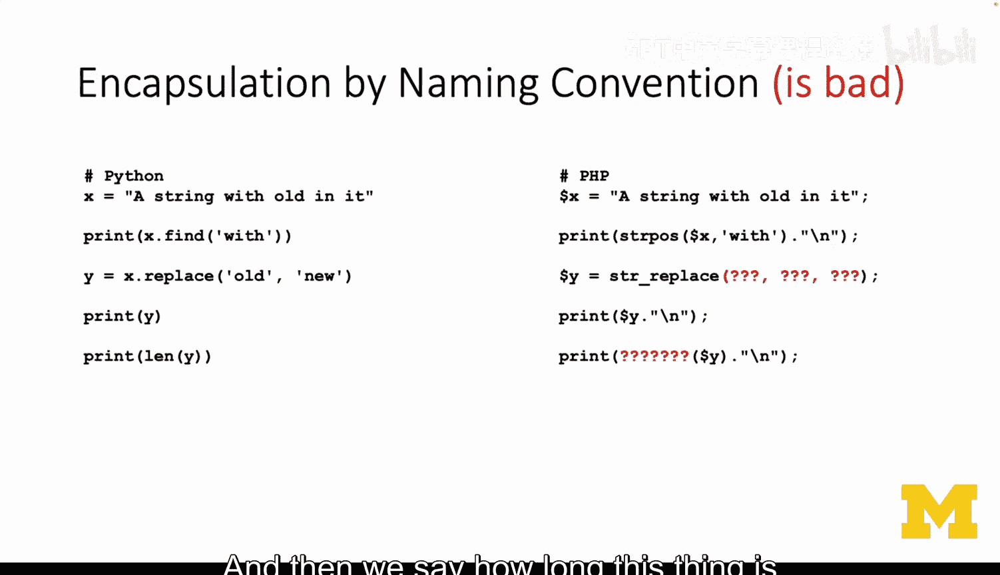

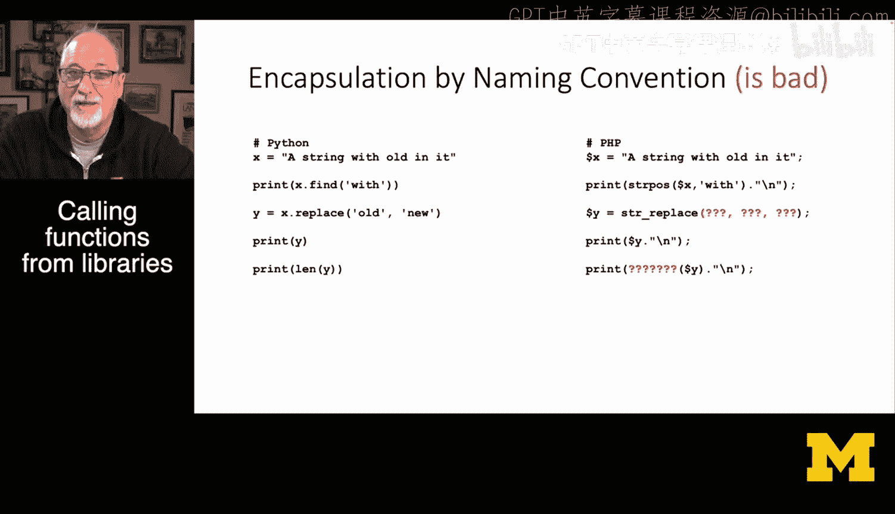

---

## 为何要避免“泄漏的抽象”

当我们直接在调用代码中访问或依赖对象内部的实现细节（例如，遍历链表时直接使用 `head` 指针），我们就破坏了抽象边界。这被称为“泄漏的抽象”。

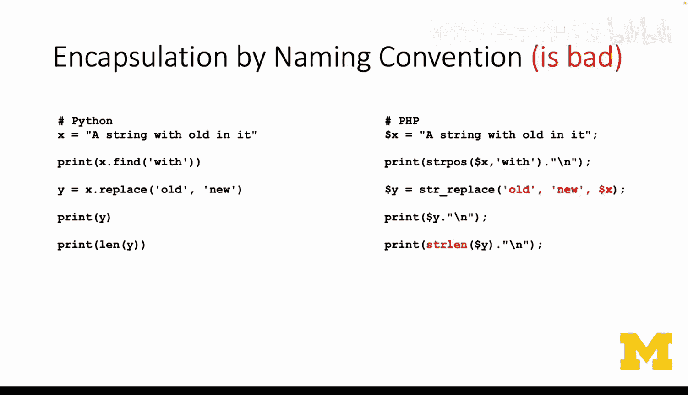

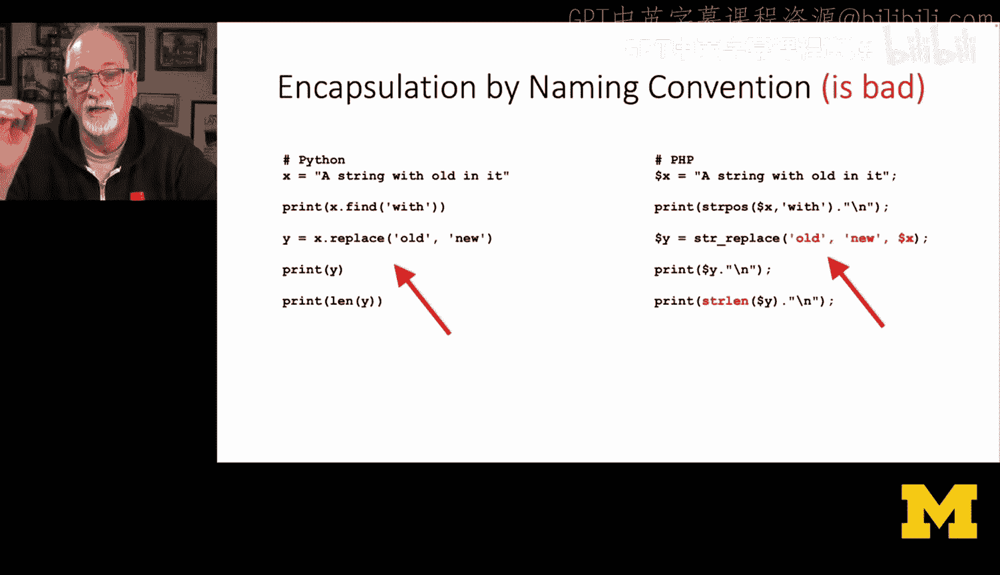

以下是一个“泄漏”的例子，它暴露了底层是链表的事实：
```c
// 泄漏的抽象：调用者需要知道内部是链表
for (struct Node *cur = dict->head; cur != NULL; cur = cur->next) {
    printf("%s: %s\n", cur->key, cur->value);
}
```
如果未来我们将底层实现从链表改为哈希表或树，所有这样的调用代码都需要修改。封装的目的就是通过一个稳定的接口来防止这种情况。

---

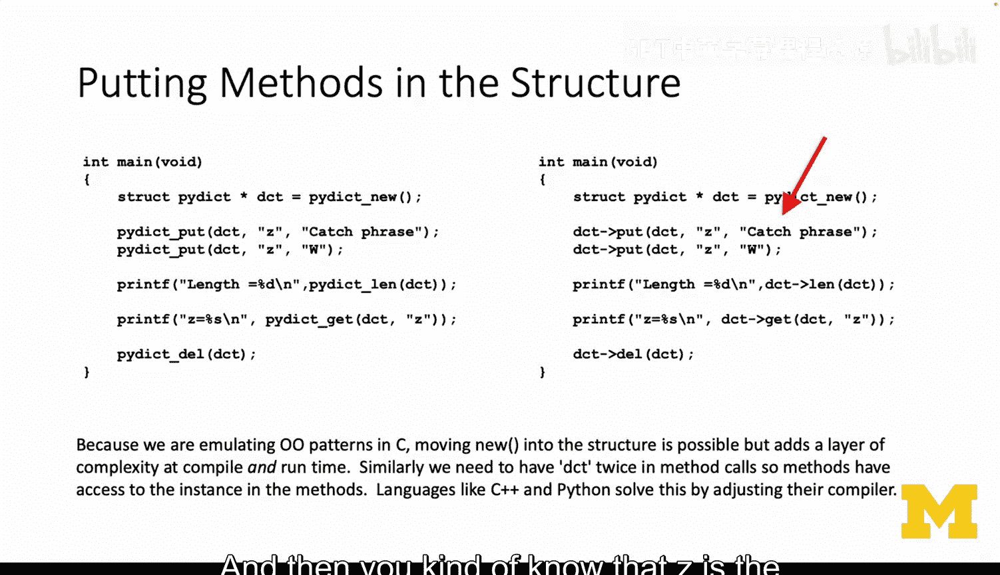

## 访问控制：公共 vs. 私有

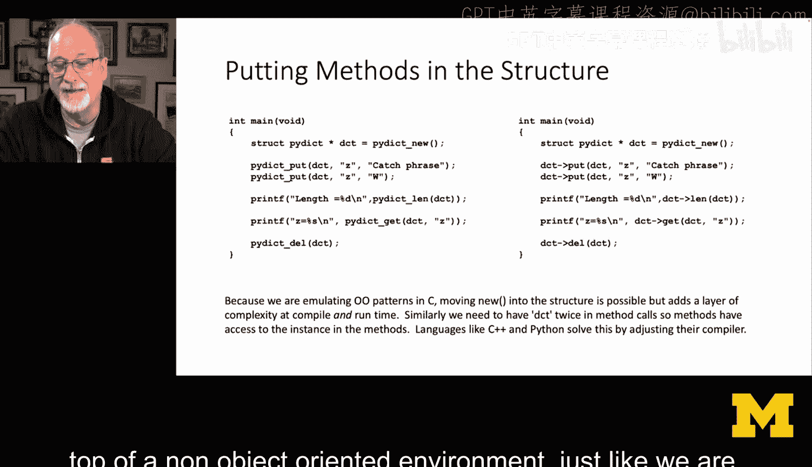

为了实现封装，我们需要区分哪些部分是对外公开的（公共接口），哪些是内部隐藏的（私有实现）。

*   **公共（Public）**：调用代码可以访问的数据和方法，构成了对象的稳定契约。
*   **私有（Private）**：仅供对象内部使用，调用代码不应直接访问。

不同语言有不同的语法来标记访问控制：

*   在 **Java** 或 **C++** 中，使用 `private` 和 `public` 关键字。
    ```java
    // Java示例
    public class Point {
        private double x; // 私有成员
        private double y;
        public Point(double x, double y) { ... } // 公共构造方法
        public void dump() { ... } // 公共方法
    }
    ```
*   在 **Python** 中，约定使用双下划线 `__` 作为前缀来指示私有成员（名称修饰）。
    ```python
    # Python示例
    class Point:
        def __init__(self, x, y):
            self.__x = x  # 私有属性
            self.__y = y
        def dump(self):   # 公共方法
            print(self.__x, self.__y)
    ```

在我们的C语言实现中，我们将通过将函数指针放入结构体，并仅通过这些指针来调用方法，从而在逻辑上实现“公共接口”。而像 `head`、`tail` 这样的数据成员，则应被视为“私有”，调用者不应直接操作。

---

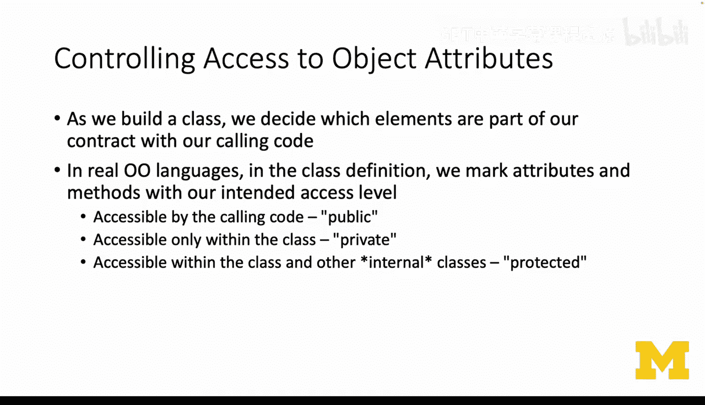

## 定义清晰的接口

接口是对象与外部世界之间的契约。它规定了“做什么”，而隐藏了“怎么做”。通过将方法指针集成到结构体中，我们就在C语言中定义了一个清晰的接口。

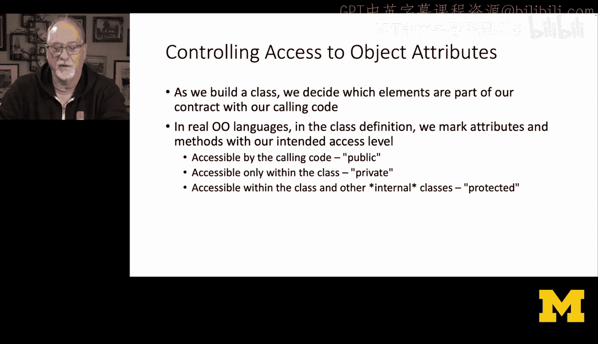

调用方式将从：
```c
Pidict_put(dict, "z", "catchphrase");
```
变为更面向对象的形式：
```c
dict->put(dict, "z", "catchphrase");
// 注意：第一个 `dict` 参数是“self”，模拟了Python中的实例方法调用。
```
这种方式将所有相关操作都绑定到了对象本身，使得API更加一致和直观，避免了像PHP中某些字符串函数那样参数顺序不一致的问题。

---

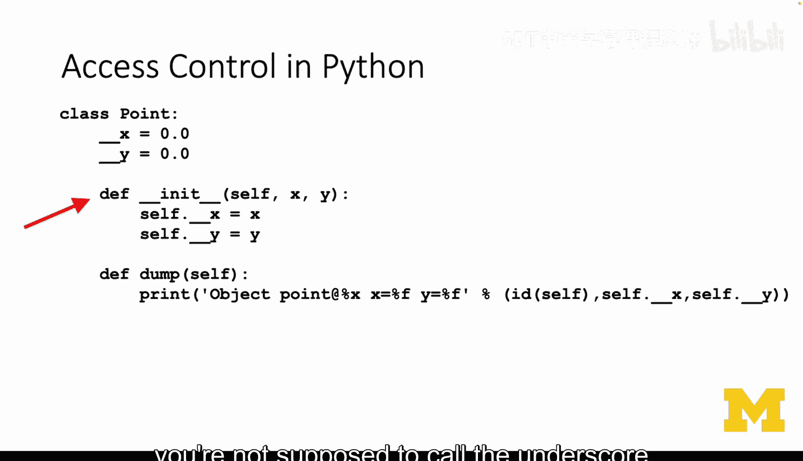

## 总结

本节课中我们一起学习了如何在C语言中应用封装原则。
1.  我们探讨了将方法从全局命名空间移入结构体内部的好处。
2.  我们理解了“泄漏的抽象”概念及其危害，它会导致代码紧密耦合于特定实现。
3.  我们介绍了公共接口与私有实现的区别，这是封装的核心。
4.  我们看到了如何通过结构体内的函数指针，在C语言中定义一个清晰、稳定的对象接口。

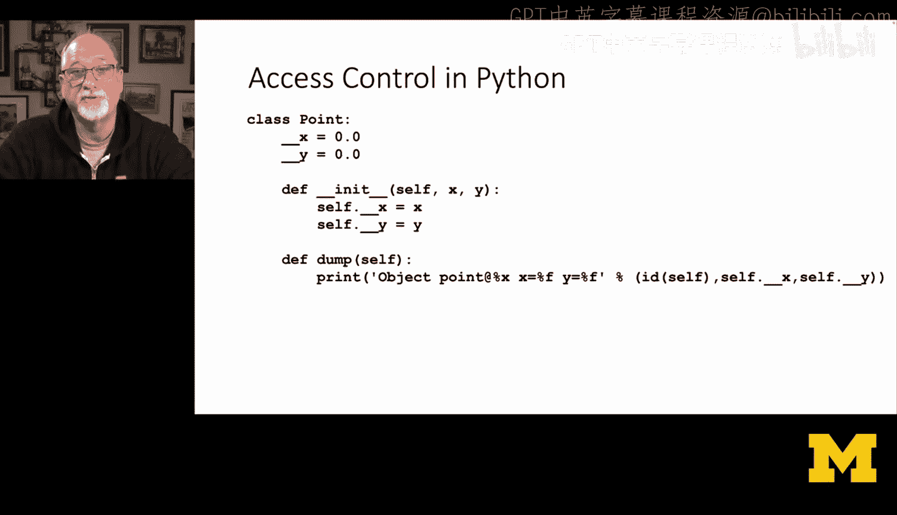

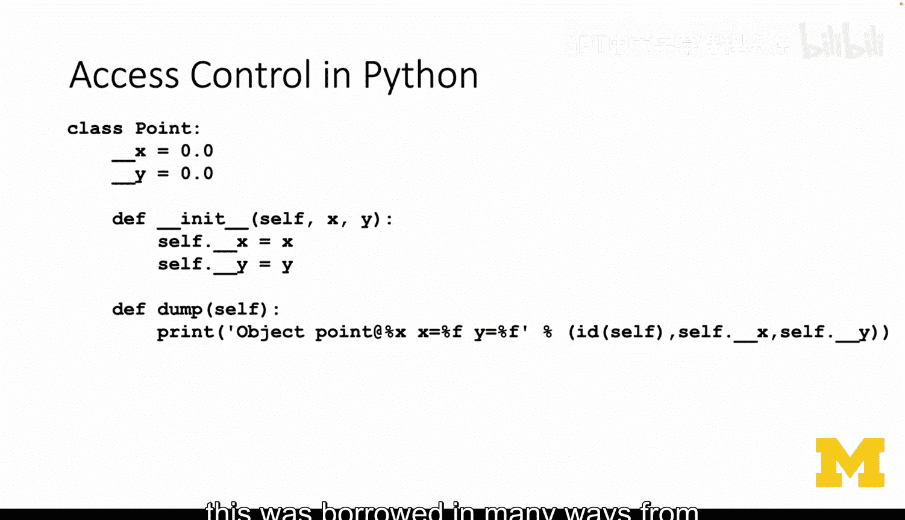

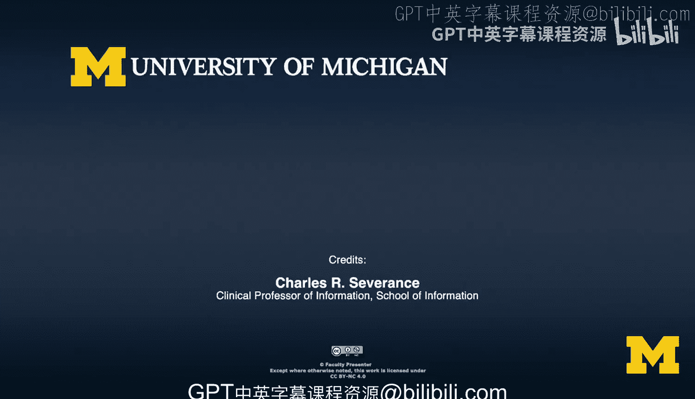

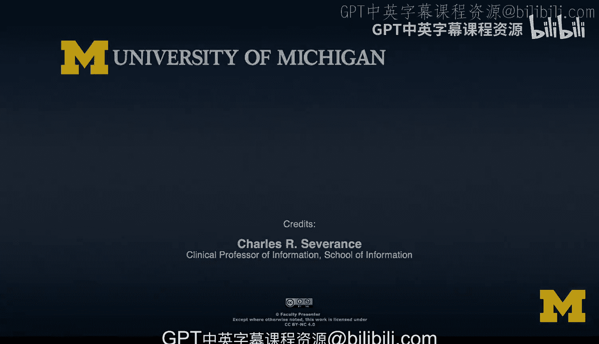

通过实现封装，我们为代码奠定了坚实的基础，使其更模块化、更易于维护，并为未来实现不同的底层数据结构（如哈希表）铺平了道路，而无需修改上层的调用代码。