# 密歇根大学《给所有人的C语言编程课（了解C、用C编程、数据结构、创建对象）｜C Programming for Everybody》 p31 10_04_02_探索跨语言的映射抽象.zh_en -BV1v2421P7pt_p31-

So now we're going to dive into the notion of abstractions。

 We're going to take an interface and kind of compare it across a number of different languages。

 We're going to call this abstraction a map。A map is a common term that we use kind of abstractly to describe key value collections。

 and each different language tends to have upon a different name for that。

 C++ they actually call it a map， Python calls it a dictionary。

 Java also calls it a map but with an uppercase and a PhP we call it a arrays。

 and in JavaScript where they're actually objects。And then we're going to look at the iterator pattern as an abstraction for looping across multiple implementations。

 So let's take a look at some sample。

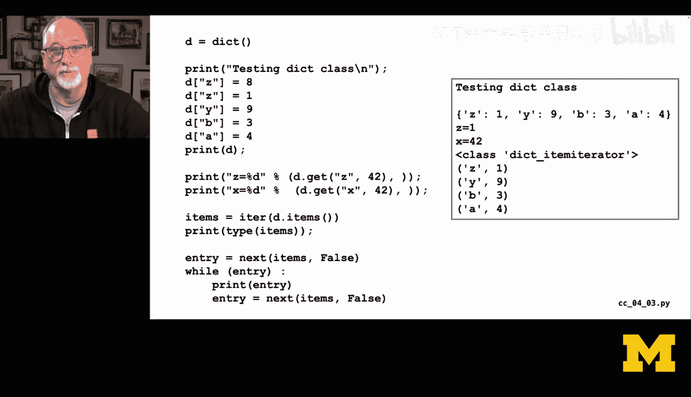

By than code that's playing with a dictionary class， so we created dictionary at the very beginning。

Then we filled it up with some key value pairs， and so you'll notice that like d sub z equals8 and d sub z equals 1。

 that's got to be a replacement， so there's no8 in there after that second replacement we then print it。

Then we do a get of Z to see if it's there， and then we do a get of x and it's not there so we see x equals 42 when it executes。

 then we say giveive me an iterator of the items in this dictionary。

And so what that basically is going to do is is the iterator itself is not a list in earlier version like Python 2。

 When you ask for the items， you tended to get a fully filled out list， but that's a waste of memory。

 So the iterator is simply a data structure that is keeping track of where in the list we are。

 And then we call it next over and over and over to advance through the iterator。

 So we don't have to make complete copy of all the data。

 We just have a little pointer that advances through。 So items is a relatively small data structure。

 mean， it doesn't include all the data in the dictionary。 It just is itself a pointer to something。

 It's all internal member abstraction is like， hey， I can give you the next thing。Internally。

 there's pointers and all kinds of crazy things inside these iters， which we shall soon see。

So if you print out items you will see that it's like an item iterator for dictionaries。

 that's what that class di item iterator is telling us。

 but then we can call the next function which is built into Python and say hey iterator。

Do your job and hand me back the next thing， or if we've let reach the end of the dictionary false come in any order these have any ordered dictionaries of course。

 but we get back the entry or we get back false。So we say while entry。

Then we print the entry and then we say hey， give me the next one and then loop up to the top and when it becomes false we're all done and so what you see because this is an order dictionary is you see Z1 x9。

 B3， a4， and then it finishes so this we not we don't know about next arrow next。

 we don't know even in this case we're just getting a toppleback so we do know that。

But if we take a look at this same kind of concept in PhHP， we make an array and we filled up。

C gets to be 8， Z gets to be1， and that's an overwrite。

And then we put three more things in and we can print them out and we see that it's kind of an ordered dictionary。

 as it were， X， Z， Y， B A。And then we do a get。And we're using the null coalesce operator。

 which is the double question mark so we say give me a sub z。

 and if that doesn't exist and then give me back 42， so it's kind of like a get。

 but that's a PhP7 in later， so we look up x and we don't get it so we see x equals 42。

And then we run through an iterator and again again there's structures inside of arrays。

 but we know nothing about how PhP implemented the arrays。

 we just know that if we say for each a as key is assigned to value。

 we can pronoun K and V and so this is a very abstract way of saying I want to go through all of them I want the keys and values。

 give those back to me but I don't care how you do it， whether you make extra copies of data， etc。

 so that's another iterator pattern Now in C the data structure we create as a map and if you read this you'll see that talks about how the implementations work。

 etc etc etc， but this C+ plus equivalent of a dictionary is in effect a map and so this is some C+ plus code。

 the first thing we see is we're going to create a map and in this less than greater than syntax you're seeing that the map is mapping a string to an integer so the key in this case。

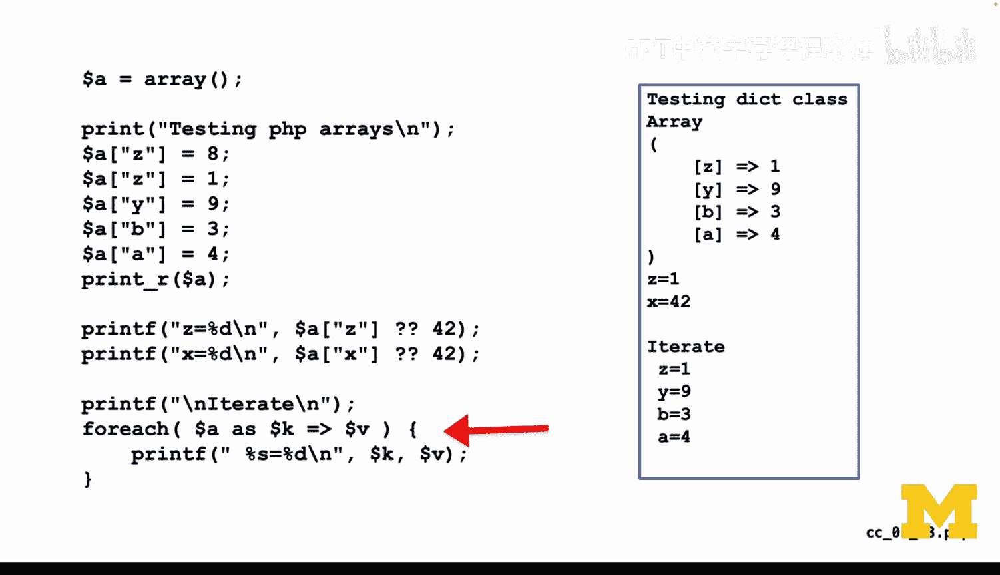

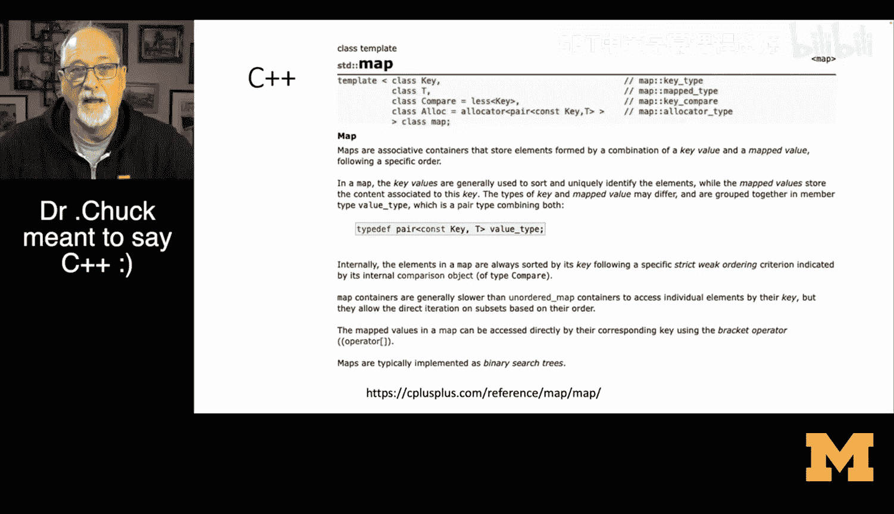

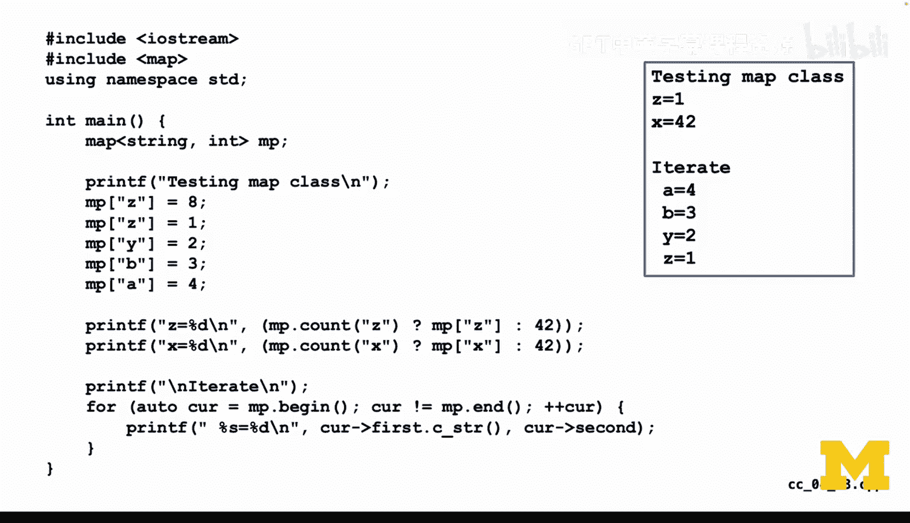

This is a string and the value is an integer。The previous two languages didn't care so much about types and so that's why they but now we're in C++ which cares greatly about types and so now we say MP sub z equals 8。

 thenmp sub z equals 1， which again is a replace operator， then y B and A are set two，2，3。

 and4 respectively。

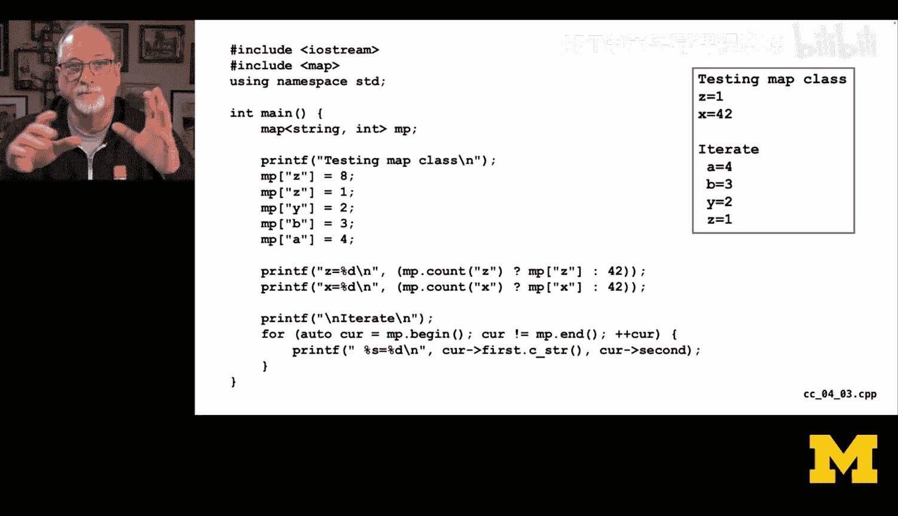

And。And then we do like a get operation and this one is a little funky and see why they didn't give us a get operation。

 I do not know， but what this is using is a turnernary operation is sayingmp count how many。

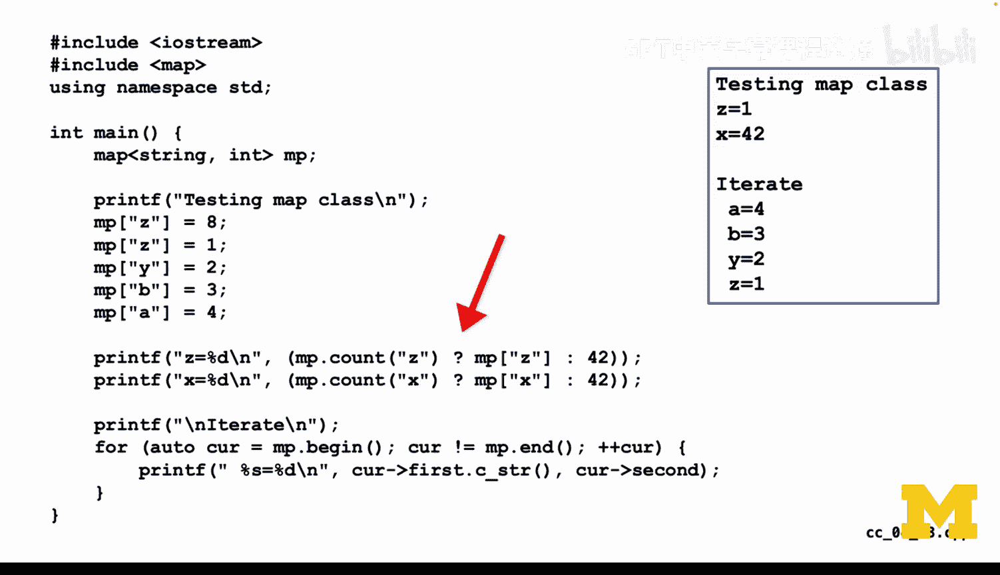

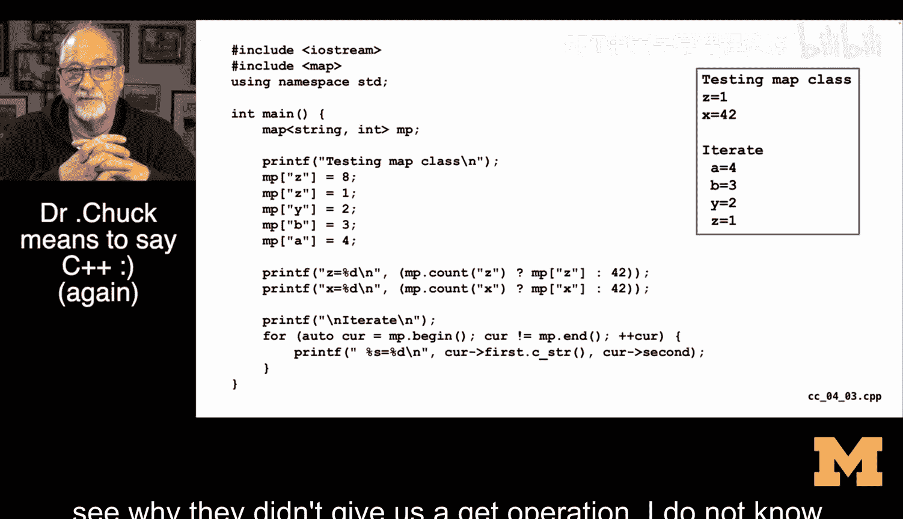

Z keys are inside this thing。 And if it's greater than0， we print out MP sub Z。

 And if it's not greater than 0 effort 0， then we print out 42。

 which functions like a Python get on a dictionary。 So this syntax is funky。

 you can go like Google it。 There's just no it's like there's two ways you can do it。

 And neither of them makes me particularly happy because I think that for a map like object。

 a get a get with a default is。Pretty valuable。 The notion of running through and counting means you found it or didn't find it。

 And if you found it， why don't you give it back to me， but they just don't have a gap。

But now we see an iteration， so it says for auto auto is a type。

 but it's an automatic type and it knows that this MP。Is a map string int。

 and so it creates this current pointer， which is a pointer to not exactly a max map string。

 It's a map entry， but we don't care about that。 there's actually a type curve。

 the variable curve has a type， whatever the MP begin is going to give us back as a type and it knows that based on the map string in。

And it makes cur the right type， so this is like whatever type you want， but it is not any type。

 it's a very precise type。And that's a sort of a hallmark of C++ as all the types are very。

 very precise， so it's a for loop， you see the three semicollins。

 the initialization clause autocur equals MP begin says， hey， we've got our iterator， get me started。

Begin， go to the beginning of it and give me the first one。

And as long as curve is not equal to MP and the end there are no more that's kind of like their null and then plus plus curve so we're incrementingcur and then there's a key in a value and they don't call them key in value they call them first and second that's the thing coming back from MP begin has a attribute first and attribute second and we call the C underscore STR to convert that to a C string so I can use printf so I don't have to use C out just because I don't know why I didn't want to use C out in this one。

 but you see an abstraction where the first and the second are known but because this is a key in a value。

That's not such a big deal Okay， And so that's doing the same thing in C plus plus in Java。

 they have a interface。 and you see the word interface here， an interface。

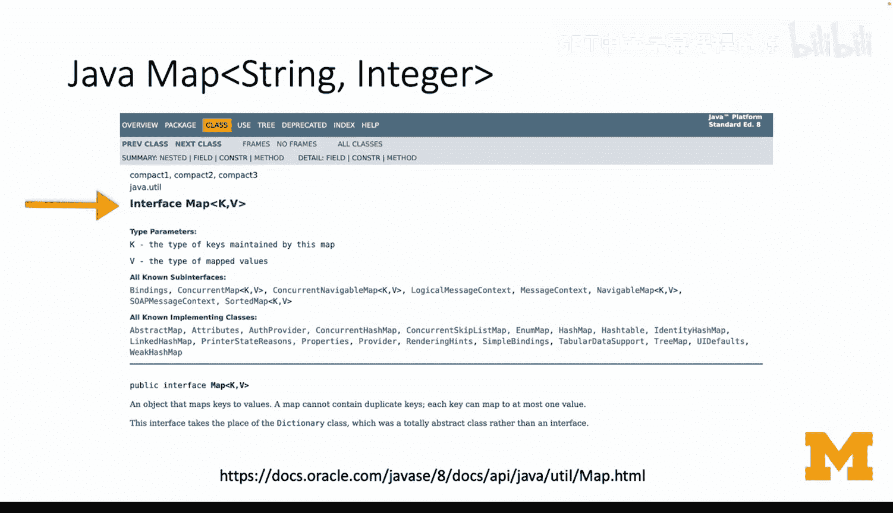

Named map。Less than greater than k comma V and just like in C+ plus this is saying a map is a key in a value。

 but what we're putting in here is the type of the key and the type of the value。

 so we're going to make a map that has a string key and an integer value you might say why didn't I do string string and that's because it makes it just easier when I'm writing so much C code it also will be fun when we actually count things if you remember from a long time ago we did counting but map is the class and string integer this is kind of polymorphism where it can be a map that map strings to integers or integers to strings or strings to strings are who knows what to who knows what else meaning this map is exceedingly flexible and it doesn't care what kind of type it's using as long as the type meet some basic criteria。

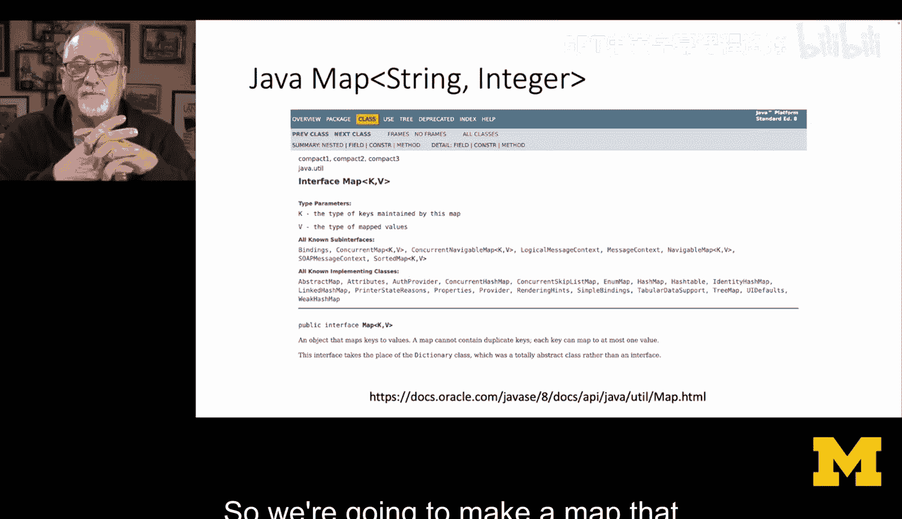

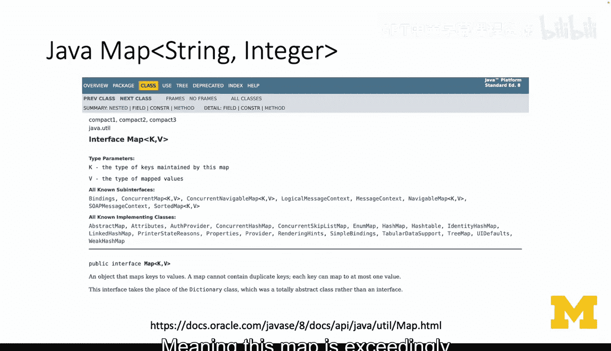

So here's a bit of Java code that does the same thing that we've been doing。

 and so we see that we're going to make this variable map lowercase is of tight map map of strings to integers。

 and we're going to create a new tree map of strings to integers and the new creates a new object Now the difference between a map and a tree map is a map is an interface and a tree map is implementation。

 The tree map says we're going to build this key value store。

 but we're going to store our data in a tree and that says to。

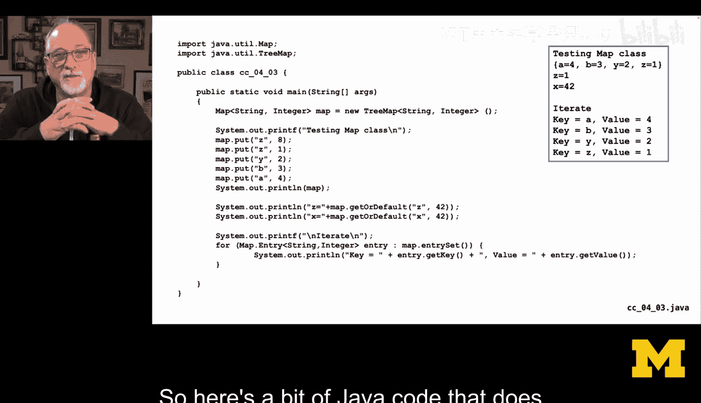

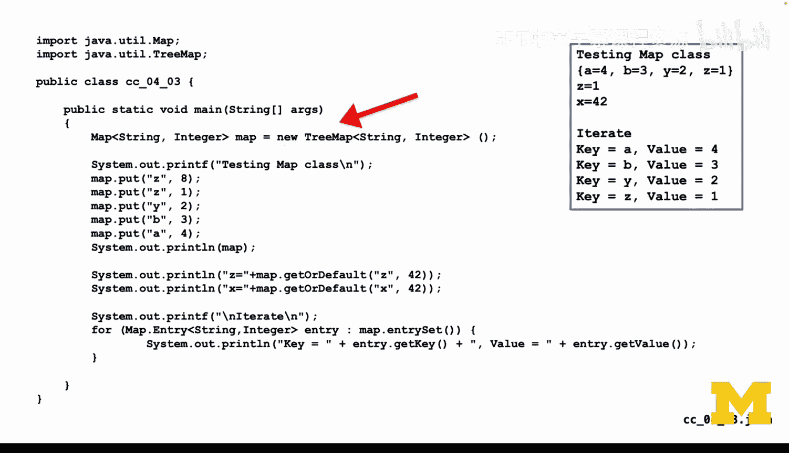

A computer scientist that it's going to have a certain performance and memory footprint trees are a great way to store key value data but they take a little bit more memory than a linked list as we will later see and so we're choosing an implementation。

 the other thing where it says treemap that you might use is what's called a hashmap which is a simpler map implementation but doesn't keep things in order so you can choose the map doesn't change but you can say I'd like this to be a tree map。

Or a hashm， they're both key value stores， one is an ordered key value store。

 and a hashmap is an unordered key value store， and they both have different performance。

Behaviors and internal implementation details。But it doesn't matter because they're both maps in this code that we write。

 we could literally change TMap to hashmap and the code would work exactly the same。

 but the order of the key value pairs might be a little bit different。

Now you'll notice that when we're putting stuff in we call a method map dot put so everything we've seen so far says like map open bracket quote Z quote close bracket equals8。

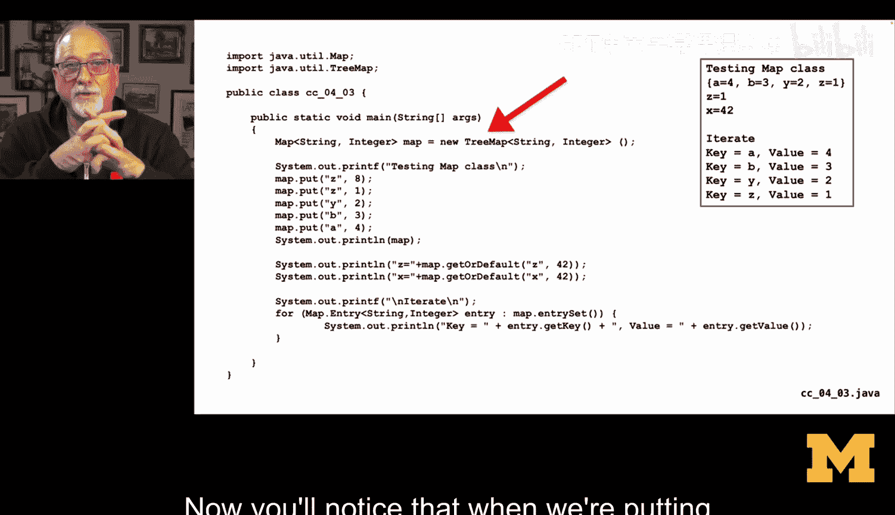

Java chose not to do what's called operator overloading and so it really does everything in a method。

 so the kind of things that you think are going to be done with an assignment statement or some other syntax tend to be done。

It's like okay， we're going to do everything with methods and parameters Now map is the object the instance that's being worked on and Z where that's basically saying map sub Z equals8 and we'll do a put of Z and1 which is going to overwrite you'll see I'm doing the same thing in each one of these things and then put in Y B and a with 2。

3 and 4 respectively， I can print it out and if you look at the printout。

 it looks a lot like what it looks like in Python there's this thing called get or default。

Map get our default， which is if the key Z is in there。

 give it to the value or just give me 42 is a default and in the first case Z is there in the second case x is not there so you see x is 42 that's not a bad name for this little more abose than get it's pretty much the same as what we do in Python and then we have an iterator and now you see in this for loop you see kind of the notion of the fact that the iteration variable is。

Has a type， so we don't have this auto， later versions of Java may have an auto。

 but now I'm explicitly showing you。It's not a map string integer， it's a map dot entry。

 which is an entry inside of a map。 It's an abstract interface to the entry inside of a map。

 each entry that's got to match the string integer that's in the map。

 and so there's a map string integer， which is the whole map and then there's a map entry。

 which is one of the entries， but this map entry is also kind of an iterator right So we're going to iterate and move forward。

 So it's not just the key in the value。 it's really the key in the value in the position。

But we don't see the position all we know is we keep。We use this four syntax。

 which is kind of like a4 in in Python， and we call map dot entry set。

 which is I want a set of all the entries and that map entry set does not construct a giant in memoryory list。

And then go through it， that actually creates a single map entry with the the value of the first one and then you hit it again and it gives you the second one。

 hit again gives third one， and pretty soon it gives you null。

 which means that the loop is going to stop。And the entry itself。Does have a key and a value。

 Now key and value are known in the map entry interface。

 So you say entry dot get key and entry dot get value。 Now that they're using。

🎼Methods to give us back the key and the value versus in the previous things you saw attributes being used in the iters。

 And that's because Java is obsessed with preferring to use accessor methods like getters and setters versus just grabbing attributes。

 And the key thing is as they can add a little bit of business logic if they want。

 rather than having to do something and they have the key in the value already completely computed。

 sitting in an attribute for you to use entry getkey。

 sometimes it just grab something it's already got computed or it might actually go do something or do some work。

 And so by putting these things in what what Java calls getters and setters。 in this case。

 we're not seeing we're not seeing a set so much， but making it so that instead of it being entry key。

 it's entry getkey open print and closeb。 that's a very Java way of thinking about this。

 So we started by talking about a simple Python dictionary where we filled up。

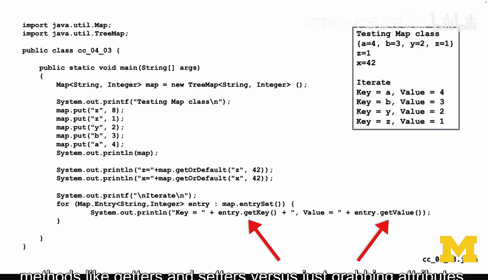

Use get， then we create an iterator and then we abstractly loop through that iterator and that's what we wanted to accomplish in this section just to see how that is done in a wide range of different languages because the map abstraction。

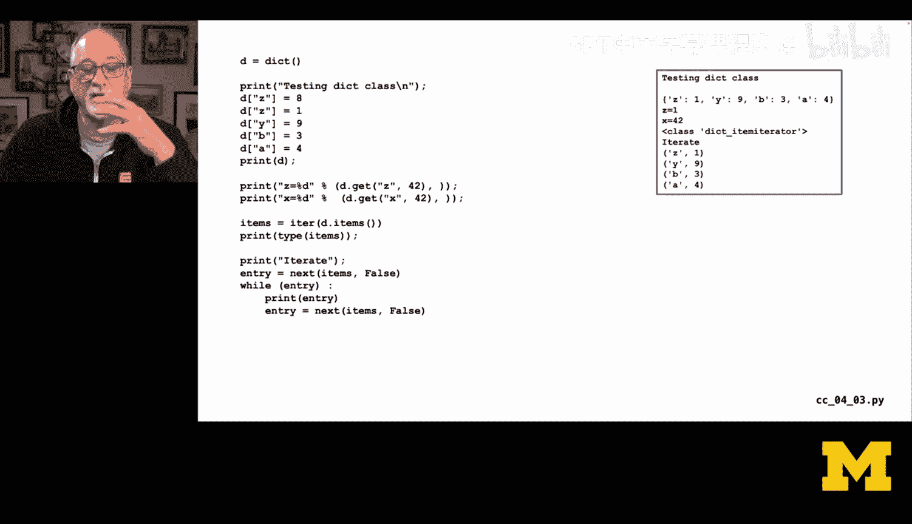

It's kind of like this thing that we use as software developers and then it's kind of a sealed thing and then underneath it all the magic happens。

🎼Yeah。

