# C语言编程：12_04_04：在基于C的对象中实现封装 🔒

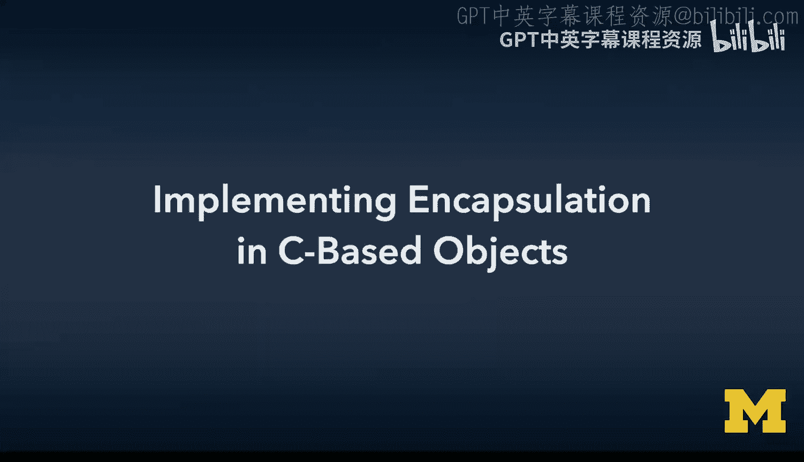

在本节课中，我们将学习如何在C语言中实现面向对象编程的核心概念之一：封装。我们将通过重构一个简单的“映射”（Map）数据结构来演示，将全局函数转换为类的方法，并区分公共和私有属性。

---

## 概述

之前我们已经深入探讨了对象和理论。现在，是时候停止深潜，开始编写一些代码了。我们将从一个简单的概念开始：**封装**。之后，我们还会学习迭代，但本节我们只专注于封装。

本节的大部分代码你其实已经写过。我们主要是进行重构和调整，将那些我们按约定命名的、允许调用代码使用的函数，通过一些指针操作，移动到“类”中。

真正的成果在于，`map->put`、`map->get` 和 `map->del` 这些方法现在以属性的方式被命名和访问。我们调用的函数成为了类本身的属性。除此之外，并没有太大不同。我们还将更明确地定义类中哪些部分是公共的，哪些是私有的。

---

## 定义私有结构：Map Entry

我们从一个 `map entry` 开始。这个结构构成了链表中的节点。

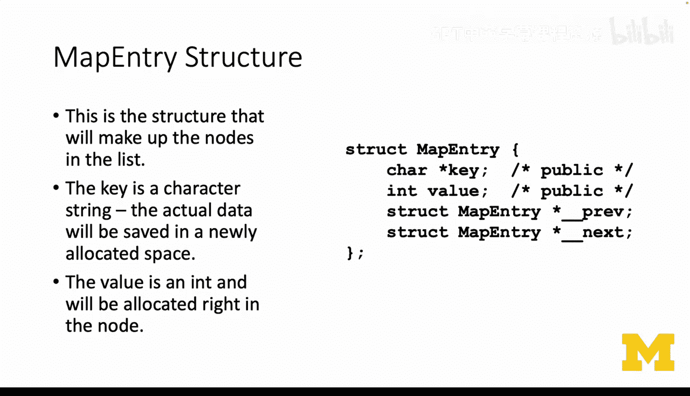

*   `key` 是一个字符串。
*   `value` 是一个整数（为了简化示例）。
*   我们需要像之前一样动态分配 `key` 的内存。
*   我们还有 `prev` 和 `next` 指针。

这里的关键是，`prev` 和 `next` 前面有**双下划线**（`__`）。这意味着它们是**私有**的。我们决定 `key` 和 `value` 是**公共**的，就像Python的做法一样，不在它们前面加双下划线，并在心里记住调用代码允许使用它们。


```c
struct map_entry {
    char *key;          // 公共属性
    int value;          // 公共属性
    struct map_entry *__prev; // 私有属性
    struct map_entry *__next; // 私有属性
};
```

---

## 定义主类结构：Map

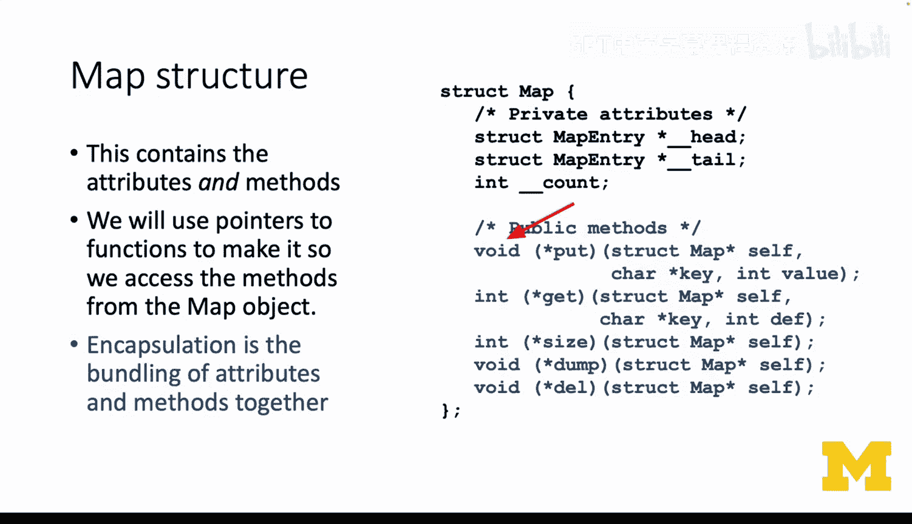

`map` 结构体大部分看起来很简单。

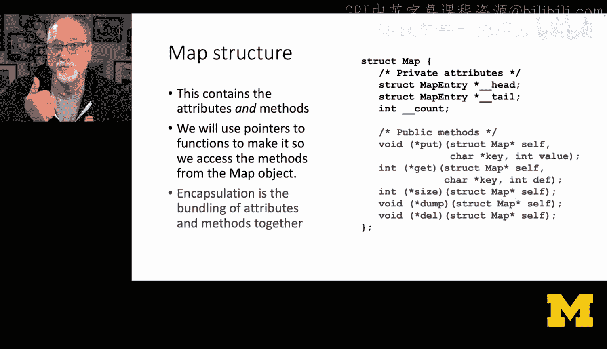

*   我们有 `head`、`tail` 和 `count`。你已经维护它们一段时间了。
*   这些是**私有属性**，所以我们用双下划线重命名它们。

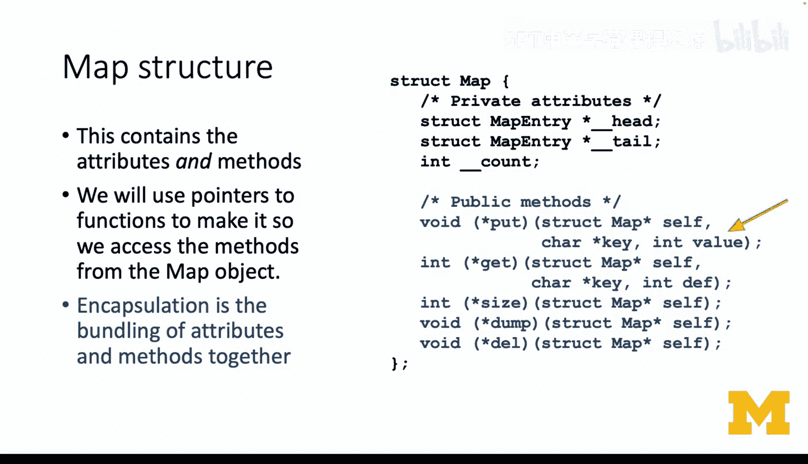

然后，我们有一系列**公共方法**，共有五个。关键点在于，这些是**指向函数的指针**。

例如，`void (*put)(struct map *self, char *key, int value);` 意味着我们在结构体中分配了一个名为 `put` 的变量，它是一个函数指针。这个指针指向一个返回 `void` 的函数。我们不仅定义了用于访问函数的属性，还定义了它的调用规则：它返回 `void`，并接受三个参数：一个指向 `struct map` 的指针 `self`、`char *key` 和 `int value`。

最终，这并不是把代码放在这里（像JavaScript那样）。它实际上是一个64位的数字，即一个指向函数起始地址的指针。函数的方法签名必须匹配，所以我们在这里定义了方法签名。但在分配时，我们实际上是为 `put`、`get`、`size`、`dump` 和 `del` 各分配了一个指针。

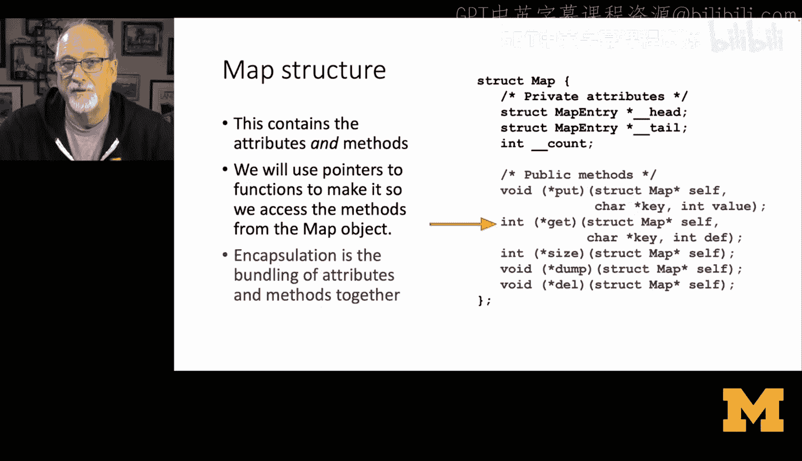

```c
struct map {
    // 私有属性
    struct map_entry *__head;
    struct map_entry *__tail;
    int __count;

    // 公共方法（函数指针）
    void (*put)(struct map *self, char *key, int value);
    int (*get)(struct map *self, char *key, int default_value);
    int (*size)(struct map *self);
    void (*dump)(struct map *self);
    void (*del)(struct map *self);
};
```

理解这里的括号非常重要，因为我们同时定义了属性名、它的使用规则以及我们最终要指向的函数的方法签名。

---

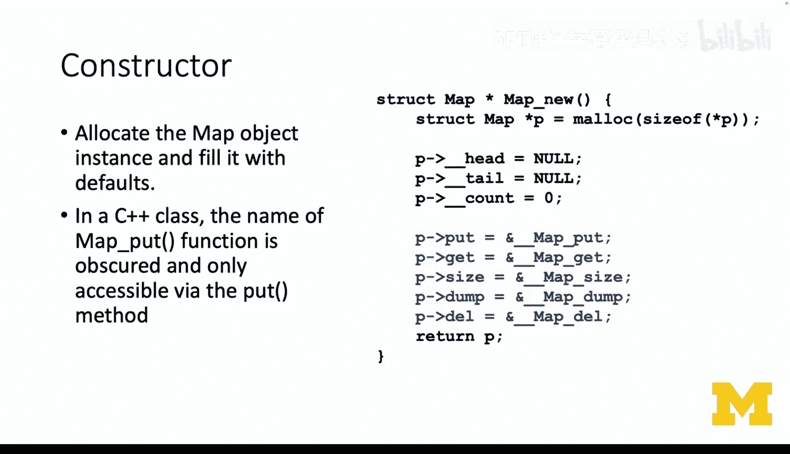

## 构造函数

构造函数与你之前写的没有太大不同。我们需要构建这些函数：`__map_put`， `__map_get`， `__map_size` 等。它们位于源代码中某个更靠前的位置。

在构造函数中，我们只是说：`map->put`（公共属性 `put`）等于 `&__map_put` 函数的地址。非常简单：`&` 是“取地址”运算符。`get` 是那个函数的地址，`size` 是那个函数的地址，`dump` 是那个函数的地址，以此类推。

```c
struct map *map_create() {
    struct map *m = malloc(sizeof(struct map));
    m->__head = NULL;
    m->__tail = NULL;
    m->__count = 0;

    // 将函数指针指向实际的函数实现
    m->put = &__map_put;
    m->get = &__map_get;
    m->size = &__map_size;
    m->dump = &__map_dump;
    m->del = &__map_del;

    return m;
}
```

这展示了 `map` 结构体本身的大小：`head` 是一个64位指针，`tail` 是一个64位指针，`count` 可能是一个64位或32位整数，`put`、`get`、`size`、`dump` 和 `del` 都是64位指针。所以 `map` 结构体本身大约在10个字（words）或更少，这再次关系到效率。

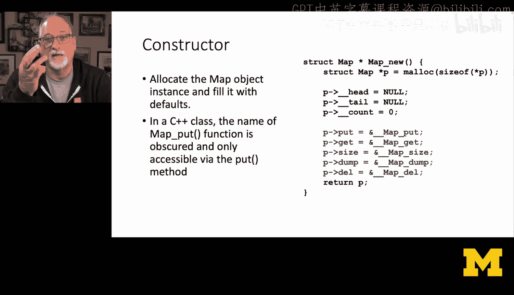

---

## 实现类方法

你可能已经拥有了 `__map_put`， `__map_get`， `__map_size`， `__map_dump` 和 `__map_del` 所需的大部分代码。

### Map Dump 方法

`__map_dump` 方法很简单。`self` 是指向 map 的指针，它有 `__head` 和 `__next`。我们只需遍历直到 `cur` 等于 `NULL`。

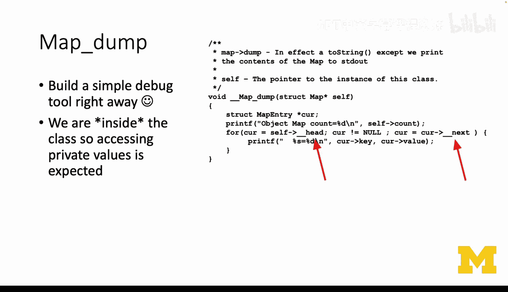

注意，我们没有给 `cur` 加双下划线，因为它只是这个函数内部的自动变量，与外部世界无关。你会注意到我们直接访问 `__head` 和 `__next`，因为我们在类内部。所以，在类的方法中访问私有属性是完全合法的，这很正常，我们不必隐藏它们。

```c
void __map_dump(struct map *self) {
    struct map_entry *cur = self->__head;
    while (cur != NULL) {
        printf("Key: %s, Value: %d\n", cur->key, cur->value);
        cur = cur->__next;
    }
}
```

当我构建这样的代码时，第一件想让它工作的事情就是某种“dump”工具，因为调试时需要它。我会在每行代码后都放一个 `map_dump`，直到东西开始工作，然后再把 `map_dump` 去掉。所以这就是为什么我要让你们也这样做。

### Map Delete 方法

像大多数删除操作一样，关键是画出结构图，找出哪些部分是动态分配的（来自 `malloc`），然后确保调用 `free` 释放它们。

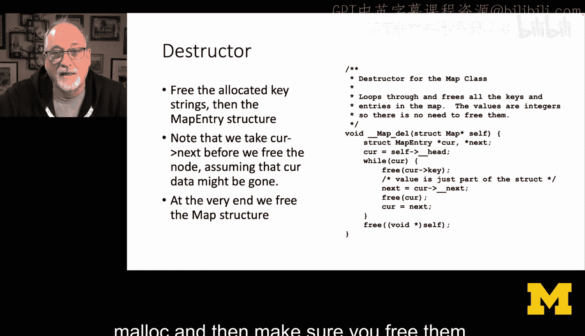

我们只需遍历链表。同样，我们在类内部，所以可以愉快地使用双下划线属性。遍历时，顺序很重要：我们先释放 `key`（记住，这是一个我们 `malloc` 的字符串指针），我们不需要释放 `value`，因为它实际上是 `map_entry` 结构体的一部分。然后我们前进到下一个节点，再释放当前的 `map_entry` 本身。

```c
void __map_del(struct map *self) {
    struct map_entry *cur = self->__head;
    struct map_entry *next;

    while (cur != NULL) {
        next = cur->__next; // 先保存下一个节点
        free(cur->key);     // 释放动态分配的 key
        free(cur);          // 释放节点本身
        cur = next;         // 移动到下一个节点
    }
    // 最后释放 map 结构体本身
    free(self);
}
```

最终，我们遍历整个链表，释放了所有的 `key` 和 `entry`，归还了所有数据，然后释放了那大约10个字的 `map` 结构体本身。

### Map Get 方法

`__map_get` 很简单，只要你有一些像 `__map_find` 这样的代码。`__map_find` 会完成所有繁重的工作，它可以查看 `__head`、`__next` 等，写一些循环，应该不难。

同样，`__map_find` 是私有的，但我们在类内部，所以可以随意使用私有成员。

```c
int __map_get(struct map *self, char *key, int default_value) {
    struct map_entry *found = __map_find(self, key);
    if (found != NULL) {
        return found->value;
    } else {
        return default_value;
    }
}
```

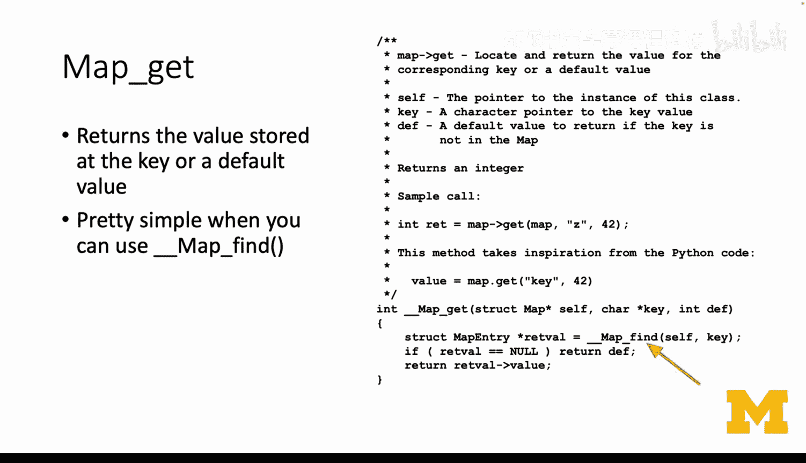

### Map Put 方法

`__map_put` 方法需要你编写。但如果你思考一下：如果你调用 `__map_find` 并找到了条目，就更新它的值并返回；如果没有找到，就构造一个新的 `map_entry` 并添加到链表末尾。同样，我希望你现在可以轻松完成这些。

```c
void __map_put(struct map *self, char *key, int value) {
    struct map_entry *found = __map_find(self, key);
    if (found != NULL) {
        // 键已存在，更新值
        found->value = value;
    } else {
        // 键不存在，创建新节点并添加到链表末尾
        struct map_entry *new_entry = malloc(sizeof(struct map_entry));
        new_entry->key = strdup(key); // 复制 key 字符串
        new_entry->value = value;
        new_entry->__prev = self->__tail;
        new_entry->__next = NULL;

        if (self->__tail != NULL) {
            self->__tail->__next = new_entry;
        } else {
            // 链表为空，新节点也是头节点
            self->__head = new_entry;
        }
        self->__tail = new_entry;
        self->__count++;
    }
}
```

---

## 总结

本节课中，我们一起学习了如何在C语言中实现封装。这是一个非常简单的部分，我们所做的只是将全局命名函数转换为类的方法。我们通过双下划线强制执行私有规则，然后在 `map` 结构中声明函数指针，并在构造函数中设置它们。其余部分基本上只是重构你已经拥有的代码。

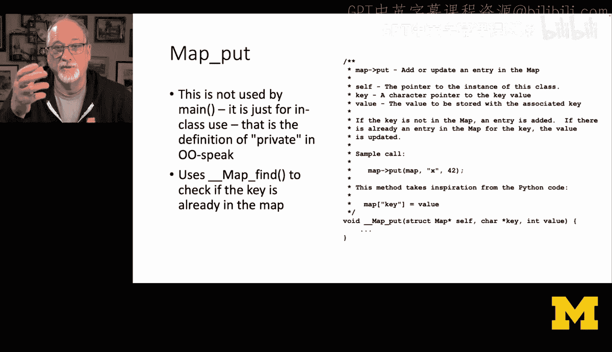


通过这种方式，我们为C语言的数据结构赋予了更清晰的面向对象接口，使代码组织更有序，并明确了公共API与内部实现的边界。