# C语言编程：13_04_05：在C语言中构建迭代器抽象 🧩

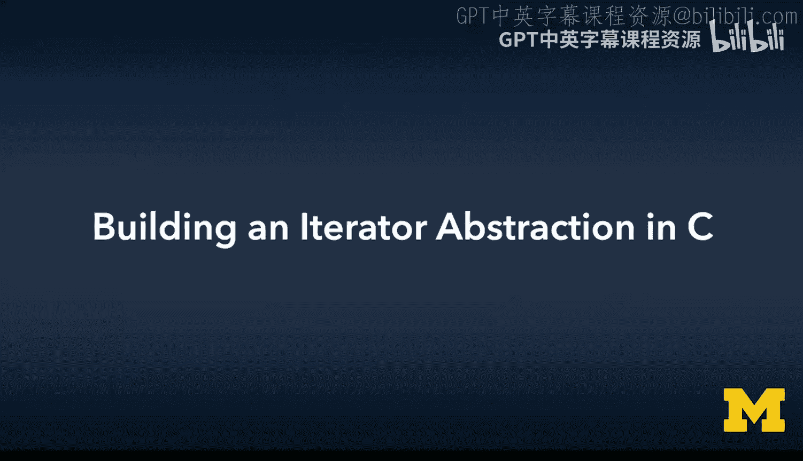

在本节课中，我们将学习如何在C语言中构建迭代器抽象。迭代器是一种设计模式，它允许我们以统一的方式遍历不同的数据结构，而无需关心其内部实现细节。通过使用迭代器，我们可以编写出更通用、更易于维护的代码。

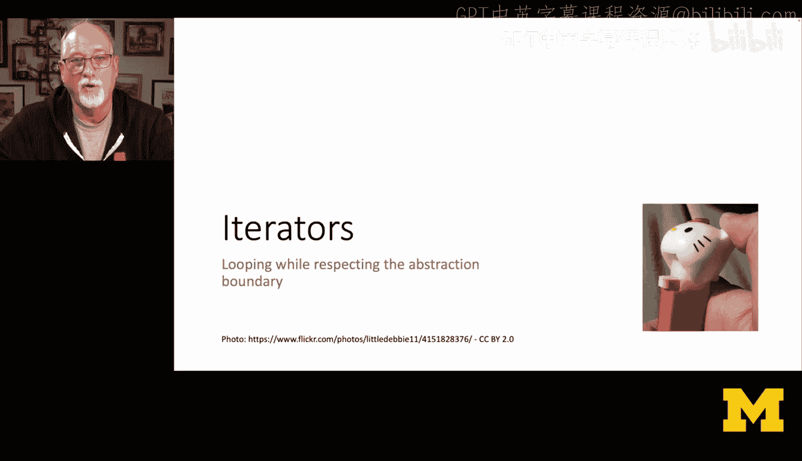

---

## 迭代器的必要性

上一节我们介绍了数据结构的封装。本节中，我们来看看为什么需要迭代器。直接使用数据结构内部的指针（如 `head` 和 `next`）来遍历数据，会破坏抽象边界，使代码与特定实现紧密耦合。例如，链表有 `head` 和 `next`，但哈希表或树结构则没有。为了编写能适用于不同底层数据结构（如链表、哈希表、树）的通用代码，我们需要一个统一的遍历方式。

核心思想是：**调用代码不应关心对象如何被遍历**。我们需要一个通用的循环概念。

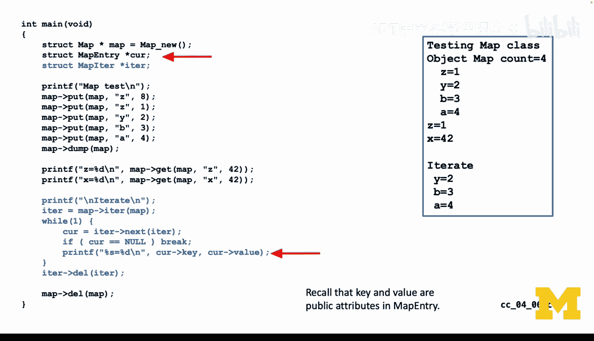

---

## 迭代器模式解析

迭代器是一个独立的对象。你创建它时，它从数据结构的起始位置开始。然后，你反复调用 `next` 方法来获取下一个元素。迭代器内部会维护状态（如当前指针），每次调用 `next` 都会返回当前元素并自动前进到下一个位置。当没有更多元素时，它会返回一个特殊值（如 `NULL`）。

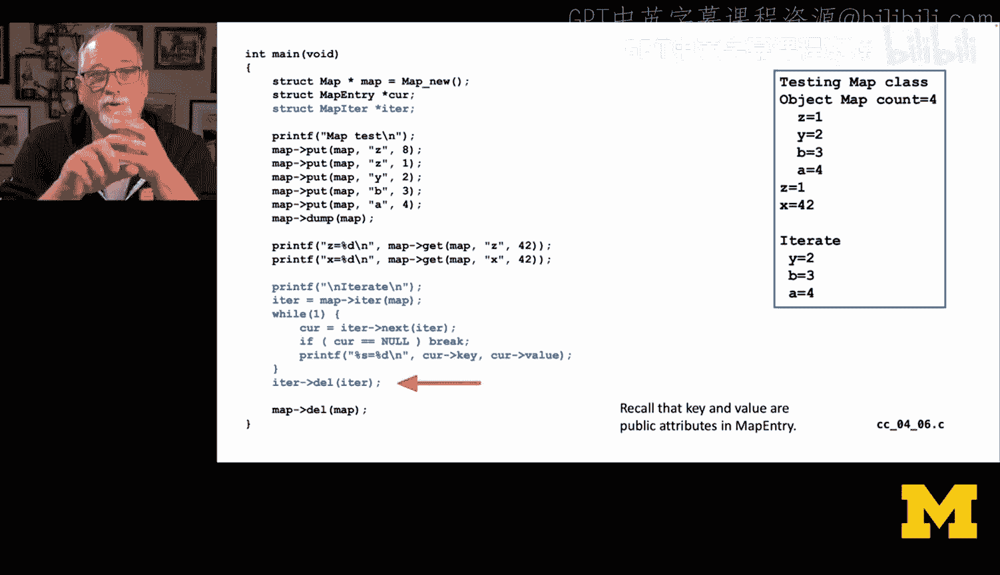

以下是迭代器模式的关键步骤：
1.  从数据结构（如 `Map`）获取一个迭代器对象。
2.  在一个循环中，反复调用迭代器的 `next` 方法。
3.  处理 `next` 方法返回的元素。
4.  当 `next` 返回 `NULL` 时，结束循环。
5.  最后，销毁迭代器。

---

## 与Python迭代器的对比

为了帮助理解，我们可以参考Python中的迭代器。在Python中，对一个字典调用 `iter()` 会返回一个字典键迭代器对象，而不是包含所有数据的列表。

```python
d = {'A': 1, 'B': 2, 'C': 3}
it = iter(d) # 获取迭代器
while True:
    try:
        key = next(it) # 获取下一个键
        print(key)
    except StopIteration: # 没有更多元素时抛出异常
        break
```

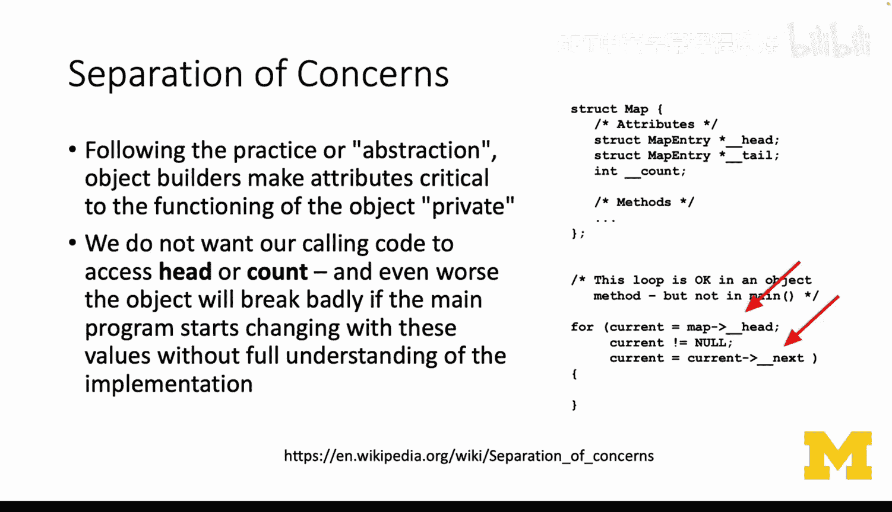

我们的C语言实现将模仿这种模式：迭代器不包含所有数据，而是包含指向内部数据的指针，并通过 `next` 方法依次提供。

---

## C语言迭代器实现

现在，我们来看看如何在C语言中具体实现一个迭代器。我们将为之前构建的 `Map` 类添加迭代功能。

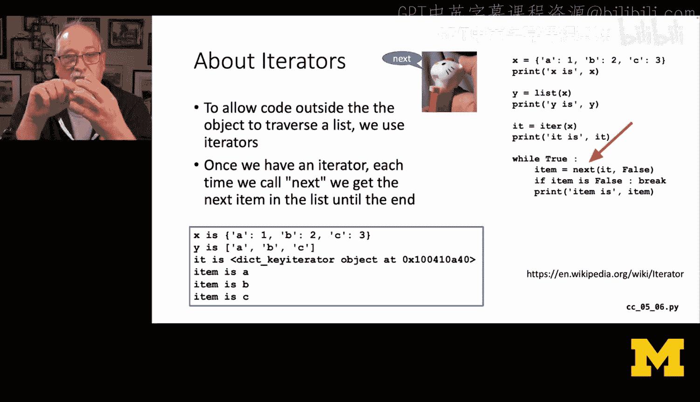

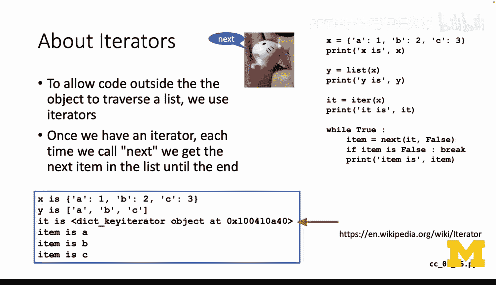

### 迭代器结构体定义

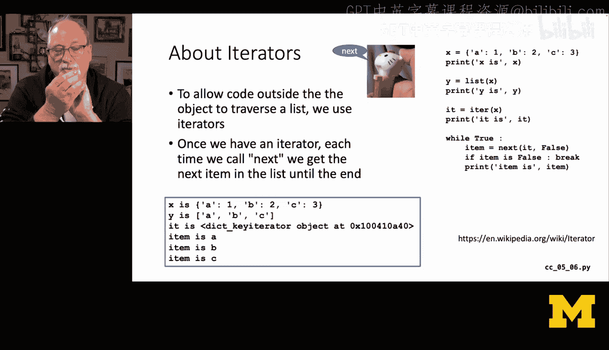

首先，我们定义一个迭代器结构体 `MapIt`。它的内部细节（如 `current` 指针）是私有的，对外只暴露两个方法：`next` 和用于清理的 `del` 函数。

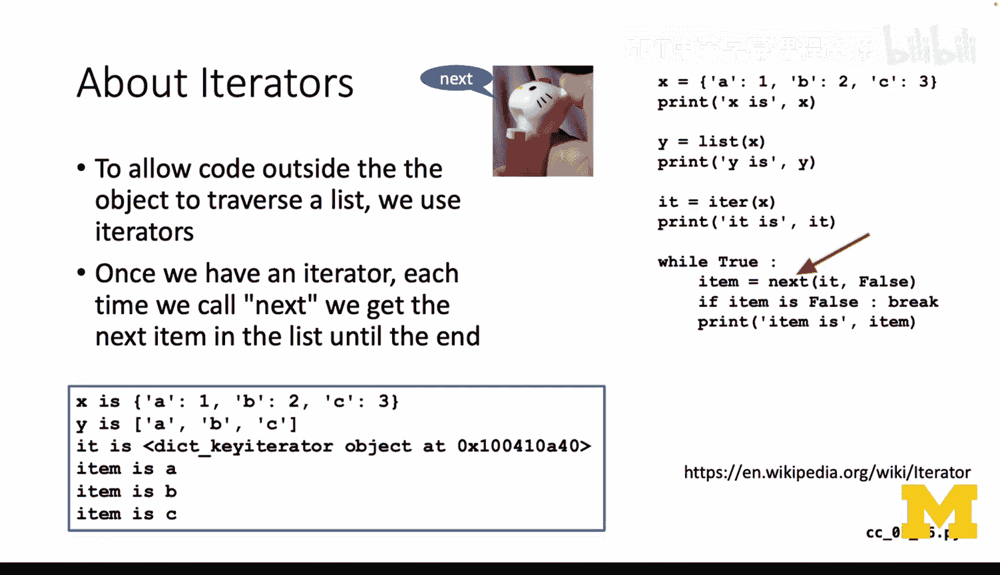

```c
typedef struct mapit {
    // 私有成员
    MapEntry *_current;
    // 公共方法指针
    MapEntry *(*next)(struct mapit *it);
    void (*del)(struct mapit *it);
} MapIt;
```

### 迭代器的创建与初始化

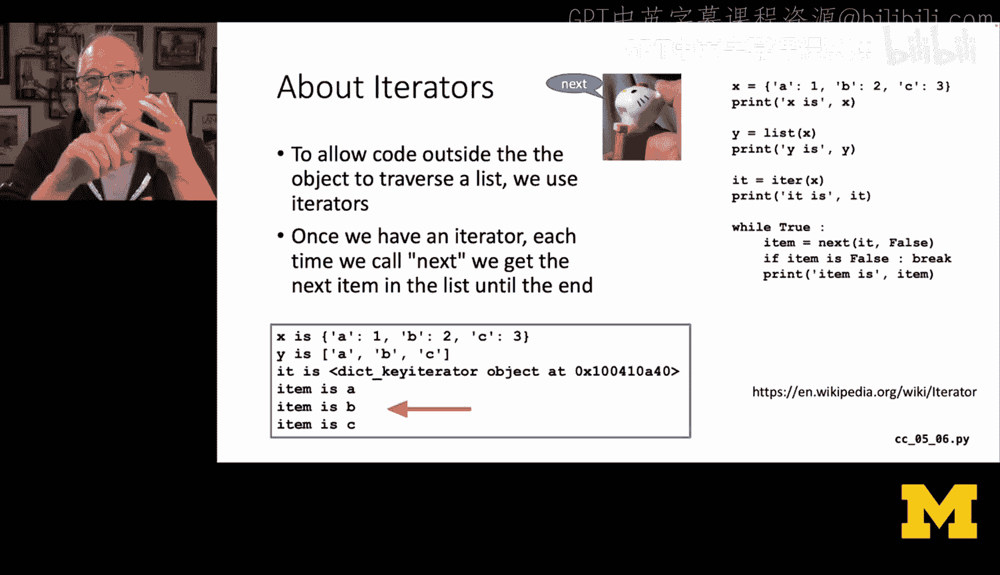

迭代器由 `Map` 对象的某个方法（例如 `map_iterator`）创建并初始化。在构造函数中，我们将 `current` 指针指向链表的第一个节点（`head`），并将函数指针指向具体的实现函数。

```c
MapIt *map_iterator(Map *m) {
    MapIt *it = malloc(sizeof(MapIt));
    it->_current = m->_head; // 私有操作，从Map的head开始
    it->next = mapit_next;   // 指向next方法的实现
    it->del = mapit_del;     // 指向del方法的实现
    return it;
}
```

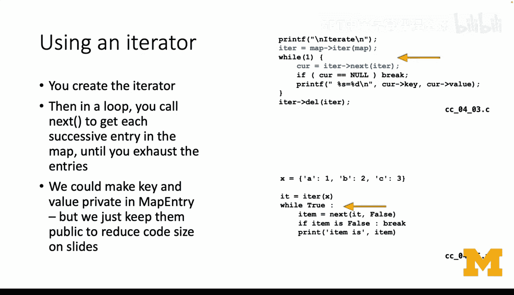

### next方法的工作原理

`next` 方法是迭代器的核心。它返回当前指向的元素，然后将内部指针 `_current` 移动到下一个位置。当 `_current` 为 `NULL` 时，表示遍历结束，返回 `NULL`。

以下是 `next` 方法的一个简化实现逻辑：
```c
MapEntry *mapit_next(MapIt *it) {
    if (it->_current == NULL) {
        return NULL; // 遍历结束
    }
    MapEntry *retval = it->_current; // 保存当前要返回的条目
    it->_current = it->_current->next; // 内部指针前进到下一个
    return retval; // 返回当前条目
}
```

**状态变化图示**：
假设链表为：`head -> [z=22] -> [w=42] -> NULL`
1.  **初始状态**：`it->_current` 指向 `[z=22]`。
2.  **第一次调用 `next`**：返回 `[z=22]`，同时 `it->_current` 前进到 `[w=42]`。
3.  **第二次调用 `next`**：返回 `[w=42]`，同时 `it->_current` 前进到 `NULL`。
4.  **第三次调用 `next`**：发现 `it->_current` 为 `NULL`，返回 `NULL`，表示结束。

---

## 使用迭代器的客户端代码

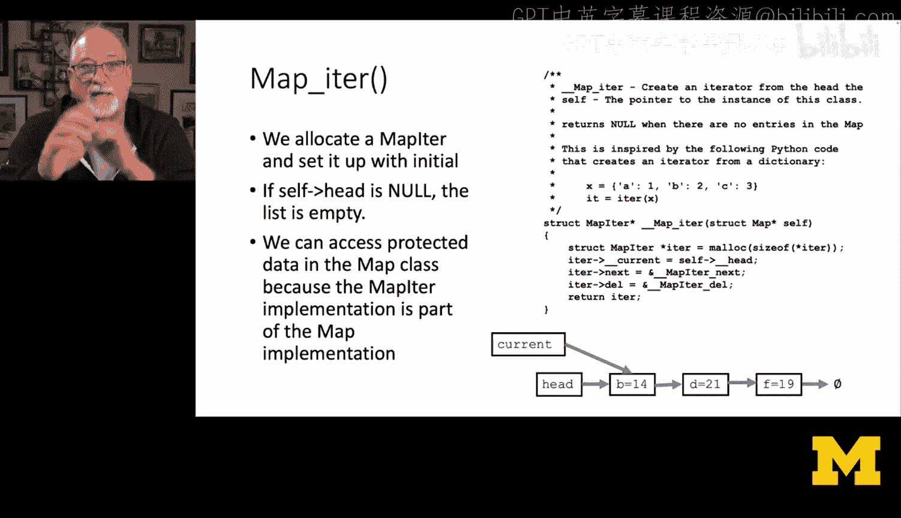

使用迭代器的客户端代码变得非常简洁和通用。它只需要知道如何获取迭代器、调用 `next` 以及判断结束。

以下是使用迭代器遍历Map并打印所有键值对的示例代码：
```c
// 获取Map的迭代器
MapIt *it = map->iterator(map);

while (1) {
    // 获取下一个条目
    MapEntry *cur = it->next(it);
    if (cur == NULL) { // 判断是否结束
        break;
    }
    // 处理当前条目（MapEntry的key和value是公共的）
    printf("Key: %s, Value: %d\n", cur->key, cur->value);
}

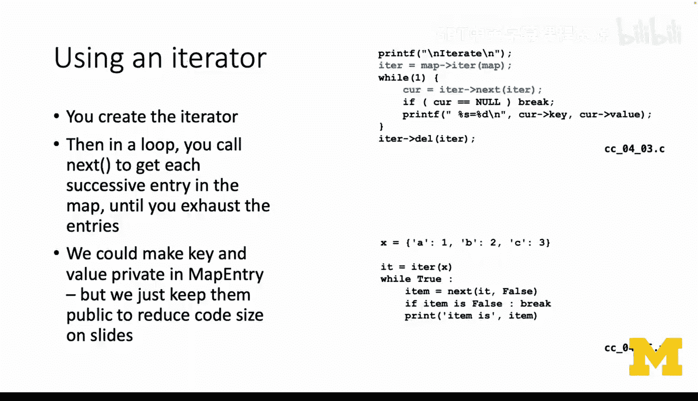

// 清理迭代器
it->del(it);
```

这段代码的**结构**与之前展示的Python代码完全平行。无论底层 `Map` 是链表、哈希表还是树实现的，这段遍历代码都**无需任何修改**。

---

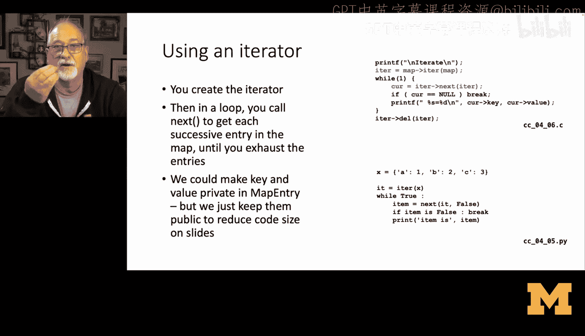

## 总结与展望

本节课中，我们一起学习了在C语言中构建迭代器抽象。我们理解了为什么需要迭代器来分离关注点，实现了迭代器结构体及其核心的 `next` 方法，并编写了通用的客户端遍历代码。

通过引入迭代器，我们为 `Map` 抽象奠定了坚实的基础。现在，我们可以开始创建 `Map` 的不同实现（如基于链表的 `ListMap`、基于哈希的 `HashMap`、基于树的 `TreeMap`），而使用这些 `Map` 的客户端代码完全不需要改变。这让我们能够在不影响上层应用的情况下，在底层实现更复杂的数据结构和算法，逐步逼近像Python字典那样高效和灵活的实现。


这正是抽象和封装的强大力量：它允许我们在抽象层之下灵活操作，实现真正酷炫的功能。🚀