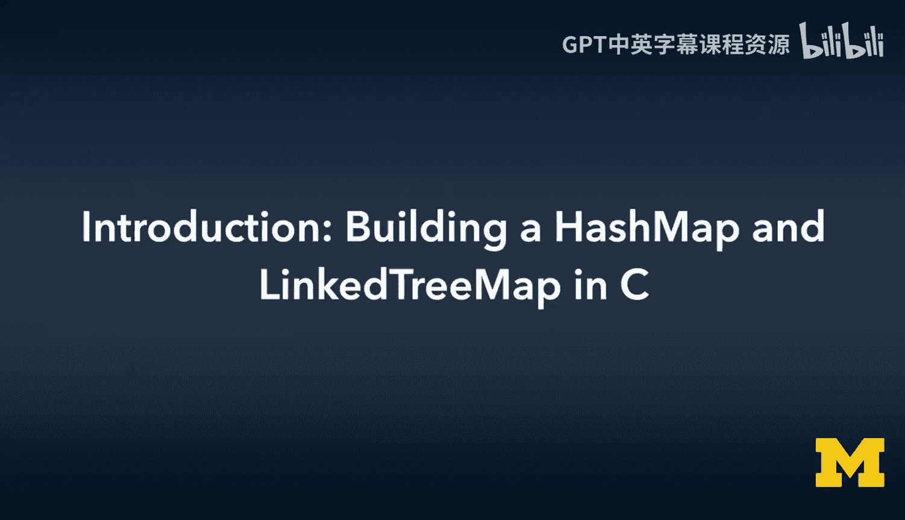
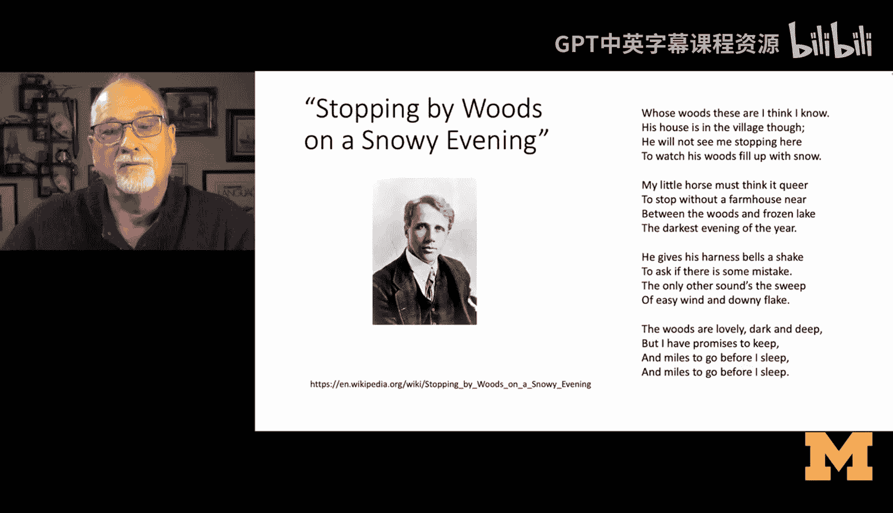
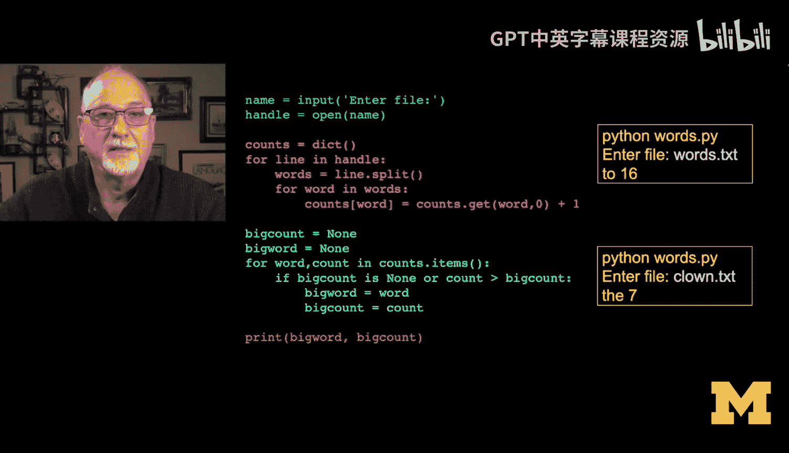
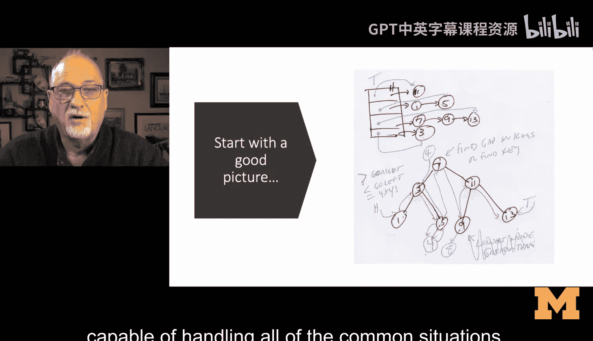
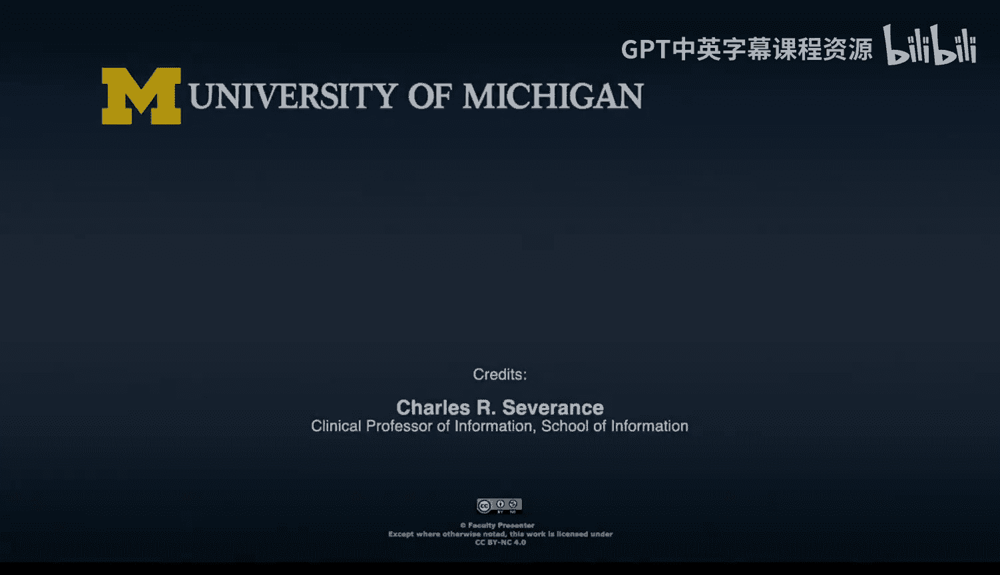
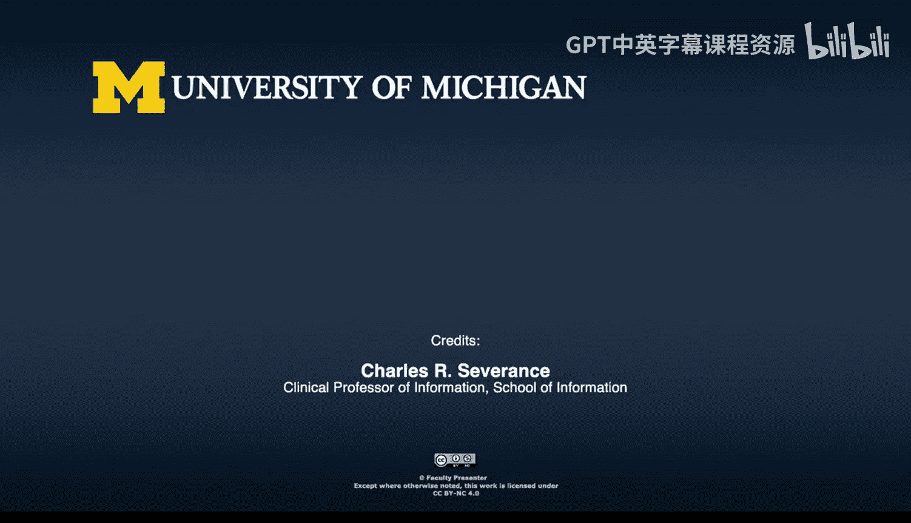

# C语言编程：第15章：构建哈希映射与树映射



## 概述

在本节课中，我们将学习如何在C语言中实现两种重要的数据结构：哈希映射和树映射。我们将从回顾已构建的映射抽象和链表实现开始，然后分别构建基于哈希表和二叉搜索树的映射实现。课程最后，我们将用C语言重写一个经典的Python词频统计程序作为综合应用。



---

## 回顾：映射抽象与链表实现

上一节我们介绍了映射（Map）的抽象概念，并创建了一个基于链表的映射实现。映射是一种存储键值对（Key-Value Pair）的数据结构，它允许我们通过键来高效地插入、查找和删除对应的值。



我们之前构建的链表映射是一个有序映射，其迭代器会按照键插入的顺序返回元素。然而，链表在查找效率上存在局限，平均时间复杂度为O(n)。

---

## 哈希映射（Hash Map）简介

本节中我们来看看哈希映射。哈希映射通过一个哈希函数将键映射到一个固定大小的数组（通常称为“桶”或“buckets”）的索引上。每个数组元素指向一个链表，用于处理哈希冲突（即不同键映射到同一索引的情况）。

其核心思想可以用以下伪代码描述：
```
index = hash_function(key) % array_size
bucket = array[index]
在 bucket 对应的链表中查找或插入键值对
```

哈希映射的平均查找、插入和删除时间复杂度可以接近O(1)，前提是哈希函数分布均匀且桶的数量足够。

以下是实现哈希映射的关键步骤：

1.  **设计数据结构**：需要定义表示整个哈希表的结构、桶的结构以及链表的节点结构。
2.  **实现哈希函数**：需要一个函数将任意键（如字符串）转换为一个整型哈希值。
3.  **处理冲突**：通常采用链地址法，即每个桶存放一个链表。
4.  **实现基本操作**：包括插入（`put`）、查找（`get`）和删除（`remove`）。

---

## 树映射（Tree Map）简介

接下来，我们将探讨树映射，特别是基于二叉搜索树（BST）的实现。在树映射中，键值对按照键的顺序存储在树节点中，这使得它可以高效地进行范围查询和有序遍历。

树映射的核心是二叉搜索树性质：对于任意节点，其左子树中所有节点的键都小于该节点的键，其右子树中所有节点的键都大于该节点的键。

查找和插入操作的平均时间复杂度为O(log n)，但在最坏情况（树退化成链表）下会变为O(n)。更高级的实现（如AVL树、红黑树）可以保证平衡，从而维持O(log n)的性能。

实现树映射的挑战在于维护树的平衡以及正确地在插入和删除时更新节点间的链接（`left`, `right`, `parent`指针）。正如我在构思代码时所画的草图，需要仔细追踪“比当前键大的最小节点”和“比当前键小的最大节点”来找到正确的插入位置并维护树的结构。

---

## 给初学者的建议

学习实现这些数据结构时，请记住以下几点：

*   **从理解开始**：确保你完全理解哈希表和二叉搜索树的基本概念。
*   **动手画图**：在编码前，在纸上画出数据结构的图示和操作流程（如插入一个节点），这能极大帮助理清逻辑。
*   **接受调试过程**：第一次就写出完美代码的概率很低。使用调试工具或打印指针地址（`%p`）来跟踪程序状态是正常且必要的学习过程。
*   **利用测试**：课程提供的测试程序就像是单元测试，能系统性地验证你的实现是否正确处理了各种边界情况。
*   **重在理解**：目标是理解原理和实现过程中的挑战，而不是简单地复制代码。克服一两个错误并修复它们，对于深入理解至关重要。

---

## 课程终点与起点

现在，我们来到了本课程的尾声。回顾整个学习历程，就像我们最初在《Python for Everyone》中看到的那段词频统计代码一样——它通过字典（一种哈希映射）优雅地解决了问题。



作为本课程的收官之作，我们将用C语言重新实现那个经典的词频统计程序，但这次使用的是我们自己构建的哈希映射或树映射。这标志着一段学习里程的结束，同时也象征着你在系统编程和数据结构理解上新征程的开始。

---

## 总结





本节课中我们一起学习了：
1.  **回顾了映射抽象**和已有的链表映射实现。
2.  **深入探讨了哈希映射的原理与实现步骤**，它通过哈希函数实现高效访问。
3.  **介绍了树映射的概念**，特别是基于二叉搜索树的实现，它维护了键的有序性。
4.  **提供了实现复杂数据结构时的实用建议**，强调了画图、调试和通过测试理解的重要性。
5.  **预告了课程的综合实践**——用自建的C语言映射数据结构重现代码词频统计，将理论知识与实践应用完整结合。