# C语言编程：39：使用二叉树作为数据结构

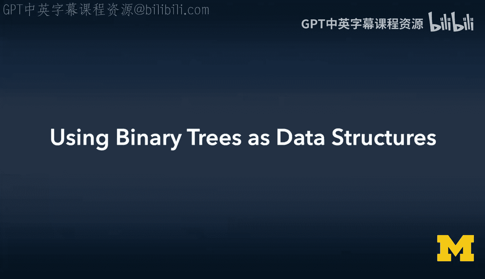

## 概述
在本节课中，我们将学习如何使用二叉树来实现一个高效、有序的键值存储结构——树映射。我们将探讨二叉树的基本概念、插入与查找操作，并最终将其与链表结合，构建一个支持快速查找和有序迭代的复合数据结构。

---

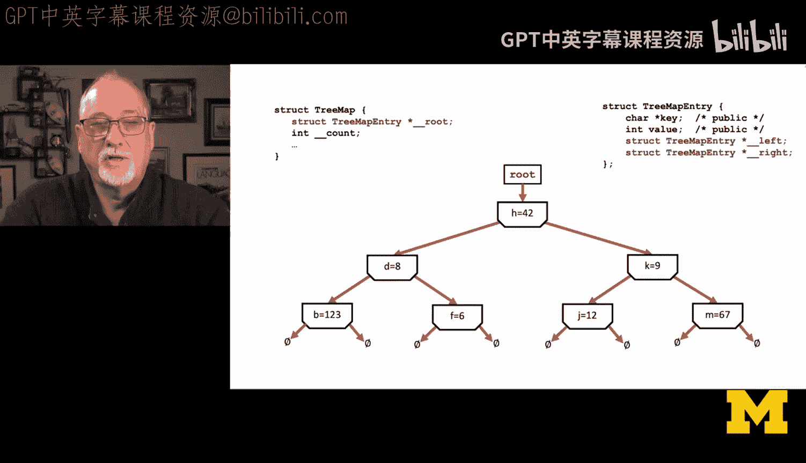

## 什么是二叉树？🌳

上一节我们介绍了基础的键值存储结构。本节中，我们来看看一种更高效的数据结构——二叉树。

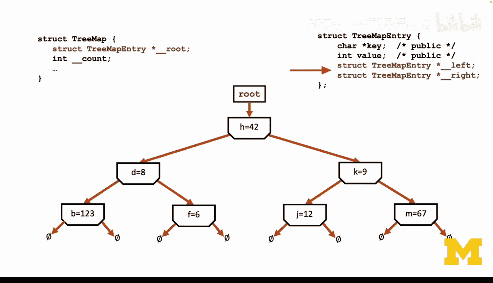

二叉树是一种数据结构。在树映射中，每个条目包含一个左指针和一个右指针。键值较小的条目位于当前节点的左侧，键值较大的条目位于右侧。例如，如果根节点是 `H=42`，那么键 `A` 会放在左侧，键 `T` 会放在右侧。

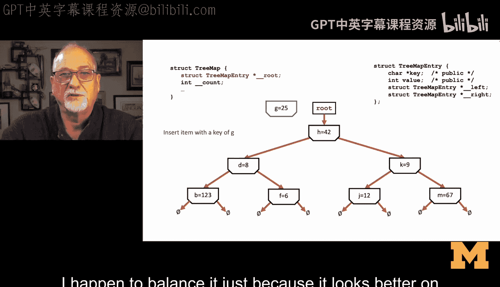

与链表拥有头尾节点不同，二叉树有一个根节点。根节点是树的顶端，从它开始，通过一系列左或右的选择可以遍历整棵树。每个树映射条目包含一个键值对，并且我们将其键和值设为公开，因为它只是一个条目。条目中没有“下一个”指针，取而代之的是左指针和右指针。我们通过抽象，只向用户提供一组操作树映射的方法，而隐藏内部使用左右指针的实现细节。

以下是树映射条目的基本结构概念：
```c
struct TreeMapEntry {
    char* key;
    int value;
    struct TreeMapEntry* left;
    struct TreeMapEntry* right;
};
```

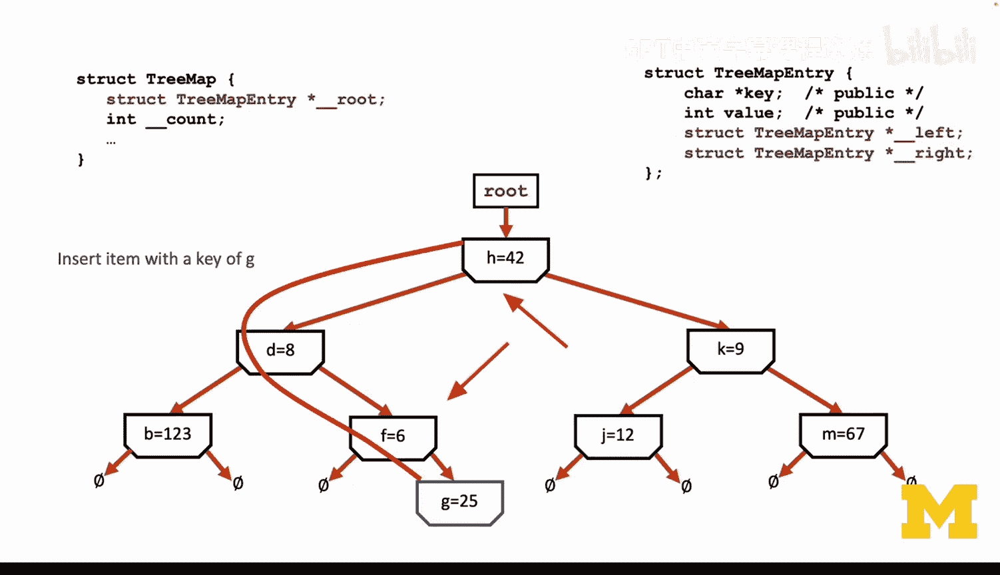

---

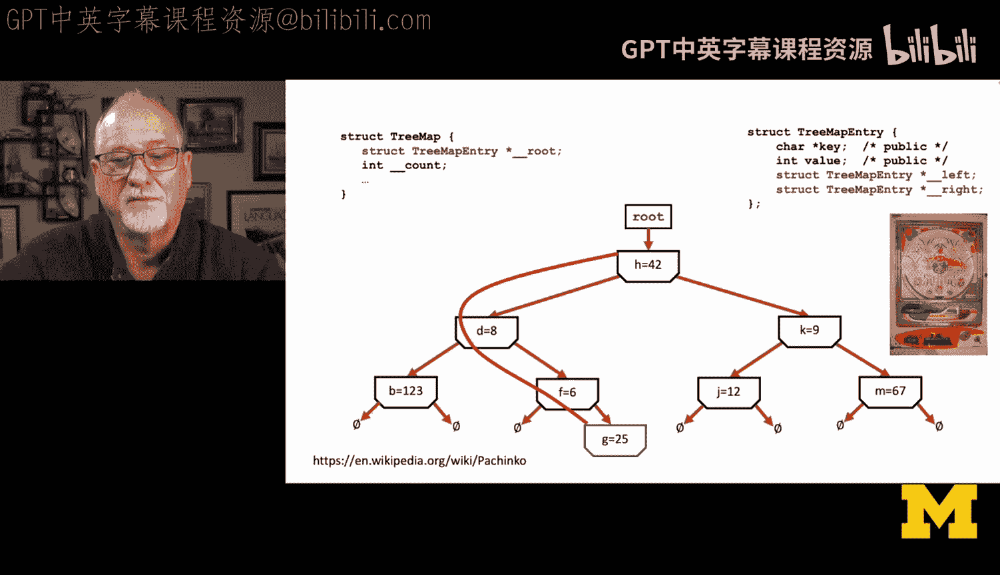

## 二叉树的插入操作

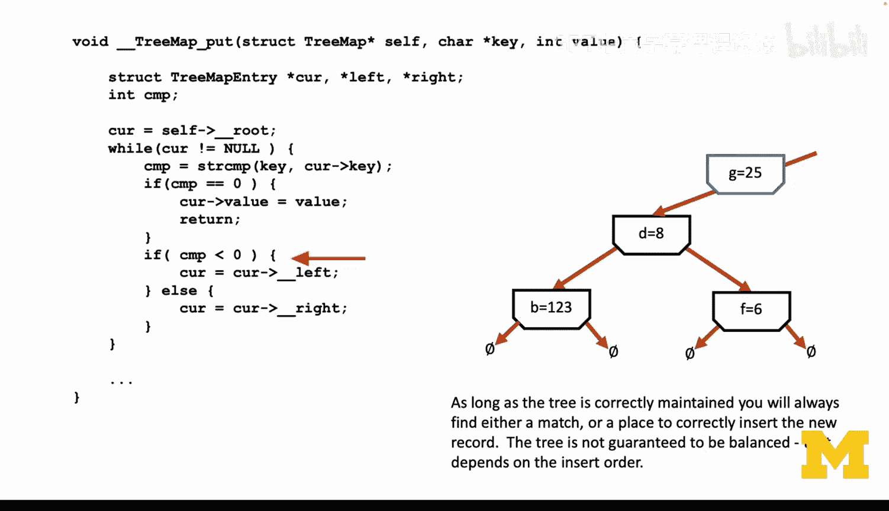

理解了二叉树的结构后，我们来看看如何向其中插入新的键值对。

插入操作的过程如下：从根节点开始，将要插入的键与当前节点的键进行比较。根据比较结果，决定向左子树或右子树移动，直到找到合适的插入位置或发现键已存在。

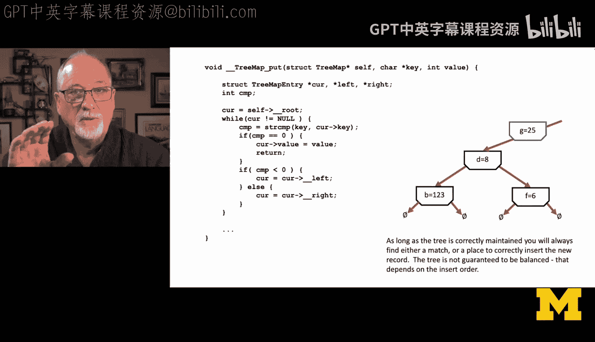

例如，假设我们有一个已构建的树（为了演示清晰，它被设计为平衡的），现在要插入 `G=25`。
1.  从根节点 `H` 开始。`G < H`，因此向左移动。
2.  到达节点 `D`。`G > D`，因此向右移动。
3.  到达节点 `F`。`G > F`，因此再次向右移动。
4.  此时，`F` 的右侧为空，这正是插入 `G` 的位置。

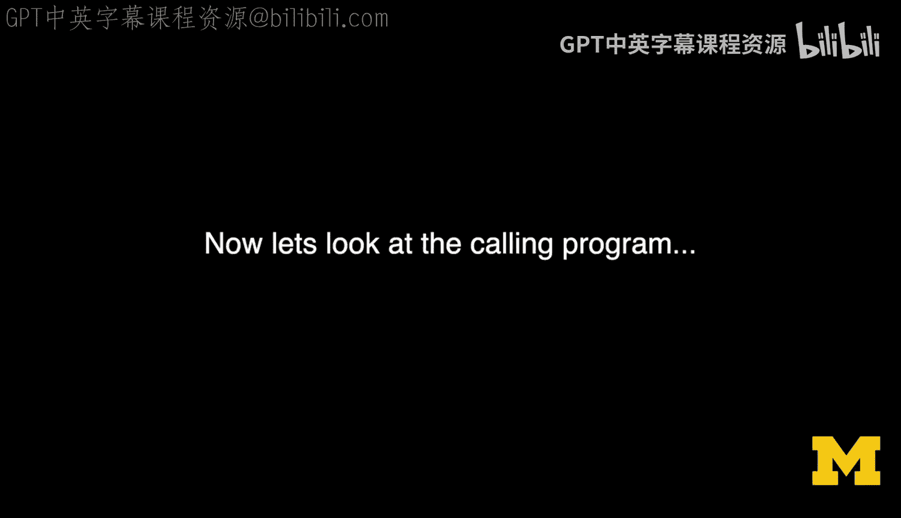

这个过程就像在弹珠机中，弹珠从顶部落下，根据一系列精确的左/右决策，最终到达底部某个位置。通过遵循这个算法插入，树能始终保持正确的键序。

以下是插入算法的核心逻辑描述：
```
如果 当前节点为空:
    在此位置创建新节点
否则 如果 待插入键 < 当前节点键:
    递归地向左子树插入
否则 如果 待插入键 > 当前节点键:
    递归地向右子树插入
否则: // 键相等
    更新当前节点的值
```

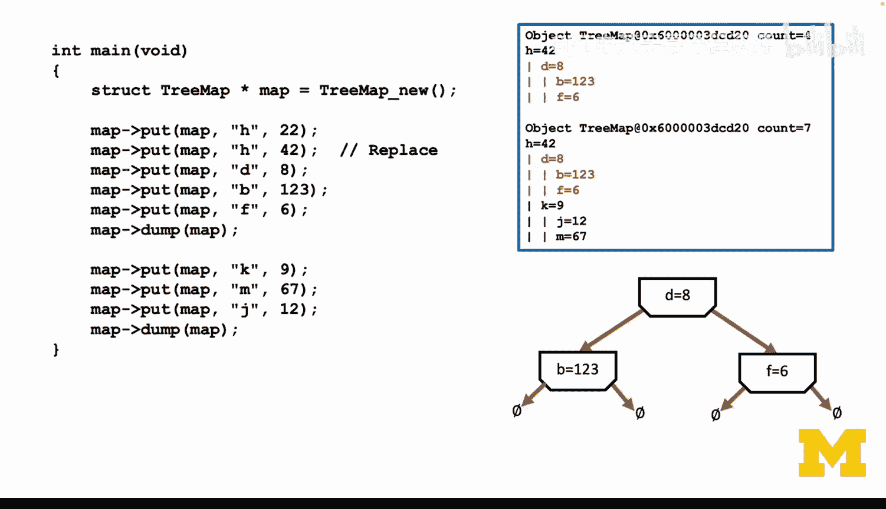

---

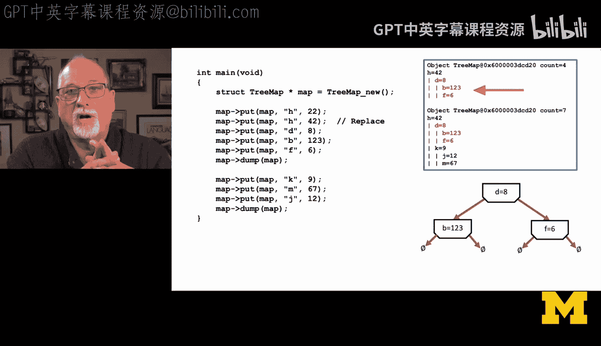

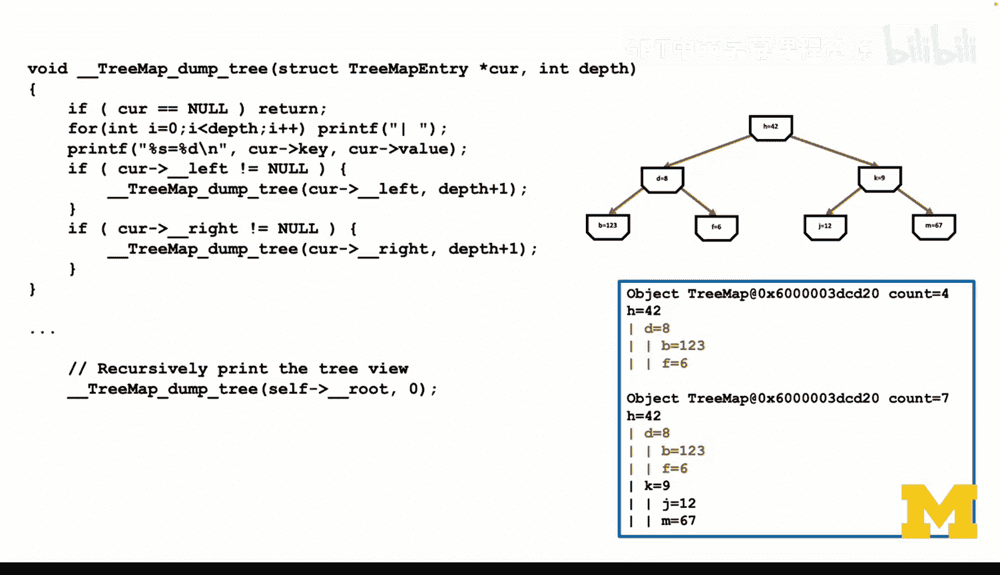

## 树的遍历与调试输出

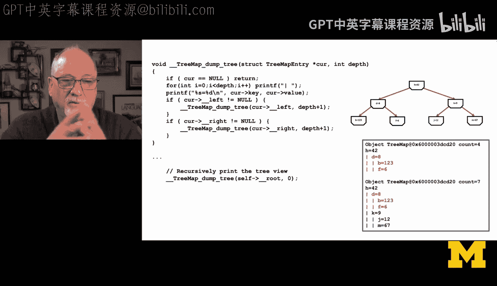

为了验证树的结构是否正确，一个有效的调试方法是实现一个能可视化树结构的输出函数。

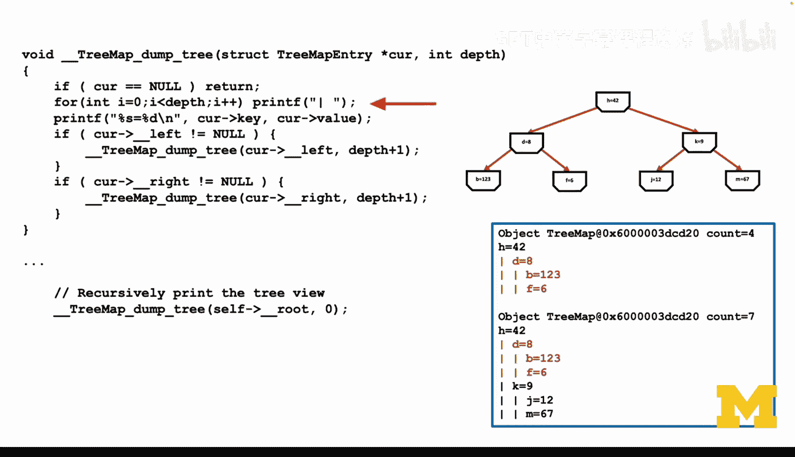

我们可以使用递归来实现树的深度优先遍历，并打印出带有缩进的结构。递归非常适合处理这种具有自相似结构的问题。如果不使用递归，可能需要手动维护一个栈，这会复杂得多。

`dump` 函数的工作原理是：
1.  接收一个当前节点指针和当前深度。
2.  如果当前节点为空，则返回（递归的终止条件）。
3.  根据当前深度打印相应数量的缩进（如竖线和空格），然后打印当前节点的键值对。
4.  递归地调用自身处理左子树（深度+1）。
5.  递归地调用自身处理右子树（深度+1）。

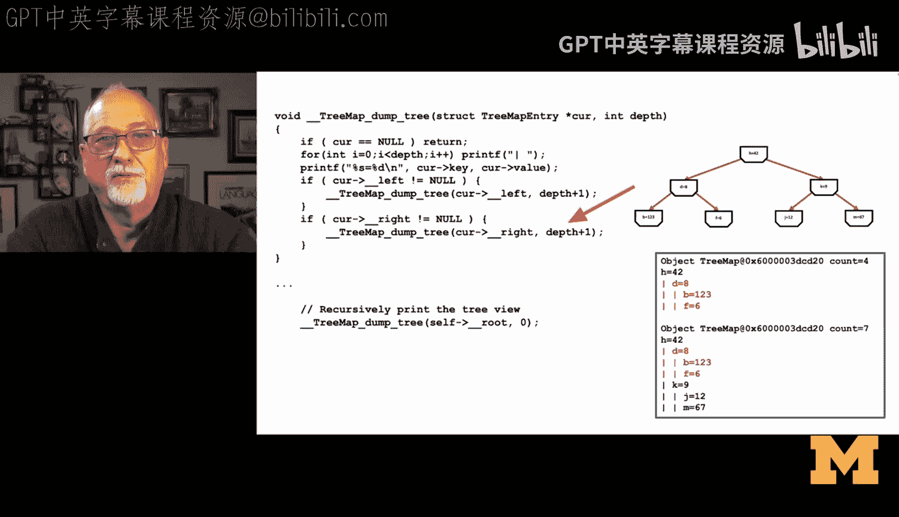

这种遍历顺序被称为“中序遍历”（左-根-右），它能以排序的顺序输出键。在调试时，先确保 `dump` 函数正常工作至关重要，这样你就可以通过观察输出来验证其他操作（如插入）是否正确。

---

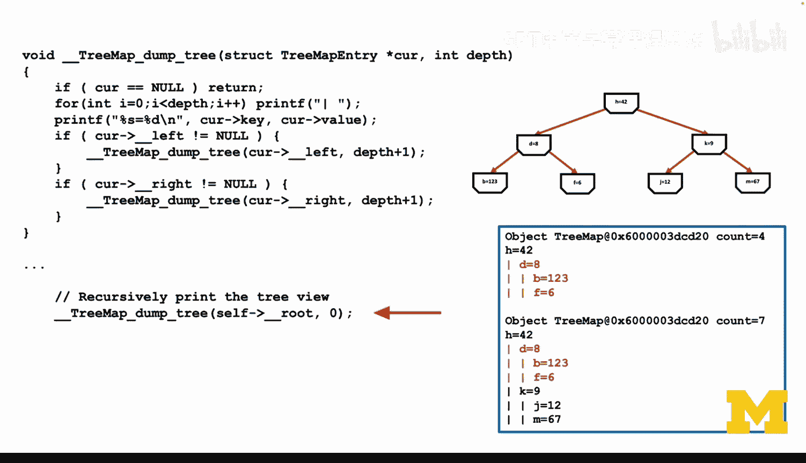

## 二叉树的查找操作

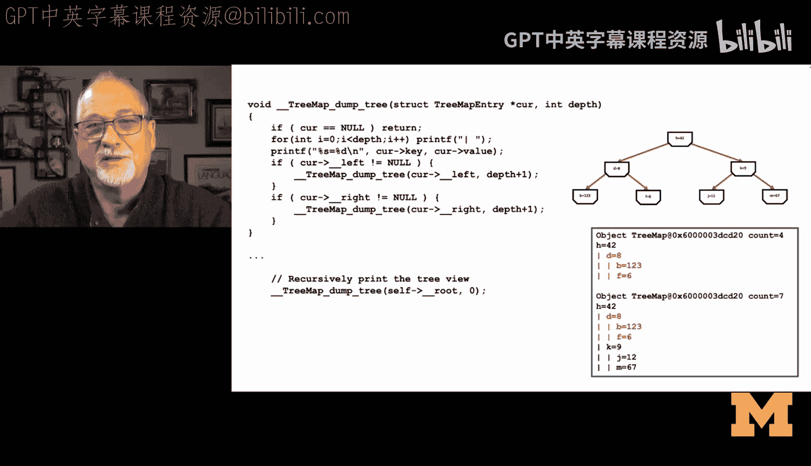

插入之后，另一个核心操作是根据键快速查找对应的值。

查找操作的逻辑与插入类似，但更简单：
1.  从根节点开始。
2.  将目标键与当前节点的键比较。
3.  如果相等，返回当前节点的值。
4.  如果目标键更小，则进入左子树继续查找。
5.  如果目标键更大，则进入右子树继续查找。
6.  如果到达空节点（`NULL`），说明键不存在，则返回一个预设的默认值。

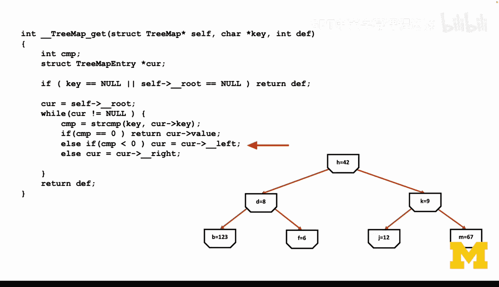

这种查找方式非常高效。在平衡的二叉树中，查找的时间复杂度为 O(log n)，因为每次比较都能排除大约一半的子树。以下代码片段展示了查找的核心循环：
```c
while (current != NULL) {
    cmp = strcmp(target_key, current->key);
    if (cmp == 0) {
        return current->value; // 找到
    } else if (cmp < 0) {
        current = current->left; // 向左
    } else {
        current = current->right; // 向右
    }
}
return default_value; // 未找到
```
这种设计的美妙之处在于，用户可以通过传递不同的默认值来灵活处理键不存在的情况。

---

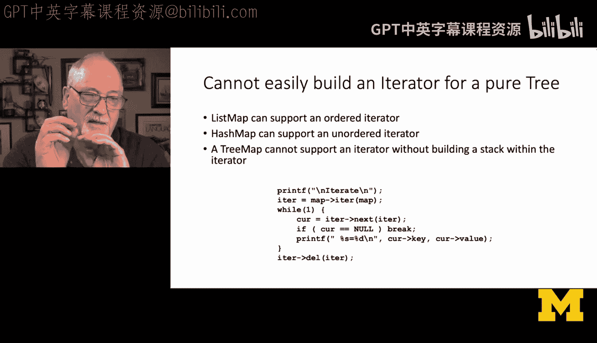

## 结合链表以支持迭代

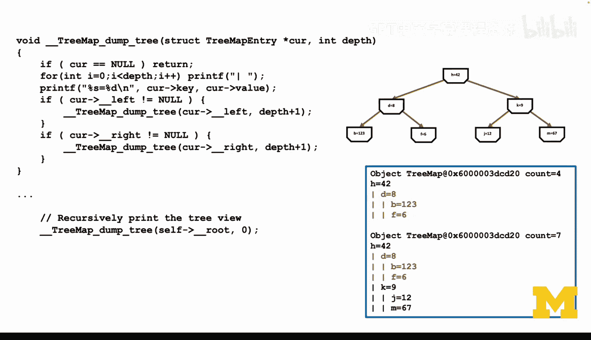

虽然二叉树在查找和插入方面表现优异，但为其构建一个迭代器来顺序访问所有元素却比较麻烦。问题在于，遍历树需要跟踪“当前”位置，而树结构中的“当前”是隐含在递归调用栈中的。要构建迭代器，必须显式地维护一个栈来记录访问路径，这增加了复杂性。

为了解决这个问题，我们采用一个常见技巧：组合数据结构。我们将为每个树节点同时添加指向前后节点的指针（`prev` 和 `next`），从而在维护二叉树的同时，也维护一个有序的双向链表。

*   **树层**：使用 `left`、`right` 指针和 `root` 根节点进行快速的查找和插入。
*   **链表层**：使用 `prev`、`next` 指针和 `head` 头节点来支持高效、简单的顺序迭代。

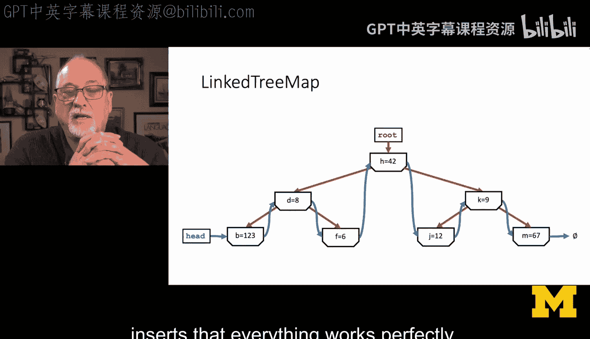

这样，`TreeMap` 结构体将同时包含 `root` 和 `head`。插入新节点时，我们利用二叉树快速找到其正确位置，同时更新链表指针，将其插入到链表的相应位置。最终，我们得到一个既能进行 O(log n) 快速查找，又能像链表一样轻松进行顺序迭代的“链式树映射”。

---

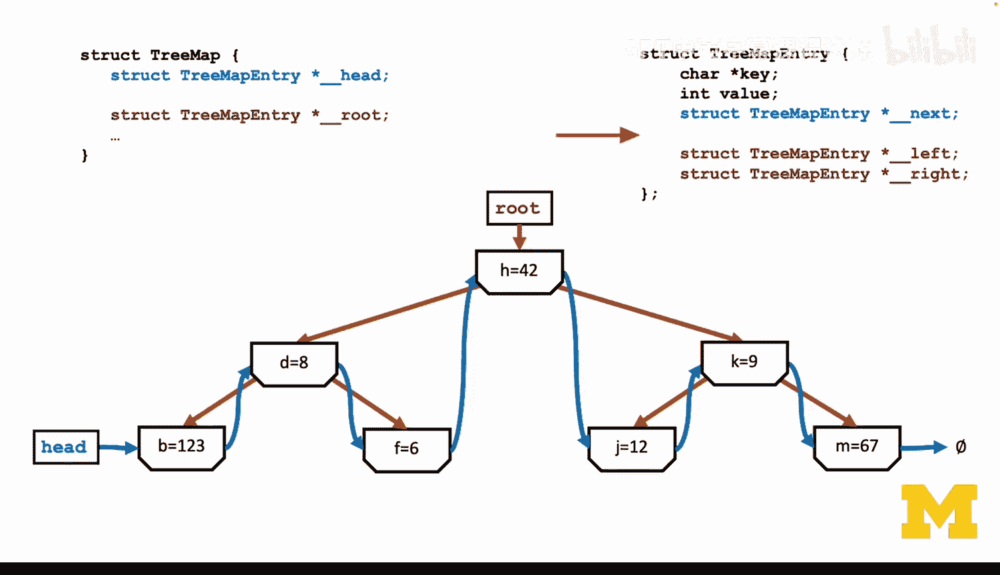

## 总结


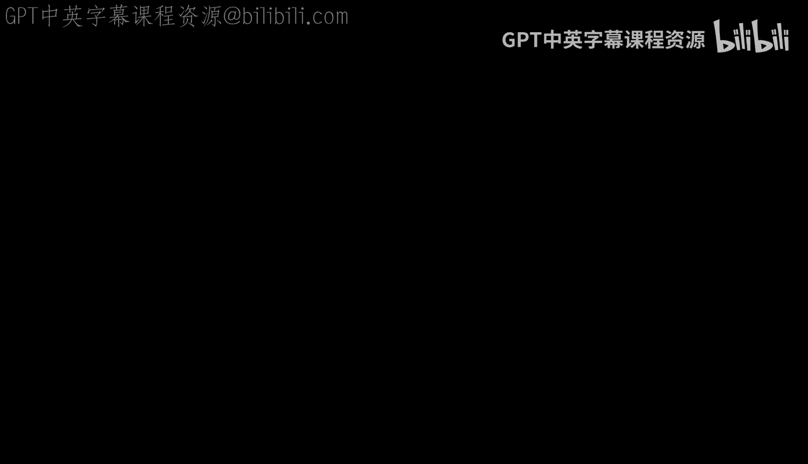

本节课中，我们一起学习了二叉树作为数据结构的核心应用。我们首先了解了二叉树的定义和插入、查找的基本算法。接着，我们探讨了如何使用递归来遍历和调试树结构。然后，我们指出了纯二叉树在支持迭代器方面的不足，并引入了将二叉树与双向链表相结合的精妙设计。这种“链式树映射”复合数据结构，兼具了二叉树查找高效和链表迭代方便的优点，是实现有序字典的一种强大方式。在接下来的课程中，我们将具体实现这个复合数据结构的插入代码。