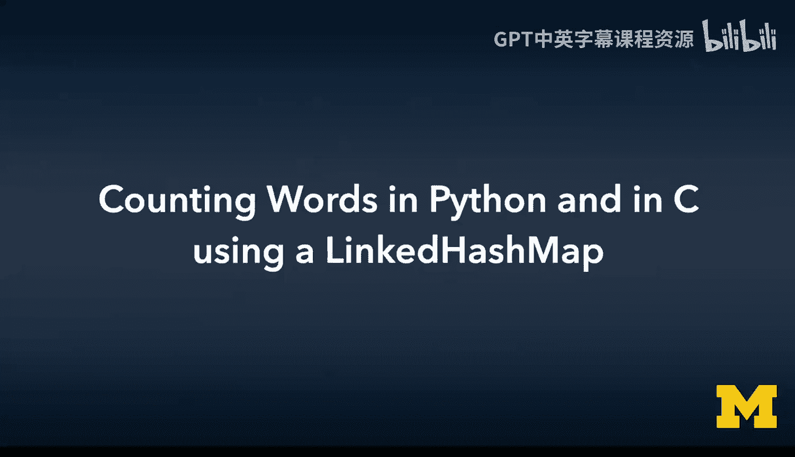
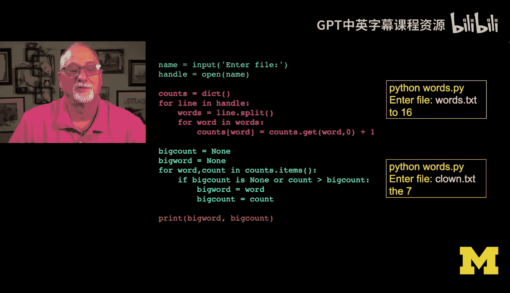
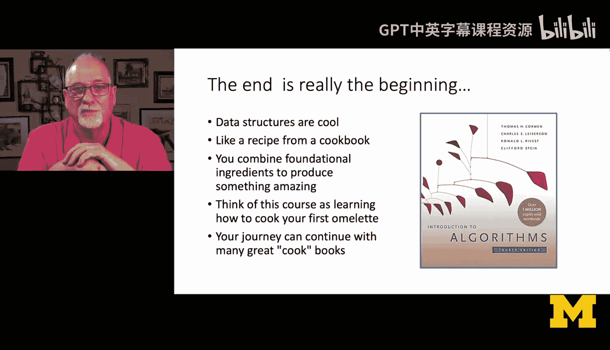
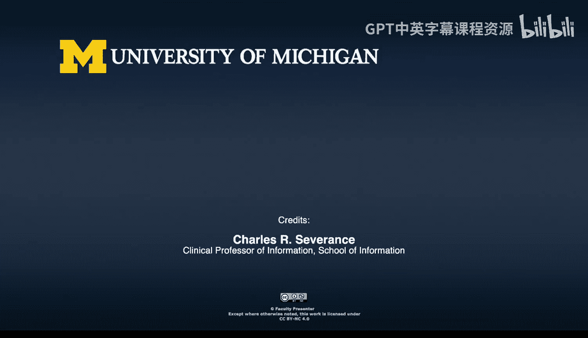
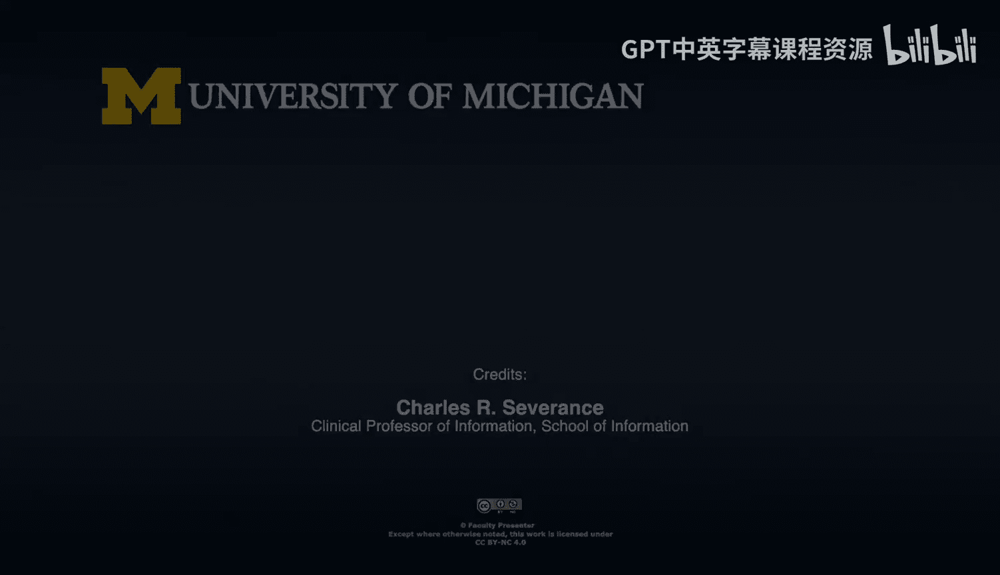

# 密歇根大学《给所有人的C语言编程课》：第41课：使用链式哈希映射在Python和C语言中统计词频 📊

在本节课中，我们将回顾整个课程的旅程，并回到最初的起点。我们将重温在《Python for Everybody》课程中展示的第一个程序——统计文件中出现频率最高的单词。这次，我们将使用C语言和本课程中构建的树形映射数据结构来实现相同的功能，以此展示从Python到C的编程思维转换，并巩固对核心数据结构的理解。

## 概述

这是一段相当漫长的旅程。我们使用C语言构建了一个完整的面向对象模式，回顾了面向对象编程，并实现了多个不同的Python对象。通过这种方式，我们理解了C++、Java和Python等语言在底层是如何工作的。现在，我们即将结束对所有精彩数据结构的探索。

在课程的最后，我喜欢做的一件事是回到最初。有些同学可能是从《Python for Everybody》这门课开始接触编程的。现在，我想通过重温那门课中展示的第一个程序来结束本课程。

## 重温Python的起点

这个程序来自《Python for Everybody》的第一章。这是一个统计文件中出现频率最高单词的示例。

以下是Python版本的代码逻辑：
*   读取一个文件名。
*   创建一个字典。
*   读取所有行并分割成单词。
*   遍历所有单词，使用 `counts.get(word, 0)` 来获取当前计数（如果单词不存在则默认为0）。
*   将计数加1后存回字典。
*   最后，通过一个简单的最大循环（max loop）遍历字典项，找出出现次数最多的单词及其计数并打印出来。

## 在C语言中实现

现在，我们将使用本课程中构建的树形映射代码来实现相同的计数功能。

以下是实现步骤：

首先，我们需要进行变量和结构的初始化。
*   创建一个树形映射对象作为我们的“字典”。
*   声明树形映射条目和迭代器，用于后续遍历。
*   创建字符数组来存储文件名和单词（注意：这里使用固定大小的数组，在实际应用中需注意缓冲区溢出风险）。
*   声明循环变量 `i`、`j`，以及用于记录最大值的 `count`、`max_value` 和 `max_key`。

接下来是文件读取和单词处理的核心逻辑。
*   使用 `scanf` 获取文件名，然后使用 `fopen` 以读取模式打开文件。
*   使用 `fscanf` 循环读取文件中的每一个单词（格式符为 `%s`）。
*   对每个读取到的单词，调用 `to_lower` 函数将其转换为小写。
*   在单词末尾小心地添加字符串结束符 `\0`。
*   使用 `MapGet` 函数从映射中获取该单词的当前计数（类似于Python中的 `get` 方法，默认值为0）。
*   使用 `MapPut` 函数将单词和（计数+1）存回映射中。
*   处理完文件后，关闭文件句柄。

最后是找出出现频率最高单词的步骤。
*   初始化 `max_key` 为 `NULL`，`max_value` 为 -1（因为计数都是非负整数，所以-1可以作为初始值）。
*   获取映射的迭代器，并进入一个无限循环。
*   在循环中，使用迭代器获取下一个条目。如果条目为 `NULL` 或迭代完成，则跳出循环。
*   如果当前条目的值大于或等于当前的 `max_value`，则更新 `max_key` 和 `max_value`。
*   循环结束后，释放迭代器。
*   打印出出现频率最高的单词（`max_key`）及其出现次数（`max_value`）。
*   最后，删除整个映射对象以释放内存。

## 总结与展望

本节课中，我们一起学习了如何将Python中简单的词频统计程序，用C语言和自定义的树形映射数据结构重新实现。这标志着一段漫长旅程的结束，但更是一个新的开始。

这些是最基础的数据结构，也是经典的数据结构，它们源自《算法导论》（CLRS）等经典著作，是四十多年来人们一直在学习的核心内容。掌握这些数据结构就像掌握了烹饪中的煎蛋卷，看似简单，但却是理解更复杂、更高级算法和系统的基础。它们是构建一切复杂程序的基石。

如果你已经认真完成了本课程的所有练习并掌握了这些内容，那么你的编程之旅可以继续向前。你可以打开像《算法导论》这样的大部头著作，从任意一章开始，无论是Dijkstra算法、Alpha-Beta剪枝还是其他任何算法，你都有能力去理解它，并用C语言实现它。因为你已经掌握了如何分配内存、创建包含指针的结构体以及如何释放它们。

本课程的目标不是教你这本书里的每一个算法，而是教你什么是算法，以及所有算法赖以构建的基础模块是什么。我祝愿你们好运，并鼓励你们在编程的道路上继续前行。你的旅程并未结束，它才刚刚开始。