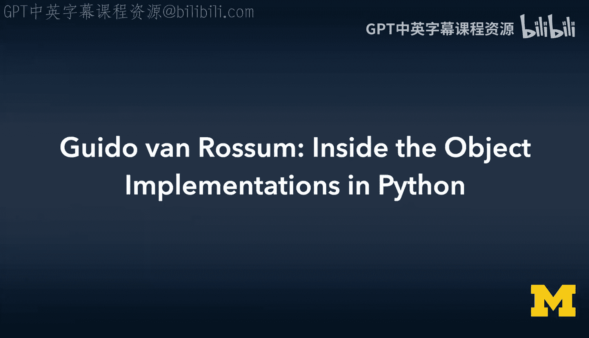
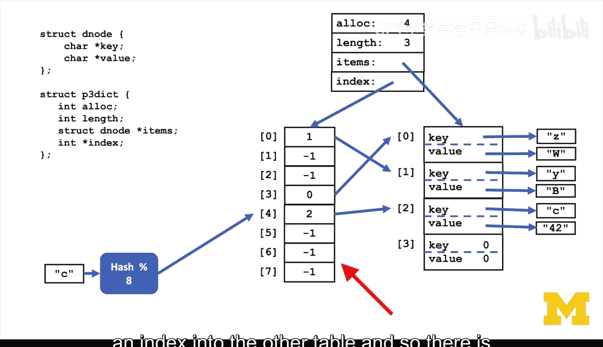
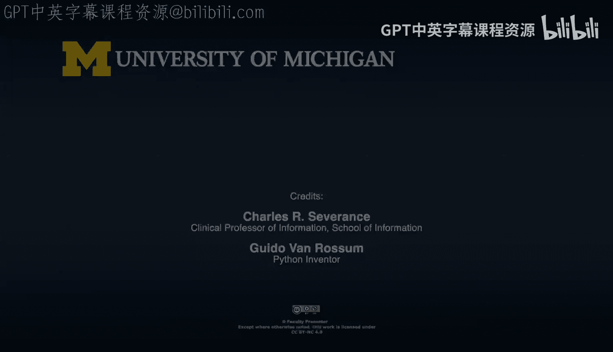
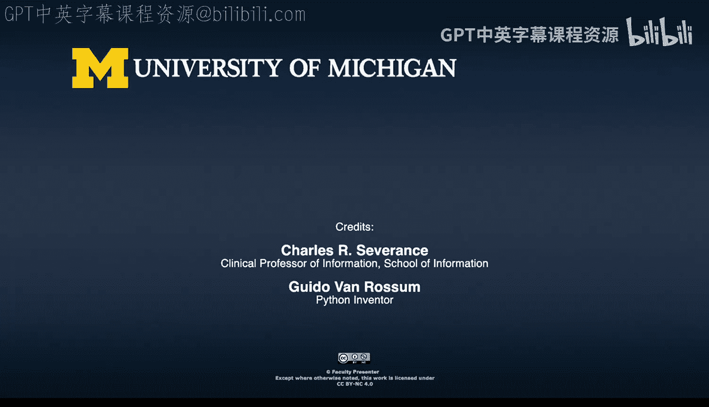

# 密歇根大学《给所有人的C语言编程课（了解C、用C编程、数据结构、创建对象）｜C Programming for Everybody》 p43 22_06_02_Guido-van-Rossum-Python内部对象实现解析.zh_en -BV1v2421P7pt_p43-

Where in the Python 0，0，1。Did you start building？The objects。

And where the objects come first and then a syntax came， or did you build a syntax？

And then the objects。I think。In my head， I had both。Because I。

I was building a stripped down version of ABC。And I had sort of。

 I was very familiar with how ABC implemented its data structures。

And I had pretty well developed ideas about how。How I would do it instead of the ABC way。

Both for the syntax and for the data structures。So for the syntax， actually。

My main gripe about ABC was that。诶。It used uppercase letters for the keywords of the language。

 They had a reason for that， but。I didn't think it was a good reason， and it just looked horrible。

To a ex hacker like myself。So that's what I wanted to change for the syntax。

But I knew that I wanted to do the indentation， and I had already。Participated in the parser for ABC。

 so I knew how to do that stuff， I had some of my own ideas， but I knew what I wanted。I。

 I literally actually started with。A parer。And actually， that I started with Alexa and a parser。

 those were actually the first bits of the language that I wrote。Before I started。

 I knew I had very specific ideas on how the primitive data types would be implemented。

 I would use the same reference count mechanism that I knew well from ABC。呃。I would implement。

Integers in a similar way because I want it。That would be teachers would be an easy choice not to。

Put in the object。Yeah， no， I sort of， I wanted everything to be an object that was also a thing I approved of about ABC。

And think I have to take it back about the arbitrary precision integers。Those came quickly。

 but I don't think that they came immediately。There was。There was an integer type which was 32 bits。

 there was a separate long type which survived until the end of Python 2。

 which was arbitrary position and there was a flow type。

Then for the sort of more complex data structures。And sort of the numeric types were not all that different or interesting not that different from ABC。

But for the rest。I sort of had seen what ABC did， which was that everything was implemented as a tree。

 even strings。And I did not like that because I wanted to interface with system calls and C libraries。

 and I said。I want strings to be arbitrary length。But I want them to be a linear buffer。

And so too bad if a long string sort of。Requires allocating a large buffer at once。

Most strings aren't that long， I'll make sure that it works for any size but。

I'll optimize for the short strings that are the bread and butter of so many programs I imagine would be written in Python。

That is a brilliant choice， but not automatic or intuitive， that that would be the right answer。

Having， having sort of。Britten a lot of C code and。

 and knowing that I wanted Python to be extensible with C， That was also one of the。

 the very early choices。 I， I wanted to， to sort of。Link back to C code。In a natural way。

 So the sort of the import system was part of that。 So Python was a month old。

Or maybe two months old， if you were upending to a string and a loop。Was it basically extending。

Reallocating and copying No， strings were always immutable。 So sorry， yes， it was， it was allocate。

 whether it was calculating the size of the result。

 allocating a new string object and then copying the two originals into that There is a string resize internal operation that is sort of。

Intended to be only used when you're building up a string before you've shown it to anyone else。

And I needed that because I was envisioning an IO system where you say， oh。

I'm going to read a line and I don't know how long that line is going to be。

 or maybe I'm going to slurp an entire file into a single string and I don't know how long that file is。

So I'm allocating a large enough buffer。I'm reading into that buffer and then if it turns out that I allocated  a thousand00 bytes。

 but what I read was only 15 bytes， I reallocated to give a sort of remaining 85 or whatever 900 bytes about your thinking before you release the very first version of Python。

 meaning you didn't like at some point you came back from vacation and you handed it to somebody at work。

This is your thinking。When there's only one person。Before even the 0。01 Oh yeah， yeah。

 I sort of I wanted strings to be done that way。Including like the little detail that if you have a string of。

Say 10 bytes， you allocate 11 bytes and you put a no byte at the end。

Just so that if you happen to want to pass that string to a C library function that expected zero terminated strings。

 no by terminated strings。You wouldn't have to copy it。😡，There might be a no bitete in the middle。

 so things might still go wrong。If you sort of knew or trusted that that wasn't the case。

 you wouldn't have to。Make a copy with one extra byte just to make sure that that Nobte was there。

 the nobte is part of the data structure， only of course visible on the seaside。So for lists。

 I had a similar idea， again， lists in。In ABC were a tree structure that was。Sort of super efficient。

 even if you grew a very large list from small ones。

And I thought the three structure was way too complicated， so I said， okay。

 list just a list is a mutable data structure， that was sort of a concept that didn't really exist in ABC in ABC everything was immutable。

 I thought well pragmatically speaking。I prefer my larger data structures。

 meaning lists and dictionaries to be mutable， and so the list was the implementation was always just。

A pointer to a buffer that that could be reallocated。 We call it list in Python。

 It really is an array that that is just is an array of pointers and each pointer points to an object。

 We know how long that array is， that's in the object header。 And so if there's no room。

 we reallocated。And if we throw something away from the middle。

 then we shift everything over and we also reallocate the only improvement that happened to that data structure。

In the last， well， let's say 34 years。Is that the original implementation did not have over allocation。

I was relying on relo doing some kind of chunking， so if you reloc something from 1000 bytes to 1004 bytes。

I imagine， well， internally， realloc probably aligns everything in in chunks of 16 by or more。

 And so it's not going to move that that memory and that sort of eventually that was。

Shown to be either false or just inefficient。E would do it as well as you would have done it。

But eventually， it didn'。 it didn't。 Yeah。 and， and so eventually they're sort of internally。

 there are two sizes that are held in the list object header。

One tells you what the length of the array is of the list is to the Python user and the other one tells you how much space there is in the array which and the second is always larger than the first and then I'm shocked that it was in the linked list。

Oh， really。 I am shocked。 Oh， I'm sorry。 named bs。呃。But okay， yeah。

 no I get what you're doing so then talk through as you build the earliest dictionary structure what's different between that So again。

 in ABC dictionaries were trees and in the case of dictionaries。

They were kept in sorted order by the key。 the key was always。Some。Orderable well， I think in ABC。

 everything was comparable。At least two things of the same type。And again。

 I thought that was too complex and I had。Skimmed at least Kuth volume 3。

 which explains the concept of hash tables。And I was familiar with hash tables in Pearl。

I wear I think they're cold hashes。And so I just sort of。

I leaf through the table of contents of Kuth volumee 3。

 and I picked a hashing algorithm and then and sort of a hash table organization that that felt right。

 And so I， I sort of， I chose open hashing instead of。

Sort of having separate linked lists for buckets。And the original hash algorithm for strings at least was something I don't know if I picked the hash function out of canoeve also。

 but I probably did。Between 5。37，5。3。8 dictionaries。Kap their order。啊啊。

Like what happened was it the revenge of ABC， you know。

 meaning that the treat no so it's a different kind of order in ABC， the keys were sorted。哎。

If you have numerics， if you have the 112 and 500 in your dictionary in ABC， at least。

The keys are ordered 1，12，500， or 1，2，3 or whatever。 and if you insert 11。

 it gets inserted between1 and 12。On the other hand。

 in the newer python dictionaries that preserve order。It is insertion order。

 so it is not me because the sort of。嗯。Python dictionaries don't require that the key type is sortable。

 is comparable， it only needs to be hashable。🤢，And so we can- well。

 and of course it needs to be you need to have an equality comparison。

Is this string equal to that string， but you never need to look at is this string less than that string？

So what did you do to make it keep insertion order？

So that was in a time when I had long relinquished or delegated development of most of the basic data types。

I think we had a developer in Japan who。Sort of for years had been improving the efficiency of the dictionary type。

And。Sort of one of the problems of the original design with openhahing that I picked from Kuth is that it's pretty space inefficient。

Because if you have。Let's see if I can reconstruct for each key value pair。You have to have。

APointer to the key。Let's be old fashioned and say that's four bys。You have a point or two the value。

 that's another four bytes， then you have the hash， which is another four bytes。

So now the hash table is an array ofstructs that are each 12 bytes long。

And for the hash table algorithm to the lookup and insertion and deletion algorithm to work at all。

You can't have the table be more than two/ third full。

So that means that if you have an array of a thousand entries。

You can store at most six or 700 key value pairs， and so you have three or 400。

Times 24 bytes wasted space。And so our。Japanese Cor devev。

Figured out a way to have separate tables where。The sort of the hash。Dable only contained。

One thing I and the actual key value pairs and hashes were kept in a。A table that had no holes in it。

 So they were basically like kind of growing， filling， remembering。

 everything is remembering where things are carried out。And so first， he stumbled upon sort of。

I think he refined the algorithm a few times having these separate arrays。

 and then he stumbled upon the property that， oh， hey。

 it happens to preserve insertion order in the second table for sure， right？

Exactly in the second table， because the sort of the table in which you jump around based on the hash value now just has。

An index into the other table。

And so there is an additional space saving because if your hash table has less than 256 elements。诶。

That array only needs to have one byte for the index。

And so there's like all kinds of cleverness there。It comes as a surprise to me that you don't do link lists。

 really， I could have told you that 10 years ago。But it doesn't do linkedless， you， I mean， I guess。

 and that has probably to do with your desire to interoperate the sea kind of just percollateates throughout it that blocks。

Llocks of things that can be extended， and then filled in。Seem to be better than yeah， generic in。

 What I didn't know at the time that that's also。A good architecture for modern hardware。

Because you have better cash locality， which is not a concept that I think I even knew existed in。

In 89。 so I think I just avoided linked lists because I didn't like them for some other reason。

 That's cool That's exactly what's not exactly what I hope you say I hope this over and over and over again because I just have assumed all my life linked lists are the you know linkeds and hash maps and linked lists on top of hash maps and link list link link list because computer science thinks about linked list all the time。

 There are plenty of pointers in Python but。But sort of the classic linked list is not used much。

🎼Yeah。Yeah。

