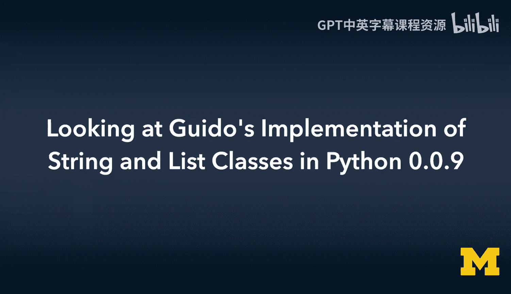
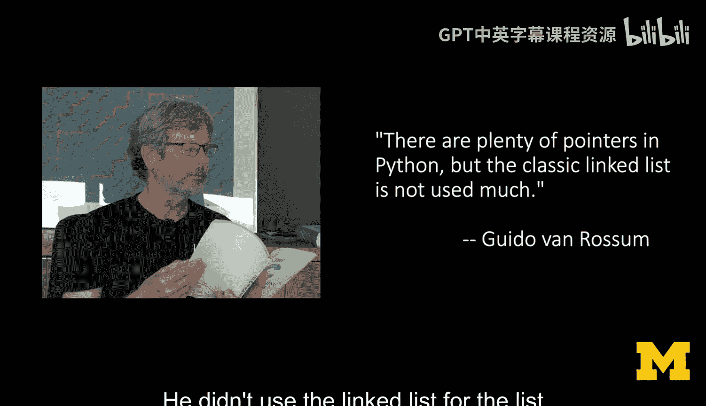
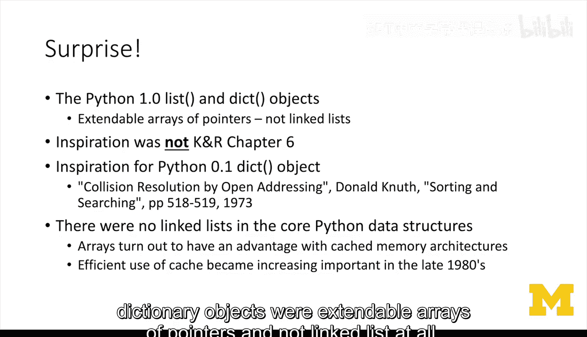
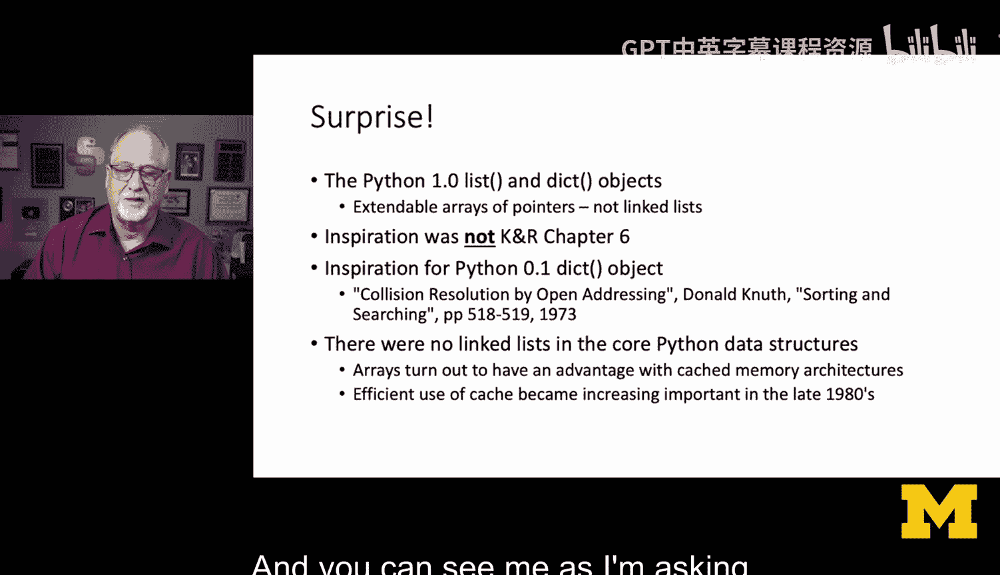
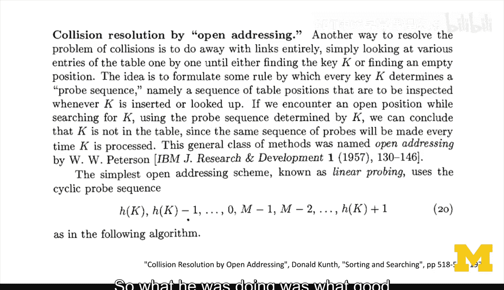
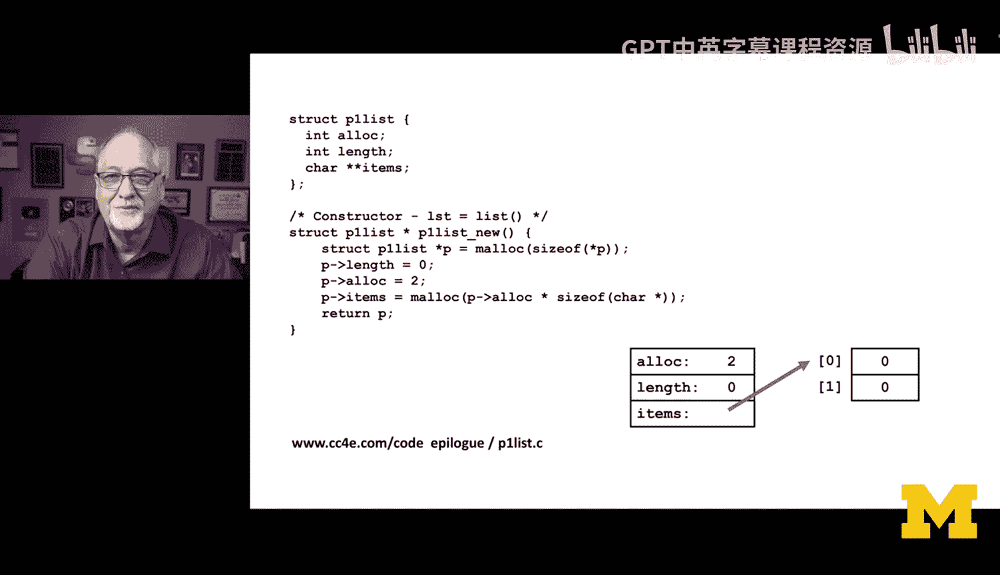
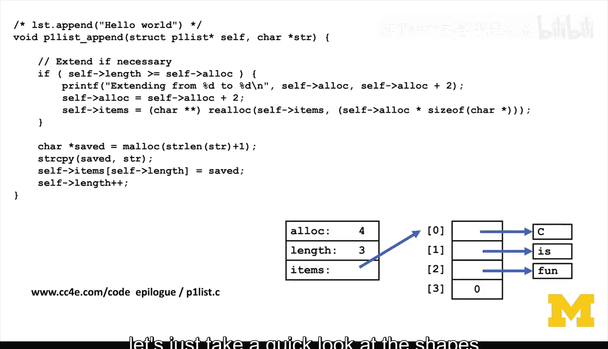
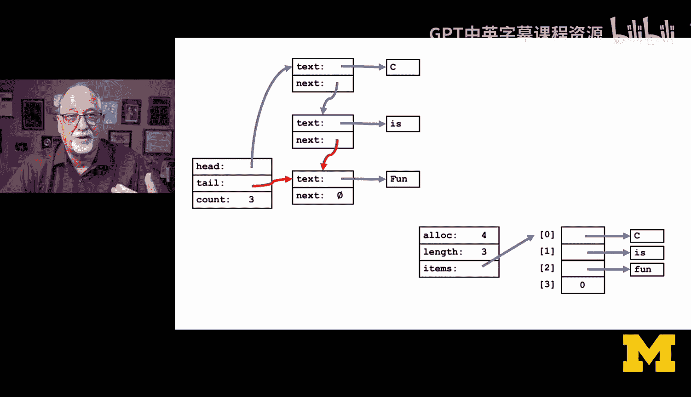
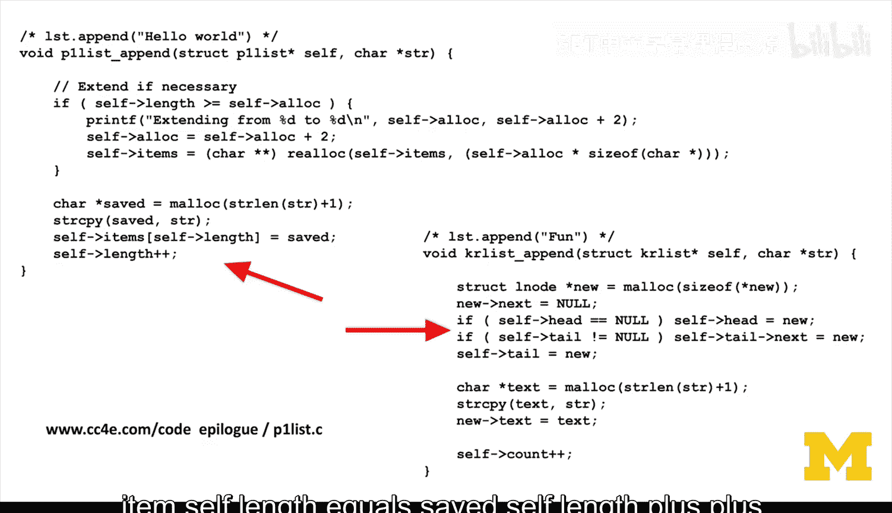

# C语言编程课：44：解读Guido在Python-0.0.9中的字符串和列表类实现



在本节课中，我们将深入探讨Python创始人Guido van Rossum在早期Python版本（0.0.9）中实现字符串和列表类的思路。我们将重点分析他为何没有采用经典的链表结构，而是选择了可扩展数组，并理解其背后的设计考量。

## 一个关键的认知转变



上一节我们介绍了数据结构的基础概念。本节中，我们来看看Guido在实现Python核心数据结构时所做的具体选择。



我希望你仔细观看了那段采访。我在编辑与杰出人物的访谈时，常做的一件事是，我提出的问题并非总是完美的。这时我通常会意识到，我的假设是错误的。

在编辑你刚刚观看的采访视频时，我并没有剪掉所有我困惑的部分。原因在于，我希望你能看到我那些被证明是错误的假设时刻。那时我正在脑海中快速思考，试图提出一个好问题，并寻求澄清。因此，在那段视频中，你可以看到我向Guido学习的过程。

总结来说，Guido**几乎没有使用链表**。他没有为列表对象使用链表，没有为字符串对象使用链表，也没有为字典对象使用链表。



这令人惊讶。我完全错了。Python 1.0的列表和字典对象是**指针的可扩展数组**，而根本不是链表。

## 设计灵感的来源



尽管Guido和我们大多数人一样，精通K&R（《C程序设计语言》）第六章的内容，但他实现数据结构时参考的并非此书。

他更近期的经验来自ABC语言和C++。更重要的是，他参考了ABC语言的数据结构实现方式，或者更具体地说，他审视了ABC的实现并认为其方式不佳。但他并没有因此就回头采用K&R第六章的方法。作为一名计算机科学家，我的直觉是：K&R第六章是金科玉律，为何不采用呢？

我认为他是从简单的**可扩展数组**开始的列表实现。这很有道理，因为你要么线性查找（这不是最快的方式），要么按位置查找（如 `list[5]`）。既然如此，为何不使用数组呢？一旦你和他交谈并听他解释，你就会明白：“哦，是的，我懂了，我懂了。”

## 字典也未使用链表

更令人惊讶的是，他甚至没有在字典中使用链表。你可以看到我在提问时难以置信的样子，仿佛在说：“请告诉我你在字典和哈希桶中使用了链表，就像过去35年所有面试题那样。”而答案是：没有。

他参考了一份更早的文献，这对于我们70年代的所有算法学习者来说是真理：Donald Knuth的《计算机程序设计艺术》第1、2、3卷。这里展示的就是Donald Knuth的第3卷，我曾扫描它以获取其中的内容。这里，我们翻到……“通过开放地址法解决冲突”这一部分。

他当时所做的，正是那个时代优秀计算机科学家的做法：阅读这类书籍，从中寻找构建哈希映射的灵感。他知道自己想实现哈希。我们在K&R第六章也学过哈希，但他采用了一种非常不同的方式，这涉及到冲突解决和线性探测。

## 性能与架构的考量



再次强调，核心数据结构中并没有真正的链表。事实证明，在视频中我们也稍微讨论过，**不使用链表具有性能优势**。

有趣的是，如果你回顾Guido实际构建Python的时代，我们使用的计算机并不严重依赖缓存内存架构。这意味着我们使用的CPU和内存速度匹配得更好，因为所有东西都还在冰箱大小的计算机里。速度都足够慢，以至于CPU并不比内存快太多。

但是，当CPU在80年代末90年代初变成单芯片CPU，甚至快速浮点运算也集成到一个非常大、非常热的芯片上时，内存就跟不上了。因为芯片内部（可能只有半英寸到一英寸）的速度变得极快，内存无法跟上。于是他们在CPU内部加入了缓存来匹配CPU的速度。

但链表会导致在内存中“跳来跳去”的访问模式，这会破坏缓存。因此，如果你尝试运行一个基于纯链表的操作，比如一个长度为10,000的列表，在1992-94年的计算机上性能会非常差。而Guido在1989-90年左右编写了Python，他当时并没有考虑“我必须设计一个缓存高效的数据结构”。他只是觉得数组不错，但结果证明，这种方式**对缓存架构非常友好**。

某种程度上，如果你回过头去看并说“让我们回头加上链表吧”，你会说“不”，因为链表如果以我教你K&R第六章时的那种方式实现，会对性能产生非常坏的影响。这就是为什么我在和Guido交谈时，虽然一直犯错，但却感到欣喜。因为我在学习，我觉得：“哦，这太酷了。”

## 代码实现对比分析

接下来，让我们做一点回顾，相关的示例代码已提供给你。

让我们看看我对Python 1.0列表的重新实现（不是K&R的方式，而是Guido的方式）。你会发现，如果你花时间比较链表实现和可扩展数组实现，你会意识到后者更简单。

首先，我们只有一个结构体，即列表。我们有一个表示列表已分配空间大小的变量，就像我们之前实现的字符串一样（我实现的字符串非常接近Guido的方式，但列表我搞错了）。然后是一个指针数组。

`char**` 表示一个数组。第一个 `*` 表示数组，第二个 `*` 表示数组的内容是指针，这是一个指向字符的指针数组。

以下是实现的关键步骤：
1.  我们分配结构体，将分配大小 `alloc` 初始化为2，长度 `length` 初始化为0。
2.  然后分配一个包含2个指针的数组。我们知道长度为0，所以没有指针被使用。
3.  当追加元素时，首先检查是否有空间。如果有，就分配新字符串，将参数复制到该字符串中，根据 `length` 指示的末尾位置放入，然后 `length` 加1。
4.  当空间不足时（`length >= alloc`），我们扩展它（这里简单起见，每次增加2个条目），然后调用 `realloc`。
5.  `realloc` 可能会返回一个相同但尾部有更多空间的指针，也可能返回一个全新的指针。如果是新指针，我们需要重新赋值，并复制原有数据。由于我们只关心 `length`，新增的空间条目我们甚至不需要初始化为0。
6.  然后我们保存新分配的字符串，将其放入末尾，`length` 加1。



相比之下，链表实现需要更多的指针操作和内存分配。在K&R的链表追加中，你需要分配新节点，然后分配字符串。而在Guido的方式中，你只分配字符串，只是偶尔重新分配 `items` 数组。

链表实现中总是让我需要画图才能理清的部分，是中间那段处理头尾指针的代码：
```c
if (self->head == NULL) {
    self->head = new_node;
}
if (self->tail != NULL) {
    self->tail->next = new_node;
}
self->tail = new_node;
```
这段逻辑远不如Guido方式中的 `self->items[self->length++] = saved;` 这样直观和简洁。



## 设计哲学与总结

自1972年以来的许多年里，我们几乎是以一种荣誉勋章的方式在使用链表。而Guido并没有这样做的强烈意愿。无意中，他采用的**可扩展数组方法对缓存非常友好**，并且查找速度快，因为你永远无法通过下标（如 `list[27]`）快速查找链表，而用Guido的方式，`list[27]` 是一个非常廉价的操作。



本节课中，我们一起学习了Guido van Rossum在早期Python中实现列表和字符串的核心思想。关键点在于：
1.  Python 1.0 的核心数据结构（列表、字典）基于**指针的可扩展数组**，而非链表。
2.  这一设计选择受到了ABC语言和Knuth著作的影响，而非直接遵循K&R的经典链表。
3.  可扩展数组的实现**更简单**，代码更直观。
4.  更重要的是，这种结构**天然对现代CPU的缓存架构更友好**，能提供更好的随机访问性能。
5.  这提醒我们，即使是被广泛教授的经典方案（如链表），也并非是所有场景下的最优解，实际设计需要权衡简单性、性能与时代背景。


下一节，我们将深入探讨Guido如何实现Python 1.0的字典。