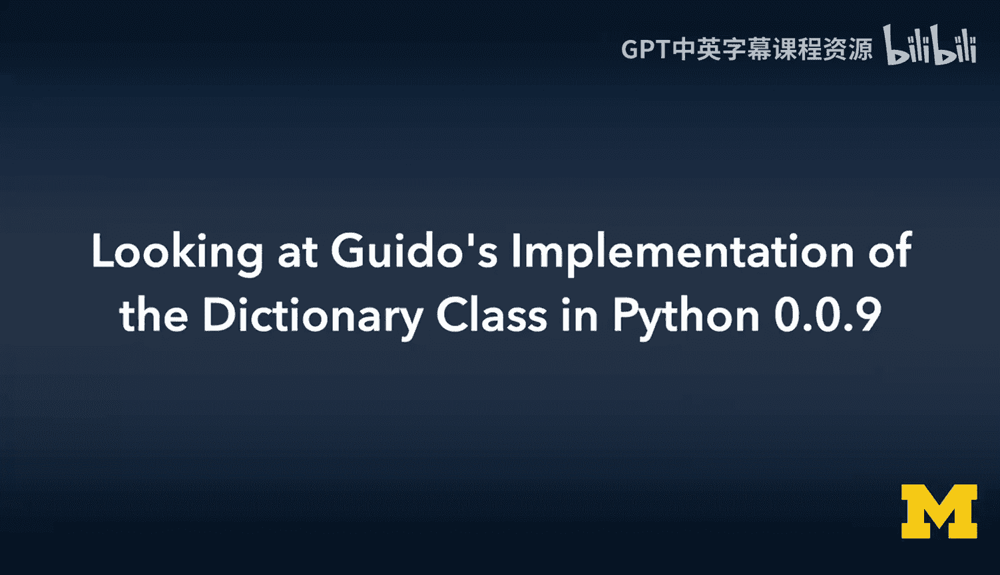
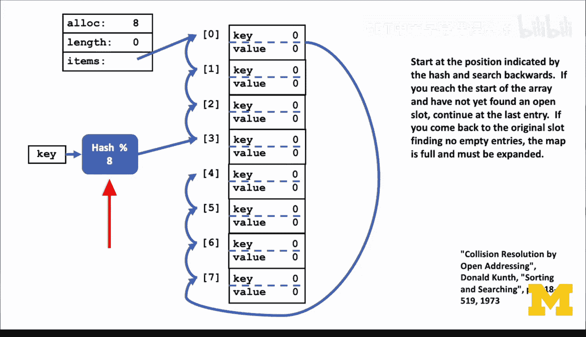

# 密歇根大学《给所有人的C语言编程课（了解C、用C编程、数据结构、创建对象）｜C Programming for Everybody》 p45 24_06_04_解读Guido在Python-0.0.9中的字典类实现.zh_en -BV1v2421P7pt_p45-

So now I want to talk to you about the Python 1。0 dictionary as built by Gio back in 1989，1991。

 and this sample code is available。Under/ code and it's the epilogue code and it's p1DicCt。c。

So the key thing is， is that instead of。Instead of reading the C programming book and Cane R in Cha 6。

Gto Van Rassom。Was reading。Page 518 of a much earlier document。

 which is more about pure data structures and algorithms。

 And so this was kind of like our Bible on how to write good fast code。

 and this was our Bible on how to write sophisticated algorithms。So Gito found this。

 and he decided he didn't want to make Liless。 And that's partly because of his experience in ABC。

 And so this is。Open hashing using an array。 So this is an array based hash concept。

 And in the bucket styles， there's an array ofh hash link lists。

 And so this is an array that actually everything is stored in the array rather than a pointer to things that are outside the array。

The key open addressing is how you probe and find open slots when your initial hash。

 it leads to a collision and hashes。 We try to make hashes not collide， but。They can't collide。

 And so this is basically it dos a circular iteration。 And it actually， if you look at there at L3。

 it's subtracting one。 And if it's less than0 set I to I plus M go back to step L2。

 It is probably just easier to show you a picture of what's going on。

 So let's imagine that we've got an array of8 key value pairs， and this is literally an。 In our case。

 these will become pointers。 keyL V pointer value v port pointer。

 but Canoeuth is not thinking about that， as far as canuthth is concerned。

 everything is just a variable。 So it's an array of key value pairs。And the key thing to the hash。

 it's the same hash computation and the same modular operated。that looks at the number of buckets。

But when it picks us。