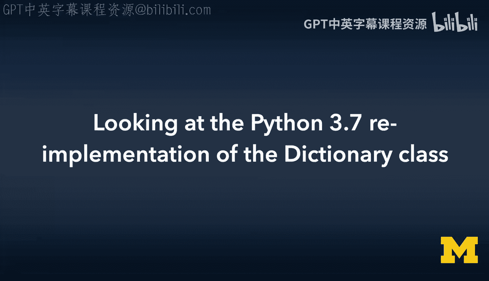
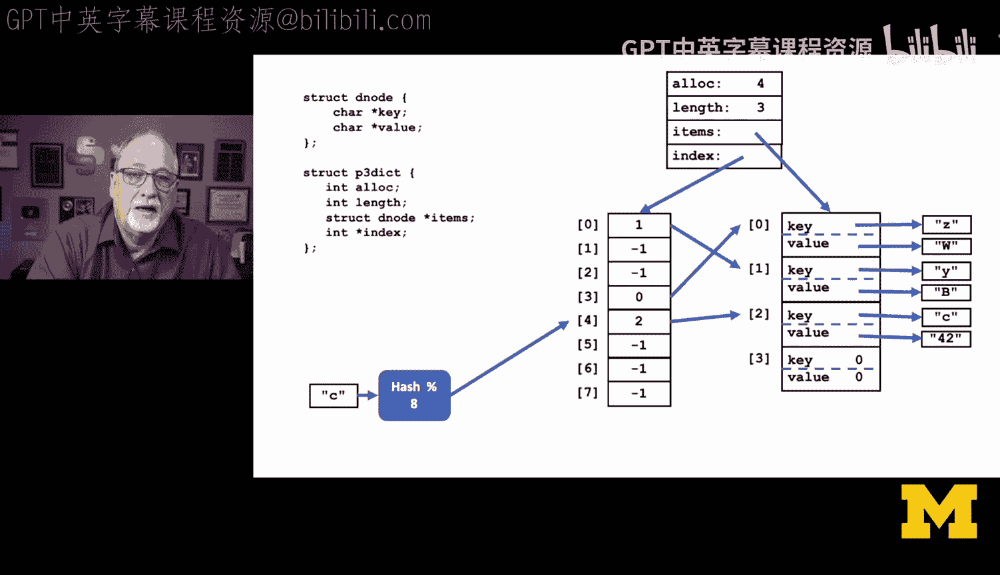
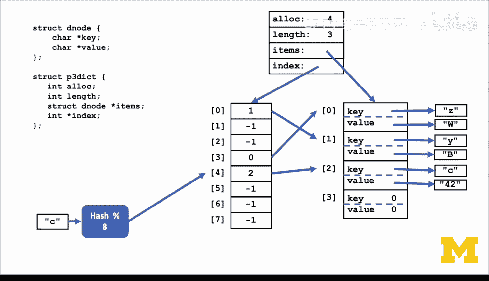
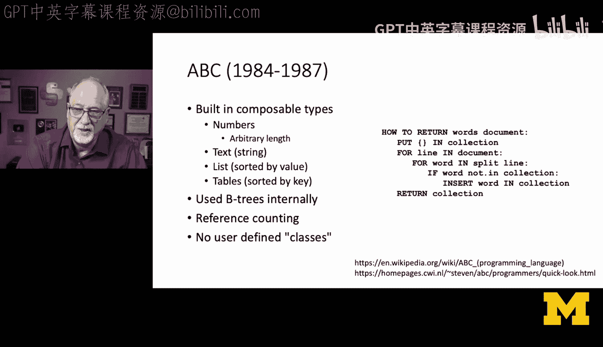
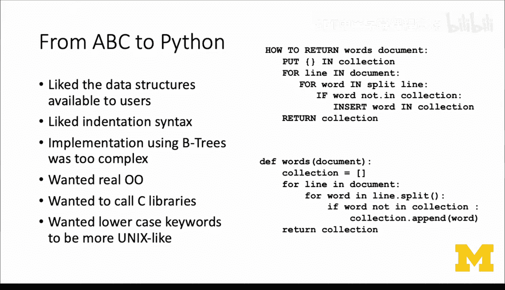
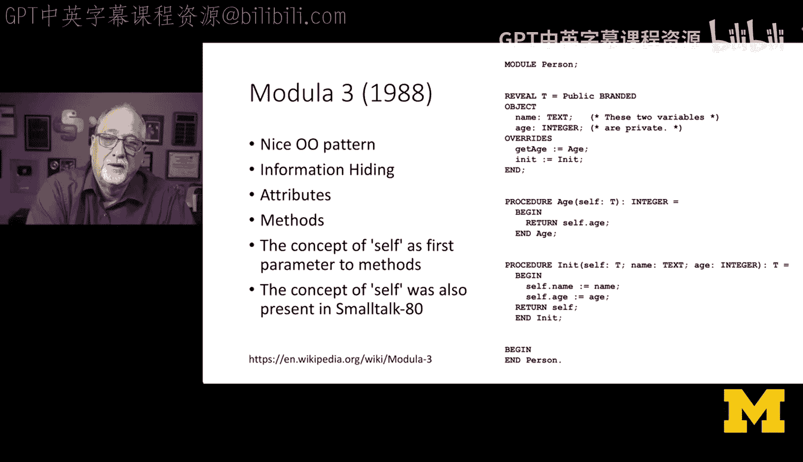
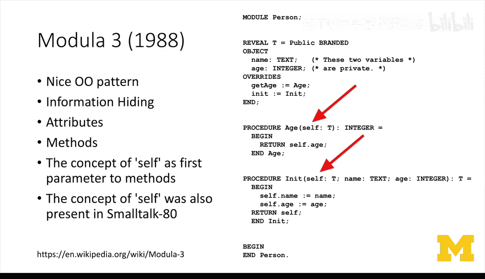
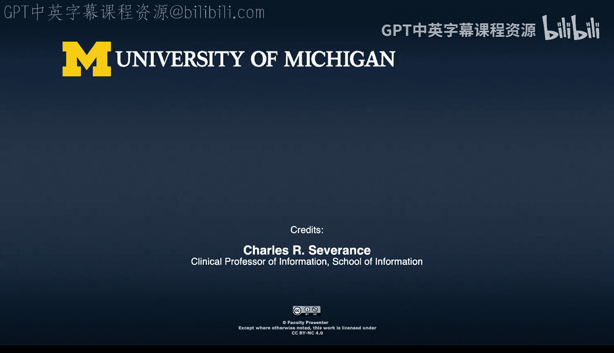

# C语言编程：46：Python 3.7字典类的重新实现解析



在本节课中，我们将探讨Python 3.6到Python 3.7版本之间字典实现的关键变化。我们将了解字典如何从无序结构转变为维护插入顺序，并深入解析其背后的数据结构设计思想。

## 🧠 Python 3.7字典的顺序维护机制

上一节我们介绍了字典的基本概念，本节中我们来看看Python 3.7如何实现顺序维护。在Python 3.6到3.7的演进中，字典开始维护插入顺序，而非键的顺序。

其核心思想在于，哈希是一种在数组中快速找到起始位置的方法，但这并不意味着所有数据都必须存储在哈希链表中。在Python 3.7中，实现方式类似于我们之前用树形映射练习中编写的代码，即同时维护多个数据结构。



在Python 3.6中，字典没有顺序保证。在代码执行过程中，顺序可能在重哈希时改变。这种顺序是伪随机的，源于哈希函数本身，并且由于重哈希和哈希映射重组，其顺序在多次插入间甚至无法保持一致。

Python 3.7将哈希索引的概念与键值存储分离开来。这使得遍历Python 3.7字典的行为更类似于遍历Python列表（按顺序迭代）。虽然字典不提供像列表那样的下标访问语义，但其本质上是一个Python列表加上一个用于快速查找的哈希索引。

对于插入和获取操作依然快速，而遍历字典则完全像遍历一个Python 1.0版本的列表。通过键查找和插入键值对仍然非常迅速。

## 🏗️ 数据结构剖析：索引与条目分离

为了理解上述机制，让我们看看具体的数据结构。`struct PyDict` 包含分配信息、长度和一个条目数组 `items`。



但现在，我们多了一个整数数组 `index`。在示例代码中，`index` 的大小被设定为 `items` 的两倍。这意味着我们始终有空间，最终负载因子为0.5。

以下是核心结构的简化表示：
```c
struct PyDict {
    Py_ssize_t ma_used;       // 当前已用的条目数
    Py_ssize_t ma_allocated;  // 分配的总槽位数
    PyDictEntry *ma_entries;  // 条目数组（维护插入顺序）
    Py_ssize_t *ma_indices;   // 哈希索引数组
};
```

`items` 是一个列表。例如，我们按顺序插入 `Z`、`Y`、`X`，它们会保持插入顺序。新的插入总是追加在末尾。因此，我们看到的是一个填充了四分之三的列表。

但我们现在不像在Python 1.0中那样关心 `items` 的负载因子，重要的是 `index` 的负载因子。因为 `index` 是 `items` 的两倍大，其负载因子永远不会超过50%。这意味着当需要扩大列表时，我们会重新分配内存，同时也会扩大 `index`。因此，我们永远不会超过50%的负载因子，这使得操作非常平滑和简单。

关键在于，`index` 是一个整数数组。每个整数中存储的，正如箭头所示，仅仅是键值对在 `items` 列表中的索引位置。

这本质上是两个同时存在的数据结构：
*   `index` 是一个哈希表。
*   `items` 是一个列表。
*   `index` 中的值指向列表中的偏移量。

虽然示例代码没有实现，但Guido（Python之父）可以轻松地在列表和字典的 `items` 之间共享部分代码和优化。

## 📝 总结与设计影响

本节课中我们一起学习了Python字典实现的演进。我们从Guido的设计中学到，他喜爱realloc（可扩展数组）和指向对象的指针。链表在Python核心数据结构中几乎不被使用，这被证明是一个非常好的选择。一旦你开始查看代码，会发现它出奇地简单。



大约10年后，内存管理从realloc移到了Python自身。因为realloc的行为不如预期那样可预测。最终，底层出现了垃圾回收的概念。现在，代码中使用realloc的地方已被Python分配器取代。realloc负责提供大块内存，然后由Python管理、垃圾回收和清理等。因此，现代Python对realloc巧妙性的依赖大大降低。

关于Python的设计影响，Guido受到了多种语言的启发。他使用过C++，并做了一系列实验。某种程度上，他的疑问是：C++是否足够强大，能完成他想在Python中实现的功能？他发现C++的实验有些令人失望，因此他选择使用C语言来构建Python。但他从C++中学到了如何在过程式编程语言之上分层构建面向对象的概念。所以C++产生了很大影响。

ABC语言对Python的影响可能比想象中更大。Guido喜欢ABC的某些方面，也想改进其另一些方面。ABC有很多很酷的类型，使用引用计数处理分配和释放，他喜欢所有这些。但它在内部使用B树（一种常用于数据库的结构），而非二叉树。此外，它没有让用户定义类的机制。所有面向对象的概念都内置于语言及其实现中，用户无法在ABC中定义自己的对象。





ABC很好地完成了它的设计目标。Guido精通ABC并曾参与其工作，因此他知道要从ABC中借鉴什么，也知道要在ABC的基础上构建什么。ABC的语法风格清晰，你可以看到像 `split`、`in` 等概念，以及 `for line in document` 这种循环中隐式迭代的方式，这些都直接进入了Python，只是他改用了小写关键字。他还希望实现真正的面向对象，并且更贴近C语言库，因为ABC并不关心能否调用C字符串库或C套接字库等。

Modula-3语言也是一个重要影响。这是一种以欧洲为中心的语言，源于Pascal。对于像我这样的美国人来说，可能不太考虑Modula，但Guido显然在研究如何实现某些功能。Modula-3中有一些非常好的思想，他曾与Modula-3团队交流。**`self` 作为第一个参数的概念**，是在过程式语言之上构建面向对象机制的一种方法。这个 `self` 的概念灵感，正是来自Guido与Modula-3的互动。





总而言之，Python的设计是多种编程语言思想和实践融合的成果，最终形成了我们今天所熟知的强大而灵活的语言特性。