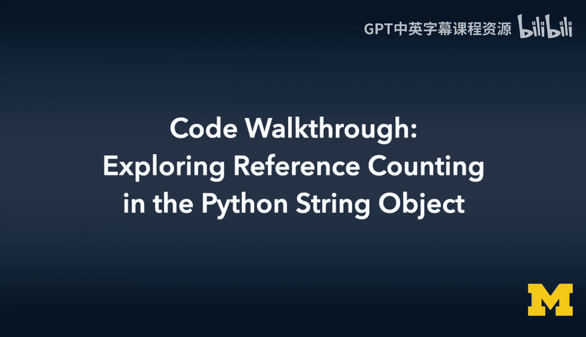
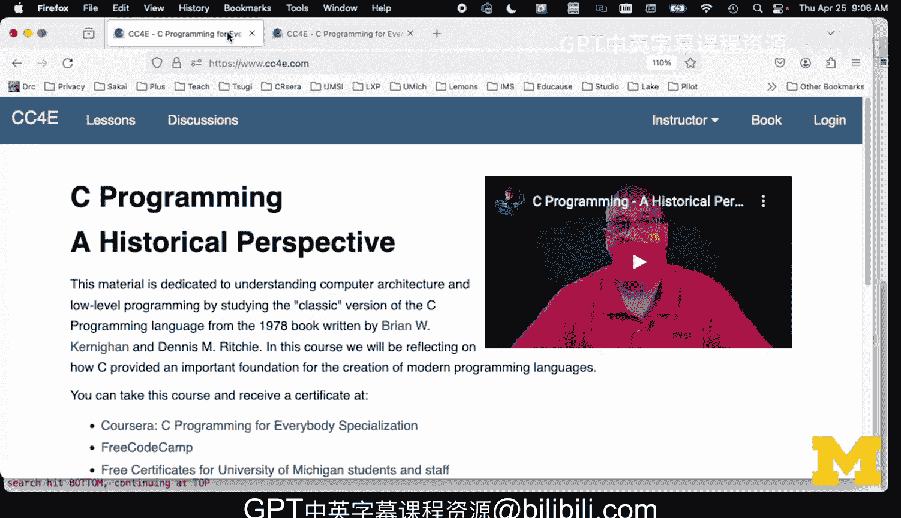

# 密歇根大学《给所有人的C语言编程课（了解C、用C编程、数据结构、创建对象）｜C Programming for Everybody》 p48 27_06_07_代码走查-探索Python字符串对象的引用计数机制.zh_en -BV1v2421P7pt_p48-

Yeah。Hello and welcome to a code walkthrough for C programming for everybody。

 The code we're walking through is some of the epilogue code where we're comparing kind of what I did in my chapter 6 curning in a Richie stuff to what Gito tells us was the Python 1。

 And then later， the Python 3。7 approach to dictionaries lists and strings。

 So what I'm going to go through right in this one is the string。 So let's take a look at that code。

 this is basically。The code， that is the string code now。

The pattern that I'm using here is a chunked array of characters。 And so like if you look at it。

 the string has some data。 But what we're adding for this particular one was something that a Gito was very obsessed with in the early Python version again from ABC。

 And the idea is， is that we use a thing called reference counting。

And it means that if you sort of assign something， you don't always have to copy all the data。

 you can kind of copy a pointer instead， but then you have to be careful at reference count because you got because the Dell operation has to know when the reference count goes to zero。

 So this pretty much looks like the code that I wrote sort of based on the for the K andR book to implement it with some reference counting and the easiest thing to do is look at。

The main code here。And so we create a new string。We。Dump it， we add an H character。We dump it。

We add LO world as a string and we dump it。And and then we're going to set it to a new value。

 but then here's the new part right here。 we're going to create this assignment。

 and so this we're creating a we have a variable called X， which is a pointer to a P1 STR。

And we have a variable called Y， which is also a pointer to a P1 STR。

 So what this is is this is P1 STR underscore a sign， and we're passing in a pointer。

And so what's going to happen here is this is like going to increment the reference count。

 You're going to see this。 It's going to increment the reference count because now we're going to have two variables。

 X and Y that are literally pointing to the same string。 So let's， let's even run this code。Okay。

 so I've got it run here。And so what we see in that last bit when we make a all the top bit here is all on the string X。

 But the interesting part here is where we say string X equals a completely new string。

 and we're pointing out the location in memory that that is。 And then after the assignment statement。

 we see string Y equals a completely new string， and it's at the same location。

 But what we've done is we have incremented the reference count。 Then if you look at the main code。

 we dell X， which was the original P1 stir Dell X， which is the original one。

 and all we do is we decrement the reference count， but don' we don't actually delocate the data。

And then。We still have the string Y。 We shouldn't have a string X。

 But then what happens when we delete Y at the very end here。

 P1 STR underscore Dell OpenPn Y close printn。 Then it actually freeze the data And so the idea is we can copy a reference without copying all the data have X pointing to it。

 Y pointing to it with a reference count of2。 And then we can free either x or y that'll instead of throwing away the data that decrements the reference count。

 So let's just sort of take a bit of a look。 Now most of this is the same as what we covered like if we look at。

Let's look at sort of the constructor。P1 STR new， we allocate a buffer。

We allocate the object and then we allocate 10 bytes and we tell it that it's 10 long and we put a new line an end of string in there and we set the reference count to one。

 So as soon as we create it。We assume that this new is going to be assigned into a variable。

 and then we make the reference count V1。And so if you look at the land and the dump and etc use and you look at the append。

 we see the append is pretty much a clone of what I did where you know if we don't have enough space。

 we allocate another block at 10 this Gito calls this chunking in the video and then we reallocate it and then we've got 10 more and so we can stick our character in to the end of it and add one to it。

 and then we we null terminate the string， So that code is identical to what I did in the Carneut and Rie book。

And， and so let's look at the assign。Code， so this is the interesting thing where P1 stir underscore a sign。

We have。One pointer， and we're going to return this pointer。

 so we have two variables pointing to the same block of dynamically allocated memory。

So when we're doing this assignment statement， in effect， y equals x。Inside the object。

We don't need to worry too much about Y or x， but we do need to know that we are now reference to places。

 so every time we reference add a second or third reference， we just add one to the reference count。

 So selfarrow refs plus plus and then we return it。

 so then if we look at the code in the main program where we're saying struck P1 STR star y equals P1 STR underscore a sign X we could have said y equals x。

 but we wanted to record the fact that we've added a reference so that we know that that has reference count of2。

 so we don't inadvertently free the wrong thing。And then the only other place that this gets interesting is in the Dell method。

So if we go into the Dell method。What's cool about this and this is where reference counts and so in our main code we just if we we we delete y with an underscore Dell method。

 we delete X， we can do all that stuff and it's inside the object where these reference counts are being resolved。

And so what's cool about this is we're saying， okay， we're going to dell X。

 which was the original thing that we assigned it into， and if the reference are greater than one。

We don't actually free any data。We just decrement the reference count and we're done。

And so that's where we see in the output， we see decrementing reference。

 and you'll see all these addresses are the same，060 x60， blah， blah， blah， 91c0， okay。

And so they're being decrement， and so the first free decrements it。

And that goes from 2 to1 in this case， because we the underscore sign incremented it。

 and then the underscore dell decremented it。 But then when we get the Ref count to one。

 that means we're in effect freeing the last reference。 So it prints out freeing reference。

 And you can see it says free we're actually freeing the data。

 And so that's where we do the free of self data and then we free the self to get rid of it。

 which is the code we did before。And so。The real essence of this code is the obsession this。

This code is the obsession with reference counting。

 and that has to do with the fact that you want to be able to point multiple places to the same string without wasting extra memory just to make a bunch of copies for no real purpose。

 So when when you're kind of making a copy that points to the original。

 then you have to increment the reference count and decreement it。

And so in the rest of these sample code， I will not add reference counting to it because we're just going to look at the underlying data structures。

 but it's really important to understand that reference counting was essential to the ABC implementation。

🎼And gitos C+ plus implementation and Python 1。0's implementation was all about reference counting to save very scarce memory so that you could point to the same string many times。

 and the reference counts could get very high， especially strings that were constants。

So reference counting is important and this is just you can take a look at this code and compare it to the KR code that I built reference counting is an important part of Python。

🎼Yeah。🎼Yeah。

