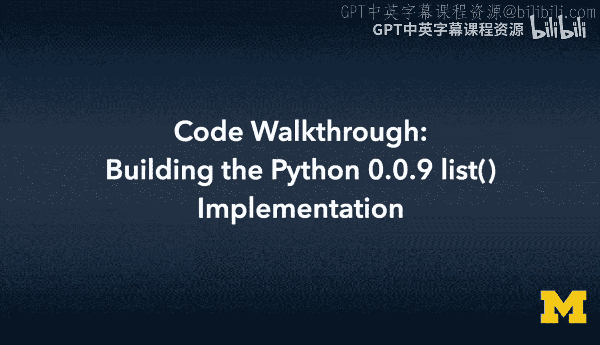
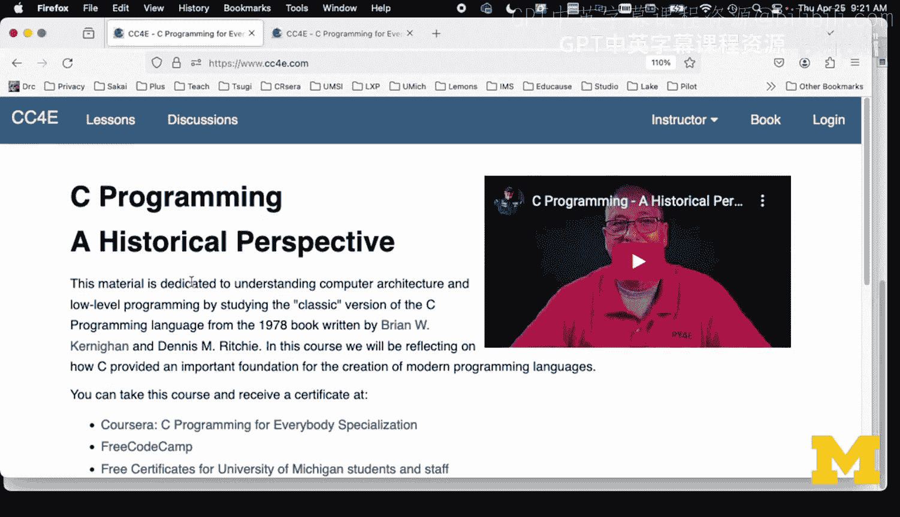
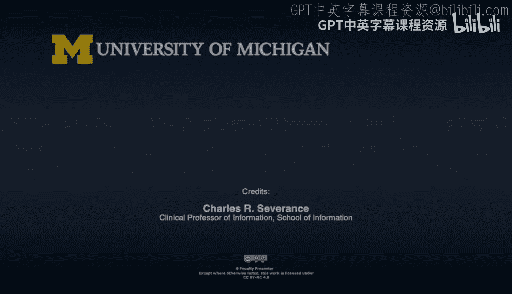
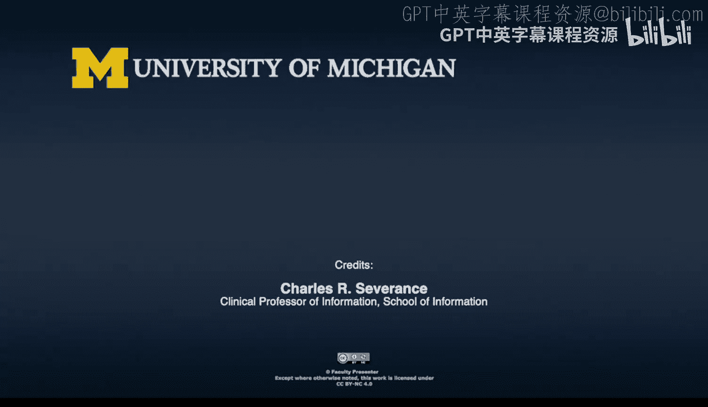

# 密歇根大学《给所有人的C语言编程课（了解C、用C编程、数据结构、创建对象）｜C Programming for Everybody》 p49 28_06_08_代码走查-构建Python-0.0.9列表实现.zh_en -BV1v2421P7pt_p49-

Welcome。To another code walkthrough for see programming for everybody in this code walkthrough。

 we are going to compare how Gio implemented list in the earliest versions of Python versus how I implemented list while teaching chapter 6 of Carnegie and Richie and and so this was if you watch the video of my interview with Gio Van Rassom。

 this was like my greatest like revelation like what and so the big revelation is is that。

Python Python's list object in Python 0。01 was an array of pointers。

And if we look at the Carnegan and Richitchie list item。This was a linked list。 I did a linked list。

 And so the actual K R list struck has a pointer to the head and the tail of its linked list an account。

 And again， this is classical linked list。 And to some degree。

 while I was teaching this in Kinegan Rie Cha 6， I was really teaching you linked lists and using the Python list abstraction to teach it。

And so we have two data structures， we have this node， which just has a point or two。

Text saved and a pointer to the next one。 So this is like classic linked list。 I'm not going。

 I'm not going to go through that again。 So you just go back and watch the chapter 6 stuff。

 And I talk about link list all the time。 But that's not how。Python does it， did it or does it。

And it's not。Clear to me exactly why。 But he， I think he was just trying to build the simplest possible data structure。

 And we'll look at some code， and you'll see that there is a certain simplicity。

 like already in then just astruct definition。 We see the struct P1 list。 There's only one of them。

 If it's a link list， you have sort of astruct for the node and a struct for the list itself。

the constructor P1 list new， we're just going to mallic the object and then we're going to say， okay。

 let's， let's allocate to character an array of pointers to characters。

 and so if we look at this struck P1 list and we see char star star items， that is。

Syntax for a array of pointers。And so you think of each pointer as either 32 bits in the old days or 64 bits in the modern days。

 so that's an array。And so。So what I'm doing in this P items equals Malc open print P ac times size of cha star。

That means。I'm allocating2。Elements that are pointers， which means， again。

 two times 64 Bs in the modern world And noting that I have two in there and length。

 which is the Python view of the number of items is 0。 So we've， we've got space for two。

And we have zero， and that's an array that we know Alec tells us how long the array is and length tells us how much of the array we've used。

And just to go back， I'll try not to compare and contrast too much。

 but just think about the complexity of link lists the way I did them in my Kerney and Richitchie。

 chapter 6。You have this thing called head， you have this thing called tail， which is null。

And count is zero。 and again， for those of us who know link list this is obvious， it's what you do。

But an array is simpler than a linked list， and so， you know， there we go。Okay， okay， okay， okay。

 so that's what what we've got when we're done with our constructor。

We've got an array of two pointers to characters。Allocated2 and length1。 So let's go take a look at。

 let's take a look at the main code right now。 And so the key to this main code。Is that in a sense。

 here's the Kne and Rie main code because this is like an inner face and an abstraction。

 The main code should be pretty much the same。 and the main code pretty much is the same。

 meaning that we create a link list， we append some stuff to it。 We print the list。

 We check the length。 We look something up， and then we delete it。

 and we do both things because below the abstraction。Below the interface。

Both of these implementations， both the KR list and the P1 list。

Are supposed to provide to us the caller the same abstraction we can append。 We can print。

 We can check the length。 We can check the index， and we can delete it。

And it does not matter what the implementation is and that so that's more the builders of the Python runtime。

Get to decide how to do this， because we've got a contract with them again， an interface。

 So let's just take a look at the code。 We're going to add hello world to our list。 Don't print it。

 Then we're going to add catch phrase and print it。 Then we're going to add Brian and print it。

And then we're going to say how big is it， and then we're going to ask where is Brian in there and where is Bob in there and then we're going to delete it。

And if you look at the run， you see， you know， the list starts out as hellello world。

 and the list is hellello world catchph。 and we'll see what this is extending because we started with two slots in our array。

 And for the first two， you didn't have to get bigger。 but then we're like， oh， wow。

 we're running out of space。 We got to like extend this array。 We'll show that code in a bit。

 But then we end up with three things in the list。Again， that's not our job as the caller。

3 things in the list。 And Brian is in position 2， which 0，1，2。 Elello world is 0 catch Phs 1。

 and Brian is 2， and Bob is not there。 so we get back a negative one。Pretty stuff。Okay。

 so let's take a look at the append code because this is where the fun happens。

Okay so here's the append code。So let's take a look at the let's go back how I taught you append。

You know， a month or so ago。And so。So again， you got this， the lecture has pictures of all this。

 right， so if you're app。嗯。If it's empty， your self head is new。 If the self tail is not equal null。

 then self tail next equals new， and then self tail new equals new。

 So that's just like you got to draw the picture and add the little arrows and away you go。

 and then you all and save the string itself。 But now we look at the P1 list。

And we have to extend it if necessary， right？So we have self length。I ear。Is greater than self Alex。

 so we allocated two in first in the constructor， and then if the length is2。

We don't have enough space because our next one would be sub2 and that you can't you can have sub0 and sub1 in a two long array。

And so all we're going to do then is。We're going to have chunking and Gito mentioned chunking in the video。

 we're going to chunk it to add ten0。And so we're going to basically extend from 2 to 10。

 so we're going to add 10， we're going to increase the al size。And then we're going to call Realc。

And Reallic is going to take the array of items。And say however big that was。Free it， move it。

 whatever。 extend it， depending on what how relic is working。 And we're going to say， okay。

 we want to have 12 of these things now，12 and that becomes our new items。 Now that Reelic will also。

 So there's two things in it。And we extended 12。 Realick will copy the two things。

 so we don't have to do any copying because Reallic copies the first two things because it knows its items is too long。

 And so it copies the first two things。 And then gives us 10 more。 So there's no copy code here。

 And so I think you know Gito really like the realallic。

 And a lot of C programmers don't like Reallic。 And he he did， he's like， look。

 Realick says it's going to do this。 And I want to do this。 So Realek do your job。

 And so I think back to my own time as a software developer。 I just felt because again。

 we were taught link list， link is link list。I just didn't think about Realic as a useful thing。

 and Gito clearly felt like Realic is the answer。And it lets him have this simple array array mentality。

 So you just real it and say， look， here's an array that's too。 I want it to be 12。 Help me。

 and we're done。 And so that's really simple code。 I think， very easy to understand。

And then we make a save string。And then we just add at the end of the array self length。

 which in this case is sub2， is that string， and then we add one to the length。

So this code is really simple。 And if you were doing debug print。

 you don't really need any addresses because if you recall when I'm printing in all my link list stuff so that you can debug it and redraw all your lines and figure everything out。

 I'm printing addresses out all the time。 but no， this is just a position。 So this is the0。

 the one and now the two in this case。 And so that's where you see when it says extending from 2 to 12。

 that's as a side effect of adding the third item to a list that was pre allocatelocated with two slots。

Okay。And that's it。 But， let's take a look at the print code。Right。

Let's look at the print code for both of them。This is Kr list print。

 Let's take a look at the print code in Gito Vanrassom's version。Okay。

So the key to this is the for loop in P1 list underscore print。

 the for loop is4 I equals0 semicolon I less than self length， let's take that plank out。

I less than self length。 I plus plus that is like。Really basic。Chapter4， chapter5 stuff。

In Carnegan and Rie。 So it's just an array。So you write a simple incremented for loop。 It's fast。

 cash efficient。's it's beautifully simple， right， So in this print。This is obvious。 Now。

 when I showed you the same thing in。Curneygan Richitchie， chapter6。I was。

 I I this4 in K R list underscore print。 It says4 cur equals self arrow head， Cur not equal null。

 Cur equals cur next。 And I apologize for this line。 And I'm like， you will eventually write this。

Because it's an idiom， you will write this quite naturally， and it'll make a lot of sense to you。

Right？But。In Python 1， we didn't do that。It was an array。

 And the only place that we have to worry about its dynamic nature。

The only place we have to worry about its dynamic nature is in the append。

Right where we realloccate it， so everything we're doing here is a simple for loop。

So like even the Dell command here， the Dell basically says， let's free all those little items。

 Let's free those character strings with a four loop for I equals 0， I less than self length。

 I plus plus again。A beginning C programmer can understand this code。

 And if we look at the C code in K R list underscore Dell， we just see a while loop。

 And remember you had to you had to do these in a certain order。 And so the whole free。

 And I talked about all this stuff。 the fact that you got to do it in a certain order。 well。

This is pretty simple， right？ So it frees each of the items。 It's4 equals 0。 in P1 less dell。

 You free each of the characters strings that we point to。

 Then we free the array that's got those pointers， which are now valid because we got rid of them。

 And then you free the object itself。 And so to some degree。

 one can appreciate the simplicity of what Gio did in this by going with arrays。 And again。

 the key thing that。😊，Like misled me。Or that Gito just took a different approach。

 it really came down to realalc。And so he believed and I was trained to not think about Reeik as plan A。

 And so I thought linked lists were plan A because then you don't have to do so many realalex And hes like。

 I want an array。 And Realex says it's going to do this for me and away we go。

 So I encourage you to take a look at P1 list and Kr list and put them in two windows next to each other and sort of compare and contrast and what I really want you to do as you're comparing and contrasting。

Is I want you to think about the complexity of writing， debugging。

 and then later the complexity of understanding and how much knowledge。

A programmer has to understand to be able to make sense of these two。

Bits of code and again for those of us computer scientists for whom linked list are very natural。

 we just write this stuff， I can write it pretty fast but that doesn't mean that it's the easiest to learn so away we go and so I hope you found this comparison interesting cheers。

🎼Yeah。Yeah。

