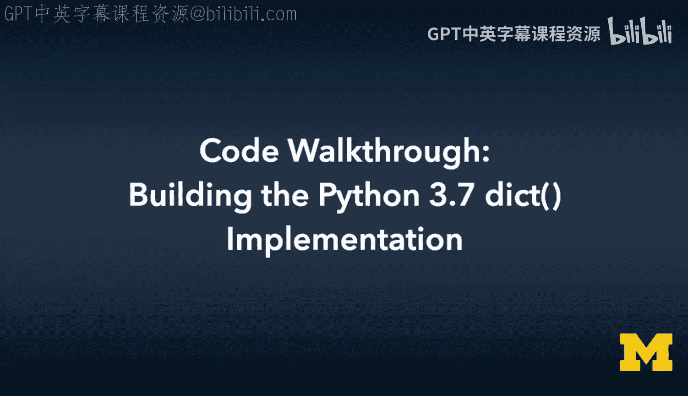
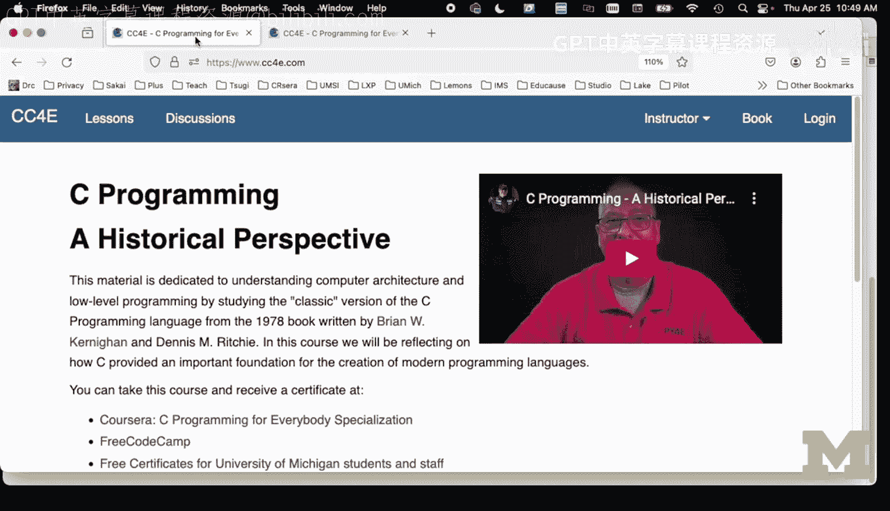

# C语言编程：第51讲：代码走查 - 构建Python 3.7字典实现



## 概述
在本节课中，我们将学习Python 3.7版本中字典数据结构的内部实现。我们将对比早期版本（Python 0.01至3.6）的字典实现，重点分析Python 3.7如何通过改变数据结构来提升效率并维持插入顺序。

## Python 3.7字典解决的问题
上一节我们介绍了Python早期版本的字典实现。本节中，我们来看看Python 3.7字典旨在解决的核心问题。

在Python 0.01的字典实现中，每个键值对条目（entry）存储了指向键的指针、指向值的指针以及哈希值。在64位系统中，这通常占用24字节。字典的负载因子（load factor）不允许超过0.7，这意味着数组中有30%的空间必须为空。这部分浪费的空间是固定的，无法避免。

Python 3.7版本改变了这一结构。它将实际的键值对数据存储在一个线性的指针数组中，而将哈希查找和冲突解决的功能分离到一个独立的、更小的整数索引数组中。

## 新的数据结构设计
理解了问题所在后，我们现在深入看看Python 3.7字典的具体数据结构设计。

在Python 3.7的实现中：
*   `items` 数组：一个线性数组，存储指向实际键值对结构（包含键、值、哈希等）的指针。
*   `index` 数组：一个独立的整数数组，用于哈希查找。其长度通常是 `items` 数组的两倍，从而将哈希表的负载因子控制在0.5以下。

这种设计带来了几个好处：
1.  **减少内存浪费**：`index` 数组仅存储整数，比存储完整条目指针更节省空间。
2.  **维持插入顺序**：由于 `items` 是一个线性追加的数组，自然保持了键值对的插入顺序。
3.  **简化扩容逻辑**：`items` 的扩容变得与Python列表（`list`）的扩容非常相似。

## 代码实现解析：初始化与查找
了解了整体结构后，我们通过代码来具体看看它是如何工作的。首先从构造函数和查找函数开始。

以下是字典对象初始化的简化表示：
```c
struct P3Dict {
    struct DNode **items; // 指向键值对指针数组的指针
    int *index;           // 哈希索引数组
    int length;           // 已使用的条目数
    int alloc;            // items数组的分配容量
};
```
在构造函数 `P3Dict_new` 中，我们分配字典对象、初始大小的 `items` 数组以及两倍于其大小的 `index` 数组。`index` 数组的所有位置初始化为 `-1`，表示该槽位为空闲。

查找函数 `P3Dict_find` 的核心逻辑是在 `index` 数组中定位一个键。它计算哈希值，然后在 `index` 数组中进行线性探测（linear probing），直到找到目标键或一个空闲槽位（值为 `-1`）。如果找到键，则返回其在 `index` 数组中的位置；如果找到空闲槽，也返回该位置，表示可以在此插入新键。

## 插入操作与动态扩容
掌握了查找机制后，我们来看插入操作 `P3Dict_put` 是如何利用查找结果并处理数组扩容的。

插入操作的步骤如下：
1.  调用 `P3Dict_find` 查找键。
2.  如果找到（返回位置不是 `-1`），则替换对应的值。
3.  如果没找到，则需要插入新键值对。此时检查 `items` 数组是否已满（`length >= alloc`）。
4.  如果 `items` 已满，则需要进行扩容。这与Python列表的扩容模式一致：
    *   重新分配一个更大的 `items` 数组（例如，容量翻倍）。
    *   同时，分配一个新的、更大的 `index` 数组（大小仍为 `items` 新容量的两倍），并全部初始化为 `-1`。
    *   遍历现有的 `items` 数组，对每个键值对重新调用 `P3Dict_find`，在新的 `index` 数组中重建哈希索引。
5.  扩容完成后（或原本就不需要扩容），执行插入：
    *   将新的键和值复制到 `items` 数组的 `length` 位置。
    *   调用 `P3Dict_find` 获取新键在 `index` 数组中的应存位置 `pos`。
    *   执行赋值：`self->index[pos] = self->length;`。这行代码是连接哈希索引和线性存储的关键，它记录了在 `index` 数组的 `pos` 位置，对应的是 `items` 数组的第 `length` 个元素。
    *   增加 `length` 计数。




## 总结
本节课中我们一起学习了Python 3.7字典的实现原理。通过将数据存储（`items`）与哈希查找（`index`）分离，新设计显著减少了内存浪费，并自然地维持了插入顺序。其扩容机制也变得更为清晰和高效，类似于列表的扩容。与早期版本复杂的再哈希代码相比，Python 3.7的字典实现展示了优雅而高效的数据结构设计。