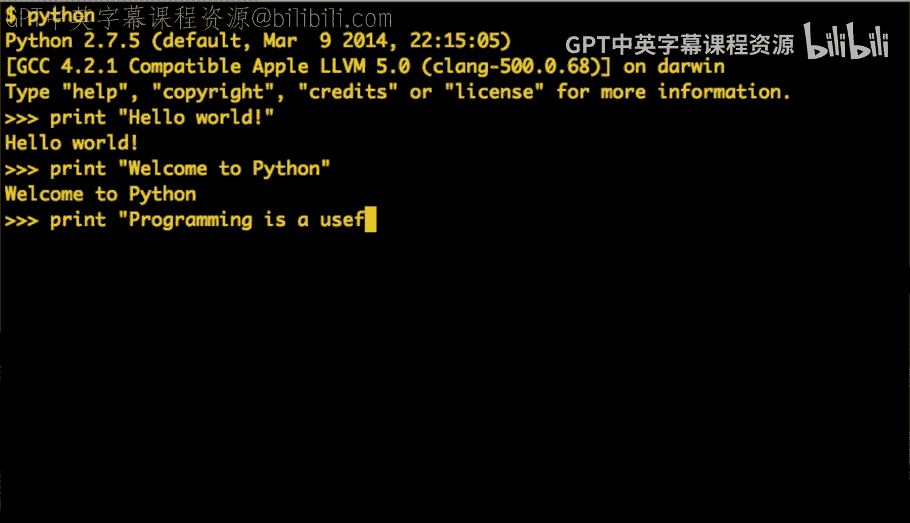
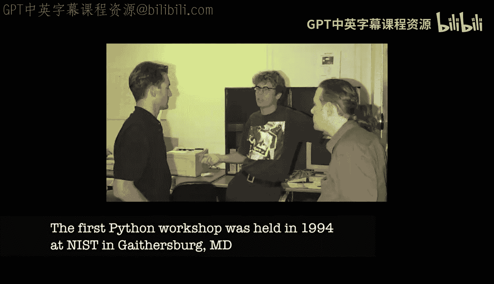

# 005：Python的诞生与早期岁月

在本节课中，我们将跟随Python创始人吉多·范罗苏姆的讲述，了解Python语言诞生的背景、早期开发历程以及其最初的开源发布过程。我们将看到一门新语言是如何从一个解决实际问题的想法，逐步成长为一个拥有社区的项目的。

## 诞生背景

上一节我们介绍了课程的整体框架，本节中我们来看看Python诞生的具体故事。吉多·范罗苏姆当时在荷兰国家数学与计算机科学研究所工作，参与一个名为Amoeba的分布式操作系统项目。

该操作系统内核在网络通信和进程管理方面表现优异，但缺乏足够的用户级应用软件。团队需要为这个新系统编写一整套工具，从编辑器、邮件程序到登录和备份工具。

## 选择与契机

在编写这些工具时，吉多意识到用C语言开发进度缓慢。C语言的优势（如高性能）在此类工具开发中并非必需，而选择C的唯一原因是当时只有C语言的编译器可用。

此时，吉多想到了他曾参与过的ABC语言。ABC语言在数据处理和代码结构方面非常优秀，但它过于高层抽象，不适合与操作系统底层的服务器、文件系统和进程进行交互。

基于对ABC语言设计和实现的理解，吉多产生了一个想法：他可以利用业余时间，从头设计和实现一门新语言。他相信，即使算上开发新语言的时间，用这门新语言来编写Amoeba所需的工具套件，整体效率也会高于直接使用C语言。

## 早期开发与演示

在接下来的三个月里，吉多白天完成本职工作，晚上和业余时间则投入Python的开发。三个月后，他做出了一个可以演示的版本。

这个早期版本已经包含了一个交互式解释器。最初的演示内容通常包括：
*   将一个表达式赋值给变量并打印出来。
*   定义一个小函数并调用它。
*   将一些元素放入数组并对其进行迭代。

这些基础功能都已实现。很快，他的两位同事被这门语言吸引，开始提供帮助。研究所内的其他一些人也对此感到兴奋，并开始使用它。

尽管Python当时还不够成熟，无法直接用于编写Amoeba的工具，但它已经足够有用，可以在研究所内部的Unix系统上运行。人们开始用它编写小脚本，并贡献错误修复。

## 开源发布

到1990年底，也就是项目启动约一年后，团队计划将这门语言以开源形式发布（当时“开源”这个词尚未被创造出来）。他们参考了X Window System等项目的发布模式。

以下是发布过程中的关键步骤：
1.  吉多向研究所的管理层和法律部门申请发布。
2.  他说明这是利用业余时间、为研究项目开发的代码。
3.  他准备了一份与MIT许可证类似的许可协议。
4.  在获得批准后，团队于1991年2月进行了首次Python发布。

首次发布在当时是一个重要的里程碑。他们将代码发布到Usenet新闻组上，并很快开始收到积极的反馈。团队也形成了定期发布新版本的习惯。

## 社区的成长

在90年代上半叶，Python用户和开发者社区开始自发组织起来。一个重要的事件是吉多受美国国家标准与技术研究院邀请访美两个月。

在此期间，他们组织了第一届Python研讨会。通过这次会议，吉多结识了一些人，并最终获得了一份在美国的工作。从1995年到2000年，他在美国弗吉尼亚州工作，期间见证了Python社区和基础设施的显著成长。

他们创建了Python官网，结识了许多至今仍活跃在社区的核心人物（如巴里·华沙）。Python版本也从1.3逐步迭代到1.5.2，其中1.5.2在之后很长一段时间里都被视为一个稳定可靠的“黄金标准”。

## 总结

本节课中我们一起学习了Python语言的早期历史。我们了解到Python的诞生源于一个实际的项目需求——为Amoeba操作系统快速开发工具套件。吉多·范罗苏姆结合ABC语言的优点，创造性地开发了Python，并通过果断的开源发布，吸引了早期贡献者，从而奠定了其社区驱动发展的基础。从在研究所内部的悄然兴起，到通过Usenet走向世界，再到社区的自组织与国际化，Python在最初的十年里完成了从个人项目到拥有全球影响力语言的华丽转身。