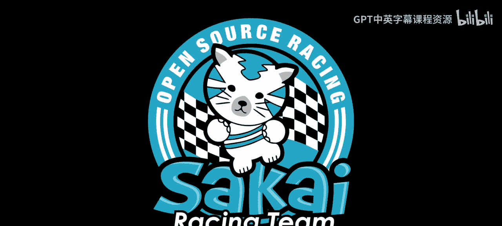

# 006：伊利诺伊州乔利埃特 🏁

在本节课中，我们将跟随查克博士的赛车之旅，学习如何构建一个简单的Django应用。我们将从创建项目和应用开始，逐步实现一个显示赛车比赛信息的网页。

---

## 概述

我们将创建一个名为“Racing”的Django项目，并在其中构建一个应用来展示查克博士在伊利诺伊州乔利埃特的赛车之旅。这个过程将涉及创建项目、应用、定义模型、编写视图和配置URL。

---

## 创建Django项目和应用

首先，我们需要创建一个Django项目。Django项目是应用的容器，它包含整个网站的配置。

**命令**：
```bash
django-admin startproject racing
```

接下来，进入项目目录并创建一个名为“races”的应用。应用是Django项目中实现特定功能的模块。

**命令**：
```bash
cd racing
python manage.py startapp races
```

创建应用后，需要将其添加到项目的设置中，以便Django能够识别它。

---

## 定义数据模型

模型是Django中用于定义数据结构的方式。每个模型对应数据库中的一张表。

在我们的赛车应用中，我们需要一个模型来存储比赛信息。这个模型可以包含比赛名称、地点和日期等字段。

**代码**：
```python
from django.db import models

class Race(models.Model):
    name = models.CharField(max_length=200)
    location = models.CharField(max_length=200)
    date = models.DateField()

    def __str__(self):
        return self.name
```

定义模型后，需要生成并应用数据库迁移，以在数据库中创建相应的表。

**命令**：
```bash
python manage.py makemigrations
python manage.py migrate
```

---

## 创建管理界面

Django提供了一个强大的内置管理界面，可以方便地管理模型数据。

要使用管理界面，首先需要创建一个超级用户。

**命令**：
```bash
python manage.py createsuperuser
```

然后，在`admin.py`文件中注册我们的`Race`模型。

**代码**：
```python
from django.contrib import admin
from .models import Race

admin.site.register(Race)
```

现在，我们可以通过访问`/admin`路径来登录管理界面，并添加或编辑比赛数据。

---

## 编写视图和模板

视图负责处理用户请求并返回响应。模板则用于生成HTML页面。

首先，在`views.py`中创建一个视图函数，用于获取所有比赛并传递给模板。

**代码**：
```python
from django.shortcuts import render
from .models import Race

def race_list(request):
    races = Race.objects.all()
    return render(request, 'races/race_list.html', {'races': races})
```

接下来，创建一个模板文件`race_list.html`来显示比赛列表。

**代码**：
```html
<!DOCTYPE html>
<html>
<head>
    <title>查克博士赛车之旅</title>
</head>
<body>
    <h1>查克博士赛车之旅：伊利诺伊州乔利埃特</h1>
    <ul>
    
        <li>{{ race.name }} - {{ race.location }} ({{ race.date }})</li>
    
    </ul>
</body>
</html>
```

---

## 配置URL

最后，我们需要配置URL，以便用户能够访问我们的视图。



首先，在应用目录下的`urls.py`文件中定义应用级别的URL。

**代码**：
```python
from django.urls import path
from . import views

urlpatterns = [
    path('', views.race_list, name='race_list'),
]
```

然后，在项目级别的`urls.py`中包含应用的URL配置。

**代码**：
```python
from django.contrib import admin
from django.urls import include, path

urlpatterns = [
    path('admin/', admin.site.urls),
    path('races/', include('races.urls')),
]
```

---

## 运行开发服务器

完成以上步骤后，我们可以运行开发服务器来查看我们的应用。

**命令**：
```bash
python manage.py runserver
```

在浏览器中访问`http://127.0.0.1:8000/races/`，即可看到查克博士在乔利埃特的赛车比赛列表。

---

## 总结

本节课中，我们一起学习了如何构建一个简单的Django应用。我们从创建项目和应用开始，定义了数据模型，设置了管理界面，编写了视图和模板，并配置了URL。最终，我们成功创建了一个显示赛车比赛信息的网页。通过这个实践，你应该对Django的基本工作流程有了初步的了解。