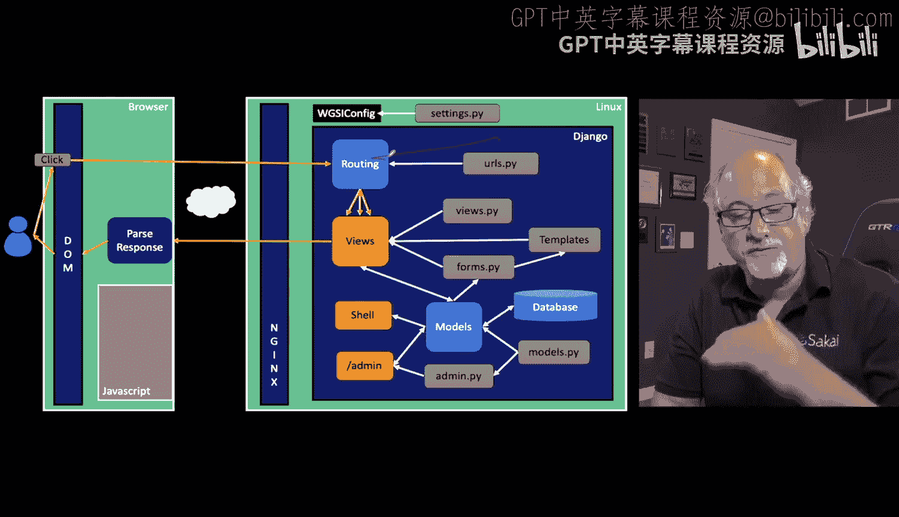
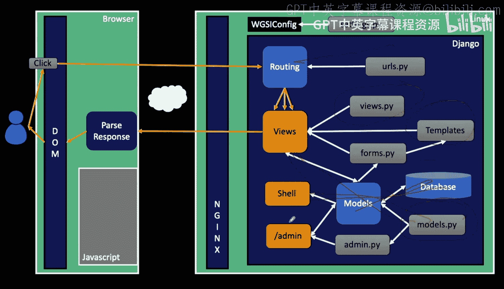
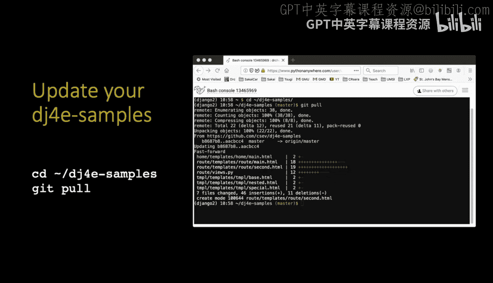
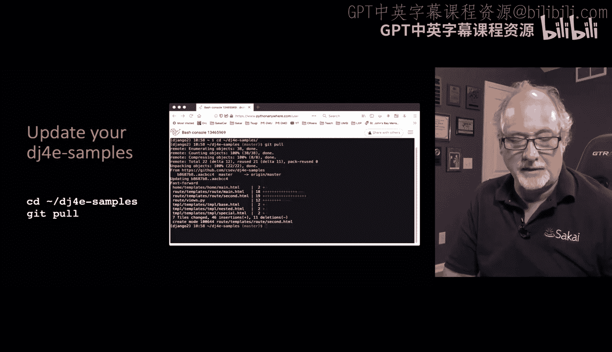
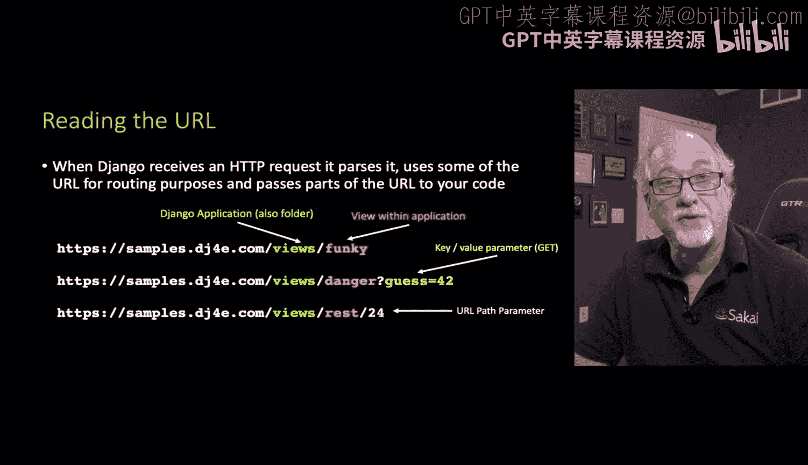
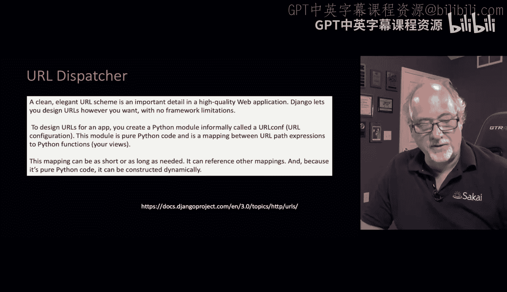
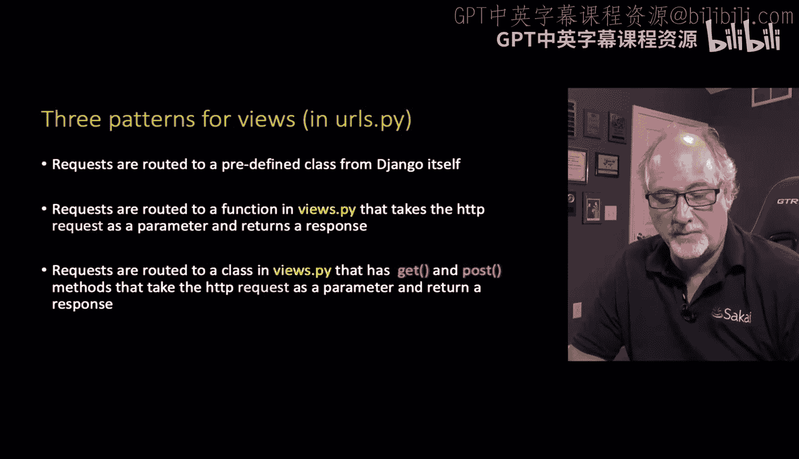
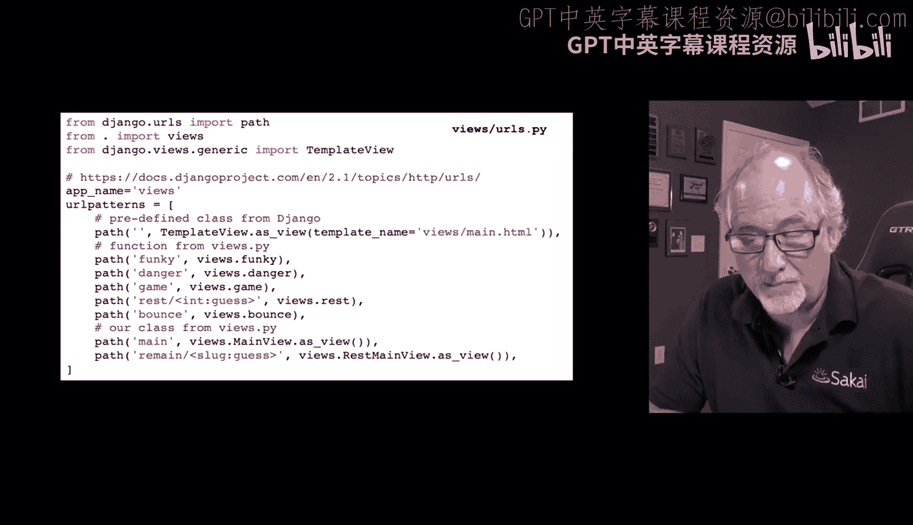
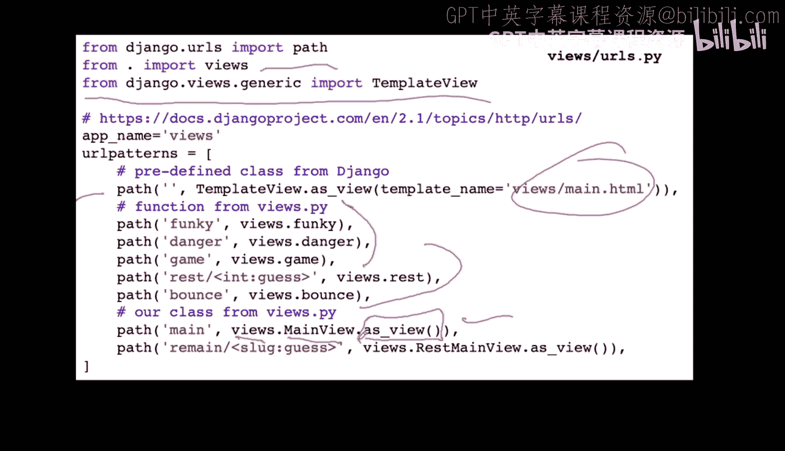

# 036：Django中的URL路由 🧭

在本节课中，我们将开始学习如何生成应用程序的实际输出，并深入了解视图（Views）和模板（Templates）的使用。这部分内容非常丰富，是构建Django应用的核心。

到目前为止，我们已经开始讨论URL。URL配置很简单：当收到特定格式的URL请求时，选择一个视图并将请求发送给该视图。接下来，我们将重点讨论视图（`views.py`）、模板，以及后续会讲到的表单。我们还会花大量时间讨论模型（`models.py`），包括模型如何与Python代码交互、如何通过Shell操作、以及如何指导我们读写数据库。

随着我们将视图组合起来，我们开始填充应用的各个部分，真正开始构建整个应用程序。我知道，要到达能看到完整应用的阶段需要一些时间。

## 保持代码更新 🔄

无论你是在笔记本电脑上还是在PythonAnywhere上使用DJ4示例代码，都应该定期执行 `git pull` 命令。因为我一直在完善这些示例，我希望你能确保拥有最新的代码副本。有时我会添加一些小的内容或文档，虽然不改变核心示例，但会进行补充。

## 视图：应用的核心 🎯

视图是应用程序的核心。URL最终会路由到视图，而模型（Models）则服务于视图的需求，作为允许视图读写数据库的中间层。

`views.py` 文件包含模型相关的逻辑，并处理传入的数据。例如，当我们收到表单和POST数据时，视图会将这些数据复制到数据库中。`views.py` 还决定是重定向用户到另一个页面，还是生成实际的HTML页面。在生成HTML时，它通常使用模板，然后将结果发送回客户端。

因此，真正的工作是在视图中完成的。你会发现，你会在视图中编写大量代码，在URL配置中写一行，在模型文件中写几行，而视图（包括模板）是代码最集中的地方。

## Django的URL处理流程 🔗

当Django收到一个传入的文档请求时，它首先会解析URL。域名之后的第一部分通常是应用程序名。请记住，Django有一个项目（Project），其下有一个或多个应用程序（App）。在DJ3示例中，你会看到很多应用程序，每个都展示某个主题的示例代码。

URL的第二部分是应用程序名，实际上它也是Django项目内的文件夹名。

在应用程序内部，URL的下一部分通常对应一个视图。应用程序内的视图在 `urls.py` 中定义。在此之后，URL可能包含两种参数：
1.  一种是跟在问号 `?` 后面的键值对参数，使用 `&` 符号连接。
2.  另一种是直接放在斜杠 `/` 后面的参数，这更像REST风格的漂亮URL，它将参数直接放在URL路径中，而不是使用问号（后者是较旧的做法）。

## URL分发器（路由器）🛣️

Django中有一个称为URL分发器（我有时在图中称它为路由器）的组件。它的基本功能是让你能够定义URL，指定如何解析和处理这些URL，以及如何将这些URL路由到不同的视图代码。

我们在 `urls.py` 文件中进行这些配置。主要有三种基本模式：

以下是URL路由的三种基本模式：

1.  **路由到预定义的类**：将特定的URL模式路由到一个预定义的视图类。
2.  **路由到函数（旧式）**：路由到一个函数。这个函数接收一个 `request` 对象作为参数。这个 `request` 对象封装了所有数据：参数、URL、请求是否安全、来自哪个主机、IP地址等。视图函数查看这个请求对象，决定做什么（可能查询数据库），然后返回一个响应（可能是重定向或HTML）。函数是较低层级的做法。
3.  **路由到类（推荐）**：也可以定义一个类。定义类的方式非常优雅，类中可以有像 `get` 和 `post` 这样的方法，具体取决于我们正在处理的HTTP请求类型。在这些方法中，请求对象和任何其他URL参数也会被传入。

## 解析示例 `urls.py` 📝

让我们看一个来自 `views` 应用的示例 `urls.py` 文件，我们会看到所有这三种路由的例子。

`urlpatterns` 是一个全局变量，它是一个列表，但对Django有特殊意义。

你会看到这些 `path()` 命令（还有其他描述方式）。`path('', ...)` 中的空字符串路径意味着紧接在应用程序名之后的只是一个斜杠 `/`。然后我们指定要发送到的视图。

例如，`TemplateView.as_view()` 基本上是为了节省你编写代码的工作。如果你只想从 `templates` 文件夹中取出一个模板并返回它，你就不必在 `views.py` 中编写自己的代码。这就是为什么我们要从 `django.views.generic` 导入 `TemplateView`。这就像是说：“我已经写好了那个模板，我不想写代码去读取并发送它。” 这是Django为我们提供的一个预定义功能。

更旧式的做法是这里的语法：`from . import views` 导入 `views.py`，然后 `views.function_name` 指向那里的函数。

而这些是来自本应用程序 `views.py` 的类。语法有点奇怪：`ClassName.as_view()`，其中 `as_view()` 是一个静态方法，它返回一个可以响应传入请求的函数。

## 总结 📚

本节课我们一起学习了Django中URL路由的核心概念。我们了解到视图是应用逻辑处理的核心，URL分发器负责将请求路由到正确的视图。我们介绍了三种路由模式：预定义类、函数视图和类视图，并通过示例 `urls.py` 文件观察了它们的实际应用。

下一节，我们将实际查看 `views.py` 文件，深入了解视图的具体实现。