# 038： Django视图内部与HTML转义 🔐

在本节课中，我们将要学习Django视图的核心概念，并重点探讨一个至关重要的安全议题：HTML转义。我们将了解如何安全地处理用户输入，防止跨站脚本攻击，并学习函数视图、类视图以及重定向等不同视图的编写方式。

---

## 概述：视图与安全责任

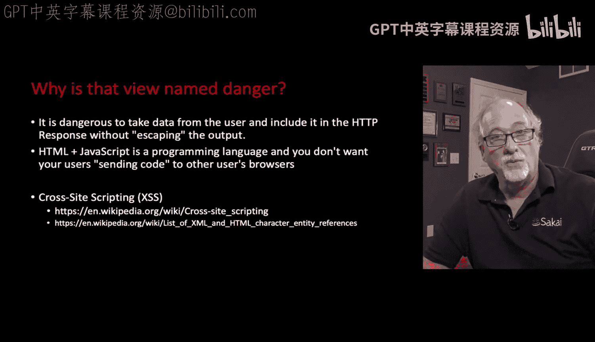

作为Web应用开发者，我们有责任创建安全的应用程序。因此，我们需要关注那些表面上看似无害，实则可能引发安全问题的代码。关键在于，我们需要理解用户数据如何被处理并最终呈现在浏览器中。

## 潜在的安全风险：跨站脚本攻击

上一节我们介绍了视图的基本概念，本节中我们来看看一个具体的安全隐患。问题通常出现在我们从用户那里获取数据时，例如通过表单或URL参数。

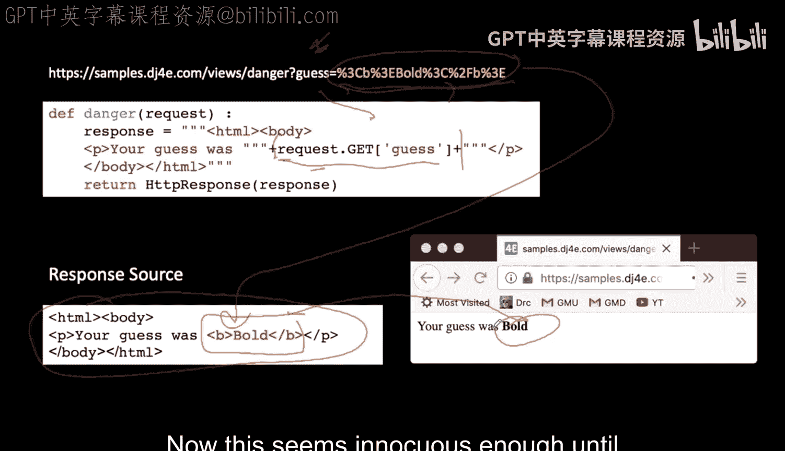

例如，我们从请求对象中获取一个名为 `guess` 的参数：
```python
guess = request.GET.get('guess', '')
```
假设用户输入了 `42`，这看起来无害。然后，我们可能直接将这个值拼接进HTML并返回给浏览器：
```python
response = f"<p>Your guess was {guess}</p>"
```

**问题在于**：如果恶意用户提交的数据本身包含HTML或JavaScript代码，会发生什么？因为HTML和JavaScript是编程语言，浏览器会执行它们。这意味着，用户可以通过向你的系统输入数据，来“编程”控制浏览器。

更严重的是，这可能导致**跨站脚本攻击**。攻击者可以将一段恶意代码存入你的系统，当其他用户查看这些数据时，他们的浏览器就会执行这段代码。这段代码可以窃取用户的Cookie、调用恶意Web服务，甚至执行如修改成绩等破坏性操作。

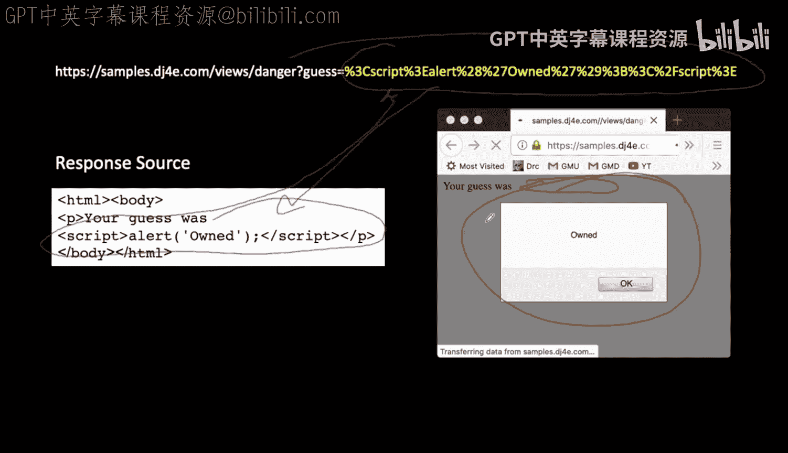

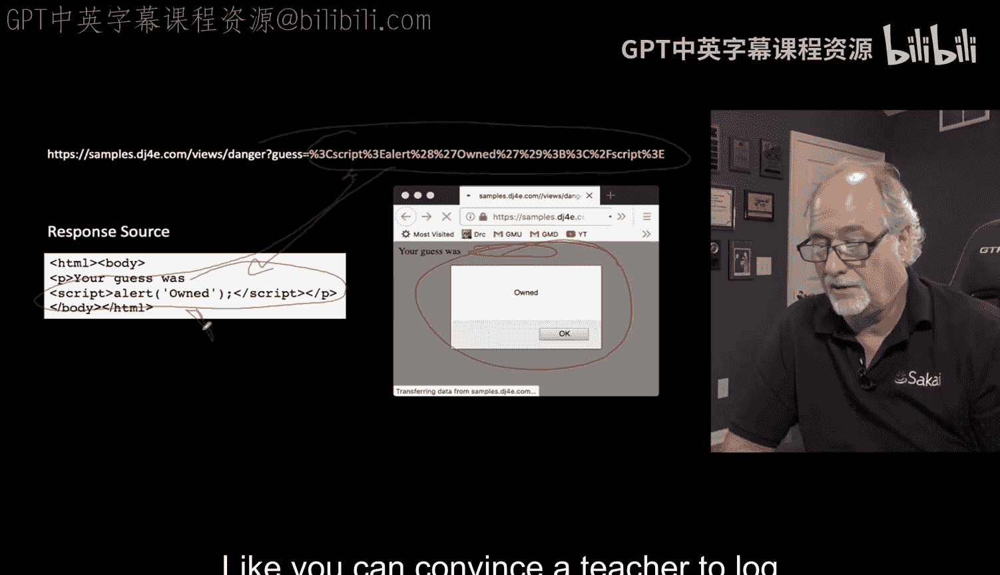

以下是一个危险的视图代码示例，它直接拼接了用户输入：
```python
# 危险示例：未转义用户输入
def bad_view(request):
    guess = request.GET.get('guess', '')
    response = f"<p>Your guess was {guess}</p>"
    return HttpResponse(response)
```
如果用户提交 `guess` 的值为 `<b>test</b>`，这段HTML会被浏览器解析，从而显示为加粗的文本。如果提交的是 `<script>alert('owned')</script>`，那么JavaScript代码将会被执行。

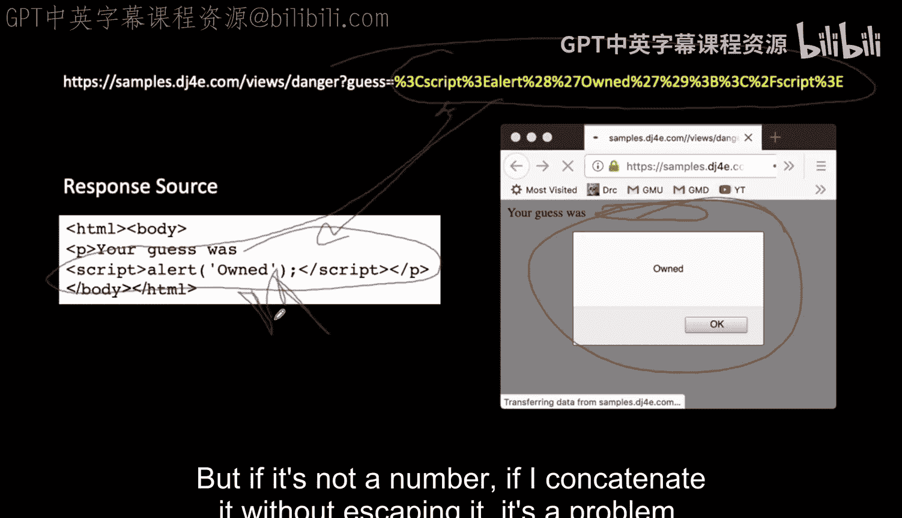

## 解决方案：HTML转义

为了防止这种攻击，我们必须对用户提供的、将要放入HTML响应的任何数据进行**转义**。转义会将危险的字符（如 `<`, `>`, `&`, `"`）转换为对应的HTML实体（如 `&lt;`, `&gt;`, `&amp;`, `&quot;`）。这样，浏览器会将它们显示为普通文本，而不会解析为代码。

Django提供了一个便捷的函数 `django.utils.html.escape()` 来完成这项工作。

以下是安全的视图代码示例：
```python
from django.utils.html import escape

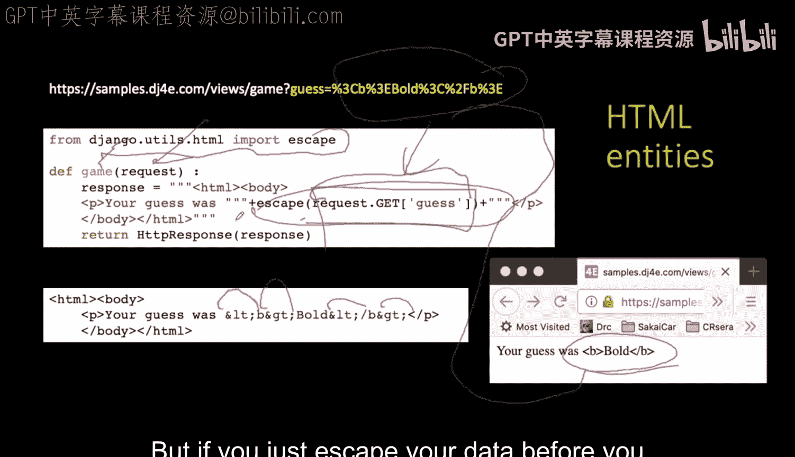

def safe_view(request):
    guess = request.GET.get('guess', '')
    # 关键步骤：转义用户输入
    safe_guess = escape(guess)
    response = f"<p>Your guess was {safe_guess}</p>"
    return HttpResponse(response)
```
经过转义后，即使用户输入 `<script>alert('owned')</script>`，它也会被转换为 `&lt;script&gt;alert('owned')&lt;/script&gt;`，从而在页面上安全地显示为文本，而不会执行。

**核心原则**：任何来自用户的数据，在放入HTML响应之前，都必须进行转义。

## 从URL路径中获取参数

除了通过 `request.GET` 获取查询参数，Django还允许我们从URL路径本身提取更美观的参数。

在 `urls.py` 中，我们可以这样定义路径：
```python
from django.urls import path
from . import views

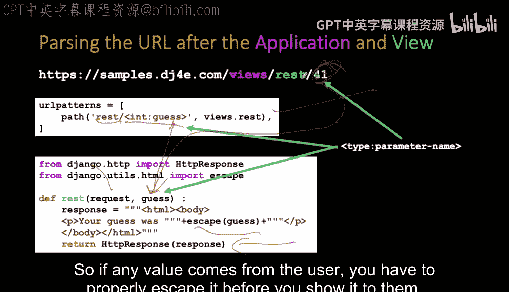

urlpatterns = [
    path('rest/<int:guess>', views.game, name='game'),
]
```
这里的 `<int:guess>` 是一个路径转换器。它告诉Django：匹配 `rest/` 后面的一个整数，并将其作为名为 `guess` 的参数传递给视图函数 `views.game`。

对应的视图函数可以这样写：
```python
def game(request, guess):  # guess 参数由Django自动从URL中提取并传入
    safe_guess = escape(str(guess))  # 同样需要转义
    response = f"<p>Your guess was {safe_guess}</p>"
    return HttpResponse(response)
```
这种方式让URL更清晰，并且将解析URL参数的工作交给了Django框架。

## 类视图简介

之前我们看到的都是函数视图，它们是相对底层的写法。Django还提供了基于类的视图，这能更好地利用面向对象的特性，如继承，从而减少重复代码并提高可维护性。

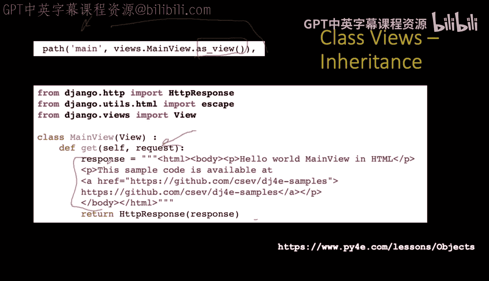

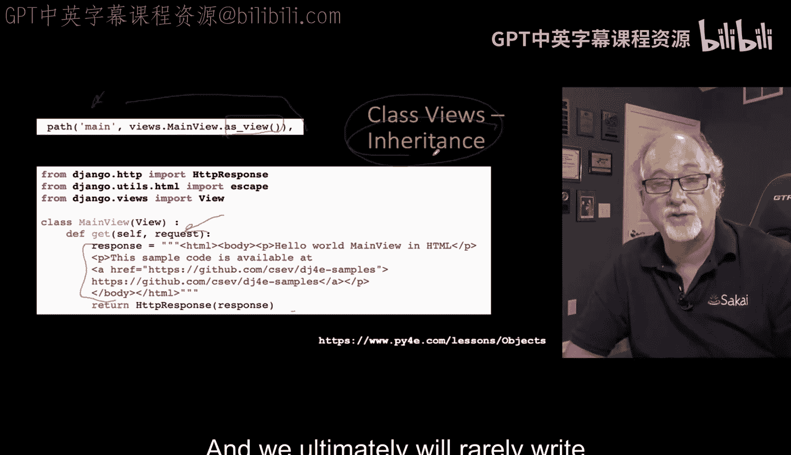

以下是一个简单的类视图示例，用于处理GET请求：
```python
from django.views import View
from django.http import HttpResponse
from django.utils.html import escape

class MainView(View):
    def get(self, request):
        return HttpResponse("This is a GET request.")
```
在 `urls.py` 中，我们需要使用 `as_view()` 方法来将类转换为视图函数：
```python
urlpatterns = [
    path('main/', views.MainView.as_view(), name='main'),
]
```
类视图的强大之处在于可以清晰地分离不同HTTP方法（如GET和POST）的处理逻辑。我们将在后续课程中深入利用类视图的继承等特性。

类视图同样可以接收URL路径参数：
```python
class RemainView(View):
    def get(self, request, guess):
        safe_guess = escape(guess)
        return HttpResponse(f"Your guess was {safe_guess}")
```
对应的URL配置：
```python
urlpatterns = [
    path('remain/<slug:guess>', views.RemainView.as_view(), name='remain'),
]
```

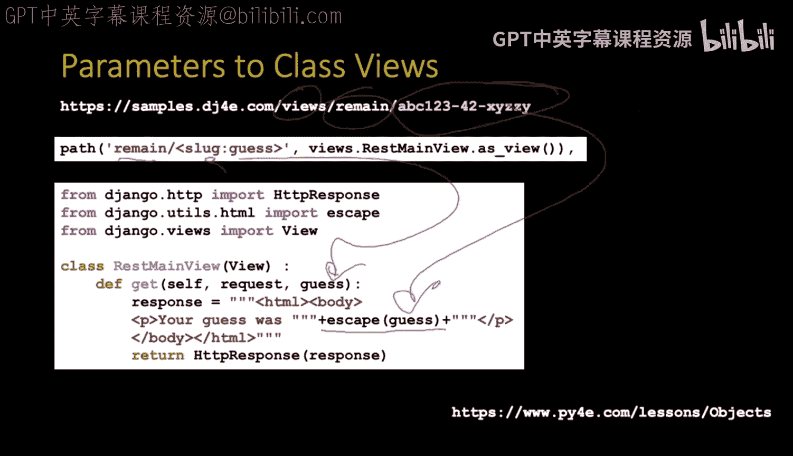

## 使用重定向响应

到目前为止，我们返回的都是包含内容的HTTP响应（状态码200）。但有时，我们不想直接返回页面，而是想告诉浏览器：“你找的地方不对，请去另一个地址”。这时就需要使用**重定向**。

重定向使用HTTP状态码302（临时重定向）或301（永久重定向），并在响应头中设置 `Location` 字段来指定目标URL。浏览器收到这种响应后，会自动跳转到新的地址。

在Django中，可以使用 `HttpResponseRedirect` 来发送重定向。

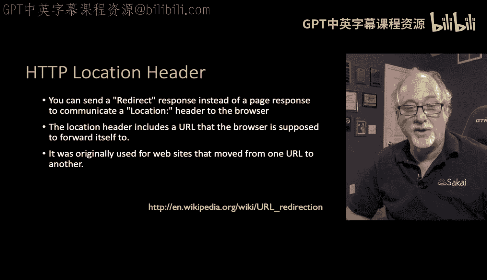

以下是重定向的视图函数示例：
```python
from django.http import HttpResponseRedirect

def bounce(request):
    # 将用户重定向到另一个URL
    return HttpResponseRedirect('https://www.example.com/simple.html')
```
在控制器（Controller）的语境下，重定向是一种强大的工具，用于在完成某些操作（如表单提交）后，将用户的浏览器引导到新的页面。

如果你在浏览器的开发者工具“网络”选项卡中观察访问 `/bounce/` 的过程，你会看到：
1.  第一个请求收到状态码 **302** 和 `Location` 头。
2.  浏览器立即自动发起第二个请求，去获取 `Location` 头指定的新URL，并返回状态码 **200**（成功）。

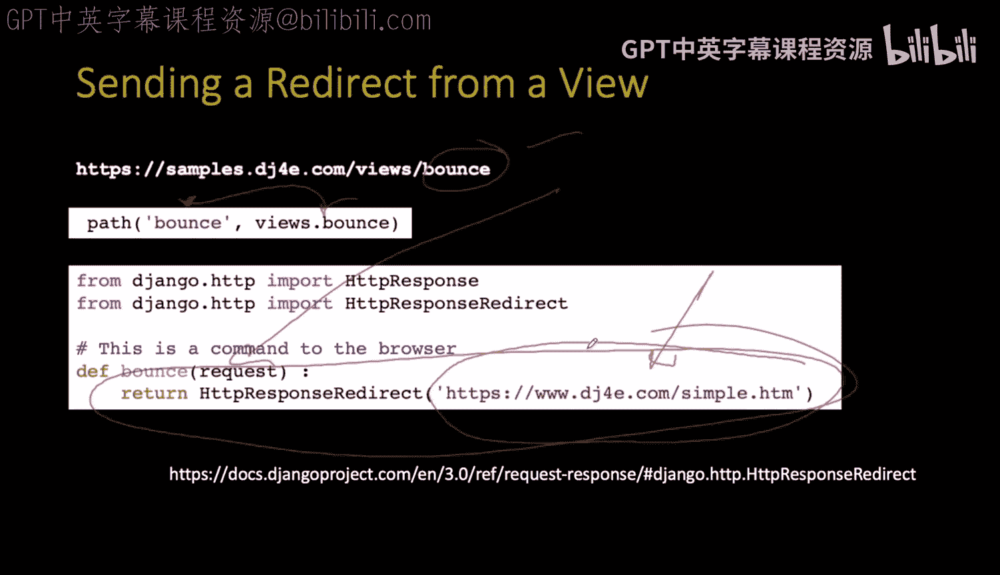

---

## 总结

本节课中我们一起学习了Django视图的几个关键方面：

1.  **安全第一**：我们深入探讨了跨站脚本攻击的原理，并学习了通过 `escape()` 函数对用户输入进行HTML转义的重要性。这是构建安全Web应用的基石。
2.  **视图类型**：我们了解了函数视图和类视图两种编写方式。类视图通过面向对象特性为后续构建复杂功能提供了更好的结构。
3.  **参数获取**：我们学习了两种从用户获取数据的方式：通过 `request.GET` 获取查询字符串参数，以及通过URL路径转换器（如 `<int:guess>`）从美观的URL中提取参数。
4.  **响应类型**：除了返回HTML内容的 `HttpResponse`，我们还学习了使用 `HttpResponseRedirect` 进行重定向，以控制用户的浏览流程。

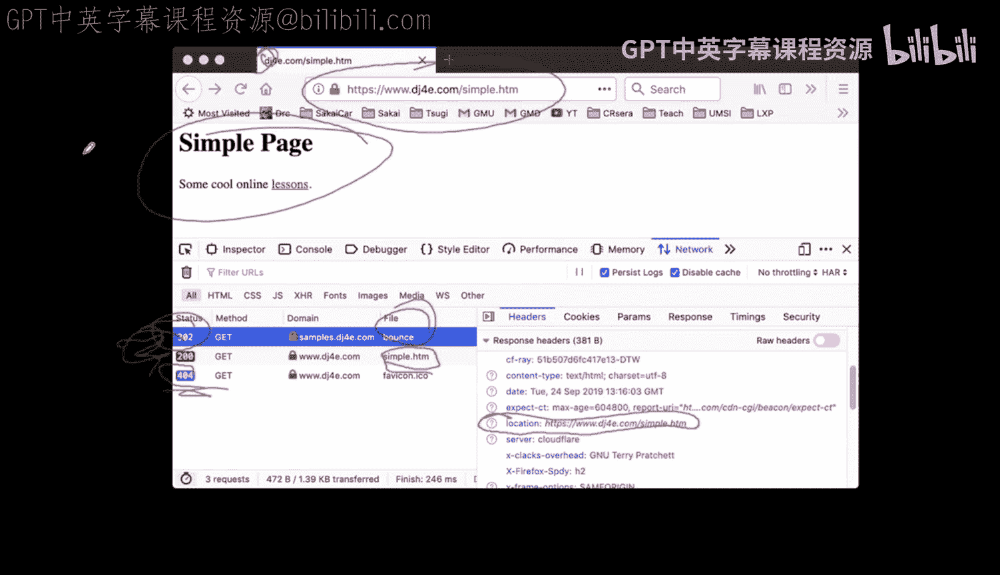

记住，始终对来自用户并即将嵌入HTML的数据进行转义，是保护你的应用和用户免受攻击的最简单有效的方法之一。在接下来的课程中，我们将学习使用模板来更优雅、更安全地生成HTML，进一步简化视图的工作。