# 039：在Django中使用模板

## 概述

在本节课中，我们将学习Django框架中的模板系统。模板是用于动态生成HTML（或其他文本格式）的强大工具，它允许我们将Python代码与网页设计清晰地分离开来。我们将了解模板的基本概念、工作原理以及如何在视图中使用它们来创建用户界面。

---

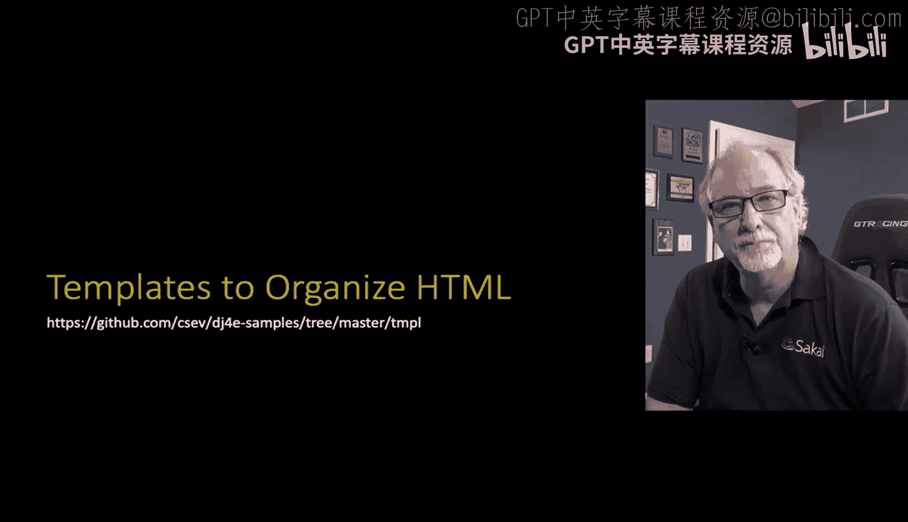

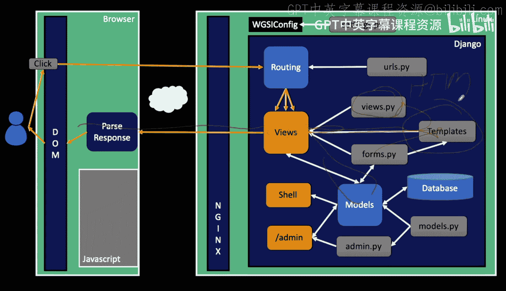

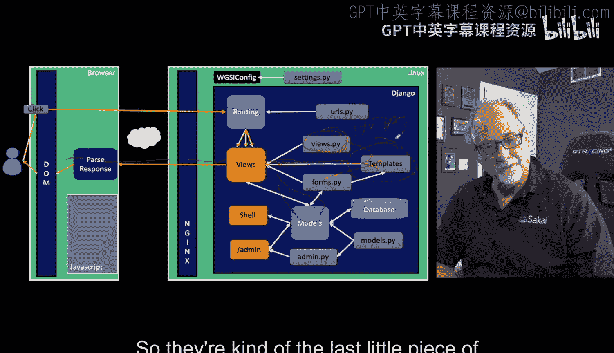

## 视图的另一半：模板

上一节我们介绍了视图（Views），它是处理请求并返回响应的Python代码。本节中我们来看看视图的另一半——模板（Templates）。模板是一种创建HTML的方式，它构成了Django应用用户界面的最后一块拼图。从此刻起，我们将开始构建用户界面，而不仅仅是介绍Django应用的各个部分。

根据Django官网的描述，模板提供了一种动态生成HTML的便捷方式。Django内置了一个默认的模板引擎。其基本流程是：我们将数据传递给模板，这个过程称为“渲染”（rendering），然后引擎会生成最终的HTML，我们将其封装在HTTP响应中返回给浏览器。请求-响应循环本身没有改变，改变的是我们不再使用Python代码拼接字符串，而是使用模板引擎。

以下是我们之前一直在做的事情：在视图类中，我们接收请求对象，可能还有一些其他参数，然后通过字符串拼接和转义来生成HTML响应。

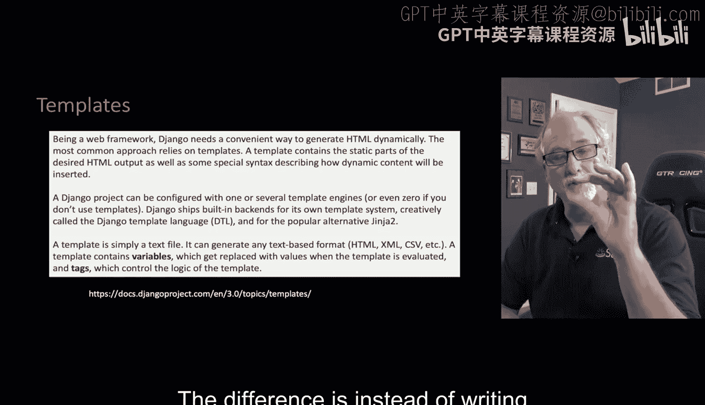

```python
# 示例：使用字符串拼接的视图
def my_view(request):
    html = "<html><body>Your guess was: " + str(guess) + "</body></html>"
    return HttpResponse(html)
```

这种方法存在一些问题：需要确保语法正确、处理缩进问题、混合使用单引号和双引号等，代码会变得冗长且难以维护。

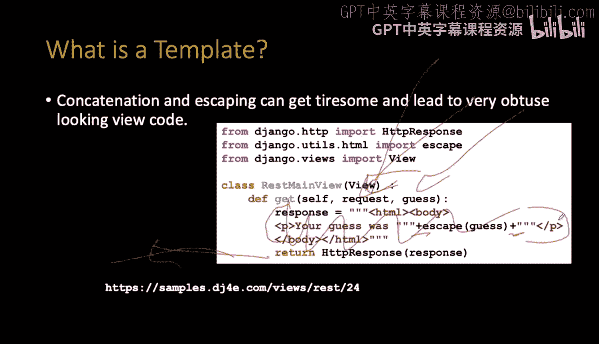

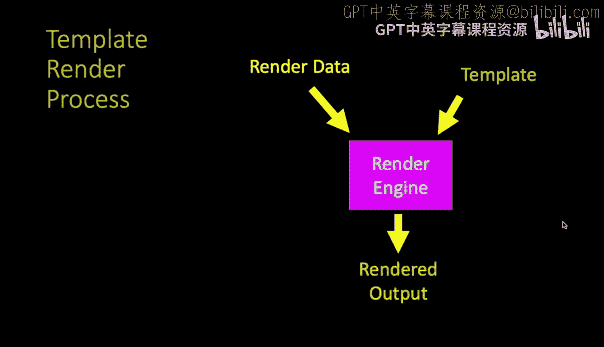

---

## 模板的基本原理

模板的基本原理是使用一段软件（即Django提供的模板引擎）。一个模板本质上是一个包含了一些“热点”（hotspots）的HTML文件，这些热点指示“在此处插入数据”。其余部分则是普通的静态HTML。

我们通过一个对象（通常是字典）将数据传递给模板。然后，一段代码（渲染引擎）会将所有内容组合起来，生成嵌入了数据的最终HTML。我们传递的渲染数据通常来自模型（Model），例如从数据库加载的记录。

在最简单的形式中，我们有一个称为“上下文”（context）的字典，它包含键值对。模板则是包含特殊标记的HTML。

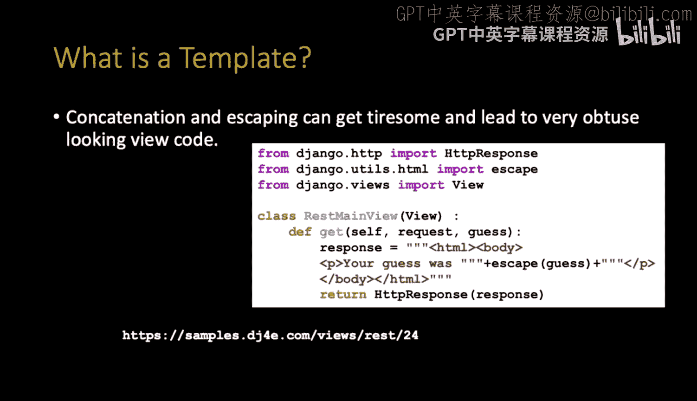

```python
# 上下文数据示例
context = {'guess': 200}
```

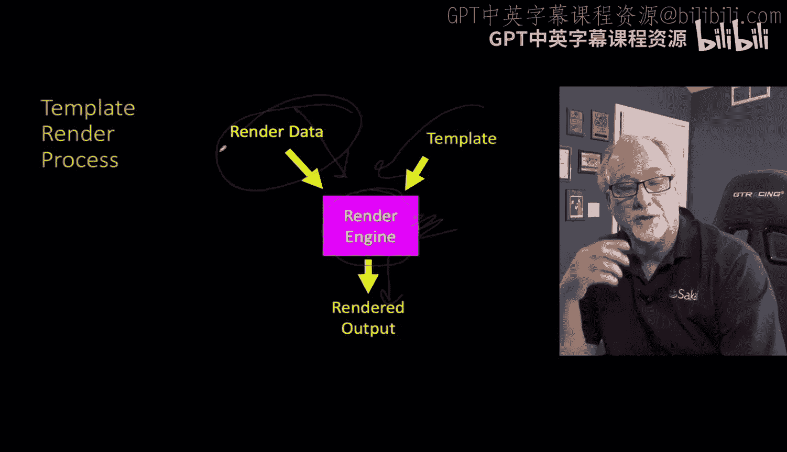

```html
<!-- 模板示例 (guess.html) -->
<p>Your guess was {{ guess }}</p>
```

双花括号 `{{ }}` 是模板语言的特殊标记。它表示：“将此标记替换为上下文字典中对应键的值”。因此，在最终输出中，`{{ guess }}` 会被替换为数字 `200`。你可以想象编写一个简单的函数来实现这种替换，但Django已经为我们实现了功能更强大的引擎。

---

## 模板实战：一个猜数字示例

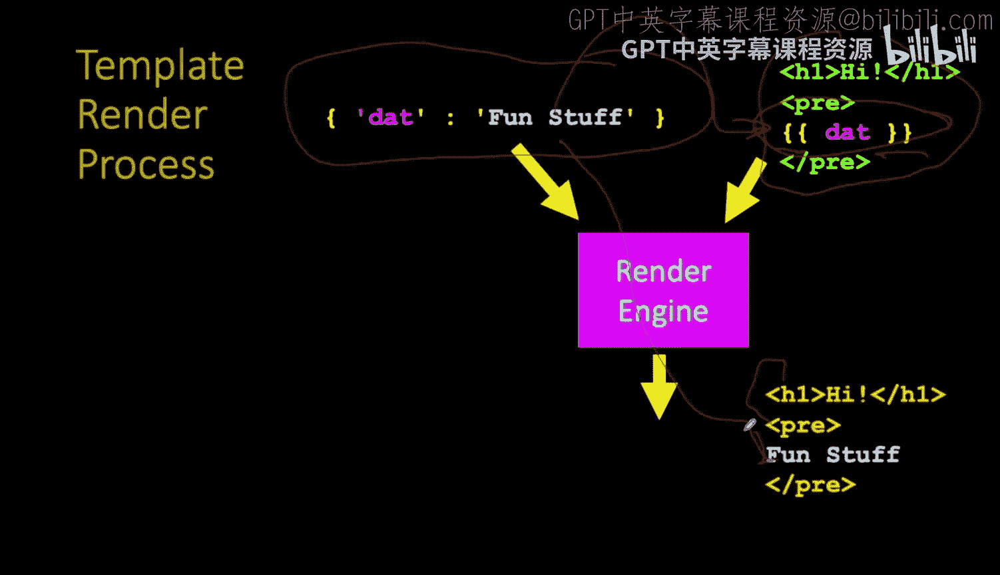

让我们看一个实际的代码示例。我们有一个名为 `Tmpl` 的应用，其中包含一个视图函数 `game`，它接收一个参数（猜测的数字）。

```python
# views.py 中的视图函数
from django.shortcuts import render

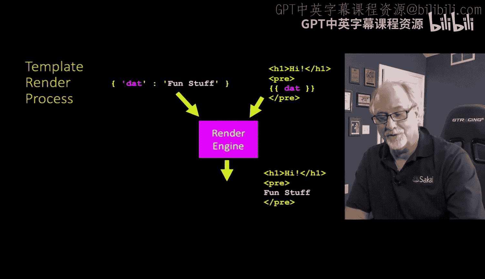

def game(request, guess):
    # 将URL中的参数转换为整数
    guess_int = int(guess)
    # 创建上下文字典
    context = {'guess': guess_int}
    # 渲染模板并返回响应
    return render(request, 'tmpl/game.html', context)
```

视图函数接收 `request` 对象和从URL捕获的 `guess` 参数。我们创建了一个上下文字典，其中键 `'guess'` 对应转换后的整数值。然后，我们调用 `render()` 函数，传入请求对象、模板名称和上下文数据。`render()` 函数会处理所有替换工作，并返回一个可以直接返回给浏览器的 `HttpResponse` 对象。

现在，让我们看看对应的模板文件 `game.html`：

```html
<!-- templates/tmpl/game.html -->
<p>Your guess was {{ guess }}.</p>

    <p>Too low!</p>

    <p>Too high!</p>

    <p>Just right!</p>

```

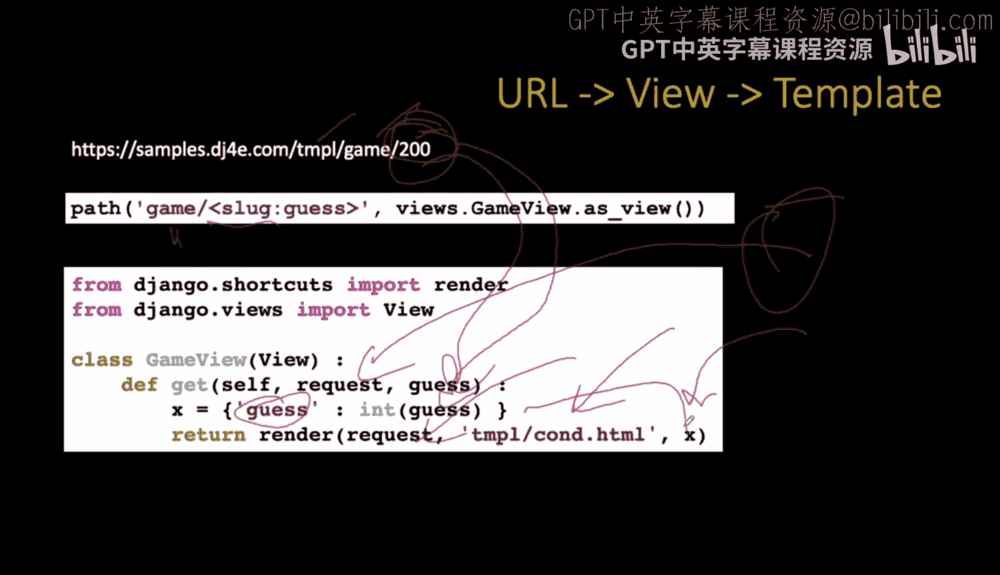

模板中有两种主要标记：
1.  **双花括号 `{{ }}`**：用于输出变量的值。例如 `{{ guess }}` 会输出传递进来的猜测数字。
2.  **花括号百分号 ``**：用于包含模板标签，实现逻辑控制，如 `if`、`for` 循环等。在这个例子中，我们根据 `guess` 的值判断其与目标数字42的关系，并输出相应的提示信息。

如果传入的 `guess` 是200，那么渲染后的HTML将是：“Your guess was 200. Too high!”。

这种方法使视图代码变得非常简洁，避免了在Python代码中混合HTML和逻辑判断。

---

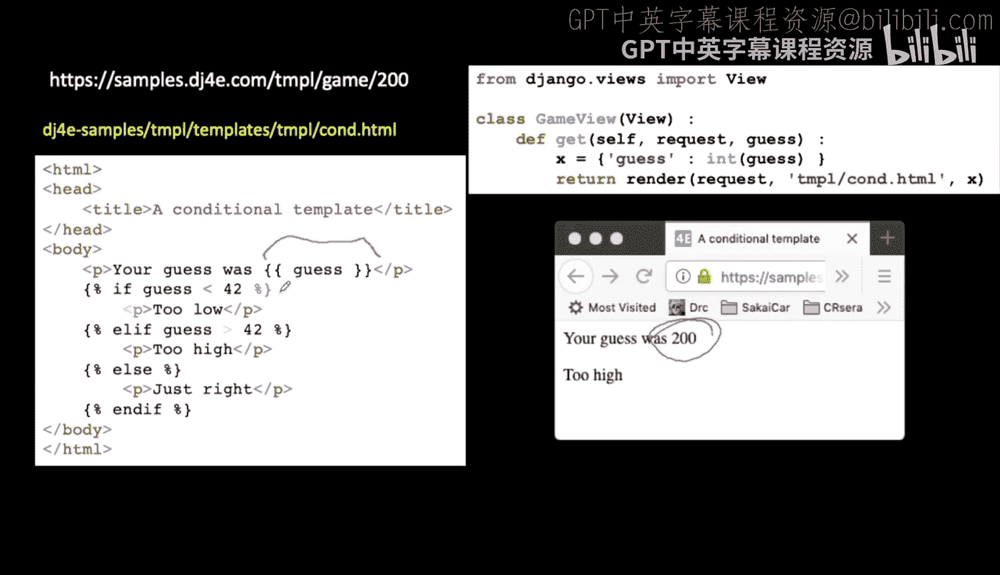

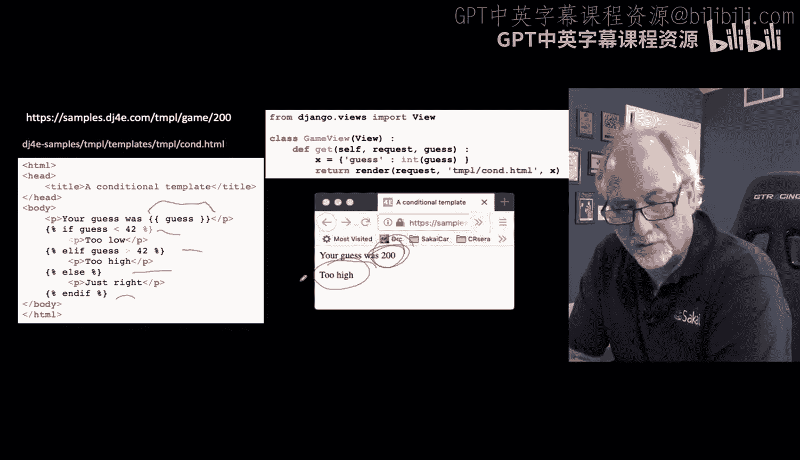

## 模板的存放与命名约定

一个Django项目由一个或多个应用（app）组成。当Django启动时，它会根据 `settings.py` 中的配置加载所有应用的文件。

这里有一个重要概念：**模板名称在整个Django项目中是全局的**。这意味着，如果你在多个不同的应用中都有一个名为 `detail.html` 的模板，Django将无法区分应该使用哪一个。

为了解决这个命名冲突问题，我们采用了一个通用约定：

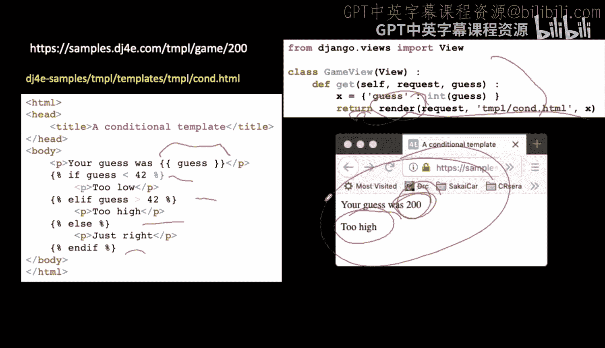

1.  在每个应用的 `templates` 目录下，再创建一个与该应用同名的子文件夹。
2.  将模板文件放在这个子文件夹中。
3.  在视图里引用模板时，使用 `app_name/template_name.html` 的格式。

例如，对于我们的 `Tmpl` 应用：
*   模板文件路径应为：`tmpl/templates/tmpl/game.html`
*   在 `render()` 函数中，模板名称应写为：`'tmpl/game.html'`

虽然这看起来有些重复（应用名出现了两次），但这是必要的，它能确保在大型项目中模板名称的唯一性。这是Django社区的通用做法。

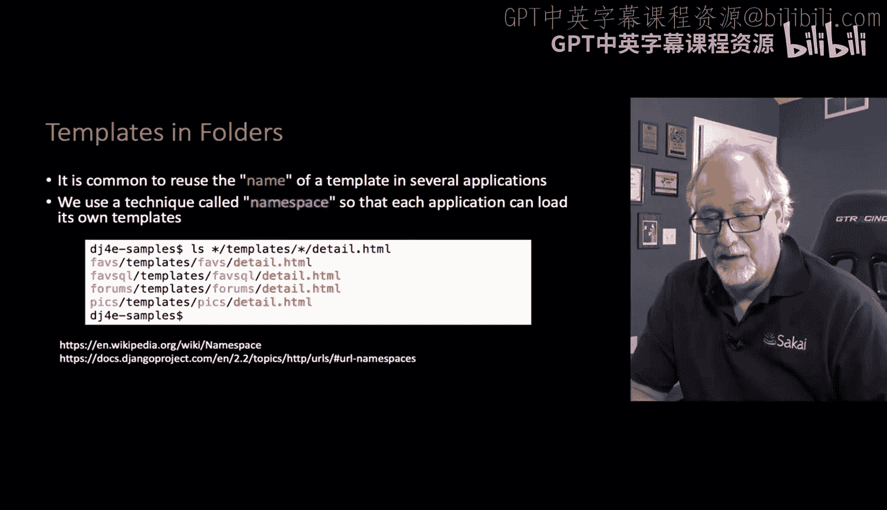

---

## 模板语言功能简介

我们之前已经看到了模板语言的两个核心功能：变量替换和逻辑控制。实际上，Django模板语言的功能远不止这些。

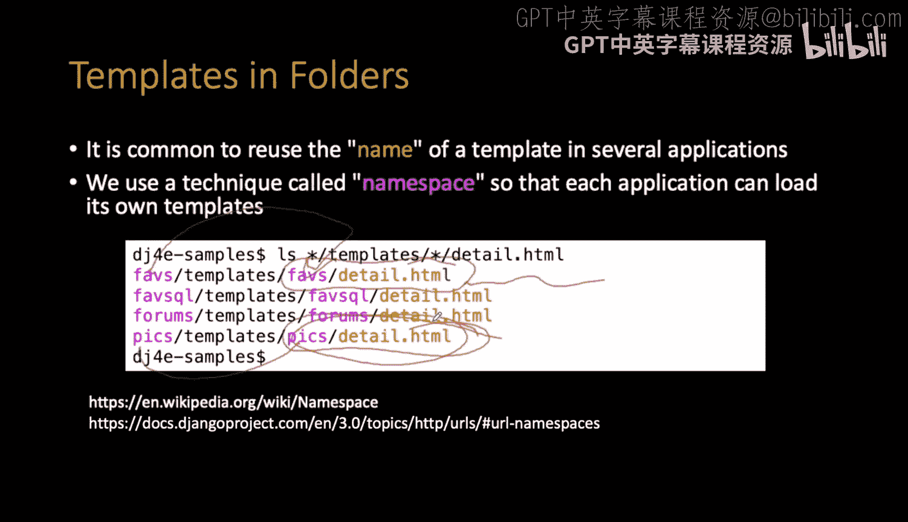

以下是模板语言的一些关键特性：
*   **变量**：使用 `{{ variable_name }}` 访问并显示上下文中的变量。
*   **标签**：使用 `` 执行逻辑操作。例如：
    *   `` ... `` 用于循环。
    *   `` ... `` 用于条件判断。
    *   `` 用于生成URL。
    *   `` 用于添加CSRF令牌（后续课程会涉及）。
*   **过滤器**：可以在变量输出前对其进行修改，语法是 `{{ variable|filter }}`。例如：
    *   `{{ name|lower }}` 将变量转换为小写。
    *   `{{ value|length }}` 获取列表或字符串的长度。
    *   `{{ date|date:"Y-m-d" }}` 格式化日期。

这些功能使得我们能够在模板中处理大部分展示逻辑，保持视图代码专注于业务逻辑和数据准备。

---

## 总结

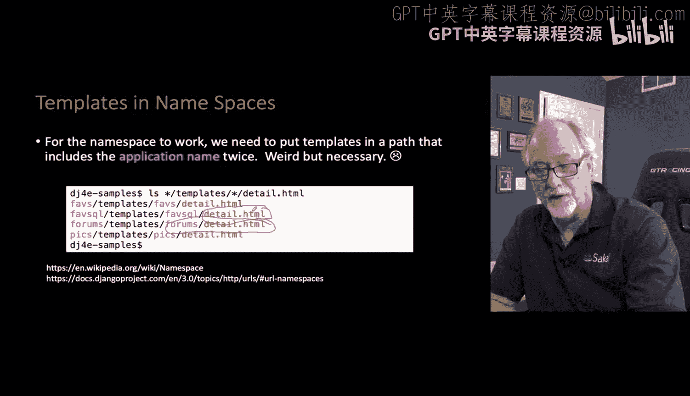

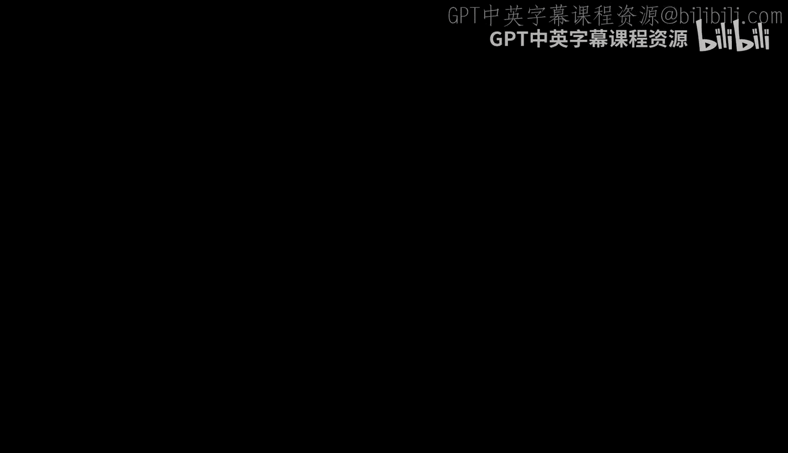

本节课中我们一起学习了Django模板系统。我们了解到模板是用于分离业务逻辑和展示层的关键组件，它通过特殊的语法（`{{ }}` 和 ``）将动态数据嵌入到静态的HTML骨架中。我们掌握了如何在视图中使用 `render()` 函数来结合上下文数据与模板，并理解了由于模板名称的全局性，需要遵循 `app_name/template_name.html` 的命名约定来组织模板文件。模板语言提供的变量、标签和过滤器等功能，为我们构建动态、灵活的用户界面奠定了坚实的基础。从下一节开始，我们将利用这些知识创建更复杂的网页应用。