# 049：Python赋值语句的真实故事


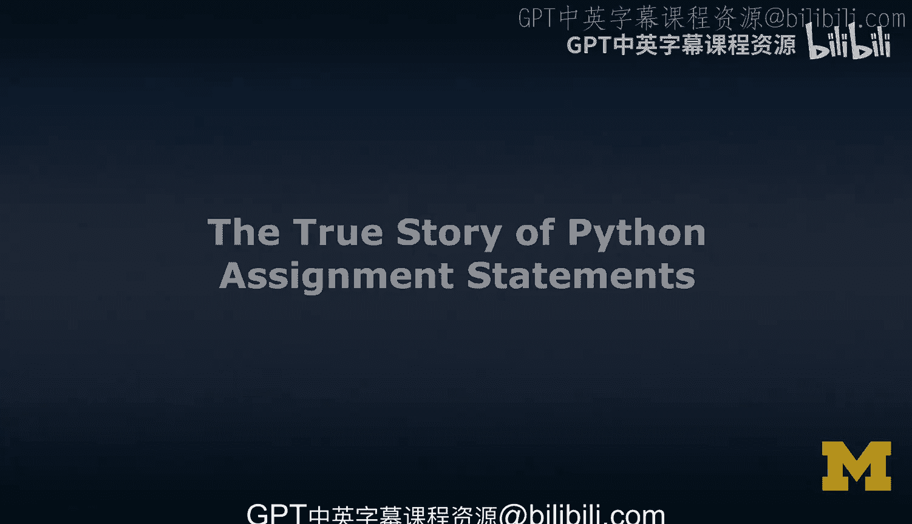


在本节课中，我们将要学习Python中变量和赋值语句的真实工作原理。我们将从一个常见的简化模型开始，然后深入探讨Python内部实际使用的“指针”或“引用”模型，并通过代码示例来理解其行为。

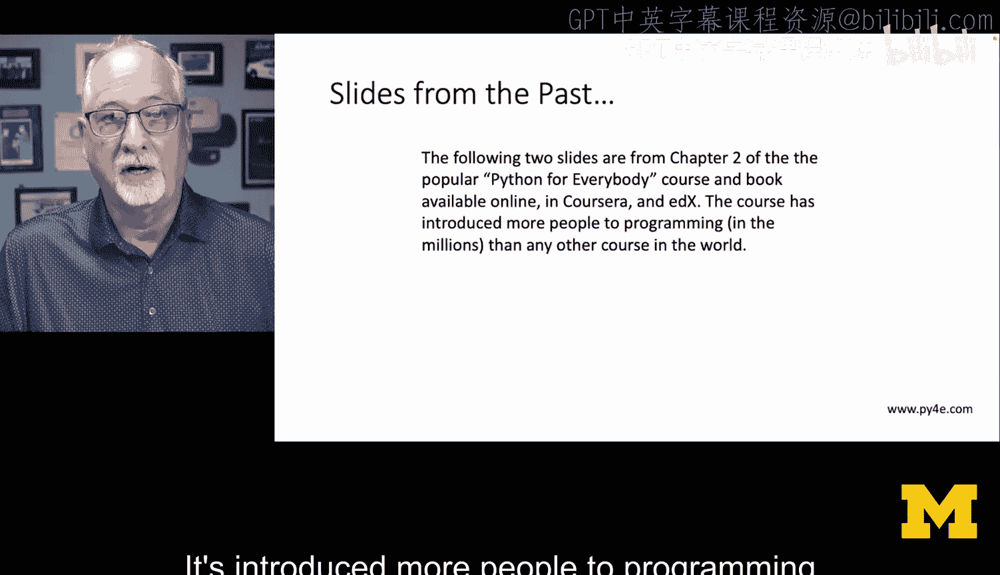

## 概述

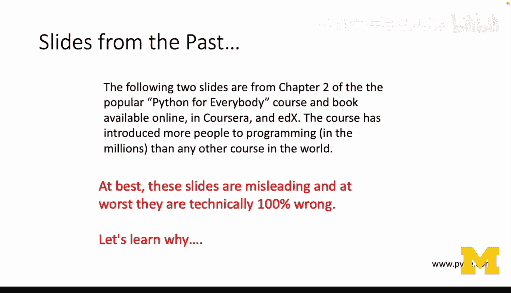

许多入门教程，包括我自己的《Python for Everybody》课程，都使用了一个简化的“抽屉”模型来解释变量。这个模型虽然易于理解，但并未准确反映Python在内存中处理变量的真实方式。本节课程将揭示这个真相，解释Python变量实际上是对象的引用，并展示这如何影响我们的代码。

## 从简化的“抽屉”模型说起

上一节我们提到了一个常见的入门解释。以下是该模型的核心观点：

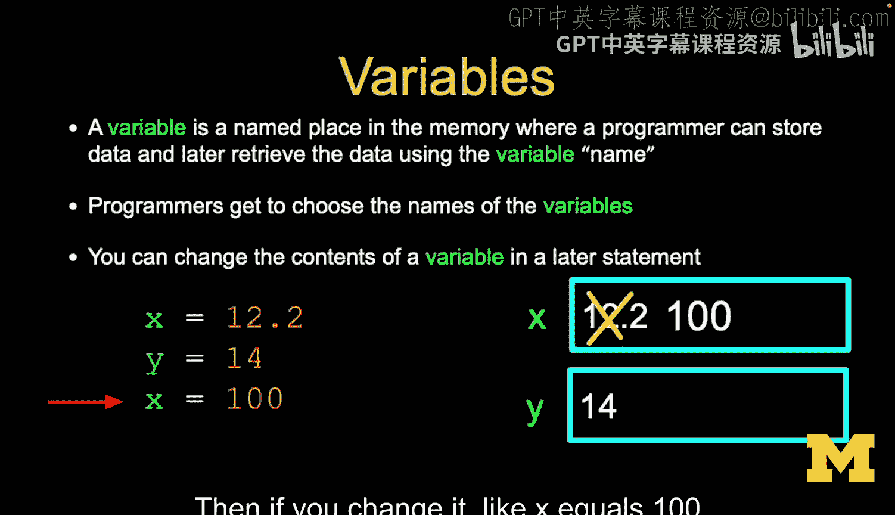

*   变量是内存中一个被命名的位置，程序员可以在此存储数据，之后通过变量名来检索。
*   程序员可以选择变量名。它们就像是内存位置的标签。
*   可以在后续语句中更改变量的内容。

例如，`x = 12` 就像在一个标签为 `x` 的抽屉里放入数字12。`x = 14` 则用数字14替换了抽屉里的内容。

## 揭示真相：Python变量是对象的引用

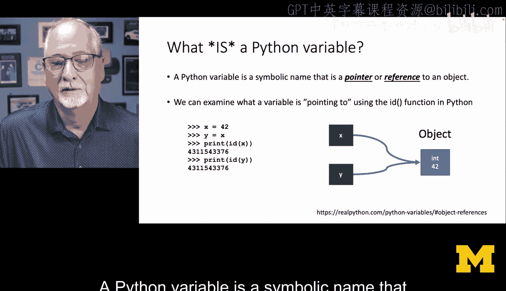

然而，上述“抽屉”模型并不完全正确。本节中我们来看看Python内部实际发生的情况。

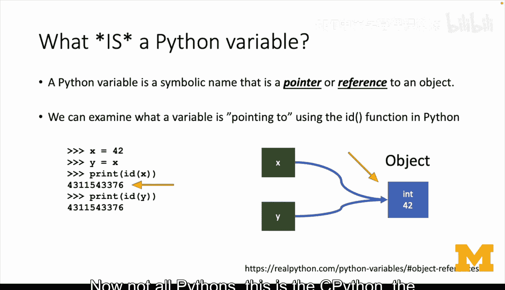

一个Python变量是一个符号名称，它是一个指向某个对象的**指针**或**引用**。

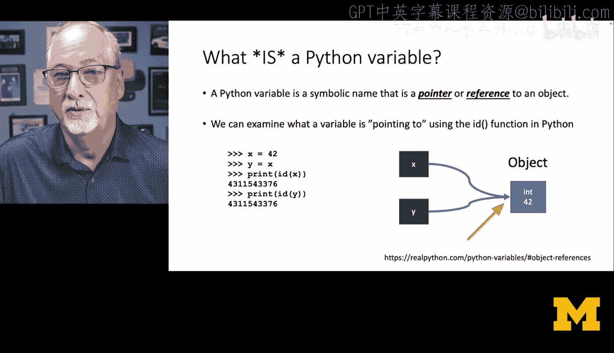

我们可以使用内置的 `id()` 函数来查看变量指向的内存地址。以下代码演示了这一点：

```python
x = 42
y = x
print(id(x))  # 输出 x 指向的内存地址
print(id(y))  # 输出 y 指向的内存地址，你会发现它与 id(x) 相同
```

运行这段代码，你会发现 `x` 和 `y` 的 `id` 是相同的。这说明我们并没有两个独立的“42”，而是有两个指针 `x` 和 `y` 指向了内存中同一个 `42` 对象。

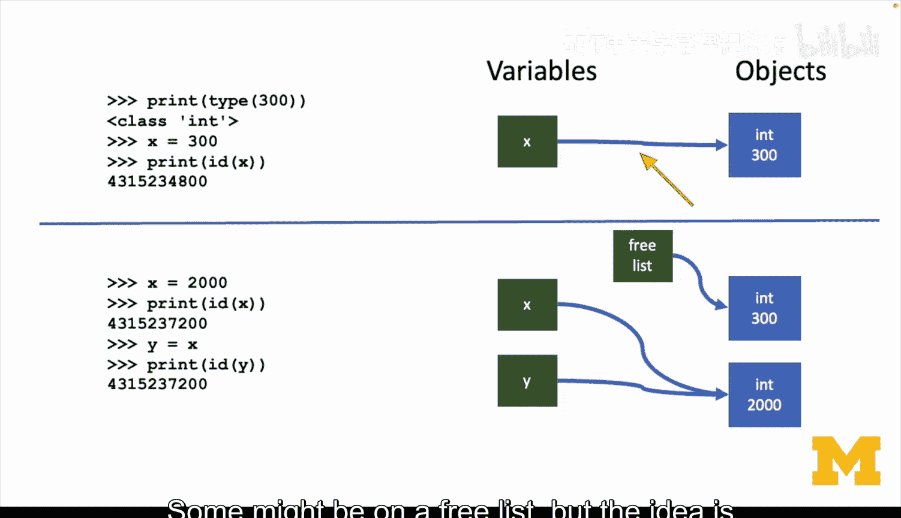

当我们执行 `x = 2000` 时，并不是改变了原来那个“42”抽屉里的内容，而是让 `x` 这个指针指向了内存中另一个新创建的 `2000` 对象。原来的 `42` 对象可能还在内存中（例如在“空闲列表”上），但 `x` 已经不再指向它了。

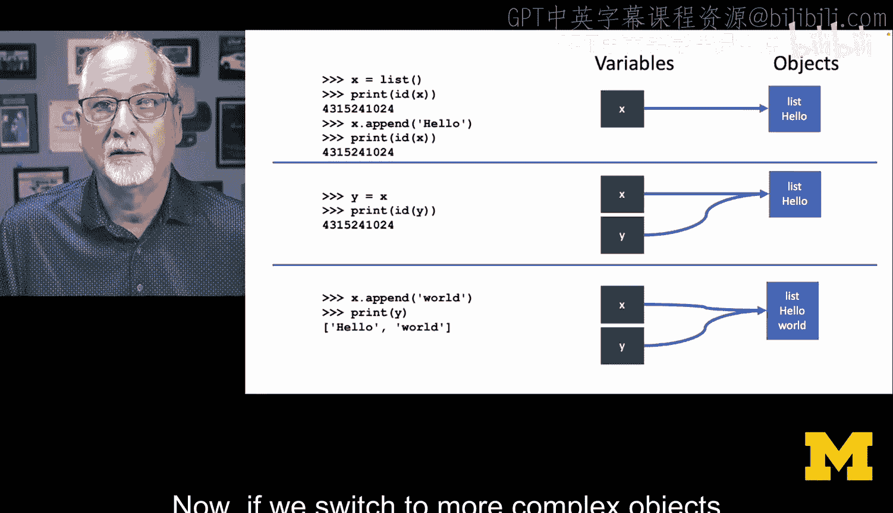

同样，`y = x` 这个语句并不是将 `x` 指向的对象复制一份给 `y`，而是让 `y` 也指向 `x` 当前所指的同一个对象地址。

## 复杂对象（如列表）的行为

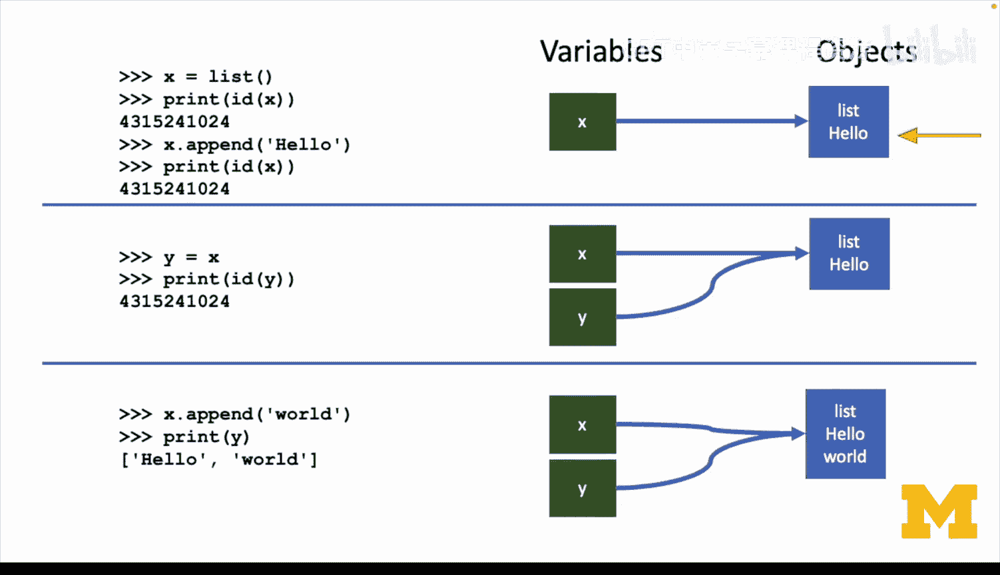

对于列表这样的可变对象，引用模型带来的影响会更加明显。

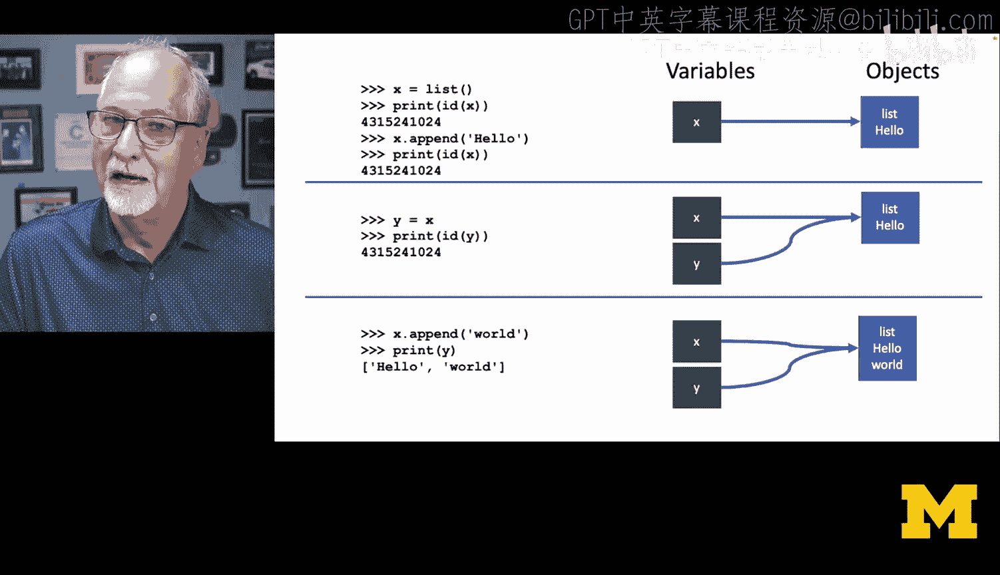

```python
x = []          # 创建一个空列表对象，x 指向它
print(id(x))    # 输出列表对象的地址
x.append('hello') # 修改列表对象的内容
print(id(x))    # 地址没有改变，x 仍然指向同一个列表对象

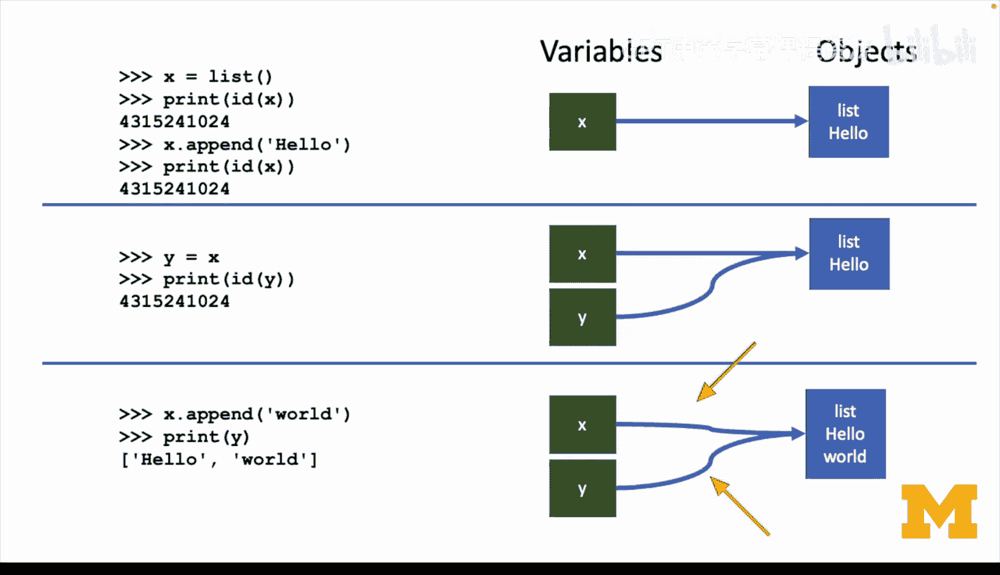

y = x           # y 指向与 x 相同的列表对象
x.append('world')
print(y)        # 输出：['hello', 'world']，因为 y 和 x 指向同一个列表
```

这里，`y = x` 并没有创建列表的副本，它只是增加了一个指向同一列表的新引用 `y`。因此，通过 `x` 修改列表，通过 `y` 也能看到变化。

## 如何创建真正的副本

有时我们需要一个对象的独立副本。以下是创建列表副本的方法：

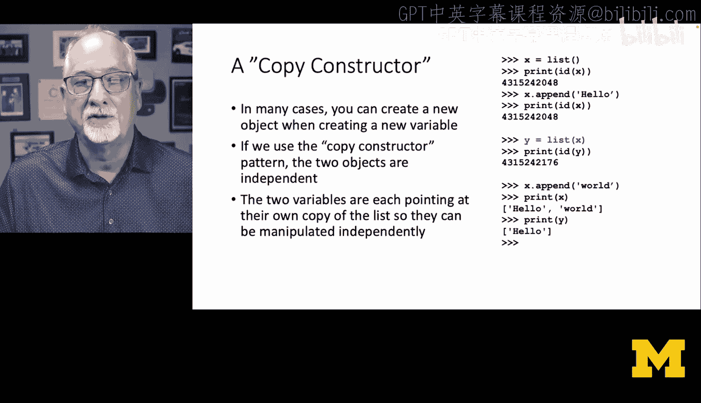

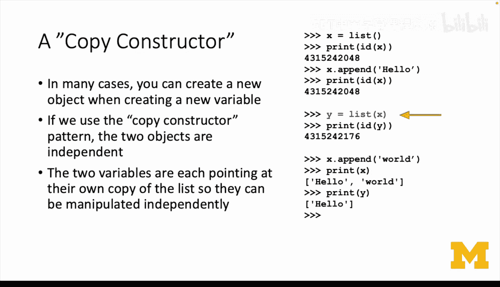

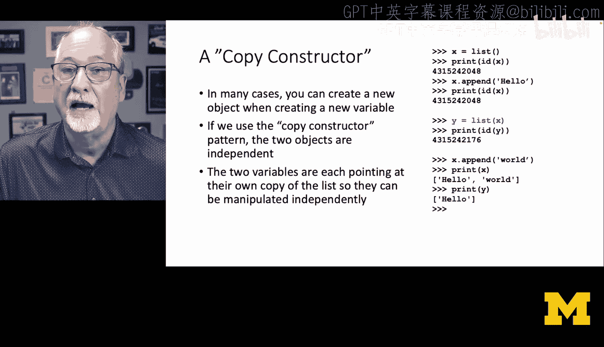

```python
x = ['hello']
print(id(x))

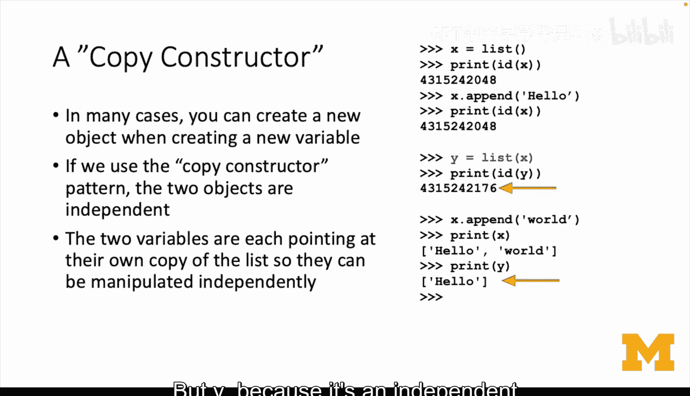

# 使用 list() 构造函数创建副本
y = list(x)     # 遍历 x 中的元素，创建一个包含相同元素的新列表对象
print(id(y))    # y 的地址与 x 不同，它是一个独立的对象

x.append('world')
print(x)        # 输出：['hello', 'world']
print(y)        # 输出：['hello']，y 不受影响
```

`y = list(x)` 这种方式被称为**复制构造函数**。它会创建一个全新的列表对象，并将原列表中的元素复制过来，从而使 `y` 成为一个独立的副本。

## 为何存在简化模型

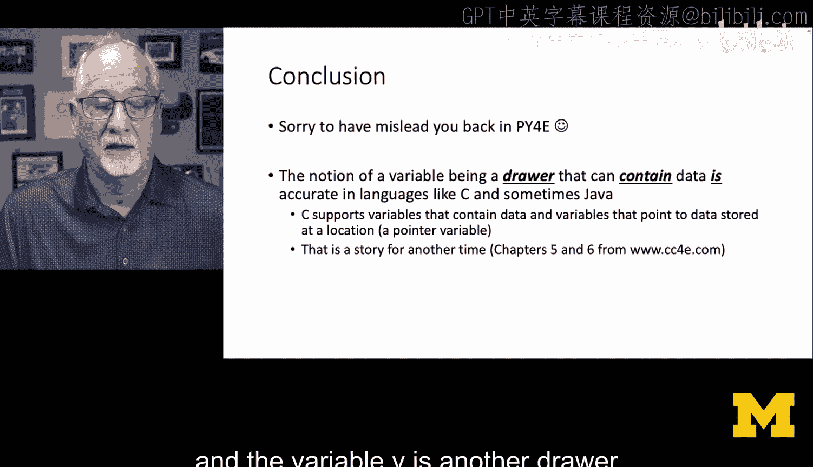

像C、Fortran这类语言，其变量模型更接近“抽屉”模型，变量名直接对应一块固定的内存空间。Python底层是用C语言实现的，在C代码中，明确区分指针和指针所指的数据是非常自然的。Python将“指针”的概念对初学者隐藏了起来，以降低入门门槛。但理解其引用本质，对于掌握Python的高级特性（如可变对象传递、浅拷贝与深拷贝等）至关重要。

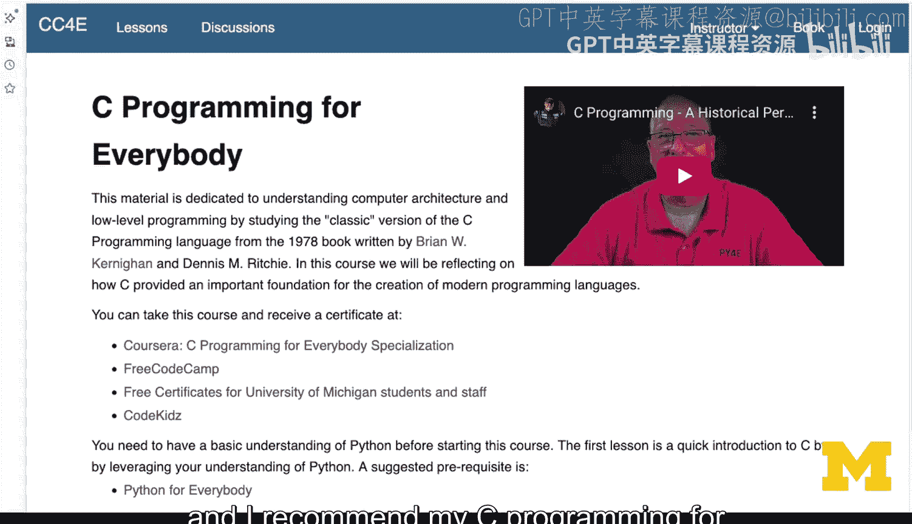

## 总结

本节课中我们一起学习了Python赋值语句的真实故事。
*   Python变量不是存储数据的“抽屉”，而是指向内存中对象的**引用**（指针）。
*   `y = x` 这样的赋值语句，是让 `y` 指向 `x` 所指向的**同一个对象**，而非创建副本。
*   对于可变对象（如列表），多个引用指向同一对象会导致修改相互影响。
*   可以使用 `id()` 函数查看对象的内存地址，辅助理解引用关系。
*   需要独立副本时，应使用复制构造函数（如 `list()`）或其他拷贝方法。


理解这个“引用模型”是深入掌握Python编程的关键一步。虽然入门时的简化模型有助于快速上手，但了解真相能让你写出更准确、更高效的代码。