# 051：Django通用视图 🚀

在本节课中，我们将要学习Django通用视图。通用视图是一种强大的工具，可以让我们用极少的代码创建常见的网页功能，例如显示列表或详细内容。我们将探讨如何利用通用视图来避免代码重复，并保持应用的一致性。

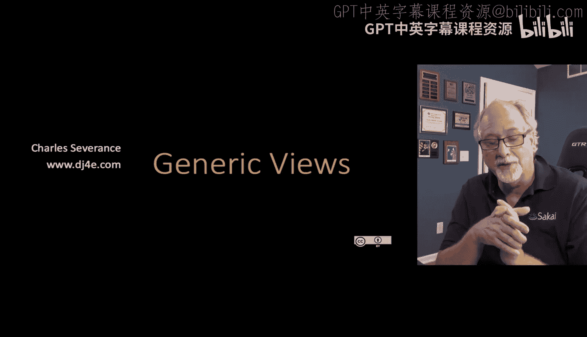

---

上一节我们介绍了模板继承，本节中我们来看看视图的继承。我们一直在使用视图，但现在是时候深入了解如何通过继承来创建更简洁、更强大的视图了。

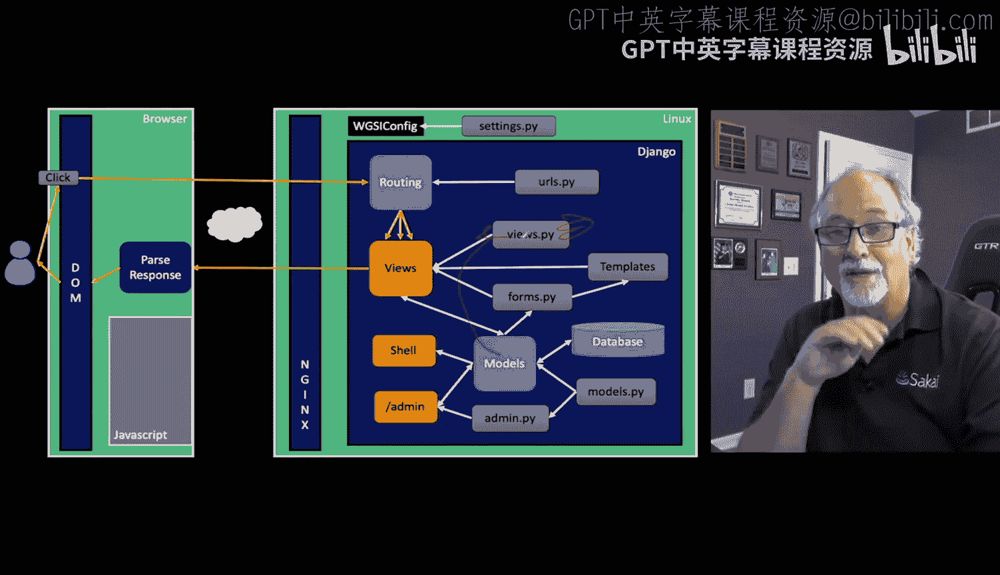

我们位于`views.py`文件中。这里定义的视图很大程度上受到`models.py`内容的影响。这意味着视图可以根据模型中的数据自动构建。

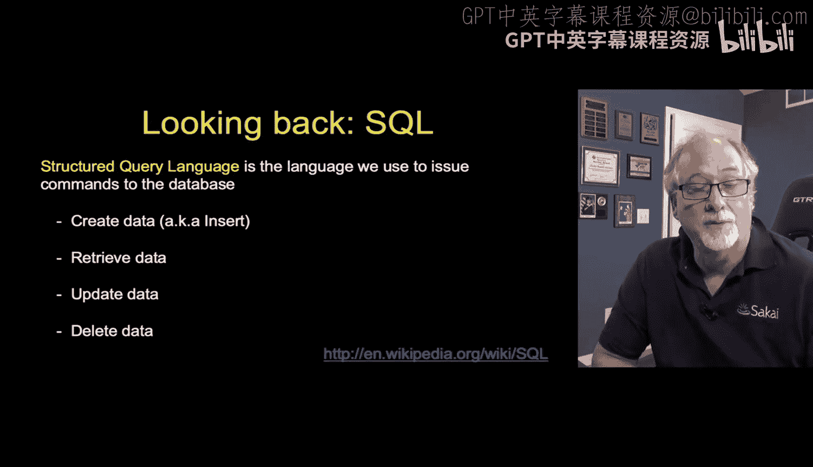

只需查看`models.py`中的数据即可。这再次体现了“不要重复自己”的原则。如果你在`models.py`中定义了字段、帮助文本或字段描述，这些信息不仅用于数据库，还可以用于视图。你会看到这一切是如何完美结合的。但有时，当我们使用这些高级技术时，最终得到的代码量非常少。深刻理解这少量代码至关重要，因为它可能巧妙地重用了大量其他代码，并从其他地方引入了功能。

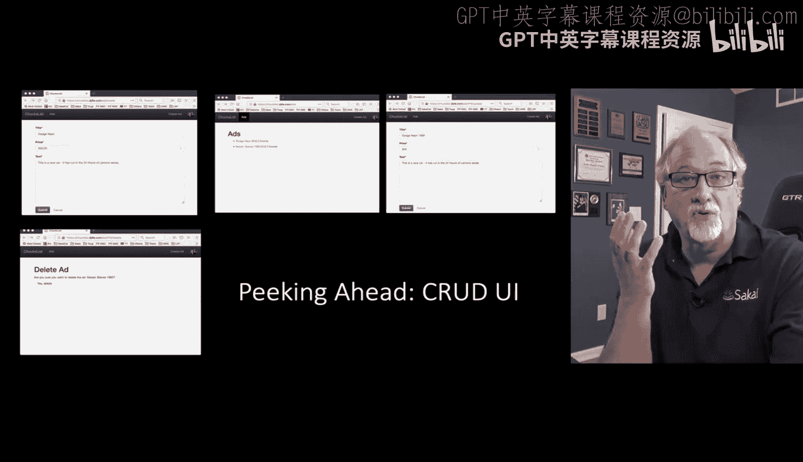

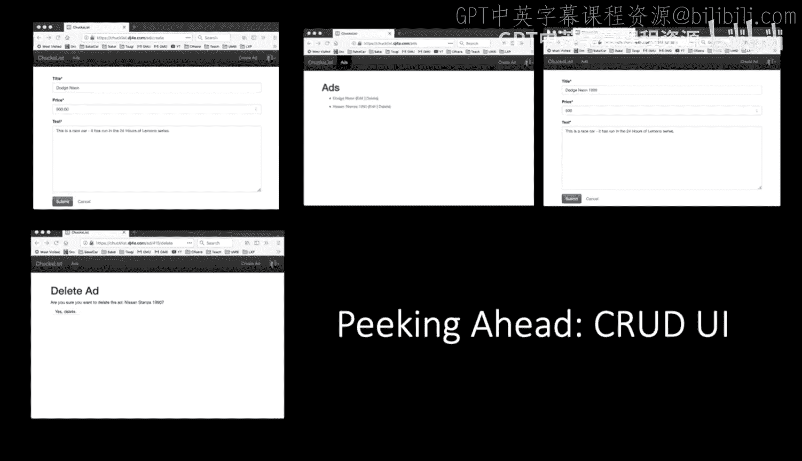

回顾我们讨论过的SQL，四个基本操作是：向数据库插入数据、从数据库读取数据、更新数据和删除数据。这通常被称为CRUD：**Create**（创建）、**Read**（读取）、**Update**（更新）和**Delete**（删除）。

我们将构建许多功能，无论是广告、汽车还是其他内容。我们需要插入一辆汽车、更新一辆汽车、删除一辆汽车、列出所有汽车、插入一只猫、删除一只猫、列出所有猫、更新一只猫等等。我们将反复构建这些用户界面。在你自己的项目中，可能会有四五个表，每个表都有类似的CRUD用户界面。有时你会对它们进行一些定制，使其看起来不同，但很多时候它们看起来都一样，导致我们重复编写代码，而这是软件开发中应该避免的。

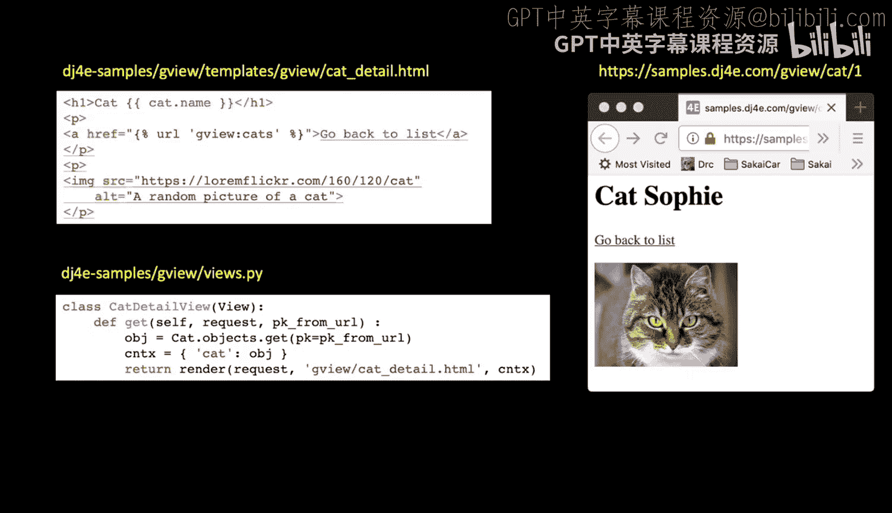

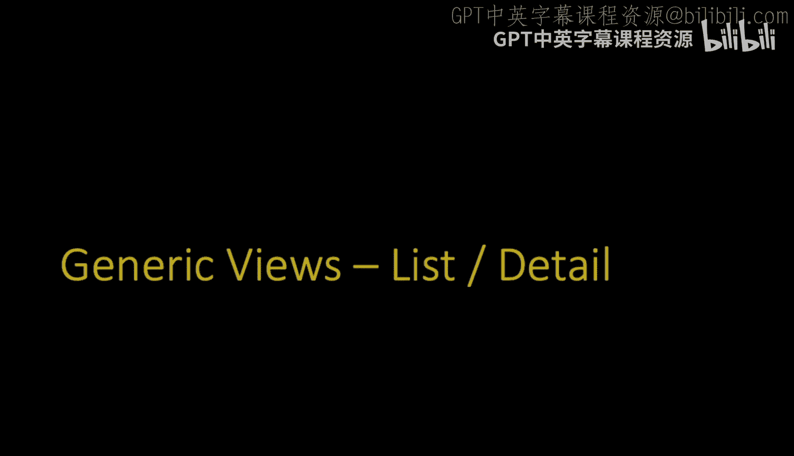

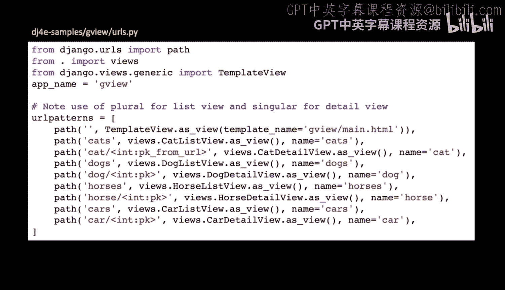

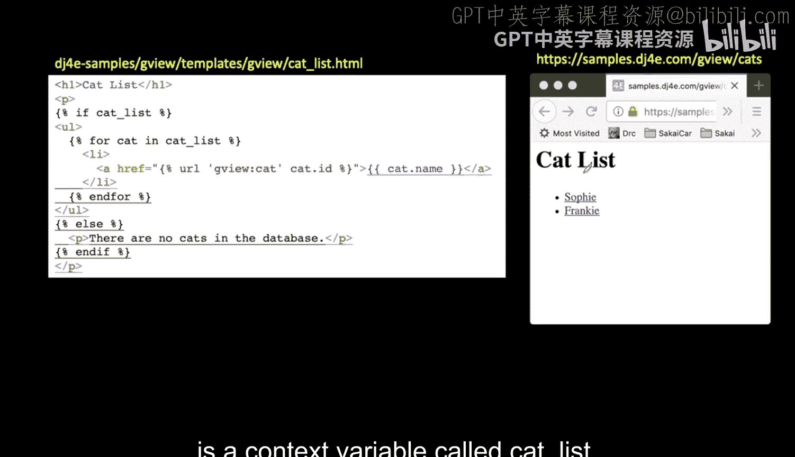

这里有一个简单的CRUD应用示例。它目前只包含读取和详情功能。我们有一个猫的列表，点击列表中的猫，可以看到特定猫的详细信息，然后有一个返回列表的链接。这就像一个详情页面。但我们将要做的不止这些。这个例子只是为了展示通用视图如何通过保持简单来工作。

我们将讨论列表视图和详情视图，这是众多通用视图中的两种。这是我们的`GView`应用。以下是`urls.py`文件。在这个`GView`应用中，有猫列表、单个猫、狗列表和单个狗的URL。你可以看到这种重复。我在这里放这么多是为了展示使用不同方法（使用或多或少的细节和继承）来实现它们。它们基本上都一样，我给它们命名，有些使用整数主键。

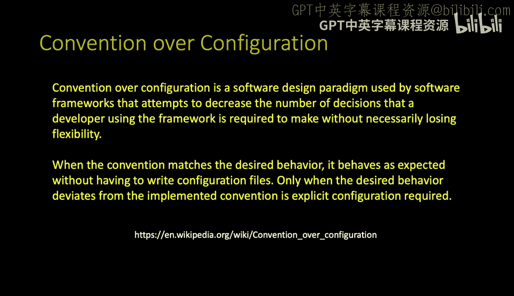

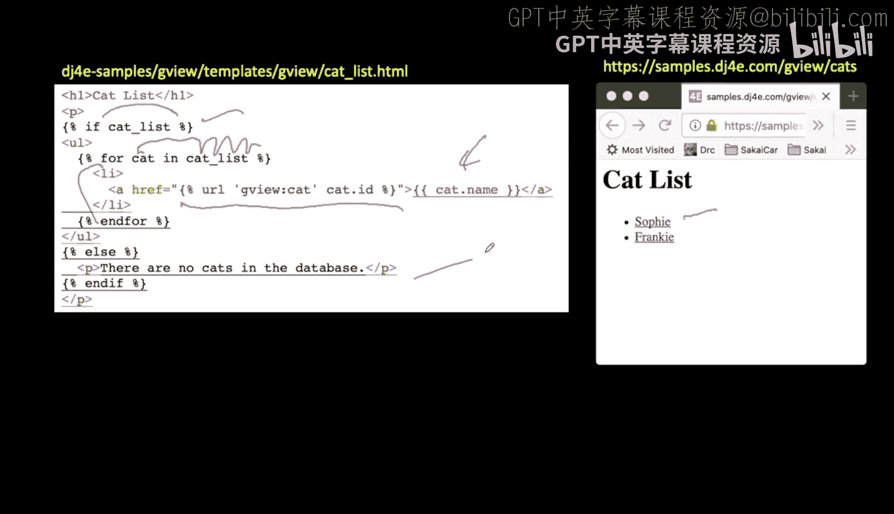

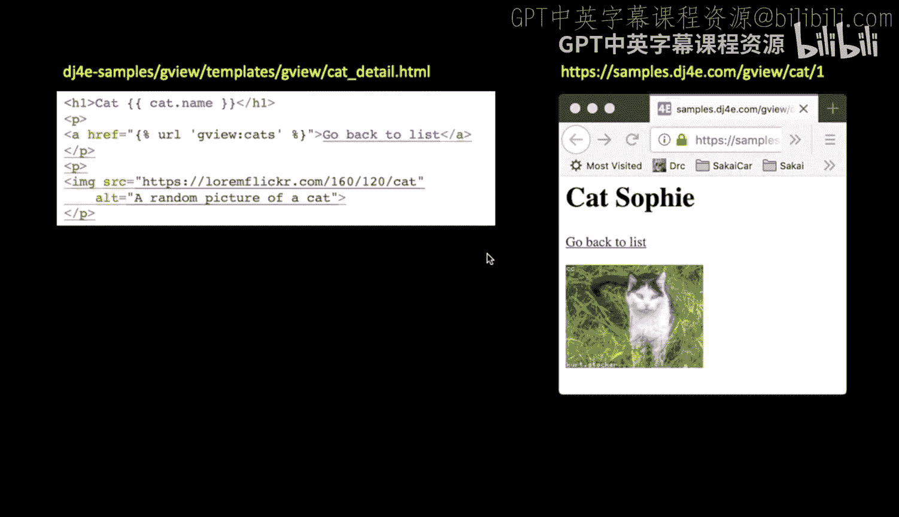

首先从模板开始。在猫列表模板中，我们期望有一个名为`cat_list`的上下文变量。

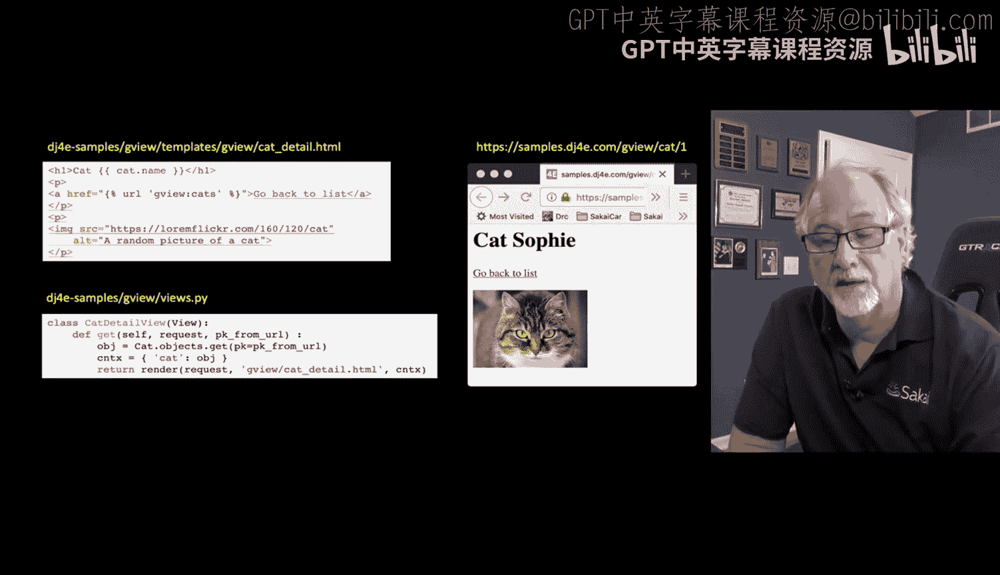

这是一个猫对象的列表。然后我们将遍历`cat_list`，无论有多少只猫，在一个列表内生成`<li>`标签，并创建一个链接URL。接着提取猫的名字。猫有名字和主键。我们将生成一个指向“Sophie”的链接，链接地址是`/cat/12`（无论那个数字是什么）。如果猫列表为空，我们将显示“数据库中没有猫”。实际上，我们有一个脚本用于预加载所有这些数据。示例代码中有关于如何预加载数据的说明，请查看其`README`文件。

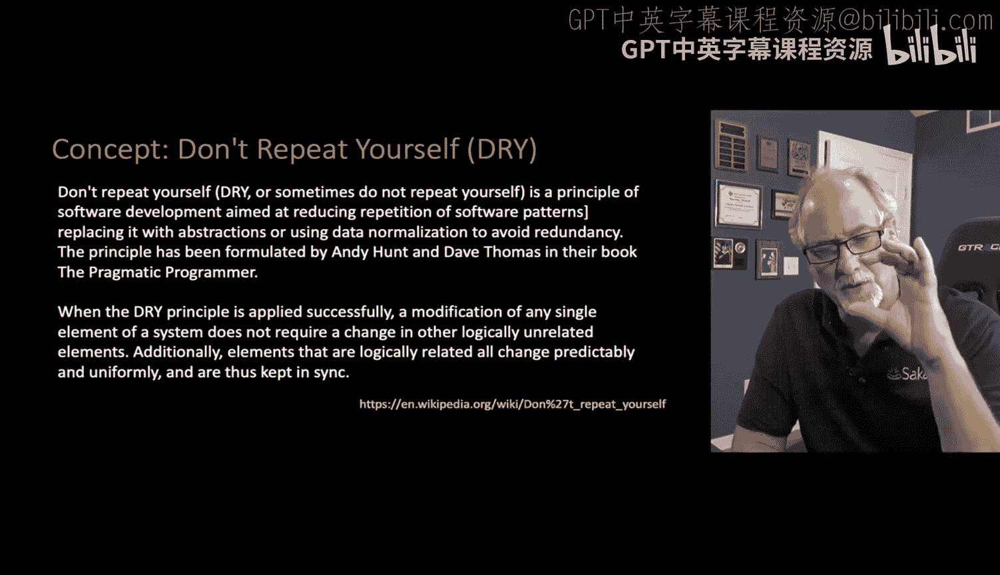

在详情页面中，我们将传入一个猫对象，它有一个名字。然后我们想要一个返回猫列表的链接。这里我们再次使用了上一讲的内容，使用URL宏，传入应用内视图的名称。这是`GView`应用中的`cat`视图。这将生成一个有效的链接，字符串“返回列表”作为链接文本。

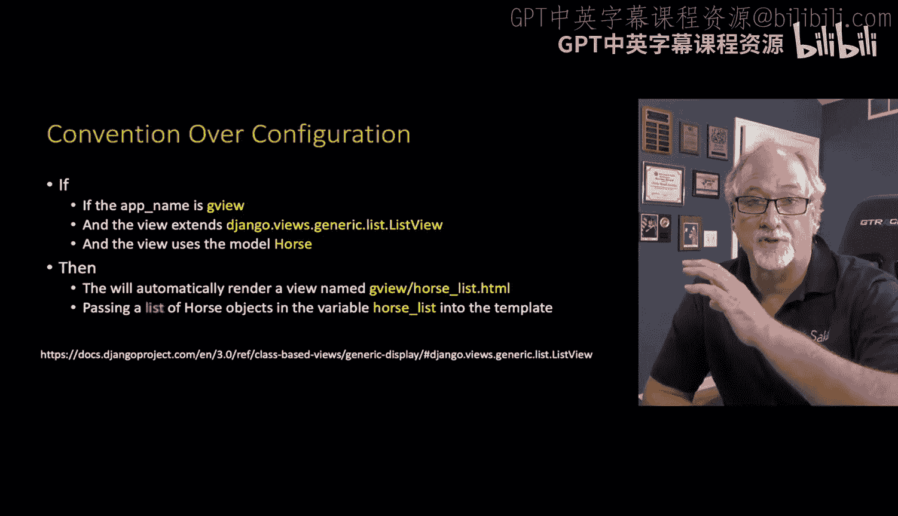

我们将构建所有这些内容。这是基本思路，模板和HTML就是这样工作的。但我们将看看视图是如何工作的。再次提醒“不要重复自己”的原则。有时这个原则会给我们带来麻烦，因为其理念是将某些逻辑放在一个地方，并在尽可能多的地方重用。这可以很好地描述为：**重用、重用、重用**。做一次，然后尽可能多地重用，这样如果你需要修复其中的错误，就不必找到所有49个放置此代码的地方。

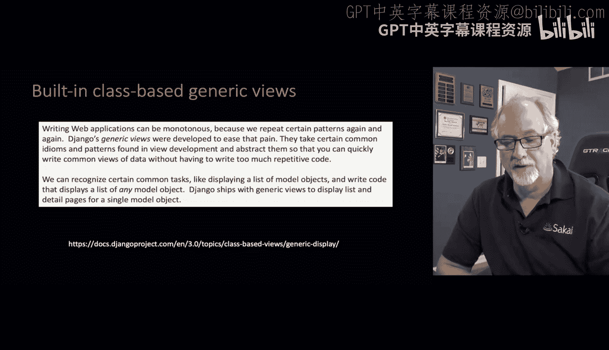

因为我们一遍又一遍地做同样的事情：猫、狗、马、汽车。列表视图、详情视图、编辑视图等都是常见功能。如果你要做这些事情，为什么不使其看起来一致、功能一致呢？如果一个开发者构建了猫的编辑界面，另一个人构建了狗的编辑界面，他们各自为政，设计可能很酷但不同，这会导致不一致。你仍然想要一个漂亮的设计，但你希望猫的数据和狗的数据在这个一致的设计中都有意义。

所以两者都可以有一个好的设计。

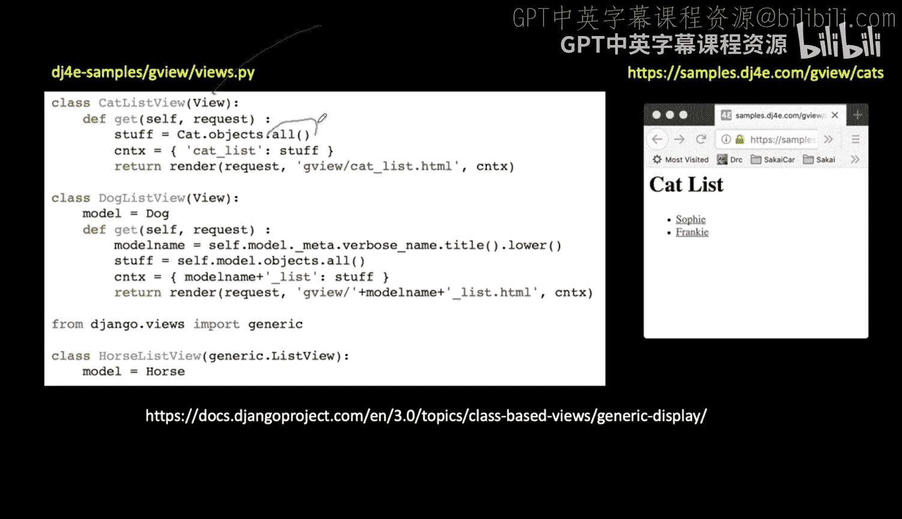

我们有模板。模板期望像`cat_list`或`dog_list`这样的变量。猫详情页面只有一个`cat`变量。如果我们暂时忘记将要学习的所有内容，只写一个视图，它会像第一个例子这样。这个`CatListView`继承自`View`。我们将查询数据库。我们已经导入了`Cat`模型。`Cat.objects.all()`是查询所有猫对象并获取猫对象列表的方法，将其放入变量`stuff`中。我们之前在shell中做过这个，但现在是在视图的实际Python代码中。正如所说，视图是所有事情发生的地方。这意味着进行数据库调用，加载所有猫记录。

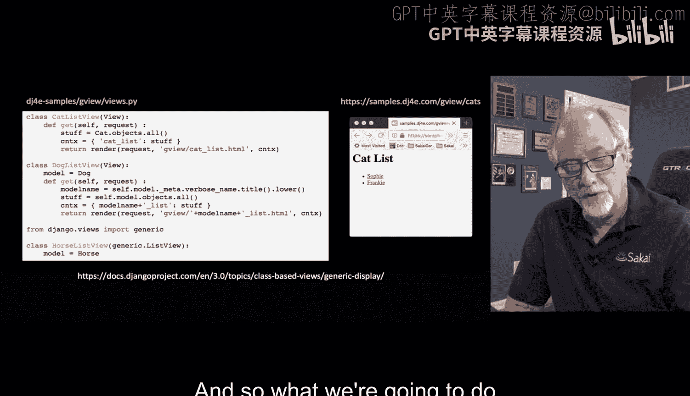

将它们转换为对象，并给我这些对象的列表。然后我将上下文传递到模板`GView/cat_list.html`中。我将传递整个列表。如果你回头看，模板中有一个小循环，打印出Sophie、Frankie等，并在它们下面生成指向详情页面的链接。

如果不打算重复自己，我们就会这样做。接下来，对于狗，我们将用另一种方式来做。

看起来工作量更大，但可重用性更高。我们在这里做的是：现在有一个`DogListView`类。我们将在这个对象中创建一个名为`model`的属性变量，并说明这个特定视图的模型是`Dog`。

现在的想法是，在`get`方法中，我们取这里的代码，每次我们说`Cat`，都使其通用化，并由这一个变量驱动。使这有点棘手的是，有时我们只使用模型，而其他时候我们实际上会将其转换为文本字符串。

看看这个。我们有一个变量`model`。在`get`请求中，`self.model`是指向我们所在特定实例中`model`变量的方式。`self.model._meta.verbose_name.title().lower()`。你可以通过最终查看Stack Overflow自己弄清楚。我就是这样弄清楚的。我想获取模型名称的小写版本。模型名称是一个字符串“Dog”，这与`Dog`模型不同。所以这只是一种方式，`model_name`将变成小写的“dog”。但如果模型是`Cat`，那么`model_name`将变成小写的“cat”。我正在尝试编写可重用的代码。是的，可重用的代码看起来有点复杂，因为它是通用的。

但你会注意到，我正在创建一个名为`model_name_list`的变量，因为我只是将它们连接在一起。所以它将是`dog_list`。接下来会发生的是，我将与模型对话并检索所有对象。`self.model.objects.all()`。然后我将获取所有对象的列表并放入`stuff`中。然后我将把它放入上下文。接着，我将从`GView`文件夹中获取一个模板，模板名是`model_name_list`。所以以前是`cat_list`，现在是`dog_list`。我将它们连接在一起，并传入上下文。然后当这一切发生时，你会得到一个狗列表和其中的狗。我所做的是将这段代码通用化并放在这里，然后以某种方式传递给由`DogListView`类创建的对象我想要操作的实际模型。

我这样做是为了让你了解这是如何工作的。你可以对马做完全相同的事情。

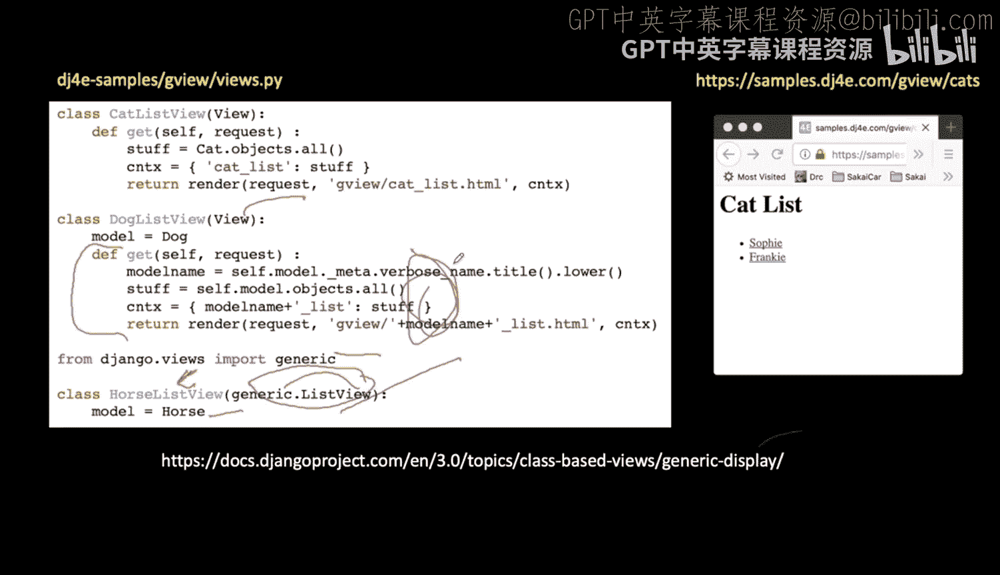

通过这样做：导入`django.views.generic`，然后说我要创建一个名为`HorseListView`的类。我将扩展不仅仅是`View`，而是`generic.ListView`。这是一个通用类，你可以查看Django文档。这是一个执行通用列表视图的类。这个类的规则是，你必须在这里添加一行来说明它作用于哪个模型。仅此而已。这是因为`get`代码已经在这个模型中，或者我们正在扩展这个模型，或者继承了所有这些代码，不是从`DogListView`，而是从`generic.ListView`。

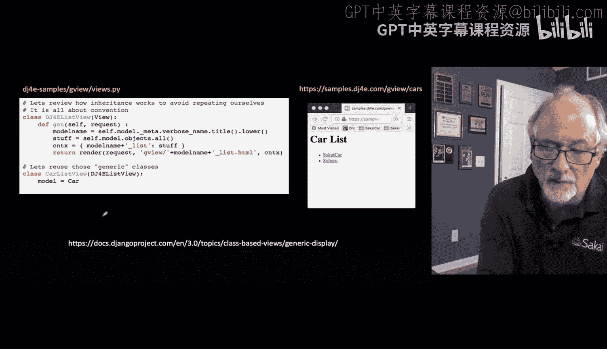

所以我们把5行的东西，稍微通用化后变成8行，现在变成了1行。这就是扩展的工作原理。但你必须信任，并且必须去阅读`ListView`的文档，以了解如何告知它应该使用哪个模型。

我想通过自己创建一个列表视图来展示一点这是如何发生的，它不如真正的Django `ListView`酷，只是为了让你了解Django `ListView`幕后发生了什么。

所以，如果我创建一个新类`DJ4EListView`，然后扩展`View`。然后我将有一个`get`方法，它将包含所有这些代码。它寻找一个名为`model`的变量。你会注意到它没有在这里定义`model`，因为这是一个打算被重用的类。我会说，哦，无论在这里设置的模型是什么（通过我们正在扩展的类创建时），去获取它，将其转换为文本，获取其标题，然后转换为小写，使其成为`model_name`。无论模型是什么，检索其所有对象并放入`stuff`，然后放入`model_name_list`。例如，`car_list`。然后将该列表传递到模板，并渲染`GView/car_list.html`和上下文。

`DJ4EListView`本身并没有做任何具体的事情，它正在创建一个我稍后要扩展的类。我将用两行代码扩展它：创建一个扩展`DJ4EListView`的`CarListView`。为了获得这里的所有代码，我唯一需要做的就是扩展它，然后我需要添加`model = Car`。你会注意到`CarListView`的语法与`HorseListView`完全相同，对吧？

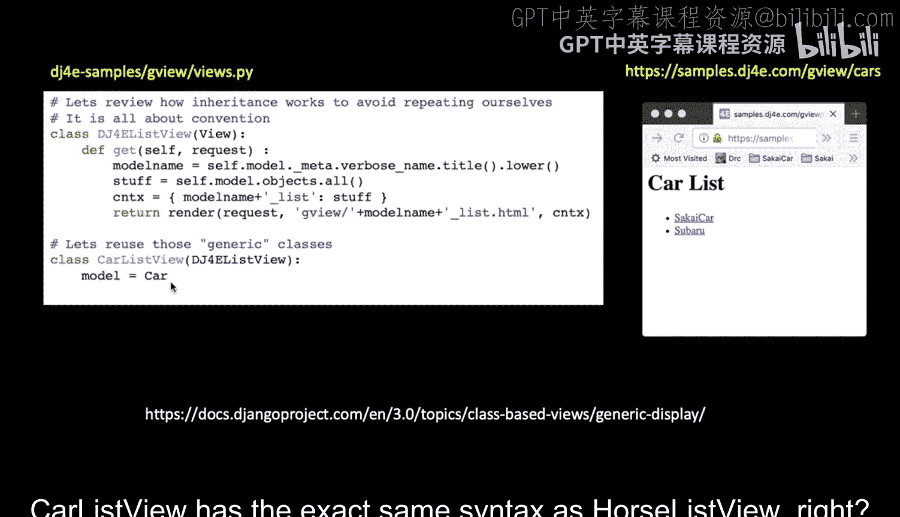

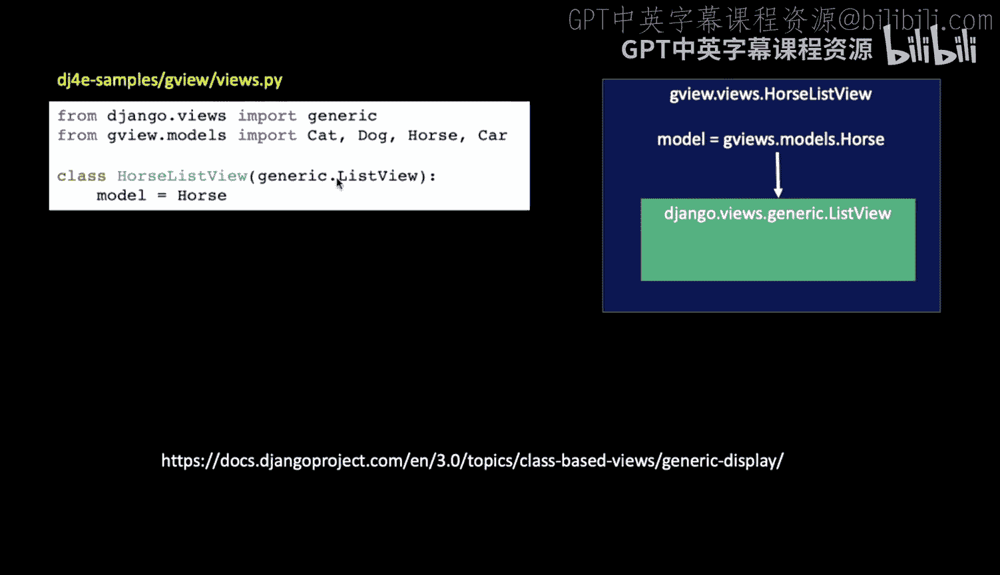

对于`HorseListView`，你基本上告诉`generic.ListView`要操作哪个模型，然后`generic.ListView`完成所有工作。如果你看`CarListView`，它说使用这个我刚刚发明的通用列表视图来向你展示它的源代码。这是幕后的源代码。正如我所说，它比我做的要复杂和精密得多。这是可扩展通用列表视图最粗糙、最简单的版本。

但当一切都说完了，你不需要编写任何那些版本。你实际上只需要创建一个列表视图并告诉它是什么模型，创建一个猫视图并告诉它是什么模型，然后一遍又一遍地重用这个列表视图。所以我给你展示了四种不同的方法来做这件事。也许四五种不同的方法。真正的方法只有一种。但当你看到像`HorseListView`扩展`generic.ListView`且`model = Horse`这样的代码时，你可能会觉得需要信任很多。答案是，是的，你会习惯的。现在你必须编写的代码只有两行。你仍然需要编写模板，因为它会调用你的模板，但它通过查看那个“horse”知道模板的名称。哦，是的，`horse_detail` 或 `horse_list`。这是实际的详情页面，显示马的信息并返回列表等。使用这些通用视图，你可以使代码非常简短、精炼和简单。

通用视图非常出色。它们允许我们生成许多相似的页面而无需重复自己。它们保持代码的一致性。“不要重复自己”原则意味着即使一遍又一遍地做同样的事情看起来很快（复制、粘贴、修改），但如果你真的想构建可靠的、成千上万行代码、具有数百个功能的应用程序，你也不希望一遍又一遍地粘贴相同的东西。

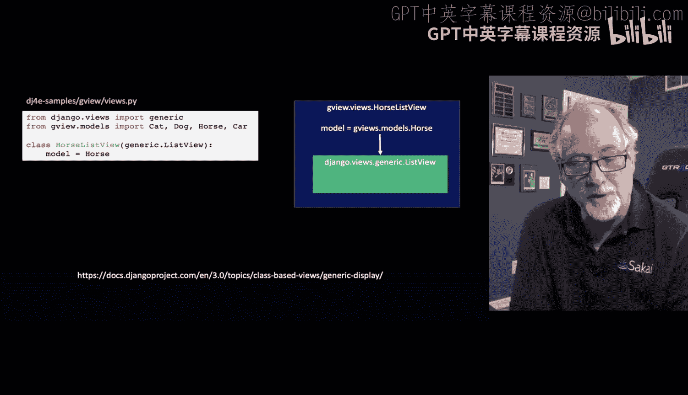
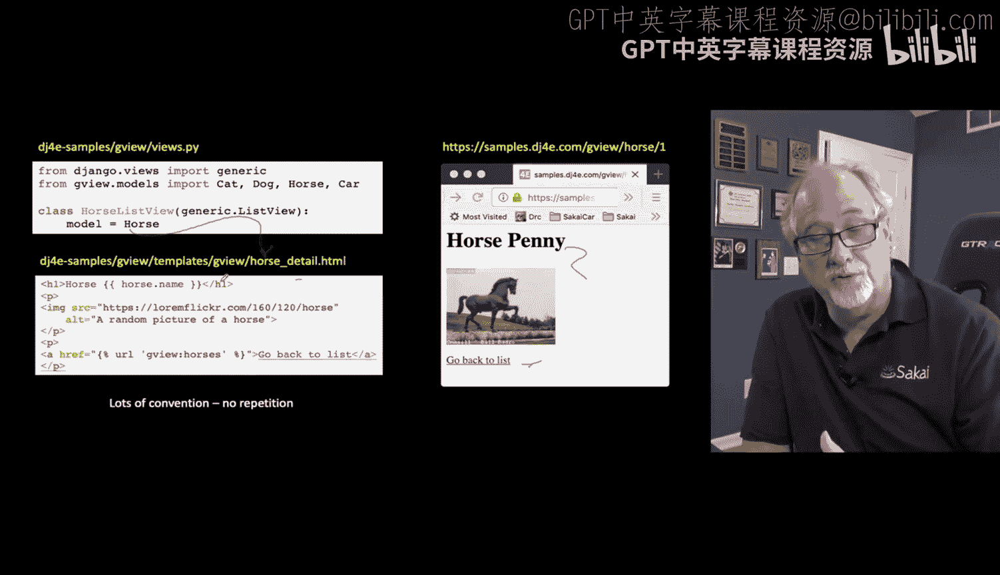
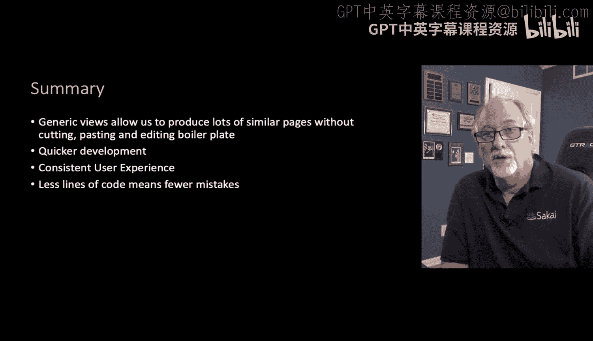

更少的代码意味着更少的错误。这基本上是我们关于视图讨论的结束。这实际上是我们将要开始做大部分工作的地方。URL和模型通常不会有太多活动，尽管我们接下来将讨论表单，它涉及视图、模型和模板。表单是提升我们用户体验的事物之一。我们很快会再见面。

---

本节课中我们一起学习了Django通用视图。我们了解了如何利用`ListView`和`DetailView`等通用类视图来大幅减少重复代码，遵循DRY（不要重复自己）原则，并保持应用不同部分之间的一致性。通过继承这些内置的通用视图，我们可以用极少的代码实现常见的Web模式，使开发更高效，代码更易于维护。