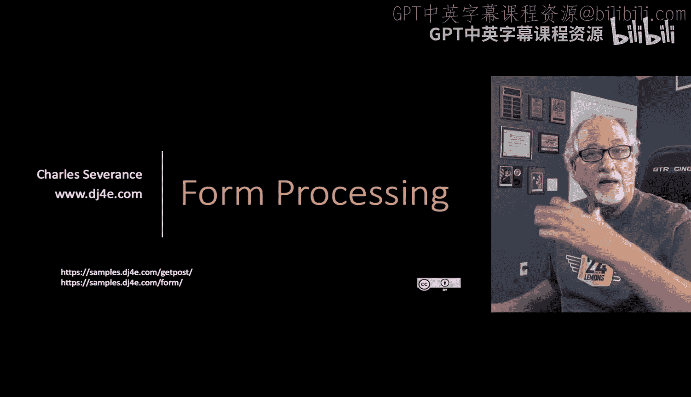
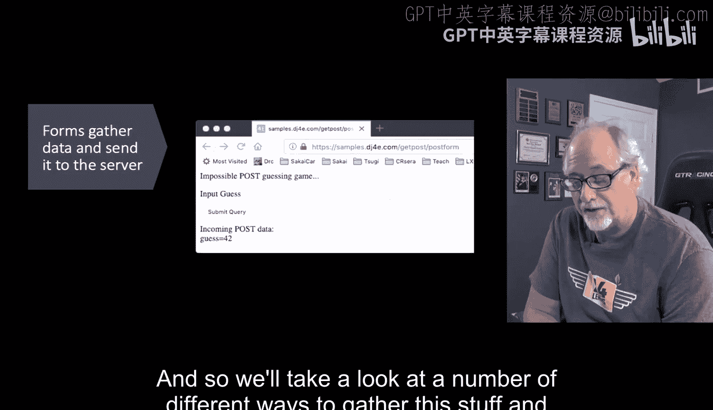
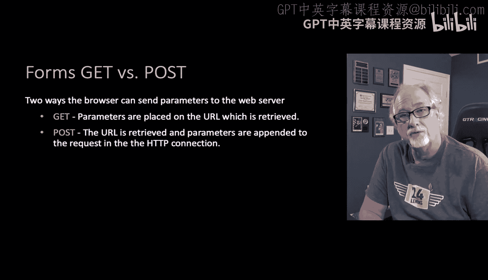
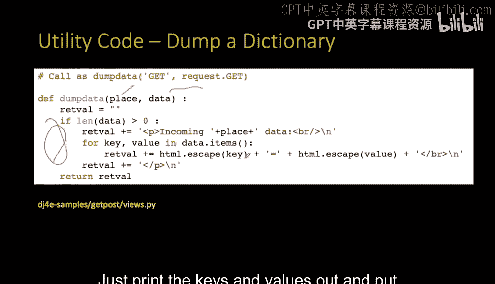
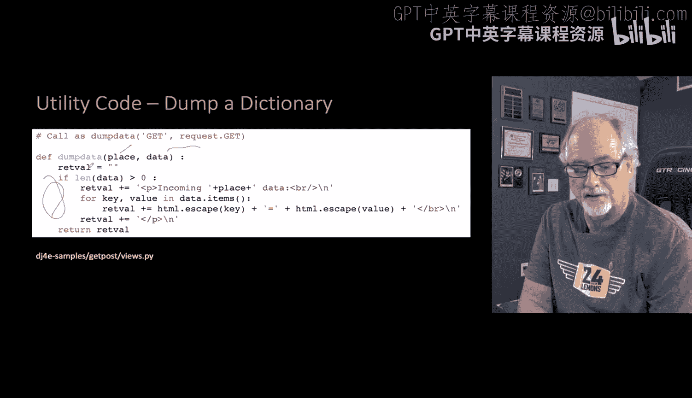
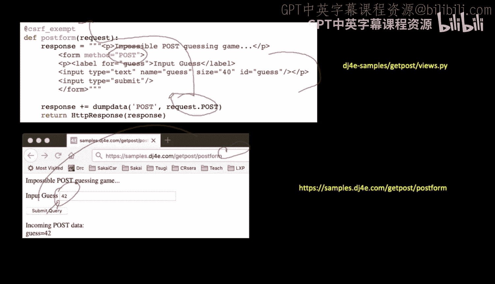
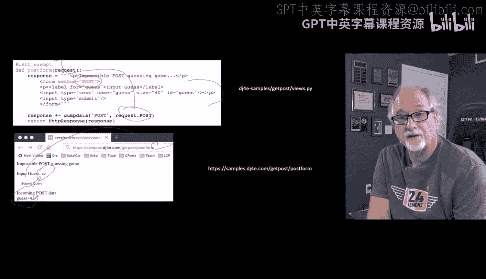
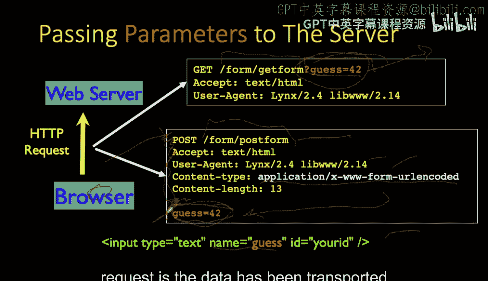
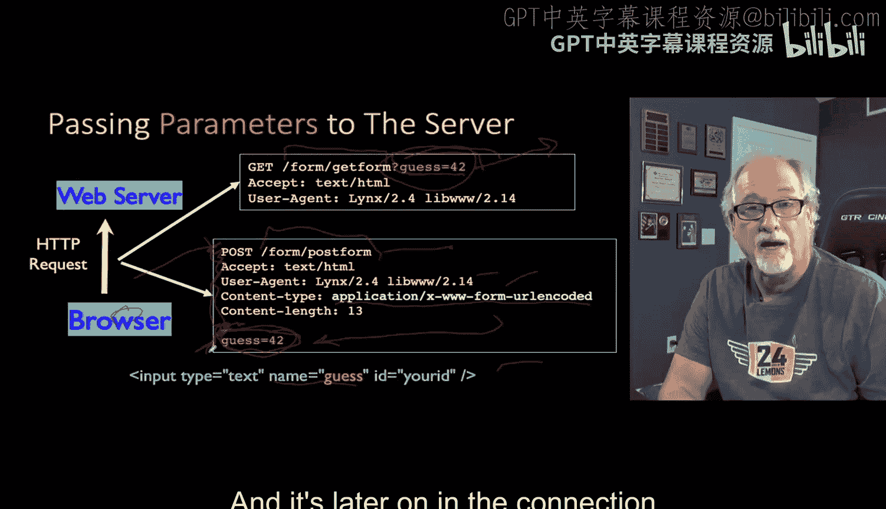
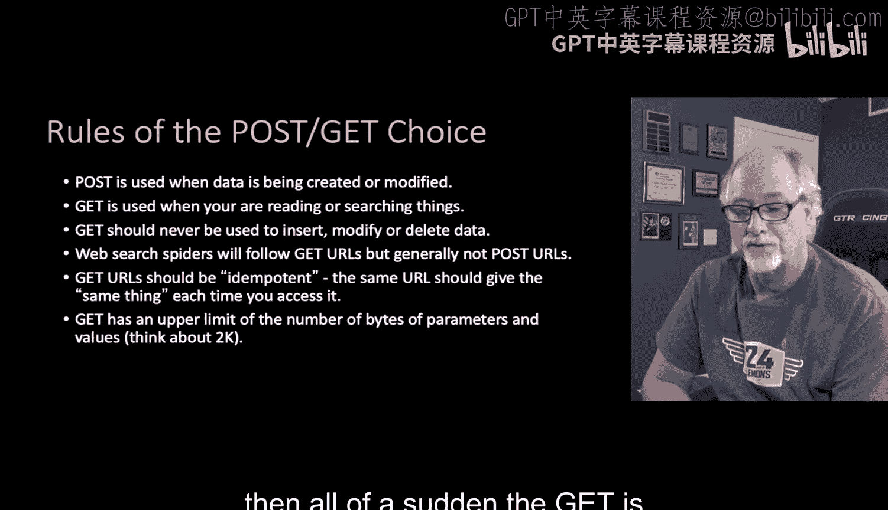

# 053：表单-GET、POST与HTTP 🧩

在本节课中，我们将学习HTML表单如何工作，以及它们如何通过GET和POST两种HTTP方法与服务器通信。表单是网页中让用户填写信息并提交给服务器的核心组件。我们将探讨这两种方法的基本原理、区别以及在实际开发中的使用场景。




## 概述



表单是HTML中用于创建用户输入界面的元素。它们允许用户在浏览器中填写数据，并将这些数据发送到服务器。数据发送主要有两种HTTP方法：GET和POST。理解这两种方法的区别对于构建安全、高效的Web应用至关重要。

## GET与POST方法



上一节我们介绍了表单的基本概念。本节中，我们来看看向服务器发送表单数据的两种基本方式。

在HTML中，我们一直使用的锚点标签（`<a>`）发起的是GET请求。这意味着你请求获取一个文档并显示它。你可以在URL末尾附加参数，例如 `?guess=42`。然而，表单不仅可以发起GET请求，还可以发起POST请求。POST允许我们以另一种方式向服务器发送数据。

## 代码示例：数据转储工具

为了清晰地展示GET和POST数据，我们先看一段工具代码。这段代码用于将请求中的数据（如GET参数、POST参数）以字典形式转储并安全地显示在网页上。





```python
from django.utils.html import escape

def dump_data(label, data_dict):
    """
    安全地转储并显示字典数据。
    label: 数据标签
    data_dict: 要显示的字典（如request.GET或request.POST）
    """
    output = f‘<p><strong>{label}:</strong></p>’
    for key, value in data_dict.items():
        output += f‘<p>{escape(key)} = {escape(value)}</p>’
    return output
```

这段代码遍历字典中的所有键值对，使用`escape`函数进行HTML转义以防止跨站脚本攻击，然后将它们格式化成段落输出。

## GET请求示例

以下是一个使用GET方法的简单表单。它包含一个文本输入框和一个提交按钮。

```html
<form>
    <p>请输入你的猜测：</p>
    <input type=“text” name=“guess” size=“40”>
    <input type=“submit” value=“提交”>
</form>
```

当用户输入“42”并点击提交按钮后，浏览器会向当前URL发起一个新的GET请求，并在URL末尾附加参数，变成 `?guess=42`。服务器端的Django框架会自动解析这个URL，并将参数 `guess=42` 放入 `request.GET` 字典中，供我们使用`dump_data`函数查看。



## POST请求示例

现在，我们来看一个使用POST方法的相同表单。关键区别在于`<form>`标签的`method`属性。



```html
<form method=“post”>
    
    <p>请输入你的猜测：</p>
    <input type=“text” name=“guess” size=“40”>
    <input type=“submit” value=“提交”>
</form>
```

> **注意**：为了简化示例，我们暂时使用了`@csrf_exempt`装饰器。在实际应用中，必须包含``标签以防止跨站请求伪造攻击。

当用户提交这个表单时，数据（`guess=42`）不会显示在URL中。相反，它作为HTTP请求体的一部分被发送。在服务器端，这些数据可以通过 `request.POST` 字典来访问。

## GET与POST的工作原理对比

以下是GET和POST方法在数据传输方式上的核心区别：

*   **GET请求**：数据作为URL的一部分（查询字符串）发送。格式为 `URL?key1=value1&key2=value2`。数据在浏览器地址栏可见，有长度限制（通常约2000字符），并且可以被书签保存。
*   **POST请求**：数据放在HTTP请求体中发送。数据在地址栏不可见，没有严格的长度限制，适合传输大量数据（如文件上传），且不能被书签直接保存。





## 何时使用GET与POST

你可能会问，选择哪种方法是否重要？答案是肯定的。遵循以下简单规则至关重要：

*   **使用GET的情况**：适用于读取、搜索等**不改变服务器状态**的操作。GET请求应该是**幂等**的，即多次执行相同的GET请求应产生相同的结果（语义上）。例如，查看日历、访问收件箱列表。
*   **使用POST的情况**：必须用于**创建、修改或删除数据**等会改变服务器状态的操作。这不仅是良好实践，也关乎安全。网络爬虫通常只跟随GET链接来“阅读”数据，而会避免POST请求，以防止意外修改网站数据。

此外，POST请求能保持URL简洁美观，而GET参数会使URL变得冗长。

## HTML表单输入类型简介

接下来，我们将快速回顾HTML表单中可用的各种输入标签类型，它们可以创建丰富的用户界面。

以下是常见的HTML输入类型：

*   **文本输入 (`<input type=“text”>`)**: 单行文本字段。
*   **密码输入 (`<input type=“password”>`)**: 用于输入密码，内容被隐藏。
*   **提交按钮 (`<input type=“submit”>`)**: 用于提交表单。
*   **单选按钮 (`<input type=“radio”>`)**: 允许用户从一组选项中选择一个。
*   **复选框 (`<input type=“checkbox”>`)**: 允许用户选择多个选项。
*   **下拉选择 (`<select>`)**: 创建下拉列表供用户选择。
*   **文本区域 (`<textarea>`)**: 多行文本输入框。
*   **隐藏域 (`<input type=“hidden”>)**: 存储不需要用户看到但需要提交的数据。

## 总结



本节课中，我们一起学习了HTML表单的基础知识以及GET与POST两种HTTP方法。我们了解了GET请求将数据附加在URL中，适用于安全的数据读取操作；而POST请求将数据放在请求体内，适用于会改变服务器状态的数据提交操作。我们还通过代码示例演示了如何在Django中处理这两种请求的数据，并强调了根据操作类型正确选择方法的重要性。理解这些概念是构建交互式Web应用的关键第一步。