# 054：构建HTML表单 📝

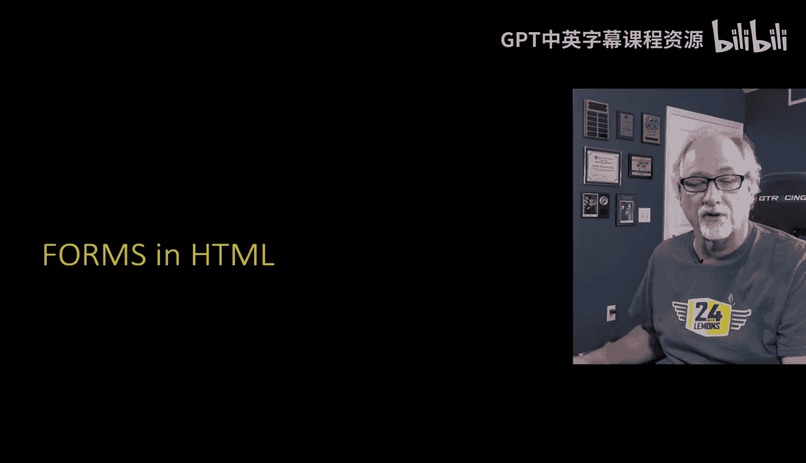

在本节课程中，我们将学习HTML表单的基础知识。表单是Web应用与用户交互的核心组件，用于收集和提交数据。我们将介绍几种常见的表单输入类型，并解释它们的工作原理。

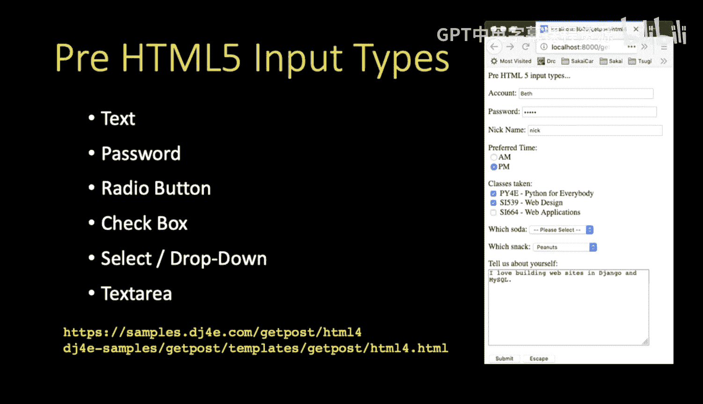

## 概述

HTML表单允许用户输入数据，这些数据随后可被发送到服务器进行处理。表单由多种输入元素组成，每种元素适用于不同的数据收集场景。本节将逐一介绍这些元素及其用法。

## 文本输入框

文本输入框是最基本的表单元素，用于收集单行文本信息。其HTML代码示例如下：

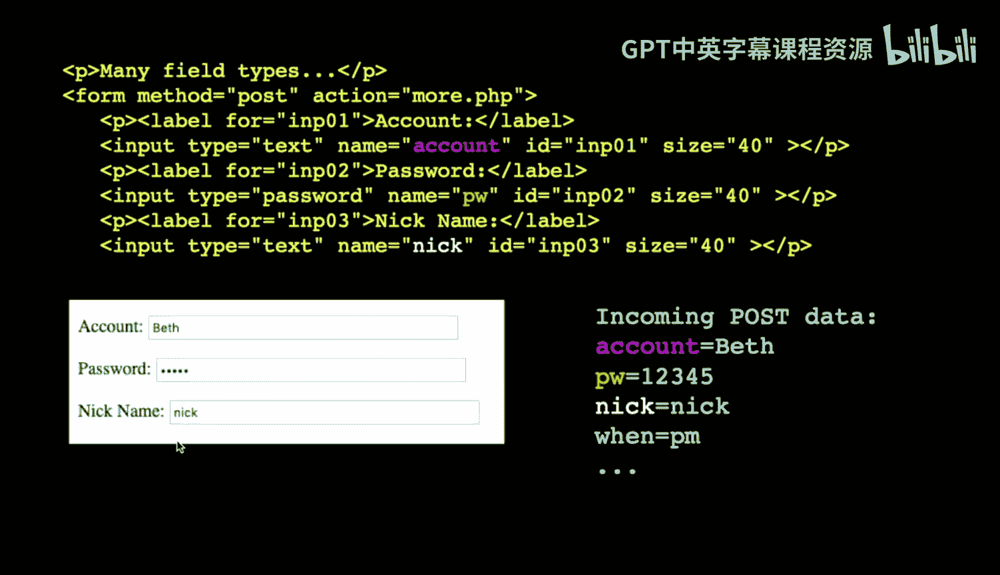

```html
<input type="text" name="account" id="account">
```

*   **`type="text"`**：定义输入类型为文本。
*   **`name="account"`**：这是发送到服务器时的键名。例如，用户输入“Beth”后提交，服务器将收到 `account=Beth`。
*   **`id="account"`**：主要用于关联 `<label>` 标签，便于浏览器识别和辅助功能使用。

密码输入框 (`type="password"`) 在功能上与文本输入框类似，但用户输入时会显示为星号（*）以隐藏内容。需要注意的是，密码在提交时仍以明文形式传输。

隐藏域 (`type="hidden"`) 在用户界面中不可见，常用于在表单中传递不需要用户填写但服务器需要的数据。

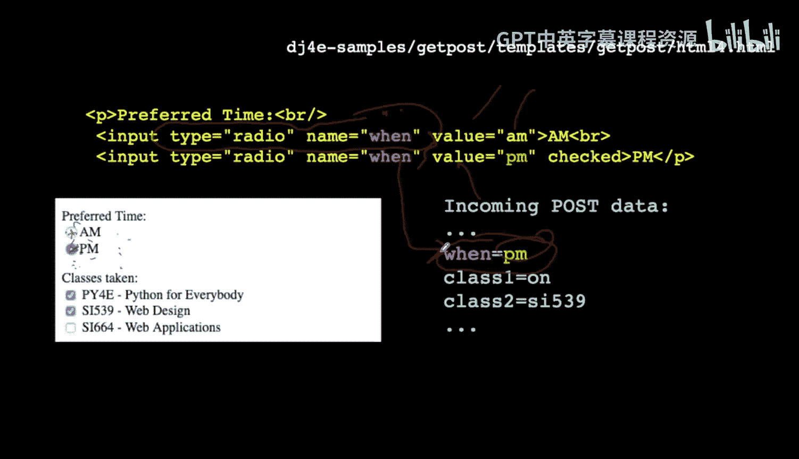

## 单选按钮

单选按钮用于在多个选项中仅选择一项的情况。其特点是所有选项共享同一个 `name` 属性。

```html
<input type="radio" name="when" value="AM"> AM
<input type="radio" name="when" value="PM"> PM
```

当用户选择“PM”并提交时，服务器将收到 `when=PM`。同一 `name` 下的单选按钮，无论它们在页面上的位置如何，都只能有一个被选中。

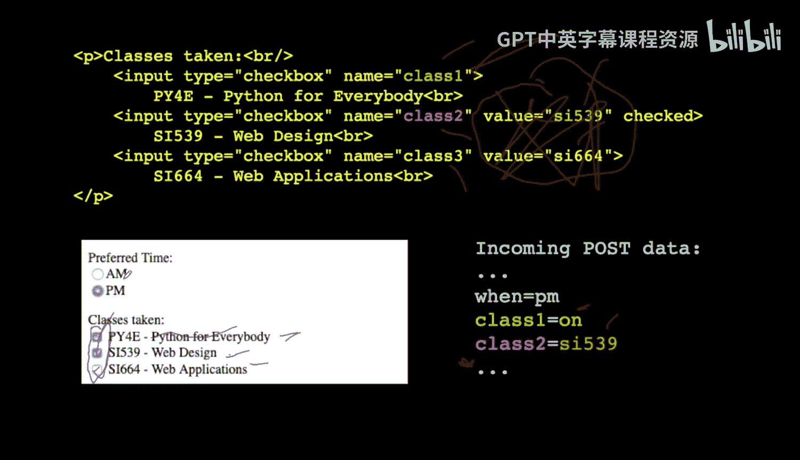

## 复选框

复选框允许用户从多个选项中选择零个、一个或多个。每个复选框通常拥有独立的 `name`。

```html
<input type="checkbox" name="class1" value="si106"> SI 106
<input type="checkbox" name="class2" value="si539"> SI 539
<input type="checkbox" name="class3"> SI 579
```

*   如果复选框被选中，其 `value` 值（若未设置则默认为“on”）会随表单提交。
*   如果未被选中，则其 `name` 不会出现在提交的数据中。

## 下拉选择框

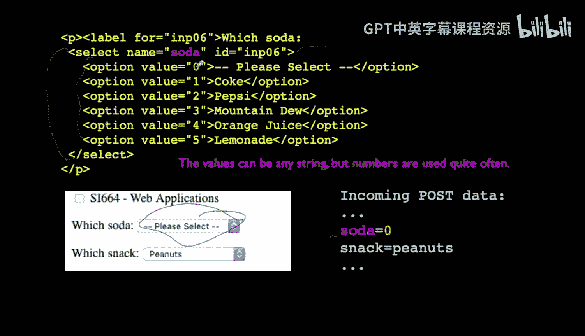

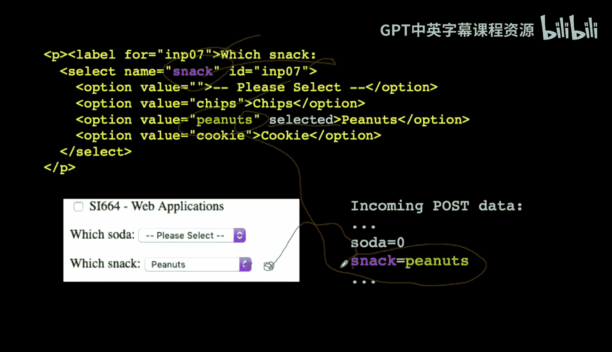

下拉选择框（`<select>`）为用户提供了一个选项列表，用户只能从中选择一项。

```html
<select name="soda">
    <option value="0">Coke</option>
    <option value="1">Pepsi</option>
    <option value="2">Mountain Dew</option>
</select>
```

*   **`<select>`** 标签的 `name` 属性定义了提交时的键名。
*   **`<option>`** 标签的 `value` 属性定义了每个选项对应的值。
*   可以使用 `selected` 属性预设默认选项，如 `<option value="peanuts" selected>Peanuts</option>`。

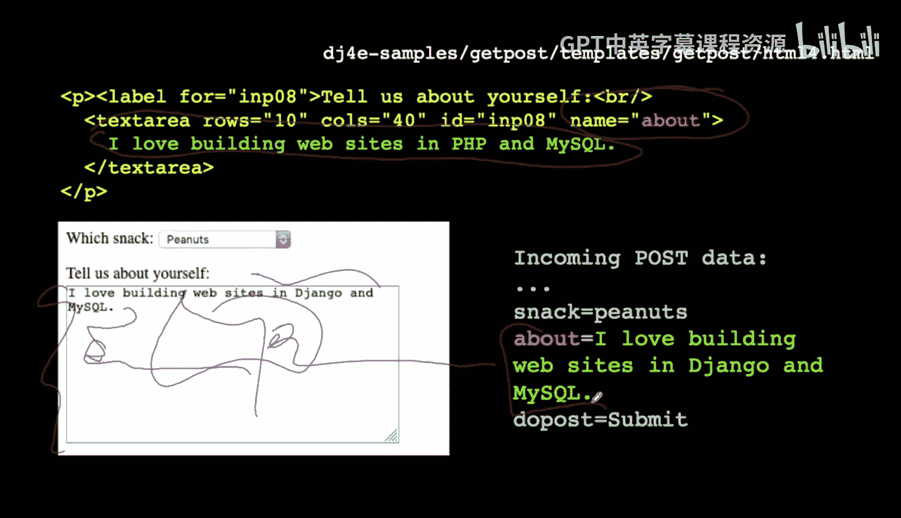

## 文本区域

文本区域 (`<textarea>`) 用于输入多行文本，如评论或博客内容。

```html
<textarea name="comments" rows="10" cols="40">默认文本...</textarea>
```

*   **`name`**：提交时的键名。
*   **`rows` 和 `cols`**：定义文本区域显示的行数和列数。
*   用户输入的所有文本（包括换行和空格）都会作为值提交。

## 提交与按钮

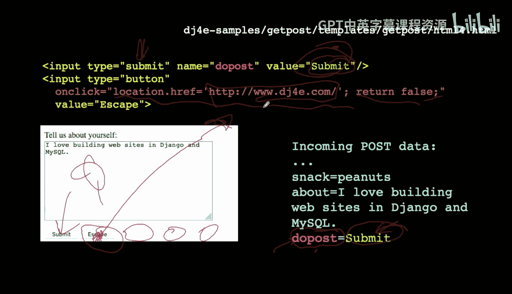

表单需要一个机制来触发数据提交，这通常通过提交按钮完成。

```html
<input type="submit" value="Submit Form">
```

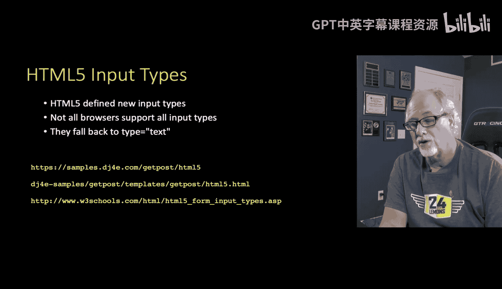

*   点击提交按钮会收集表单中所有数据并发送到服务器。
*   `value` 属性决定了按钮上显示的文本。

此外，还可以使用普通按钮 (`type="button"`) 并配合JavaScript来执行其他操作，例如取消或返回：

```html
<input type="button" value="Escape" onclick="location.href='/'; return false;">
```
这段代码会在点击按钮时将浏览器导航至根目录 (`/`)，`return false` 阻止了表单的默认提交行为。

## HTML5输入类型

HTML5引入了一系列新的输入类型，它们在现代浏览器中能提供更好的用户体验和内置验证，并在旧浏览器中优雅地降级为普通文本输入框。

*   **颜色选择器 (`type="color"`)**: 弹出颜色选择器，提交值为十六进制颜色代码（如 `#ff0000`）。
*   **日期选择器 (`type="date"`)**: 弹出日期选择控件。
*   **邮箱 (`type="email"`)**: 浏览器会验证输入内容是否符合邮箱格式（包含@符号等）。
*   **数字 (`type="number"`)**: 通常配合 `min` 和 `max` 属性使用，限制输入范围，并验证是否为有效数字。
*   **URL (`type="url"`)**: 验证输入是否为有效的URL格式。

这些HTML5输入类型的关键优势在于**客户端验证**。如果用户输入不符合要求（例如，在邮箱字段中未输入@符号），浏览器会在提交前阻止表单发送，并给出提示。这提供了即时反馈，但请注意，服务器端仍然必须对数据进行验证，因为客户端验证可以被绕过或在不支持的浏览器中失效。

## 总结

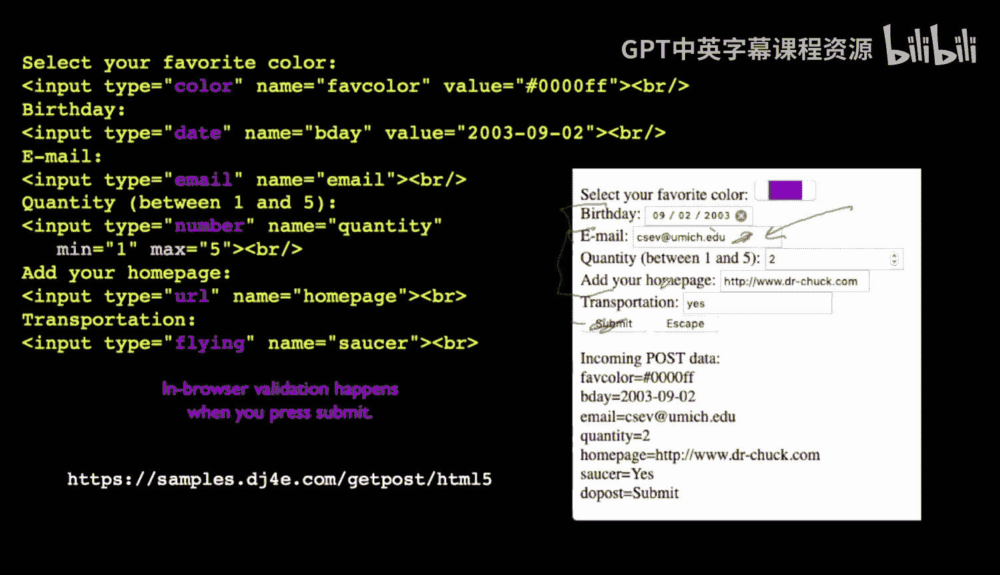

本节课我们一起学习了构建HTML表单的核心元素。我们从基础的文本输入框、密码框讲起，探讨了用于单项选择的单选按钮和多项选择的复选框，接着介绍了下拉选择框和多行文本区域，最后讲解了提交按钮的作用以及HTML5带来的增强型输入类型和客户端验证功能。理解这些表单元素是开发交互式Web应用的基础。在实际使用中，你可以查阅更多在线资源来深入了解表单的高级样式和功能。