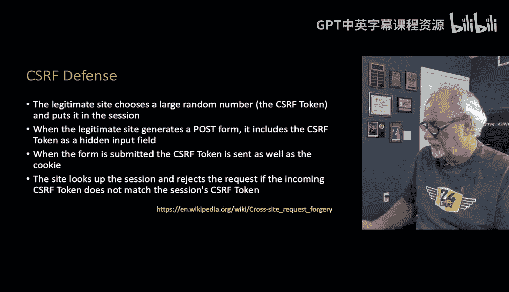
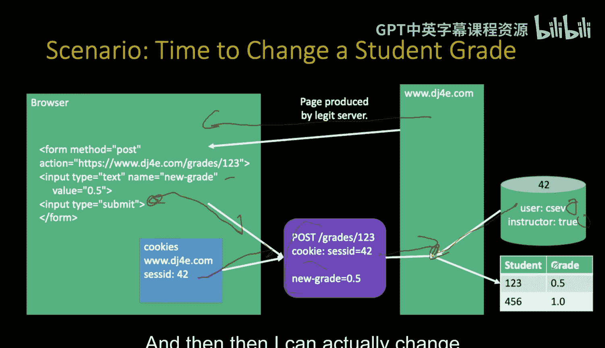
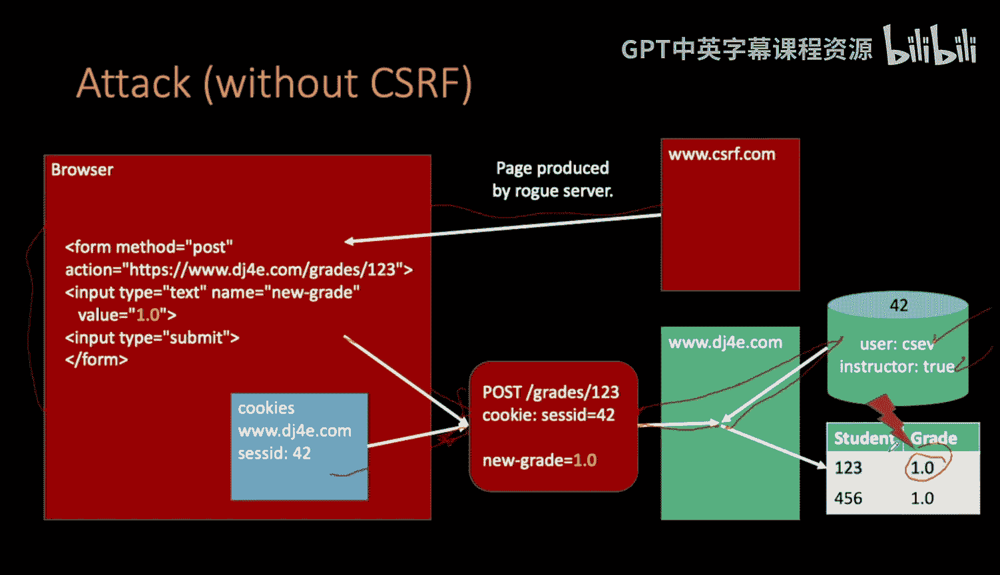
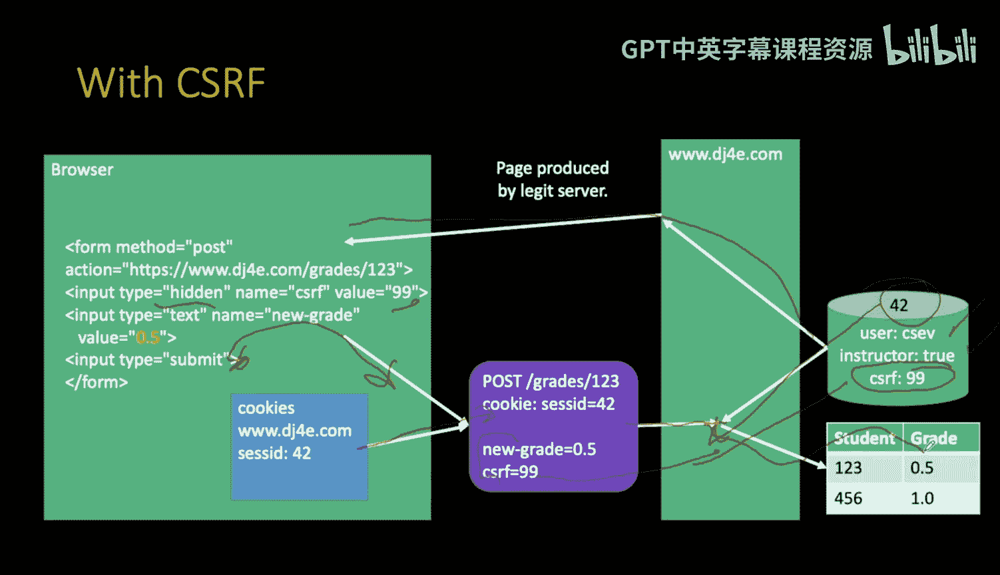
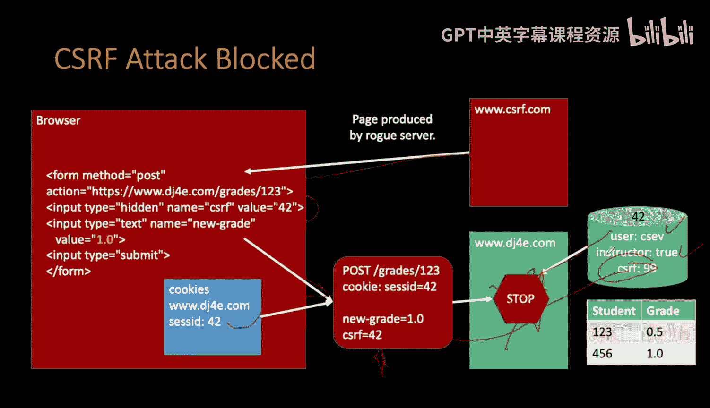
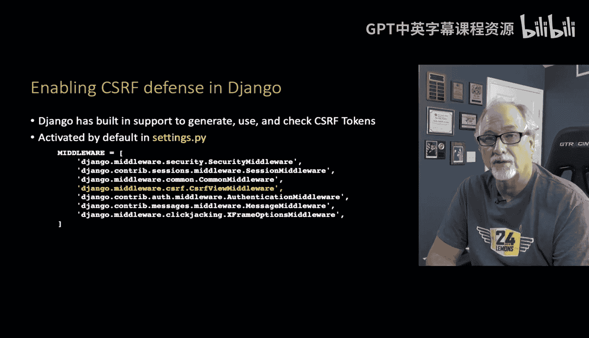

# 055：表单与跨站请求伪造 (CSRF)

在本节课中，我们将要学习Web表单中的一个重要安全概念——跨站请求伪造（CSRF），了解其攻击原理，并掌握Django如何内置防护机制来抵御此类攻击。

## 概述

上一节我们介绍了表单的基本概念。本节中，我们来看看与表单相关的安全议题。具体来说，我们将深入探讨一种名为“跨站请求伪造”（CSRF）的安全漏洞，理解其工作原理，并学习Django框架如何默认提供防护。

## CSRF攻击原理

CSRF攻击的核心思想与Cookie的发送机制有关。设想你已登录某个合法网站（例如一个成绩管理系统）。此时，一个恶意网站可以生成一个包含表单的页面，该表单的提交目标（`action`）指向那个合法网站的URL。

关键在于，浏览器在向某个站点发送POST请求时，会自动附加该站点的Cookie（包括会话ID）。因此，如果攻击者能诱使你（已登录的用户）在恶意网站上点击提交按钮，浏览器就会带着你的合法会话Cookie，向目标服务器发送一个伪造的请求。服务器收到请求后，会通过Cookie识别出已登录的合法用户身份，从而可能执行危险操作（例如修改成绩）。

攻击者无需知道你的Cookie具体内容，只需要诱使你点击一个指向目标服务器的恶意表单。

## CSRF防护机制

CSRF的防御策略是使用一个CSRF令牌（Token）。请注意，它与会话（Session）相关，但不同于会话ID本身。

防护流程如下：
1.  服务器生成一个大型随机数，作为CSRF令牌，并将其存储在用户的会话（Session）中。
2.  每当服务器生成一个表单页面时，会在表单内添加一个隐藏的输入标签（`<input type="hidden">`），其值就是这个CSRF令牌。
3.  当用户提交表单时，这个CSRF令牌会随着表单数据一同POST回服务器。
4.  服务器接收到请求后，会从POST数据中提取CSRF令牌，并与会话中存储的令牌进行比对。
5.  如果两者匹配，请求被视为合法，继续处理。如果不匹配，则拒绝该请求，并可能记录安全错误或注销用户。

以下是合法请求的流程示意图：

## 攻击与防护对比

让我们通过一个修改成绩的例子，对比攻击发生和被防护的情况。

**CSRF攻击场景：**
1.  用户（讲师）已登录合法成绩管理系统（会话ID：C7）。
2.  用户访问了恶意网站，该网站包含一个伪造的表单，其`action`指向成绩管理系统的修改成绩URL。
3.  用户被诱骗点击了提交按钮。
4.  浏览器自动附带上合法站点的会话Cookie（C7），向合法服务器发送POST请求。
5.  服务器通过Cookie识别出用户是已登录的讲师C7，因此执行了修改成绩的操作，攻击成功。

**启用CSRF防护的场景：**
1.  合法服务器在生成表单时，除了会话Cookie，还会在表单中嵌入一个隐藏的CSRF令牌（例如：`csrf_token=‘a9b3f…’`）。
2.  用户提交合法表单时，CSRF令牌随数据一起发送回服务器。
3.  服务器验证会话中的令牌与POST数据中的令牌是否一致，一致则允许操作。

4.  对于恶意网站生成的表单，由于攻击者无法得知或伪造正确的CSRF令牌（该令牌存储在用户与合法服务器的会话中），因此当伪造的请求发出时，服务器验证令牌会失败，从而阻断攻击。

## Django中的CSRF防护

幸运的是，Django框架默认提供了强大的CSRF防护支持，开发者通常无需手动实现上述复杂逻辑。

*   Django内置了CSRF中间件（`CsrfViewMiddleware`）。
*   一旦启用了会话（Session）功能，CSRF防护便会自动生效。
*   在模板中使用表单时，只需在`<form>`标签内添加 `` 模板标签，Django便会自动处理令牌的生成和验证。

## 总结

本节课中我们一起学习了跨站请求伪造（CSRF）的安全概念。我们了解了CSRF攻击如何利用浏览器的Cookie自动发送机制来冒充用户执行非意愿操作，并深入探讨了通过使用CSRF令牌进行验证的核心防护原理。最后，我们了解到Django框架已经内置了完整的CSRF防护机制，极大地简化了开发者的安全工作。下一节，我们将具体学习如何在Django表单中应用CSRF防护。