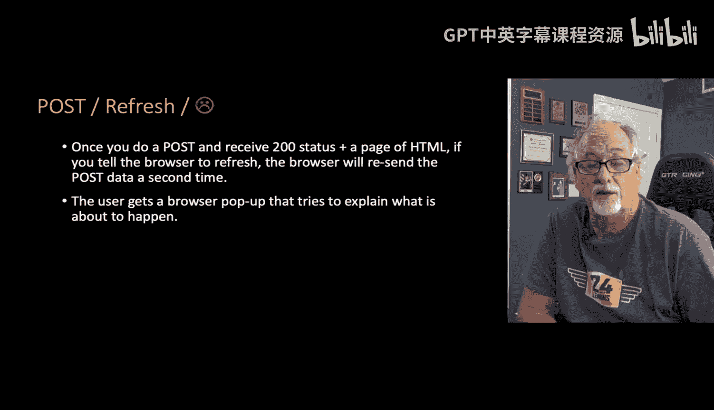
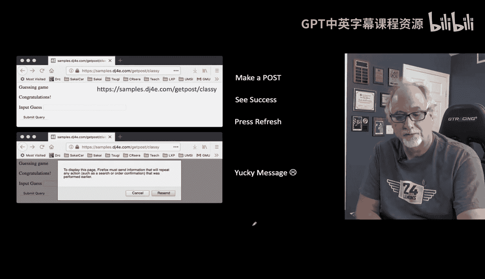
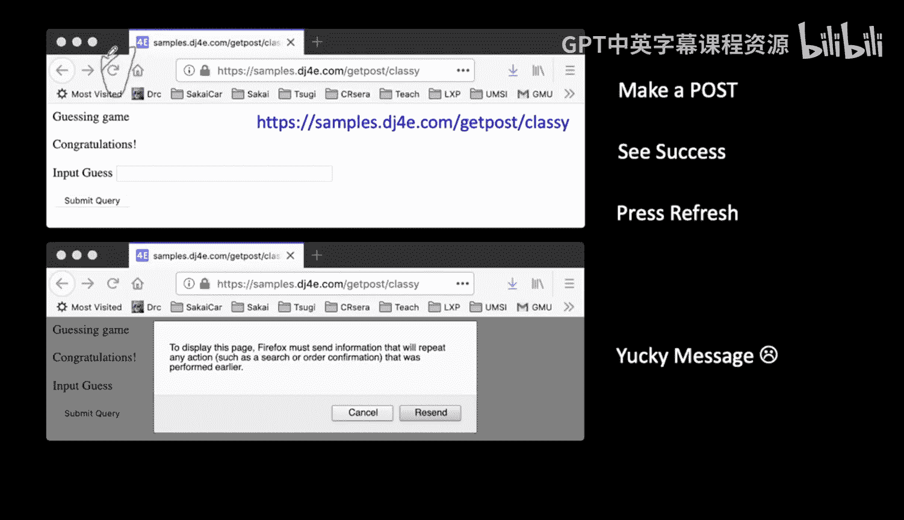

# 057：POST刷新模式 🚀

在本章中，我们将探讨Web表单处理中的一个常见问题：当用户提交表单后刷新页面时，浏览器会重新发送POST请求。我们将学习如何通过“POST重定向刷新”模式来优雅地解决这个问题，从而避免重复提交和浏览器警告，提升用户体验。

## 表单的复杂性

上一节我们介绍了如何在Django中处理表单并实现CSRF保护。表单看似简单，实则包含许多细节。一旦我们掌握了这些细节，就能高效地创建和处理一个又一个表单。

## 成功背后的隐患

不久前，我们成功实现了CSRF保护，表单工作正常。然而，从成功的顶峰往往潜藏着失败的深渊。这个问题并不严重，修复起来也不难，但我们必须解决它。

问题的核心在于：当浏览器发送一个POST请求并收到一个状态码为200的HTML页面响应（这正是我们之前所做的）后，如果用户点击浏览器的刷新按钮，浏览器会重新发送之前的POST请求。

POST请求通常用于改变服务器状态的操作，例如转账。假设你点击转账按钮（这是一个POST请求），成功转出100美元，页面显示“转账成功”。此时如果你点击刷新按钮，浏览器会再次发送相同的POST请求，导致你再次转出100美元。刷新操作会重新执行整个之前的交易，而不仅仅是获取页面。

## 浏览器的保护机制

由于浏览器知道POST请求可能对服务器造成潜在危险，当用户试图刷新一个由POST请求生成的页面时，浏览器会弹出一个警告框。这个警告并非来自你的应用程序，而是浏览器自身发出的。

警告信息大致是：“要显示此页面，Firefox必须重新发送之前执行的操作信息（如搜索、订单确认或转账）。”这对用户来说是个糟糕的体验。用户可能并不清楚什么是POST请求，也不完全理解刷新的后果，这个警告信息显得混乱且不友好。

作为程序员，我们的目标是避免这种情况。我们希望所有的信息和用户体验都来自我们自己的应用程序，而不是让浏览器接管这些交互。因此，在处理POST请求后直接返回一个状态码为200的HTML页面，是一种不良实践。这会导致浏览器发出不受你控制的、丑陋的警告，损害了应用的可用性。

## 解决方案：POST重定向刷新

我们可以通过一些额外的工作来彻底避免这个问题。这就是我们将要介绍的“POST重定向刷新”模式。

接下来，我们将展示如何使用“POST重定向刷新”模式来修复上述所有问题。这个模式的标题虽然越来越长，但它能有效地解决问题。

**核心流程如下：**
1.  用户提交表单（POST请求）。
2.  服务器处理表单数据。
3.  服务器不直接返回HTML，而是返回一个**HTTP重定向**响应（状态码302），指示浏览器去请求另一个URL（通常是结果页面）。
4.  浏览器自动向这个新URL发送一个**GET请求**。
5.  服务器对这个GET请求返回结果页面（状态码200）。

这样，用户最后看到的结果页面是由一个GET请求生成的。此时再刷新页面，浏览器只会重新发送无害的GET请求，而不会重复提交POST数据。

## 本章总结

本节课我们一起学习了Web开发中一个重要的模式——POST重定向刷新。我们了解到，在处理表单等POST请求后，直接返回页面会导致用户刷新时重复提交数据，并触发浏览器的警告。通过实施“处理POST -> 返回重定向 -> 浏览器GET新页面”的流程，我们可以避免重复提交，将最终状态页面的控制权完全掌握在自己手中，从而提供更流畅、更专业的用户体验。