# 058：在Django中实现POST重定向 🔄

在本节课中，我们将学习如何解决一个常见的Web开发问题：用户提交表单（POST请求）后刷新页面导致数据被重复提交。我们将通过实现“POST重定向”模式来解决这个问题，并了解如何使用会话（Session）在两次请求间传递临时消息。

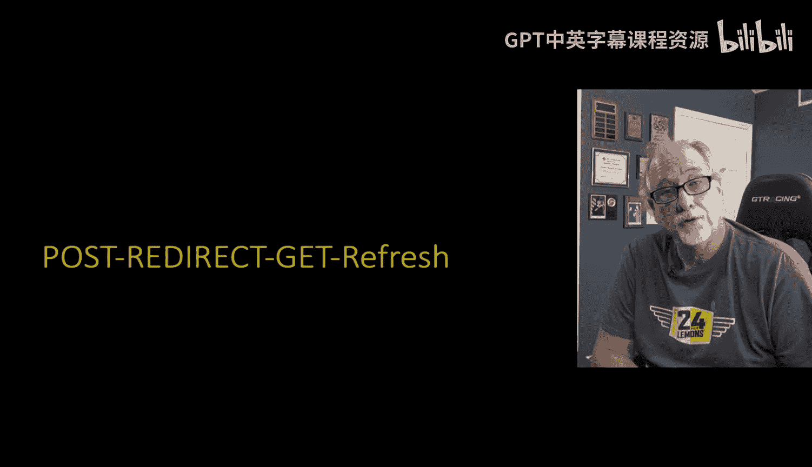

## 概述

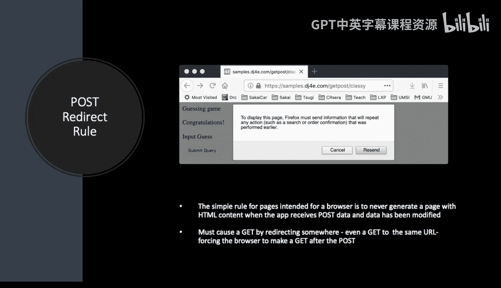

当用户通过POST请求提交表单数据后，如果直接返回一个HTML页面（例如“订单成功”页面），此时用户刷新浏览器，浏览器会重新发送上一次的POST请求，可能导致数据被重复处理（如重复下单）。为了解决这个问题，最佳实践是：在处理完POST请求后，不直接返回HTML，而是返回一个重定向响应（HTTP 302），引导浏览器发起一个新的GET请求来显示结果页面。这样，即使用户刷新，也只是重复GET请求，不会重复提交数据。

上一节我们介绍了表单提交的基本流程，本节中我们来看看如何通过重定向来优化这个流程，避免重复提交。

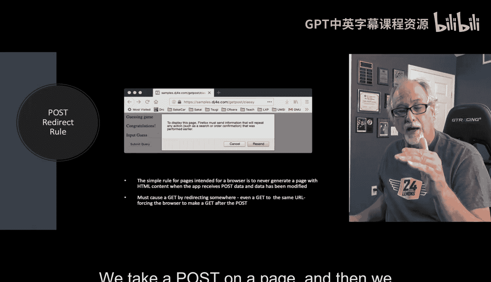

## POST/刷新问题与解决方案

### 问题根源

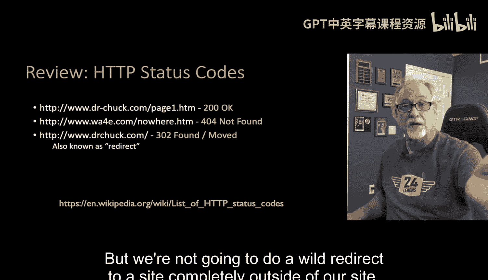

当服务器对POST请求响应`200 OK`并返回HTML内容后，该响应会与浏览器的历史记录和当前URL关联。如果用户此时刷新页面，浏览器会弹窗询问“确认重新提交表单吗？”，若用户确认，则会再次发送相同的POST请求，导致服务器重复处理数据。

### 核心规则

处理POST请求的一个基本规则是：**永远不要在POST请求的末尾直接返回HTML作为响应**。正确的做法是，在处理完POST数据后，返回一个重定向（Redirect）。

### 解决方案：POST重定向模式

这个模式遵循“处理POST -> 发送重定向 -> 显示结果”的流程。我们通常将用户重定向回同一个页面（或一个确认页面），让浏览器自动发起一个GET请求来获取最终显示的内容。这符合MVC模式中“控制器”的角色：根据操作结果，将用户的浏览器导航到另一个地址。

以下是HTTP状态码的简要回顾，其中我们将用到`302 Found`（重定向）：
*   `200 OK`：请求成功。
*   `404 Not Found`：资源未找到。
*   `403 Forbidden`：无权限访问。
*   **`302 Found`：请求的资源已被暂时移动到新位置（用于重定向）。**

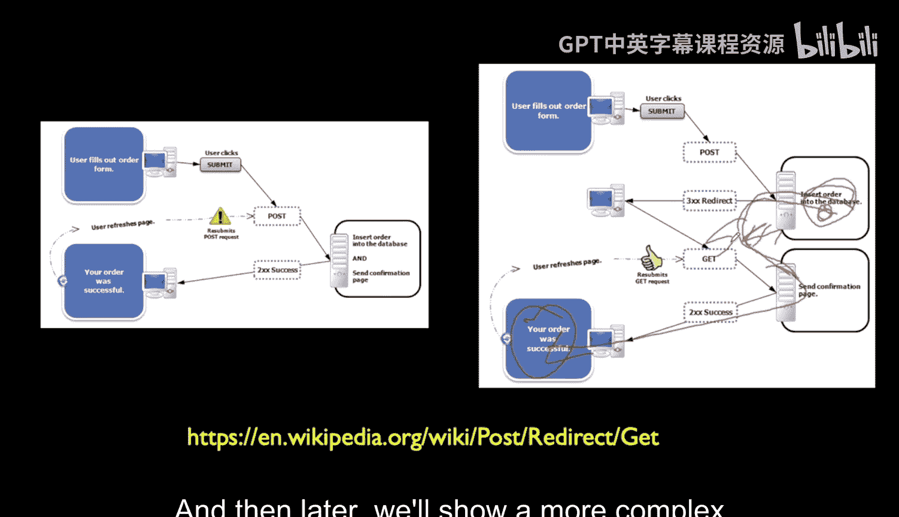

## 工作流程详解

下图展示了POST重定向模式如何工作：

1.  **首次访问（GET请求）**：用户访问页面，服务器返回带有表单的HTML。此时没有消息需要显示。
2.  **提交表单（POST请求）**：用户填写表单并提交，浏览器发送POST请求。
3.  **服务器处理并重定向**：服务器处理数据（如检查猜测值、更新数据库），**不渲染页面**，而是将需要显示的消息（如“猜对了”、“太高了”）存储到用户的会话（Session）中，然后返回一个`302`重定向响应，指示浏览器跳转回原页面（或指定页面）。
4.  **浏览器自动发起GET请求**：浏览器接收到`302`响应后，立即自动向重定向地址发起一个新的GET请求。
5.  **显示结果（GET请求）**：服务器在处理这个GET请求时，从会话中取出之前存储的消息，将其从会话中删除（防止重复显示），然后将消息与页面一起渲染返回给用户。
6.  **安全刷新**：此时用户看到的页面是GET请求的结果。如果用户刷新页面，浏览器只会重复最后的GET请求，不会重复提交POST数据，从而避免了重复操作。

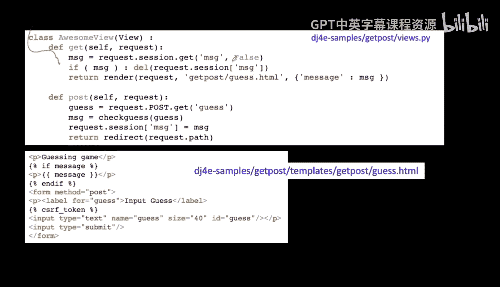

这种在两次请求间通过会话传递一次性消息的技术，常被称为“闪现消息”（Flash Message）模式。

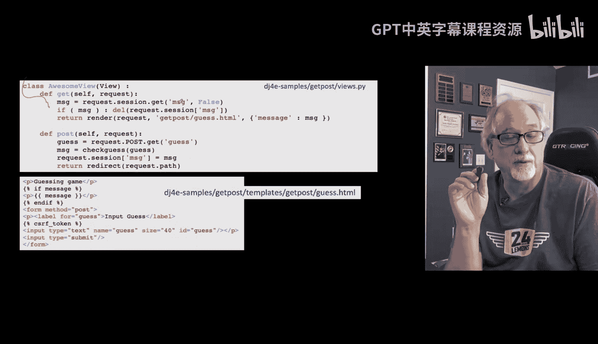

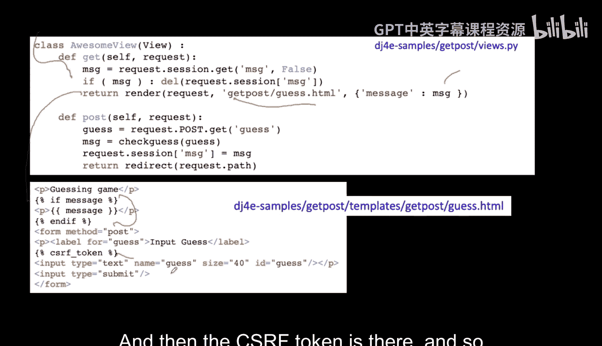

## 代码实现步骤

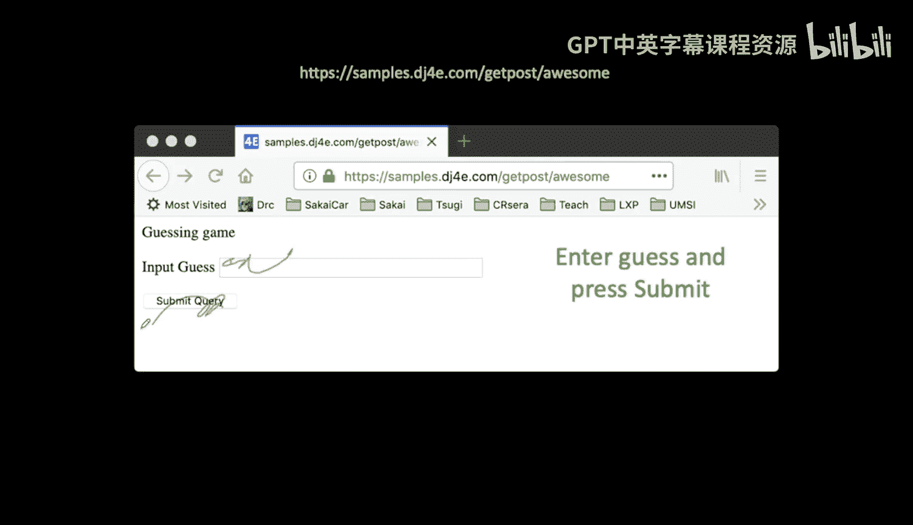

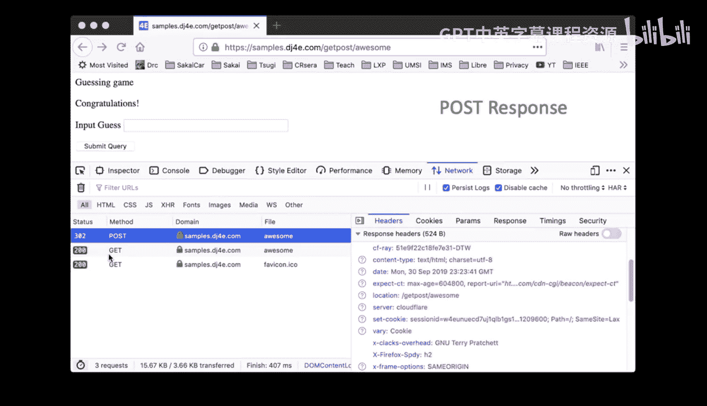

让我们通过一个“猜数字”的例子，看看代码如何实现上述流程。

### 1. 处理GET请求的视图部分

当用户首次访问或重定向后访问页面时，处理GET请求：

```python
def guess_view(request):
    # 尝试从会话（session）中获取可能存在的消息
    message = request.session.get('message', False)
    
    # 如果消息存在，则获取后立即从会话中删除它（闪现一次）
    if message:
        del request.session['message']
    else:
        message = None
    
    # 渲染模板，将消息（可能为None）传递给模板
    context = {'message': message}
    return render(request, 'guess_template.html', context)
```

### 2. 处理POST请求的视图部分

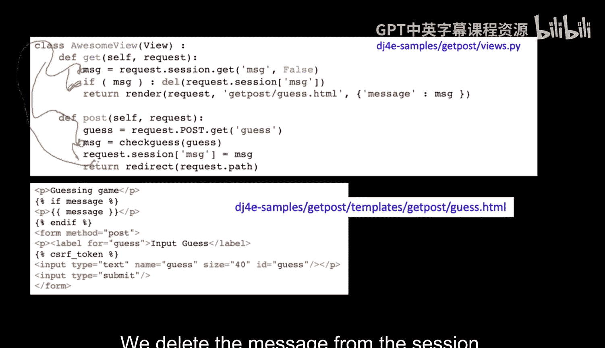

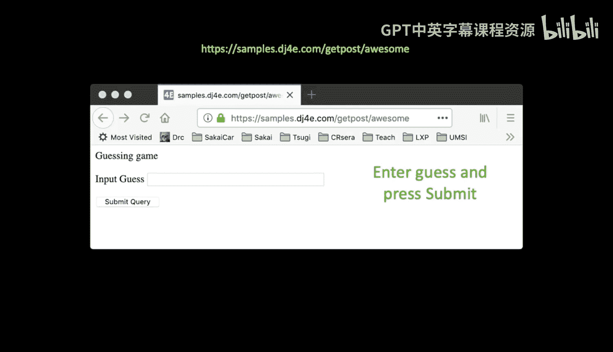

当用户提交猜测时：

```python
def guess_view(request):
    if request.method == 'POST':
        # 1. 从POST数据中获取用户的猜测
        user_guess = int(request.POST.get('guess'))
        
        # 2. 检查猜测值（业务逻辑）
        if user_guess > secret_number:
            msg = "太高了！"
        elif user_guess < secret_number:
            msg = "太低了！"
        else:
            msg = "恭喜你，猜对了！"
        
        # 3. 将结果消息存储到会话中
        request.session['message'] = msg
        
        # 4. 关键步骤：返回重定向响应，而不是render
        return redirect(request.path)  # 重定向回当前URL，触发GET请求
    
    # ... 以下是处理GET请求的代码（见上一部分）
```

### 3. 模板（HTML）示例

模板负责渲染表单和显示消息：

```html
<!-- guess_template.html -->

    <p><strong>{{ message }}</strong></p>


<form method="post">
    
    <label for="guess">输入你的猜测：</label>
    <input type="number" id="guess" name="guess" required>
    <button type="submit">提交</button>
</form>
```

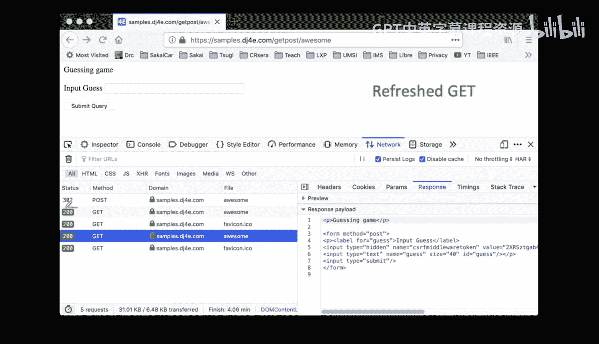

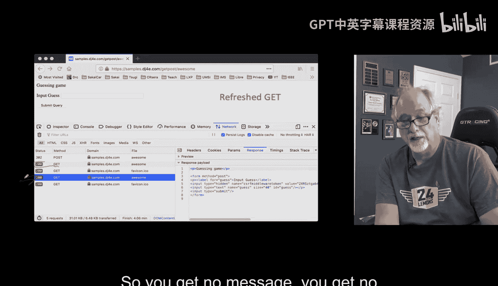

## 流程回顾与总结

让我们再清晰地梳理一遍整个交互过程：

1.  **初始GET**：用户访问页面，视图未在会话中找到消息，渲染一个空表单。
2.  **提交POST**：用户输入数字并提交。视图处理POST数据，生成提示信息`msg`，将其存入`request.session[‘message’]`，然后执行`return redirect(request.path)`。
3.  **浏览器重定向**：服务器对POST请求返回`302`状态码和重定向地址。浏览器自动向该地址发起新的GET请求。
4.  **最终GET**：视图再次被调用（处理GET请求）。它从会话中取出`message`，删除它，并将消息渲染到页面中呈现给用户。
5.  **安全状态**：此时页面地址是GET请求的结果。刷新只会重复步骤4，不会重复步骤2，从而彻底避免了重复提交问题。

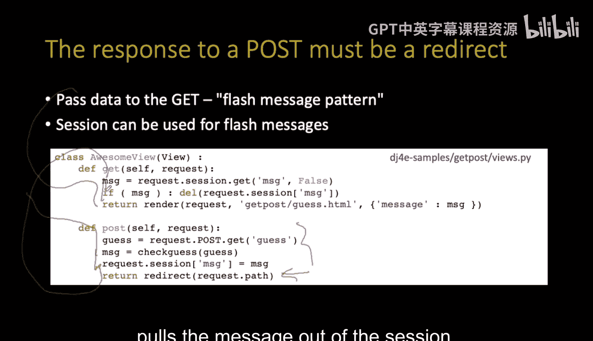

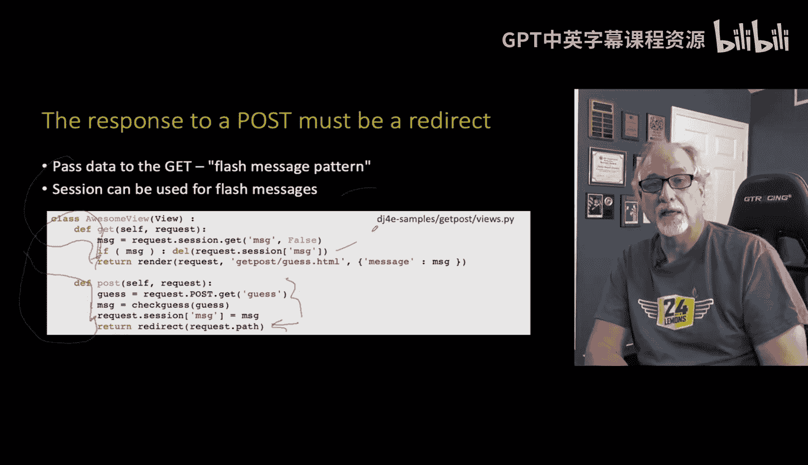

本节课中我们一起学习了POST重定向模式。其核心要点是：**在视图函数中处理完POST请求后，务必使用`redirect()`进行重定向，而不是`render()`**。同时，我们学会了使用会话（Session）在不同请求间安全地传递一次性信息（闪现消息）。这是一个提升Web应用健壮性和用户体验的重要技术。

接下来，我们将转向Django的内置表单功能，看看Django如何让我们更轻松地创建和验证表单，而无需手动编写大量HTML输入标签。