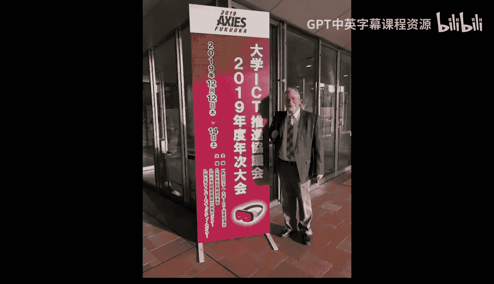

# 060：日本京都面对面办公时间

在本节课中，我们将回顾密歇根大学《Django for Everybody》课程在日本京都举行的一次特殊面对面办公时间。本次会议在卡拉OK包厢中举行，参与者来自世界各地，分享了他们的学习体验和背景。

---

大家好，我是Chuck。我们现在在日本京都。这是第一次在卡拉OK包厢举行的办公时间。我们没有唱歌，但吃了很多食物。这主要是一个安静、私密的房间，我可以使用。我认为未来可能会开始使用卡拉OK包厢作为会议地点，因为效果很好。

和往常一样，我想请在座的各位介绍一下自己，让大家认识一下你的同学。请挥挥手，打个招呼，并简单谈谈你对这门课程的感想。

以下是参与者的自我介绍：

*   Barrett：我来自美国，但住在日本。我目前教英语，但希望借助Chuck博士的课程，转型进入教育编程领域。
*   Gary：我来自中国。我在Coursera上学习Chuck教授的Web开发课程。我认为他是一位非常有趣的人。上他的课永远不会感到无聊，鼓励大家选课，不要睡着。
*   Se：我今天早上刚从韩国飞过来。非常高兴能来到这里参加这次活动。
*   Heri：我来自印度尼西亚。我的背景是林业，我学习编程是为了帮助我的研究。谢谢Chuck。
*   Uki Shaakai：我来自日本。我非常喜欢学习Python和编程，很高兴见到你。
*   You：我来自日本，很高兴见到你。
*   Shoji：我是这次活动的观察员，也是京都大学的教员，参与京都大学的MOOC项目。我和Chuck认识很久了，通常当他来日本或我们一起去开会时，我们会一起唱卡拉OK。

---

上一节我们介绍了本次办公时间的参与者和环境，本节中我们来看看Chuck分享的个人计划。

我不知道接下来具体会去哪里。但我对2020年有一个小决心。我打算取消很多常规旅行，尝试去一些从未去过的地方。因为世界各地有很多Python会议，所以我打算开始参加更多非传统会议地点的全球Python会议。也许不久后我就会来到你附近的国家。期待在线相见。

---

本节课中我们一起回顾了一次特别的课程办公时间，了解了来自不同背景的学习者如何通过Django课程探索编程世界，并知晓了讲师未来的旅行教学计划。