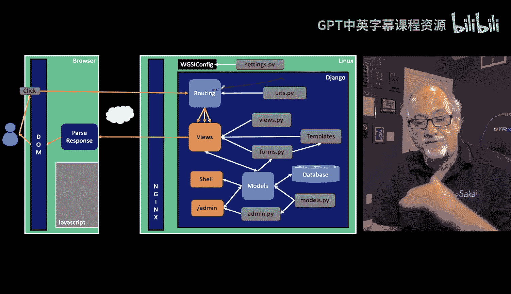
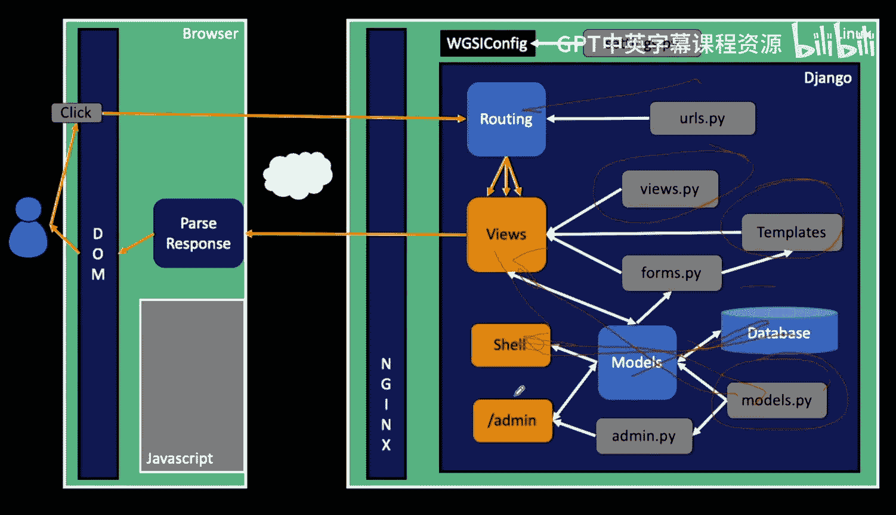
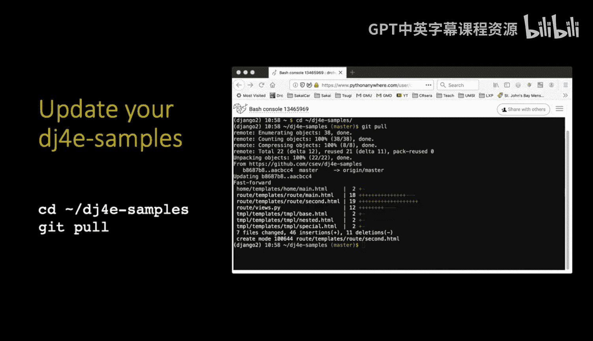
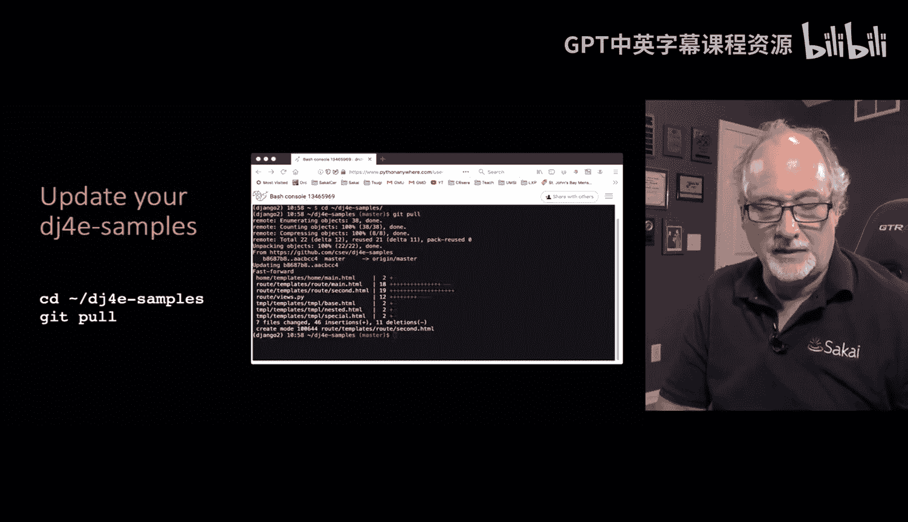
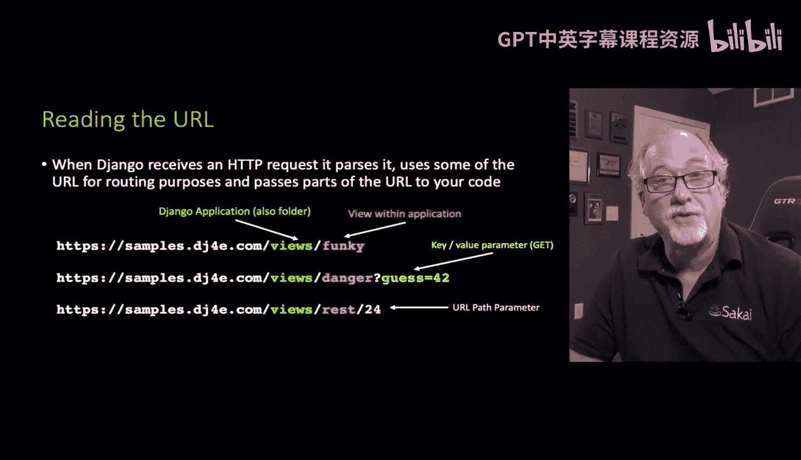
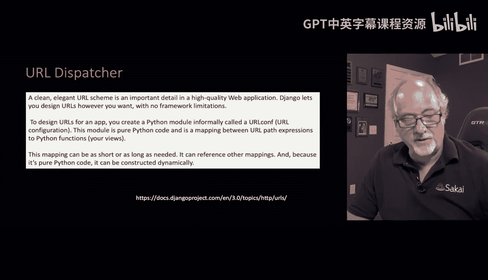
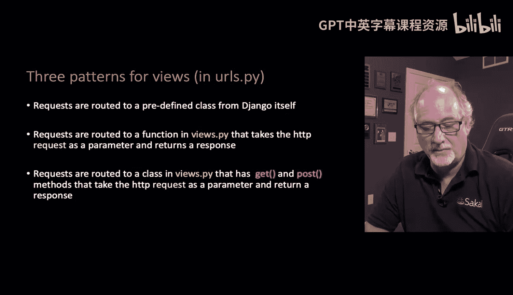
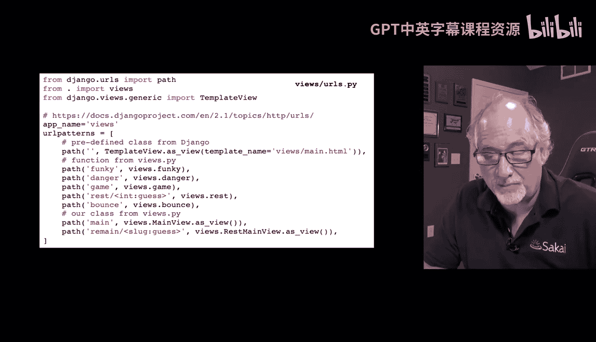
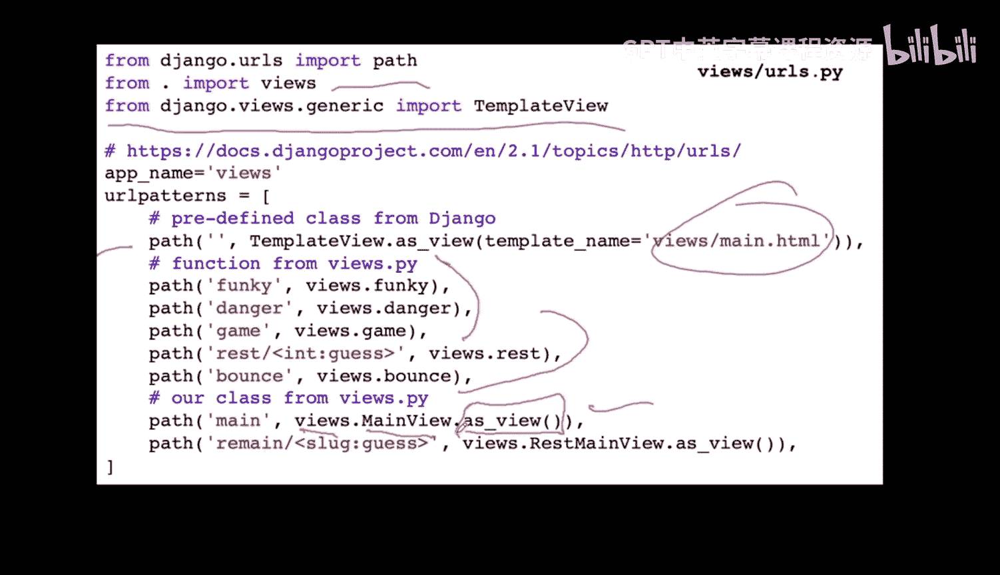

# 062：Django中的URL路由

在本节课中，我们将开始学习Django应用的实际输出部分，包括视图和模板的使用。这里有很多内容需要覆盖。

## 概述

到目前为止，我们已经开始讨论URL。URL很简单，它规定了当收到特定格式的请求时，选择一个视图并将请求发送给该视图。接下来我们将详细讨论视图、模板，以及后续会讲到的表单。我们还会花大量时间讨论模型，以及模型如何与Python代码交互、如何通过模型读写数据库。

随着我们将视图组合起来，我们开始真正构建整个应用。我知道需要一些时间才能看到完整的成果。

## 保持代码更新

无论你在哪里使用DJ4示例代码（无论是在你的笔记本电脑上还是在PythonAnywhere上），都应该时不时地执行 `git pull` 命令。因为我一直在更新这些示例，我希望你能确保拥有最新的代码副本。有时我会添加一些小内容，虽然不改变核心示例，但会补充一些文档。

## 视图：应用的核心

视图是应用的核心。URL最终会找到视图，模型则服务于视图的需求，作为允许视图读写数据库的中间层。

视图文件（`views.py`）具有模型方面的功能，它处理传入的数据（例如当我们收到表单和POST数据时，会将其复制到数据库中）。视图有时决定是否将用户重定向到另一个页面，或者是否要生成实际的HTML页面。它通常使用模板来生成HTML，然后将其发送回客户端。

因此，视图是真正完成工作的地方。你会发现，你在视图中编写大量代码，在URL文件中写一行，在模型文件中写几行，然后在视图中写很多内容。我认为模板也属于视图的一部分。

## Django如何处理请求

当Django收到一个传入的文档请求时，它首先解析URL。域名之后的第一部分通常是应用名称。请记住，Django有一个项目，其下有一个或多个应用。在每个DJ3示例中，你会看到很多应用，每个应用都展示某个主题的示例代码。

因此，URL的第二部分是应用名称，实际上它也是Django项目内的文件夹名称。

在应用内部，URL的下一部分通常是视图。应用内的视图在 `urls.py` 文件中定义。之后，URL可能包含两种参数：
1.  一种是跟在问号后面的键值对参数，使用 `&` 符号分隔。
2.  另一种是直接放在斜杠后面的参数，这更像REST风格的漂亮URL，将参数直接放在URL路径中，而不是使用问号（那是比较老派的做法）。

## URL分发器（路由器）

Django中有一个称为URL分发器（我在图中称之为路由器）的组件。它基本上让你能够定义URL，以及如何解析、处理和将这些URL路由到各个视图代码。

我们在 `urls.py` 文件中完成这项工作。有三种基本模式：

1.  **路由到预定义类**：将特定的URL模式路由到一个预定义的类。
2.  **路由到函数**：这是比较老派的方式，使用一个函数。该函数接收一个 `request` 对象，该对象封装了所有数据（参数、URL、是否是安全请求、来自哪个主机、IP地址等）。视图函数查看这个请求对象，决定做什么（可能查询数据库），然后返回一个响应（可能是重定向或HTML）。
3.  **路由到类视图**：定义一个类来处理请求。我们将看到，定义类视图非常方便。类中可以有像 `get` 和 `post` 这样的方法，具体取决于我们处理的HTTP请求类型。在这些方法中，请求对象和任何其他URL参数也会被传入。

## 示例解析

让我们看一个来自 `views` 应用的示例 `urls.py` 文件，我们会看到所有这三种路由类型的例子。

`urlpatterns` 是一个全局变量，它是一个列表，但对Django有特殊意义。

你会看到这些 `path` 命令（还有其他方式来描述这些路由）：
*   `path('', ...)` 中的空白路径意味着应用名称之后直接就是斜杠 `/`。
*   然后指定要将请求发送到哪个视图。

例如，`TemplateView.as_view(...)` 基本上是为了节省你编写代码的工作。如果你只想从模板文件夹中取出一个模板并返回它，你就不必在 `views.py` 中编写自己的代码。这就是为什么我们从 `django.views.generic` 导入 `TemplateView`。我们可以说：“我写了这个模板，就是不想写代码去读取并发送它。” 这是Django中一个预定义的组件，为我们完成这个任务。

更老派的方式是这里的语法：`from . import views` 会导入 `views.py` 文件，然后 `views.function_name` 指向其中的函数。

还有类视图，同样来自这个应用的 `views.py`。语法有点奇怪：`ClassName.as_view()` 是一个静态方法，它返回一个可以响应传入请求的函数。

## 下一步

接下来，我们将实际查看 `views.py` 文件，并仔细研究视图。

## 总结

本节课中，我们一起学习了Django中URL路由的核心概念。我们了解到视图是应用处理请求和生成响应的核心，URL分发器负责将不同的URL路径映射到对应的视图函数或类视图。我们还初步了解了三种基本的路由模式，并通过示例 `urls.py` 文件看到了它们的具体应用。理解URL路由是构建Django Web应用的基础，下一节我们将深入视图的内部工作机制。