# 064：Django模板使用指南 🧩

在本节课中，我们将学习Django模板系统。模板是生成动态HTML内容的关键部分，它允许我们将Python代码与HTML结构分离，从而创建更清晰、更易维护的用户界面。

---

## 视图的另一半：模板

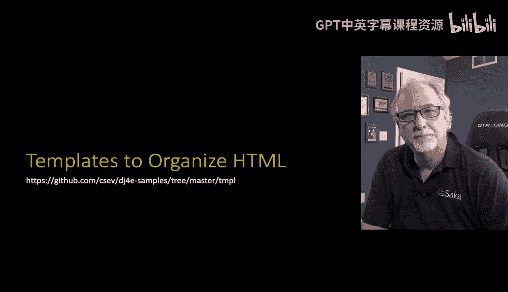

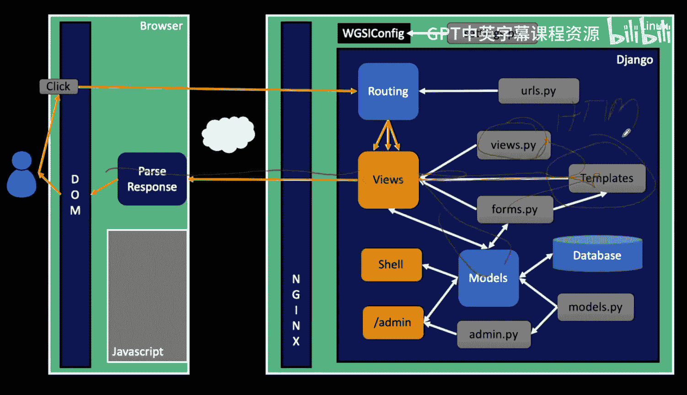

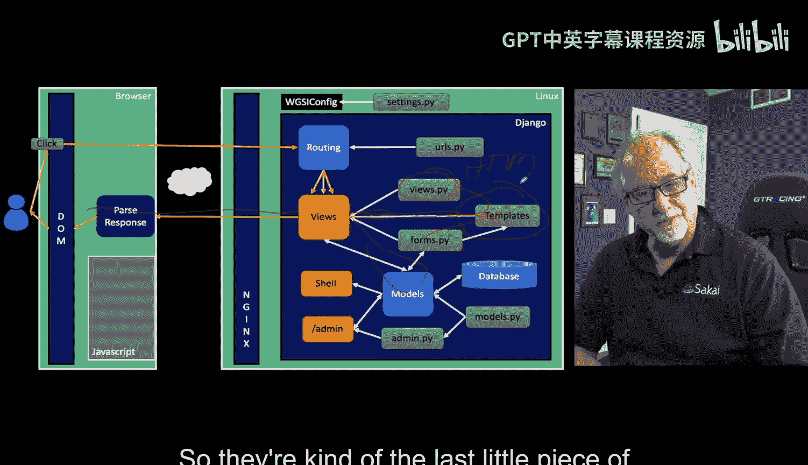

上一节我们介绍了视图（Views）作为处理请求和响应的Python代码。本节中，我们来看看如何通过模板（Templates）来生成最终的HTML页面。模板本质上是一种包含动态“热点”的HTML文件，这些热点会被我们传入的数据替换。

Django官网将其描述为“动态生成HTML的便捷方式”。我们使用Django默认的模板引擎。其基本流程是：我们将数据（通常来自模型）传递给模板，模板引擎进行“渲染”（Rendering），最终生成填充了数据的HTML，并通过HTTP响应返回给浏览器。这与我们之前直接拼接字符串返回响应的流程一致，但使用模板引擎能让代码更简洁、更易读。

### 为何使用模板？

以下是我们在视图中直接拼接HTML字符串的示例：

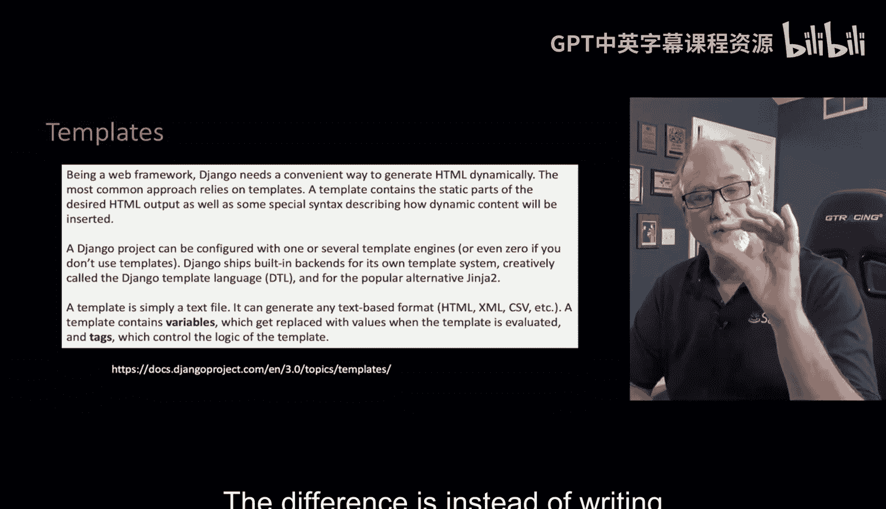

```python
def my_view(request):
    html = "<html><body>Your guess was " + str(guess) + "</body></html>"
    return HttpResponse(html)
```

这种方法存在几个问题：
*   需要处理字符串拼接（`+`）和转义。
*   Python代码的缩进与HTML结构的缩进容易冲突，导致代码难以阅读和维护。
*   当HTML结构复杂时，代码会变得冗长且容易出错。

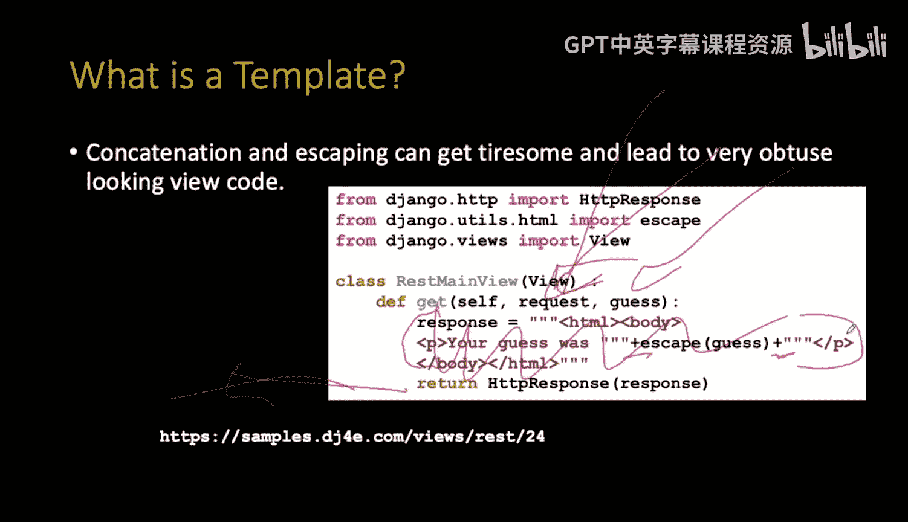

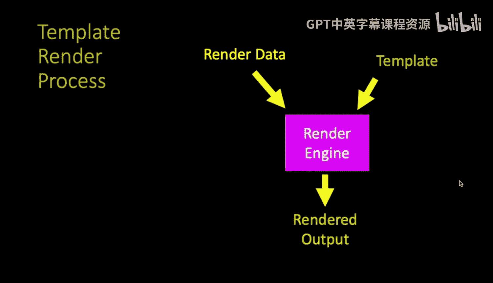

模板系统解决了这些问题，让我们能够专注于HTML结构本身。

### 模板基础：渲染过程

模板的核心是一个包含特殊标记的HTML文件。我们通过一个称为“上下文”（Context）的字典对象向模板传递数据。模板引擎会读取模板文件，找到这些特殊标记，并用上下文字典中对应的值替换它们，最终生成纯HTML。

一个最简单的例子：
*   **上下文数据（Context）**： `{'guess': 'fun stuff'}`
*   **模板文件（Template）**： `<p>Your guess was {{ guess }}</p>`
*   **渲染结果（Rendered HTML）**： `<p>Your guess was fun stuff</p>`

这里的 `{{ guess }}` 就是双花括号标记，它告诉模板引擎：“用上下文字典中 `'guess'` 键对应的值来替换这个位置”。

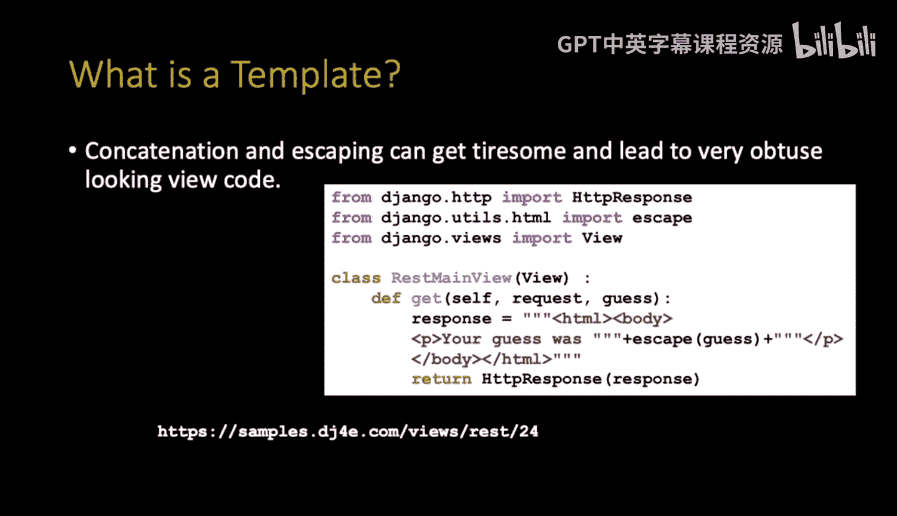

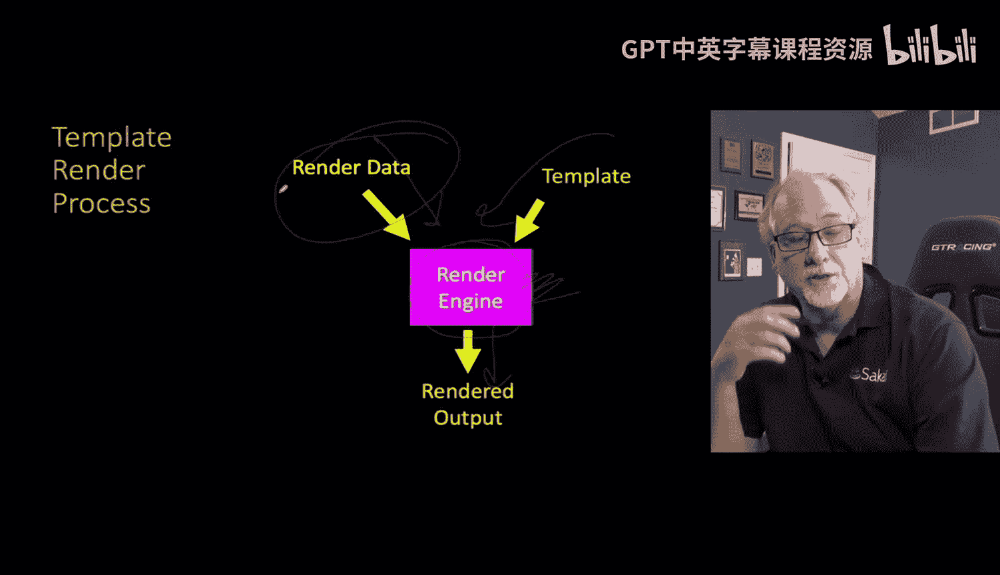

---

## 在视图中使用模板

让我们看一个在视图中实际使用模板的完整例子。假设我们有一个处理猜数字的视图。

以下是视图代码（`views.py`）：

```python
from django.shortcuts import render

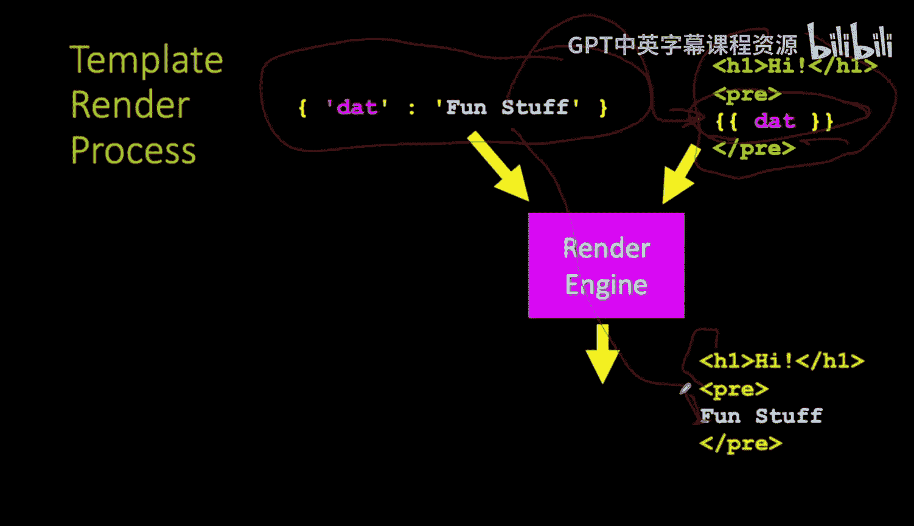

def game_view(request, guess):
    # 1. 准备上下文数据
    context = {
        'guess': int(guess)  # 将URL参数转换为整数并存入上下文
    }
    # 2. 渲染模板并返回HTTP响应
    return render(request, 'tmpl/guess.html', context)
```

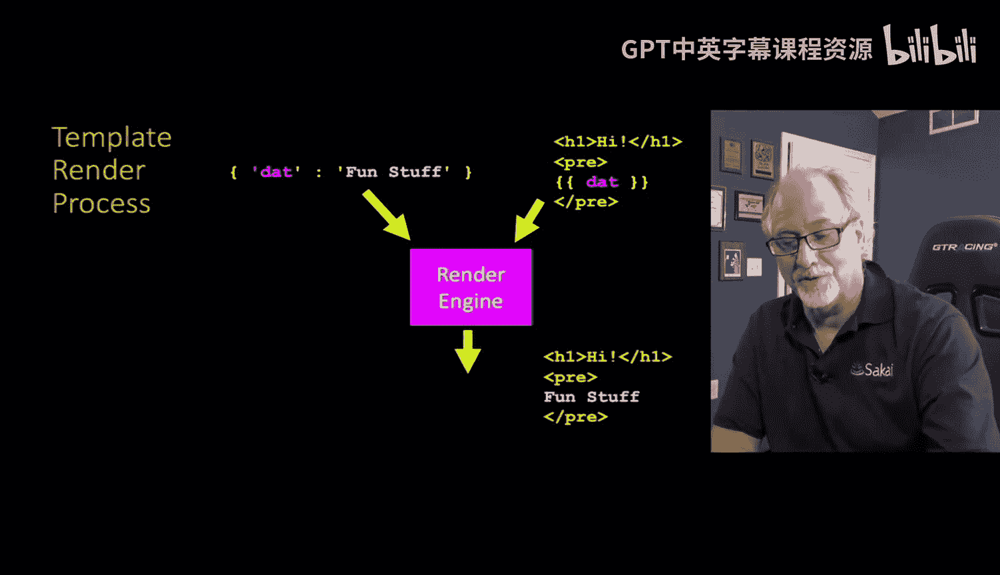

代码解析：
1.  我们创建了一个 `context` 字典，其中键 `'guess'` 的值来自URL参数 `guess`。
2.  我们使用 `render()` 函数。它接收三个参数：
    *   `request`: 原始的HTTP请求对象。
    *   `'tmpl/guess.html'`: 模板的路径（稍后解释路径规则）。
    *   `context`: 包含要替换到模板中数据的字典。
3.  `render()` 函数会处理模板，并直接返回一个 `HttpResponse` 对象，因此我们可以直接返回它。

---

## 模板语言基础语法

Django模板语言提供了两种主要标记来在HTML中嵌入动态内容和逻辑。

### 1. 变量替换：`{{ variable }}`

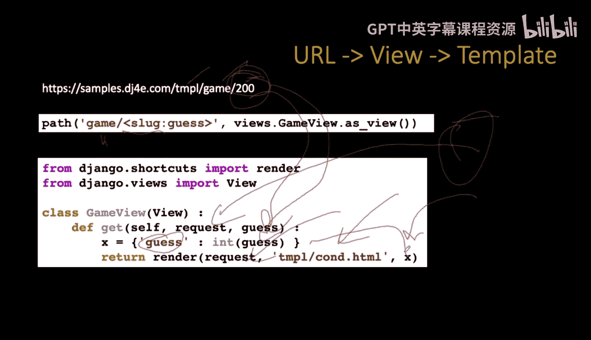

双花括号用于输出变量的值。这是最常用的标记。

**示例**：
在模板文件 `guess.html` 中：
```html
<p>Your guess was {{ guess }}.</p>
```
如果传入的上下文是 `{'guess': 200}`，渲染结果为：
```html
<p>Your guess was 200.</p>
```

### 2. 标签逻辑：``

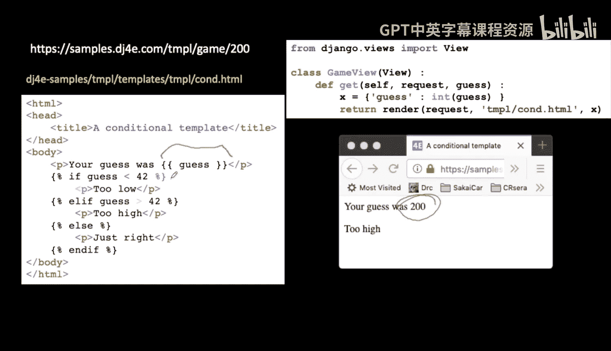

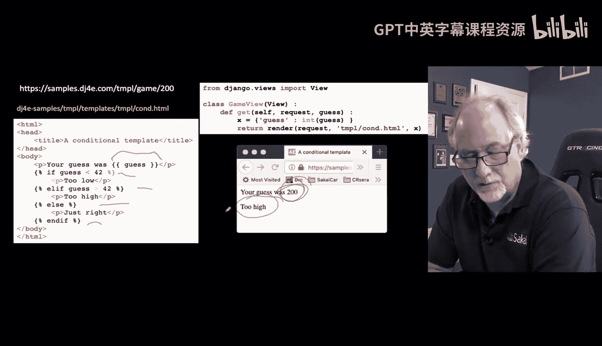

花括号加百分号用于执行更复杂的操作，如循环、条件判断等。它们不会直接输出内容，而是控制模板的逻辑流。

**示例**：在模板中添加条件判断。
```html
<p>Your guess was {{ guess }}.</p>

    <p>Too low!</p>

    <p>Too high!</p>

    <p>Just right!</p>

```
在这个例子中：
*   `` 开始一个条件判断块。
*   `` 和 `` 提供其他分支。
*   `` 结束整个 `if` 块。
如果 `guess` 为200，渲染结果将是：
```html
<p>Your guess was 200.</p>
<p>Too high!</p>
```

---

## 模板文件的组织与命名约定

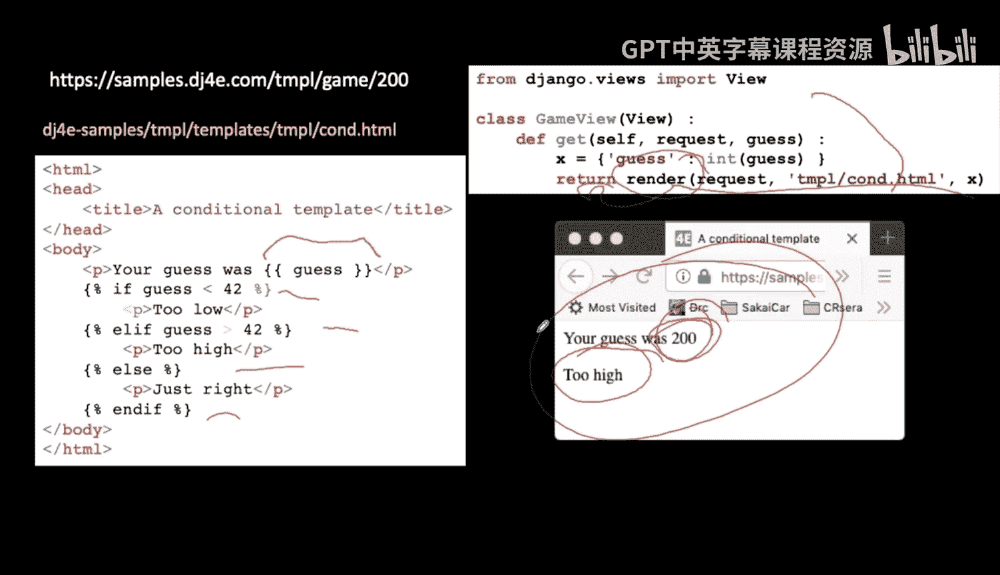

Django项目可以包含多个应用（Apps），所有应用的模板在加载后都位于一个全局命名空间中。这可能导致不同应用中的同名模板文件发生冲突。

为了解决这个问题，我们采用一个通用约定：

**在 `templates` 目录下，为每个应用创建一个同名的子文件夹，并将该应用的模板文件放入其中。**

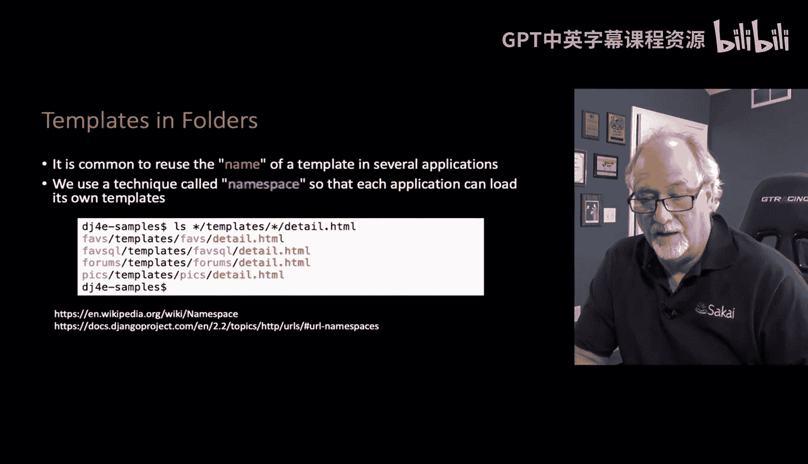

目录结构示例：
```
my_project/
├── my_app/
│   ├── views.py
│   └── templates/       # 应用自己的模板目录
│       └── my_app/      # 以应用名命名的子文件夹
│           └── index.html
└── another_app/
    ├── views.py
    └── templates/
        └── another_app/
            └── index.html
```

在视图中引用模板时，需要包含这个子文件夹路径：
```python
return render(request, 'my_app/index.html', context)
# 而不是 return render(request, 'index.html', context)
```

虽然这看起来有些冗余（路径中包含了两次应用名），但这是确保模板名称全局唯一的最佳实践，避免了潜在的冲突。

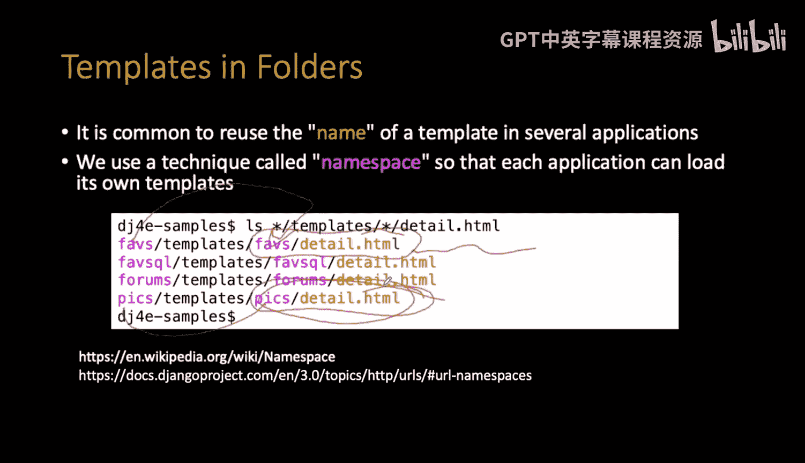

---

## 总结

本节课中我们一起学习了Django模板系统的核心概念和使用方法。

我们了解到：
1.  **模板的作用**：将业务逻辑（Python视图）与表现层（HTML结构）分离，使代码更清晰、更易维护。
2.  **渲染流程**：视图准备上下文数据，调用 `render()` 函数，指定模板路径，由模板引擎完成变量替换和逻辑处理，生成最终HTML。
3.  **基本语法**：
    *   使用 `{{ variable }}` 来插入变量值。
    *   使用 ``（如 ``、``）来添加逻辑控制。
4.  **组织规范**：通过在 `templates` 目录下创建与应用同名的子文件夹来管理模板，这是防止命名冲突的重要约定。

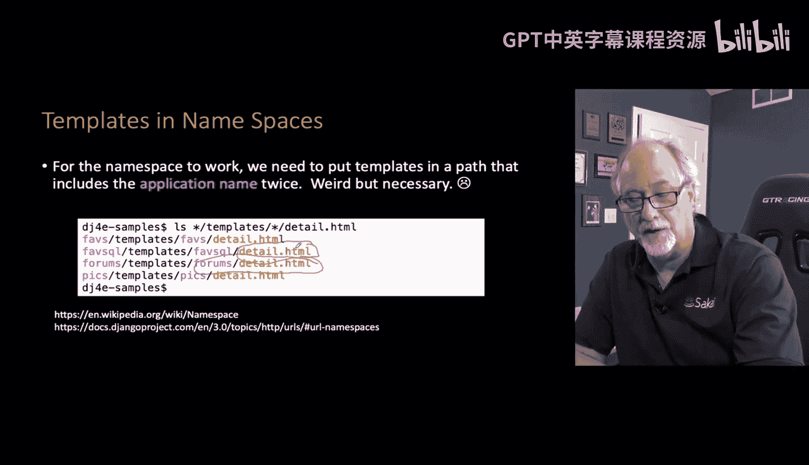


从下一节开始，我们将利用视图、模型和模板这三个核心组件，正式构建具有完整用户界面的Django Web应用。