# 066：在PythonAnywhere上运行的Django应用概览 🚀


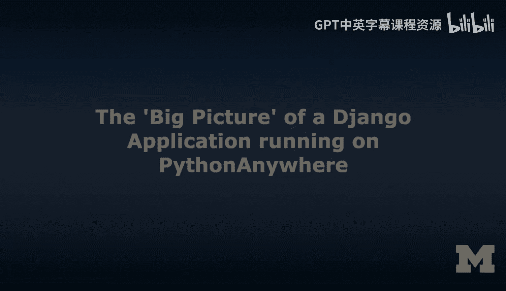

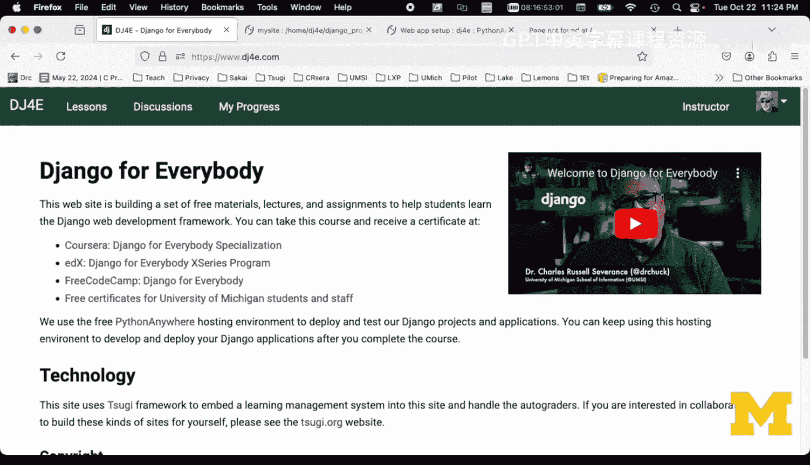

在本节课中，我们将要学习一个Django Web应用在PythonAnywhere服务器上的整体运行流程。我们将从宏观角度理解请求如何从浏览器发出，经过Django应用处理，并最终返回响应的完整周期。这对于理解Django项目的结构和各部分如何协同工作至关重要。

## 宏观视角：Django应用的本质

Django应用本质上是一个运行在服务器上的Python程序。你创建对象、加载数据，并通过这些对象来实现你的Web应用功能。其核心是**请求-响应循环**：用户在浏览器中请求一个页面，该请求通过网络路由到你的Django应用；应用处理请求（可能涉及读取数据库），生成输出，然后将其发送回浏览器；浏览器解析响应并展示给用户。这个循环是浏览器和互联网运作的基本引擎。

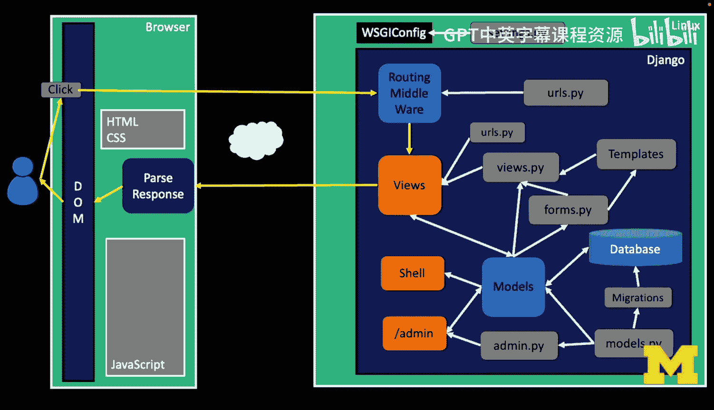

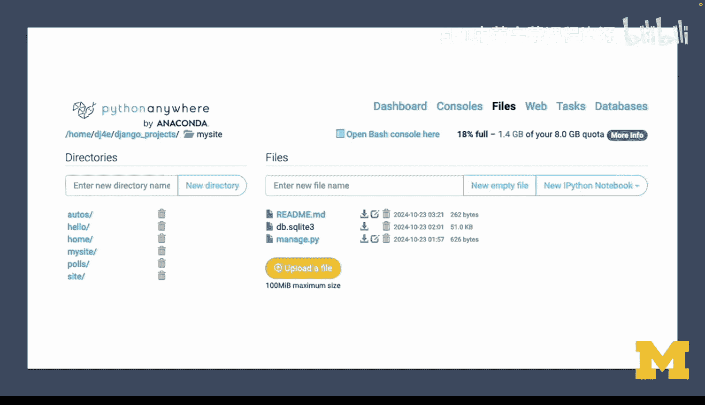

理解这个流程，你可以将其想象为一张数据流向图，也可以简单地将其视为一组文件夹和文件，因为在开发应用时，你主要就是在操作文件夹和文件。

## 项目结构：多应用视角

为了更好地理解整体结构，我们可以从一个包含多个应用的项目视角来看。一个典型的Django项目可能包含以下部分：
*   `mysite/`：这是整个Django项目的**全局配置**文件夹。
*   `polls/`、`autos/`、`hello/`：这些是具体的**应用**，每个应用负责特定的功能模块。

每个应用内部通常包含类似的文件结构，例如 `urls.py`、`views.py`、`models.py` 等。而 `mysite/` 文件夹下的 `urls.py` 和 `settings.py` 则负责项目的全局路由和配置。

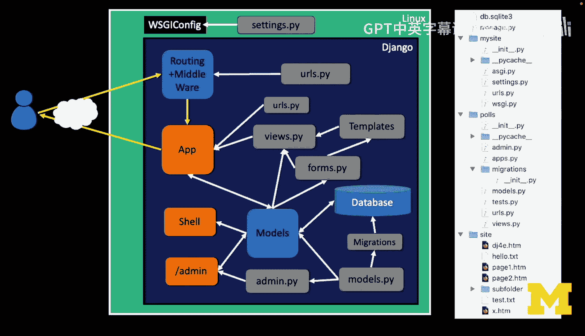

## 启动与配置：一切的起点

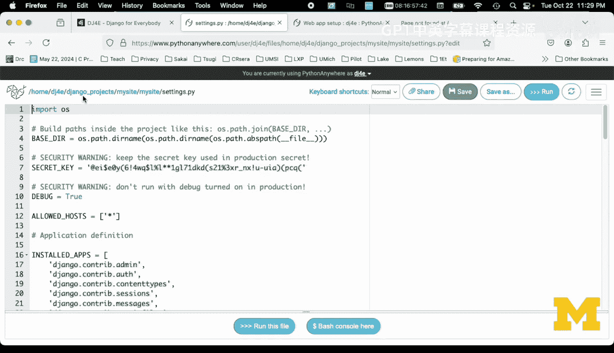

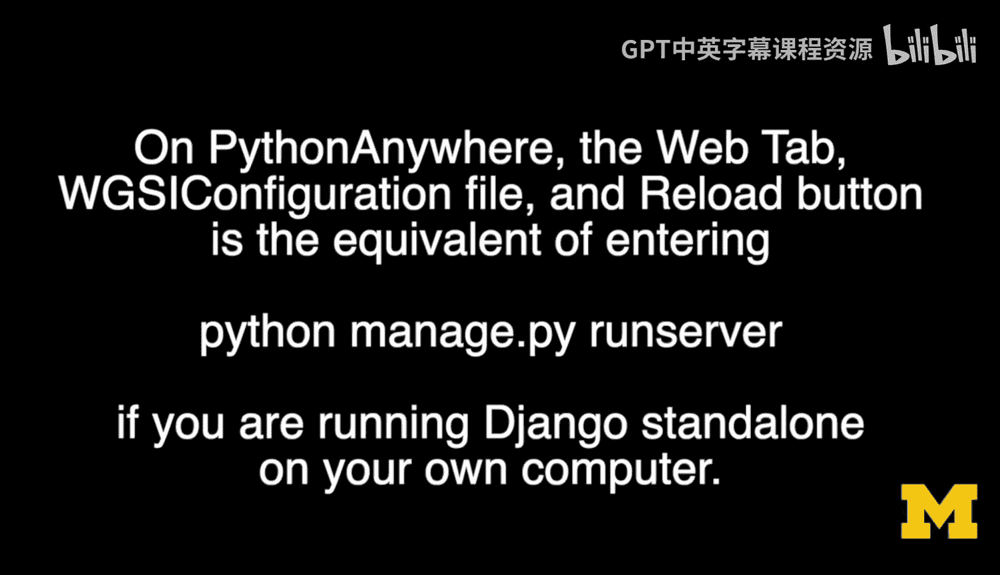

当你在PythonAnywhere点击“重新加载”按钮时，你的Django应用就启动了。启动过程始于读取 `settings.py` 文件。这个文件是你的Django实例的**核心配置文件**。

以下是 `settings.py` 中的几个关键部分：
*   **`ALLOWED_HOSTS`**：这是一个安全过滤器，用于指定哪些主机/域名可以向你的应用发送请求。在开发初期，我们通常将其设置为 `['*']` 以接受所有请求。
    ```python
    ALLOWED_HOSTS = ['*']
    ```
*   **`INSTALLED_APPS`**：这里列出了所有需要加载的应用，包括Django内置的应用和你自己创建的应用。每添加一个新应用，都需要在此处添加一行。
*   **`ROOT_URLCONF`**：这指定了项目的**根URL配置模块**。通常指向 `mysite.urls`。它定义了在域名之后（例如 `django4.pythonanywhere.com/` 之后）的URL路径如何被路由。
*   **数据库配置**：用于设置应用使用的数据库。

`settings.py` 中的 `ROOT_URLCONF = 'mysite.urls'` 这一行，实际上是在导入并执行 `mysite/urls.py` 这个Python模块。

## 路由解析：从全局到局部

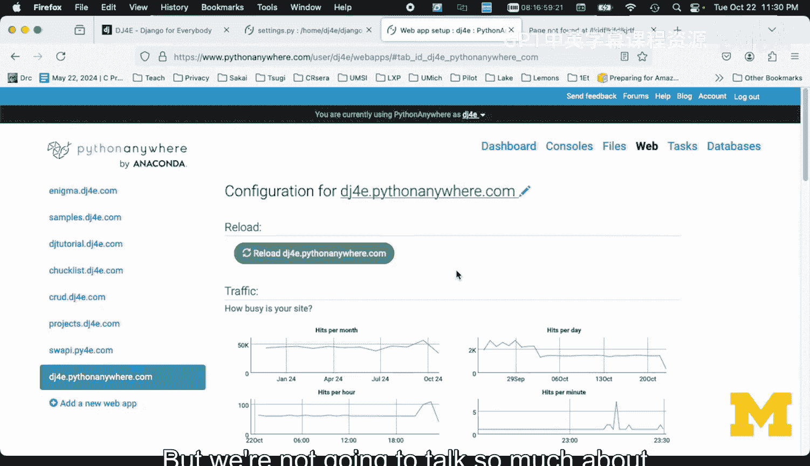

上一节我们介绍了项目的全局配置，本节中我们来看看请求是如何被路由到具体处理函数的。

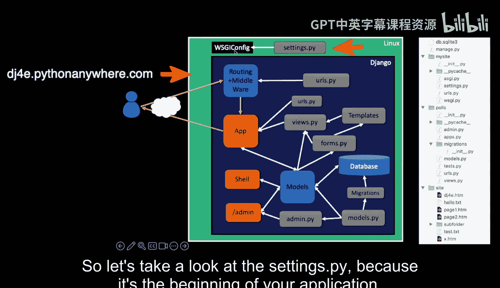

当请求到达时（例如访问 `django4.pythonanywhere.com/polls/`），Django首先会查阅根URL配置文件（`mysite/urls.py`）。

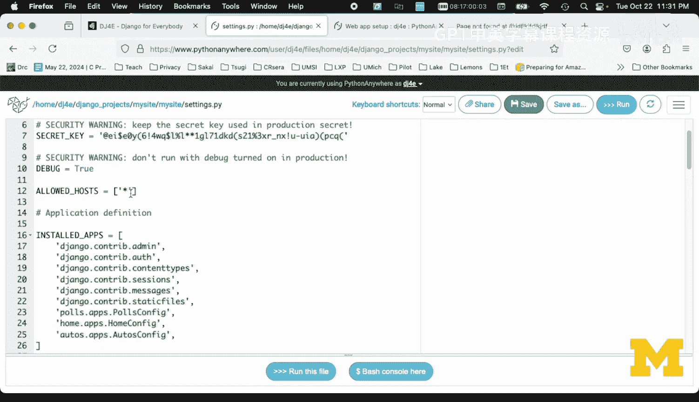

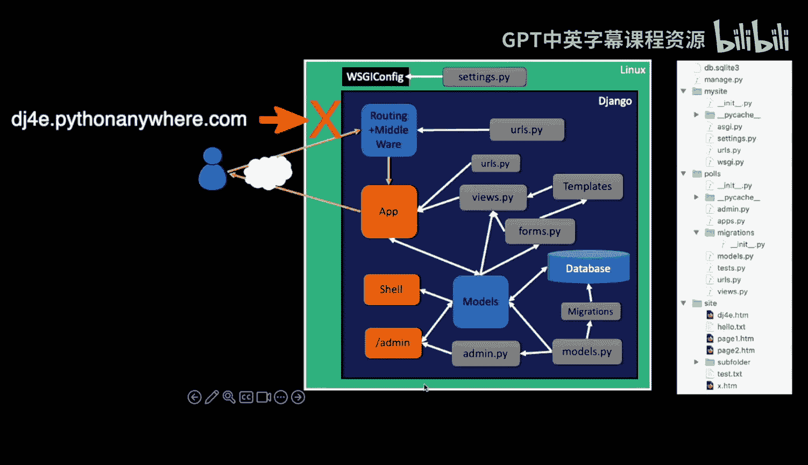

以下是 `mysite/urls.py` 的一个示例：
```python
from django.contrib import admin
from django.urls import include, path

urlpatterns = [
    path('admin/', admin.site.urls),
    path('polls/', include('polls.urls')),  # 将 /polls/ 开头的请求转交给 polls 应用
    path('autos/', include('autos.urls')),
    # ... 其他应用路由
]
```
这个文件定义了一个URL模式列表。它检查请求路径中紧跟在域名后面的部分。例如，如果路径以 `polls/` 开头，Django就知道将这个请求（以及 `polls/` 之后的部分）转交给 `polls` 应用内部的 `urls.py` 去进一步处理。

## 应用内部路由与视图

当一个请求被路由到特定应用（如 `polls`）后，该应用内部的 `urls.py` 文件将接管后续的路由工作。它负责解析应用内部的URL路径。

以下是 `polls/urls.py` 的一个示例：
```python
from django.urls import path
from . import views

urlpatterns = [
    # 例如：/polls/
    path('', views.IndexView.as_view(), name='index'),
    # 例如：/polls/5/
    path('<int:pk>/', views.DetailView.as_view(), name='detail'),
    # 例如：/polls/5/results/
    path('<int:pk>/results/', views.ResultsView.as_view(), name='results'),
    # 例如：/polls/owner
    path('owner', views.owner, name='owner'),
    # 例如：/polls/5/vote
    path('<int:pk>/vote/', views.vote, name='vote'),
]
```
这个文件定义了应用层级的URL模式。例如，路径 `<int:pk>/` 会匹配像 `/polls/5/` 这样的URL，并将数字 `5` 作为参数 `pk`（主键）传递给对应的视图函数 `views.DetailView`。

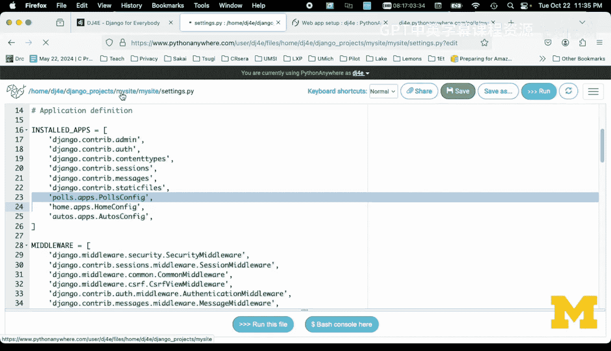

## 视图：处理请求的核心

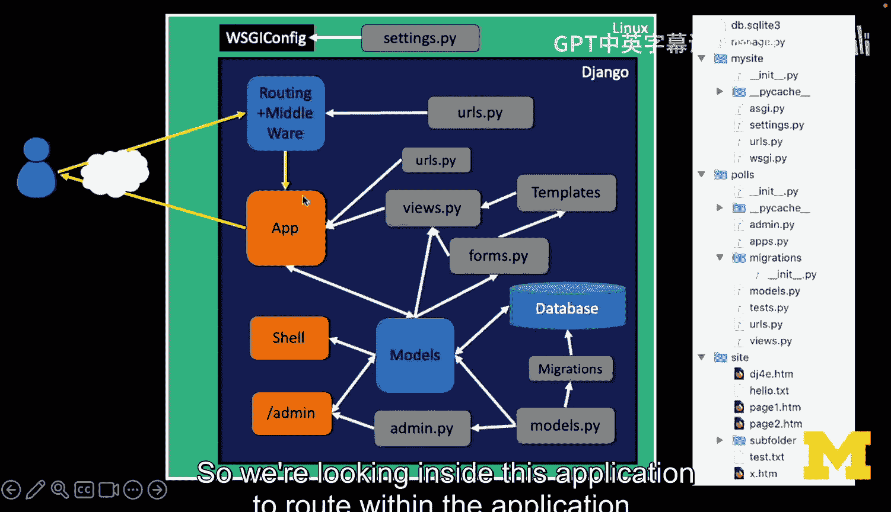

视图（View）是处理业务逻辑的核心。它接收Web请求，并返回Web响应。视图可以是一个函数（**函数视图**），也可以是一个类（**类视图**）。

在 `polls/urls.py` 中，`views.IndexView` 和 `views.owner` 就分别指向类视图和函数视图。让我们看一下 `polls/views.py` 中的 `IndexView`：
```python
from django.views import generic
from .models import Question

class IndexView(generic.ListView):
    template_name = 'polls/index.html'
    context_object_name = 'latest_question_list'

    def get_queryset(self):
        return Question.objects.order_by('-pub_date')[:5]
```
这是一个**类视图**，它继承自Django提供的通用视图 `generic.ListView`。我们只需指定使用哪个模板（`template_name`）和上下文变量名（`context_object_name`），并定义获取数据的方法（`get_queryset`）。Django的通用视图帮我们处理了大量重复性工作。

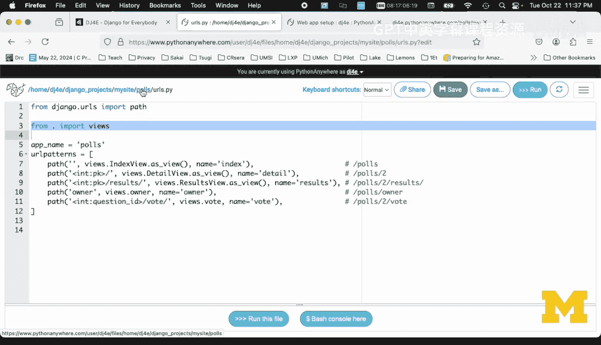

## 模板：渲染数据的助手


视图负责准备数据，而模板（Template）则负责将这些数据渲染成最终的HTML页面。模板使用Django模板语言，可以插入变量、使用逻辑标签。

视图会将数据（上下文）传递给模板。例如，`IndexView` 将查询到的问题列表以 `latest_question_list` 为变量名传递给 `polls/index.html` 模板。

以下是模板 `polls/templates/polls/index.html` 可能的样子：
```html

    <ul>
    
        <li><a href="">{{ question.question_text }}</a></li>
    
    </ul>

    <p>No polls are available.</p>

```
模板接收 `latest_question_list` 变量，并使用 `` 标签循环遍历，为每个问题生成一个列表项链接。

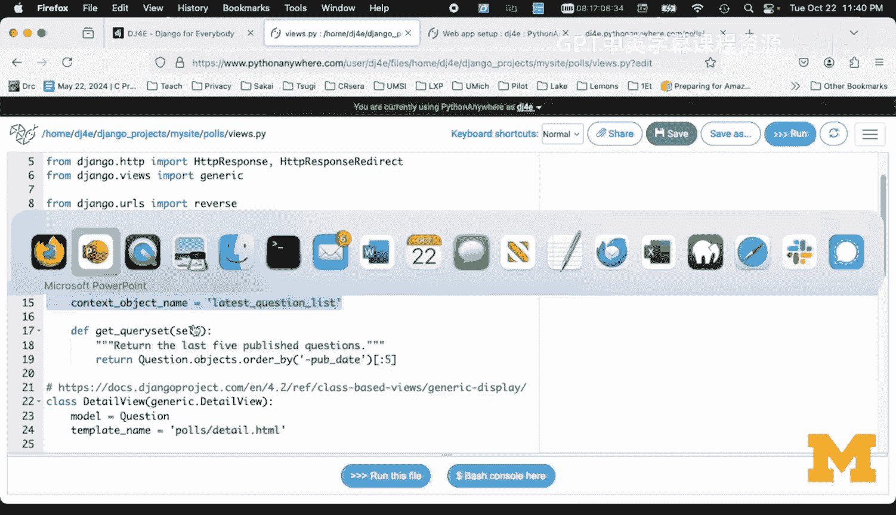

## 完成循环：返回响应


当模板渲染完成后，视图会将其封装成一个 **`HttpResponse`** 对象。这个响应对象沿着来的路径返回：从应用视图，到Django核心，再通过网络发送回用户的浏览器。浏览器接收到响应后，将其解析并显示为网页，从而完成整个请求-响应循环。

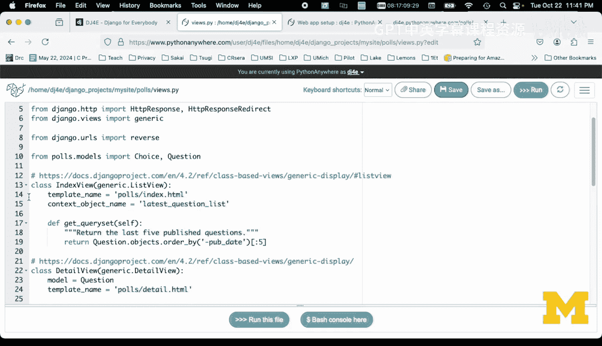

## 总结

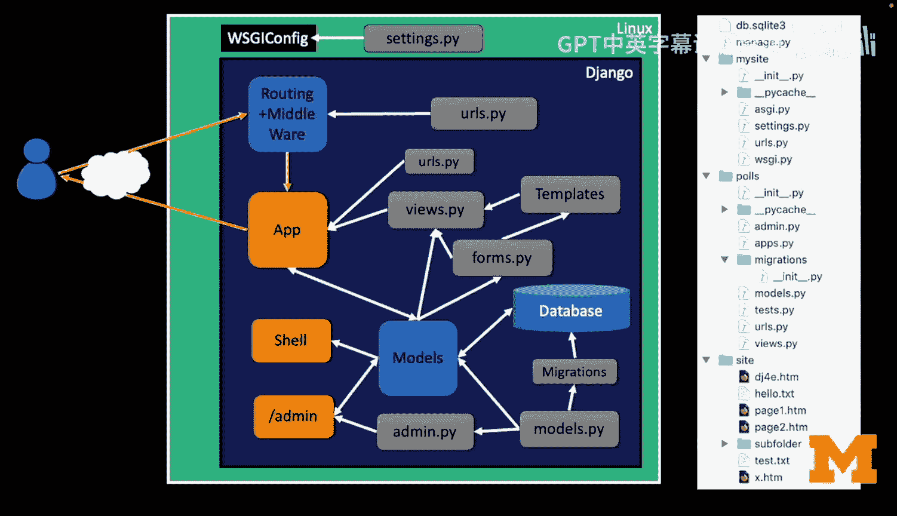

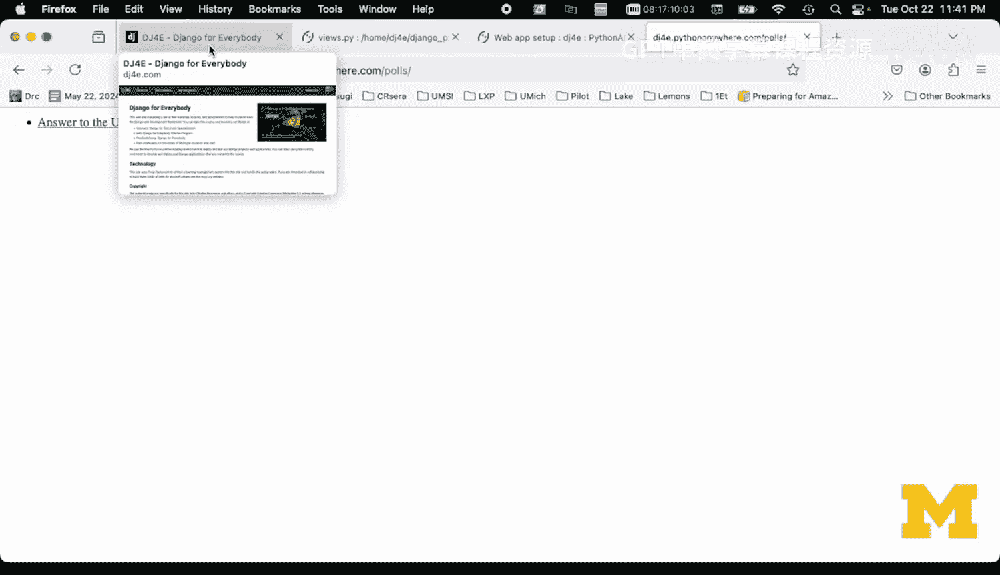

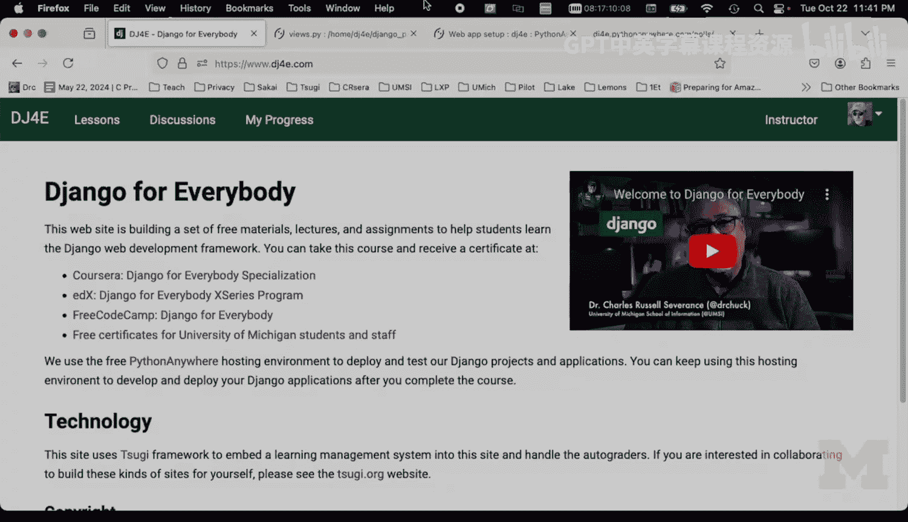


本节课中我们一起学习了Django应用在PythonAnywhere上的运行概览。我们梳理了从请求发出到响应返回的完整流程：**`settings.py`** 是应用的启动配置中心；**根 `urls.py`** 进行全局路由分发；**应用内的 `urls.py`** 进行细粒度路由；**视图** 处理核心业务逻辑并准备数据；**模板** 负责将数据渲染成用户看到的HTML界面。理解这个“大图景”对于构建和调试Django Web应用至关重要。