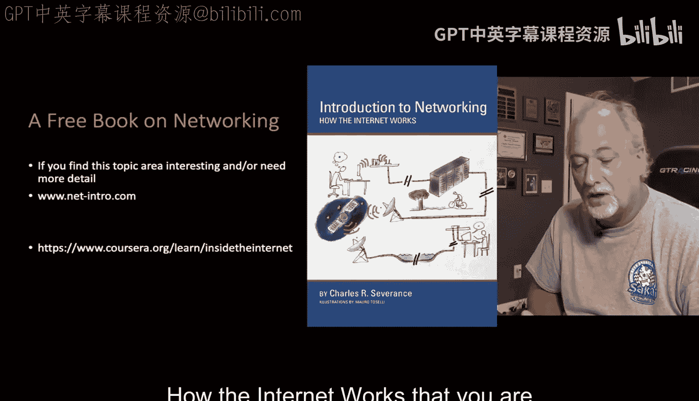
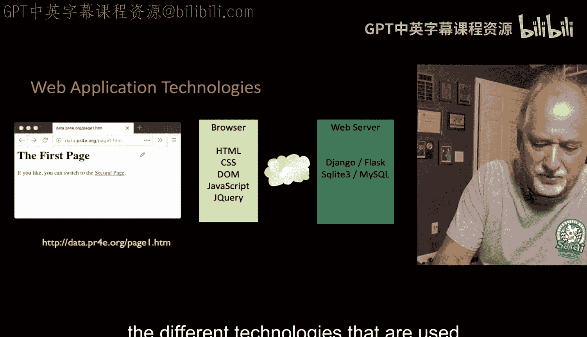
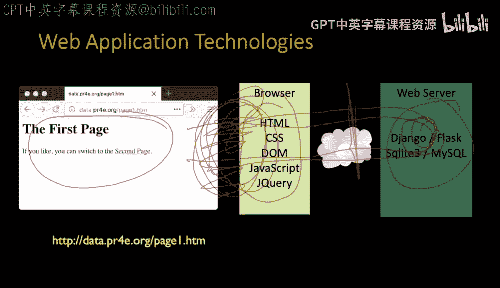
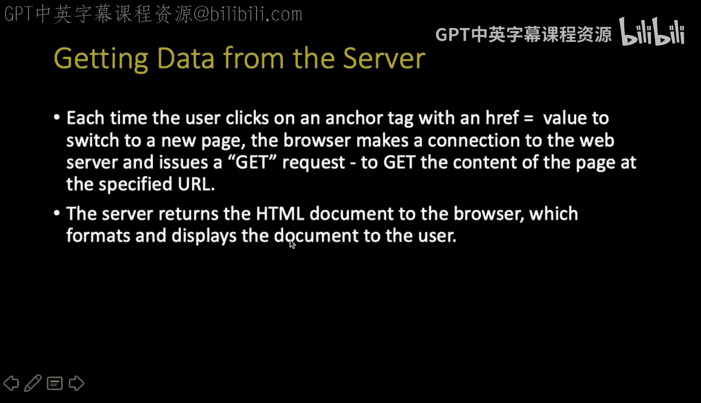
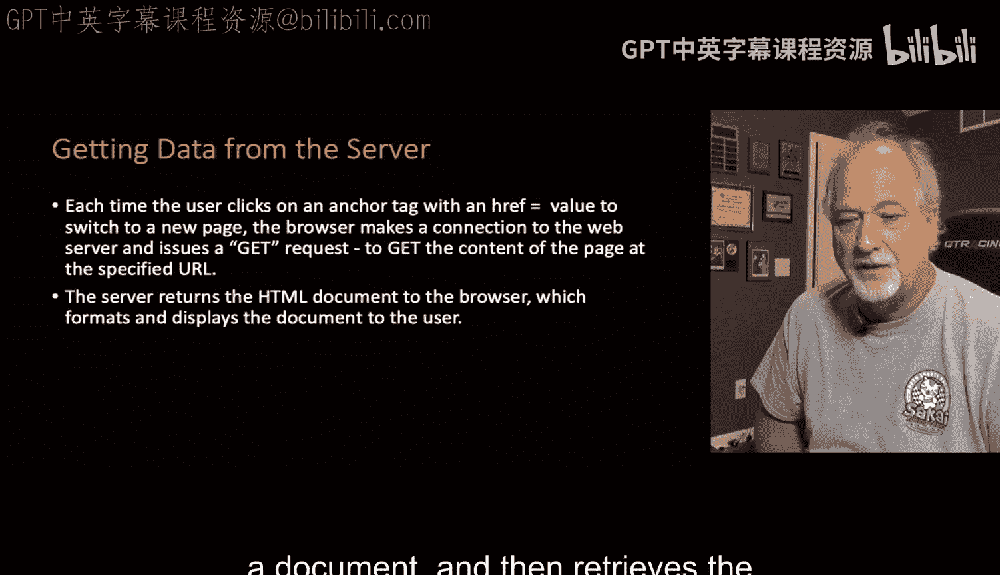
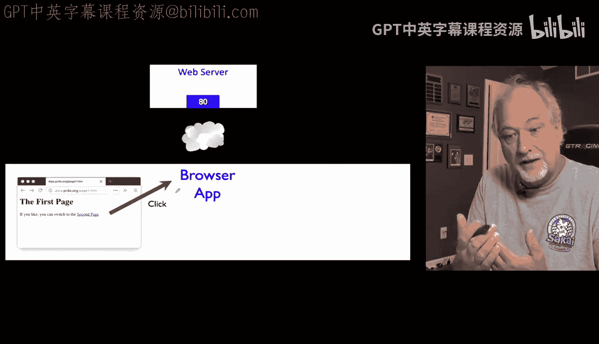
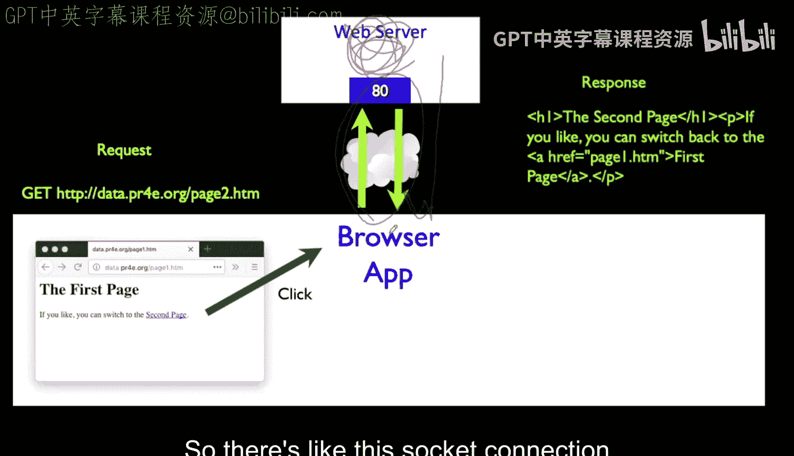
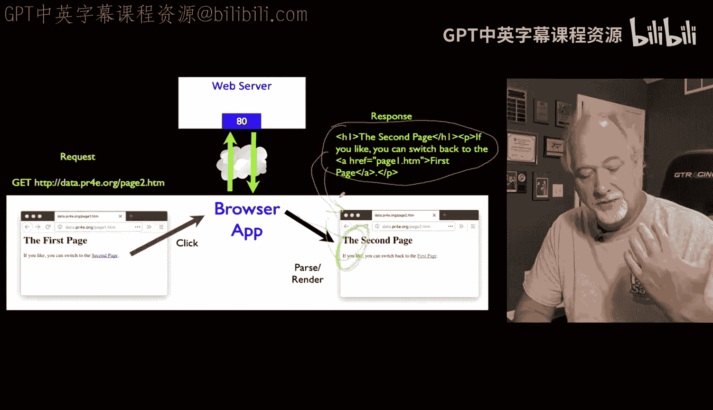
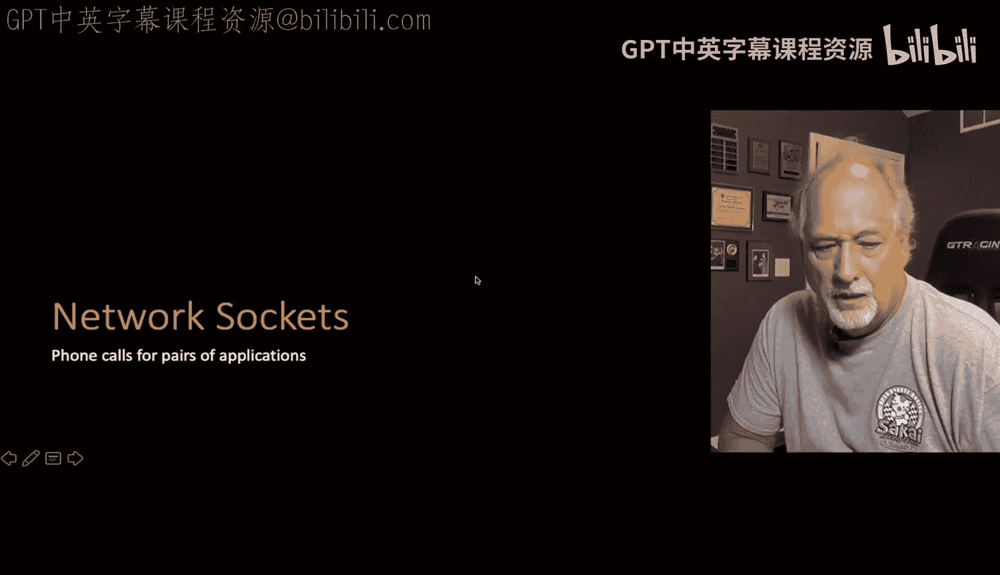

# 067：动态Web内容简介

在本节课中，我们将学习动态Web内容的基本概念，理解浏览器与服务器之间如何通过请求-响应周期进行通信，并初步了解构成现代Web应用的各种技术。

## 概述

当我们谈论构建Web应用时，理解底层的网络协议至关重要。虽然使用框架时无需了解所有细节，但在调试应用时，这些知识必不可少。本节课将介绍动态Web内容的基础，包括请求-响应模型、网络套接字以及构成Web页面的前端与后端技术。



## 请求-响应周期

上一节我们介绍了动态Web内容的重要性，本节中我们来看看其核心机制：请求-响应周期。

浏览器是一个运行在您电脑或手机上的应用程序。它监视着来自屏幕、键盘或鼠标的事件。当您点击网页上的某个链接时，浏览器会拦截这个点击事件。

随后，浏览器会打开一个**网络套接字**，连接到远程的Web服务器，并发送一个请求。这个请求是特定格式的，包含一个`GET`命令和它想要获取的URL。



**代码示例：一个简单的HTTP GET请求**
```
GET /page1.html HTTP/1.1
Host: www.example.com
```



服务器收到请求后，会在内部进行一系列工作，例如读取磁盘文件或运行程序来生成您所需的内容。完成这些工作后，服务器会通过同一个套接字连接将响应发送回浏览器。



浏览器接收到响应（通常是HTML文档）后，会解析其中的HTML、CSS和JavaScript代码，最终将这些代码渲染成您所看到的可视化页面。



以下是请求-响应周期的关键步骤：
1.  **用户交互**：用户在浏览器中触发一个事件（如点击链接）。
2.  **建立连接**：浏览器打开一个网络套接字连接到Web服务器。
3.  **发送请求**：浏览器通过该连接向服务器发送格式化的HTTP请求。
4.  **服务器处理**：服务器处理请求，生成相应的内容。
5.  **返回响应**：服务器将生成的HTML等内容通过连接发回浏览器。
6.  **渲染显示**：浏览器解析接收到的内容，并将其渲染显示给用户。

## Web应用的技术栈

理解了基本的通信模型后，我们来看看构建一个完整Web页面所涉及的技术。



Web应用的技术主要分为两大类：**前端技术**和**后端技术**。前端技术负责网页的**外观、感觉和交互性**，运行在用户的浏览器中。后端技术则负责在远程服务器上**处理数据、生成并发送HTML、CSS和JavaScript**。

**公式：Web页面 = 前端技术 + 后端技术**



以下是构成现代Web应用的主要技术组件：
*   **前端技术**：包括HTML（结构）、CSS（样式）、JavaScript（交互逻辑）以及jQuery、Vue.js等库和框架。
*   **后端技术**：包括Django、Flask等Web框架，以及MySQL、PostgreSQL等数据库。
*   **网络协议**：HTTP/HTTPS协议是浏览器与服务器通信的基石。尽管HTTP/2等新协议允许在单个连接中传输多个文档，但其核心的请求-响应模型保持不变。

本课程的重点将更多地放在后端技术上，即如何使用Django等工具处理数据逻辑，而如何让页面看起来更美观则属于前端设计的范畴。

## 总结





本节课中我们一起学习了动态Web内容的基础。我们了解了浏览器与服务器之间通过请求-响应周期进行通信的完整流程，认识了网络套接字在这一过程中扮演的角色。同时，我们也概览了构建Web应用所需的前端与后端技术栈。理解这些基本原理，是成为一名优秀的Web应用开发者的重要一步。在接下来的课程中，我们将深入探索这些技术，特别是如何使用Django框架来构建功能强大的后端。