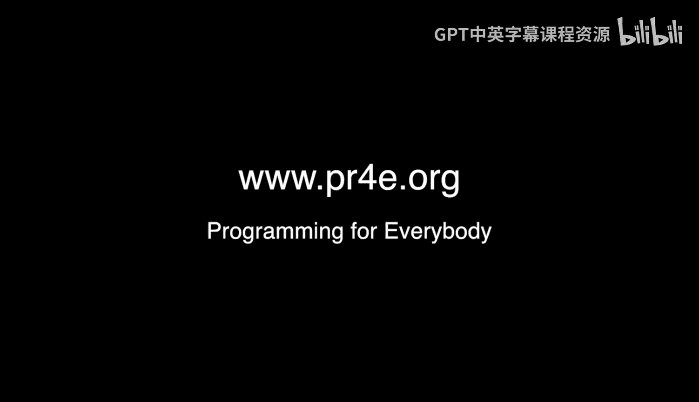

# 078：韩国首尔面对面办公时间

## 概述
在本节课中，我们将跟随课程讲师查克前往韩国首尔，体验一次特别的线下办公时间。我们将看到来自世界各地的学习者如何聚集一堂，分享他们学习Python和Django的经历，并感受开源社区与知识分享的温暖氛围。

---

## 前往办公时间
讲师查克正在前往韩国首尔办公时间的路上。和往常一样，他并不知道会有多少人来参加。可能是一个人，也可能是二十个人，这种不确定性正是其乐趣的一部分。这就像一场与成千上万人的“盲约”。

## 首尔线下聚会
我们现在来到了首尔又一次的办公时间现场。这是一个规模庞大的聚会，地点距离著名的“交叉双臂”雕像不远，这个雕像似乎与某个重要的Gangnam Style视频有关。

和以往一样，查克希望介绍在场的同学们，让他们打个招呼。由于人数众多，这会花上一点时间。

以下是到场同学的自我介绍：

*   **第一位同学**：我的名字是（此处为韩语名）。我正在学习Python。
*   **Shelby**：我主修创意写作，这与编程无关，但我对语言学感兴趣。因此，我从今年夏天开始学习Python课程，已经完成了三门。我有很多时间。查克回应道：看来我们让你上瘾了。你大概也同意编程就像写作，但又有不同。Shelby表示：我喜欢各种写作和语言。查克说：对我来说，这正是课程开始时使用的例子。
*   **Shiino**：我实际上是跟着Shelby来的。我正在认真考虑学习Python这门很棒的语言，你的课程看起来也非常棒。
*   **Victor Lee**：我是Victor Lee，我在韩国翻译了Python教材。查克此时展示了Victor翻译的韩语版教材，并请大家为Victor鼓掌。查克说：我非常不擅长自拍，但我非常感谢你将这本书翻译成韩语。我付了你一杯啤酒的报酬让你翻译Python2的版本，或许我可以再付你几杯啤酒来翻译Python3的版本。我们非常感谢你，这一切的核心就是每个人都在贡献，Victor为我们贡献了很多。
*   **Suin**：Python是一门非常有趣的语言。我每天使用Scrapy和Tkinter。很高兴认识你，非常感谢。
*   **John Gongsong**：很高兴在这里见到查克，感觉像见到了名人。我之前已经在笔记本电脑上见过你了，所以现在能亲眼见到真是太好了。
*   **Chong Min**：我在你的课程中学到了很多乐趣，谢谢。
*   **Honalo（来自巴西）**：我热爱Python，热爱学习。我和我的未婚妻Priscilla正在首尔度假。Priscilla也打了招呼。查克提到：这真是个愉快的巧合。就像九月份在拉斯维加斯的办公时间一样，来参加的人都不是本地人，全是在拉斯维加斯度假的。
*   **Amber**：我刚刚开始学习《Python for Everyone》课程，很高兴加入大家。
*   **Joine**：很高兴在韩国见到你。我想感谢你确保每个人都拿到了啤酒，并完成了所有翻译工作以确保我们收到了需要的订单。
*   **另一位同学**：我非常喜欢查克博士的课程，很高兴来到这里。
*   **Xang**：我是通过这门课程开始Python编程的。现在我在一个实验室工作，编写生物信息学算法相关的程序。如果没有这门课程，我无法想象自己能做这些。我之前学生命科学。查克说：哦，是的，然后你通过我的课程学习了Python编程，现在成为了一名初级程序员。恭喜你，非常感谢你。你并不孤单，我真的很想和你一起喝一杯，欢迎加入课程。
*   **Hang**：能在课堂上见到视频里的真人真是太棒了。查克博士是我的第一位编程老师，Python是我的第一门编程语言，我真的很感激。查克回应：欢迎成为一名程序员。
*   **Michelle（来自芝加哥）**：我开始在韩国从事金融工作。我以前学过像SAS这样的工具，但实际上金融领域也使用Python，它是一门非常棒的语言。昨天我收到邮件通知时非常惊喜。查克说：是的，事情总是这样随机，无法预测我下次会在哪里。
*   **Huen**：我已经注册了接下来的课程。来到这里让我动力十足，我等不及要在Coursera上看到自己的脸了。
*   **Cizz Lee**：大约两年前，我开始了这门Python编程课程。那时我对编程一无所知，是零基础。但现在我成为了一名开发者。我热爱向女孩们教授Python编程，我也是韩国Django Girls的组织者之一。这是我的同事Maco。我们刚刚举办了一场活动，帮助了大约50人，我们希望在编程世界激励更多女性。查克说：所以你从一个完全不懂编程的人，变成了通过Django Girls激励其他女性成为程序员的人。现在我想把我的贴纸要回来，我要把它贴在我的笔记本电脑上。这样在未来的录制视频中，你们就会看到我电脑上来自首尔Django Girls的贴纸了。
*   **Hassan**：我在韩国生活了很长时间。实际上，我说Python，这很简单。为了办公室工作，我使用其他语言，但在空闲时间我只用Python。每当有人想和我讨论学习编程语言时，我就建议他们安装Python并从你的课程开始。我非常高兴见到你，因为我在2014年完成了这门课程，等了两年来见你，非常感谢。

## 聚会结束
查克总结道：多么有趣的一段时光！我们在这里待了大约一小时，喝了些饮料，差点被请出去，但我们重新整理了房间所以没有被赶走。我不知道下一次办公时间会在哪里，可能在凤凰城或芝加哥。我已经在芝加哥举办过两次办公时间了。一旦确定了下次地点，我会立刻通知大家。干杯！

---

## 总结
本节课中，我们一起体验了在韩国首尔举行的Django课程线下办公时间。我们看到了来自不同背景、不同国家的学习者如何因为对Python和编程的热爱而相聚。从创意写作者到生命科学学生，从金融从业者到社区组织者，每个人都分享了技术如何改变了他们的学习或职业路径。这次聚会不仅是一次答疑，更体现了开源、分享与社区支持的精神。我们期待下一次在未知地点的相遇。