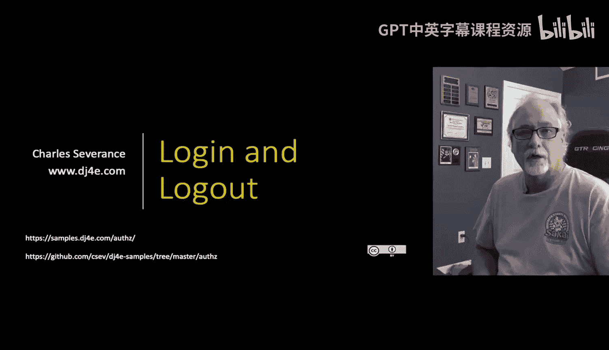
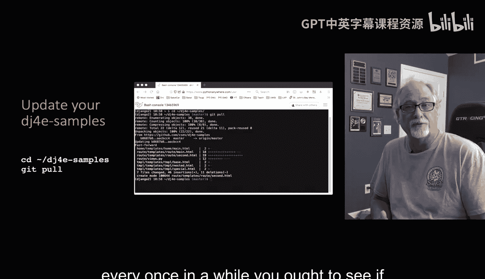
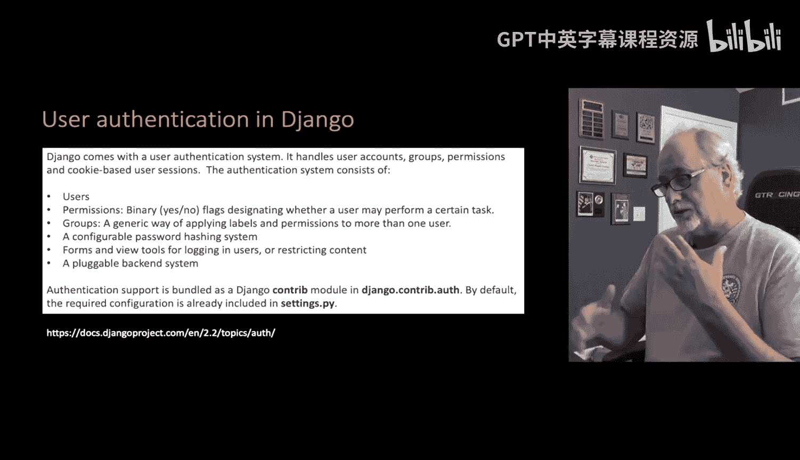
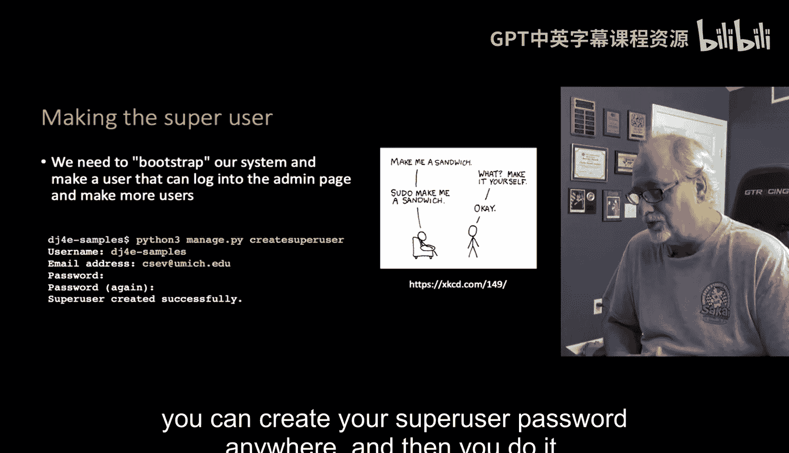
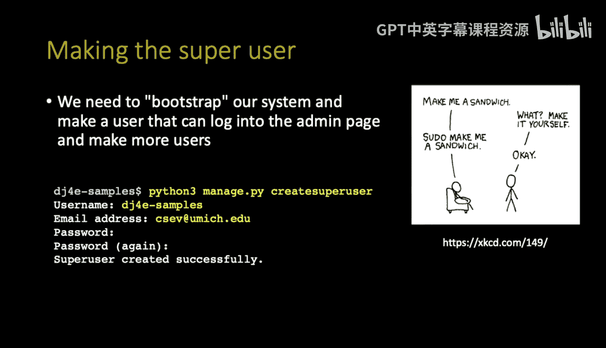
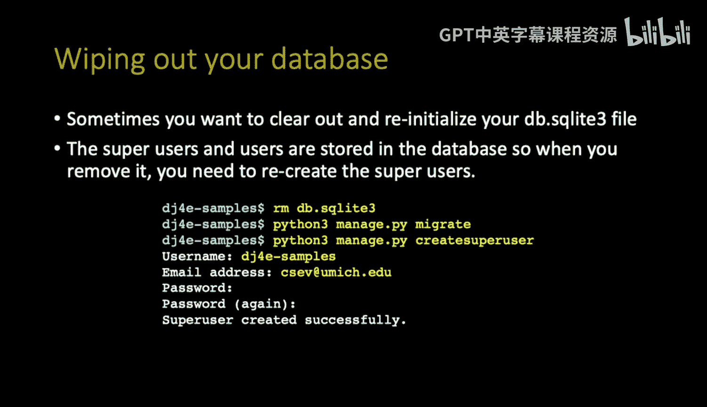
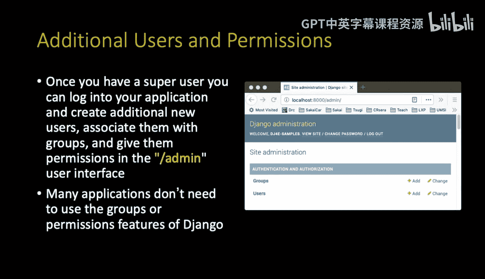
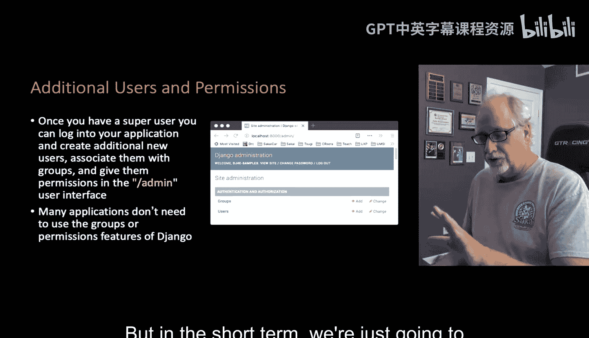

# 085：Django中的用户创建与管理 👤

在本节课中，我们将学习Django框架内置的用户认证系统，包括如何创建超级用户、管理用户以及理解登录与注销的基本流程。Django提供了强大的开箱即用功能，使我们无需从头构建这些基础模块。

---



## 创建与更新代码库



在开始之前，建议定期更新你的示例代码库。使用以下命令从GitHub拉取最新的代码和修复：

```bash
git pull
```

这能确保你拥有最新的示例和错误修复。

---

## Django内置的认证系统

上一节我们提到了保持代码库更新。本节中我们来看看Django的核心功能之一——内置的用户认证系统。

Django内置了一套完整的登录、注销和用户管理系统。它提供了多种实现方式，并拥有一个方便的管理员界面。Django的优势在于，开发者无需自行构建这些基础维护功能。系统包含了用户、权限、用户组和密码管理等，这些功能在“本地图书馆”应用中被使用，但在我们当前的应用中不会深入使用权限和组。Django还支持以多种技术存储这些信息。



---



## 创建超级用户

首先，你需要在系统中创建一个超级用户。以下是创建步骤：

1.  登录到你的Django系统。
2.  运行创建超级用户的命令。
3.  根据提示输入用户名、电子邮件地址和密码。

电子邮件地址用于密码恢复。创建命令如下：

```bash
python manage.py createsuperuser
```



“超级用户”在系统中拥有所有权限，无需任何特殊授权即可执行任何操作。这个概念类似于Linux系统中的 `sudo` 命令，它允许普通用户以超级用户权限执行命令。

---

## 数据库重置与重建

创建超级用户时，Django会在数据库的相应表中插入一行记录。了解如何重置开发环境非常重要。

如果你使用SQLite进行开发，可以随时通过删除数据库文件来清空所有数据。这将移除所有由迁移创建的表、所有用户数据以及超级用户。之后，你需要使用以下命令重新初始化数据库：

```bash
python manage.py migrate
```

此命令会重新创建所有空表。完成后，你必须再次创建你的超级用户。

---



## 使用管理员界面管理用户

一旦创建了超级用户，其余用户可以通过Django内置的管理员界面进行管理。

在管理员界面中，除了你自己定义的应用模型，你还会看到“用户”和“组”这两个模型。它们是Django内置的模型，你无需负责构建它们。虽然权限和用户组功能非常有用，但在当前阶段，我们主要关注用户的创建。未来我们将学习使用社交登录（例如通过GitHub登录），那样就无需手动创建大量用户。

目前，我们使用的是“本地用户”，即信息存储在数据库中的用户。这种方式易于创建和维护，但通常需要一定的手动管理。

---

## 应用中的登录与注销

现在我们已经了解了如何创建和管理用户，接下来的问题是：在我们的应用代码中，如何实现用户的登录和注销功能？

我们将在后续课程中深入探讨如何在视图和模板中集成Django的认证视图，以处理用户的登录和注销请求。



---



## 总结


本节课中我们一起学习了Django用户认证系统的基础。我们了解了如何创建超级用户、通过管理员界面管理用户、以及重置开发数据库的流程。我们还明确了“本地用户”的概念，并为学习下一部分——在应用中实现登录和注销功能——做好了准备。