# 086： Django的登录与登出URL 🔐

在本节课中，我们将学习如何在Django应用中处理用户的登录与登出功能。我们将了解会话、登录和登出之间的关系，以及如何配置和使用Django内置的认证URL。

---

## 概述

登录与登出是Web应用的核心功能。在Django中，这些功能建立在会话（Session）机制之上。本节将解释它们之间的关系，并展示如何配置项目以启用Django内置的登录/登出视图，以及如何在模板中生成正确的登录/登出链接。

---

## 会话、Cookie与登录的关系

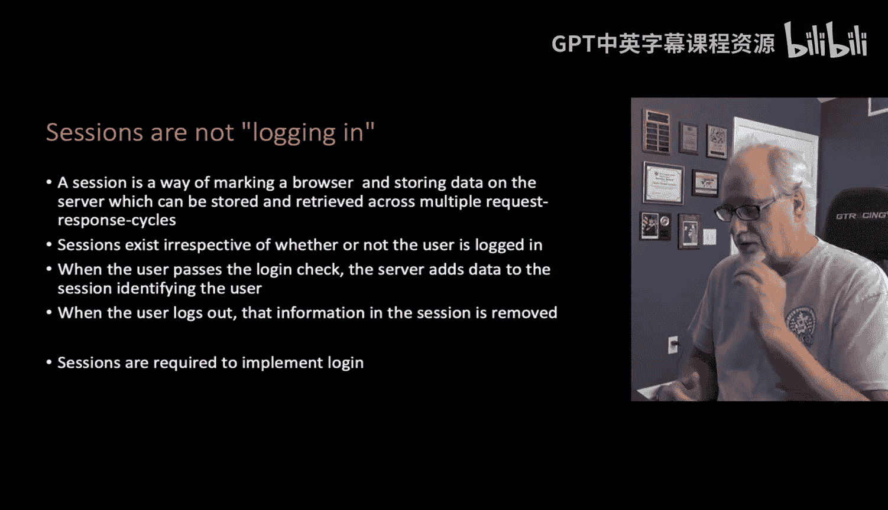

上一节我们介绍了会话（Session）。需要明确的是，**创建会话并不等同于用户登录**。

登录行为实际上会**改变会话中的数据**。最基本的登录方式依赖于会话的存在：登录是将当前用户的信息（如用户名、邮箱）存入会话的过程；而登出则是将这些信息从会话中移除。

你可以在同一个浏览器会话中，让多个用户依次登录和登出。最终，你得到的是**同一个会话对象**，只是它关联的用户数据不同。

请记住：
*   Cookie和会话不是一回事。
*   会话和登录也不是一回事。
*   但它们彼此构建：**会话建立在Cookie之上，而登录又建立在会话之上**。

---

## 配置Django项目以支持登录/登出

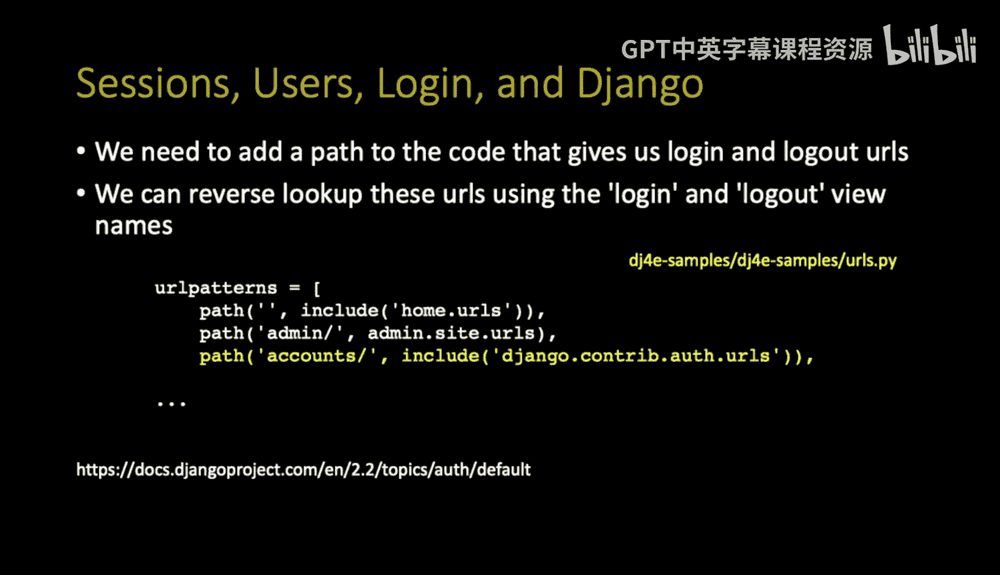

为了让登录和登出功能正常工作，你需要在项目的 `settings.py` 文件中，将Django的认证支持添加到 `INSTALLED_APPS` 列表中。

```python
# settings.py
INSTALLED_APPS = [
    'django.contrib.admin',
    'django.contrib.auth',       # 核心认证框架
    'django.contrib.contenttypes',
    'django.contrib.sessions',   # 会话框架
    'django.contrib.messages',
    'django.contrib.staticfiles',
    # ... 你的其他应用
]
```

如果你使用 `django-admin startproject` 命令创建项目，这些应用通常已被自动添加。了解这一点，有助于你知道这些“魔法”功能来自何处。

接下来，你需要在项目根目录的 `urls.py` 文件中添加认证相关的URL路径。

```python
# 项目根目录下的 urls.py (例如: dj4e_samples/urls.py)
from django.contrib import admin
from django.urls import include, path

urlpatterns = [
    path('admin/', admin.site.urls),
    path('accounts/', include('django.contrib.auth.urls')),  # 添加这行
    # ... 你的其他URL配置
]
```

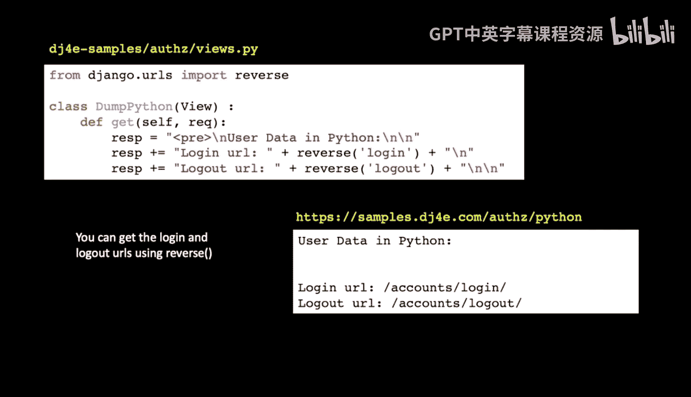

这行代码将Django内置的一系列认证视图（如登录、登出、密码重置等）的URL注册到 `/accounts/` 路径下。完成这一步，Django的登录/登出功能就被激活了。

---

## 在代码中获取登录/登出URL

我们通过 `reverse()` 函数来获取登录和登出视图对应的具体URL。我们一直在使用 `reverse` 来根据视图名称查找URL。

在 `django.contrib.auth.urls` 中，Django已经为登录和登出视图定义了名称（`name='login'` 和 `name='logout'`）。因此，我们可以像查找自己编写的视图一样，通过名称来获取它们的URL。

```python
# 在视图或模板中获取URL
from django.urls import reverse

login_url = reverse('login')    # 例如: /accounts/login/
logout_url = reverse('logout')  # 例如: /accounts/logout/
```

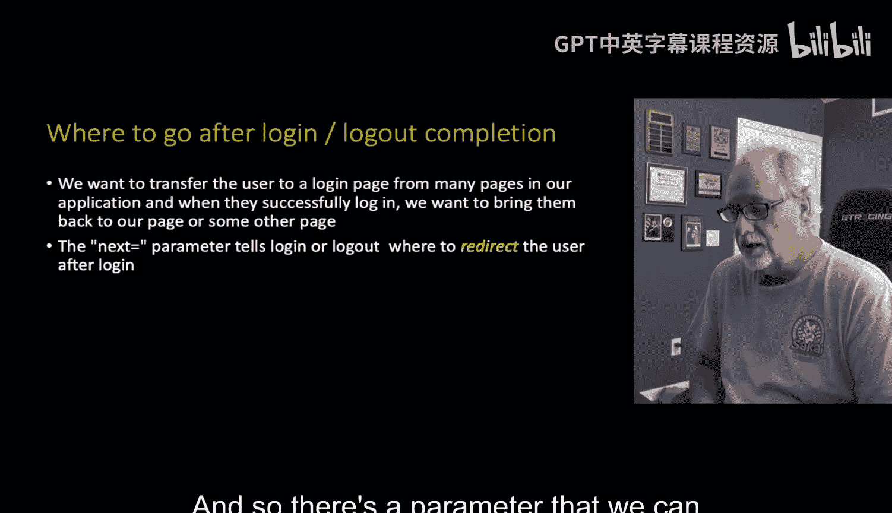

使用 `reverse()` 而不是硬编码URL的好处是灵活。如果你的URL配置发生了变化（例如，路径不是 `/accounts/`），代码无需修改。

---

## 登录后的重定向：`next` 参数

关于登录的一个常见需求是：用户访问一个需要登录才能查看的页面时，如果未登录，应被引导至登录页，并在登录成功后**自动跳转回他原本想访问的页面**。

例如，你收藏了一个需要登录的页面，登出后点击收藏夹，系统会要求你先登录，然后自动带你回到那个页面。这通过使用 `next` 查询参数来实现。

以下是 `next` 参数的应用方式：

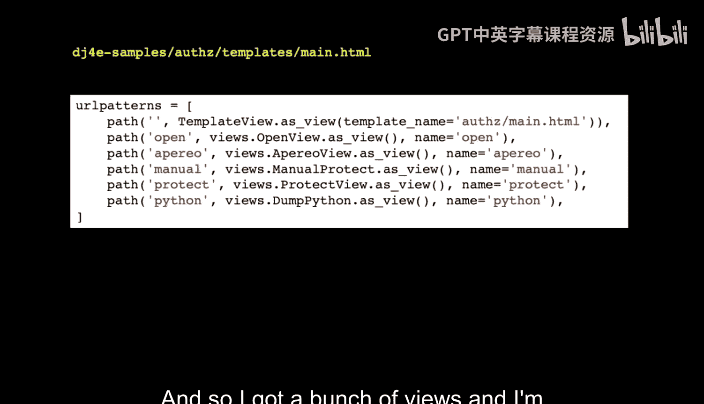

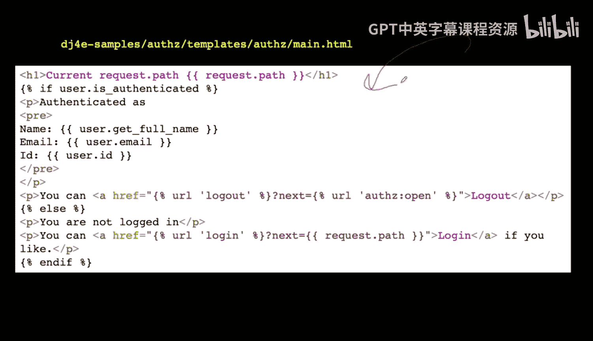

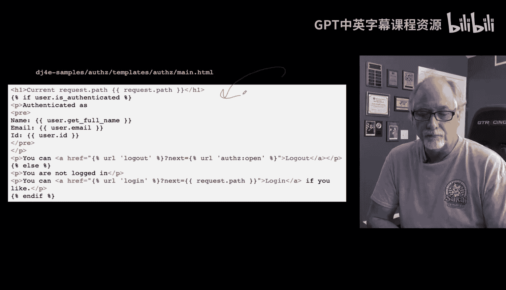

```html
<!-- 在模板中生成带有next参数的链接 -->
<!-- 方法一：指定一个固定的返回页面 -->
<a href="?next=/az/open/">登录并返回AZ Open页面</a>
<a href="?next=/az/open/">登出并返回AZ Open页面</a>

<!-- 方法二：动态返回当前页面 (更常用) -->
<a href="?next={{ request.path }}">登录并返回本页</a>
<a href="?next={{ request.path }}">登出并返回本页</a>
```

在方法二中，`request.path` 是Django自动注入到模板上下文中的变量，它表示当前页面的路径。这是一种非常实用的模式，意味着“登录/登出完成后，请回到我现在所在的这个页面”。

---

## 在模板中使用用户对象

Django会自动将一个 `user` 对象注入到每个模板的上下文中。你可以利用这个对象来判断用户状态并显示相应信息。

以下是模板中可用的常见用户属性：

```html

    <p>欢迎，{{ user.get_full_name }} ({{ user.email }})！</p>
    <p>您的用户ID是: {{ user.id }}</p>
    <!-- user.id 是用户表的主键，在创建外键关联时非常有用 -->
    <a href="?next={{ request.path }}">登出</a>

    <p>您尚未登录。</p>
    <a href="?next={{ request.path }}">登录</a>

```

*   `user.is_authenticated`: 布尔值，判断用户是否已认证（登录）。
*   `user.get_full_name()`: 获取用户全名。
*   `user.email`: 获取用户邮箱。
*   `user.id`: 获取用户的主键（ID），这在需要将其他数据表通过外键关联到用户时至关重要。

---

## 示例与实践

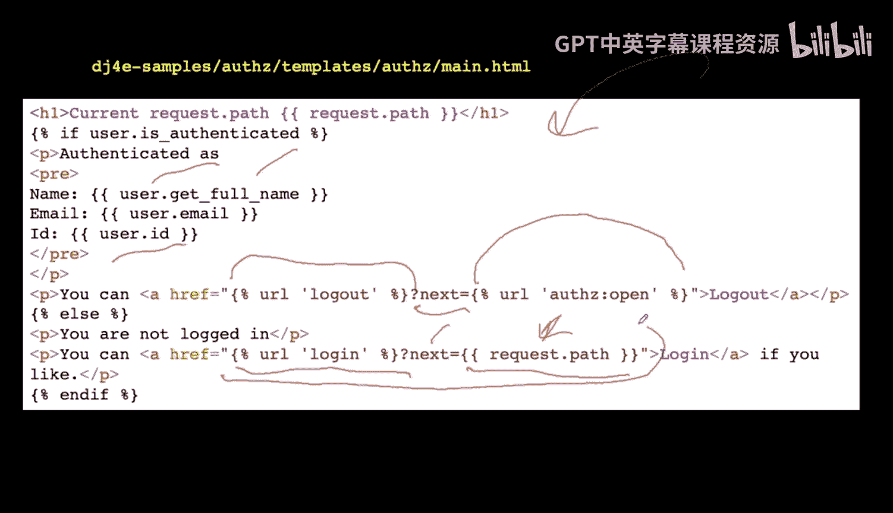

在我的示例代码的 `az` 应用中，我创建了一些视图来演示这些概念。以下是相关链接在模板 (`main.html`) 中的呈现方式：

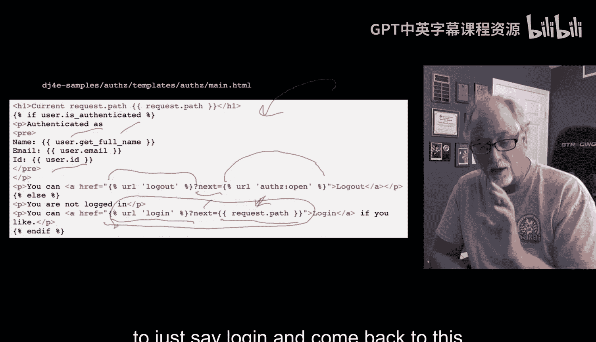

*   **公开页面**：无需登录即可访问。
*   **受保护页面**：使用 `@login_required` 装饰器保护，未登录用户访问时会自动重定向到登录页，并附带 `next` 参数。

例如，一个受保护页面的登录链接最终可能生成如下HTML：
```html
<a href="/accounts/login/?next=/az/open/">登录</a>
```
当用户点击此链接并成功登录后，Django会将其重定向回 `/az/open/` 页面。

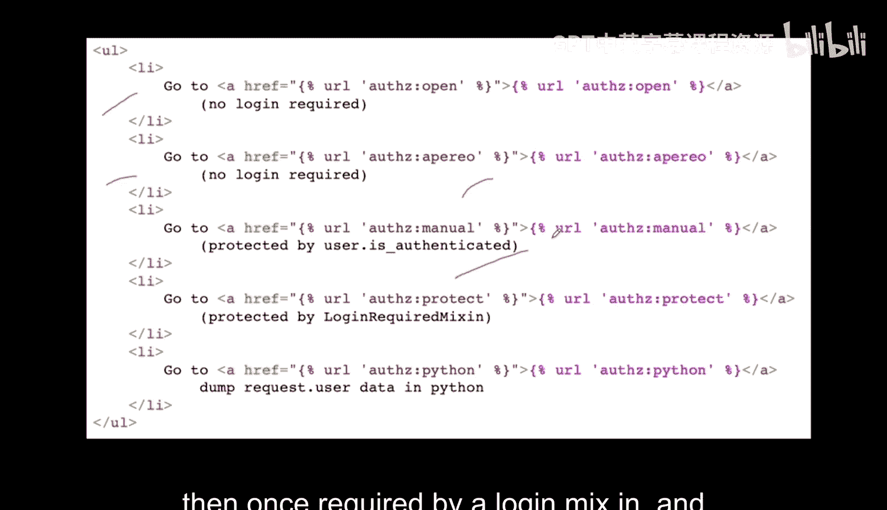

登出链接同理：
```html
<a href="/accounts/logout/?next=/az/open/">登出</a>
```

---

## 总结

本节课我们一起学习了Django中处理登录与登出的核心机制：

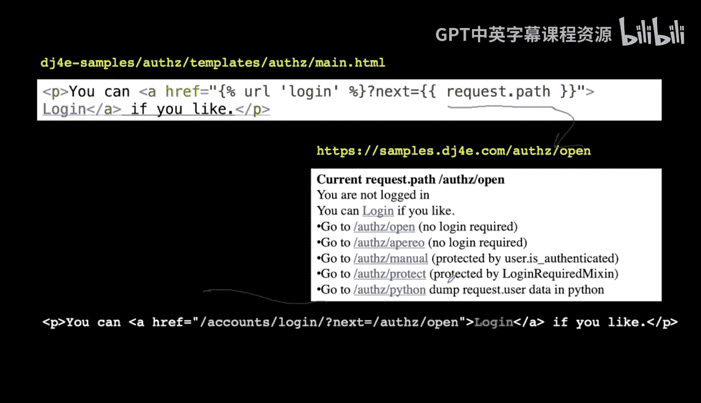

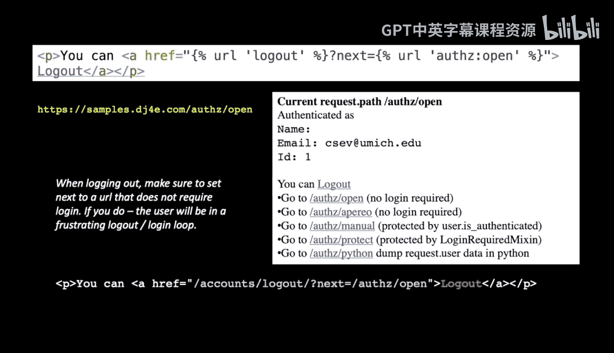

1.  **理清了关系**：登录/登出是操作会话数据的行为，它们建立在Django的会话机制之上。
2.  **完成了配置**：通过在 `INSTALLED_APPS` 中添加 `django.contrib.auth` 和在项目URL中包含 `django.contrib.auth.urls` 来启用认证系统。
3.  **学会了生成URL**：使用 `reverse('login')` 和 `reverse('logout')` 动态获取认证URL。
4.  **掌握了重定向技巧**：利用 `next` 参数实现登录/登出后返回指定页面或当前页面，提升用户体验。
5.  **运用了模板对象**：在模板中使用自动注入的 `user` 对象来显示用户信息和控制界面元素。

下一节，我们将探讨如何不仅引导用户到登录页面，更进一步地**如何配置和自定义登录页面本身**。