# 087：在视图中使用Django登录功能

在本节课中，我们将学习如何在Django视图中集成和使用内置的登录功能。我们将了解如何创建自定义登录页面模板，如何在视图中访问用户信息，以及如何保护特定视图，使其仅对已登录用户开放。

## 理解登录页面与模板

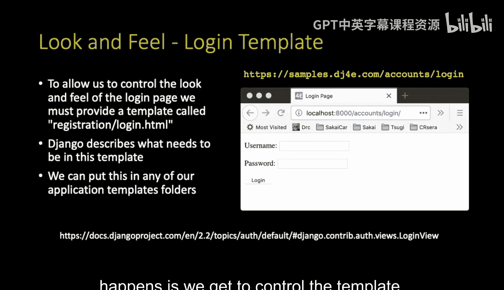

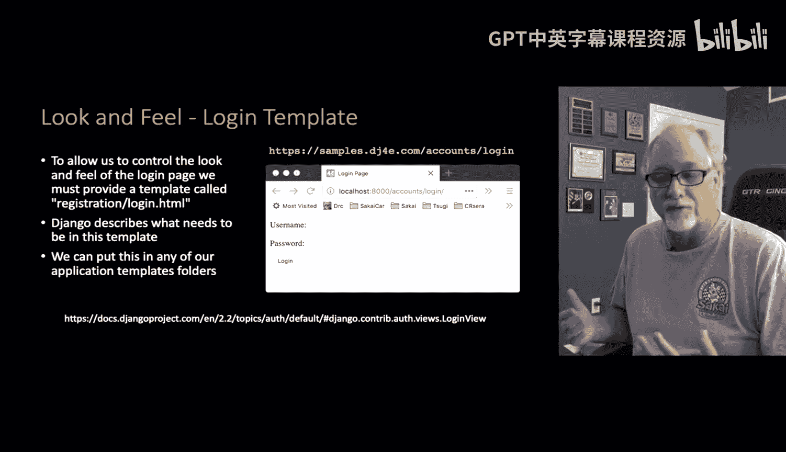

上一节我们介绍了用户对象以及在模板和URL中的基本用法。本节中，我们来看看登录页面本身。

Django提供了登录功能，但需要我们自己提供一个模板来控制其外观。这样，登录页面就能与应用的整体风格保持一致，而不是看起来像Django的默认页面。

我们需要创建一个名为 `registration/login.html` 的模板。请注意，在Django项目中，模板名称是全局的。无论这个模板位于哪个应用（例如`home`应用）中，只要路径是 `registration/login.html`，Django的登录视图就能找到并使用它。

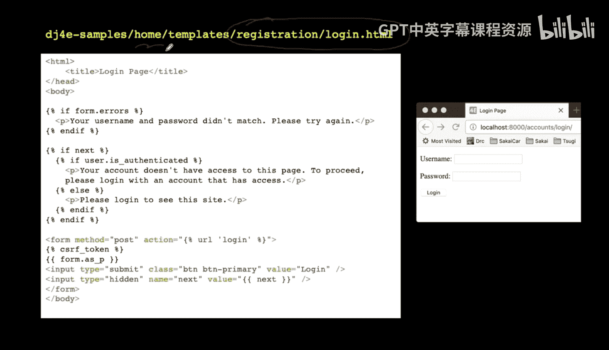

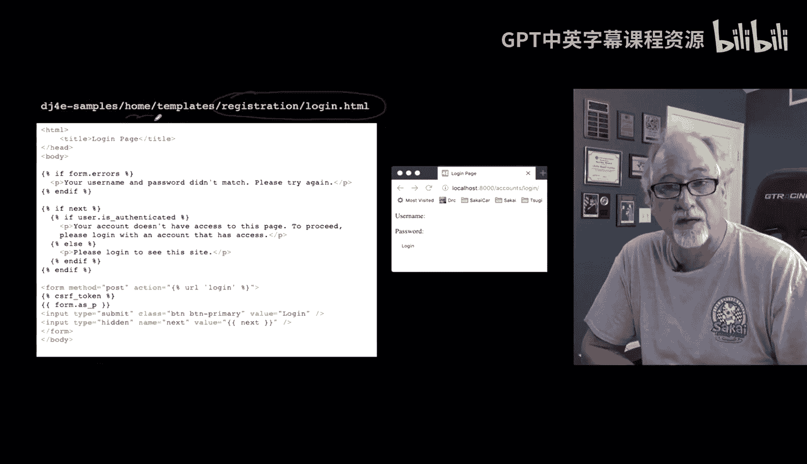

在这个模板中，我们需要遵循一些规则来处理Django视图传递过来的上下文数据。

以下是模板中需要处理的关键部分：
*   **错误信息**：如果表单提交有误（如密码错误），Django会传递错误信息，模板需要显示它们。
*   **`next` 参数**：这是一个重要的参数。当用户尝试访问一个受保护的页面但未登录时，会被重定向到登录页。此时，原页面的URL会作为 `next` 参数传递过来。登录成功后，用户将被带回这个原始页面。
*   **登录表单**：Django的视图会提供一个 `form` 上下文变量，它包含了用户名和密码输入框等所有必要的HTML元素。我们只需在模板中输出 `{{ form }}` 即可生成表单。

在表单中，我们必须将 `next` 参数的值作为一个隐藏字段传回。这样，在用户提交登录表单后，Django才知道登录成功后应该跳转到哪里。

```html
<!-- 示例：在表单中包含next参数 -->
<form method="post">
  
  {{ form }}
  <input type="hidden" name="next" value="{{ next }}">
  <button type="submit">登录</button>
</form>
```

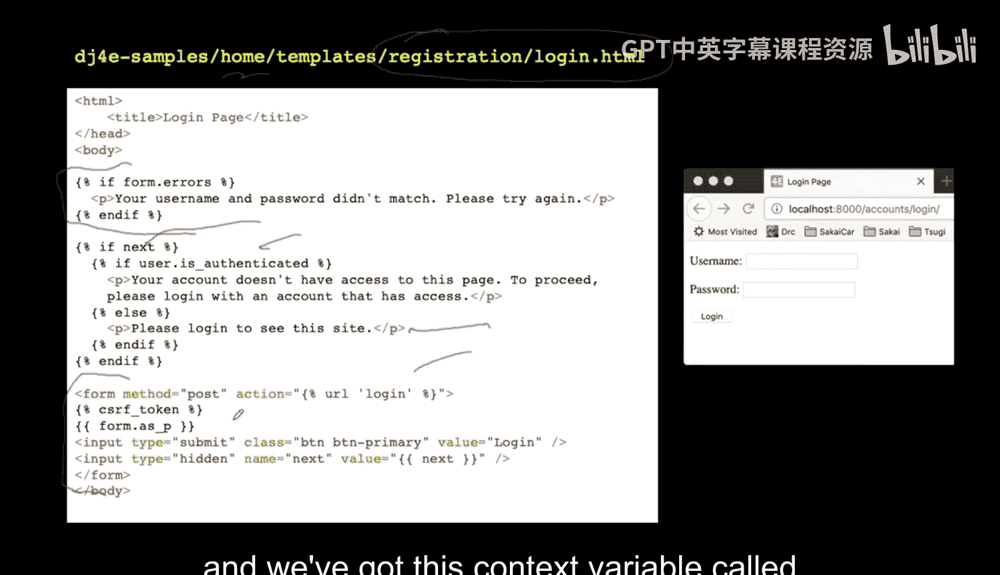

## 在视图和模板中访问用户数据

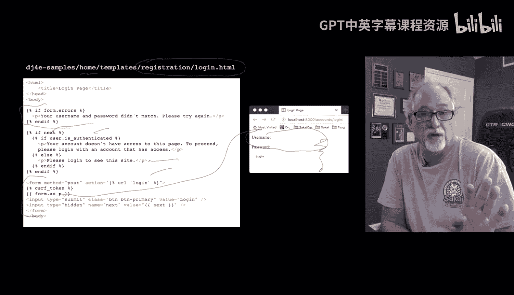

我们可以在模板和Python视图代码中访问当前登录用户的信息。

在模板中，我们可以使用 `user` 对象。但需要注意，其属性仅在用户已认证（`user.is_authenticated` 为真）时才有意义。

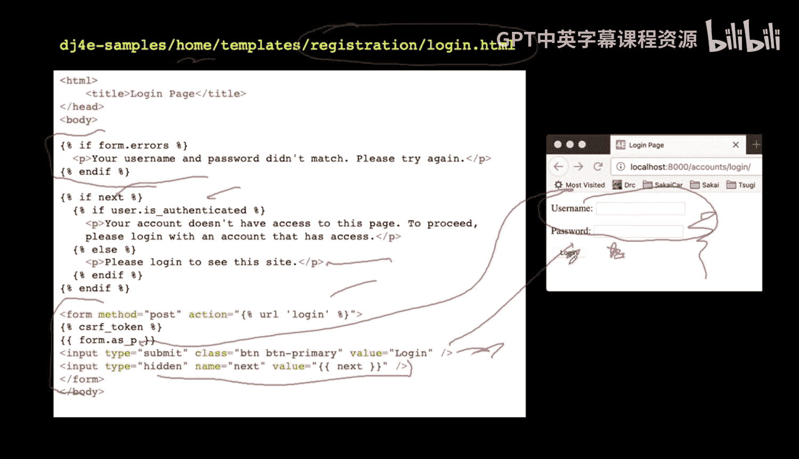

以下是用户对象的一些常用属性：
*   `user.username`：用户名
*   `user.email`：用户邮箱
*   `user.id`：用户的主键（PK）

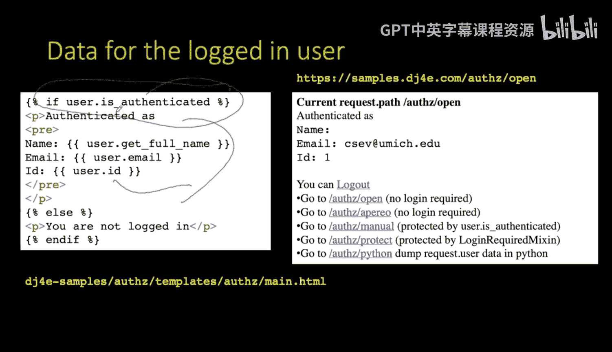

在Python视图代码中，用户信息存储在 `request` 对象中。

```python
# 在视图函数中访问用户信息
def my_view(request):
    if request.user.is_authenticated:
        # 用户已登录，可以访问其信息
        username = request.user.username
        user_id = request.user.id
        # ... 其他逻辑
    else:
        # 用户未登录
        # ... 处理未登录情况
    return HttpResponse(...)
```

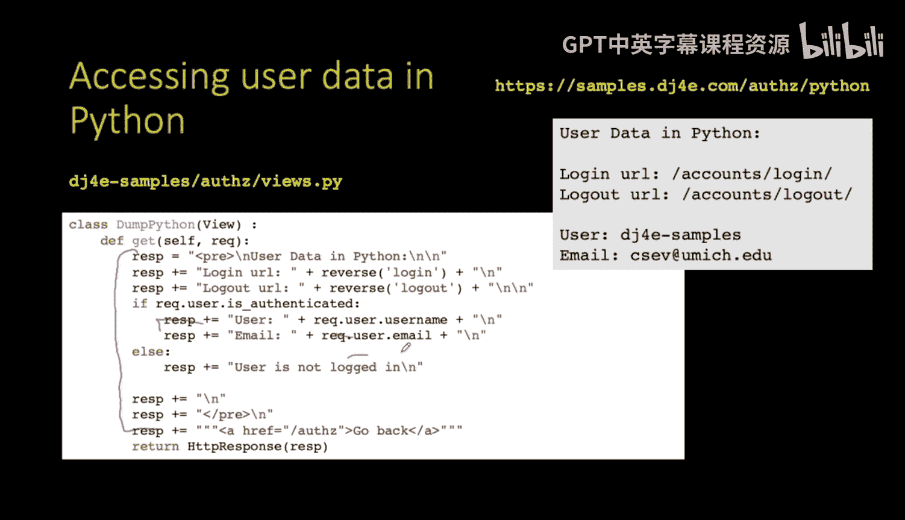

## 保护视图：仅允许登录用户访问

接下来，我们探讨如何保护视图，使其只对已登录用户开放。一个典型的场景是：用户收藏了“收件箱”页面，登出后直接点击收藏夹链接。此时，应用应检测到用户未登录，将其重定向到登录页面，并在登录成功后自动跳转回“收件箱”。

有两种方法可以实现视图保护。

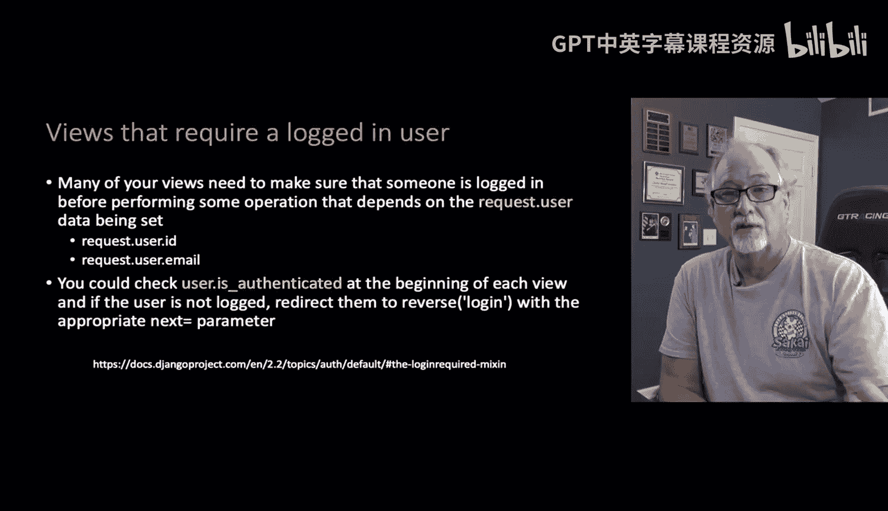

第一种是手动检查。我们在视图逻辑中判断 `request.user.is_authenticated`。

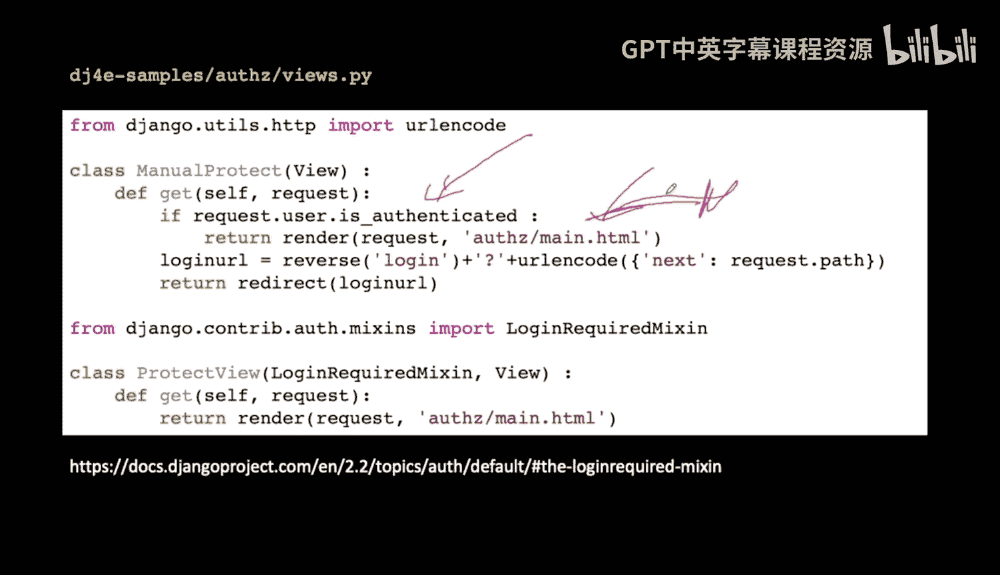

```python
from django.shortcuts import render, redirect
from django.urls import reverse

def manual_protect_view(request):
    """手动保护视图的方法（不推荐）"""
    if not request.user.is_authenticated:
        # 用户未登录，构造登录URL并重定向
        login_url = reverse('login') + '?next=' + request.path
        return redirect(login_url)
    # 用户已登录，正常显示页面
    return render(request, 'my_template.html', context)
```

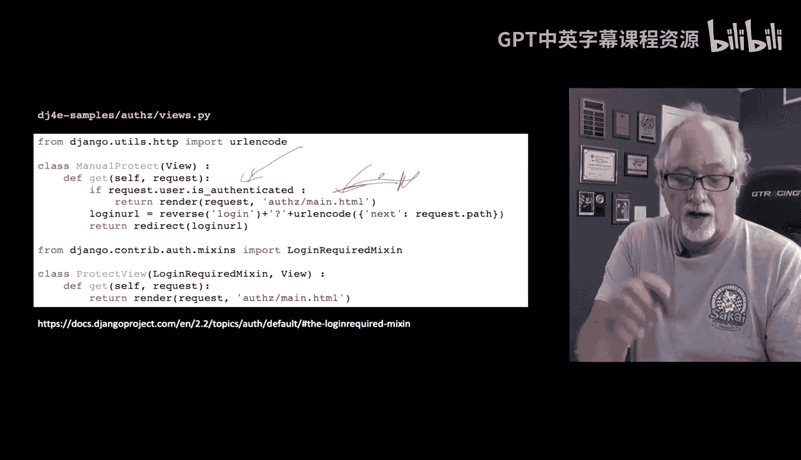

这种方法可行，但代码略显冗余，且需要手动处理重定向逻辑。

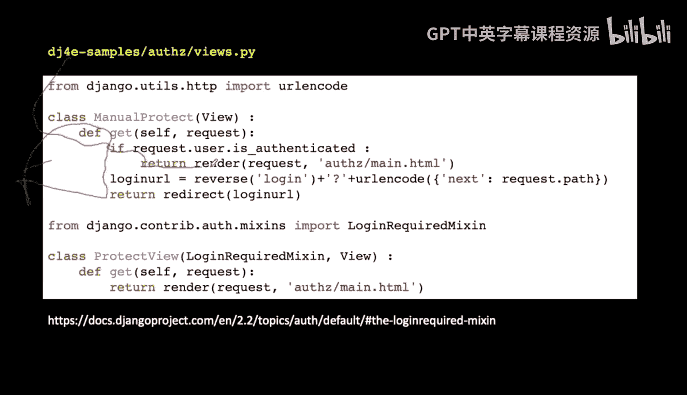

第二种，也是**推荐**的方法，是使用Django提供的 **`LoginRequiredMixin`**。这是一个“混入类”（Mixin），可以轻松地为基于类的视图添加登录要求。

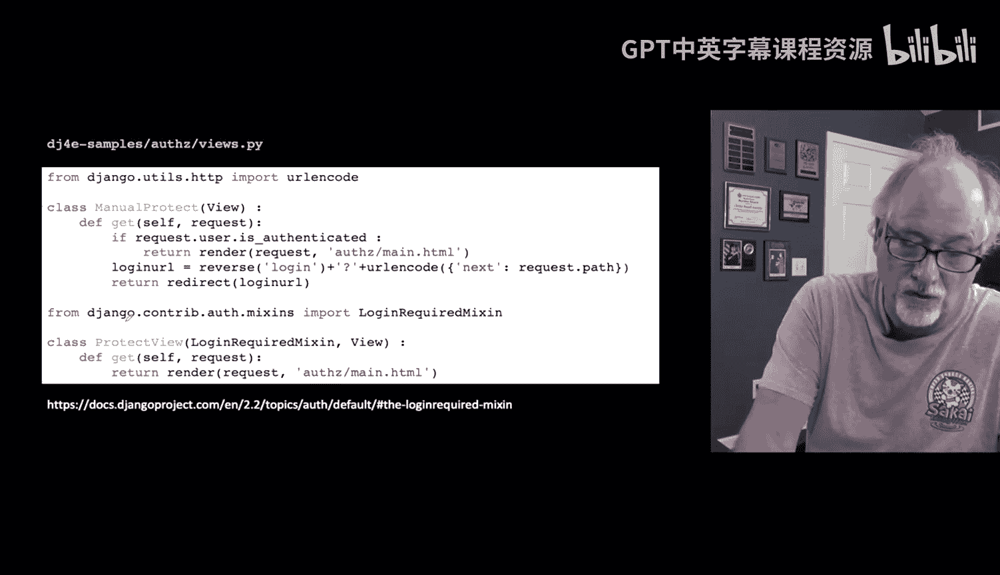

```python
from django.contrib.auth.mixins import LoginRequiredMixin
from django.views.generic import View

class ProtectedView(LoginRequiredMixin, View):
    """使用LoginRequiredMixin保护视图（推荐）"""
    login_url = '/login/'  # 指定登录页面URL
    redirect_field_name = 'next'  # 指定重定向参数名，默认为'next'

    def get(self, request):
        # 只有已登录用户才能执行到这里的代码
        return render(request, 'my_template.html', context)
```

使用 `LoginRequiredMixin` 后，Django会自动处理所有检测和重定向逻辑。如果未登录用户尝试访问该视图，他们会被自动重定向到登录页面（并附带 `next` 参数），登录成功后再返回原视图。这极大地简化了代码，是Django中的最佳实践。

## 课程总结

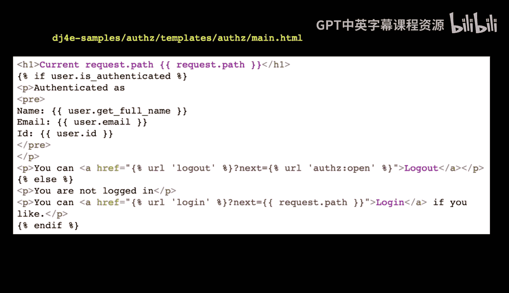

本节课中我们一起学习了Django登录功能在视图中的核心应用。

我们了解到，Django的登录功能配置简单：添加必要的应用和URL模式，并创建自定义的 `registration/login.html` 模板即可。我们学习了模板中如何处理 `next` 参数和表单，以实现登录后的智能跳转。

我们掌握了在模板（通过 `user` 对象）和视图（通过 `request.user`）中访问用户认证信息的方法。

最重要的是，我们学会了如何保护视图。虽然可以手动检查 `request.user.is_authenticated`，但最优雅和高效的方式是使用 **`LoginRequiredMixin`**。这个混入类能自动确保只有已登录用户才能访问特定视图，否则将其重定向至登录页，整个过程对开发者完全透明。

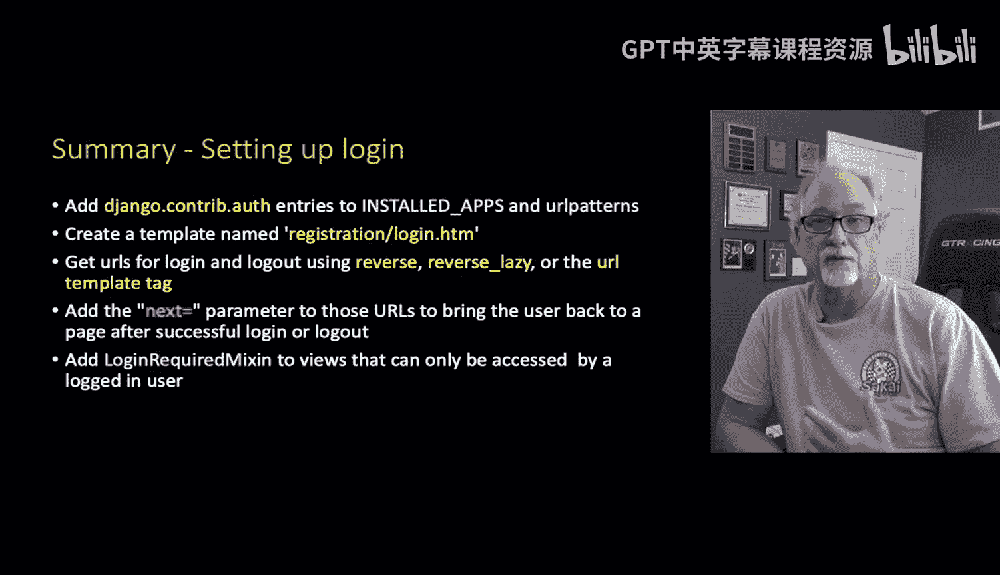

理解这些底层机制非常重要，尽管Django用很少的代码就实现了复杂功能，但知其所以然能帮助我们更好地使用和调试它。