# 090：Django表单数据验证 📝

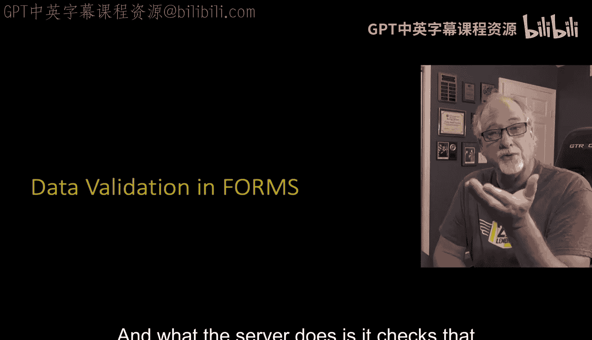

在本节课中，我们将要学习Django表单的数据验证机制。数据验证是用户点击提交按钮后，服务器对接收到的数据进行规则检查的过程。我们将详细探讨验证流程、错误处理以及Django处理表单数据的标准模式。

## 数据验证概述

上一节我们介绍了如何通过Django表单生成HTML并收集用户输入。本节中我们来看看当用户提交数据后，服务器如何进行验证。

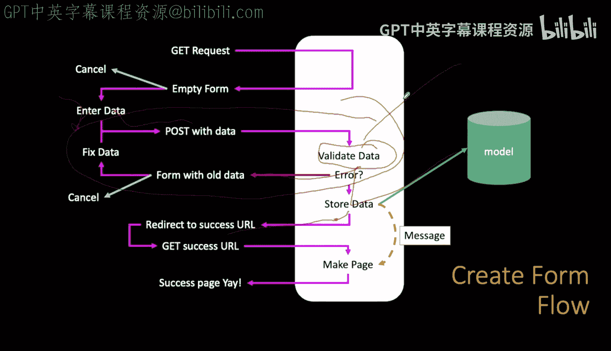

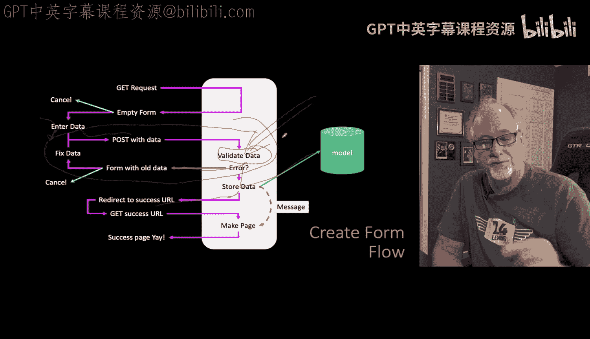

数据验证发生在用户点击提交按钮，数据被发送到服务器之后。服务器检查接收到的POST数据，判断其是否符合预定义的规则。

## 验证流程与错误处理

以下是数据验证的基本流程：

1.  用户填写表单并提交。
2.  服务器接收POST数据。
3.  服务器根据表单规则验证数据。
4.  如果数据有效，则存储数据并重定向到成功页面。
5.  如果数据无效，则返回带有错误信息的表单，让用户修正。

在创建表单时，我们讨论的部分正是服务器接收、验证数据并采取相应行动的环节。

### 数据错误示例

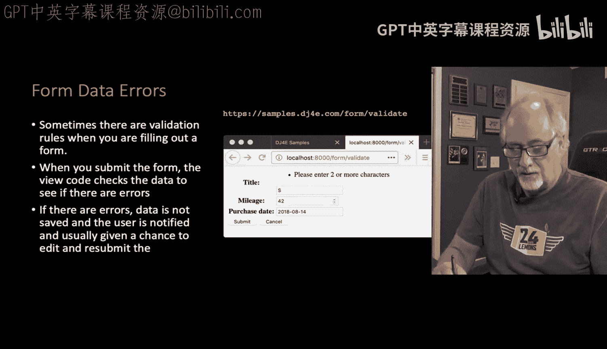

数据错误的典型场景是：用户填写表单时忘记填写必填项（如邮政编码），点击提交后，一个红色提示框弹出，显示“邮政编码为必填项”。

虽然可以在浏览器端通过设置`required`属性来提示必填项，但并非所有浏览器都支持此功能。因此，如果确实需要某项数据，必须在服务器端进行检查以确保其存在。

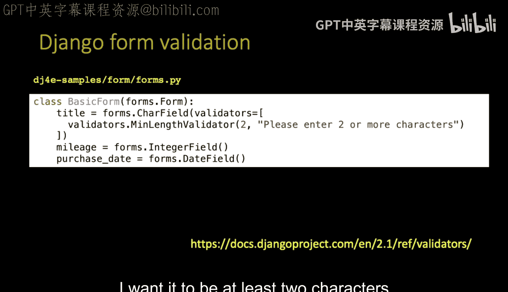

为了演示错误，我们在表单中设置了一个验证器：要求标题至少包含两个字符。如果用户只输入一个字符并提交，服务器验证会失败。

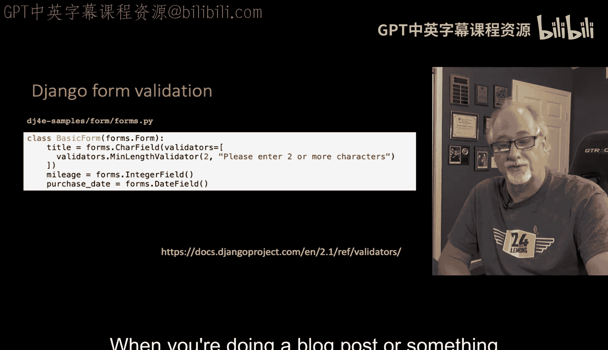

此时，我们希望页面能显示错误信息，并给予修正的机会，同时回显用户之前输入的数据，以便重新提交。

### 验证器定义

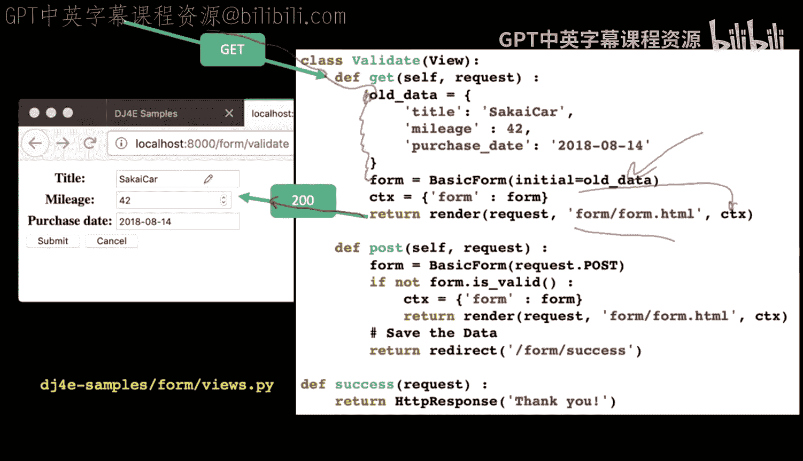

在Django表单中定义验证器非常简单。以下是一个要求字段至少包含两个字符的验证器示例：

```python
from django import forms
from django.core.validators import MinLengthValidator

class MyForm(forms.Form):
    title = forms.CharField(validators=[MinLengthValidator(2)])
```

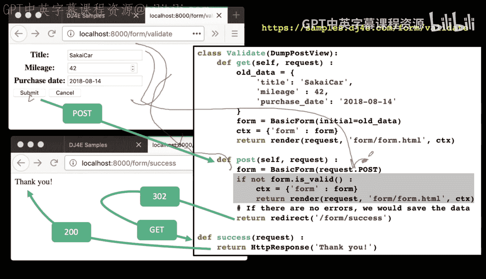

这并非一个复杂的验证器。在实际应用中，例如博客系统，你可能会要求标题至少包含5个字符。

## 代码流程解析

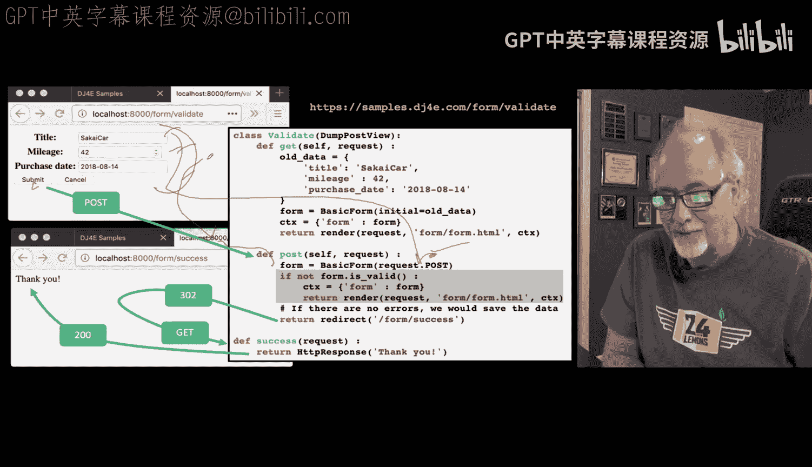

接下来，我们通过代码逐步分析GET和POST请求的处理流程。

### GET请求流程

当用户通过GET请求访问表单页面（例如编辑一个已有条目）时，视图函数会执行以下操作：

1.  接收GET请求，其中可能包含需要编辑的旧数据。
2.  使用初始数据创建表单实例。
3.  构建上下文（context）并将其传递给模板进行渲染。
4.  返回状态码200及该页面的HTML。

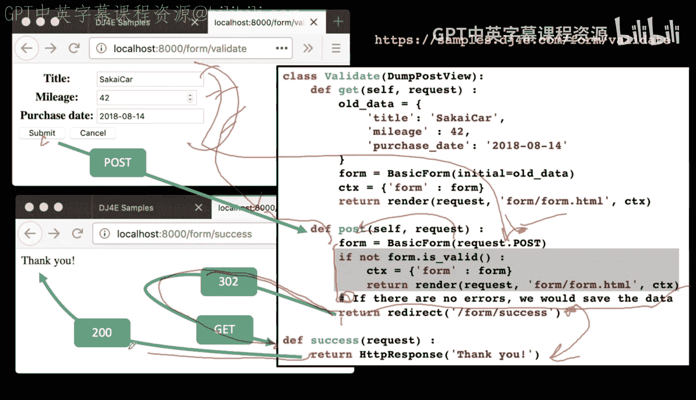


这个过程是编辑流程的第一步：获取旧数据，展示给用户，并提供修改的机会。

### POST请求成功流程

假设用户修改了数据且没有错误，流程如下：

1.  用户点击提交，数据通过POST请求发送到服务器。
2.  视图的`post`方法接收请求，从`request.POST`中读取所有表单数据。
3.  使用POST数据构造一个新的表单实例。表单知道每个字段的名称，因此能正确匹配键值对。
4.  调用表单的`is_valid()`方法进行验证。如果数据有效（`form.is_valid()`为`True`），则通常会在此处将数据存储到模型。
5.  最后，使用状态码302重定向到成功页面（例如`/form/success`）。
6.  浏览器接收到重定向指令后，立即发起一个GET请求到成功页面。
7.  成功页面视图返回感谢信息。

在实际应用中，你可能会在存储数据后，通过会话（session）传递一条成功消息到重定向后的页面，本示例为保持简洁省略了此步骤。

这就是成功的处理流程。

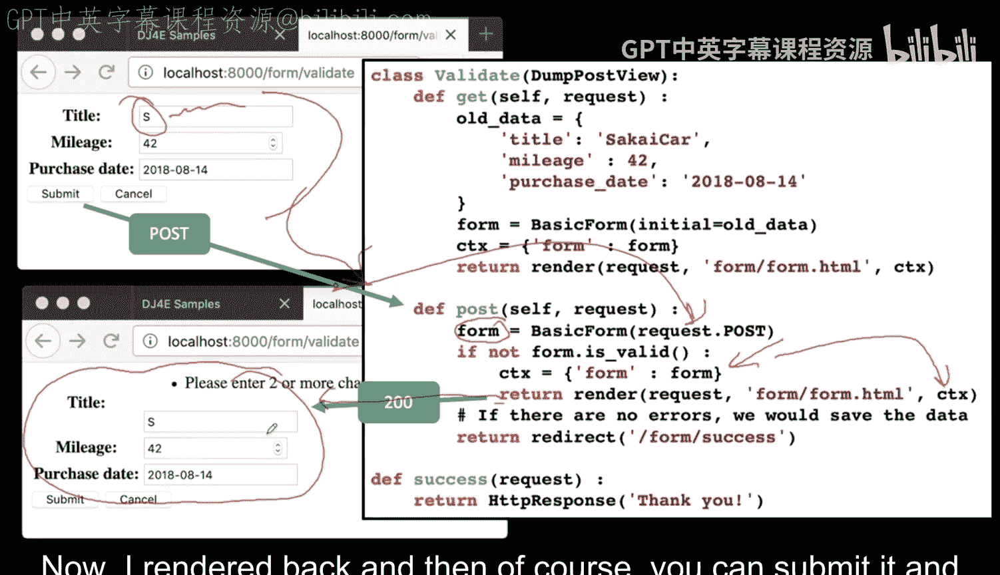

### POST请求失败流程

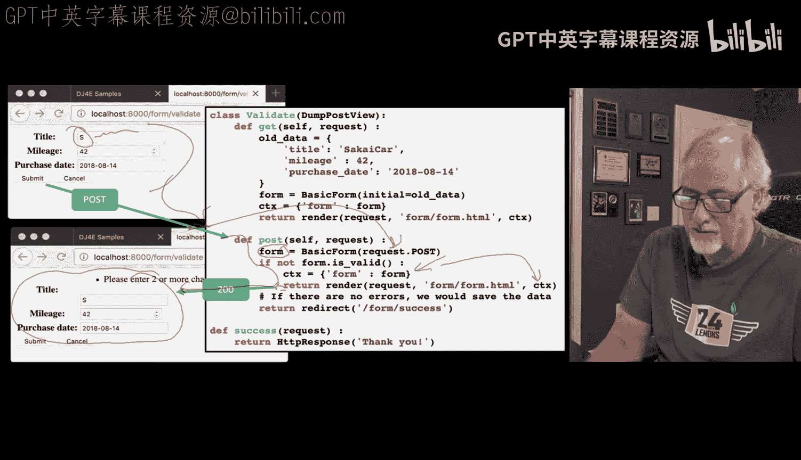

现在，让我们看看当数据验证失败时会发生什么。例如，用户输入的标题太短。

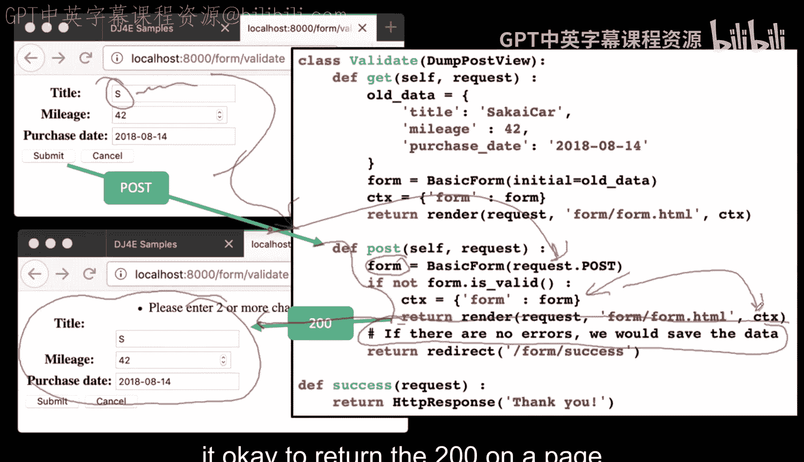

1.  用户提交包含无效数据的表单。
2.  `post`方法接收请求并构造表单对象。
3.  此时，`form.is_valid()`返回`False`，因为数据违反了验证规则。
4.  关键点在于，这个表单对象不仅包含了用户提交的旧数据，还自动生成了所有相关的错误信息。
5.  视图函数会重新构建上下文，将包含错误信息的表单对象传递给模板。
6.  模板渲染表单时，会显示出这些错误信息。
7.  页面以状态码200返回，用户可以看到错误并修正数据，然后再次提交。

这里有一个值得注意的模式：Django的标准做法是在POST请求验证失败后，直接返回状态码200和包含错误的页面。这与我们之前“POST成功后应重定向”的原则似乎相悖。

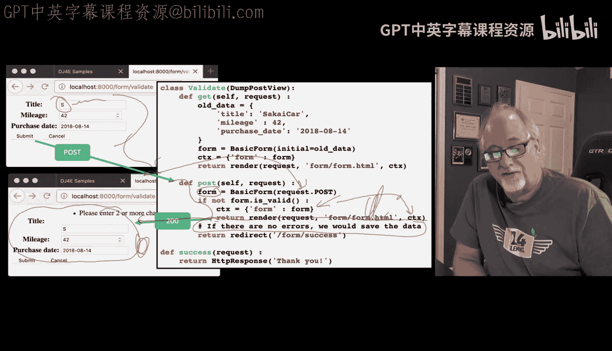

Django社区普遍认为，如果POST请求**没有改变任何服务器数据**（仅仅是验证失败并返回错误页面），那么返回200是可以接受的。问题在于，如果用户此时刷新页面，浏览器可能会弹出“确认重新提交表单”的警告。这是Django框架的工作方式。业界一致同意的是：**如果在POST请求中保存了数据，则绝对不能返回200，而必须使用重定向（如302），否则可能导致数据被重复提交**（如重复下单、重复转账等）。在本例的验证失败场景中，我们只是检查了数据并返回了错误信息，没有存储任何数据。

## 课程总结

本节课中我们一起学习了Django表单数据验证的核心机制。

我们回顾了整个课程系列的内容：从HTML和HTTP协议基础，到GET与POST方法的区别；从如何防止刷新导致重复提交，到跨站请求伪造（CSRF）的保护及Django的应对策略；最后，我们深入探讨了如何利用Django表单来简化HTML生成，并实现强大的服务器端数据验证。

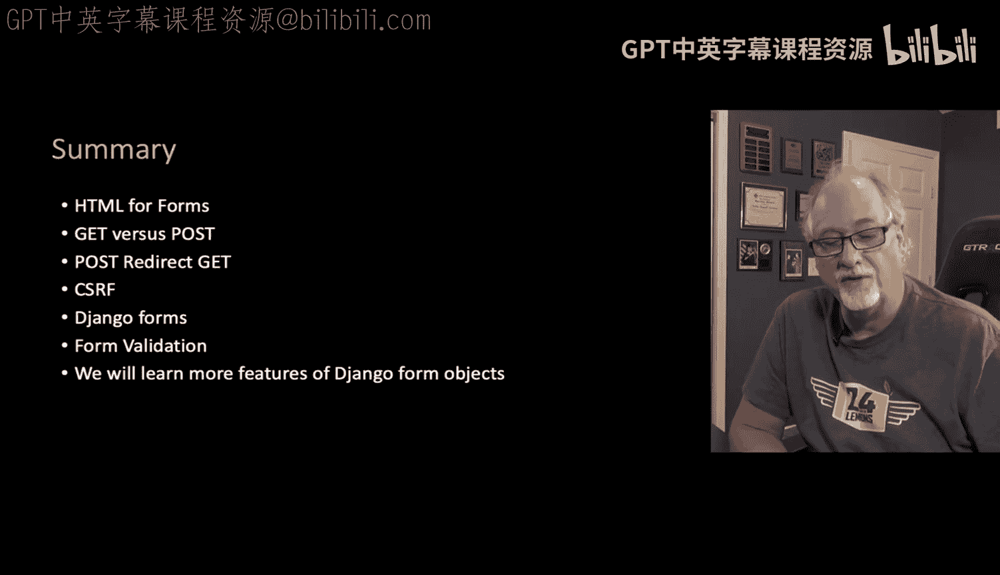

表单对象的功能远不止于此。随着我们构建更复杂的应用程序，将继续学习更多关于表单的高级特性和用法。