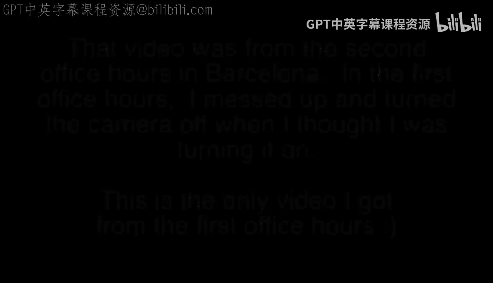
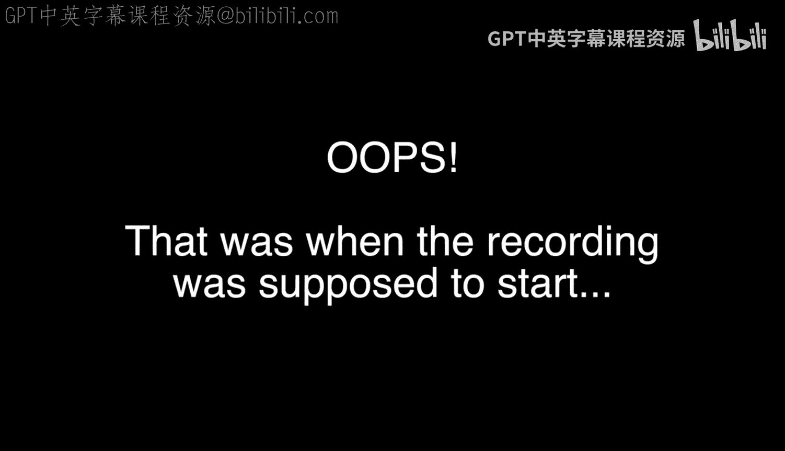

# 003：面对面办公时间-西班牙巴塞罗那

在本节课中，我们将回顾密歇根大学《Django for Everybody》课程在西班牙巴塞罗那举行的第二次面对面办公时间。本次会议旨在让课程的学生和讲师进行线下交流，分享学习经验。

## 会议开场与介绍

讲师首先向大家问好，并解释了本次是巴塞罗那的第二次办公时间。由于第一次会议的录像丢失，因此安排了这次额外的交流机会。

以下是参与本次办公时间的部分学生自我介绍：

*   Ia：计划开始学习互联网历史课程，并获得了相关的贴纸。她认为Python比PHP更酷。
*   el：正在学习Python，并且已经完成了相关的专题课程。
*   Christina：是一名语言学家，正在鼓励语言学领域的人学习Python。
*   co：正在学习Python。
*   Marta：正在学习Python专题课程，认为课程非常有趣，并强烈推荐给大家。
*   Sean：他有幸见到了Charles Severance教授（课程讲师），并认为其他同学会羡慕他们能与老师进行有趣的交流。
*   Teresa：她非常享受Python课程，并认为通过课程可以学到很多。

## 会议总结与结束

在大家自我介绍之后，讲师对本次在巴塞罗那与优秀学生们进行的成功办公时间表示满意。

他向大家致意，并期待下一次的会面。

---

本节课中我们一起学习了巴塞罗那线下办公时间的概况，通过学生们的自我介绍，我们看到了来自不同背景的学习者如何通过《Django for Everybody》课程探索Python和Web开发。这种线下交流为在线学习提供了宝贵的补充。