# Django for Everybody：4：Django中的所属行概述 🏷️

在本节课中，我们将要学习Django中的“所属行”概念。我们将探讨如何限制用户只能编辑或删除他们自己创建的数据行，同时允许所有用户查看这些数据。这是构建真实应用程序（如分类广告系统）时的常见需求。

---

## 什么是所属行？ 🤔

到目前为止，您编写的每个CRUD应用程序都允许登录用户编辑或删除所有数据行。在列表视图中，每个数据行旁边都会显示更新和删除按钮。

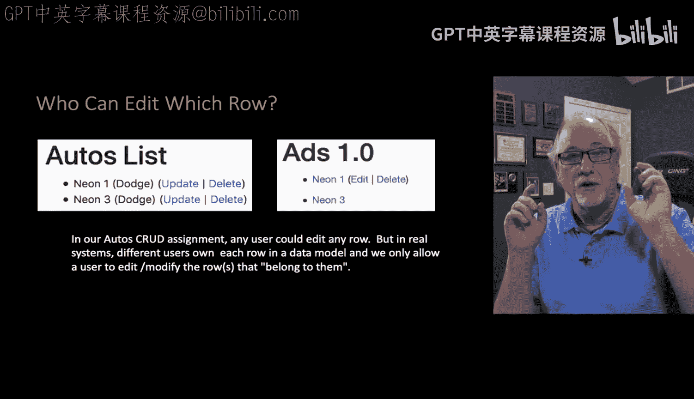

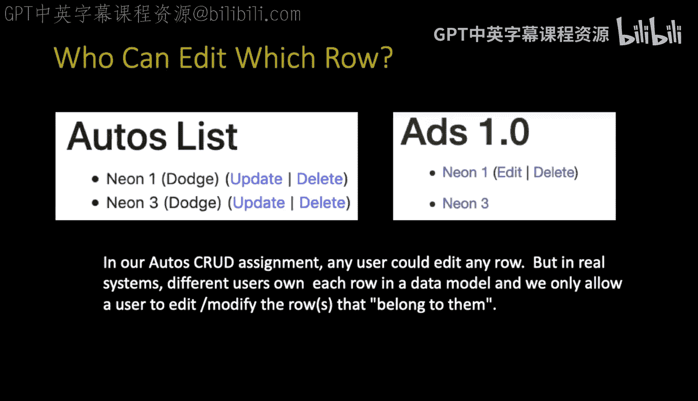

真实应用程序并非如此运作。例如，在构建分类广告系统时，某些广告属于您，某些广告属于其他人。您可以查看所有广告，但不能编辑所有广告。因此，我们需要决定何时显示编辑和删除按钮，并且只对数据行的所有者显示这些按钮。同时，我们必须防止用户通过其他方式编辑或删除他人的数据。

这就是“所属行”的概念：如果您拥有某一行数据，您将看到编辑或删除按钮；如果您不拥有该行数据，您只能查看该行数据。

---

## 回顾通用视图的使用 🔄

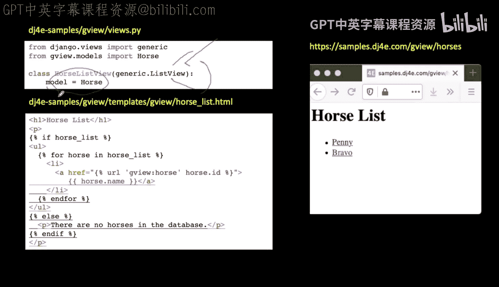

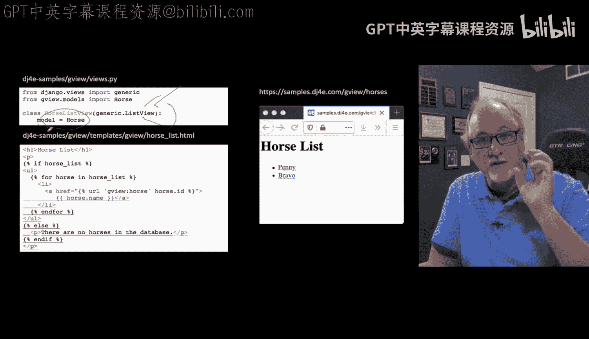

在之前的CRUD应用程序中，我们大量使用了Django提供的通用视图，特别是`generic.ListView`。通过一系列操作，我们最终得到了一个非常简单的视图。

例如，我们创建了一个`HorseListView`，它继承自`generic.ListView`。我们只需通过以下代码告知该视图使用哪个模型：

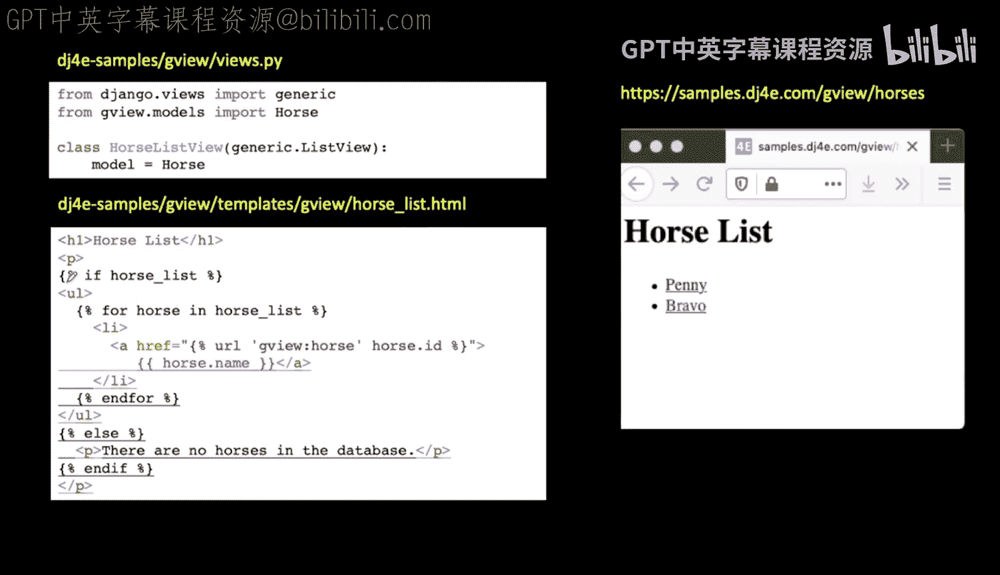

```python
class HorseListView(generic.ListView):
    model = Horse
```

`generic.ListView`包含数千行代码，我们通过继承并指定模型来利用其功能。之后，一系列约定开始生效：变量将被命名为`horse_list`，它是一个从数据库中检索出的模型对象列表。这使得代码非常简洁，减少了重复。每个视图看起来都很相似，如果您熟练掌握，可以快速进行此类更改。

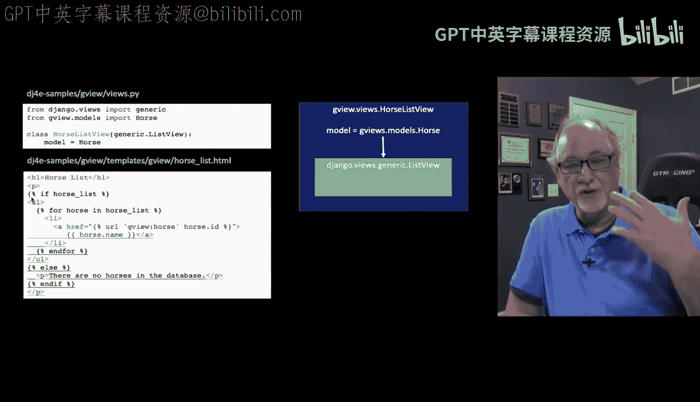

---

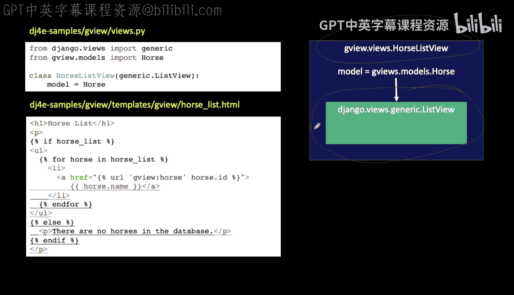

## 所属行视图的实现 🛠️

在所属行视图中，我们将采用类似的方法。我们将创建一个`Article`模型，并扩展`OwnerListView`。稍后我们将查看`OwnerListView`的内部实现，会发现它本身继承自`generic.ListView`，并通过`model = Article`来告知`OwnerListView`。

不同之处在于，`OwnerListView`是我们自己编写的代码。我们将为列表视图添加一个功能，然后扩展它，创建一个名为`OwnerListView`的新视图（或称为“所属行列表视图”）。这样，我们就拥有了处理所属行所需的一切。

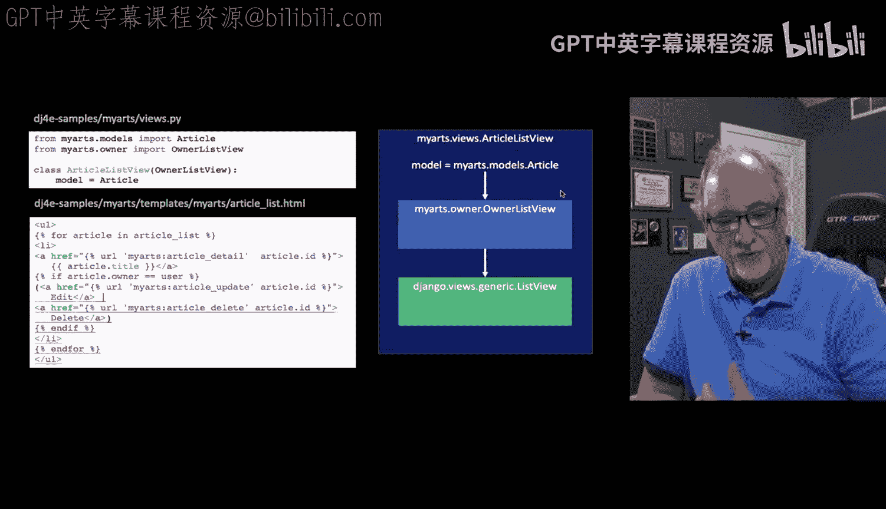

例如，每个`Article`都将有一个`owner`字段。如果该字段的值等于当前登录用户，我们将显示编辑和删除按钮；如果不等于，则不显示。但请注意，不显示链接并不意味着防止了编辑操作。稍后我们将展示如何实现编辑保护。

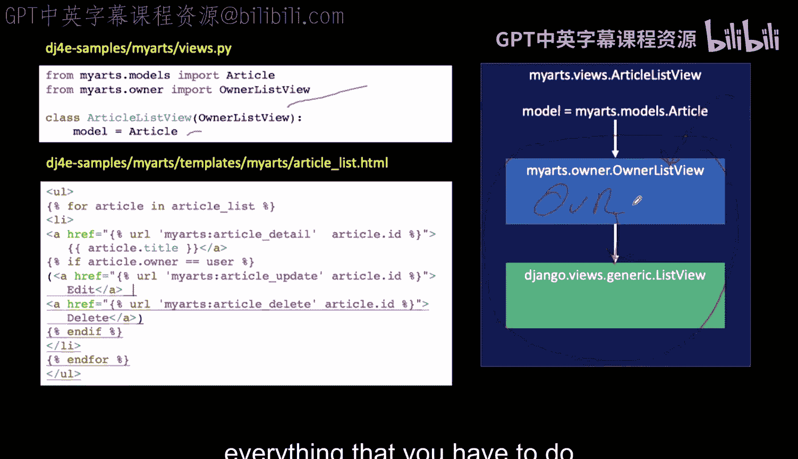

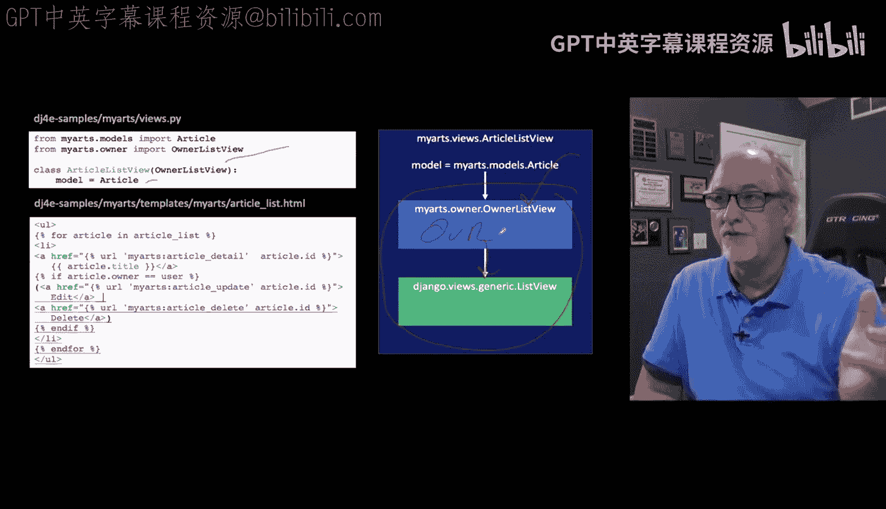

这是一个常见问题，我们希望避免在每个需要所属行功能的视图中编写数百行代码。因此，我们使用面向对象的技术来实现这一点。

---

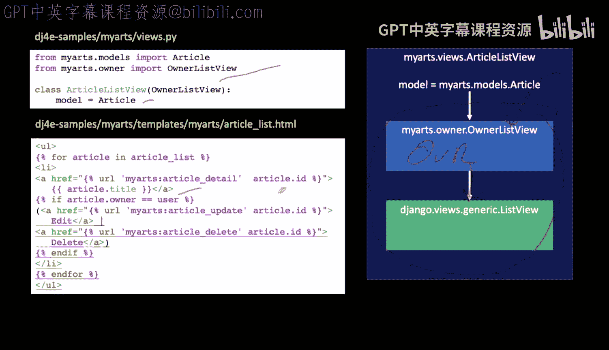

## 利用继承实现代码复用 📚

我们将使用继承来实现所属行功能。继承是面向对象编程中的一个概念：您有一个类，可以创建另一个类来继承父类的所有属性和方法，并扩展它，添加一些新功能。这是“不要重复自己”原则的另一种形式。

您可以在父类中实现一次通用功能，然后创建子类来扩展父类。子类（或称为派生类）是更专门化的类，它们继承父类的属性和方法，并可以引入自己的新功能。之后，我们使用子类来完成特定任务。

---

## 下一步：深入通用视图 🔍

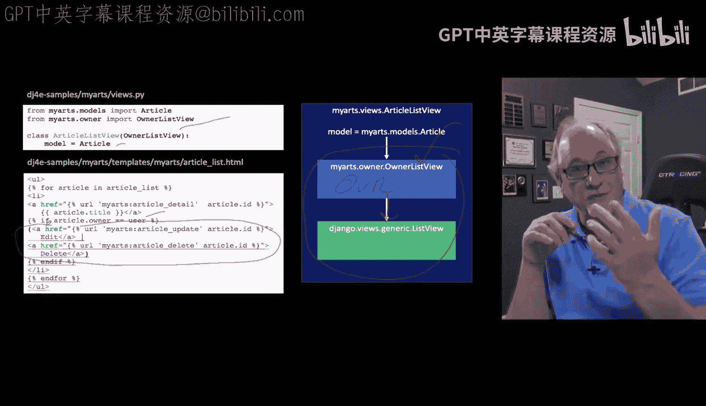

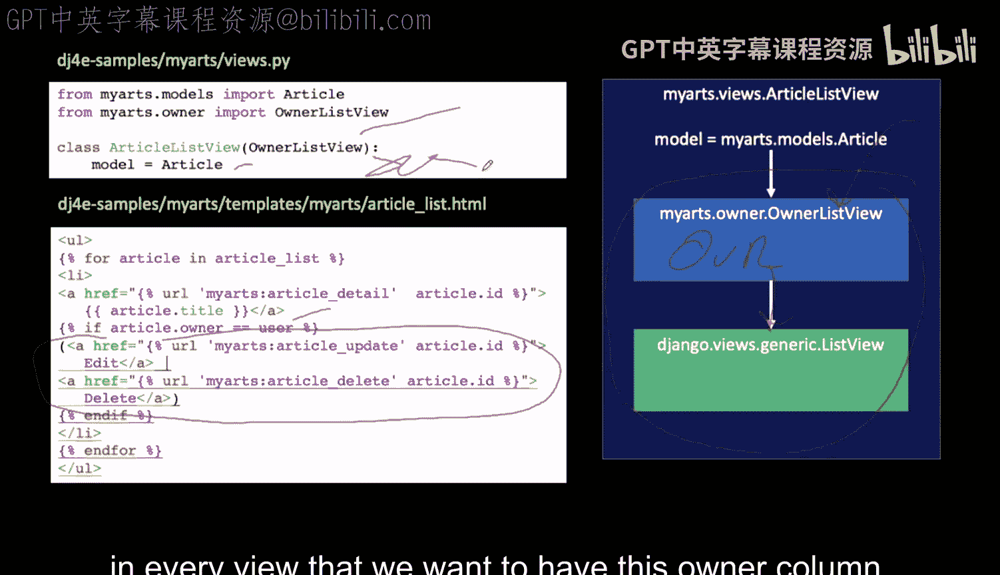

接下来，我们将探讨如何深入这些通用视图，并为它们添加我们自己的特殊功能。这将帮助我们更好地理解Django视图的工作机制，并能够根据需求进行定制。

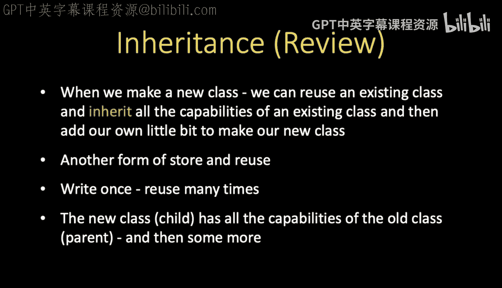

---

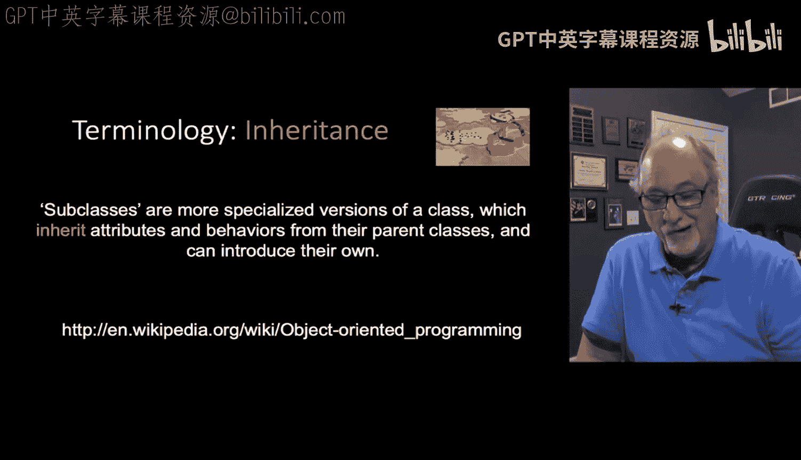

## 总结 📝

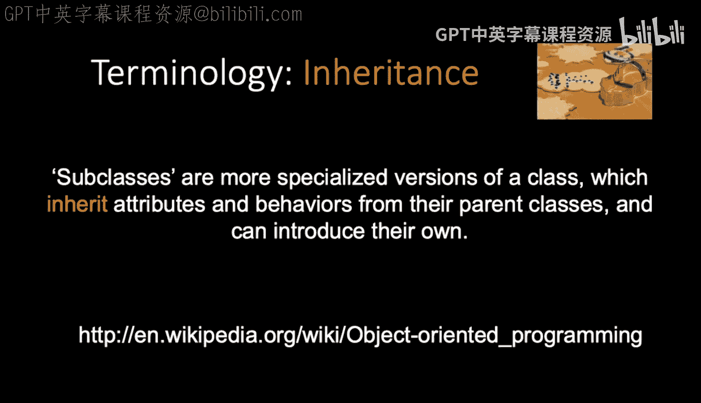

在本节课中，我们一起学习了Django中的“所属行”概念。我们了解了为什么在真实应用程序中需要限制用户只能编辑或删除他们自己的数据行。我们回顾了如何使用Django的通用视图，并探讨了如何通过继承`generic.ListView`来创建`OwnerListView`，以实现所属行功能。最后，我们讨论了面向对象编程中的继承概念，以及如何利用它来实现代码复用和功能扩展。